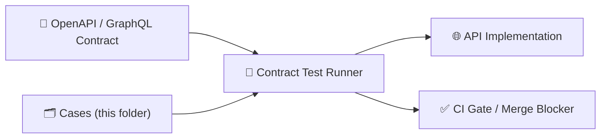

# 🧪 API Contract Test Cases


This folder contains **data-driven “known input → expected output”** fixtures used by the API **contract test runner**.

Contract cases exist to make it *hard to accidentally break clients* by changing responses, error shapes, headers, or redaction behavior.

---

## 🧭 What is a “contract case”?

A **contract case** is a deterministic snapshot of:

- ✅ a request (method/path/query/headers/body/auth context)
- ✅ the expected response (status/headers/body)
- ✅ optional match rules (ignore volatile fields, tolerate ordering, etc.)
- ✅ optional fixture requirements (seed data, mocked services, test dataset)

Think of each case as a **small, reviewable promise**:  
> “When the API receives *this* input, it must return *that* output.”

---

## 🧱 Where does the contract live?

These cases *execute* the contract — they do **not** define it.

- 📜 **OpenAPI / GraphQL** definitions are the canonical contract artifacts.
- 🧩 Contract changes should be tracked using the governed API contract workflow/template (see links below).

**Helpful paths (repo-root relative):**

| 🔗 Artifact | 📍 Path |
|---|---|
| 📜 API contracts (OpenAPI/GraphQL) | `src/server/contracts/` *(or your service’s `/contracts/` equivalent)* |
| 🧩 API contract change template | `docs/templates/TEMPLATE__API_CONTRACT_EXTENSION.md` |
| 🧪 Contract test runner | `api/tests/contract/` |

> Tip: When you add/modify an endpoint, update the **contract definition first**, then add/adjust cases here.

---

## 🔁 How these cases flow through CI



CI should treat failures here as **breaking changes** (unless the change is intentional and properly versioned).

---

## 🗂️ Recommended case layout

> The runner typically discovers cases by iterating directories under `cases/`.

```text
📁 api/tests/contract/cases/
├── 📘 README.md                              ← you are here (case index + conventions)
├── 📁 GET__v1_layers__happy_path/             ✅ GET /v1/layers → 200 (happy path)
│   ├── 🧾 meta.yml                            (case metadata: ids, tags, runner hints)
│   ├── 📤 request.json                        (fixture request: method/path/headers/body)
│   ├── 📥 expected.json                       (expected response: status/headers/body)
│   └── 📁 fixtures/                           ➕ optional (case-local setup/state)
│       └── 🌱 seed.graph.json                 ➕ optional (seed data for this case)
└── 📁 POST__v1_layers__invalid_body/          ❌ POST /v1/layers → 400 (invalid body)
    ├── 🧾 meta.yml                            (case metadata: ids, tags, runner hints)
    ├── 📤 request.json                        (fixture request: invalid payload/params)
    └── 📥 expected.json                       (expected error response)
```

### ✅ Naming convention

Use a folder name that is:

- stable ✅
- grep-friendly ✅
- diff-friendly ✅

Recommended format:

```
<METHOD>__<PATH_WITHOUT_SLASHES>__<scenario>
```

Examples:
- `GET__v1_layers__happy_path`
- `GET__v1_layers__requires_auth`
- `POST__v1_query__invalid_body_returns_422`

---

## 🧩 File formats

### `meta.yml` (case metadata)

Keep this lightweight — it’s primarily for humans + the runner.

```yaml
id: GET__v1_layers__happy_path
title: "List layers returns stable schema"
tags: [smoke, public, json]
contract:
  kind: openapi            # openapi | graphql
  ref: "src/server/contracts/openapi.yml#/paths/~1v1~1layers/get"
auth:
  mode: none               # none | user | service | admin
fixtures:
  - "fixtures/seed.graph.json"
notes: |
  This case is intentionally small: it validates response shape + header stability.
```

### `request.json` (what we send)

```json
{
  "method": "GET",
  "path": "/v1/layers",
  "query": {
    "limit": 2
  },
  "headers": {
    "Accept": "application/json"
  },
  "body": null
}
```

### `expected.json` (what must come back)

```json
{
  "status": 200,
  "headers": {
    "Content-Type": "application/json"
  },
  "body": {
    "items": [],
    "count": 0
  },
  "match": {
    "ignoreJsonPaths": [
      "$.meta.request_id",
      "$.meta.generated_at"
    ]
  }
}
```

> ⚠️ If you don’t have match/ignore support yet, keep expected bodies **fully deterministic** until the runner grows matchers.

---

## ✅ What to cover (minimum case set)

When adding a new endpoint (or changing an existing one), aim for:

### 1) Happy path (public / standard user) 🌞
- status 200/201
- stable headers
- stable body shape

### 2) Error shape (invalid inputs) 🧯
- validation error (400/422)
- not found (404)
- conflict (409) when relevant

### 3) Auth & access control 🔐
- missing auth
- insufficient role
- allowed role

### 4) Redaction / sensitive handling 🛰️
If the endpoint returns any location-like or sovereignty-classified data:
- verify redaction/generalization is applied as expected
- verify restricted details are **not** present

---

## 🧷 Case design rules

### Determinism (no flaky cases) 🎯
- Avoid timestamps, random IDs, and non-deterministic ordering.
- If your API returns volatile values, **ignore/match** them explicitly.
- Prefer small fixtures that make results stable.

### Backwards compatibility 🔁
- Prefer **additive changes** (new optional fields) over breaking shape changes.
- If you must break a response shape, create a **versioned endpoint** and add new cases for it (keep old cases passing).

### No secrets / no personal / no sensitive dumps 🛡️
- Never commit API keys, tokens, passwords, or secrets.
- Never commit real personal identifiers or sensitive coordinates into fixtures.
- Use placeholders like: `"<REDACTED>"`, `"<TOKEN>"`, `"<SENSITIVE>"`.

---

## 🧪 Updating cases when behavior changes

✅ If the change is intentionally **backwards-compatible**:
- update expected bodies (usually additive)
- keep old fields and shapes intact
- re-run contract tests and ensure no client break

⚠️ If the change is **breaking**:
- introduce a new API version or negotiation strategy
- add a new set of cases for the new version
- keep the old version’s cases passing until explicitly deprecated

---

## 🧰 Debugging a failing case

1. Confirm the **contract definition** (OpenAPI/GraphQL) matches what you intend.
2. Run the contract test runner against the *single case* (if supported).
3. Inspect differences:
   - headers (CORS, content-type, caching)
   - error envelope shape
   - ordering / unstable IDs
4. Fix the implementation **or** adjust the case only if the contract change is approved/versioned.

---

## 🔗 Related docs

- 📘 Master Guide (governance + contracts + CI gates): `docs/MASTER_GUIDE_v13.md`
- 🧩 API contract workflow: `docs/templates/TEMPLATE__API_CONTRACT_EXTENSION.md`
- ⚖ Governance & sovereignty: `docs/governance/`

---
✅ **Goal:** keep this folder small, deterministic, and brutally effective as a merge gate.
