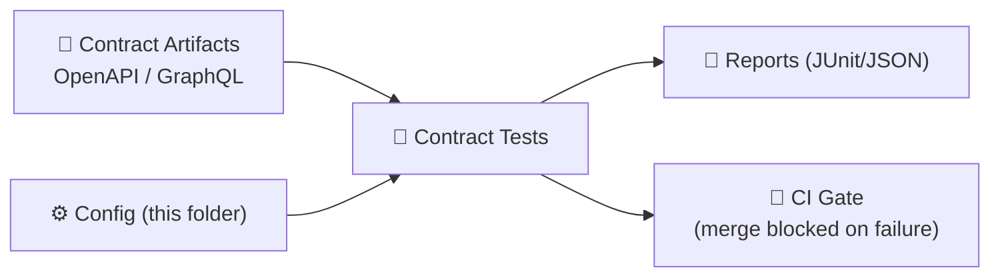

# ⚙️ API Contract Test Config


> [!NOTE]
> This folder contains **non-secret** configuration used by the **API contract test** suite.
> Keep secrets in **environment variables** / CI secret stores — not in git.

---

<details>
  <summary><strong>📚 Table of Contents</strong></summary>

- [🧭 Purpose](#-purpose)
- [📦 What belongs in `config/`](#-what-belongs-in-config)
- [🗂️ Suggested structure](#️-suggested-structure)
- [🧩 How config is resolved](#-how-config-is-resolved)
- [🧾 Config keys](#-config-keys)
- [🔐 Environment variables](#-environment-variables)
- [🧪 Running contract tests](#-running-contract-tests)
- [🚦 CI expectations](#-ci-expectations)
- [🧱 Adding/changing endpoints](#-addingchanging-endpoints)
- [🛡️ Governance & safety checks](#️-governance--safety-checks)
- [🆘 Troubleshooting](#-troubleshooting)

</details>

---

## 🧭 Purpose

Contract tests protect the **API boundary** by verifying that:

- endpoints respond with **known outputs for known inputs** ✅  
- the **OpenAPI / GraphQL contract** stays accurate ✅  
- changes remain **backwards-compatible** unless explicitly versioned ✅  
- redaction/classification rules are respected (no accidental leakage) ✅  

This `config/` directory exists so the contract suite can run consistently across:
- 👩‍💻 local dev
- 🤖 CI
- 🧪 ephemeral test environments (docker-compose / preview deploys)

---

## 📦 What belongs in `config/`

✅ Good candidates:
- environment-specific **base URLs**
- **timeouts**, retries, rate limits
- paths to **contract artifacts** (OpenAPI / GraphQL schema)
- fixture selection (dataset snapshot / seed)
- report output formats (JUnit, JSON, etc.)

🚫 Keep OUT of git:
- API keys, tokens, passwords
- database credentials
- private endpoint URLs

> [!WARNING]
> CI is expected to run secret scanning — a leaked token here can block merges and force rotation. 😬

---

## 🗂️ Suggested structure

> Adapt filenames to your runner, but keep the intent consistent.

```text
📁 api/
 └─ 📁 tests/
    └─ 📁 contract/
       ├─ 📁 config/               👈 you are here
       │  ├─ 📄 README.md
       │  ├─ 📄 default.yaml       # safe defaults (checked in)
       │  ├─ 📄 ci.yaml            # CI overrides (checked in)
       │  ├─ 📄 local.example.yaml # template only (checked in)
       │  └─ 📄 local.yaml         # developer overrides (gitignored)
       └─ 📁 cases/                # contract test cases / snapshots (typical)
```

> [!TIP]
> Prefer **one config “shape”** (YAML or JSON) and keep it stable; only environment values should vary.

---

## 🧩 How config is resolved

A common (recommended) precedence model:

1. `default.yaml` (baseline)
2. `{env}.yaml` (e.g., `ci.yaml`, `staging.yaml`)
3. `local.yaml` (developer-only; gitignored)
4. environment variables (secrets + last-mile overrides)

Example pseudo-flow:

```text
effective_config =
  merge(default.yaml,
        env.yaml,
        local.yaml,
        process.env)
```

---

## 🧾 Config keys

Below is a **runner-agnostic** key map you can use as a shared contract between:
- the test runner 🧪
- CI 🧩
- contributors 👥

> If your runner already has a schema, map these concepts to it.

| Key | Type | Required | Example | Notes |
|---|---:|:---:|---|---|
| `target.mode` | string | ✅ | `live` \| `mocked` | `mocked` is useful when CI runs against fixture data |
| `target.baseUrl` | string | ✅ | `http://localhost:8000` | Prefer env var override for CI |
| `contracts.openApiPath` | string | ⛔/✅ | `../../../../src/server/contracts/openapi.yaml` | Required if REST/OpenAPI is used |
| `contracts.graphQlSchemaPath` | string | ⛔/✅ | `../../../../src/server/contracts/schema.graphql` | Required if GraphQL is used |
| `auth.strategy` | string | ✅ | `none` \| `bearer` \| `apiKey` | Keep creds in env vars |
| `auth.tokenEnvVar` | string | ⛔/✅ | `KFM_API_TOKEN` | Required if `bearer` |
| `timeouts.requestMs` | number | ✅ | `10000` | Keep CI slightly higher than local |
| `retries.count` | number | ✅ | `1` | Avoid masking real regressions |
| `fixtures.profile` | string | ⛔ | `minimal-fixture` | Helps deterministic responses |
| `fixtures.seed` | number | ⛔ | `1337` | Only if your system uses seeded generators |
| `reporting.junitPath` | string | ⛔ | `./artifacts/contract.junit.xml` | CI-friendly output |
| `reporting.jsonPath` | string | ⛔ | `./artifacts/contract.report.json` | Debug-friendly output |

### 📄 Example config (YAML)

```yaml
# default.yaml
target:
  mode: live
  baseUrl: ${KFM_API_BASE_URL:-http://localhost:8000}

contracts:
  openApiPath: ../../../../src/server/contracts/openapi.yaml
  # graphQlSchemaPath: ../../../../src/server/contracts/schema.graphql

auth:
  strategy: bearer
  tokenEnvVar: KFM_API_TOKEN

timeouts:
  requestMs: 10000

retries:
  count: 1

fixtures:
  profile: minimal-fixture
  seed: 1337

reporting:
  junitPath: ./artifacts/contract.junit.xml
  jsonPath: ./artifacts/contract.report.json
```

> [!NOTE]
> `${VAR:-fallback}` syntax depends on your loader. If your runner doesn’t support this, keep raw values here and do env var substitution in the runner.

---

## 🔐 Environment variables

| Variable | Required | Example | Purpose |
|---|:---:|---|---|
| `KFM_CONTRACT_ENV` | ⛔ | `local` / `ci` | selects `{env}.yaml` |
| `KFM_API_BASE_URL` | ✅ | `http://localhost:8000` | where tests run |
| `KFM_API_TOKEN` | ⛔/✅ | `***` | bearer token (if needed) |

> [!TIP]
> Add a `.env.example` at the **API root** (not here) to document required env vars without storing secrets.

---

## 🧪 Running contract tests

The exact command depends on the runner, but the *pattern* should be consistent.

### ✅ Typical local run

```bash
export KFM_CONTRACT_ENV=local
export KFM_API_BASE_URL=http://localhost:8000
export KFM_API_TOKEN="…optional…"

# run the contract test suite (your project’s command)
# e.g. make test-contract
# e.g. npm run test:contract
# e.g. poetry run pytest -m contract
```

### ✅ Typical CI run

```bash
export KFM_CONTRACT_ENV=ci
export KFM_API_BASE_URL="$CI_DEPLOYED_API_URL"
export KFM_API_TOKEN="$CI_SECRET_TOKEN"

# run contract suite (same entrypoint as local)
```

---

## 🚦 CI expectations

Contract tests are a **merge gate**:
- the API is built and deployed (or run with mocked data)
- OpenAPI / GraphQL contracts are linted
- contract tests verify responses with known inputs  
- failures block merges until resolved ✅



---

## 🧱 Adding/changing endpoints

When you add or change an API endpoint, keep the flow contract-first:

1. ✍️ Update the contract artifact (OpenAPI / GraphQL schema)
2. 🧪 Add/adjust contract test coverage (known inputs → expected outputs)
3. ⚙️ If needed, extend config keys (avoid breaking existing keys)
4. 🧭 If breaking, **version** the endpoint (don’t silently break existing clients)
5. ✅ Ensure CI passes (lint + contract tests + scans)

### ✅ Definition of Done (DoD) checklist

- [ ] No secrets added to config (or anywhere in git)
- [ ] Contract artifact updated **and** valid
- [ ] Contract tests updated to match the change
- [ ] If breaking: new versioned route / negotiation strategy added
- [ ] Reports generated (JUnit/JSON) in CI artifacts
- [ ] No sensitive/covert data appears in public responses (redaction honored)

---

## 🛡️ Governance & safety checks

Contract tests are an ideal place to enforce “no surprises” rules like:

- 🔎 **No PII** or sensitive attributes in responses unless explicitly allowed
- 🗺️ **Sensitive locations** are generalized/withheld when required
- 🏷️ **Classification doesn’t downgrade** across transformations or endpoints
- 🧼 Redaction rules remain stable even when schemas evolve

> [!IMPORTANT]
> Treat these checks as part of the API’s public contract — not “extra tests”.

---

## 🆘 Troubleshooting

| Symptom | Likely cause | Fix |
|---|---|---|
| “Schema lint failed” | missing response schema / incomplete OpenAPI | update contract artifact first |
| 401/403 everywhere | token missing/expired | set `KFM_API_TOKEN` (or switch auth strategy) |
| Flaky response fields | non-deterministic fixtures | use stable fixture profile + seeded data |
| CI passes locally but fails in CI | base URL / env mismatch | confirm `KFM_CONTRACT_ENV` + `KFM_API_BASE_URL` in CI |
| Sensitive fields appear | redaction regression | add explicit contract assertions; fix API boundary logic |

---

### 🧠 Philosophy (why we’re strict)

The KFM pipeline treats **schemas + API specs as first-class artifacts** and expects **contract tests** to catch regressions early — especially at the API boundary where downstream UI/narratives depend on stable behavior. ✅