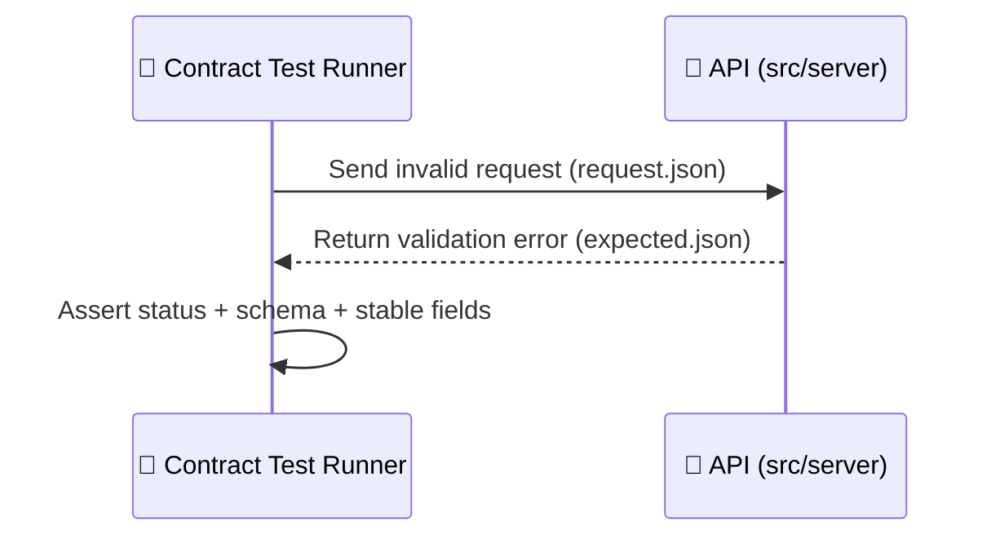

# 🚫 Validation Error — Contract Fixture


This folder is the **negative-path** contract fixture for **request validation failures** (bad params / bad body / bad headers) for:

> `api/tests/contract/fixtures/<operationId-or-route-slug>/cases/validation-error/`

---

## 🎯 Why this exists

KFM treats the **API contract (OpenAPI)** as the truth, and CI runs **API contract tests** against known inputs/outputs to prevent accidental breaking changes. This fixture exists to make sure we *don’t only test happy paths* — we also lock in how the API responds when the client sends an invalid request.

✅ If this case fails unexpectedly, it usually means:
- request validation changed (schema/rules drift),
- error envelope changed,
- or the endpoint started returning a different status/shape (breaking clients).

---

## 🧭 What “validation error” means here

Use this case when the request violates the endpoint contract, for example:

- ❌ Missing required query/path/header/body field
- ❌ Wrong type (string instead of number, object instead of array, etc.)
- ❌ Invalid format (UUID/date/email/etc.)
- ❌ Enum violation (`"foo"` not in `["bar","baz"]`)
- ❌ Constraint violation (`minLength`, `minimum`, `maxItems`, etc.)

> ✅ **Golden rule:** this case should fail **before business logic** runs.  
> If you’re getting `401/403/404/500`, your request is triggering the wrong layer.

---

## 🗂️ Expected folder shape

> The exact filenames may vary depending on the contract-test harness for this repo — **follow the conventions used in sibling cases for this same operation**.

A typical layout looks like:

```text
📁 api/tests/contract/fixtures/                                🧰 contract fixture root
└── 📁 <operationId-or-route-slug>/                            🧭 one operation (slug = operationId/route)
    └── 📁 cases/                                              🧪 scenario folders for this operation
        └── 📁 validation-error/                               🚫 invalid request → validation failure
            ├── 📄 README.md                                   👈 you are here
            ├── 📄 request.json                                ❌ intentionally invalid request
            ├── 📄 expected.json                               ✅ expected error response (status + body)
            └── 📄 notes.md                                    📝 optional: why this case exists / historical context
```
---

## 📦 What goes into `request.json`

Your `request.json` should be *intentionally invalid* and *minimal*.

### ✅ Design rules

- **Break only ONE rule at a time**  
  (so the failure is unambiguous and stable)
- **Make the invalidity obvious**  
  `"_invalid_"`, `"not-a-uuid"`, `-1`, empty string, etc.
- **Avoid auth failures masking validation**
  - If the endpoint requires auth, include whatever *test-safe* auth header your harness expects.
  - Never commit real tokens/secrets.

### ✳️ Example (illustrative)

```json
{
  "pathParams": { "id": "not-a-uuid" },
  "query": { "limit": -1 },
  "headers": { "content-type": "application/json" },
  "body": { "title": "" }
}
```

> ⚠️ Your harness might split these into multiple files (e.g., `query.json`, `body.json`).  
> Keep the structure consistent with other cases in the same `fixtures/<operationId-or-route-slug>/cases/`.

---

## ✅ What goes into `expected.json`

`expected.json` defines what the contract test should assert for this invalid request.

### ✅ Minimum expectations

- **Status code** matches the OpenAPI contract for validation errors  
  (commonly `400` or `422` — use *whatever the spec declares* for this operation)
- **Response content-type** is consistent (usually JSON)
- **Error envelope shape** matches the shared error schema (whatever the API contract uses)
- **No internal leakage** (stack traces, SQL errors, file paths, secrets)

### ✳️ Example error envelope (illustrative)

```json
{
  "status": 400,
  "headers": {
    "content-type": "application/json"
  },
  "body": {
    "error": {
      "code": "VALIDATION_ERROR",
      "message": "Request validation failed.",
      "issues": [
        { "path": "path.id", "rule": "format", "message": "Must be a UUID." },
        { "path": "query.limit", "rule": "minimum", "message": "Must be >= 0." },
        { "path": "body.title", "rule": "minLength", "message": "Cannot be empty." }
      ]
    }
  }
}
```

> ✅ **Stability tip:** keep `issues[]` ordering deterministic (e.g., sorted by `path`) so tests don’t flap.

---

## 🧩 Contract-first checklist

Before you consider this case “done”:

- [ ] The OpenAPI operation declares a validation-error response (`400` or `422`) with a concrete schema  
- [ ] `request.json` fails validation for exactly one clear reason (or a stable, intentional set)
- [ ] The server returns the documented status code (not `500`)
- [ ] The response matches the contract error schema (shape + types)
- [ ] No secrets, PII, or sensitive coordinates appear in fixtures or error bodies
- [ ] Tests pass locally and in CI

---

## 🧠 Common pitfalls (and how to avoid them)

<details>
  <summary><strong>🤦 I expected a validation error but got 401/403</strong></summary>

Your request didn’t make it to validation (or auth runs first). Fix by:
- providing the expected test auth header for this endpoint, **or**
- choosing a validation failure that occurs pre-auth (if your API is designed that way).

</details>

<details>
  <summary><strong>🤦 I expected 400 but got 422 (or vice versa)</strong></summary>

That’s not a “test problem” — it’s a **contract mismatch**.
- Check what the OpenAPI spec says for this operation.
- Make the implementation + fixture align to the spec.

</details>

<details>
  <summary><strong>🤦 Tests are flaky because error messages differ slightly</strong></summary>

Prefer asserting:
- stable machine fields (`code`, `issues[].path`, `issues[].rule`)
- stable, generic `message` strings

Avoid:
- dynamic timestamps
- request IDs (unless the harness supports matchers/ignores)
- raw validator library strings that change between versions

</details>

---

## 🔁 Quick mental model



---

## ✨ If you need more coverage

If one “validation-error” fixture is not enough for this endpoint, prefer **multiple sibling case folders** to keep each failure atomic:

```text
📁 cases/
  📁 validation-error-missing-required/
  📁 validation-error-invalid-enum/
  📁 validation-error-bad-format/
```

Each folder should contain its own `request.json`, `expected.json`, and (optional) `README.md`.

---

## 🧷 Notes

- The **API contract definitions** live under `src/server/` (often `src/server/contracts/` or similar). Keep the spec + fixtures + implementation in sync.
- Treat fixtures like governed artifacts: deterministic, replayable, and safe-to-share.

