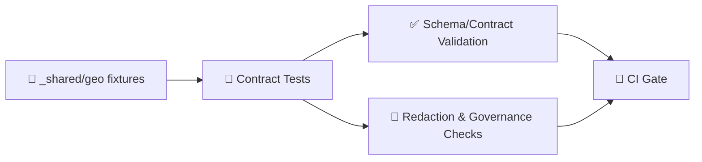

# 🧭 Shared Geo Fixtures

<kbd>api</kbd> <kbd>contract-tests</kbd> <kbd>fixtures</kbd> <kbd>geo</kbd> <kbd>GeoJSON</kbd> <kbd>EPSG:4326</kbd>

This folder contains **shared, reusable geospatial fixtures** used across the API **contract test** suite.

The intent is to keep the **API boundary stable, reproducible, and testable** when endpoints accept or return geospatial data (e.g., GeoJSON payloads, spatial filters like bounding boxes, or map/tile outputs). In KFM, the API layer is explicitly treated as a *contract + redaction boundary*, so these fixtures are part of the “known inputs / expected outputs” set that defends backwards compatibility. 🛡️🗺️

---

## ✨ What belongs here?

A “geo fixture” is any **file-based, deterministic** geospatial input or expected output that multiple contract tests can reuse.

Typical contents:

- 🧩 **GeoJSON** geometry/Feature/FeatureCollection payloads (`.geojson`)
- 📦 **Spatial filter payloads** like bbox, radius, polygon filters, etc. (`.json`)
- 🧱 **Expected responses** for geo endpoints (JSON or GeoJSON)
- 🧊 (Optional) **Binary artifacts** for geospatial endpoints (e.g., map tiles) if the contract includes them

> 🔎 Note: KFM’s API outputs are usually JSON, but geospatial endpoints may return GeoJSON or even binary tiles depending on the route. Keep fixtures aligned to the contract for that endpoint.

---

## 🗂️ Suggested folder layout

> This folder is `_shared`, so keep it **generic** and **reusable**. If a fixture is highly endpoint-specific, it should live in that endpoint’s fixture folder instead.

```text
api/tests/contract/fixtures/_shared/geo/
├── 📄 README.md
├── 📁 geojson/        # canonical geometries & FeatureCollections
├── 📁 filters/        # bbox / polygon / radius / etc request bodies or query payloads
├── 📁 responses/      # expected GeoJSON/JSON response bodies
└── 📁 tiles/          # optional: xyz params and/or image tiles if the contract returns them
```

---

## 🧱 Core conventions

### 🌍 CRS + coordinate order

- **Default CRS:** Use **WGS84 / EPSG:4326** for GeoJSON unless the contract explicitly says otherwise.
- **Coordinate order:** GeoJSON coordinates are **`[longitude, latitude]`** (degrees).

✅ Keep coordinates small, obvious, and within valid ranges:
- `lon ∈ [-180, 180]`
- `lat ∈ [-90, 90]`

> ⚠️ CRS gotcha: A GeoJSON-ish payload in **EPSG:3857** can be mistakenly interpreted as **EPSG:4326** by tooling if you’re not careful. If you *must* include non-4326 fixtures, label them loudly in the filename and/or folder.

### 📦 Bounding boxes

Use a single canonical ordering everywhere in fixtures:

- **`bbox = [minLon, minLat, maxLon, maxLat]`** (degrees, EPSG:4326)

Include at least one “edge” bbox scenario in fixtures for robust contract coverage:
- tiny bbox (single neighborhood scale)
- large bbox (regional scale)
- invalid bbox (min > max) for 4xx contract validation
- (optional) anti-meridian crossing scenario **only if** your API supports it

### 🎯 Deterministic + portable by default

Contract fixtures should be:
- ✅ **Deterministic**: no randomness, no time-dependent data, no “now()”
- ✅ **Small**: minimal coordinate counts that still prove behavior
- ✅ **Portable**: no dependency on external services or live databases
- ✅ **Stable**: changes are intentional and tied to contract/schema changes

### 🧼 Valid geometry

Whenever the API promises “valid geometry” (or relies on spatial ops), keep fixtures valid:
- polygons have closed rings
- no self-intersections unless the fixture is intentionally “invalid geometry” for negative tests
- holes (if included) are well-formed

If you add **invalid** geometry fixtures, put them in a clearly labeled folder like:
- `geojson/invalid/…`
…and document the expected error shape.

---

## 🧪 How contract tests use these fixtures



Common patterns:
- **Request fixtures** are loaded and sent as bodies/query params.
- **Response fixtures** are used for:
  - schema validation (shape)
  - snapshot testing (stable JSON)
  - semantic checks (e.g., “returned FeatureCollection has N features”)

---

## 🧰 Loading fixtures (copy/paste snippets)

### 🟦 Node / TypeScript (example)

```ts
import { readFileSync } from "node:fs";
import path from "node:path";

export function loadJsonFixture(relPath: string) {
  const p = path.join(__dirname, relPath);
  return JSON.parse(readFileSync(p, "utf8"));
}

// Example:
// const featureCollection = loadJsonFixture("../fixtures/_shared/geo/geojson/point__example.geojson");
```

### 🐍 Python (example)

```py
from pathlib import Path
import json

def load_json_fixture(rel_path: str):
    p = Path(__file__).parent / rel_path
    return json.loads(p.read_text(encoding="utf-8"))

# Example:
# fc = load_json_fixture("../fixtures/_shared/geo/geojson/point__example.geojson")
```

---

## 🧩 Recommended fixture catalog

Use fixtures to cover both “happy path” and boundary conditions that commonly break geo APIs.

<details>
<summary><strong>📍 Points</strong> (click to expand)</summary>

- ✅ inside a known polygon/area
- ✅ outside area (expect empty results)
- ✅ on boundary line (expect stable rule: include/exclude)
- ✅ near another point (distance-based queries)

</details>

<details>
<summary><strong>📏 Lines</strong> (click to expand)</summary>

- ✅ simple LineString (2–4 vertices)
- ✅ MultiLineString (if supported)
- ✅ line that crosses a bbox boundary

</details>

<details>
<summary><strong>🟩 Polygons</strong> (click to expand)</summary>

- ✅ simple polygon (rectangle-ish)
- ✅ polygon with a hole (if supported)
- ✅ multipolygon (two disjoint areas)
- 🚫 invalid self-intersection polygon (negative test fixture)

</details>

<details>
<summary><strong>🧊 Bounding boxes</strong> (click to expand)</summary>

- ✅ tiny bbox (high precision)
- ✅ large bbox (performance boundary; still small fixture)
- 🚫 invalid bbox (min > max) → contract should return a stable 4xx error body

</details>

---

## 🗺️ Mini example GeoJSON

Use examples like this for quick local sanity checks (and as a pattern for new fixtures):

```json
{
  "type": "FeatureCollection",
  "features": [
    {
      "type": "Feature",
      "id": "point__example__wgs84",
      "properties": { "label": "example point", "kind": "test-fixture" },
      "geometry": { "type": "Point", "coordinates": [-96.500000, 39.000000] }
    },
    {
      "type": "Feature",
      "id": "poly__example__wgs84",
      "properties": { "label": "example polygon", "kind": "test-fixture" },
      "geometry": {
        "type": "Polygon",
        "coordinates": [[
          [-96.510000, 39.010000],
          [-96.490000, 39.010000],
          [-96.490000, 38.990000],
          [-96.510000, 38.990000],
          [-96.510000, 39.010000]
        ]]
      }
    }
  ]
}
```

---

## ➕ Adding or updating fixtures

### ✅ Checklist

- [ ] Fixture is **small** and **deterministic**
- [ ] CRS is **EPSG:4326** unless explicitly required otherwise
- [ ] File name communicates intent (type + scenario + CRS)
- [ ] No sensitive/PII-bearing content (see “Safety & governance” below)
- [ ] Contract tests reference the fixture via stable relative paths
- [ ] If the fixture changes an expected response shape, the related contract/schema is updated

### 🏷️ Naming (recommended)

Use a pattern that is searchable and self-documenting:

- `point__<scenario>__wgs84.geojson`
- `polygon__<scenario>__wgs84.geojson`
- `bbox__<scenario>__wgs84.json`
- `invalid__<reason>__wgs84.geojson`

---

## 🔐 Safety & governance notes

Even though these are “just tests”, they are still repo artifacts. Treat them as public-facing unless the repo explicitly segregates restricted material.

**Rules of thumb:**
- ✅ Prefer **synthetic** or **clearly non-sensitive** coordinates
- ✅ If you need “sensitive location” behavior for redaction tests, use **fabricated coordinates** and document the intent
- 🚫 Do not add real personal addresses, precise sensitive sites, or anything that could be misused

---

## 🔗 Related docs (project paths)

- `docs/MASTER_GUIDE_v13.md` — canonical repo structure + invariants
- `docs/templates/TEMPLATE__API_CONTRACT_EXTENSION.md` — how API changes are proposed
- `docs/standards/` — schema/profile references (STAC/DCAT/PROV), governance constraints

---

<!--
Sources (grounding notes for this README; kept in comments to avoid clutter):

- “Contract-first” + “Deterministic pipeline” definitions (KFM principles):
  :contentReference[oaicite:0]{index=0}

- CI contract tests + governance scanning (API responses tested against known inputs; sensitive-location scanning):
  :contentReference[oaicite:1]{index=1}

- KFM API formats (JSON generally; GeoJSON / map tiles for geospatial/bulk):
  

- GeoJSON default CRS context (WGS84 / EPSG:4326) and CRS confusion warning (EPSG:3857 interpreted as EPSG:4326):
  
  

- PostGIS as a common geospatial engine in KFM context (spatial queries/functions used):
  

- Test isolation/idempotency principles (fixture-driven tests should be stable and independent):
  :contentReference[oaicite:6]{index=6}
-->

