# 🧭 Geo Filter Fixtures (Shared)


Reusable geospatial filter payloads for **API contract tests** ✅  
This folder exists so geo-query behavior stays **consistent**, **readable**, and **governed** across the API surface.

> [!IMPORTANT]
> **Treat fixtures as public.** No secrets. No PII. No protected/sensitive coordinates.  
> Contract tests run as CI gates — if you change geo filtering behavior, update the **contract + fixtures + tests** together.

---

## 📚 Table of contents

- [🎯 Purpose](#-purpose)
- [🔒 CI gates & why fixtures matter](#-ci-gates--why-fixtures-matter)
- [🗂️ What lives here](#️-what-lives-here)
- [🧱 Suggested layout](#-suggested-layout)
- [🧬 Fixture contract](#-fixture-contract)
- [🗺️ Common geo filter shapes](#️-common-geo-filter-shapes)
- [🧪 Using a fixture in contract tests](#-using-a-fixture-in-contract-tests)
- [➕ Adding a new fixture](#-adding-a-new-fixture)
- [✅ Validation checklist](#-validation-checklist)
- [🧯 Common pitfalls](#-common-pitfalls)
- [🔗 References](#-references)

---

## 🎯 Purpose

Geo filters are easy to get subtly wrong (CRS, coordinate order, polygon validity, edge cases). Contract tests should be **about intent**, not copy/pasted geometry blobs.

This directory centralizes:
- 🧩 **Reusable geo filter fragments** (shared across endpoints)
- 🧪 **Deterministic test inputs** (stable against seeded/mock test data)
- ⚖️ **Governance-safe** geometries (no sensitive location leakage)

---

## 🔒 CI gates & why fixtures matter

Contract tests are a **non-negotiable gate**: endpoints must keep responding as the contract specifies for known inputs.  
In addition, automated scans may flag secrets, PII, or sensitive/protected coordinates.

> [!NOTE]
> If a geo filter change breaks an existing contract test, that’s a *signal* — either:
> - you introduced a breaking change (needs versioning + coordinated updates), or
> - you changed behavior unintentionally (fix the regression).

---

## 🗂️ What lives here

This folder contains **geo filter fragments**, not full request bodies.

✅ A fixture here should represent the **geo filter object** you plug into a request, typically as:

- **Nested filter style** (common in “filters” APIs):
  ```json
  { "filters": { "geo": <fixture> } }
  ```

- **STAC-like search style** (when the contract expects geo keys at the top-level body):
  ```json
  { ...<fixture>, "limit": 10 }
  ```

> [!TIP]
> If you’re unsure which shape an endpoint expects:
> 1) check the endpoint’s **OpenAPI/GraphQL** contract, and  
> 2) check the relevant **JSON Schema** (or type definitions) used by the API boundary.

---

## 🧱 Suggested layout

```text
📁 api/tests/contract/fixtures/_shared/geo/filters/
├── 📄 README.md
├── 📁 valid/            ✅ should pass validation
│   ├── 🧾 (your fixtures).json
│   └── ...
└── 📁 invalid/          ❌ should fail validation (400/422/etc.)
    ├── 🧾 (your fixtures).json
    └── ...
```

If your repo currently keeps fixtures flat (no `valid/` / `invalid/`), that’s fine — the naming convention below still works.

---

## 🧬 Fixture contract

### ✅ File format

- **Preferred:** `.json` (strict JSON — no comments)
- **Allowed (sparingly):** `.geojson` (Feature / FeatureCollection) when a full GeoJSON object is more readable
- **Avoid:** very large polygons, high-precision noise, or “real world” sensitive locations

### ✅ CRS + coordinate order

- **CRS:** WGS84 / EPSG:4326 unless the contract explicitly says otherwise
- **Coordinate order:** **longitude, latitude** → `[lon, lat]`

> [!CAUTION]
> A classic failure mode is lat/lon swapped.  
> For Kansas-scale examples, `lon` is typically around **-102 .. -94** and `lat` around **37 .. 40**.

### ✅ Geometry hygiene

- Polygons must be **valid** and **closed** (first coordinate == last coordinate)
- Prefer simple geometries:
  - fewer vertices (aim: < 50)
  - ~5–6 decimal places max (more precision rarely improves contract coverage)

### ⚖️ Governance & safety (FAIR+CARE / sovereignty-aware)

- Do **not** include coordinates for protected sites or culturally sensitive data
- If you must test “restricted area” behavior:
  - use generalized bounding boxes, or
  - use redacted/synthetic polygons that still exercise the logic

---

## 🗺️ Common geo filter shapes

> [!NOTE]
> The exact keys and structure are determined by the endpoint’s schema.  
> The examples below are **canonical patterns**, not guarantees.

### 1) Bounding box (`bbox`)

**Intent:** “Return results intersecting this rectangle.”

```json
{
  "bbox": [-102.051744, 36.993016, -94.588413, 40.003166]
}
```

**Notes**
- order: `[minLon, minLat, maxLon, maxLat]`
- keep it as tight as possible while still testing seeded data behavior

### 2) GeoJSON geometry (`intersects` / `within`)

**Intent:** “Return results intersecting / within this geometry.”

```json
{
  "intersects": {
    "type": "Polygon",
    "coordinates": [
      [
        [-96.0000, 39.0000],
        [-96.0000, 39.1000],
        [-95.9000, 39.1000],
        [-95.9000, 39.0000],
        [-96.0000, 39.0000]
      ]
    ]
  }
}
```

> [!TIP]
> Prefer small synthetic polygons for contract tests. Save real boundaries for integration tests against controlled datasets.

### 3) Point + radius (`near` / `within_distance`)

Only use if the contract explicitly supports it.

```json
{
  "near": {
    "point": [-95.675157, 39.048333],
    "radius_m": 10000
  }
}
```

---

## 🧪 Using a fixture in contract tests

### Mermaid view of the flow 🧩

```mermaid
flowchart LR
  F[🧾 geo fixture] --> T[🧪 contract test]
  T -->|HTTP request| A[🌐 API boundary]
  A -->|validate| C[📜 contract + schemas]
  A --> R[📦 response]
  R --> T
```



### TypeScript / Node example

```ts
import { readFileSync } from "node:fs";
import { join } from "node:path";

const geo = JSON.parse(
  readFileSync(
    join(__dirname, "../fixtures/_shared/geo/filters/valid/valid__bbox__kansas_statewide.json"),
    "utf8"
  )
);

// Typical nested style:
const body = {
  filters: {
    geo,
  },
};
```

### Python example

```py
import json
from pathlib import Path

geo = json.loads(
    Path(__file__).resolve()
      .parent
      .joinpath("..", "fixtures", "_shared", "geo", "filters", "valid", "valid__bbox__kansas_statewide.json")
      .read_text(encoding="utf-8")
)

body = {"filters": {"geo": geo}}
```

> [!IMPORTANT]
> Don’t mutate fixture objects in-place inside tests.  
> Clone/copy before tweaking per-test so fixtures remain reusable and deterministic.

---

## ➕ Adding a new fixture

1) **Start from the contract**
- Find the endpoint schema (OpenAPI/GraphQL + JSON Schema/type)
- Confirm field names, types, coordinate order, and validation rules

2) **Pick a deterministic scenario**
- The geometry should produce stable results against seeded/mock test data
- Avoid “depends on what’s in production today” cases

3) **Create the fixture**
- Put it under `valid/` or `invalid/`
- Keep it minimal (small, readable)
- Use the naming convention below

4) **Write/extend contract tests**
- Assert **status code + response shape + key invariants**
- Avoid fragile assertions based on ordering or incidental fields

5) **Pass governance checks**
- Verify no sensitive coordinates or restricted data patterns

### 🏷️ Naming convention

Use double-underscores to stay grep-friendly and avoid long folder nesting:

`<validity>__<filter_kind>__<scenario>__<notes>.json`

Examples:
- `valid__bbox__kansas_statewide.json`
- `valid__intersects__small_polygon__hits_seeded_layer.json`
- `invalid__bbox__swapped_latlon.json`
- `invalid__intersects__self_intersection.json`

If you use `valid/` and `invalid/` folders, you *may* omit the `<validity>__` prefix (but keeping it is fine).

---

## ✅ Validation checklist

- [ ] JSON parses cleanly
- [ ] CRS is as the contract specifies (default: EPSG:4326)
- [ ] Coordinate order is `[lon, lat]`
- [ ] Polygons are valid + closed rings
- [ ] Geometry is small + readable (no huge real-world boundaries)
- [ ] Scenario is deterministic against seeded/mock test data
- [ ] Fixture is safe (no secrets, PII, sensitive/protected coordinates)
- [ ] Tests assert contract behavior (not implementation details)

---

## 🧯 Common pitfalls

- 🔁 **Lat/Lon swapped** (Kansas “lon” should be negative ~ -100)
- 🧮 **EPSG:3857** meters sneaking in (numbers look like `-10600000, 4500000`)
- 🧷 **Unclosed polygon rings** (first != last point)
- 🧵 **Self-intersections** in polygons (invalid geometry)
- 🎯 **Overly precise coordinates** creating noisy diffs and brittle assertions
- 🧪 **Fixture mutation** causing cross-test contamination

---

## 🔗 References

> This README is nested deep in the repo. Most repo-root links require: `../../../../../../../`

- 📜 API boundary & contract definitions: `../../../../../../../src/server/`
- 🧩 JSON Schemas: `../../../../../../../schemas/`
- 🗺️ STAC profile (if present): `../../../../../../../docs/standards/KFM_STAC_PROFILE.md`
- ⚖️ Governance:
  - `../../../../../../../docs/governance/SOVEREIGNTY.md`
  - `../../../../../../../docs/governance/ETHICS.md`

