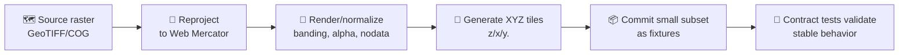

<!-- According to a document from 2025-12-28: these shared fixtures exist to support KFM's contract-first + deterministic-pipeline approach. -->

# Raster Tile Fixtures 🗺️🧪


**Path:** `api/tests/contract/fixtures/_shared/geo/tiles/raster/`

> Shared “golden” raster map tiles (image tiles) used by **API contract tests** to validate stable request/response behavior for raster tile endpoints.

---

## What lives here 📦

This folder contains **small, versioned raster tile pyramids** (or subsets of pyramids) that are:

- ✅ **Stable** inputs/outputs for contract tests (no network calls, no third‑party tile providers).
- ✅ **Deterministic** fixtures (intended to be reproducible when regenerated).
- ✅ **Shared** across multiple test suites (that’s why it’s under `_shared/`).

Not intended for:
- ❌ Production basemap storage
- ❌ Large imagery datasets
- ❌ Ad-hoc “random” test images

---

## Expected tile conventions 🧭

### Tile addressing (XYZ)
Tiles are organized using the standard **XYZ** convention:

- `z` = zoom level  
- `x` = tile column  
- `y` = tile row  
- URL template / file layout commonly follows: `.../{z}/{x}/{y}.<ext>`

> ⚠️ **XYZ vs TMS gotcha:** if you see tiles “vertically flipped,” you might be mixing **XYZ** with **TMS** (which inverts `y`).

### Projection / CRS (Web maps)
For web-map rendering, raster tiles are typically served in **Web Mercator** (commonly referenced as `EPSG:3857`).

- Backend data may exist in `WGS84` (`EPSG:4326`) but must be transformed for web map display.
- Fixtures in this folder should match whatever the raster tile API contract serves (most often Web Mercator).

### Format
Common fixture formats:
- `png` ✅ (best for crisp/linework + deterministic output)
- `jpg/jpeg` ✅ (common for imagery, but compression can introduce variability if not controlled)
- `webp` ⚠️ (only if the API explicitly contracts it)

---

## Folder layout 🗂️

This is the **recommended structure** (don’t treat the names as literal unless they exist in the repo):

```text
📁 api/tests/contract/fixtures/_shared/geo/tiles/raster/
├── 📄 README.md
├── 📄 manifest.json              (optional but recommended ✅)
└── 📁 <tileset_id>/              (ex: historical_1880s_map, hillshade_demo, etc.)
    ├── 📁 0/
    │   └── 📁 0/
    │       └── 🖼️ 0.png
    ├── 📁 1/
    │   ├── 📁 0/
    │   │   ├── 🖼️ 0.png
    │   │   └── 🖼️ 1.png
    │   └── 📁 1/
    │       ├── 🖼️ 0.png
    │       └── 🖼️ 1.png
    └── 📁 ...
```

### Optional: `manifest.json` 🧾
If you add or regenerate fixtures, a lightweight manifest makes contract fixtures safer and easier to maintain.

Suggested fields:
- `tileset_id`
- `format` (`png`, `jpg`, …)
- `scheme` (`xyz`)
- `crs` (`EPSG:3857`)
- `minzoom`, `maxzoom`
- `bounds` (if known)
- `generator` + `version`
- `source` + `license`
- `sha256` hashes (if tests assert byte-stability)

---

## How contract tests should use these fixtures ✅

Contract tests should treat these tiles as **known inputs/outputs**:

Typical assertions:
- 📌 Endpoint returns expected HTTP status codes (`200`, `404`, etc.)
- 📌 `Content-Type` matches contract (`image/png`, `image/jpeg`, …)
- 📌 Tile addressing resolves correctly (`{z}/{x}/{y}`)
- 📌 Optional: caching headers (`ETag`, `Cache-Control`) if part of the contract
- 📌 Optional: body matches fixture bytes **or** matches fixture hash/pixel decode

> 💡 Recommendation: If your API pipeline could re-encode images, prefer comparing **hashes** or **decoded pixels** instead of raw bytes (unless byte-for-byte stability is a hard contract requirement).

---

## Adding or updating fixtures 🛠️

### ✅ Checklist (PR-friendly)
- [ ] Keep fixture sets **small** (only the zooms/tiles needed to prove the contract).
- [ ] Prefer “representative” tiles:
  - edges (coastlines/borders)
  - non-empty + empty tiles
  - multiple zoom levels (at least 2)
- [ ] Avoid sensitive content (see governance section below 🔒).
- [ ] If you regenerate: note toolchain + versions (ideally in `manifest.json`).
- [ ] Update or add contract tests to reference the new tileset(s).

### Naming tips 🏷️
Use stable, descriptive `tileset_id` folder names:
- ✅ `historical_map_1867_demo`
- ✅ `ndvi_sample_lowzoom`
- ❌ `tiles2`
- ❌ `newtiles_final_v3`

---

## Regenerating tiles (repeatable workflow) 🔁

KFM documentation describes generating **map tile pyramids** by cutting a georeferenced raster into zoomable XYZ tiles, served via an XYZ tile folder or tile service.

A typical reproducible pipeline looks like:



### Example (GDAL-based)
> Use any tiler that produces **XYZ `{z}/{x}/{y}`** output and matches your API contract.

```bash
# 1) Reproject/normalize to Web Mercator (common web map CRS)
# (Example only; adjust resampling, nodata, extent, etc.)
gdalwarp -t_srs EPSG:3857 -r bilinear input.tif work_3857.tif

# 2) Generate XYZ tiles (example tool; pick what the project standardizes on)
gdal2tiles.py -z 0-6 -w none work_3857.tif ./<tileset_id>/
```

> 🧠 Determinism tip: pin tool versions (Docker or lockfiles), and avoid “current timestamp” metadata injection in outputs.

---

## Governance & sensitivity 🔒

Even though these are “just test fixtures,” they still live in the repo and are subject to automated checks.

**Do not add:**
- secrets, tokens, API keys
- PII
- sensitive locations or restricted layers unless properly generalized/redacted and explicitly approved

If a fixture might be sensitive, treat it like any other governed artifact: document it, constrain it, and ensure it complies with project policy.

---

## Troubleshooting 🧯

**Tiles render but appear shifted**
- Likely CRS mismatch (`EPSG:4326` vs `EPSG:3857`) or incorrect geotransform.

**Tiles are vertically flipped**
- Likely XYZ vs TMS `y` orientation mismatch.

**Contract tests fail after “innocent” regeneration**
- Compression/encoding settings changed (especially JPEG).
- Different renderer versions.
- Slight resampling differences (bilinear vs cubic).
- Alpha premultiplication changes.

**Repo size ballooned**
- Too many zoom levels / too many tiles. Keep fixtures minimal.

---

## Related ideas 🔗

- If you’re working with **vector tiles**, look for a sibling folder like:
  - `api/tests/contract/fixtures/_shared/geo/tiles/vector/`
- If you’re defining tile endpoints, keep the **contract-first** principle: update contracts + tests together.

