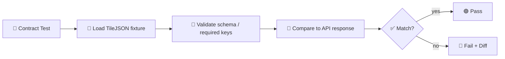

# 🗺️ TileJSON Fixtures (Contract Tests)


> ✅ **Purpose:** This directory contains **shared TileJSON response fixtures** used by API **contract tests**.  
> 🧊 Keep these fixtures *boring*: deterministic, stable, and **free of secrets**.

---

## 📦 What lives in this folder?

TileJSON is a small JSON document that tells map clients (MapLibre/Leaflet/etc.) **how to request tiles** and what metadata applies (zoom range, bounds, attribution, vector layers, etc.).

In contract tests, these fixtures act like **golden samples**:
- 🧪 validate response **shape** and **required fields**
- 🧩 validate **types** and **ranges** (e.g., `minzoom <= maxzoom`)
- 🔗 validate URL templating patterns like `.../{z}/{x}/{y}.png` / `.../{z}/{x}/{y}.pbf`
- 🧭 keep clients stable (UI expects predictable metadata)

---

## 🧱 Where this fits in the fixture hierarchy

```text
📦 api/
└── 🧪 tests/
    └── 📜 contract/
        └── 🧰 fixtures/
            └── 🧩 _shared/
                └── 🗺️ geo/
                    └── 🧱 tiles/
                        └── 🧾 tilejson/
                            ├── 📄 README.md   👈 you are here
                            └── 📄 *.json      (TileJSON fixtures)
```

---

## 🎯 Fixture goals (what we’re optimizing for)

### ✅ 1) Contract stability
Fixtures should change **only** when the contract changes (or when we intentionally tighten/clarify it).

### ✅ 2) Deterministic diffs
A one-line logic change should not cause a 400-line fixture diff. Prefer:
- stable key ordering
- stable array ordering
- stable numeric precision

### ✅ 3) Environment neutrality
Fixtures should **not** depend on:
- machine-specific hostnames
- real internal domains
- real API keys / tokens
- region-specific infrastructure defaults

Use safe placeholder hosts like:
- `https://tiles.example.test/...`
- `http://localhost/...` (only if tests explicitly run locally)

---

## 🏷️ Recommended naming convention

We don’t assume specific filenames exist here. For new fixtures, use a naming pattern that answers:

**What layer? what kind? which variant?**

✅ Suggested:
```text
<layerId>.<kind>.<variant>.tilejson.json
```

Examples:
- `kansas_basemap.vector.happy.tilejson.json`
- `ndvi_2020.raster.happy.tilejson.json`
- `parcels.vector.with-vector_layers.tilejson.json`
- `invalid.missing-tiles.error.tilejson.json` (only if you keep negative fixtures here)

**Quick tips**
- `kind`: `vector` or `raster`
- `variant`: `happy`, `with-bounds`, `no-center`, `with-legend`, `with-vector_layers`, etc.
- If a fixture is meant for a specific endpoint version, append `v1`, `v2`, etc.

---

## ✅ Contract expectations (practical rules)

> These are **testing-oriented expectations** — not a full spec rewrite.

### 🔒 Required (for most tile clients)
- `tilejson` *(string)* — TileJSON version identifier (commonly `"2.2.0"`)
- `tiles` *(string[])* — array of URL templates
- `minzoom` *(number/integer)* — minimum supported zoom
- `maxzoom` *(number/integer)* — maximum supported zoom

### 🧭 Strongly recommended
- `name` *(string)* — human label
- `bounds` *(number[4])* — `[west, south, east, north]` (WGS84 lon/lat)
- `attribution` *(string)* — legal attribution for the dataset/provider
- `scheme` *(string)* — usually `"xyz"` (if present)

### 🧩 Vector-only (when applicable)
- `vector_layers` *(object[])* — describe MVT layer names + fields (if your clients rely on it)

### 🧊 Determinism rules (important for tests)
- Keep `tiles` ordering stable (even if multiple URLs exist)
- Keep `vector_layers` ordering stable
- Avoid time-varying strings (timestamps, request IDs, signed URLs)
- If you must include floats (`bounds`, `center`), keep consistent precision

---

## 🧪 How contract tests typically use these fixtures



### 🧩 Common test patterns
- **Schema validation**: ensure response conforms to a JSON Schema for TileJSON
- **Snapshot/golden comparison**: compare response to fixture (with targeted normalization)
- **Partial matching**: compare only stable keys, ignore runtime keys

---

## ✍️ Adding or updating a TileJSON fixture

### 1) Capture a “real” response (if applicable)
If you’re basing fixtures on a real endpoint response, capture it once and then normalize:

```bash
curl -sS "http://localhost:PORT/path/to/tilejson" > raw.tilejson.json
```

### 2) Normalize JSON for stable diffs
Recommended: sort keys and format consistently.

```bash
jq -S . raw.tilejson.json > <layerId>.<kind>.<variant>.tilejson.json
```

> 💡 If your test runner already normalizes JSON before comparison, still keep fixtures pretty — it improves code review.

### 3) Update tests + run locally
- run only contract tests first (fast)
- then run full suite (safe)

### 4) If the contract changed…
- 🧾 update the **contract definition / schema** first
- 🧪 update fixtures second
- 🔁 bump versioning **if it’s a breaking change**

---

## 🧨 Common gotchas (and how to avoid them)

### ❌ Signed/expiring URLs in `tiles`
If your service emits signed URLs, tests will flake.

✅ Prefer fixtures that use:
- a stable host (placeholder)
- stable paths
- no querystrings (unless explicitly tested)

---

### ❌ `minzoom` / `maxzoom` mismatch
Clients often assume `minzoom <= maxzoom`.

✅ Make it explicit and keep zooms realistic.

---

### ❌ Bounds are flipped
Bounds are **lon/lat**, not lat/lon:
```text
[west, south, east, north]
```

✅ Example:
```json
"bounds": [-102.051, 36.993, -94.588, 40.003]
```

---

## 🔐 Security & privacy checklist

Before committing fixtures:
- [ ] no API keys, tokens, signed URLs, cookies
- [ ] no internal hostnames (`*.corp`, private load balancers, etc.)
- [ ] no user identifiers / emails / PII
- [ ] attribution strings don’t leak internal names (unless intentionally public)

---

## 🧾 Minimal examples (copy-friendly)

<details>
<summary>🧩 Minimal <strong>Vector</strong> TileJSON (MVT)</summary>

```json
{
  "tilejson": "2.2.0",
  "name": "Example Vector Layer",
  "scheme": "xyz",
  "tiles": [
    "https://tiles.example.test/tiles/example-vector/{z}/{x}/{y}.pbf"
  ],
  "minzoom": 0,
  "maxzoom": 14,
  "bounds": [-102.051, 36.993, -94.588, 40.003],
  "attribution": "© Example Provider",
  "vector_layers": [
    {
      "id": "example",
      "description": "Example vector layer",
      "fields": {
        "id": "Number",
        "name": "String"
      }
    }
  ]
}
```
</details>

<details>
<summary>🖼️ Minimal <strong>Raster</strong> TileJSON</summary>

```json
{
  "tilejson": "2.2.0",
  "name": "Example Raster Layer",
  "scheme": "xyz",
  "tiles": [
    "https://tiles.example.test/tiles/example-raster/{z}/{x}/{y}.png"
  ],
  "minzoom": 0,
  "maxzoom": 12,
  "bounds": [-102.051, 36.993, -94.588, 40.003],
  "attribution": "© Example Provider"
}
```
</details>

---

## 🔗 References (external)

- TileJSON spec (reference implementation + fields): https://github.com/mapbox/tilejson-spec  
- MapLibre GL JS sources (TileJSON/tiles patterns): https://maplibre.org/maplibre-gl-js/docs/

---

## ✅ “Definition of done” for changes in this folder

- [ ] fixtures are deterministic (stable ordering + formatting)
- [ ] fixtures are environment-neutral (no secrets / no internal infra)
- [ ] contract tests updated (and pass)
- [ ] if contract changed: versioning + compatibility strategy addressed 🔁

---

