# 🧩 Vector Tile Fixture — `<another-tile-set-id>`


-blue)


📍 **Path:** `api/tests/contract/fixtures/_shared/geo/tiles/vector/<another-tile-set-id>/`  
⬅️ Back to index: [`../README.md`](../README.md)

> ✅ **Goal:** a *small*, *deterministic*, *offline-friendly* vector tile set used by **API contract tests**.  
> 🔁 If you need a breaking change (layers/fields/zooms), **make a new folder (new tile-set-id)** instead of mutating this one.

---

## 🎯 Purpose

This directory packages a **known-good vector tile set** so contract tests can verify:
- the API serves tiles correctly (status codes, headers, content-type),
- clients can render them (MapLibre is explicitly used for high-performance vector-tile rendering in the project stack).:contentReference[oaicite:0]{index=0}
- fixtures remain portable: the project docs call out **TileJSON** and **MBTiles** as convenient formats for tiled data delivery.:contentReference[oaicite:1]{index=1}

---

## 🧱 Fixture contract

### ✅ Invariants (do not change)
- **Tile Set ID** = directory name: `<another-tile-set-id>`
- **Tile addressing** uses the conventional `{z}/{x}/{y}` pattern (XYZ-style).:contentReference[oaicite:2]{index=2}
- **Layer names** are stable and documented (tests shouldn’t “guess”).
- **Field names + types** are stable (schema drift breaks contracts).
- **Deterministic outputs** (stable IDs / stable ordering / no timestamps embedded).

### 🚫 Breaking changes (create a new tile-set-id)
- rename/add/remove a layer
- rename a field or change its type
- change `minzoom`/`maxzoom`
- change geometry types (Point ↔ LineString ↔ Polygon)
- change tiling scheme / coordinate assumptions

---

## 📦 What’s inside

The project explicitly supports serving tiled data via **TileJSON or MBTiles**.:contentReference[oaicite:3]{index=3}  
So this fixture should provide either (A) a single MBTiles file, or (B) a TileJSON + extracted tiles layout.

### Option A — MBTiles bundle (recommended) 📦
- One `*.mbtiles` file containing tiles (compact, easy to version, easy to load in tests).

### Option B — Loose tiles (ok for tiny fixtures) 🧩
- A directory tree of `{z}/{x}/{y}.mvt` tiles (diff-friendly, but more files).

### Suggested layout 🗂️
```text
📁 <another-tile-set-id>/
├── 📄 README.md
├── 🧾 tilejson.json              # recommended (client-facing contract)
├── 📦 tiles.mbtiles              # recommended (or omit if using loose tiles)
├── 📁 tiles/                     # optional (loose tiles form)
│   └── 📁 {z}/{x}/{y}.mvt
└── 🧾 schema.layers.md           # recommended (human + test clarity)
```

---

## 🗺️ TileJSON expectations

TileJSON acts as the “map-facing contract” (especially for MapLibre clients):
- `tiles`: URL template(s) (usually includes `{z}/{x}/{y}`)
- `minzoom`, `maxzoom`
- `bounds` (if known)
- `vector_layers`: **highly recommended** (documents layer schema)

> MapLibre is a first-class renderer in this project’s visualization stack, so a TileJSON file keeps fixtures aligned with real-world clients.:contentReference[oaicite:4]{index=4}

---

## 🧬 Layers & schema

Fill in the table below so expectations stay explicit (and contract tests can anchor to stable IDs).

| Layer name | Geometry | Required properties | Notes |
|---|---|---|---|
| `<layer_name>` | `Point/LineString/Polygon` | `id`, `name`, … | `<what this represents>` |
| `<layer_name>` | `…` | `…` | `…` |

**Rules of thumb**
- Keep properties **minimal** (only what tests need).
- Prefer **stable identifiers** (`id`, `fid`, `slug`).
- Avoid float chaos when possible (round values or test tolerances).

---

## 🔁 How this fits the KFM pipeline

The broader project pipeline uses **Python + GDAL + GeoPandas + PyProj** and is designed to run reproducibly (including containerized execution).:contentReference[oaicite:5]{index=5}

This fixture is the “downstream artifact” that protects the API boundary while pipelines evolve.

```mermaid
flowchart LR
  A["📥 Source vectors<br/>GeoJSON / Shapefile"] --> B["🛠️ Processing<br/>GDAL / GeoPandas / PyProj"]
  B --> C["🧱 Tiling<br/>MVT generator"]
  C --> D["📦 Outputs<br/>TileJSON + MBTiles"]
  D --> E["🧪 Contract fixtures<br/>this folder"]
  E --> F["🚀 API responses<br/>&#123;z&#125;/&#123;x&#125;/&#123;y&#125;.mvt"]
```



---

## ✅ Quick sanity checks

### 1) Does it render?
Open the TileJSON in a MapLibre viewer (or the repo’s UI if wired up). MapLibre is called out as the project’s vector-tile renderer.:contentReference[oaicite:6]{index=6}

### 2) Is the zoom range intentional?
The KFM docs discuss generating tile pyramids for efficient serving; fixtures should keep zooms minimal and purposeful to stay stable and fast.:contentReference[oaicite:7]{index=7}

### 3) Is the `{z}/{x}/{y}` URL template correct?
The KFM docs reference the conventional tile URL pattern `.../{z}/{x}/{y}.png` (same addressing convention for MVT paths).:contentReference[oaicite:8]{index=8}

---

## 🧪 Test guidance (contract-style)

Prefer **behavioral guarantees** over brittle byte snapshots:

✅ Good assertions
- correct HTTP status (200/404/etc.)
- correct `Content-Type` for MVT responses
- tile decodes as valid MVT
- expected layers exist
- expected “anchor” features exist (by stable ID) at a known `{z,x,y}`

⚠️ Risky assertions
- raw byte equality (gzip wrappers, metadata ordering, encoder differences)

---

## 🧾 Provenance & licensing

Document where this fixture data came from (even if synthetic). The repo docs emphasize discoverable structure for tests and governed assets.:contentReference[oaicite:9]{index=9}

- Source dataset(s): `<add links / filenames>`
- License(s): `<SPDX id if possible>`
- Transform notes: `<simplification, clipping, filtering, etc.>`

---

## 🔗 Project references

- KFM Mapping Hub Design (MapLibre + TileJSON/MBTiles) :contentReference[oaicite:10]{index=10}  
- KFM Technical Documentation (tile URL patterns, pyramids) :contentReference[oaicite:11]{index=11}  
- Repo Markdown / layout guide (where tests live) :contentReference[oaicite:12]{index=12}  

