# 🧱 Vector Tile Fixtures (MVT) — Shared Contract-Test Data


-orange)
-success)

> [!NOTE]
> This folder contains **shared** vector-tile fixtures used by **API contract tests**. These tiles are intentionally small and deterministic so CI can validate tile endpoints reliably.

---

## 📍 Location

`api/tests/contract/fixtures/_shared/geo/tiles/vector/`

---

## 🎯 Purpose

Contract tests should validate tile endpoints using **known inputs → expected outputs** (stable across machines, time, and CI runners). These fixtures act as the “golden bytes” (or “golden decoded content”) for vector-tile responses.

> [!IMPORTANT]
> If you change a tile endpoint response shape/headers/content, **update the contract tests + fixtures together**. Otherwise CI should fail (that’s the point). ✅

---

## 🧠 What “Vector Tiles” Means Here

These fixtures represent **Mapbox Vector Tiles (MVT)** delivered as **Protocol Buffer (PBF)** payloads.

Typical response headers (your API contract is the source of truth):
- `Content-Type: application/vnd.mapbox-vector-tile` *(common)*
- or `Content-Type: application/x-protobuf`
- optionally `Content-Encoding: gzip` if tiles are served compressed

> [!TIP]
> Keep fixtures in the same encoding/compression mode your contract tests assert against. Don’t “helpfully” gzip/unzip tiles unless the tests expect it.

---

## 🧭 Tile Scheme & Coordinate Rules

### 🗺️ Addressing
Fixtures should mirror the API request scheme (commonly **XYZ**):
- `/{z}/{x}/{y}`

> [!WARNING]
> Some systems use **TMS** (flipped Y). If your endpoint uses TMS, ensure fixture placement matches *that* scheme. Don’t mix.

### 🌐 CRS / Projection
For web-map overlays, tiles are expected in **Web Mercator** (**EPSG:3857**). Source data may be stored in WGS84 (**EPSG:4326**) but must be transformed at system boundaries (DB → tile render → web).  

### 📐 Tile Extent
Most MVT encoders use an extent of **4096**. If your generator uses a different extent, tests should assert accordingly.

---

## 📦 Expected Layout

This directory is `_shared`, meaning “re-usable by many tests.” Keep it tidy and predictable.

A recommended layout (adapt if the repo already has a standard):
```text
📁 api/tests/contract/fixtures/_shared/geo/tiles/vector/
├─ 📄 README.md                       👈 you are here
├─ 📁 <tile-set-id>/                  (one logical set per endpoint/layer/style)
│  ├─ 📄 metadata.json                (optional but recommended)
│  └─ 📁 z/
│     └─ 📁 x/
│        └─ 🧩 y.mvt                  (or .pbf / .mvt.gz depending on contract)
└─ 📁 <another-tile-set-id>/
```

### ✅ Recommended `<tile-set-id>` conventions
Use lowercase, hyphenated IDs describing **what** the tile validates:
- `soil-types-overlay`
- `treaty-boundaries`
- `ndvi-preview`
- `demo-layer-minimal`

Avoid:
- `test1`, `new`, `tmp`, `kansas2` 🙃

---

## 🧪 How Contract Tests Use These Fixtures

```mermaid
flowchart LR
  A[🧪 Contract test] --> B[🌐 Call tile endpoint]
  B --> C[📦 API returns MVT bytes]
  C --> D[🔎 Assert headers]
  C --> E[🧩 Decode tile]
  E --> F[✅ Assert layers / feature counts / properties]
  F --> G[🧷 Compare to fixture expectations]
```



### 🔍 Typical assertion strategies
Pick one (or combine), based on stability needs:

- **Header-level contract**: content-type, caching headers, gzip, etc.
- **Decode & assert semantics** *(recommended)*:
  - layer names exist
  - feature counts match
  - key properties exist and types match
  - geometry types match (Point/LineString/Polygon)
- **Byte-for-byte equality** *(fragile)*:
  - only use if your generation pipeline is perfectly deterministic
  - tiny changes in encoder version/options can break this

---

## 🛠️ Adding / Updating Fixtures

> [!IMPORTANT]
> Fixtures should be generated from **reproducible** steps (scriptable), not “hand-exported once and forgotten.”

### 1) Choose the smallest meaningful case
- Prefer **one tile** over a pyramid
- Prefer **low zoom** unless you’re testing simplification/generalization behavior
- Keep feature counts small (fast decode, stable assertions)

### 2) Generate tiles via the project’s geospatial stack
KFM supports map-serving approaches like:
- Map server publishing (e.g., GeoServer / similar)
- Converting layers to **vector tiles** (e.g., MBTiles or PBF) for client-side rendering

Use whichever path the service under test actually uses.

### 3) Save into the correct scheme
- Ensure `z/x/y` matches the endpoint convention (XYZ vs TMS)
- Ensure the file extension matches what the test harness expects

### 4) Add/Update metadata (recommended)
If you include `metadata.json`, keep it focused and test-usable, e.g.:

```json
{
  "id": "soil-types-overlay",
  "scheme": "xyz",
  "crs": "EPSG:3857",
  "tiles": [
    { "z": 8, "x": 58, "y": 98, "file": "8/58/98.mvt" }
  ],
  "expected": {
    "layers": ["soil_types"],
    "min_feature_count": 1
  }
}
```

### 5) Update contract tests alongside fixtures
- Update expected layer names / counts / required properties
- If this represents a breaking behavior change, follow contract versioning rules

---

## 🧾 Determinism, Governance, and Safety

This repo’s philosophy is **contract-first** + **deterministic pipelines**. Fixtures must reflect that:

### ✅ Must-haves
- Deterministic results for a given fixture set
- No timestamps/random IDs embedded in expected outputs (unless explicitly tested)
- Small file sizes; fast to load in CI

### 🚫 Never commit
- Secrets (API keys, tokens)
- PII or sensitive personal data
- Sensitive locations or restricted datasets without appropriate generalization/redaction
- Huge tile pyramids / full-state datasets (belongs in data pipelines, not unit/contract fixtures)

> [!WARNING]
> If the source dataset has a restrictive classification, derived fixtures must **not** be less restricted. When in doubt: use synthetic geometries.

---

## 🧰 Debugging Tips

### “My tile renders in the UI but tests fail”
Common culprits:
- Wrong `Content-Type`
- Gzip mismatch (served compressed vs fixture stored uncompressed)
- XYZ vs TMS Y-flip mismatch
- CRS mismatch (EPSG:4326 vs EPSG:3857)
- Encoder option drift (extent, simplification, buffer)

### “How do I quickly inspect a tile?”
Options:
- Load it in a tile viewer / devtool that can decode MVT
- Decode in tests and print:
  - layer list
  - per-layer feature counts
  - a few sample properties (avoid dumping entire tile)

---

## ✅ Fixture Quality Checklist

<details>
<summary>🧪 Click to expand</summary>

- [ ] Tile is **small** and scoped to the behavior under test  
- [ ] Scheme (**XYZ/TMS**) matches the endpoint  
- [ ] CRS is **EPSG:3857** for web maps  
- [ ] Contract tests assert **semantics**, not brittle byte equality *(unless intentional)*  
- [ ] No secrets / PII / restricted data leakage  
- [ ] If the fixture is updated, tests are updated in the same PR  

</details>

---

## 🔗 Related Concepts

- API contracts are first-class artifacts ✅  
- CI runs contract tests with known inputs ✅  
- Map overlays may be served via map server (WMS/WFS) or via vector tiles for efficient client rendering ✅  

---

