<!--
📍 Path: api/tests/contract/fixtures/_shared/ids/README.md
Purpose: Single source of truth for shared/stable IDs used by contract fixtures
-->


# 🆔 Shared Fixture IDs

> 🧩 **One place** for the IDs we reuse across contract fixtures.  
> ✅ **Stable values** = reliable snapshots, repeatable CI, fewer “why did this change?” diffs.

---

## 🎯 Why this exists

Contract tests are only as good as their inputs. If IDs drift (or get generated randomly), fixtures become noisy and “contract failures” stop meaning anything.

This folder exists to:

- 🧱 **Centralize** IDs so fixtures don’t copy/paste UUIDs all over the place
- 🔁 **Keep scenarios coherent** (create → read → update → list all referencing the same entity)
- 🧪 **Reduce snapshot churn** by preventing accidental ID changes
- 🧭 **Make CI failures actionable** (a failing diff should imply a real contract change)

---

## 🗂️ What lives here

This directory holds **shared identifiers** reused by contract fixtures and the contract test harness, such as:

- 🏢 org / tenant IDs
- 👤 user / service account IDs
- 📦 dataset / collection IDs
- 🧠 graph node IDs (if contract tests cover graph responses)
- 🔗 any “foreign key” style references that appear in multiple fixtures

### 📁 Suggested structure (example)

> Your exact file types may differ depending on the test runner. This is a *recommended* shape.

```text
api/tests/contract/fixtures/_shared/ids/
├── 📄 README.md                # 👈 you are here
├── 🧾 ids.json                 # optional: canonical ID map (data-only)
├── 🧠 ids.ts                   # optional: typed exports for TS test code
├── 🐍 ids.py                   # optional: exports for Python test code
└── 📁 domains/                 # optional: split by domain if the map grows
    ├── 🧾 orgs.json
    ├── 🧾 users.json
    └── 🧾 datasets.json
```

---

## ✅ Rules of the road

1. **Stable** 🧱  
   Once an ID is referenced by any fixture or snapshot, it should not change casually.

2. **Deterministic** 🔁 
   Never generate IDs at runtime unless your generator is fully deterministic (seeded) *and* the output is committed/locked.

3. **Clearly non-production** 🧼  
   IDs must not come from prod/staging dumps, logs, or telemetry.

4. **Typed keys** 🏷️  
   The key should say what the ID *is* (entity + role), not just a random label.

5. **No duplication** 🚫  
   If an ID exists here, fixtures should reference it, not embed another copy.

> ⚠️ **Treat ID changes like a contract change.**  
> If you change an ID, you are effectively changing every fixture that depends on it.

---

## 🧱 Recommended ID formats

Different contracts demand different ID formats. Use what the contract requires, but keep the *management* consistent.

### ✅ If the contract requires UUIDs

- Generate **fixed** UUIDs once, commit them, and reuse.
- Prefer grouping by entity type (org/user/dataset/etc.) to avoid collisions.

### ✅ If the contract allows strings

Prefer a self-describing, obviously-non-prod scheme:

`urn:kfm:test:<entity>:<slug>`

Examples:

- `urn:kfm:test:org:kfm`
- `urn:kfm:test:user:admin`
- `urn:kfm:test:dataset:air-quality-demo`

### ✅ If the contract requires numeric IDs

- Reserve non-overlapping ranges per entity type  
  (example: org `1000–1999`, user `2000–2999`, dataset `3000–3999`)
- Document ranges in the ID map table below

---

## 🔌 How fixtures should reference shared IDs

Different harnesses have different capabilities. Pick the pattern that matches the repo’s tooling.

### Option A: 🧩 Fixture token substitution (templating)

If your fixture loader supports token replacement, keep fixture JSON “clean”:

```json
{
  "orgId": "{{ids.org.kfm}}",
  "createdBy": "{{ids.user.admin}}"
}
```

### Option B: 🧠 Build fixtures in code (strongly recommended for complex scenarios)

```ts
import { IDS } from "../fixtures/_shared/ids/ids";

export const createDatasetRequest = {
  orgId: IDS.org.kfm,
  createdBy: IDS.user.admin,
};
```

### Option C: 🪄 Load raw fixture JSON + inject IDs in the test

```ts
const body = loadJson("fixtures/datasets/create.request.json");
body.orgId = IDS.org.kfm;
body.createdBy = IDS.user.admin;
```

---

## 🧭 ID map template

Keep a quick “index” so people know what exists and what it’s for.

| Key | Entity type | Format | Used by | Notes |
|---|---|---|---|---|
| `org.kfm` | org | UUID / URN | `orgs/*`, `datasets/*` | Primary org for contract tests |
| `user.admin` | user | UUID / URN | `auth/*`, `datasets/*` | Admin actor |
| `dataset.air_quality_demo` | dataset | UUID / URN | `datasets/*` | Stable dataset for list/read |

> 📝 Update this table when introducing a new shared ID key.

---

## ➕ Adding a new shared ID

1. 🧩 Identify the entity type + why it must be shared (cross-fixture reuse)
2. 🧾 Add it to the canonical source in this folder (`ids.json` / `ids.ts` / `ids.py`)
3. 🔁 Replace any duplicated inline IDs in fixtures with references
4. 🧪 Run the contract suite locally
5. 📌 If snapshots change, verify changes are intentional and tied to a contract update

---

## 🚫 Anti-patterns (please don’t)

- ❌ Copy/pasting a UUID into multiple fixtures
- ❌ Creating a fresh UUID on every test run
- ❌ Using time-based IDs (timestamps) in snapshots unless explicitly required
- ❌ Replacing IDs “to make the test pass” without tracing relationships
- ❌ Using real IDs from production, logs, or user data

---

## 🔒 Security & governance notes

Even “fake” IDs can accidentally become sensitive if they encode meaning.

- 🔐 **Never** store secrets/tokens/API keys here
- 🧍 **Never** store PII (emails, names, phone numbers) in ID values
- 🧭 Keep IDs obviously synthetic and non-attributable

---

## 🧩 Conceptual flow (why IDs matter)

```mermaid
flowchart LR
  A[Shared IDs 🆔] --> B[Fixtures 🧩]
  B --> C[Contract tests ✅]
  C --> D[CI gate 🚦]
  D --> E[Stable API contract 📜]
```



---

## 🧾 Quick checklist when touching this folder

- [ ] Did I reuse an existing ID instead of inventing a new one?
- [ ] Did I avoid runtime randomness / time-based IDs?
- [ ] Did I update all fixtures that reference the changed key?
- [ ] Did I run the contract test suite locally?
- [ ] Did I avoid introducing anything that looks like prod/staging data?

---

