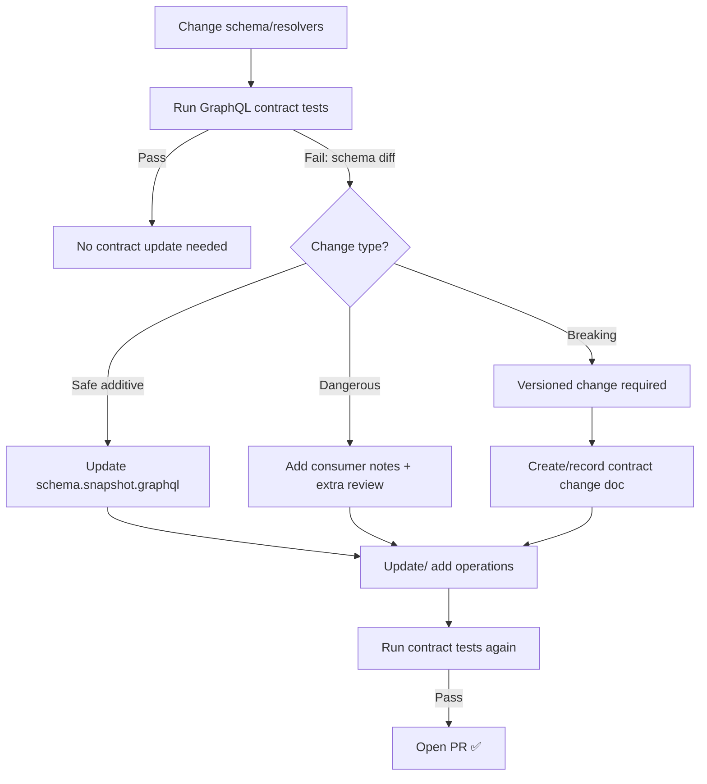

# 🧪 GraphQL Contract Tests

<p align="center">
  
  
  
  
</p>

These tests protect the **GraphQL API contract** as a first-class artifact (✅ contract-first). They are designed to catch **breaking schema changes** and **consumer-breaking query changes** before merge, aligning with KFM’s “schemas & API contracts are first-class artifacts” principle and strict compatibility checks.  

> 🎯 Goal: if a client query worked yesterday, it should still work today — unless we explicitly introduced a versioned contract change.

---

## 🧭 Contents

- [📘 Overview](#-overview)
- [🗂️ Directory Layout](#️-directory-layout)
- [🧪 What These Tests Validate](#-what-these-tests-validate)
- [▶️ Run Locally](#️-run-locally)
- [🔁 Updating the GraphQL Contract](#-updating-the-graphql-contract)
- [🚨 Breaking vs Safe Changes](#-breaking-vs-safe-changes)
- [🧯 Troubleshooting](#-troubleshooting)
- [🔗 References](#-references)

---

## 📘 Overview

### Purpose 🎯
- Enforce **backward compatibility** for the GraphQL schema (SDL).
- Ensure **known consumer operations** (queries/mutations) remain valid against the schema.
- Provide a **repeatable “contract update workflow”** that pairs schema evolution with governance + documentation.

### Scope ✅ / 🚫

| In Scope ✅ | Out of Scope 🚫 |
|---|---|
| GraphQL **schema** contract (SDL) compatibility | Performance / load testing |
| GraphQL **operation validity** (queries/mutations compile) | UI snapshot tests |
| Breaking-change detection (schema diffs) | Internal resolver unit tests |
| Optional smoke execution (if implemented) | Production data correctness |

### Audience 👥
- **Primary:** API engineers working on schema + resolvers
- **Secondary:** Web/client engineers consuming the API, reviewers enforcing governance gates

### Definitions 📚
- **Contract artifact:** A versioned representation of the API interface (GraphQL SDL + supporting tests/fixtures).
- **Breaking change:** A schema change that can invalidate existing clients (e.g., removing a field, changing a type, adding a required argument).
- **Consumer operation set:** A curated set of `.graphql` operations representing what real clients run.

### Key Artifacts 🧩
| Artifact | Path (expected) | Owner | Notes |
|---|---|---|---|
| This README | `api/tests/contract/graphql/README.md` | API team | How to run + how to update |
| Schema snapshot (SDL) | `api/tests/contract/graphql/schema.snapshot.graphql` | API team | Canonical “last known good” contract |
| Operation suite | `api/tests/contract/graphql/operations/**/*.graphql` | API + Client teams | Consumer queries/mutations |
| Test harness | `api/tests/contract/graphql/**/*.test.*` | API team | Schema diff + operation validation |
| Contract change record | `docs/templates/TEMPLATE__API_CONTRACT_EXTENSION.md` | API team | Use when adding/changing API surface |

> 📝 If your repo uses a different naming convention than the “expected” paths above, keep the **intent** the same: one committed snapshot + one curated operation suite + a harness that enforces compatibility.

### Definition of Done ✅
When changing GraphQL schema/resolvers:
- [ ] Contract tests pass locally (or in CI) ✅
- [ ] Schema change classified (safe / dangerous / breaking) ✅
- [ ] If contract changed: snapshot updated intentionally ✅
- [ ] Consumer operations updated (or new ones added) ✅
- [ ] Governance & documentation updated when required ✅

---

## 🗂️ Directory Layout

```text
api/
└── tests/
    └── contract/
        └── graphql/
            ├── 📄 README.md
            ├── 📄 schema.snapshot.graphql          # last known good SDL snapshot (recommended)
            ├── 📁 operations/                      # consumer operations (recommended)
            │   ├── 📄 web_app.graphql
            │   └── 📄 analytics.graphql
            ├── 📁 fixtures/                        # variables / auth contexts / response fixtures (optional)
            └── 🧪 *.test.(ts|js|py|...)            # harness (schema diff + validate operations)
```

---

## 🧪 What These Tests Validate

### 1) Schema contract stays stable 🧱
- The server schema is exported to SDL deterministically.
- The exported SDL is compared to `schema.snapshot.graphql` (or equivalent).
- Differences are classified:
  - ✅ Safe additive changes (usually allowed)
  - ⚠️ Dangerous changes (allowed only with extra review)
  - ❌ Breaking changes (blocked unless versioned / explicitly approved)

### 2) Consumer operations still compile 🧩
- Every `.graphql` file in `operations/` is validated against the schema.
- This catches:
  - removed/renamed fields
  - argument changes
  - enum removals or behavior-changing renames
  - fragment/type mismatches

### 3) (Optional) Execution smoke tests 🔥
If implemented in this repo:
- Execute a small set of critical queries/mutations against a local test server.
- Validate:
  - no runtime GraphQL errors
  - response shape is stable for critical selections
  - auth rules don’t silently break expected access patterns

> 🧠 Contract tests should be deterministic and **must not depend on production data**.

---

## ▶️ Run Locally

Because package managers and scripts vary by repo, use the command style your project already uses.

### Quick start 🏃‍♂️
```bash
# 1) go to api package (if this is a monorepo)
cd api

# 2) install deps (choose the package manager your repo uses)
npm ci
# pnpm install
# yarn install

# 3) run GraphQL contract tests (script name may vary)
npm run test:contract:graphql
# pnpm test:contract:graphql
# yarn test:contract:graphql
```

### Finding the exact script name 🔎
If the command above doesn’t exist:
- open `api/package.json`
- search for scripts containing: `contract`, `graphql`, `schema`, `api`

Example patterns you might see:
- `test:contract`
- `test:contract:graphql`
- `contract:graphql`
- `graphql:validate`
- `schema:check`

---

## 🔁 Updating the GraphQL Contract

### When should you update the snapshot? 📌
Update `schema.snapshot.graphql` **only** when:
- you intentionally evolved the API surface, and
- the change is classified as safe (or approved as versioned breaking), and
- consumer operations are updated accordingly.

### Contract update workflow 🧭



### Versioned breaking changes 🚧
If you need a breaking change:
- do **not** “sneak it in” by just updating the snapshot
- introduce a **versioned contract path** or **compat layer** (as defined by your API governance)
- record the change using the API contract extension template:
  - `docs/templates/TEMPLATE__API_CONTRACT_EXTENSION.md`

> 🧩 Rule of thumb: “If an old client would crash, it’s breaking.”

---

## 🚨 Breaking vs Safe Changes

GraphQL change classification can be subtle. Use this table as a guardrail:

| Change | Classification | Why |
|---|---:|---|
| Add a new type | ✅ Safe | Doesn’t affect existing queries |
| Add a new nullable field | ✅ Safe | Existing queries unchanged |
| Add a new optional argument | ✅ Safe | Existing calls still valid |
| Deprecate a field (`@deprecated`) | ✅ Safe | Existing queries still work |
| Remove a field | ❌ Breaking | Existing queries can fail |
| Rename a field/type | ❌ Breaking | Looks like removal to clients |
| Change a field’s type | ❌ Breaking | Selection set may become invalid |
| Make a nullable field non-null | ❌ Breaking | Clients may not expect non-null constraints |
| Add a **required** argument | ❌ Breaking | Existing calls omit it |
| Remove an enum value | ❌ Breaking | Clients sending it will fail |
| Add an enum value | ⚠️ Dangerous* | Often safe in theory, but some clients generate “exhaustive” enums |

\* **Policy tip:** treat “add enum value” as safe **only** if your consumer ecosystem tolerates unknown enum members (codegen behavior varies).

---

## 🧯 Troubleshooting

<details>
  <summary>❌ “Schema snapshot mismatch” but I only reordered definitions</summary>

- Ensure schema export is **deterministic** (sorting, stable print).
- Prefer printing via a single canonical schema printer in the harness.
- If the diff is purely reordering, consider normalizing output (sort types/fields) before snapshotting.

</details>

<details>
  <summary>❌ “Operation validation failed” after adding an argument</summary>

- If you **added a required argument**, that’s a breaking change.
- Fix by:
  - making the argument optional (if possible), or
  - versioning the field, or
  - creating a new field that takes the new argument and deprecating the old one.

</details>

<details>
  <summary>❌ CI passes locally but fails in pipeline</summary>

Common causes:
- Different Node/runtime versions
- Missing env vars in CI
- Schema generation depends on non-deterministic filesystem ordering
- Test harness assumes `TZ` / locale defaults

✅ Fix approach:
- Make schema export deterministic
- Pin toolchain versions in CI
- Avoid depending on external services / time-based data in contract tests

</details>

---

## 🔗 References

- 📘 Master Guide (contract-first + CI gates): `docs/MASTER_GUIDE_v13.md`
- 🧾 Markdown governance / doc conventions: `docs/standards/KFM_MARKDOWN_WORK_PROTOCOL.md`
- 🧱 Repo structure standard: `docs/standards/KFM_REPO_STRUCTURE_STANDARD.md`
- 🧩 API contract change template: `docs/templates/TEMPLATE__API_CONTRACT_EXTENSION.md`
- 🧭 Glossary: `docs/glossary.md`
- 🏛️ Governance + ethics:  
  - `docs/governance/ROOT_GOVERNANCE.md`  
  - `docs/governance/ETHICS.md`  
  - `docs/governance/SOVEREIGNTY.md`  

---