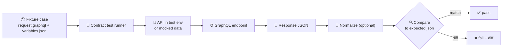

# 🧪 GraphQL Contract Test Fixtures


These fixtures are the **golden inputs/outputs** used by the GraphQL **contract test** suite.  
They exist to keep the API **stable, reproducible, and reviewable** as the schema & resolvers evolve.

> [!TIP]
> If CI failed, jump to **🧯 Common Failures** below and look for a deterministic mismatch (ordering, timestamps, IDs).

---

## 🎯 Overview

Contract tests answer one question:

> **“Given known inputs, does the GraphQL API still respond exactly as promised by the contract?”**

A **fixture case** is a small, self-contained description of:
- ✅ the GraphQL operation (query/mutation)
- ✅ variables and request context (headers/auth) — if needed
- ✅ the **expected** JSON response (`data` and/or `errors`)

Keeping fixtures small + deterministic makes failures actionable (diffs are obvious) and prevents accidental breaking changes from merging.

---

## 🧭 How fixtures are used (conceptual)



> [!NOTE]
> The test harness may normalize non-contractual fields (e.g., trace IDs). If you’re adding normalization, do it **once** in the harness—don’t “paper over” instability by hand-editing expected outputs every run.

---

## 📚 Definitions

- **Contract test**: A test that verifies an API’s outward behavior (shape + semantics) against a contract using known request/response pairs.
- **Fixture**: A committed, deterministic sample used to run tests consistently.
- **Golden file**: The “expected” output checked into the repo (here: `expected.json`).
- **Contract-first**: Schema/contracts are treated as first-class artifacts; changes must be deliberate and validated.

---

## 🧩 Fixture Case Spec

A fixture case is a folder containing (at minimum) a request and an expected response.

| File | Required | Purpose | Notes |
|---|:---:|---|---|
| `request.graphql` | ✅ | GraphQL operation document | Prefer **named** operations (e.g., `query GetThing { ... }`). |
| `variables.json` | ⭕ | Variables for the operation | Use stable IDs (no runtime UUIDs). |
| `headers.json` | ⭕ | Request headers (auth/tenant/etc.) | **Never** commit real tokens/secrets. |
| `expected.json` | ✅ | Expected GraphQL response | Usually `{ "data": ... }` and optionally `{ "errors": ... }`. |
| `meta.json` | ⭕ | Fixture metadata | Tags, why it exists, links to tickets, etc. |
| `notes.md` | ⭕ | Human context | Useful for nuanced policy behavior (redaction, auth, etc.). |

> [!IMPORTANT]
> If the harness expects different filenames (e.g., `query.graphql` / `response.json`), keep the *concept* identical and mirror the repo’s convention.

---

## 🗂️ Directory Layout

Recommended structure (each case is isolated and diff-friendly):

```text
api/tests/contract/graphql/fixtures/
├── 📄 README.md                               — 📚 Fixture rules, naming conventions, determinism + hygiene (this doc)
│
├── 🧪📁 getFieldById__happy_path/              — ✅ Golden “works as expected” query response snapshot
│   ├── 🧾📜 request.graphql                    — 🧠 The GraphQL operation document (named query/mutation)
│   ├── 🧷📦 variables.json                     — 🧩 Variables payload (stable IDs, no runtime UUIDs)
│   └── 🏁✅ expected.json                      — 🎯 Expected GraphQL response ({ data } and/or { errors })
│
├── 🧪🕳️ getFieldById__not_found/               — 🚫 Negative path: valid request, missing resource semantics
│   ├── 🧾📜 request.graphql                    — 🧠 Same operation shape; scenario differs via variables
│   ├── 🧷📦 variables.json                     — 🧩 ID/inputs that intentionally produce “not found”
│   └── 🧯🧾 expected.json                      — ⚠️ Expected null/edge behavior + error shape (if applicable)
│
└── 🧪🔐 updateField__auth_required/            — 🛡️ Authorization coverage: must deny/require auth context
    ├── 🧾📜 request.graphql                    — ✍️ Mutation document (or query) under access control
    ├── 🧷📦 variables.json                     — 🧩 Mutation variables (keep deterministic)
    ├── 🪪🧰 headers.json                       — 🔑 Request headers (synthetic auth/tenant headers; NEVER real secrets)
    └── 🏁✅ expected.json                      — 🚧 Expected auth error / denial response (contracted error format)
```

### 📛 Naming rules

- **Folder name**: `<OperationName>__<scenario>`
  - `getFieldById__happy_path`
  - `searchLayers__empty_results`
  - `updateProfile__validation_error`
- Keep names:
  - **lowerCamelCase** for operation name (matches common GraphQL naming)
  - **snake_case** for scenario (readable in paths)
- Prefer **behavior-focused** scenario names:
  - ✅ `__auth_required`, `__validation_error`, `__redaction_applied`
  - 🚫 `__resolver_v2`, `__db_join_fix`

---

## 🧼 Determinism Rules

Fixtures must be stable across machines, environments, and time.

### ✅ Do

- Use **fixed IDs** in variables + expected payloads (e.g., `"field_001"`).
- Use **fixed timestamps** (or freeze the clock in the test harness).
- Keep lists **sorted deterministically** (by `id`, `name`, etc.).
- Keep fixtures **minimal**: request only the fields needed for the contract assertion.
- Ensure `expected.json` is consistently formatted:
  - stable key ordering (if enforced by tooling)
  - consistent indentation (2 spaces is common)
  - newline at EOF

### 🚫 Don’t

- Don’t rely on current time (`now()`, `Date.now`, `CURRENT_TIMESTAMP`, etc.).
- Don’t include random UUIDs or generated IDs unless they’re normalized away consistently.
- Don’t snapshot volatile fields (trace IDs, request IDs) unless the contract **explicitly** promises them.

> [!WARNING]
> If you can’t make a field deterministic, prefer **normalization in the test harness** (e.g., strip `extensions.traceId`) rather than editing golden files repeatedly.

---

## 🔒 Security & Data Hygiene

Fixtures are committed artifacts—treat them like **public**.

- 🔑 **No secrets**: API keys, tokens, passwords, session cookies.
- 🧑‍🤝‍🧑 **No PII**: real names, emails, phone numbers, addresses.
- 🗺️ **No sensitive coordinates**: don’t include protected locations; use generalized/synthetic points.
- 🧪 Prefer **synthetic + minimal** data: the smallest dataset that proves the contract.

> [!TIP]
> If you need to model access-controlled behavior, do it explicitly:
> - fake users/tenants
> - explicit “redacted” fields in `expected.json`
> - clear `meta.json` notes about the intended policy

---

## 🔁 When to add or update fixtures

### Add a new fixture when…

- You introduce a **new query/mutation**
- You add a new **field** with non-trivial behavior (auth rules, redaction, derived calculations)
- You fix a bug that should never regress again (encode the regression as a fixture)

### Update an existing fixture when…

- The **contract** changes (schema changes, error shapes change, auth rules change)
- You add/rename/deprecate fields that affect expected responses

> [!IMPORTANT]
> If `expected.json` changed “unexpectedly,” treat it as a signal:
> - Did we break backwards compatibility?
> - Did ordering become nondeterministic?
> - Did the resolver start returning new errors / partial data?

---

## 🧯 Common Failures

<details>
<summary><strong>❌ Lists come back in a different order</strong></summary>

**Fix:** Ensure the resolver sorts results deterministically, or ensure the fixture dataset returns stable ordering.  
If ordering is explicitly **not** part of the contract, normalize arrays in the test harness by sorting on a stable key (`id`).

</details>

<details>
<summary><strong>❌ Timestamps changed</strong></summary>

**Fix:** Freeze time in tests or use fixed timestamps in the fixture dataset.

</details>

<details>
<summary><strong>❌ IDs differ per run</strong></summary>

**Fix:** Replace runtime-generated IDs with stable fixture IDs (seeded DB, deterministic factories, explicit IDs in mocks).

</details>

<details>
<summary><strong>❌ A new field appears in the response</strong></summary>

**Fix:** Decide if it’s part of the contract:
- If **yes** → update `expected.json` and (if needed) the schema contract.
- If **no** → ensure the harness consistently strips/normalizes it.

</details>

---

## 🧪 Example fixture case

<details>
<summary><strong>📄 request.graphql</strong></summary>

```graphql
query GetFieldById($id: ID!) {
  field(id: $id) {
    id
    name
  }
}
```

</details>

<details>
<summary><strong>🧾 variables.json</strong></summary>

```json
{
  "id": "field_001"
}
```

</details>

<details>
<summary><strong>✅ expected.json</strong></summary>

```json
{
  "data": {
    "field": {
      "id": "field_001",
      "name": "Demo Field"
    }
  }
}
```

</details>

> [!NOTE]
> If your API returns partial data + errors, `expected.json` should include both keys (e.g., `{ "data": ..., "errors": [...] }`).

---

## ✅ Definition of Done (Fixture Edition)

Before committing a new/updated fixture:

- [ ] Folder name follows `<OperationName>__<scenario>`
- [ ] `request.graphql` uses a **named** operation
- [ ] `variables.json` uses stable IDs (no runtime UUIDs)
- [ ] `expected.json` is deterministic (sorted lists, fixed timestamps)
- [ ] No secrets / no PII / no sensitive coordinates
- [ ] Contract tests pass locally and in CI
- [ ] If the contract changed, schema/versioning steps were followed (don’t “silently” break clients)

---

## 🔗 Related docs (in-repo)

- `docs/MASTER_GUIDE_v13.md` (contract-first & CI gates)
- `docs/templates/TEMPLATE__API_CONTRACT_EXTENSION.md` (how to add/change API contracts)
- `src/server/contracts/` (GraphQL SDL / API contracts, if applicable)

