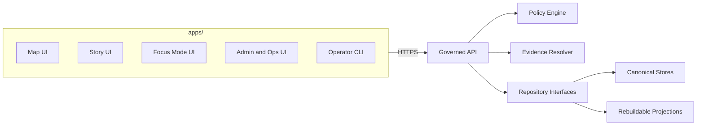
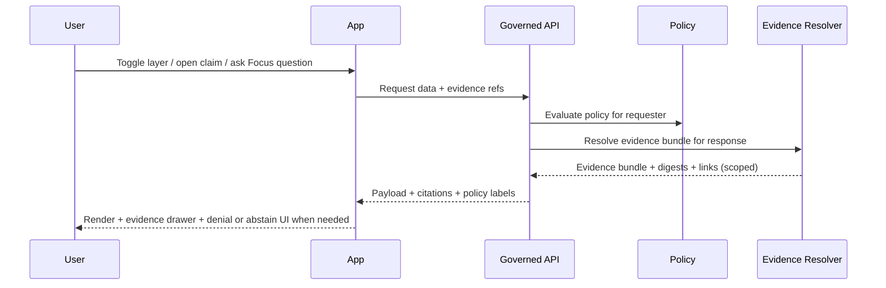

<!-- [KFM_META_BLOCK_V2]
doc_id: kfm://doc/8a4a8e59-7a6f-4d60-9c56-9f6d5f8b1f3d
title: apps/ — Runnable application surfaces
type: standard
version: v2
status: draft
owners: TBD (resolve via CODEOWNERS / repo maintainers)
created: 2026-02-22
updated: 2026-02-23
policy_label: public
related:
  - kfm://doc/kfm-definitive-design-governance-guide-vnext
  - kfm://doc/UNKNOWN_SYSTEM_OVERVIEW
  - ../docs/
tags: [kfm, apps, ui, trust-membrane, contracts, evidence-first]
notes:
  - This README is intentionally fail-closed: it does not assume a specific tech stack or app list until confirmed in-repo.
  - First follow-up: populate the App Registry + Current layout blocks from the actual `apps/` directory tree.
  - v2 focuses on: clearer exclusions, a “first follow-up” checklist, and a machine-validated app manifest contract.
[/KFM_META_BLOCK_V2] -->

<a id="top"></a>

# apps/ — Runnable application surfaces
**Purpose:** Home for user-facing and operator-facing application surfaces (Map / Story / Focus / Admin / CLI) that consume **governed APIs** and expose **evidence-first** UX.


> [!WARNING]
> This document is **fail-closed**. Anything repo-specific (app list, tooling, owners, contract paths) is **Unknown** until verified in-repo. Do not “fill in the blanks” from memory.

---

## Navigation
- [First follow-up checklist](#first-follow-up-checklist)
- [What belongs here](#what-belongs-here)
- [What must not go here](#what-must-not-go-here)
- [Non-negotiable invariants](#non-negotiable-invariants)
- [Trust surfaces required](#trust-surfaces-required)
- [Architecture sketch](#architecture-sketch)
- [App registry](#app-registry)
- [Directory layout](#directory-layout)
- [App manifest contract](#app-manifest-contract)
- [Per-app README minimum](#per-app-readme-minimum)
- [Local development](#local-development)
- [Testing and gates](#testing-and-gates)
- [Security privacy and sensitivity](#security-privacy-and-sensitivity)
- [Add a new app](#add-a-new-app)
- [Glossary](#glossary)

---

## First follow-up checklist

These steps convert this README from **Unknown-heavy** to **Confirmed** without guessing.

### Repo facts to confirm
- [ ] List app directories:
  - `ls -la apps/`
- [ ] Capture an at-a-glance tree:
  - `tree -L 3 apps/` (or `find apps -maxdepth 3 -type d`)
- [ ] Identify the workspace/tooling boundary:
  - Look for `package.json`, `pnpm-workspace.yaml`, `yarn.lock`, `turbo.json`, `nx.json`, `Cargo.toml`, `go.work`, etc.
- [ ] Resolve ownership:
  - Inspect `CODEOWNERS` and any `/docs/governance/owners` (or equivalent)
- [ ] Locate API contracts consumed by apps:
  - Search for `openapi`, `graphql`, `schema`, `contracts`, `sdk`, `client`, `generated`, `proto`
- [ ] Confirm policy labels in use:
  - Search for `policy_label`, `classification`, `sensitivity`, `redaction`, `abstain`

> [!TIP]
> Once those are verified, update only two sections first:
> 1) [App registry](#app-registry)  2) [Directory layout](#directory-layout)

---

## What belongs here

This folder is for **runnable applications**—anything a human launches (browser UI, operator console, desktop wrapper, CLI) whose primary job is **presenting governed KFM knowledge**.

Typical app categories (examples; verify actual apps in this repo):
- **Map UI**: 2D/3D rendering, time slider, evidence drawer, layer policies
- **Story UI**: narrative browsing, claim-level citations, timelines, “what changed”
- **Focus Mode UI**: governed Q&A workflow (policy pre-check → evidence retrieval → cite-or-abstain)
- **Admin and Ops UI**: intake review, promotion gates dashboards, policy fixtures review
- **CLI**: operator workflows (promotion, validation, evidence resolution) via governed APIs

> [!NOTE]
> Shared libraries should **not** live here. Put shared code in `packages/` (or repo-standard workspace) to prevent copy/paste drift.

---

## What must not go here

This directory should remain a **surface layer**. The following do not belong in `apps/`:

- **Shared domain libraries** used by multiple apps (move to `packages/` or equivalent)
- **Data pipelines** or jobs (move to pipeline/workflow area)
- **Direct storage/index access adapters**
  - no DB drivers in browser code
  - no “S3 client in the UI” patterns
  - no “search index client in the UI” patterns
- **Policy engines or redaction logic**
  - policy enforcement belongs in governed APIs, not in clients
- **Long-lived secrets**
  - no embedded credentials
  - no “shared admin token” configuration

---

## Non-negotiable invariants

These are requirements. Apps are the most visible trust surface; breaking invariants breaks credibility.

### 1) Trust membrane
- Apps **MUST NOT** access object storage, databases, or internal indexes directly.
- Apps **MUST** consume data only through **governed APIs** that enforce policy, redactions, and logging.
- Apps **MUST NOT** embed credentials that could bypass governance.

### 2) Truth path awareness
Apps sit at the end of the KFM “truth path”:
- Upstream → RAW → WORK or QUARANTINE → PROCESSED → CATALOG and LINEAGE → projections → **governed API** → **apps**
- Apps **MUST** assume only *promoted* dataset versions are admissible for public surfaces.

### 3) Evidence-first UX
Every layer, claim, chart, or AI output **MUST** open into an **evidence view**:
- DatasetVersion ID and human name
- License and rights holder attribution
- Policy label and redactions applied
- Provenance chain and run receipt reference
- Validation and freshness indicators
- Evidence bundle digest or checksum when policy allows

### 4) Focus Mode is not general chat
If this repo contains a Focus Mode surface, it **MUST** implement **cite-or-abstain**:
- If citations can’t be verified, the UI **MUST** abstain or reduce scope and show why
- If policy denies, the UI **MUST** deny and explain in policy-safe terms

### 5) Contract-first changes
- API and schema contracts are first-class artifacts.
- UI changes that rely on new or changed data **MUST** start from a contract change (OpenAPI/GraphQL/JSON Schema), not ad-hoc parsing.

---

## Trust surfaces required

These are not optional polish. They are the user-visible governance contract.

Minimum trust surfaces expected across apps:
- **Evidence drawer** accessible from every layer and story claim
- **Data version label** per layer linking to the relevant DatasetVersion record
- **Policy notices** at interaction time
  - example: “Geometry generalized due to policy”
- **What changed** panel comparing dataset versions
  - counts, checksums, QA metrics, and effective dates
- **Degraded mode indicators**
  - evidence resolver degraded
  - contract mismatch
  - stale data

### Evidence drawer minimum fields
- Evidence bundle ID and digest
- DatasetVersion ID and dataset name
- License and rights holder attribution
- Freshness and validation status
- Provenance chain link to run receipt
- Redactions applied and obligations
- Access note for restricted evidence: “exists but you can’t access it”

> [!WARNING]
> Evidence UX must never become a data exfiltration path. “Evidence exists” must not leak restricted existence unless policy allows.

---

## Architecture sketch



### Evidence-first interaction sketch


---

## App registry

> [!IMPORTANT]
> Populate this table from the actual `apps/` tree. Until then, keep placeholders explicit.

| App path | Type | Primary surface | Policy label | Primary API contract references | Owner | Status |
|---|---|---|---|---|---|---|
| `TBD` | web / desktop / cli / other | map / story / focus / admin / ops | public / restricted | `TBD` | `TBD` | draft |
| `TBD` |  |  |  |  |  |  |

### Registry definition of done
- [ ] Every app has a one-line purpose.
- [ ] Every app lists governed API dependencies.
- [ ] Every app declares a `policy_label` and constraints.
- [ ] Every app links to its evidence UX entry points.

---

## Directory layout

### Current layout

Replace the block below with the real `apps/` tree output.

```text
apps/
├─ README.md
└─ TBD
```

### Recommended layout template

Use only if the repo does not already enforce a different convention.

```text
apps/
├─ map/
│  ├─ README.md
│  ├─ kfm.app.json
│  └─ src/
├─ story/
│  ├─ README.md
│  ├─ kfm.app.json
│  └─ src/
├─ focus/
│  ├─ README.md
│  ├─ kfm.app.json
│  └─ src/
├─ admin/
│  ├─ README.md
│  ├─ kfm.app.json
│  └─ src/
└─ cli/
   ├─ README.md
   ├─ kfm.app.json
   └─ src/
```

---

## App manifest contract

Each app directory **SHOULD** include an app manifest file (example: `kfm.app.json`) so governance intent is machine-readable.

> [!NOTE]
> If the repo already has a standard manifest, use that instead. This is a proposed contract.

### Example kfm.app.json
```json
{
  "app_id": "kfm.app.map",
  "name": "KFM Map",
  "surface": "map",
  "policy_label": "public",
  "governed_api": {
    "base_url_env": "KFM_API_BASE_URL",
    "contracts": [
      "openapi://api/openapi.yaml#tag=tiles",
      "openapi://api/openapi.yaml#tag=catalog",
      "openapi://api/openapi.yaml#tag=evidence"
    ]
  },
  "evidence_ux": {
    "required": true,
    "entry_points": ["layer_details_drawer", "story_claim_citation_popover"]
  },
  "telemetry": {
    "otel": true,
    "pii": "none"
  }
}
```

### Minimal contract rules
- `policy_label` is mandatory.
- `governed_api.contracts` is mandatory for any app that makes API calls.
- `evidence_ux.required = true` for any public-facing surface that shows layers or claims.

### Proposed JSON Schema
Use this to validate manifests in CI with a fail-closed rule.

```json
{
  "$schema": "https://json-schema.org/draft/2020-12/schema",
  "$id": "kfm://schema/app-manifest/v1",
  "type": "object",
  "additionalProperties": false,
  "required": ["app_id", "name", "surface", "policy_label", "governed_api", "evidence_ux"],
  "properties": {
    "app_id": { "type": "string", "minLength": 1 },
    "name": { "type": "string", "minLength": 1 },
    "surface": { "type": "string", "enum": ["map", "story", "focus", "admin", "ops", "cli", "other"] },
    "policy_label": { "type": "string", "enum": ["public", "restricted", "internal", "secret"] },
    "governed_api": {
      "type": "object",
      "additionalProperties": false,
      "required": ["base_url_env", "contracts"],
      "properties": {
        "base_url_env": { "type": "string", "minLength": 1 },
        "contracts": { "type": "array", "minItems": 1, "items": { "type": "string", "minLength": 1 } }
      }
    },
    "evidence_ux": {
      "type": "object",
      "additionalProperties": false,
      "required": ["required", "entry_points"],
      "properties": {
        "required": { "type": "boolean" },
        "entry_points": { "type": "array", "items": { "type": "string" } }
      }
    },
    "telemetry": {
      "type": "object",
      "additionalProperties": true,
      "properties": {
        "otel": { "type": "boolean" },
        "pii": { "type": "string", "enum": ["none", "low", "moderate", "high"] }
      }
    }
  }
}
```

---

## Per-app README minimum

Each app under `apps/<app>/` **SHOULD** include a README that answers:

- title and one-line purpose
- where it fits in the system
- acceptable inputs
- exclusions
- governed API contracts used
- evidence UX entry points
- how to run locally
- tests and CI gates

### Template header snippet
```md
<!-- [KFM_META_BLOCK_V2]
doc_id: kfm://doc/<uuid>
title: apps/<app>/ — <purpose>
type: standard
version: v1
status: draft
owners: <team or names>
created: YYYY-MM-DD
updated: YYYY-MM-DD
policy_label: public|restricted|...
related:
  - ../README.md
tags: [kfm, apps]
notes:
  - Keep app-specific unknowns explicit until verified.
[/KFM_META_BLOCK_V2] -->
```

---

## Local development

> [!IMPORTANT]
> This section is intentionally generic until the repo’s tooling is verified.

### Quick start pattern
1. Identify the workspace toolchain from repo root.
2. Install dependencies using the repo’s chosen package manager.
3. Run the app’s dev target from its directory.
4. Confirm it points to a **governed API** instance and not direct storage.

### Proposed environment variables
- `KFM_API_BASE_URL` — base URL for the governed API gateway
- `KFM_ENV` — `local|dev|stage|prod`

> [!WARNING]
> Apps must be safe under policy deny. Even if UI misconfigures itself, restricted content must not render because enforcement happens in the API.

---

## Testing and gates

Apps should be treated as safety-critical surfaces.

### Minimum CI gates
- [ ] Unit tests for components and adapters
- [ ] Contract checks for governed API compatibility
- [ ] Evidence and citation resolution smoke test in CI
- [ ] E2E tests for critical trust flows
- [ ] Accessibility checks
- [ ] Dependency and supply chain checks
- [ ] Static guardrail: no direct storage access

### Recommended E2E trust flows
- Load app → toggle a layer → open evidence drawer → verify policy label shown
- Change time → verify data changes → evidence remains consistent
- Story claim → open citations → verify resolver success or policy-safe deny
- Focus Mode question → citations present or abstain with reasons

---

## Security privacy and sensitivity

### Secrets and credentials
- Never ship secrets in the client.
- Prefer short-lived tokens scoped to least privilege.

### Evidence UI guardrails
- Validate evidence bundle shape before rendering derived UI.
- If an evidence object cannot be verified or resolved, render as **untrusted** and block publish paths.

### Sensitive locations and culturally restricted material
- Do not render exact coordinates in public UIs for vulnerable or restricted sites.
- Prefer generalization and show a governance note explaining why.

### Abstention and restriction UX
Abstention is a feature. The UI must:
- show policy-safe reasons
- suggest safe alternatives
- provide `audit_ref` for steward review
- avoid leaking restricted existence

---

## Add a new app

### Checklist
1. Create app directory:
   - `apps/<new-app>/README.md`
   - `apps/<new-app>/kfm.app.json` or repo-standard manifest
2. Define or extend API contract:
   - update OpenAPI or GraphQL or JSON Schema first
   - add fixtures and contract tests
3. Implement UI against governed APIs only:
   - no direct storage or DB access
   - evidence UX for every public layer or claim
4. Add tests:
   - unit, contract, E2E, accessibility, evidence resolution
5. Register the app:
   - add row to [App registry](#app-registry)

---

## Glossary

- **Trust membrane:** enforced boundary where policy and provenance are applied; clients never access storage directly.
- **Truth path:** upstream → RAW → WORK or QUARANTINE → PROCESSED → catalogs and lineage → projections → governed API → UI.
- **Evidence-first UX:** every visible claim opens into provenance, rights, and validation details.
- **Cite-or-abstain:** answers only when citations can be verified; otherwise abstain or reduce scope.
- **Canonical vs rebuildable:** artifacts, catalogs, and provenance are canonical; indexes are rebuildable projections.

---

<details>
<summary>Appendix: Updating this README without guessing</summary>

- Regenerate the Current layout block from the actual repo tree.
- Populate the App Registry table from real app directories.
- For each app, link to:
  - its contract references
  - its evidence UX entry points
  - its CI gates and test commands
- Resolve owners via CODEOWNERS and replace `TBD`.

</details>

<p align="right"><a href="#top">Back to top ↑</a></p>
