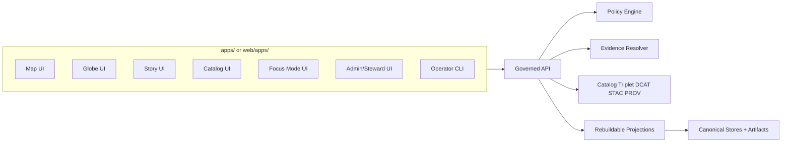
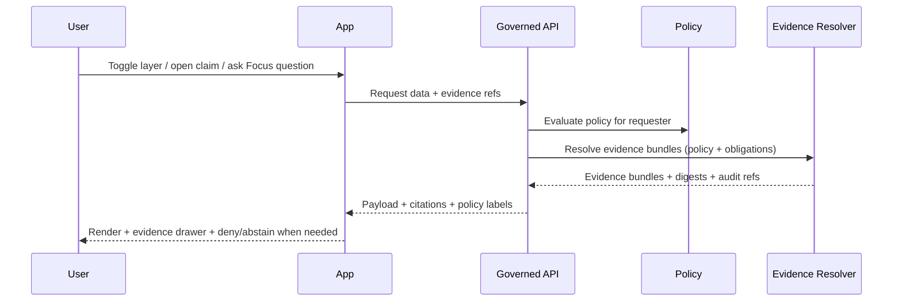

<!-- [KFM_META_BLOCK_V2]
doc_id: kfm://doc/8a4a8e59-7a6f-4d60-9c56-9f6d5f8b1f3d
title: apps/ — Runnable application surfaces
type: standard
version: v3.2
status: draft
owners: TBD (resolve via CODEOWNERS / repo maintainers)
created: 2026-02-22
updated: 2026-02-26
policy_label: public
related:
  - kfm://doc/kfm-definitive-design-governance-guide-vnext
  - kfm://doc/UNKNOWN_SYSTEM_OVERVIEW
  - ../docs/
tags: [kfm, apps, ui, trust-membrane, contracts, evidence-first, receiptviewer, trust-badges, promotion-contract, threat-model]
notes:
  - This README is intentionally fail-closed: it does not assume a specific tech stack or app list until confirmed in-repo.
  - First follow-up: populate the App Registry + Current layout blocks from the actual apps tree (either `apps/` or `web/apps/`, depending on repo convention).
  - v3.2 upgrade: align the "Non-negotiable invariants" names/ordering to KFM north stars (truth path, trust membrane, evidence-first UX, cite-or-abstain, canonical vs rebuildable, deterministic identity/hashing).
  - v3.2 upgrade: add Promotion Contract awareness (apps only surface promoted DatasetVersions) + a UI threat-model checklist (policy-safe errors; no restricted existence inference).
  - v3.2 upgrade: tighten Focus Mode control loop language (citation verification is a hard gate) + add evaluation-harness expectations for release posture.
  - v3.2 upgrade: add Evidence Resolver contract expectation (UI should be able to resolve EvidenceRefs in ≤2 calls; otherwise degrade safely).
[/KFM_META_BLOCK_V2] -->

<a id="top"></a>

# apps/ — Runnable application surfaces
**Purpose:** Home for user-facing and operator-facing application surfaces (Map / Globe / Story / Catalog / Focus / Admin / CLI) that consume **governed APIs** and expose **evidence-first** UX with **cite-or-abstain** guarantees.

**Owners:** TBD (resolve via CODEOWNERS / repo maintainers)  
**Status:** draft (fail-closed; repo-specific facts remain **UNKNOWN** until verified)  
**Policy label:** public (documentation only; individual apps may be `restricted|internal|secret`)  

<!-- TODO(kfm): replace placeholder badges with real workflow badges once the repo’s workflows and paths are confirmed. -->


> [!WARNING]
> This document is **fail-closed**. Anything repo-specific (actual app list, tooling, owners, contract paths, whether apps live in `apps/` or `web/apps/`) is **UNKNOWN** until verified in-repo. Do not “fill in the blanks” from memory.

---

## Navigation
- [Truth status legend](#truth-status-legend)
- [First follow-up checklist](#first-follow-up-checklist)
- [Where this fits in the repo](#where-this-fits-in-the-repo)
- [Repo layout crosswalk](#repo-layout-crosswalk)
- [What belongs here](#what-belongs-here)
- [What must not go here](#what-must-not-go-here)
- [Non-negotiable invariants](#non-negotiable-invariants)
- [Promotion Contract awareness](#promotion-contract-awareness)
- [Trust surfaces required](#trust-surfaces-required)
- [Evidence resolver expectations](#evidence-resolver-expectations)
- [Focus Mode UX contract](#focus-mode-ux-contract)
- [Threat model checklist](#threat-model-checklist)
- [Architecture sketch](#architecture-sketch)
- [App registry](#app-registry)
- [Directory layout](#directory-layout)
- [App manifest contract](#app-manifest-contract)
- [Per-app README minimum](#per-app-readme-minimum)
- [Local development](#local-development)
- [Testing and gates](#testing-and-gates)
- [Security, privacy, and sensitivity](#security-privacy-and-sensitivity)
- [Add a new app](#add-a-new-app)
- [Glossary](#glossary)

---

## Truth status legend

This README uses explicit claim labels so it stays **evidence-first** and **fail-closed**:

- **CONFIRMED (design)**: a KFM north star / invariant / contract posture (treat as required)
- **UNKNOWN (repo)**: not yet verified in this repository (treat as TODO; do not assume)
- **PROPOSED**: a template/pattern you can adopt (validate before standardizing)

> [!NOTE]
> Repo-specific facts should graduate from **UNKNOWN → CONFIRMED (repo)** by attaching paths/snippets in PRs.

---

## First follow-up checklist

These steps convert this README from **UNKNOWN-heavy** to **repo-confirmed** without guessing.

### Repo facts to confirm
- [ ] Confirm where runnable UI surfaces live:
  - `ls -la apps/` **and** `ls -la web/apps/` (one may not exist)
- [ ] Capture at-a-glance trees:
  - `tree -L 3 apps/` (or `find apps -maxdepth 3 -type d`)
  - `tree -L 3 web/apps/` (or `find web/apps -maxdepth 3 -type d`)
- [ ] Identify the workspace/tooling boundary:
  - Look for `package.json`, `pnpm-workspace.yaml`, `yarn.lock`, `turbo.json`, `nx.json`, `Cargo.toml`, `go.work`, etc.
- [ ] Resolve ownership:
  - Inspect `CODEOWNERS` and any `/docs/governance/owners` (or equivalent)
- [ ] Locate contract surfaces consumed by apps:
  - Search for `openapi`, `graphql`, `schema`, `contracts`, `sdk`, `client`, `generated`, `proto`
  - Search for DCAT/STAC/PROV profile artifacts if the repo stores them (`dcat`, `stac`, `prov`)
- [ ] Locate evidence UX components and their contract sources:
  - Search for `EvidenceDrawer`, `ReceiptViewer`, `EvidenceRef`, `EvidenceBundle`, `run_receipt`, `promotion_manifest`
- [ ] Confirm policy labels and deny/abstain UX patterns in use:
  - Search for `policy_label`, `obligations`, `classification`, `redaction`, `abstain`, `deny`, `policy_safe`
- [ ] Confirm “policy-safe errors” posture:
  - Search for `hide_restricted`, `not_found_forbidden`, `indistinguishable`, `policy_safe_error`

> [!TIP]
> Once those are verified, update only two sections first:
> 1) [App registry](#app-registry)  2) [Directory layout](#directory-layout)

---

## Where this fits in the repo

`apps/` is a **surface-layer** directory. It should sit at the very end of the KFM layering model:

- **Domain** → concepts and invariants (no UI)
- **Use cases** → workflows (map/story/focus/admin)
- **Interfaces** → contracts + policy boundary (governed API, schemas)
- **Infrastructure** → storage/index, pipelines, CI
- **Apps** → UX that consumes governed APIs and makes trust + evidence visible

> [!NOTE]
> Some KFM repo layouts place runnable apps under `web/apps/` (with `web/` as the frontend workspace). If that’s true in your repo, treat this README as describing that subtree, and consider either:
> - moving it to `web/apps/README.md` and leaving a short stub here, or
> - keeping both copies with a single source-of-truth generator (preferred).

---

## Repo layout crosswalk

This section prevents “directory drift” when the repo uses `web/` as the frontend root.

> [!IMPORTANT]
> These are *layout patterns* seen in KFM design sources. They are **not** confirmations of your current repo state.

| Concept | Common location (root apps layout) | Common location (web layout) | What this means for this README |
|---|---|---|---|
| Runnable UI surfaces | `apps/<app>/` | `web/apps/<app>/` | Update “Current layout” + App Registry based on whichever exists. |
| Shared UI packages | `packages/` | `web/packages/` | Keep shared code out of apps. |
| Shared UI components | `packages/ui/` | `web/src/components/` | Evidence components (ReceiptViewer/EvidenceDrawer/etc.) should live in shared UI space, not per-app copies. |
| Contract schemas | `schemas/` or `contracts/schemas/` | `schemas/` or `contracts/schemas/` | Schemas are first-class artifacts; apps are contract consumers. |
| API services | `api/` or `services/` | `api/services/` | Apps depend on governed APIs; do not implement policy/verification in clients. |
| Governance policy | `policy/` | `policy/` | Policy is enforced by API + CI; apps *display* results. |
| CI gates | `.github/workflows/` | `.github/workflows/` | Apps are safety-critical: trust flows should be required checks. |

---

## What belongs here

This folder is for **runnable applications**—anything a human launches (browser UI, operator console, desktop wrapper, CLI) whose primary job is **presenting governed KFM knowledge**.

Typical app categories (examples; verify actual apps in this repo):
- **Map Explorer UI**: 2D map rendering, timeline/time slider, evidence drawer, layer policies
- **Globe UI** (optional): 3D rendering; same evidence constraints as Map
- **Story UI**: narrative browsing, claim-level citations, map choreography via stored view state, “what changed”
- **Catalog UI**: dataset discovery and version browsing with license + policy summaries
- **Focus Mode UI**: governed Q&A workflow (policy pre-check → evidence retrieval → cite-or-abstain)
- **Admin/Steward UI**: intake review, promotion gates dashboards, policy fixtures review (usually restricted)
- **CLI**: operator workflows (promotion, validation, evidence resolution) via governed APIs

> [!NOTE]
> Shared libraries should **not** live here. Put shared code in `packages/` or `web/packages/` (or repo-standard workspace) to prevent copy/paste drift.

---

## What must not go here

This directory should remain a **surface layer**. The following do not belong in `apps/`:

- **Shared domain libraries** used by multiple apps (move to `packages/` / `web/packages/` / equivalent)
- **Shared UI components** used by multiple apps (move to shared UI component space)
- **Data pipelines** or jobs (move to pipeline/workflow area)
- **Direct storage/index access adapters**
  - no DB drivers in browser code
  - no “object storage client in the UI” patterns
  - no “search index client in the UI” patterns
- **Policy engines or redaction logic**
  - policy enforcement belongs in governed APIs and CI, not in clients
- **Receipt/attestation verification logic**
  - clients may *display* verification results; verification happens behind the trust membrane
- **Long-lived secrets**
  - no embedded credentials
  - no “shared admin token” configuration

---

## Non-negotiable invariants

Apps are the most visible trust surface; breaking invariants breaks credibility. These invariants are **system-level** and apply to every UI surface.

### 1) Truth path lifecycle (KFM north star)
- Apps sit at the end of the “truth path”:
  - Upstream → RAW → WORK / QUARANTINE → PROCESSED → CATALOG/TRIPLET (DCAT + STAC + PROV + run receipts) → projections → **governed API** → **apps**
- Apps **MUST** assume only *promoted* DatasetVersions are admissible for public surfaces.
- Apps **MUST NOT** surface “floating latest” as a substitute for versioned IDs in share links or Story Nodes.

### 2) Trust membrane (KFM north star)
- Apps **MUST NOT** access object storage, databases, or internal indexes directly.
- Apps **MUST** consume data only through **governed APIs** that enforce policy, redactions/obligations, and logging.
- Apps **MUST NOT** embed credentials that could bypass governance.

### 3) Evidence-first UX (KFM north star)
Every layer, story claim, chart, or AI output **MUST** open into an **evidence view**:
- DatasetVersion ID and human name
- License and rights holder attribution
- Policy label and obligations/redactions applied
- Provenance chain and run receipt reference
- Validation and freshness indicators (policy-safe)
- Evidence bundle digest/checksum when policy allows

### 4) Cite-or-abstain Focus Mode (KFM north star)
If the repo contains a Focus Mode surface, it **MUST** implement cite-or-abstain:
- If citations can’t be verified, the UI **MUST** abstain or reduce scope and show why (policy-safe).
- If policy denies, the UI **MUST** deny and explain in policy-safe terms.
- Every Focus response **MUST** be linked to an `audit_ref` (run id) for review.

### 5) Canonical vs rebuildable stores (KFM north star)
- Canonical truth lives in: object storage (raw/work/processed), catalogs (DCAT/STAC/PROV), provenance/audit.
- Apps **MUST** treat DB/search/tiles/graph as rebuildable projections and never as “source truth.”
- Apps **MUST** display the DatasetVersion identity and evidence links that tie projections back to canonical artifacts.

### 6) Deterministic identity and hashing (KFM north star)
- Dataset IDs and DatasetVersion IDs are stable and derived deterministically (spec-hash posture).
- Apps **MUST** use stable IDs in URLs/share links/view_state and avoid “version drift.”
- Apps **SHOULD** surface spec-hash/digest identifiers where policy allows (helps debugging and trust).

---

## Promotion Contract awareness

> [!IMPORTANT]
> Promotion gates are primarily enforced in pipelines/CI and in the governed API — but apps are still responsible for **not accidentally becoming a bypass**.

UI implications:
- Apps **MUST** show only promoted DatasetVersions on public surfaces.
- Apps **MUST** render “untrusted / not promotable” states safely (e.g., missing receipt, missing catalogs, unresolvable evidence).
- Apps **MUST** treat missing/invalid evidence as a reason to **degrade**, not as permission to render anyway.
- Any export/download UX **MUST** be checked against policy label + license/rights, and must be policy-safe (no inference of restricted existence).

---

## Trust surfaces required

These are not optional polish. They are the user-visible governance contract.

Minimum trust surfaces expected across apps:
- **Dataset version + policy badge per layer/claim**
- **Evidence drawer** accessible from every layer and story claim
- **Provenance panel** (run receipts + lineage links)
- **ReceiptViewer (read-only)** for run receipts and promotion manifests
  - schema validate → signature/attestation verify (if used) → render; otherwise show “untrusted”
- **What changed** panel comparing DatasetVersions (policy-safe)
- **Degraded mode indicators**
  - evidence resolver degraded
  - contract mismatch
  - stale data

### Evidence drawer minimum fields
- Evidence bundle ID and digest
- DatasetVersion ID and dataset name
- License and rights holder attribution
- Freshness and validation status (policy-safe)
- Provenance chain link to run receipt
- Obligations/redactions applied
- Access note for restricted evidence: “exists but you can’t access it” (only if policy allows acknowledging existence)

> [!WARNING]
> Evidence UX must never become a data exfiltration path. “Evidence exists” must not leak restricted existence unless policy allows.

---

## Evidence resolver expectations

Evidence resolution is a **contract surface** (not a best-effort UI feature).

- Apps **MUST** treat the evidence resolver as the authoritative source for citations/evidence bundles.
- Apps **SHOULD** be able to fetch/render an EvidenceBundle in **≤ 2 calls** (e.g., resolve → fetch bundle), otherwise degrade gracefully.
- Apps **MUST** fail closed:
  - if evidence is unresolvable → show “untrusted” / abstain
  - if policy denies → show deny UX (policy-safe)

> [!NOTE]
> Do not build “DIY citations” in clients. EvidenceRefs must resolve to EvidenceBundles.

---

## Focus Mode UX contract

If a Focus Mode UI exists, it must behave like a governed run, not chat:

- Inputs include:
  - user query
  - optional view_state (map bbox, time window, active layers)
  - user role and policy context
- Outputs include:
  - answer text
  - citations (EvidenceRefs) that resolve to evidence bundles
  - audit_ref (run id) that can be reviewed

### Control loop (required posture)
1) Policy pre-check  
2) Retrieval plan (based on view_state + intent)  
3) Retrieve admissible evidence (catalog/search/graph/postgis projections)  
4) Build evidence bundles via evidence resolver (apply obligations)  
5) Synthesize answer referencing evidence bundles  
6) **Citation verification (HARD GATE)** — if any citation can’t be verified or is denied, revise or abstain  
7) Produce audit receipt (store query, evidence digests, decisions, output hash)

### Evaluation harness (release posture)
- For broad release, Focus Mode **SHOULD** have an evaluation harness that gates regressions:
  - citation coverage (claims supported)
  - citation resolvability (100% for allowed users)
  - refusal correctness (restricted prompts denied safely)
  - sensitivity leakage tests (no restricted coordinates/metadata)
  - golden queries across DatasetVersions

---

## Threat model checklist

Use this checklist when reviewing new UI features (especially exports, sharing, search, and AI).

- TM-001 **Trust membrane:** Does the frontend ever fetch directly from object storage or databases? **Expected: NO**
- TM-002 **Restricted inference:** Can a public user infer restricted dataset existence via errors, timing, or empty states? **Expected: NO**
- TM-003 **Exports:** Are all downloads/exports checked against policy labels and rights? **Expected: YES**
- TM-004 **Focus Mode injection:** Can Focus Mode be prompt-injected by retrieved documents? **Expected: mitigations in place**
- TM-005 **Audit data:** Are audit logs redacted and access-controlled (PII safety)? **Expected: YES**
- TM-006 **Credential scope:** Are credentials short-lived and least-privilege? **Expected: YES**
- TM-007 **Artifact immutability:** Are rendered artifacts immutable-by-digest where applicable? **Expected: YES**
- TM-008 **Policy testing:** Are policy rules tested in CI with fixtures, and are UI trust flows tested end-to-end? **Expected: YES**

---

## Architecture sketch



### Evidence-first interaction sketch


---

## App registry

> [!IMPORTANT]
> Populate this table from the actual apps tree:
> - either `apps/*` **or** `web/apps/*`
> - do not merge them conceptually unless your repo intentionally ships both.

| App path | Type | Primary surface | Policy label | Primary contract references | Owner | Status |
|---|---|---|---|---|---|---|
| `TBD` | web / desktop / cli / other | map / globe / story / catalog / focus / admin / steward / ops | public / restricted / internal / secret | `TBD` | `TBD` | draft |
| `TBD` |  |  |  |  |  |  |

### Registry definition of done
- [ ] Every app has a one-line purpose.
- [ ] Every app lists governed API dependencies (contracts).
- [ ] Every app declares a `policy_label` and constraints.
- [ ] Every app links to its trust surfaces (EvidenceDrawer, ReceiptViewer, provenance, what-changed).
- [ ] Every app declares whether it supports reproducible `view_state`.

### Populate the registry (proposed helper)

If app manifests exist (for example `kfm.app.json`), you can generate a **starting** app list without guessing:

```bash
# From repo root (works whether you use apps/ or web/apps/)
find apps web/apps -maxdepth 2 -name 'kfm.app.json' -print 2>/dev/null
```

Then, for each app, fill the registry row from:
- manifest fields (`app_id`, `surface`, `policy_label`, `view_state`)
- the app README (one-line purpose, owner)
- contract references (OpenAPI/GraphQL/schema paths)

> [!NOTE]
> If your repo uses a different manifest name, update the command accordingly.

---

## Directory layout

### Current layout

Replace the block below with the real tree output (choose the directory that exists).

```text
apps/ or web/apps/
├─ README.md
└─ TBD
```

### Design-source drop-ins (adjacent directories)

This is a **PROPOSED** drop-in layout from KFM integration sources. Use it as a scan checklist for “what else might exist” around apps:

```text
repo-root/
|-- schemas/                                    # JSON Schemas: run_receipt, promotion_manifest, UI events, Focus DTOs
|-- policy/                                     # Policy packs (fail-closed gates)
|-- ops/                                        # Templates + operational playbooks
|-- src/                                        # Pipelines + validators + catalog writers
|-- web/                                        # Frontend workspace (may contain apps, shared components)
`-- .github/workflows/                          # Required status checks, attestations, policy gates
```

### Recommended layout template (apps-at-root)

Use only if the repo does not already enforce a different convention.

```text
apps/
├─ map/
│  ├─ README.md
│  ├─ kfm.app.json
│  └─ src/
├─ story/
│  ├─ README.md
│  ├─ kfm.app.json
│  └─ src/
├─ catalog/
│  ├─ README.md
│  ├─ kfm.app.json
│  └─ src/
├─ focus/
│  ├─ README.md
│  ├─ kfm.app.json
│  └─ src/
├─ admin/
│  ├─ README.md
│  ├─ kfm.app.json
│  └─ src/
└─ cli/
   ├─ README.md
   ├─ kfm.app.json
   └─ src/
```

### Recommended layout template (web/apps)

If your repo uses a `web/` workspace root, the equivalent pattern is:

```text
web/
├─ apps/
│  ├─ map/
│  ├─ story/
│  ├─ catalog/
│  ├─ focus/
│  └─ admin/
├─ packages/                                   # Shared UI packages (do not duplicate per-app)
└─ src/components/                              # Shared components (legacy/global shared)
```

---

## App manifest contract

Each app directory **SHOULD** include an app manifest file (example: `kfm.app.json`) so governance intent is machine-readable.

> [!NOTE]
> If the repo already has a standard manifest, use that instead. This is a PROPOSED contract.

### Example kfm.app.json

> [!NOTE]
> Contract references below are placeholders; replace them with real repo paths/URIs once confirmed.

```json
{
  "app_id": "kfm.app.map",
  "name": "KFM Map Explorer",
  "surface": "map",
  "policy_label": "public",
  "capabilities": {
    "view_state": true,
    "exports": ["png"],
    "focus_mode": false
  },
  "governed_api": {
    "base_url_env": "KFM_API_BASE_URL",
    "contracts": [
      "openapi://api/openapi.yaml#tag=catalog",
      "openapi://api/openapi.yaml#tag=tiles",
      "openapi://api/openapi.yaml#tag=evidence"
    ]
  },
  "trust_surfaces": ["evidence_drawer", "receipt_viewer", "provenance_panel", "what_changed"],
  "evidence_ux": {
    "required": true,
    "entry_points": ["layer_details_drawer", "receipt_viewer_modal", "story_claim_citation_popover"]
  },
  "telemetry": {
    "otel": true,
    "pii": "none"
  }
}
```

### Minimal contract rules (PROPOSED)
- `policy_label` is mandatory.
- `governed_api.contracts` is mandatory for any app that makes API calls.
- `evidence_ux.required = true` for any public-facing surface that shows layers or claims.
- `capabilities.view_state = true` SHOULD be set for Map/Story/Focus surfaces that emit share links.

---

## Per-app README minimum

Each app under `apps/<app>/` or `web/apps/<app>/` **SHOULD** include a README that answers:

- title and one-line purpose
- where it fits in the system
- acceptable inputs
- exclusions
- governed API contracts used
- trust surfaces (EvidenceDrawer, ReceiptViewer, provenance, what-changed)
- view_state expectations (if applicable)
- how to run locally
- tests and CI gates
- threat model notes for exports/share/search/AI features

### Template header snippet
```md
<!-- [KFM_META_BLOCK_V2]
doc_id: kfm://doc/<uuid>
title: apps/<app>/ — <purpose>
type: standard
version: v1
status: draft
owners: <team or names>
created: YYYY-MM-DD
updated: YYYY-MM-DD
policy_label: public|restricted|...
related:
  - ../README.md
tags: [kfm, apps]
notes:
  - Keep app-specific unknowns explicit until verified.
[/KFM_META_BLOCK_V2] -->
```

---

## Local development

> [!IMPORTANT]
> This section is intentionally generic until the repo’s tooling is verified.

### Quick start pattern
1. Identify the workspace toolchain from repo root (and whether the frontend is rooted at `web/`).
2. Install dependencies using the repo’s chosen package manager.
3. Run the app’s dev target from its directory.
4. Confirm it points to a **governed API** instance and not direct storage.

### Proposed environment variables
- `KFM_API_BASE_URL` — base URL for the governed API gateway
- `KFM_ENV` — `local|dev|stage|prod`

> [!WARNING]
> Apps must be safe under policy deny. Even if UI misconfigures itself, restricted content must not render because enforcement happens in the API.

---

## Testing and gates

Apps should be treated as safety-critical surfaces.

### Minimum CI gates (recommended baseline)
- [ ] Unit tests for components and adapters
- [ ] Contract checks for governed API compatibility (OpenAPI/GraphQL/schema)
- [ ] Evidence resolution smoke test (EvidenceRef → EvidenceBundle) in CI
- [ ] ReceiptViewer safety tests (schema validate + “untrusted” fallback)
- [ ] E2E tests for critical trust flows
- [ ] Accessibility checks (evidence drawer keyboard nav at minimum)
- [ ] Dependency and supply chain checks
- [ ] Static guardrail: no direct storage/DB access
- [ ] Static/behavioral guardrail: policy-safe errors (no restricted existence inference)

### Focus Mode gates (if applicable)
- [ ] Citation verification enforced (hard gate)
- [ ] Evaluation harness with golden queries blocks regressions before release
- [ ] Prompt-injection defenses tested (tool allowlist; no raw index text)

#### Static guardrail examples (PROPOSED)

Because tech stacks vary, the implementation varies. The invariant does not: **apps cannot bypass governed APIs**.

Possible approaches:
- **Dependency allow/deny list** in CI (fail if an app depends on DB/object-storage/index client SDKs)
- **Linter rule** to block direct calls to non-governed origins (where applicable)
- **Egress policy** in dev/stage to prevent direct access to internal stores from UI origins
- **Targeted grep checks** for known bypass libraries (use sparingly; tune to avoid false positives)

### Recommended E2E trust flows
- Load app → toggle a layer → open evidence drawer → verify policy label + DatasetVersion shown
- Change time → verify data changes → evidence remains consistent (version pinned)
- Story claim → open citations → resolver success or policy-safe deny
- Open dataset → open receipt viewer → verified/untrusted state renders safely
- Focus question → citations present or abstain with reasons + audit_ref
- Exports/downloads → policy and rights checks enforced + policy-safe errors

---

## Security, privacy, and sensitivity

### Secrets and credentials
- Never ship secrets in the client.
- Prefer short-lived tokens scoped to least privilege.

### Evidence UI guardrails
- Validate evidence bundle shape before rendering derived UI.
- ReceiptViewer must be safe by construction:
  - validate schema before derived views
  - never render untrusted HTML
  - treat external links as hostile by default
- If an evidence object cannot be verified or resolved, render as **untrusted** and block publish paths.

### Sensitive locations and culturally restricted material
- Do not render exact coordinates in public UIs for vulnerable or restricted sites.
- Prefer generalization and show a governance note explaining why.

### Abstention and restriction UX
Abstention is a feature. The UI must:
- show policy-safe reasons
- suggest safe alternatives
- provide `audit_ref` for steward review
- avoid leaking restricted existence

---

## Add a new app

### Checklist
1. Create app directory (pick the repo convention):
   - `apps/<new-app>/README.md` **or** `web/apps/<new-app>/README.md`
   - `kfm.app.json` (or repo-standard manifest)
2. Define or extend contracts:
   - update OpenAPI/GraphQL/JSON Schema first
   - add fixtures and contract tests
3. Implement UI against governed APIs only:
   - no direct storage or DB access
   - evidence UX for every public layer or claim
4. Add tests:
   - unit, contract, E2E, accessibility, evidence resolution
   - receipt viewer safe-render tests if the app renders receipts/manifests
5. Threat-model the change:
   - run [Threat model checklist](#threat-model-checklist)
6. Register the app:
   - add row to [App registry](#app-registry)
7. Update this README:
   - regenerate “Current layout”
   - ensure the crosswalk reflects the chosen convention

---

## Glossary

- **Truth path lifecycle:** Upstream → RAW → WORK/QUARANTINE → PROCESSED → CATALOG/TRIPLET → projections → governed API → UI.
- **Trust membrane:** enforced boundary where policy and provenance are applied; clients never access storage directly.
- **Promotion Contract:** fail-closed gate set that blocks serving any dataset version until identity, rights, sensitivity, catalogs, receipts, and policy tests validate.
- **Evidence-first UX:** every visible claim opens into provenance, rights, and validation details.
- **EvidenceRef:** a resolvable reference used as a citation pointer.
- **EvidenceBundle:** the resolved evidence card (human + machine fields, digests, policy decision, audit refs).
- **ReceiptViewer:** safe read-only viewer for run receipts / promotion manifests; validates schema and surfaces verification status.
- **Trust badges:** compact UI affordances that summarize provenance/quality without leaking restricted details.
- **Cite-or-abstain:** answers only when citations can be verified; otherwise abstain or reduce scope.
- **Canonical vs rebuildable:** catalogs/provenance/artifacts are canonical; DB/search/graph/tiles are rebuildable projections.

---

<details>
<summary>Appendix: Updating this README without guessing</summary>

- Determine whether runnable apps live under `apps/` or `web/apps/`.
- Regenerate the Current layout block from the actual repo tree.
- Populate the App Registry table from real app directories/manifests.
- For each app, link to:
  - its contract references
  - its trust surface entry points
  - its CI gates and test commands
- Resolve owners via CODEOWNERS and replace `TBD`.

</details>

<p align="right"><a href="#top">Back to top ↑</a></p>
