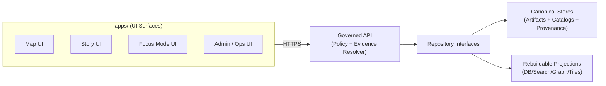

<!-- [KFM_META_BLOCK_V2]
doc_id: kfm://doc/8a4a8e59-7a6f-4d60-9c56-9f6d5f8b1f3d
title: apps/ — Runnable application surfaces
type: standard
version: v1
status: draft
owners: TBD (resolve via CODEOWNERS / repo maintainers)
created: 2026-02-22
updated: 2026-02-22
policy_label: public
related:
  - kfm://doc/UNKNOWN_SYSTEM_OVERVIEW
  - ../docs/
tags: [kfm, apps, ui, trust-membrane, contracts, evidence-first]
notes:
  - This README is intentionally fail-closed: it does not assume a specific tech stack or app list until confirmed in-repo.
  - Fill the App Registry section from the actual directory tree as the first follow-up.
[/KFM_META_BLOCK_V2] -->

# apps/ — KFM runnable applications
**Purpose:** Home for user-facing and operator-facing application surfaces (Map / Story / Focus / Admin) that consume **governed APIs** and expose **evidence-first** UX.


---

## Navigation
- [What belongs here](#what-belongs-here)
- [Non-negotiable invariants](#non-negotiable-invariants)
- [App registry](#app-registry)
- [Directory layout](#directory-layout)
- [App manifest contract](#app-manifest-contract)
- [Local development](#local-development)
- [Testing & gates](#testing--gates)
- [Security, privacy, sensitivity](#security-privacy-sensitivity)
- [Add a new app](#add-a-new-app)
- [Glossary](#glossary)

---

## What belongs here

This folder is for **runnable applications**—anything a human launches (browser UI, operator console, desktop wrapper) or any standalone “surface” whose primary job is **presenting governed KFM knowledge**.

Typical app categories (examples; *verify actual apps in this repo*):
- **Map UI** (2D/3D): interactive layer rendering, time slider, evidence drawer
- **Story UI**: narrative browsing, citations/evidence linkage, timelines
- **Focus Mode UI**: governed Q&A workflow (policy pre-check → evidence retrieval → cite-or-abstain)
- **Admin / Ops UI**: dataset intake review, promotion gate dashboards, policy fixtures review

> **Non-goal:** placing shared libraries here. Shared code should live under a `packages/` (or equivalent) workspace to avoid copy/paste drift.

---

## Non-negotiable invariants

These rules are **requirements** (not suggestions). Apps are the most visible trust surface; breaking invariants breaks credibility.

### 1) Trust membrane
- Apps **MUST NOT** access object storage, databases, or internal indexes directly.
- Apps **MUST** consume data only through **governed APIs** that enforce policy decisions, redactions, and logging.
- Apps **MUST NOT** embed credentials that could bypass governance.

### 2) Truth path awareness
Apps sit at the end of the KFM “truth path”:
- Upstream → RAW → WORK/QUARANTINE → PROCESSED → CATALOG/LINEAGE → indexes → **governed API** → **apps**
- Apps **MUST** assume only *promoted* dataset versions are admissible for public UI surfaces.

### 3) Evidence-first UX (map-first, time-aware)
- Every layer, claim, chart, or AI output **MUST** be openable into an **evidence view**:
  - dataset version (immutable ID)
  - license/rights holder
  - policy label + redactions/generalizations applied
  - provenance chain (run receipt / activity)
  - artifact links + checksums

### 4) Focus Mode is not general chat
- If this repo contains a Focus Mode surface, it **MUST** implement **cite-or-abstain** behavior.
- If policy denies or citations can’t be verified, the UI **MUST** abstain or reduce scope (and show why).

### 5) Contract-first changes
- API and schema contracts are first-class artifacts. UI work that depends on new/changed data **MUST** start from a contract change (OpenAPI/GraphQL/JSONSchema), not ad-hoc UI parsing.

---

## Architecture sketch (for orientation)



---

## App registry

> **Fill this table from the actual `apps/` tree.** Until then, keep it explicit what’s unknown.

| App | Type | Primary surface | Policy label | Primary API contract(s) | Owner | Status |
|---|---|---|---|---|---|---|
| `TBD` | `web` / `desktop` / `other` | map / story / focus / admin | public / restricted | `TBD` | `TBD` | draft |
| `TBD` |  |  |  |  |  |  |

**Registry DoD:**
- [ ] Every app has a one-line purpose.
- [ ] Every app lists its governed API dependencies.
- [ ] Every app declares a policy label + any constraints.
- [ ] Every app links to its evidence UX entry points (where in UI).

---

## Directory layout

### Current layout (UNKNOWN until verified in-repo)
Replace the block below with the *actual* tree output.

```text
apps/
├─ README.md
└─ (TBD — populate from repo)
```

### Recommended layout (template)
Use this only as a *guideline* if the repo does not already enforce a different convention.

```text
apps/
├─ map/                  # Map surface (2D/3D)
│  ├─ README.md
│  ├─ kfm.app.json        # app manifest (see contract below)
│  └─ (src/ …)
├─ story/                # Story surface
│  ├─ README.md
│  ├─ kfm.app.json
│  └─ (src/ …)
├─ focus/                # Focus Mode surface (if present)
│  ├─ README.md
│  ├─ kfm.app.json
│  └─ (src/ …)
└─ admin/                # Governance/operator surface
   ├─ README.md
   ├─ kfm.app.json
   └─ (src/ …)
```

---

## App manifest contract

Each app directory **SHOULD** include a small manifest file (example name: `kfm.app.json`) so governance intent is machine-readable.

### Example `kfm.app.json`
```json
{
  "app_id": "kfm.app.map",
  "name": "KFM Map",
  "surface": "map",
  "policy_label": "public",
  "governed_api": {
    "base_url_env": "KFM_API_BASE_URL",
    "contracts": [
      "openapi://api/openapi.yaml#tag=tiles",
      "openapi://api/openapi.yaml#tag=catalog",
      "openapi://api/openapi.yaml#tag=evidence"
    ]
  },
  "evidence_ux": {
    "required": true,
    "entry_points": ["layer_details_drawer", "story_claim_citation_popover"]
  },
  "telemetry": {
    "otel": true,
    "pii": "none"
  }
}
```

### Minimum expectations
- `policy_label` is mandatory.
- `governed_api.contracts` is mandatory for any app that makes API calls.
- `evidence_ux.required = true` for any public-facing surface that shows layers/claims.

---

## Local development

> This section is intentionally generic until the repo’s actual tooling is verified.

### Quick start (generic)
1. Identify the workspace toolchain (look for `package.json`, `pnpm-workspace.yaml`, `yarn.lock`, `turbo.json`, etc.).
2. From repo root, install dependencies using the repo’s chosen package manager.
3. Run the app’s local dev target from its directory:
   - check scripts/commands in that app’s config (`package.json`, `Makefile`, etc.)
   - run the dev server and confirm it points to a **governed API** instance (not direct storage)

### Environment variables (proposed baseline)
- `KFM_API_BASE_URL` — base URL for the governed API gateway
- `KFM_ENV` — `local|dev|stage|prod`
- `KFM_POLICY_MODE` — optional UI behavior toggle for policy-deny UX messaging (UI must still rely on API enforcement)

> Apps must be able to run in a “policy-deny safe” mode where restricted content never renders even if UI code is misconfigured.

---

## Testing & gates

Apps should be tested like safety-critical surfaces because they control what gets shown to users.

### CI gates (minimum credible set)
- [ ] **Unit tests**: components + adapters (map/globe adapters, data transforms)
- [ ] **Contract checks**: API contract compatibility + schema validation of fixtures
- [ ] **E2E tests**: critical user flows (layer toggle → evidence drawer → citation click-through)
- [ ] **Accessibility checks**: keyboard navigation, ARIA labels, safe color semantics
- [ ] **“No direct storage access”**: enforce via code ownership boundaries + dependency allowlists + static checks

### Recommended E2E flows (map-first)
- Open app → load basemap → toggle a layer → open evidence view → confirm policy label shown
- Change time (timeline) → verify layers update → evidence remains consistent with selected dataset version
- If Focus Mode present: policy pre-check → evidence bundle → answer with citations → citation verification

---

## Security, privacy, sensitivity

### Secrets and credentials
- Never ship secrets in the client.
- Prefer short-lived auth tokens to the governed API, scoped to the least privilege.
- Treat all external links as untrusted; validate/route through governed API where policy requires.

### Sensitive locations & culturally restricted material
- For precise, private, culturally restricted, or vulnerable sites: **do not render exact coordinates** in public UIs.
- Prefer generalization (e.g., bounding boxes, coarse centroids) and add an on-screen governance note explaining why.

### Evidence links
- Evidence UX must never become a “data exfiltration” path:
  - links to attestations/logs/manifests must be mediated by policy and authorization
  - the UI must gracefully handle “evidence exists but you can’t access it”

---

## Add a new app

### Checklist (contract-first, fail-closed)
1. **Create app directory**
   - `apps/<new-app>/README.md`
   - `apps/<new-app>/kfm.app.json` (or repo-standard manifest)
2. **Define/extend API contract**
   - add/extend OpenAPI/GraphQL/JSONSchema artifacts first
   - add fixtures (golden responses) and validation tests
3. **Implement UI against governed APIs only**
   - no direct storage/DB access
   - evidence UX wired for every public layer/claim
4. **Add tests**
   - unit + contract + e2e + a11y
5. **Register**
   - add row to [App registry](#app-registry)

---

## Glossary

- **Trust membrane:** the enforced boundary where policy + provenance are applied; clients never access storage directly.
- **Truth path:** upstream → RAW → WORK/QUARANTINE → PROCESSED → CATALOG/LINEAGE → projections → governed API → UI.
- **Evidence-first UX:** the UI contract that every claim/layer opens into provenance + rights + checksums.
- **Cite-or-abstain:** Focus Mode behavior: produce answers only when citations can be verified; otherwise abstain/reduce scope.
- **Canonical vs rebuildable:** artifacts + catalogs + provenance are canonical; indexes are rebuildable projections.

---

<details>
<summary>Appendix: How to update this README without guessing</summary>

- Regenerate the “Current layout” block from the actual repo tree.
- Populate the App Registry table from real app directories.
- For each app, link to:
  - its contract(s)
  - its evidence UX entry points
  - its CI gates / test targets

</details>

<!-- Back to top -->
<p align="right"><a href="#apps--kfm-runnable-applications">Back to top ↑</a></p>
