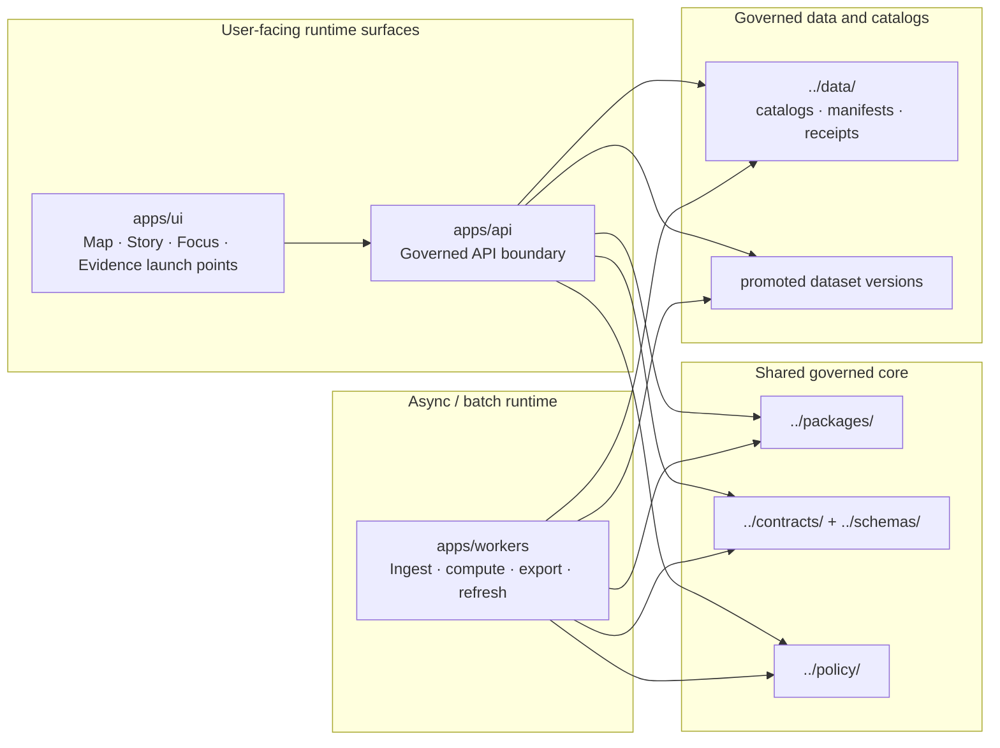

<!-- [KFM_META_BLOCK_V2]
doc_id: kfm://doc/3b4452c1-f6e0-4d21-86dc-3d2d5ea4c3c2
title: apps/ — Runtime apps and user-facing services
type: standard
version: v1
status: draft
owners: TBD (verify ../.github/CODEOWNERS)
created: 2026-03-06
updated: 2026-03-07
policy_label: public
related: [../README.md, ./api/README.md, ./ui/README.md, ./workers/README.md, ../packages/, ../contracts/, ../schemas/, ../policy/, ../data/, ../docs/]
tags: [kfm, apps, runtime, api, ui, workers, evidence, governance]
notes: [Top-level runtime-app contract aligned to the KFM manuals and attached product-surface design material. Current-branch implementation claims remain UNKNOWN unless proven by supplied artifacts or branch-local verification.]
[/KFM_META_BLOCK_V2] -->

<a id="top"></a>

# apps/ — Runtime apps and user-facing services
Governed runtime surfaces for KFM: deployable API, UI, and worker apps that deliver map, story, focus, evidence, and domain workflows without bypassing policy, provenance, or promotion gates.

**Status:** `draft`  
**Owners:** `TBD (verify ../.github/CODEOWNERS)`  


**Quick links:** [Purpose and scope](#purpose-and-scope) · [Repo fit](#repo-fit) · [Truth status legend](#truth-status-legend) · [Runtime portfolio model](#runtime-portfolio-model) · [Accepted inputs](#accepted-inputs) · [Exclusions](#exclusions) · [Directory tree](#directory-tree) · [Quickstart](#quickstart) · [Usage](#usage) · [Current app surfaces](#current-app-surfaces) · [Cross-app operating model](#cross-app-operating-model) · [Runtime invariants](#runtime-invariants) · [Suggested app metadata contract](#suggested-app-metadata-contract-proposed) · [Growth lanes](#runtime-growth-lanes-proposed) · [Definition of done](#definition-of-done) · [FAQ](#faq) · [Appendix](#appendix-open-verification-steps)

---

## Purpose and scope

`apps/` is the directory for **deployable runtime applications** in Kansas Frontier Matrix.

This README exists to define:

- what belongs in `apps/`
- what does **not** belong in `apps/`
- which runtime surfaces are grounded in the KFM manuals
- which directory paths are present in the supplied snapshot
- which implementation details remain `UNKNOWN`
- what every app under this directory must preserve as part of the KFM trust model

KFM’s runtime should feel like **one governed product**, not a pile of adjacent apps. `apps/` is where that composition happens.

### CONFIRMED

- `apps/` is a top-level repo area in the supplied artifact.
- The repo-root posture describes `apps/` as the home for **runnable services and user-facing applications**.
- Child app documentation is supplied for:
  - [`./api/README.md`](./api/README.md)
  - [`./ui/README.md`](./ui/README.md)
  - [`./workers/README.md`](./workers/README.md)
- The uploaded KFM manuals describe a public-facing runtime made of a **Map Explorer**, **Story Editor / Story Nodes**, **Focus Mode**, and an **Evidence Drawer** that keeps evidence inspectable and first-class.

### PROPOSED

- This top-level README should be the **directory contract** for all runtime apps, so child READMEs can go deeper without repeating repo-level rules.
- Domain verticals such as **Cities & Infrastructure** should be added as governed modules within existing runtime surfaces, not as side-door dashboards or parallel stacks.
- Worker runtimes should be explicit about export generation, provenance snapshots, refresh jobs, and hybrid ingestion without becoming shadow publication paths.

### UNKNOWN

- Exact runtime stack per app on the active branch
- Exact local commands and ports for every app
- Queue / scheduler implementation details
- Full owner map from `CODEOWNERS`
- Exact CI jobs that block merges for each app surface
- Whether the supplied tree exactly matches the current checked-out branch

[Back to top](#top)

---

## Repo fit

**Path:** `/apps/README.md`  
**Repo role:** runtime app boundary for KFM.

**Upstream dependencies**

- [`../packages/`](../packages/) — shared libraries, domain logic, adapters, reusable services
- [`../contracts/`](../contracts/) — API and interface contracts
- [`../schemas/`](../schemas/) — validation schemas
- [`../policy/`](../policy/) — policy rules, fixtures, and tests
- [`../data/`](../data/) — governed datasets, manifests, receipts, catalog artifacts
- [`../docs/`](../docs/) — architecture, ADRs, runbooks, standards

**Downstream runtime surfaces**

- [`./api/README.md`](./api/README.md) — governed API boundary
- [`./ui/README.md`](./ui/README.md) — governed frontend client
- [`./workers/README.md`](./workers/README.md) — background, batch, and async runtime

### Boundary rule

`apps/` is where runtime composition happens. Shared business logic, reusable validators, schema definitions, and policy packs should not be re-implemented here if they belong in shared layers.

Runtime convenience must never outrun:
- the trust membrane
- the evidence contract
- policy-safe failure behavior
- promotion discipline

[Back to top](#top)

---

## Truth status legend

This README uses explicit truth labels.

| Label | Meaning in this file |
|---|---|
| **CONFIRMED** | Supported by the supplied artifact or uploaded KFM/source documents. |
| **PROPOSED** | Recommended structure or rule that fits KFM’s documented architecture. |
| **UNKNOWN** | Not yet verified on the active branch; do not treat as branch fact. |

### Operating rule

Visible uncertainty is better than false certainty.  
If a runtime detail is not verified, leave it `UNKNOWN` and add the smallest verification step.

[Back to top](#top)

---

## Runtime portfolio model

KFM’s runtime portfolio should be understood as a **coordinated product surface**, not merely as three sibling folders.

### Baseline product surfaces from the KFM manuals

| Runtime surface | Product posture | Likely host apps | Branch reality in this README |
|---|---|---|---|
| **Map Explorer** | **CONFIRMED** in KFM docs | `ui` + `api` | Exact implementation remains `UNKNOWN` until verified locally. |
| **Story Editor / Story Nodes** | **CONFIRMED** in KFM docs | `ui` + `api` | Exact implementation remains `UNKNOWN` until verified locally. |
| **Evidence Drawer** | **CONFIRMED** in KFM docs | `ui` + `api` | Exact implementation remains `UNKNOWN` until verified locally. |
| **Focus Mode** | **CONFIRMED** in KFM docs | `ui` + `api` (+ async worker support if needed) | Exact implementation remains `UNKNOWN` until verified locally. |

### Proposed runtime growth inside the same boundary

| Runtime capability | Status | Likely host apps | Why it belongs here |
|---|---|---|---|
| **Cities & Infrastructure** domain vertical | **PROPOSED** | `ui` + `api` + `workers` | It is a KFM domain vertical, not a separate bypass product. |
| Exportable briefs and provenance snapshots | **PROPOSED** | `api` + `workers` | Shareable outputs still need audit refs and policy enforcement. |
| Policy-gated restricted layers | **PROPOSED** | `api` + `ui` + `workers` | Sensitive data handling belongs inside the same governed runtime. |
| Focus-domain assistants (for example, city briefings) | **PROPOSED** | `api` + `ui` | Constrained retrieval and cite-or-abstain behavior stay inside the trust membrane. |
| Scenario / comparison workflows | **PROPOSED** | `api` + `workers` + `ui` | Later modeling should still stay evidence-linked and policy-aware. |

### Runtime composition rule

New workflow surfaces should normally be added as:
- modules in `ui`
- routes/endpoints in `api`
- jobs/pipelines/exports in `workers`

They should **not** normally appear as:
- direct-storage frontends
- one-off dashboards that ignore KFM contracts
- side-channel publication services
- separate “special” runtimes that bypass policy or evidence resolution

[Back to top](#top)

---

## Accepted inputs

The following belong in `apps/`:

| Input type | Examples | Why it belongs here |
|---|---|---|
| Deployable runtime application code | API services, UI clients, workers, schedulers | These are runnable boundaries. |
| App entrypoints and routing | HTTP routes, UI route shells, job registries | They define runtime behavior. |
| App-local manifests and metadata | `kfm.app.json`, `package.json`, `pyproject.toml`, container descriptors, env templates | They describe how the app is built or run. |
| App-local test suites | integration tests, route tests, UI tests, job tests | Runtime behavior must be verifiable. |
| App-local assets | UI assets, templates, static files, export templates | These are part of the runtime surface. |
| Health/readiness/observability wiring | health endpoints, logging setup, metrics hooks | Runtime apps need operational signals. |
| Thin composition code | wiring shared packages, contracts, and policy-aware behavior into a runnable surface | Composition belongs here; shared logic does not. |
| App-local docs | child `README.md` files and app operation notes | Each app needs its own bounded contract. |

### Typical examples

- governed API applications
- frontend clients
- background workers
- scheduler/runner surfaces
- export/render services
- app metadata files such as `kfm.app.json`
- app-local `src/`, `tests/`, and runtime assets

[Back to top](#top)

---

## Exclusions

The following do **not** belong in `apps/`:

| Exclusion | Why it stays out | Where it goes instead |
|---|---|---|
| Raw datasets, processed artifacts, receipts, catalog records | Runtime apps consume governed data; they are not the canonical data store. | `../data/` |
| Shared domain logic and reusable service logic | Avoid copy-paste logic across apps. | `../packages/` |
| Policy packs and policy fixtures | Policy must stay centralized and testable. | `../policy/` |
| Interface contracts and schemas | Contracts should be machine-governed, not app-local drift. | `../contracts/`, `../schemas/` |
| One-off scripts without durable runtime responsibility | Not a real runtime surface. | `../scripts/` |
| Secrets, tokens, credentials | Must never live in repo app code. | secret manager / environment configuration |
| Direct client-to-store access patterns | Breaks the trust membrane. | governed APIs and approved adapters |
| Parallel “special dashboards” that bypass KFM contracts | They fracture the runtime into separate truths. | compose through `ui`, `api`, and `workers` |
| Documentation that implies unverified live behavior | Breaks trust through overclaiming. | mark `UNKNOWN`, verify, then update docs |

[Back to top](#top)

---

## Directory tree

Treat the tree below as the **working snapshot supplied for this draft**. It is input to this README, not automatic proof of the active branch.

```text
apps/
├── README.md
├── api/
│   ├── README.md
│   ├── kfm.app.json
│   ├── src/
│   ├── tests/
│   └── ui/
├── ui/
│   └── README.md
└── workers/
    ├── README.md
    ├── src/
    └── tests/
```

### Notes on tree confidence

- `apps/api/`, `apps/ui/`, and `apps/workers/` are present in the supplied snapshot.
- `apps/api/ui/` is present in the supplied snapshot, but this file does **not** infer its runtime purpose until child docs or branch-local tree capture verify it.
- Deeper `apps/ui/` contents remain `UNKNOWN` here until a branch-local tree capture is attached.
- Do not infer runtime stack, framework choice, or deployment model from path names alone.

[Back to top](#top)

---

## Quickstart

This directory uses a **verification-first** quickstart.  
Do not invent run commands that the branch has not proven.

```bash
# inspect runtime app surfaces
find apps -maxdepth 4 -mindepth 1 | sort

# read the current child app contracts
sed -n '1,220p' apps/api/README.md
sed -n '1,220p' apps/ui/README.md
sed -n '1,220p' apps/workers/README.md

# inspect manifests and likely app descriptors
find apps -maxdepth 5 \( \
  -name 'package.json' -o \
  -name 'pyproject.toml' -o \
  -name 'go.mod' -o \
  -name 'Cargo.toml' -o \
  -name 'Dockerfile' -o \
  -name 'docker-compose*.yml' -o \
  -name 'kfm.app.json' \
\) | sort

# inspect tests
find apps -maxdepth 5 \( \
  -path '*/tests/*' -o \
  -name '*.spec.*' -o \
  -name '*.test.*' \
\) | sort

# inspect likely runtime stack hints
grep -RIn "fastapi\|openapi\|/docs\|/redoc\|maplibre\|cesium\|leaflet\|react\|vite" apps || true

# inspect evidence / policy touchpoints
grep -RIn "EvidenceRef\|EvidenceBundle\|cite\|abstain\|policy_label\|rego\|opa" apps || true

# inspect health / readiness / observability clues
grep -RIn "health\|ready\|readiness\|liveness\|metrics\|trace\|audit" apps || true

# inspect worker / queue clues
grep -RIn "queue\|worker\|celery\|rq\|dramatiq\|cron\|schedule\|job" apps || true

# inspect for direct-store anti-patterns
grep -RIn "postgres://\|s3://\|minio\|neo4j\|postgis\|object store\|bucket" apps || true
```

### Local-development rule

Until verified on the active branch, this README treats the following as `UNKNOWN`:

- exact boot commands
- port numbers
- package-manager choice
- queue runtime choice
- container entrypoints
- health/readiness endpoint paths
- exact framework stack per app

[Back to top](#top)

---

## Usage

### When a new runtime app belongs here

A new directory under `apps/` belongs here when it is a **deployable** or **runtime-serving** surface, such as:

1. a user-facing client
2. a governed API service
3. a worker or scheduler runtime
4. an admin / steward runtime
5. another bounded application surface that must be deployed and operated independently

### When it does **not** belong here

A new directory should **not** go under `apps/` when it is primarily:

- shared logic
- contract/schema definition
- dataset registry material
- policy-as-code
- docs-only content
- throwaway scripting
- a direct-storage shortcut
- a special-purpose dashboard that bypasses KFM’s existing runtime boundaries

### How to add or change an app

1. Create or update the app directory and its `README.md`.
2. State the app’s purpose, repo fit, accepted inputs, and exclusions.
3. Keep shared logic in shared packages unless app-local composition is required.
4. Add or update app-local tests.
5. Verify policy, evidence, and promotion-boundary behavior for at least one representative flow.
6. Update related docs and runbooks in the same change.
7. Record rollback notes for any public-facing or policy-sensitive runtime behavior.

[Back to top](#top)

---

## Current app surfaces

| Path | Status in this README | Runtime role | What must remain true |
|---|---|---|---|
| [`./api/`](./api/) | **CONFIRMED path** / exact stack **UNKNOWN** | Governed API boundary | Policy-safe denials, contract-aligned responses, evidence-aware behavior, no bypass of governed stores. |
| [`./ui/`](./ui/) | **CONFIRMED path** / deeper tree and stack **UNKNOWN** | Governed frontend client | No direct-store access, evidence launch points, accessible navigation, visible quality/policy cues. |
| [`./workers/`](./workers/) | **CONFIRMED path** / exact runtime details **UNKNOWN** | Background, scheduled, and async work | No shadow publication path; same policy, evidence, and promotion discipline as synchronous paths. |

### Current cross-app truth

| Topic | Status | Interpretation |
|---|---|---|
| `apps/` is a runtime area | **CONFIRMED** | Top-level deployable app surfaces live here. |
| Baseline runtime product model includes map, story, focus, and evidence surfaces | **CONFIRMED** | KFM docs describe these as the public-facing core. |
| Exact run commands for child apps | **UNKNOWN** | Must be verified from manifests and app docs. |
| Exact framework stack per app | **UNKNOWN** | Do not infer from preference or design language alone. |
| Cities & Infrastructure as a runtime domain vertical | **PROPOSED** | Fits `ui` + `api` + `workers`, but is not treated as shipped branch fact here. |
| Owners by team / handle | **UNKNOWN** | Verify from `CODEOWNERS` or app stewardship docs. |

[Back to top](#top)

---

## Cross-app operating model


```mermaid
flowchart LR
  subgraph UserFacing["User-facing runtime surfaces"]
    UI["apps/ui<br/>Map · Story · Focus · Evidence launch points"]
    API["apps/api<br/>Governed API boundary"]
  end

  subgraph AsyncBatch["Async / batch runtime"]
    W["apps/workers<br/>Ingest · compute · export · refresh"]
  end

  subgraph SharedCore["Shared governed core"]
    PKG["../packages/"]
    CTR["../contracts/ + ../schemas/"]
    POL["../policy/"]
  end

  subgraph GovernedData["Governed data and catalogs"]
    CAT["../data/<br/>catalogs · manifests · receipts"]
    PUB["promoted dataset versions"]
  end

  UI --> API

  API --> PKG
  API --> CTR
  API --> POL
  API --> CAT
  API --> PUB

  W --> PKG
  W --> CTR
  W --> POL
  W --> CAT
  W --> PUB
```

### Interpretation

- `apps/ui` should behave like a governed client surface, not a parallel data plane.
- `apps/api` is the primary runtime trust boundary for user-visible behavior.
- `apps/workers` may ingest, compute, refresh, export, and materialize artifacts, but must not become a shadow publication path.
- Shared contracts, schemas, policy, and reusable domain logic should feed the apps; the apps should not fork those rules into separate truths.

### Hard boundary

UI and external clients must not talk directly to canonical stores.  
Any user-visible runtime behavior must cross a governed boundary.

[Back to top](#top)

---

## Runtime operating expectations

### App-class responsibilities

| App class | Primary responsibility | Must never do | Typical evidence/policy responsibility |
|---|---|---|---|
| **UI** | Map-first user experience, story authoring, focus entry, evidence launch points | Directly query canonical stores or hide evidence behind unreachable UX | Surface provenance, quality, status, and rights cues clearly |
| **API** | Governed routes for discovery, evidence resolution, narrative publication, Focus Mode, exports | Leak restricted existence through unsafe errors or bypass policy | Enforce policy, resolve evidence, validate citations, narrow or abstain when unsupported |
| **Workers** | Async jobs for refresh, indexing, export, compute, ingestion, snapshots | Create shadow release/publication paths | Carry policy and provenance discipline into batch outputs and receipts |

### API expectations

Every governed API app under `apps/` should preserve the following posture:

- return policy-safe denials
- avoid leaking the existence of restricted assets through overly specific errors, counts, or malformed null behavior
- keep public read surfaces rate-aware
- treat Focus-like synthesized responses as higher-risk than ordinary reads
- make provenance inspectable rather than decorative
- keep contract and policy hooks explicit

Where the app supports evidence resolution directly, a useful response envelope will usually need fields such as:

- original evidence reference
- resolver version
- bundle digest / stable identifier
- dataset version metadata
- rights / policy summary
- source artifact pointers where allowed
- lineage summary
- redaction / restriction notices

### UI expectations

Every user-facing client under `apps/` should preserve the following posture:

- feel like one governed product across map, story, focus, and evidence
- keep evidence launch points obvious and reachable
- show layer/state cues such as public, restricted, derived, or experimental where relevant
- expose freshness / data quality signals where they materially affect interpretation
- remain keyboard-operable and responsive
- never create a second uncontrolled interpretation surface that drifts away from the evidence flow

### Worker expectations

Every worker surface under `apps/` should preserve the following posture:

- handle long-running, scheduled, or async work without bypassing promotion discipline
- support retries, idempotence, and safe re-entry where practical
- keep export generation, render jobs, and snapshot creation tied to audit references
- use the same contracts, schemas, and policy checks as synchronous surfaces
- make scheduled credentialed ingestion explicit and reviewable when gated sources are involved
- never both generate and self-approve policy-significant public outputs

[Back to top](#top)

---

## Runtime invariants

The following rules apply to every app under `apps/`.

| Invariant | What it means inside `apps/` |
|---|---|
| **One governed product** | Map, story, focus, and evidence should feel cohesive across apps rather than like disconnected products. |
| **Trust membrane** | UI and external callers do not bypass the governed API or approved internal service boundary. |
| **Evidence as interface** | Evidence, provenance, rights, and restrictions must stay operational and inspectable. |
| **Cite-or-abstain** | Claim-bearing surfaces either resolve evidence or narrow / abstain. |
| **Promotion discipline** | Runtime should expose only governed, promoted dataset versions and policy-safe exports. |
| **Policy-safe failure** | Denials and errors must not leak restricted existence or sensitive details. |
| **Accessibility is release-relevant** | Core navigation, evidence surfaces, and user-facing controls must be reachable and interpretable. |
| **Docs as production surface** | Behavior changes must update docs, tests, and operational notes together. |
| **Separation of duty** | No app or automation path should both generate and self-approve a policy-significant public release. |
| **Mandatory engineering** | Contract tests, data-quality checks, observability, and audit signals are part of the runtime surface, not optional polish. |

### Anti-patterns

- direct browser-to-database access
- ad hoc “admin bypass” routes
- uncited AI success responses
- story publication without citation validation
- worker publication that skips receipts, policy, or catalog checks
- export features that omit audit references where they are required
- runtime behavior that changes while docs stay stale
- domain verticals that appear as one-off dashboards with their own truth rules

[Back to top](#top)

---

## App registry matrix

| App class | Belongs here | Minimum contract |
|---|---|---|
| Governed API | Yes | policy enforcement, evidence resolution, audit-safe responses |
| Frontend client | Yes | governed data access only, evidence launch points, policy-safe UX |
| Worker / scheduler | Yes | receipts, retry safety, fail-closed publication behavior |
| Admin / steward runtime | Yes | explicit ownership, policy-safe controls, review visibility |
| Shared library | No | move to `../packages/` |
| Policy pack | No | move to `../policy/` |
| Contract/schema-only package | No | move to `../contracts/` or `../schemas/` |
| One-off script | Usually no | move to `../scripts/` unless promoted into a real app/runtime |

---

## Suggested app metadata contract (PROPOSED)

If `kfm.app.json` or a similar app descriptor is used, a stable minimal shape would help runtime discipline.

| Field | Why it matters |
|---|---|
| `app_id` | Stable identity across docs, CI, deploy, and observability. |
| `surface_kind` | API, UI, worker, admin, or other bounded class. |
| `owners` | Clear stewardship and review routing. |
| `purpose` | Short, explicit boundary statement. |
| `entrypoints` | Main routes, commands, or job runners. |
| `healthcheck` / `readinesscheck` | Operational verification hooks. |
| `contracts` | Which contract/schema sets this app depends on. |
| `policy_refs` | Which policy packs or policy domains materially affect it. |
| `data_touchpoints` | Which governed datasets, catalogs, or indexes it reads/writes through approved paths. |
| `public_surface` | Whether the app is public-facing, steward-facing, or internal. |
| `release_class` | What kind of approval/release posture it needs. |
| `rollback_owner` | Who owns rollback when the runtime misbehaves. |

This is **PROPOSED** structure, not confirmed current-branch schema.

[Back to top](#top)

---

## Runtime growth lanes (PROPOSED)

The attached design work suggests several future runtime lanes that fit naturally inside `apps/` without creating side-door systems.

| Growth lane | Likely host apps | Why it fits the runtime boundary |
|---|---|---|
| Cities & Infrastructure catalog + dossier + explorer | `ui` + `api` + `workers` | It is a first-class KFM domain vertical built from catalog + API + UI contracts. |
| Provenance panels for layers and dossiers | `ui` + `api` | Makes “map behind the map” inspectable at runtime. |
| Exportable readiness / briefing outputs | `api` + `workers` | Shareable outputs still need audit refs and policy-safe generation. |
| Policy-gated restricted layers with redacted public views | `api` + `ui` + `workers` | Sensitive infrastructure handling belongs inside the governed runtime. |
| Focus-domain briefing assistants | `api` + `ui` | Retrieval-constrained, cite-or-abstain flows belong inside the same trust membrane. |
| Later scenario / comparison workflows | `api` + `workers` + `ui` | Advanced modeling should still remain evidence-linked and explicitly bounded. |

### Design rule for new verticals

A new vertical should normally extend:
- existing API contracts
- existing UI navigation and evidence flows
- existing worker jobs and export patterns

It should **not** normally create:
- a direct-storage “special app”
- a second unmanaged map stack
- a separate publication plane
- a narrative or AI surface that bypasses citation and policy gates

[Back to top](#top)

---

## Definition of done

For any non-trivial change under `apps/`, the change is not done until all relevant checks below are addressed.

- [ ] App purpose and boundary are documented.
- [ ] App README states repo fit, accepted inputs, and exclusions.
- [ ] Shared logic is not duplicated unnecessarily in app code.
- [ ] No direct-store bypass exists for user-visible or publishable behavior.
- [ ] Evidence and policy behavior are verified for at least one representative flow.
- [ ] Policy-safe denial behavior is checked where relevant.
- [ ] App-local tests are updated.
- [ ] User-facing accessibility impact is addressed for UI changes.
- [ ] Exports or shareable outputs include audit / provenance references where applicable.
- [ ] Worker jobs remain retry-safe and do not create a shadow publication path.
- [ ] Related docs and runbooks are updated when behavior changes.
- [ ] Owners and rollback path are recorded for public or restricted release surfaces.
- [ ] CI expectations are verified rather than assumed.
- [ ] Any remaining uncertainty is explicitly labeled `UNKNOWN`.

[Back to top](#top)

---

## FAQ

### Can a UI app connect directly to PostGIS, object storage, raw catalogs, or other canonical stores?

No. That would violate the trust membrane.

### Can workers bypass the API?

Not for anything user-visible or publishable. Workers may use approved internal service interfaces, but they must not become a shadow publication path.

### Should a new domain vertical get its own special stack under `apps/`?

Usually no. Prefer adding routes/modules/jobs within `ui`, `api`, and `workers` so policy, contracts, evidence, and promotion rules stay unified.

### Are framework choices like FastAPI, OpenAPI docs, MapLibre, or specific queue tools authoritative here?

No. They may be good fits or appear in design material, but the active branch must prove exact stack choices before this README treats them as implementation fact.

### What should happen when an app change affects runtime behavior?

Update the app docs, tests, and any relevant runbooks in the same change.

### What should `kfm.app.json` do?

At most, describe the app. It should not replace contracts, policy, or approval gates.

[Back to top](#top)

---

## Appendix: Open verification steps

<details>
<summary>Open verification steps for turning UNKNOWN → CONFIRMED</summary>

### 1. Owners

Verify owners from `CODEOWNERS`, app stewardship docs, or branch-local governance material.

### 2. Child app boot commands

Capture real commands from:

- `package.json`
- `pyproject.toml`
- `go.mod`
- `Cargo.toml`
- container manifests
- dev scripts

### 3. `apps/ui/` tree depth

Attach a branch-local tree capture so this README can mark deeper `apps/ui/` paths with confidence.

### 4. `apps/api/ui/` purpose

Verify whether `apps/api/ui/` is:
- docs
- admin assets
- embedded API docs UI
- a generated/static surface
- another bounded runtime concern

Do not infer more than the branch proves.

### 5. CI gates

Verify which workflows and checks block merges for app changes.

### 6. Runtime manifests and health signals

Confirm whether each child app has:

- deployment manifests
- app descriptors
- health checks
- readiness checks
- release ownership metadata
- rollback documentation

### 7. Stack verification

Confirm whether current child apps actually use:
- FastAPI or another API framework
- React / MapLibre or other UI stack choices
- a specific queue/runtime for workers
- containerized local development

### 8. Cross-app operating model

Confirm whether all child apps already share:

- a common app metadata schema
- consistent health/readiness conventions
- common observability conventions
- common evidence / audit response envelopes
- common denial / redaction behavior for policy-sensitive flows

</details>

[Back to top](#top)