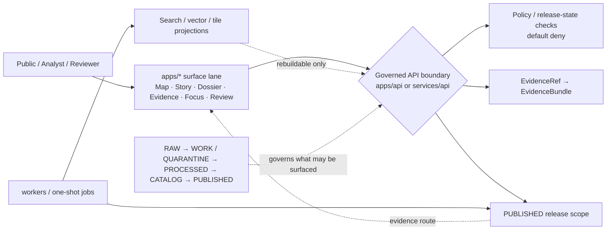

<!-- [KFM_META_BLOCK_V2]
doc_id: kfm://doc/<NEEDS-UUID>
title: Apps Runtime Surfaces
type: standard
version: v1
status: draft
owners: <NEEDS VERIFICATION>
created: <NEEDS VERIFICATION>
updated: <NEEDS VERIFICATION>
policy_label: <NEEDS VERIFICATION>
related: [../README.md, ../docs/, ../contracts/, ../policy/, ../infra/]
tags: [kfm, apps, runtime, governance]
notes: [Grounded in the attached March 2026 KFM corpus; current-session workspace inspection exposed PDFs only, so live repo topology, owners, exact commands, and local links still require review before commit.]
[/KFM_META_BLOCK_V2] -->

# Apps Runtime Surfaces

Governed application surfaces for KFM’s map-native shell, trust-visible UX, and any colocated runtime lanes under `apps/`.

**Status:** experimental **(NEEDS VERIFICATION)**  
**Owners:** `<NEEDS VERIFICATION>`  
**Badges:**      
**Quick jump:** [Scope](#scope) · [Repo fit](#repo-fit) · [Accepted inputs](#accepted-inputs) · [Exclusions](#exclusions) · [Directory tree](#directory-tree) · [Quickstart](#quickstart) · [Usage](#usage) · [Runtime diagram](#runtime-diagram) · [Reference tables](#reference-tables) · [Task list](#task-list) · [FAQ](#faq) · [Appendix](#appendix)  
**Repo fit:** `apps/` · Upstream links to verify: [../README.md](../README.md) · [../docs/](../docs/) · [../contracts/](../contracts/) · [../policy/](../policy/) · [../infra/](../infra/)  
**Downstream links to verify:** [./api/](./api/) · [./ui/](./ui/) · [./workers/](./workers/) · [./web/](./web/) · [./review/](./review/)

> [!IMPORTANT]
> This README is grounded in the attached March 2026 KFM document corpus and in current-session workspace inspection that exposed PDF artifacts only. Treat all path details, owners, commands, and local links marked **INFERRED**, **PROPOSED**, **UNKNOWN**, or **NEEDS VERIFICATION** as merge-time review items.

---

## Scope

`apps/` is the runtime-facing surface layer for KFM.

At the doctrinal level, KFM is map-first, time-aware, evidence-first, trust-visible, and governed. That means application surfaces are not decorative wrappers around storage or model runtimes. They are the place where geography, time scope, evidence route, review state, policy state, and release state become visible and actionable.

### Stable across the corpus

- **CONFIRMED:** public-facing KFM behavior must remain downstream of a governed API boundary
- **CONFIRMED:** claim-bearing surfaces must open into evidence, not into a second hidden truth system
- **CONFIRMED:** Map, Story, Dossier, Evidence Drawer, and Focus-like investigation surfaces belong to the same governed product family
- **CONFIRMED:** review or stewardship is a variation of the same shell, not a detached epistemic system
- **CONFIRMED:** 2D is the default operating surface; 3D is conditional, not a new sovereign truth lane

### Still variable across the corpus

- **INFERRED:** whether the governed API lives directly under `apps/` or under a sibling `services/` lane in later realization overlays
- **INFERRED:** whether reviewer surfaces are named `ui/`, `review/`, or a more decomposed web-shell set
- **UNKNOWN:** the exact live subtree in the current repository checkout
- **UNKNOWN:** whether operator-facing CLI entrypoints live under `apps/` in the mounted repo

### What this README is for

This file anchors the stable contract of the `apps/` boundary:

- what belongs here
- what must stay outside it
- what remains invariant even if the local repo topology changes
- what must be verified before tightening this README into a fully path-accurate directory guide

[Back to top](#apps-runtime-surfaces)

---

## Repo fit

| Field | Value |
|---|---|
| Path | `apps/` |
| Primary role | Deployable application surfaces and shell-level runtime entrypoints |
| Architectural posture | map-first, time-aware, evidence-linked, policy-mediated, fail-closed |
| Stable downstream consumers | public users, analysts, reviewers/stewards, operators |
| Stable upstream dependencies | `contracts/`, `policy/`, `packages/`, governed data/catalog outputs, docs/runbooks **(all NEEDS VERIFICATION as local paths)** |
| Non-negotiable boundary | no client-side bypass of governed API, canonical stores, or model runtime |
| Release posture | public behavior stays downstream of publication state, policy, and evidence resolution |

### Upstream / downstream map

**Upstream into `apps/`:**

- promoted datasets and published release scope
- contracts and controlled vocabularies
- policy decisions and reason / obligation codes
- evidence resolution machinery
- shared libraries and adapters
- runtime configuration and deployment wiring

**Downstream from `apps/`:**

- map-first exploration
- story and dossier surfaces
- evidence inspection
- Focus-style bounded synthesis
- steward / reviewer flows
- app-visible audit references and calm failure states

### Corpus signals that shape this README

| Corpus signal | What it stabilizes | What still needs verification |
|---|---|---|
| Earlier repo skeletons | `apps/` exists as a top-level home for deployable surfaces; `apps/api`, `apps/ui`, and `apps/workers` are repeatedly proposed together | whether this exact shape is the live repo shape |
| Later realization overlays | public/reviewer surfaces may stay in `apps/`, while API and job lanes may split into sibling `services/` and `workers/` roots | whether that later split has replaced the earlier shape locally |
| Runtime and security overlays | the governed API boundary, evidence resolver, policy hook, and no-direct-client-access rule remain mandatory regardless of folder names | exact implementation paths, service names, and manifests |

[Back to top](#apps-runtime-surfaces)

---

## Accepted inputs

The safest reading of `apps/` is: **deployable application surfaces first, shell composition second, colocated runtime entrypoints only where the repo actually places them here**.

### Content that belongs here

| Belongs here when it is… | Examples | Status |
|---|---|---|
| a user-facing shell or surface | map shell, story surface, dossier view, evidence drawer, Focus pane | **CONFIRMED concept** |
| a reviewer / steward shell variation | review queue, stewardship surface, restricted approval views | **CONFIRMED concept** |
| shell-level interaction logic | route composition, panel choreography, URL/share state, accessibility and motion behavior | **CONFIRMED concept** |
| app-local tests or fixtures | surface smoke tests, accessibility checks, shell integration tests | **INFERRED** |
| app-local docs | lane README, shell notes, local bring-up guidance, review checklists | **PROPOSED** |
| a colocated API app in an earlier topology | `apps/api` as the governed API boundary | **INFERRED from corpus; NEEDS VERIFICATION locally** |
| an operator or CLI app kept under `apps/` | promotion CLI, app-shell utilities | **INFERRED; NEEDS VERIFICATION** |

### Surface families this directory should serve well

| Surface family | Core obligation |
|---|---|
| Map / Explore | keep geography primary and evidence one click away |
| Timeline / compare | make time explicit, not hidden in metadata |
| Story / dossier | preserve place, time, source, and review context |
| Evidence Drawer | resolve consequential claims into inspectable support |
| Focus | answer with citations and audit linkage, or abstain |
| Review / stewardship | preserve the same trust model with stronger internal controls |

[Back to top](#apps-runtime-surfaces)

---

## Exclusions

`apps/` should not become a shadow source of truth.

### Content that does **not** belong here

| Does not belong here | Put it under | Why |
|---|---|---|
| canonical truth-path artifacts | `data/` lifecycle zones | app surfaces must consume governed outputs, not become the canonical store |
| authoritative contracts and schemas | `contracts/` | app code should not silently redefine public or evidence contracts |
| policy bundles and test fixtures | `policy/` | governance must remain explicit, testable, and reviewable |
| shared reusable domain / evidence / policy logic | `packages/` | prevents app-to-app drift and duplication |
| raw or quarantined assets | `data/raw/` or `data/work/` / `data/quarantine/` | public or reviewer shells must not normalize bypass |
| direct model-runtime exposure | runtime/service boundary, never a client surface | model runtimes stay behind a governed adapter |
| service-plane code if the later split is followed | `services/` / `workers/` | later realization overlays separate deployable services from app shells |

> [!WARNING]
> The March 2026 corpus is clear on the boundary even where folder names drift: **clients never access canonical stores directly**, and **public surfaces never talk to model runtimes directly**.

[Back to top](#apps-runtime-surfaces)

---

## Directory tree

The live repo tree was **not** mounted in the current session. The safest repo-ready move is to document the topology signals the corpus actually gives us, then require tree verification before tightening the file.

### Variant A — earlier corpus-reported skeleton

```text
apps/
├─ api/         # INFERRED earlier shape: governed API boundary
├─ ui/          # INFERRED earlier shape: map/story/focus shell
├─ workers/     # INFERRED earlier shape: app-local runtime jobs
└─ cli/         # INFERRED possible lane; not stable across the corpus
```

### Variant B — later realization split

```text
apps/
├─ web/         # PROPOSED later shape: public shell
└─ review/      # PROPOSED later shape: stewardship shell

services/
├─ api/
├─ catalog/
├─ evidence/
└─ release/

workers/
├─ connectors/
├─ validation/
└─ projections/
```

### How to read the split

- **CONFIRMED:** the shell family is stable
- **INFERRED:** the exact subdirectory names are not yet stable across the corpus
- **NEEDS VERIFICATION:** the current mounted repo tree before treating any one variant as authoritative

### Expected local README coverage

| Path | Expected role | Status |
|---|---|---|
| `apps/README.md` | top-level boundary for all app surfaces | **this file** |
| `apps/api/README.md` | API trust membrane and route posture if API is colocated under `apps/` | **INFERRED** |
| `apps/ui/README.md` or `apps/web/README.md` | shell, surface, state, and accessibility posture | **INFERRED** |
| `apps/review/README.md` | reviewer / steward shell if present | **PROPOSED** |
| `apps/workers/README.md` | app-local runtime jobs only if the live tree keeps them here | **PROPOSED** |

[Back to top](#apps-runtime-surfaces)

---

## Quickstart

These commands are intentionally verification-first. Run them **from the repo root** once the live tree is available.

```bash
# 1) Confirm which runtime-surface topology the repo actually uses
find . -maxdepth 2 \
  \( -path './apps/*' -o -path './services/*' -o -path './workers/*' \) \
  -type d | sort
```

```bash
# 2) Find local READMEs and likely entrypoints near runtime surfaces
find apps services workers -maxdepth 3 \
  \( -name 'README.md' -o -name 'package.json' -o -name 'pyproject.toml' -o -name 'go.mod' -o -name 'Dockerfile' \) \
  2>/dev/null | sort
```

```bash
# 3) Locate evidence-facing and trust-boundary vocabulary in code and docs
grep -RInE 'EvidenceRef|EvidenceBundle|audit_ref|Focus|Story|Dossier|review|steward|policy' \
  apps services workers packages contracts policy docs 2>/dev/null | head -n 200
```

```bash
# 4) Confirm whether tests exist close to surface lanes
find apps services workers tests -maxdepth 4 \
  \( -path '*/test*' -o -path '*/tests/*' -o -name '*spec*' -o -name '*e2e*' \) \
  2>/dev/null | sort
```

> [!NOTE]
> This README intentionally avoids package-manager, bootstrap, and run commands because the current session did not verify the mounted repo tree, manifests, or toolchain. Add real boot commands only after verifying the actual app stack.

[Back to top](#apps-runtime-surfaces)

---

## Usage

Treat `apps/` as the place where KFM’s governing laws become visible product behavior.

### Directory contract

1. **CONFIRMED:** app surfaces must stay downstream of a governed API boundary.
2. **CONFIRMED:** claim-bearing UI must preserve a route back to evidence.
3. **CONFIRMED:** review or stewardship stays inside the same trust model, not in a detached side product.
4. **CONFIRMED:** 2D is the default reasoning surface; 3D must justify its governance burden.
5. **INFERRED:** if API code lives outside `apps/`, this README still governs the shell boundary, not the service boundary.
6. **PROPOSED:** each real app lane should carry a local README describing inputs, exclusions, review gates, and test expectations.

### What “good” looks like here

- the map remains the operating center
- time scope is explicit and user-visible
- evidence opens from consequential claims without friction
- Focus answers cite correctly or abstain
- reviewer surfaces preserve policy and release-state visibility
- calm failure states are part of the contract
- accessibility is treated as part of correctness, not a polish pass

### What to avoid

- detached “AI tab” behavior with no evidence route
- dashboards or cards that hide time basis, release scope, or source role
- client-side store access
- app-local contract drift
- silent use of search, vector, or graph layers as if they were canonical truth
- spectacle-first 3D that outruns the trust model

[Back to top](#apps-runtime-surfaces)

---

## Runtime diagram


```mermaid
flowchart LR
    User[Public / Analyst / Reviewer] --> Apps[apps/* surface lane<br/>Map · Story · Dossier · Evidence · Focus · Review]

    Apps --> API{Governed API boundary<br/>apps/api or services/api}

    API --> Policy[Policy / release-state checks<br/>default deny]
    API --> Resolver[EvidenceRef → EvidenceBundle]
    API --> Published[PUBLISHED release scope]

    Workers[workers / one-shot jobs] --> Published
    Workers --> Proj[Search / vector / tile projections]

    Proj -. rebuildable only .-> API
    Published -. evidence route .-> Apps

    Canonical[RAW → WORK / QUARANTINE → PROCESSED → CATALOG → PUBLISHED]
    Canonical -. governs what may be surfaced .-> API
```

### Diagram reading notes

- **CONFIRMED:** the trust membrane is mandatory even if folder names differ
- **CONFIRMED:** projections may accelerate runtime behavior but do not become sovereign truth
- **INFERRED:** the API may be colocated under `apps/` or split into a sibling service lane
- **PROPOSED:** reviewer surfaces stay in the same shell family rather than becoming a separate product universe

[Back to top](#apps-runtime-surfaces)

---

## Reference tables

### Lane responsibilities

| Lane | Primary job | Must never do | Status |
|---|---|---|---|
| Public shell | map/story/dossier/evidence/focus interaction | hide evidence route or release scope | **CONFIRMED concept** |
| Review shell | approvals, stewardship, policy/release visibility | create a second truth system detached from publication state | **CONFIRMED concept** |
| Colocated API app | governed request handling if API lives under `apps/` | expose direct store or model access to clients | **INFERRED** |
| App-local worker lane | app-adjacent jobs only if the repo actually keeps them here | publish canonical truth outside review and promotion | **PROPOSED** |
| CLI / operator app | explicit human-invoked tooling only if kept under `apps/` | bypass contracts, receipts, or policy tests | **INFERRED** |

### Truth posture inside `apps/`

| Topic | Required posture |
|---|---|
| Evidence | cite-or-abstain for claim-bearing behavior |
| Publication scope | surface promoted outputs only |
| Policy | default-deny / fail-closed |
| Provenance | keep audit linkage visible or reconstructable |
| Derived layers | accelerate access without replacing canonical truth |
| Accessibility | part of the product contract |
| 3D | conditional aid, not default truth surface |

### Verification snapshot

| Item | Current label | What to verify next |
|---|---|---|
| `apps/` exists as a top-level runtime boundary | **INFERRED from corpus** | confirm live repo tree |
| `apps/api` exists locally | **INFERRED** | inspect mounted repo |
| `apps/ui` or `apps/web` is the current shell path | **UNKNOWN** | inspect mounted repo |
| `apps/review` exists locally | **PROPOSED** | inspect mounted repo |
| `apps/workers` exists locally | **INFERRED** | inspect mounted repo |
| CLI under `apps/` | **UNKNOWN** | inspect mounted repo |
| Owners | **UNKNOWN** | populate from CODEOWNERS or adjacent docs |
| Toolchain commands | **UNKNOWN** | inspect manifests and runbooks |
| Neighbor README links | **UNKNOWN** | verify actual paths before merge |

[Back to top](#apps-runtime-surfaces)

---

## Task list

### Definition of done for this README

- [ ] verify the live `apps/`, `services/`, and `workers/` subtree
- [ ] resolve whether the local repo follows the earlier `apps/api/ui/workers` shape or the later `apps/web/review` split
- [ ] confirm whether any CLI lane really belongs under `apps/`
- [ ] confirm owners from authoritative repo evidence
- [ ] replace placeholder metadata values in the KFM meta block
- [ ] replace verification-first commands with real boot / run / test commands
- [ ] tighten relative links to actual neighboring READMEs
- [ ] confirm app-surface accessibility and smoke-test coverage

### Review gates for app-surface changes

- [ ] no client-to-store or client-to-model bypass introduced
- [ ] evidence routes remain visible for consequential claims
- [ ] Focus-like behavior still answers with citations or abstains
- [ ] review/steward surfaces still reflect release and policy state
- [ ] derived layers remain explicitly non-authoritative
- [ ] docs and tests were updated when runtime behavior changed

[Back to top](#apps-runtime-surfaces)

---

## FAQ

### Does `apps/` always contain the governed API?

Not necessarily. Earlier corpus skeletons place the governed API under `apps/api`. Later realization overlays split service code into sibling `services/` and `workers/` roots. The invariant is the governed API boundary itself, not one unverified folder name.

### Why does this README document more than one tree shape?

Because the attached March 2026 corpus does not settle one live repo topology in the current session. This README keeps that ambiguity visible instead of pretending the tree was directly verified.

### Can Focus Mode live as a detached chatbot tab?

No. Focus belongs inside the same governed shell family and must remain evidence-bounded.

### Can the browser talk directly to PostgreSQL, object storage, or the model runtime?

No. That violates the trust membrane.

### Why is 3D not listed as a default app lane?

Because the corpus consistently treats 2D as the default public reasoning surface and makes 3D conditional on real volumetric or terrain reasoning value.

[Back to top](#apps-runtime-surfaces)

---

## Appendix

<details>
<summary><strong>Glossary, topology notes, and review follow-ups</strong></summary>

### Compact glossary

- **Trust membrane** — the rule that clients cross governed APIs instead of reaching internal stores or runtimes directly.
- **EvidenceRef** — a stable reference token carried by claim-bearing flows.
- **EvidenceBundle** — the resolved, policy-filtered evidence payload behind an EvidenceRef.
- **Release scope** — the set of artifacts and facts promoted for governed surface use.
- **Derived layer** — a rebuildable acceleration surface such as search, vector, or tiles.
- **Shell choreography** — how map, timeline, dossier, evidence, review, and Focus panes coordinate without breaking trust context.

### Topology note

The corpus is clearer about **boundary law** than about **local folders**. That is why this README is conservative about exact subpaths while still being specific about what app lanes must do.

### Practical follow-ups

1. Verify the live repo tree and collapse the topology-variant section to the single local shape in use.
2. Confirm whether the governed API remains under `apps/` or has moved to a sibling service root.
3. Audit neighboring READMEs and align terminology across `apps/`, `contracts/`, `policy/`, and `infra/`.
4. Add real startup and test commands once manifests and task runners are confirmed.
5. Populate owners, dates, and policy label from authoritative repo evidence.

</details>

[Back to top](#apps-runtime-surfaces)
