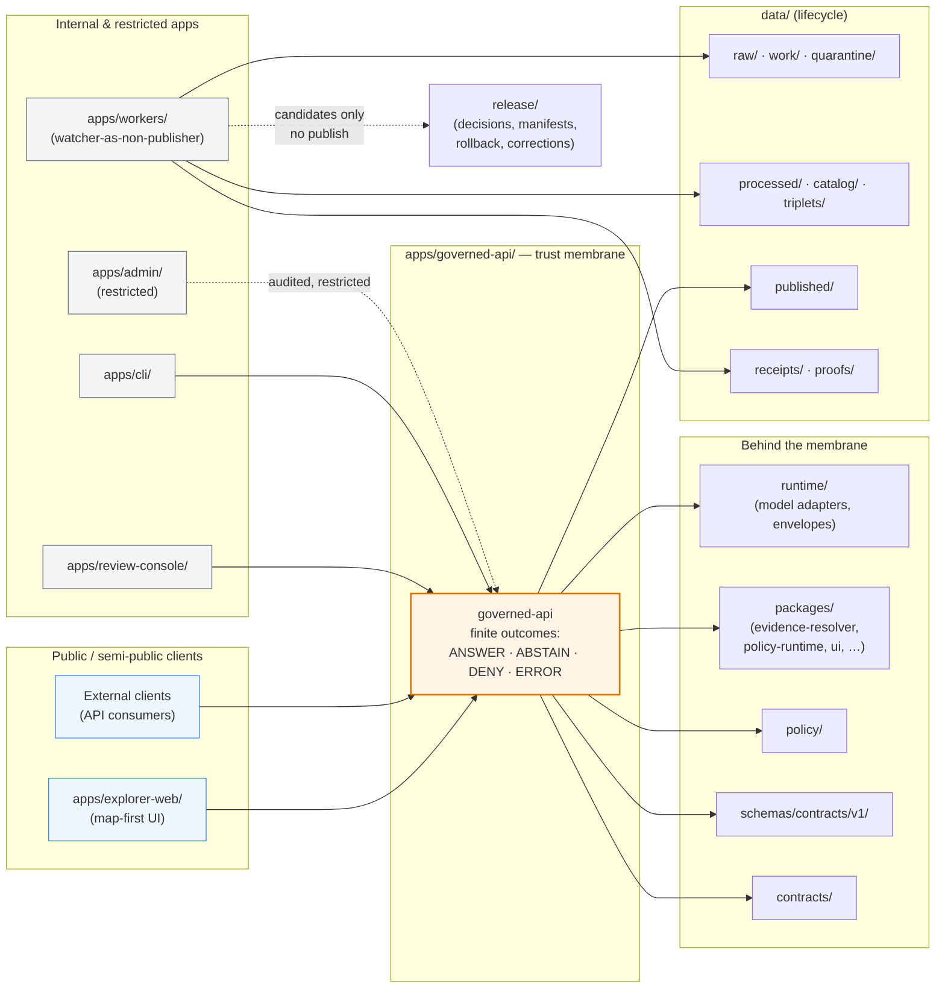

<!-- [KFM_META_BLOCK_V2]
doc_id: kfm://doc/apps-readme
title: apps/ — Deployable Applications
type: standard
version: v1
status: draft
owners: TBD-apps-steward
created: 2026-05-10
updated: 2026-05-10
policy_label: public
related:
  - docs/doctrine/directory-rules.md
  - docs/architecture/governed-api.md
  - docs/architecture/map-shell.md
  - docs/adr/ADR-0001-schema-home.md
  - packages/README.md
  - data/README.md
  - release/README.md
tags: [kfm, apps, deployables, trust-membrane]
notes:
  - Authority for this folder derives from Directory Rules §7.1.
  - Per-app subfolders are PROPOSED until verified against mounted repo state.
[/KFM_META_BLOCK_V2] -->

# `apps/` — Deployable Applications

> The deployable surface of KFM. Every public client, every steward console, every operator CLI, every background worker lives here — and every one of them respects the trust membrane.

<!-- impact block -->

[](#status)
[](#authority-level)
[](../docs/doctrine/directory-rules.md)
[](#the-apps-and-their-roles)
[](#review-burden)

**Owners:** apps steward · subsystem owners per sub-app *(TBD — see CODEOWNERS)*  
**Status:** active (canonical root)  
**Last reviewed:** 2026-05-10

**Jump to:** [Purpose](#purpose) · [What belongs](#what-belongs-here) · [What does NOT belong](#what-does-not-belong-here) · [Directory tree](#directory-tree) · [Apps & roles](#the-apps-and-their-roles) · [Trust membrane](#trust-membrane-invariant) · [Diagram](#diagram) · [Inputs](#inputs) · [Outputs](#outputs) · [Validation](#validation) · [Related folders](#related-folders) · [ADRs](#adrs) · [Open questions](#open-questions--needs-verification)

---

## Purpose

`apps/` is the **deployable** surface of the Kansas Frontier Matrix. It holds the runnable applications — services, UIs, consoles, CLIs, and workers — that turn governed contracts, schemas, policies, packages, pipelines, and lifecycle data into something a person, machine, or external client can actually use.

It is the *only* root where a deployable application belongs. Shared library code lives in [`packages/`](../packages/). Source-specific fetchers live in [`connectors/`](../connectors/). Pipeline logic lives in [`pipelines/`](../pipelines/). Local AI runtime adapters live in [`runtime/`](../runtime/). `apps/` *composes* these into the things that ship.

---

## Authority level

**Canonical.** `apps/` is a canonical responsibility root per Directory Rules §3 and §5. The public trust path of KFM — the boundary across which any external or semi-external client must travel — is operationalized inside `apps/governed-api/`. No other folder may take that role.

---

## Status

| Field | Value |
|---|---|
| Authority | **Canonical** |
| Conformance | Subject to Directory Rules §7.1 and §15 |
| Doctrine source | `docs/doctrine/directory-rules.md` §7.1 — *CONFIRMED in doctrine* |
| Per-app presence | **PROPOSED until verified** against mounted repo state |
| Trust-membrane status | Public clients **MUST** transit `apps/governed-api/` |

> [!IMPORTANT]
> The role table below is **CONFIRMED in doctrine** (Directory Rules §7.1). Whether each named sub-app exists today, and in what shape, is **PROPOSED / NEEDS VERIFICATION** until checked against current repo evidence. Do not treat this README as proof of implementation maturity.

---

## Repo fit

```text
Kansas-Frontier-Matrix/
└── apps/        ← you are here (deployable applications)
```

**Reads from (typical):**

- [`packages/`](../packages/) — shared libraries (evidence-resolver, policy-runtime, schema-registry, ui, maplibre, cesium, …)
- [`runtime/`](../runtime/) — model adapters, envelope helpers, mock adapter
- [`schemas/contracts/v1/`](../schemas/) — machine shape contracts (per ADR-0001)
- [`contracts/`](../contracts/) — object meaning
- [`policy/`](../policy/) — admissibility and release policy
- [`configs/`](../configs/) — non-secret config defaults and templates
- [`data/published/`](../data/) — public-safe outputs (read *only* through the governed API surface, not by bypass)

**Writes to (typical):**

- [`data/receipts/`](../data/) — run, validation, AI, ingest, release receipts
- [`data/proofs/`](../data/) — evidence bundles, proof packs (via packages)
- [`release/`](../release/) — release decisions, manifests, rollback cards, correction notices (via authorized apps only)
- *(workers may emit candidate records and receipts; they MUST NOT publish — see [Trust membrane](#trust-membrane-invariant))*

**Deployed and operated through:** [`infra/`](../infra/) (deny-by-default, least privilege, audit).

---

## What belongs here

A folder under `apps/` belongs here if and only if it is **a deployable application** — something that runs as a service, UI, console, CLI, daemon, or batch worker, and is the unit of release.

Concretely, the following file/folder kinds belong under each sub-app:

- Application source code that composes `packages/` and consumes `contracts/`, `schemas/`, `policy/`, `runtime/`.
- Application-level entry points, manifests, and process definitions.
- Application-specific configuration *templates* and example values (real values live in [`configs/`](../configs/) or environment-specific secret stores).
- Application-scoped tests that exercise the deployable surface end-to-end *(unit tests for shared libraries still live in [`tests/`](../tests/) and [`packages/`](../packages/))*.
- Application-scoped documentation: a `README.md` per sub-app describing role, public/internal boundary, finite outcomes, and operator notes.

## What does NOT belong here

The most useful list in this README. If you are about to add something to `apps/`, check this list **first**.

- **Shared library code.** → [`packages/`](../packages/) (reusable across deployables).
- **Source-specific fetchers and admitters.** → [`connectors/`](../connectors/).
- **Executable pipeline logic.** → [`pipelines/`](../pipelines/). Declarative pipeline config → [`pipeline_specs/`](../pipeline_specs/).
- **Repo-wide validators, generators, builders.** → [`tools/`](../tools/).
- **One-off operational scripts.** → [`scripts/`](../scripts/) (graduate long-lived, trust-bearing logic to `tools/`, `pipelines/`, or `packages/`).
- **Lifecycle data of any phase.** → [`data/`](../data/) (`raw/`, `work/`, `quarantine/`, `processed/`, `catalog/`, `triplets/`, `published/`, `receipts/`, `proofs/`, `rollback/`, `registry/`).
- **Release decisions and manifests.** → [`release/`](../release/). *Released artifacts* live in [`data/published/`](../data/) — see Directory Rules §9.2.
- **Schemas (machine shape).** → [`schemas/contracts/v1/...`](../schemas/) per ADR-0001.
- **Contracts (object meaning).** → [`contracts/`](../contracts/).
- **Policy bundles, sensitivity rules, rights enforcement.** → [`policy/`](../policy/).
- **Local AI runtime adapters or harnesses.** → [`runtime/`](../runtime/) — kept *behind* `apps/governed-api/`, never a public surface.
- **Deployment, host, firewall, reverse-proxy, VPN posture.** → [`infra/`](../infra/).
- **Build outputs, generated docs, QA reports, temporary files.** → [`artifacts/`](../artifacts/) (compatibility root, tightly scoped per Directory Rules §8.2).
- **Domain-named root folders.** → Domains live as **lanes** inside responsibility roots (Directory Rules §12), never as roots and never as direct `apps/<domain>/` children.
- **Anything trust-bearing presented as the canonical home.** Receipts, proofs, evidence bundles, release manifests, promotion decisions, rollback cards, and correction notices live under [`data/receipts/`](../data/), [`data/proofs/`](../data/), or [`release/`](../release/) — not inside `apps/`.

---

## Directory tree

> **Status:** *Tree shape is CONFIRMED in doctrine (Directory Rules §7.1). Specific sub-app presence in the current repo is **PROPOSED / NEEDS VERIFICATION**.*

```text
apps/
├── README.md            # this file
├── governed-api/        # PUBLIC TRUST PATH — trust membrane, finite-outcome envelopes
├── explorer-web/        # map-first public/semi-public UI; reads only via governed-api
├── review-console/      # steward review, promotion, correction, sensitivity decisions
├── cli/                 # operator CLI — validation, release dry-runs, reports
├── workers/             # background workers; watcher-as-non-publisher (receipts + candidates only)
└── admin/               # restricted admin; NOT a normal public path
```

Each sub-app **MUST** carry its own `README.md` satisfying Directory Rules §15 (purpose, authority, status, what belongs / does not, inputs, outputs, validation, review burden, related folders, ADRs, last reviewed).

---

## The apps and their roles

> Role assignments below are **CONFIRMED in doctrine** (Directory Rules §7.1, role table). Implementation presence and maturity remain **PROPOSED / NEEDS VERIFICATION** until checked in-repo.

| App | Role | Public-facing? | Notes |
|---|---|---|---|
| [`governed-api/`](./governed-api/) | The trust membrane in executable form. Returns `RuntimeResponseEnvelope` with finite outcomes — **ANSWER**, **ABSTAIN**, **DENY**, **ERROR**. **MUST** be the public trust path. | **Yes — sole public trust path** | Schema home for envelopes: [`schemas/contracts/v1/runtime/`](../schemas/). |
| [`explorer-web/`](./explorer-web/) | Map-first public/semi-public UI. Reads via `governed-api/`; **never** directly from `data/raw\|work\|quarantine`. | Yes (semi-public) | Renderer libs are shared: [`packages/maplibre/`](../packages/), [`packages/cesium/`](../packages/), [`packages/ui/`](../packages/). |
| [`review-console/`](./review-console/) | Steward / reviewer surface for promotion, correction, sensitivity, rights review. Role-gated and audited. | No — internal, audited | Calls go through `governed-api/` with elevated, audited roles. |
| [`cli/`](./cli/) | Operator CLI: validation runs, release dry-runs, reports, maintenance flows. | No | Long-lived, trust-bearing CLI commands; one-offs belong in [`scripts/`](../scripts/). |
| [`workers/`](./workers/) | Background workers: ingestion, validation, cataloging, tiling, receipts. **Watcher-as-non-publisher** applies: workers emit *receipts* and *candidate* decisions, **never** publish or rewrite catalog. | No | Output paths: [`data/receipts/`](../data/), candidate records under appropriate lifecycle phase. |
| [`admin/`](./admin/) | Restricted admin. **MUST NOT** become the normal public path. Justified, constrained, documented, audited. | No — restricted | Admin shortcuts are documented exceptions per Directory Rules §10.2 & §13. |

> [!WARNING]
> **Two-API rule.** If both `apps/api/` and `apps/governed-api/` exist in the repo, the canonical boundary **MUST** be explicit. `apps/governed-api/` is the public trust path; `apps/api/` is either deprecated, internal-only, or a narrowly documented service. This boundary is currently **OPEN / NEEDS VERIFICATION** (Directory Rules §18).

---

## Trust membrane invariant

The trust membrane is the boundary that prevents raw, unreviewed, model-generated, or internal-state material from becoming public truth. In `apps/`, it has one operational form: **`apps/governed-api/`**.

The invariants that flow from this:

1. **Public clients MUST transit `apps/governed-api/`.** UI surfaces (including `apps/explorer-web/`) **MUST NOT** read directly from `data/raw/`, `data/work/`, or `data/quarantine/`. They consume governed responses only.
2. **Responses are finite-outcome.** `apps/governed-api/` returns a `RuntimeResponseEnvelope` whose outcome is one of: **ANSWER**, **ABSTAIN**, **DENY**, **ERROR**. There is no fifth outcome and no silent partial.
3. **Cite-or-abstain.** When a response carries claims, those claims resolve through `EvidenceRef → EvidenceBundle` via [`packages/evidence-resolver/`](../packages/). When evidence cannot support the claim, the outcome is **ABSTAIN**, not a fluent guess.
4. **Watcher-as-non-publisher.** `apps/workers/` **emit** receipts and candidate decisions to [`data/receipts/`](../data/) and to the appropriate lifecycle phase. They **do not** publish to [`data/catalog/`](../data/) or [`data/published/`](../data/), and they do not rewrite canonical records.
5. **Admin shortcuts are not the public path.** `apps/admin/` is justified, constrained, documented, audited — and kept out of normal public traffic.
6. **Local AI stays behind the membrane.** Local model adapters (e.g., Ollama) live in [`runtime/`](../runtime/) and are reached *only* via `apps/governed-api/`. They never receive direct public client traffic and never read canonical or raw stores directly.

> [!CAUTION]
> A public route that reads `data/processed/`, `data/raw/`, or any other canonical/internal store directly is a **trust-membrane violation** (Directory Rules §13.5). It does not become acceptable by being convenient.

---

## Diagram

The trust-membrane shape of `apps/`:


```mermaid
flowchart LR
  subgraph Public["Public / semi-public clients"]
    EW["apps/explorer-web/<br/>(map-first UI)"]
    EXT["External clients<br/>(API consumers)"]
  end

  subgraph Trust["apps/governed-api/ — trust membrane"]
    GAPI["governed-api<br/>finite outcomes:<br/>ANSWER · ABSTAIN · DENY · ERROR"]
  end

  subgraph Internal["Internal & restricted apps"]
    RC["apps/review-console/"]
    CLI["apps/cli/"]
    WK["apps/workers/<br/>(watcher-as-non-publisher)"]
    ADM["apps/admin/<br/>(restricted)"]
  end

  subgraph Behind["Behind the membrane"]
    RT["runtime/<br/>(model adapters, envelopes)"]
    PKG["packages/<br/>(evidence-resolver,<br/>policy-runtime, ui, …)"]
    POL["policy/"]
    SCH["schemas/contracts/v1/"]
    CON["contracts/"]
  end

  subgraph Lifecycle["data/ (lifecycle)"]
    RAW["raw/ · work/ · quarantine/"]
    PROC["processed/ · catalog/ · triplets/"]
    PUB["published/"]
    REC["receipts/ · proofs/"]
  end

  REL["release/<br/>(decisions, manifests,<br/>rollback, corrections)"]

  EW --> GAPI
  EXT --> GAPI
  RC --> GAPI
  CLI --> GAPI

  GAPI --> RT
  GAPI --> PKG
  GAPI --> POL
  GAPI --> SCH
  GAPI --> CON
  GAPI --> PUB

  WK --> REC
  WK --> RAW
  WK --> PROC
  WK -. "candidates only<br/>no publish" .-> REL

  ADM -. "audited, restricted" .-> GAPI

  classDef trust fill:#fff4e6,stroke:#d97706,stroke-width:2px;
  classDef public fill:#eef6ff,stroke:#3a82f6;
  classDef internal fill:#f3f4f6,stroke:#6b7280;
  class GAPI trust;
  class EW,EXT public;
  class RC,CLI,WK,ADM internal;
```

> *Diagram is doctrine-grounded (Directory Rules §7.1 + §13.5). Edge directionality reflects authoritative responsibility, not implementation wiring; specific call paths are **NEEDS VERIFICATION** in the current repo.*

---

## Inputs

`apps/` does not invent material. Each sub-app composes inputs that originate elsewhere:

- **Object meaning** from [`contracts/`](../contracts/).
- **Machine shape** from [`schemas/contracts/v1/`](../schemas/) (per ADR-0001).
- **Admissibility, sensitivity, rights, release gates** from [`policy/`](../policy/).
- **Reusable behavior** from [`packages/`](../packages/) — evidence resolver, policy runtime, schema registry, source registry, hashing, geo, temporal, catalog, release, ui, maplibre, cesium.
- **Local runtime wiring** from [`runtime/`](../runtime/) — model adapters, envelope helpers, mock adapter, service configs.
- **Lifecycle data** from [`data/`](../data/), accessed *through the trust membrane*, not by direct file reads from public clients.
- **Non-secret configuration** from [`configs/`](../configs/). Real secrets resolve via environment-specific secret stores referenced by name.

## Outputs

Apps emit governed outputs only:

- **`RuntimeResponseEnvelope`** responses from `apps/governed-api/` — finite-outcome wrappers consumed by clients and other apps.
- **Receipts** under [`data/receipts/`](../data/) — run, validation, AI, ingest, release receipts emitted by workers and authorized apps.
- **Candidate records** under the appropriate lifecycle phase, emitted by `apps/workers/`. *Promotion to the next phase is a governed state transition, not a workers write.*
- **Decisions** under [`release/`](../release/) — release manifests, promotion decisions, rollback cards, correction notices, withdrawal notices — recorded by authorized apps (typically `review-console/` and `cli/`).
- **UI surfaces** rendered by `apps/explorer-web/` consuming governed responses only.
- **Operator output** from `apps/cli/` — reports, validation summaries, release dry-runs.

Apps **do not** emit canonical truth directly into `data/processed/`, `data/catalog/`, or `data/published/` outside the governed promotion path.

---

## Validation

How `apps/` is checked. *Specific tooling names below are **NEEDS VERIFICATION** against current repo state; the categories of check are CONFIRMED by Directory Rules and KFM doctrine.*

- **Contract conformance** — apps that emit envelopes are checked against `schemas/contracts/v1/runtime/` (per ADR-0001). *Validator location: PROPOSED — likely [`tools/validators/`](../tools/) per Directory Rules §7.5.*
- **Policy conformance** — runtime gate policy (Focus Mode, evidence resolution, abstain rules) lives in [`policy/runtime/`](../policy/); promotion gate policy in [`policy/promotion/`](../policy/); release gate policy in [`policy/release/`](../policy/). Apps consume these via [`packages/policy-runtime/`](../packages/).
- **Trust-membrane checks** — automated checks that no public route reads canonical/internal stores directly (Directory Rules §13.5). *Check location: PROPOSED.*
- **Watcher-as-non-publisher checks** — verifies `apps/workers/` does not write to `data/catalog/` or `data/published/` (Directory Rules §13.5).
- **End-to-end tests** — live in [`tests/api/`](../tests/), [`tests/ui/`](../tests/), [`tests/e2e/`](../tests/), and [`tests/runtime_proof/`](../tests/) (finite-outcome and abstain proof). *Per Directory Rules §6.6.*
- **CI workflow names and badges** — **NEEDS VERIFICATION** against `.github/workflows/`.

> [!NOTE]
> Replace the badge URLs in the impact block with the actual CI workflow names once verified. Until then they are placeholders.

---

## Review burden

Per Directory Rules §15 and §2.4:

- **Per-app changes:** sub-app `CODEOWNERS` + the apps steward.
- **Cross-app structural changes** (adding, removing, renaming a sub-app; promoting `apps/api/` ↔ `apps/governed-api/` boundary; introducing a new public surface): **ADR required** (Directory Rules §2.4). Reviewers must include the apps steward and at least one subsystem owner (governance, policy, or runtime).
- **Trust-membrane-affecting changes** (anything that could let a public client read canonical stores directly, or let a worker publish): require explicit sign-off from the governance steward in addition to apps and subsystem owners.
- **Admin scope changes** (anything that widens what `apps/admin/` can do or who can reach it): require security review and a runbook entry under [`docs/runbooks/`](../docs/runbooks/).

`CODEOWNERS` references — **NEEDS VERIFICATION** against `.github/CODEOWNERS` or root `CODEOWNERS`.

---

## Related folders

| Folder | Relationship |
|---|---|
| [`packages/`](../packages/) | Shared libraries consumed by every app. Reusable; one-off workflow steps belong in [`tools/`](../tools/) or [`pipelines/`](../pipelines/) instead. |
| [`runtime/`](../runtime/) | Local runtime adapters and harnesses. Always **behind** `apps/governed-api/`; never a public surface. |
| [`connectors/`](../connectors/) | Source-specific fetchers. Output goes to `data/raw/` or `data/quarantine/`; connectors do **not** publish, and are not apps. |
| [`pipelines/`](../pipelines/) · [`pipeline_specs/`](../pipeline_specs/) | Executable pipeline logic and declarative pipeline configuration. Apps may *trigger* pipelines via governed paths; apps are not pipelines. |
| [`schemas/`](../schemas/) · [`contracts/`](../contracts/) · [`policy/`](../policy/) | Shape, meaning, and admissibility consumed by apps. Apps must not redefine these. |
| [`data/`](../data/) | Lifecycle data. Apps consume `data/published/` through governed responses; workers write to `data/receipts/` and candidate lifecycle locations. |
| [`release/`](../release/) | Release **decisions**. `data/published/` is released **artifacts**. Authorized apps (`review-console/`, `cli/`) write release records. |
| [`infra/`](../infra/) | Deployment, host, network, exposure posture. Deny-by-default and audit are non-negotiable. |
| [`configs/`](../configs/) | Non-secret config defaults and templates. No real secrets — ever — even for "test" or "local". |
| [`tests/`](../tests/) · [`fixtures/`](../fixtures/) | Proof that the doctrine is enforceable, including the trust-membrane checks. |
| [`docs/`](../docs/) | Human-facing control plane. Architecture and doctrine that explain *why* `apps/` is shaped this way. |
| [`artifacts/`](../artifacts/) | Compatibility root. Build / docs / QA / temporary only — **never** the canonical home for receipts, proofs, manifests, or release decisions. |

---

## ADRs

- **ADR-0001 — Schema home** ([`docs/adr/ADR-0001-schema-home.md`](../docs/adr/ADR-0001-schema-home.md)) — `schemas/contracts/v1/...` is the default machine-schema home consumed by apps in this folder.
- *Future ADRs that touch `apps/` (e.g., `apps/api/` ↔ `apps/governed-api/` boundary; new sub-app; deprecation of an existing sub-app) MUST be added here.* — Directory Rules §2.4.

ADR presence list — **NEEDS VERIFICATION** against [`docs/adr/`](../docs/adr/).

---

## Open questions / NEEDS VERIFICATION

These items track unresolved or unverified state for `apps/` and should be carried into [`docs/registers/VERIFICATION_BACKLOG.md`](../docs/registers/VERIFICATION_BACKLOG.md) until closed:

- **NEEDS VERIFICATION** — Which of the six sub-apps (`governed-api/`, `explorer-web/`, `review-console/`, `cli/`, `workers/`, `admin/`) actually exist in the current repo, and at what maturity. Directory Rules §7.1 defines the role table; current presence is unverified.
- **OPEN** — Co-existence and boundary between `apps/api/` and `apps/governed-api/`. Directory Rules §18 flags this as an open item; if both exist, the public-trust-path boundary must be made explicit, with the other deprecated, internal-only, or narrowly documented.
- **NEEDS VERIFICATION** — Whether public routes anywhere in `apps/` currently read from `data/raw/`, `data/work/`, `data/quarantine/`, `data/processed/`, or any other canonical/internal store directly. Any such read is a trust-membrane violation (Directory Rules §13.5).
- **NEEDS VERIFICATION** — Whether `apps/workers/` currently writes anywhere into `data/catalog/` or `data/published/`. Watcher-as-non-publisher forbids it.
- **NEEDS VERIFICATION** — CI workflow names that gate `apps/` (referenced by the badge placeholders above) and CODEOWNERS coverage for each sub-app.
- **NEEDS VERIFICATION** — Whether application-scoped tests live under [`tests/api/`](../tests/), [`tests/ui/`](../tests/), [`tests/e2e/`](../tests/), and [`tests/runtime_proof/`](../tests/) as the per-root convention assumes, or whether competing test homes have grown.
- **PROPOSED** — Sub-app README scaffolds (one per sub-app, satisfying Directory Rules §15) — not yet drafted in this README's scope.

---

## Definition of done — per sub-app

A sub-app under `apps/` is *done enough to ship* when:

- [ ] Sub-app `README.md` exists and satisfies Directory Rules §15.
- [ ] CODEOWNERS entry exists and is current.
- [ ] Consumed contracts and schemas are pinned (ADR-0001 home).
- [ ] Consumed policy bundles are pinned and tested under [`policy/tests/`](../policy/).
- [ ] End-to-end tests cover finite outcomes for any governed response surface.
- [ ] Trust-membrane checks pass (no direct canonical/internal store reads from public routes).
- [ ] Workers (if applicable) pass watcher-as-non-publisher checks.
- [ ] Release path is wired through [`release/`](../release/) — manifests, rollback cards, correction notices reachable.
- [ ] Operator runbook exists under [`docs/runbooks/`](../docs/runbooks/) for incidents, rollback drills, validation runs.
- [ ] No new canonical or compatibility root introduced without an accepted ADR (Directory Rules §2.4).

---

<details>
<summary><b>Appendix A — Doctrine excerpts referenced by this README</b></summary>

This appendix preserves the exact doctrine clauses this README depends on, so reviewers can verify alignment without leaving the file. Source: `docs/doctrine/directory-rules.md` (§7.1, §13.5, §15, §18). Treat the source file as authoritative if it ever diverges from this excerpt.

**Directory Rules §7.1 — `apps/` role table (excerpt):**

> `apps/governed-api/` — Trust membrane in executable form. Returns `RuntimeResponseEnvelope` with finite outcomes (ANSWER, ABSTAIN, DENY, ERROR). MUST be the public trust path.  
> `apps/explorer-web/` — Map-first public UI. Reads via `governed-api/`; never directly from `data/raw|work|quarantine`.  
> `apps/review-console/` — Steward / reviewer surface. Role-gated and audited.  
> `apps/cli/` — Operator CLI. Validation, release dry-runs, reports.  
> `apps/workers/` — Background pipeline workers. Watcher-as-non-publisher applies: workers emit receipts and candidate decisions, never publish or rewrite catalog.  
> `apps/admin/` — Restricted admin. MUST NOT become the normal public path. Justified, constrained, documented, audited.

**Directory Rules §13.5 — relevant anti-patterns:**

> **Public route reads canonical store** — `apps/explorer-web/` reading `data/processed/` directly. *Fix:* Route reads MUST go through `apps/governed-api/`. Trust membrane (§7.1).  
> **Connector publishes** — A connector writes to `data/processed/` or `data/published/`. *Fix:* Connectors emit to `data/raw/` or `data/quarantine/`; pipelines promote.  
> **Watcher publishes** — A worker writes to `data/catalog/` or `data/published/`. *Fix:* Watcher-as-non-publisher invariant: workers emit receipts and candidate decisions only.

**Directory Rules §18 — open question relevant here:**

> **OPEN:** Whether `apps/api/` and `apps/governed-api/` co-exist in the current repo and what the boundary is.

</details>

---

[⬆ Back to top](#apps--deployable-applications)
