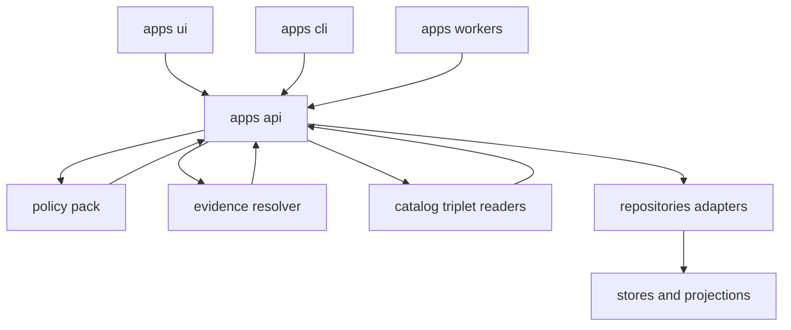
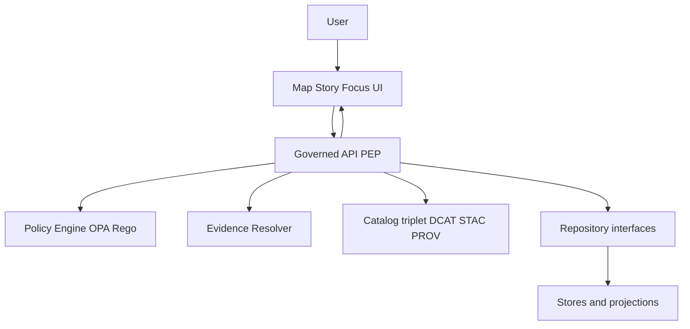

<!-- [KFM_META_BLOCK_V2]
doc_id: kfm://doc/0d15f4c3-7b4b-4e6d-9f57-2b7c0a3be5d3
title: apps/ — Runnable services
type: standard
version: v1
status: draft
owners: TODO
created: 2026-03-03
updated: 2026-03-03
policy_label: public
related:
  - kfm://doc/TODO
tags: [kfm]
notes:
  - [Proposed] Directory contract for KFM runnable apps (API/UI/CLI/workers).
[/KFM_META_BLOCK_V2] -->

# apps/
Runnable services for Kansas Frontier Matrix (KFM): **governed API**, **web UI**, and supporting **workers/CLIs**.

> **Status:** draft • **Owners:** `TODO` • **Policy label:** `public`  
> **Scope:** deployable/runnable apps only — shared logic belongs in `packages/`.


**Quick links:** [Scope](#scope) · [Where it fits](#where-it-fits-in-the-repo) · [Directory tree](#directory-tree) · [Quickstart](#quickstart) · [App contract](#app-contract) · [Architecture invariants](#architecture-invariants) · [Verification gates](#verification-gates) · [Appendix](#appendix)

---

## Scope

- **[Confirmed]** `apps/` contains **runnable services** (servers, UIs, CLIs, workers) — deployable binaries/servers, not shared libraries.
- **[Confirmed]** KFM’s core enforcement model is the **trust membrane**: clients (including the UI) do **not** access storage directly; all access crosses the governed API boundary and is policy-evaluated.
- **[Confirmed]** KFM’s lifecycle model is the **truth path** (Upstream → RAW → WORK/Quarantine → PROCESSED → CATALOG → PUBLISHED). Apps should only serve **PUBLISHED** surfaces.

### Evidence tags used in this README

- **[Confirmed]** A statement is supported by KFM design documents and is treated as a requirement.
- **[Proposed]** A statement is a recommended repo convention or implementation detail.
- **[Unknown]** A statement is intentionally not asserted as fact. It includes a minimal **Verify** step.

[Back to top](#apps)

---

## Where it fits in the repo

- **[Confirmed]** `apps/` composes shared modules and contracts; it should stay thin.
- **[Confirmed]** The KFM “layers” are intentionally separated so policy and provenance can be enforced consistently:
  - `contracts/` — OpenAPI + JSON Schemas + controlled vocab
  - `policy/` — OPA/Rego policies + fixtures + tests
  - `packages/` — shared modules (catalog, evidence resolver, policy adapters, domain logic)
  - `data/` — registry entries + zone artifacts + catalogs (triplet)
  - `apps/` — runnable surfaces (API/UI/CLI/workers)
  - `infra/` — deploy and ops

### Reference wiring


```mermaid
flowchart TD
  UI[apps ui] --> API[apps api]
  CLI[apps cli] --> API
  W[apps workers] --> API

  API --> P[policy pack]
  API --> E[evidence resolver]
  API --> C[catalog triplet readers]

  API --> R[repositories adapters]
  R --> S[stores and projections]

  P --> API
  E --> API
  C --> API
```

> IMPORTANT: This diagram is a **contract**, not proof of implementation.

[Back to top](#apps)

---

## Acceptable inputs

- **[Confirmed]** App wiring and runtime concerns:
  - HTTP handlers, UI route shells, job runners, configuration loading
  - authentication/authorization entrypoints (AuthN/AuthZ) at the API boundary
  - observability wiring (logs/metrics/traces), health checks, and runbooks
- **[Proposed]** Per-app deploy artifacts (Dockerfile/Helm values) when repo conventions allow.

## Exclusions

- **[Confirmed]** Shared business logic → `packages/`
- **[Confirmed]** API contracts + schemas → `contracts/`
- **[Confirmed]** Policy packs + fixtures + policy tests → `policy/`
- **[Confirmed]** Data artifacts + catalogs + registries → `data/` (and zoned storage)

[Back to top](#apps)

---

## Directory tree

- **[Unknown]** The exact set of sub-apps under `apps/` depends on branch/release.
  - **Verify:** `tree -L 2 apps` (or `ls -la apps`).

Reference layout (target shape):

```text
apps/
├─ api/        # [Unknown] Verify existence; [Confirmed] role is the governed API/PEP
├─ ui/         # [Unknown] Verify existence; [Confirmed] role is Map/Story/Focus UI
├─ cli/        # [Unknown] Verify existence; [Confirmed] role is operator/developer tooling
├─ workers/    # [Unknown] Verify existence; [Proposed] background jobs and async processors
└─ README.md   # This file
```

[Back to top](#apps)

---

## Quickstart

Because repo tooling can vary by release, treat the commands below as **discovery-first**.

### 1) Discover how each app is run

```bash
find apps -maxdepth 2 -name README.md -print
```

### 2) Identify the app entrypoints

- **[Unknown]** Node/TS apps entrypoints
  - **Verify:** `find apps -maxdepth 3 -name package.json -print`
- **[Unknown]** Python apps entrypoints
  - **Verify:** `find apps -maxdepth 3 -name pyproject.toml -o -name requirements.txt -print`

### 3) Typical local run (pseudocode)

> NOTE: Replace these with the commands documented in each app’s README.

```bash
# PSEUDOCODE (verify in each app README)
# API
cd apps/api && make dev   # or: uvicorn ... / pnpm dev / docker compose up api

# UI
cd apps/ui && pnpm dev    # or: npm run dev

# Workers
cd apps/workers && make run

# CLI
cd apps/cli && ./kfm --help
```

[Back to top](#apps)

---

## App contract

This section is the **directory contract**: what every runnable app in `apps/` must do (or must not do).

### App types matrix

| App type | Primary responsibility | MUST do | MUST NOT do |
|---|---|---|---|
| **API** (`apps/api`) | Policy Enforcement Point (PEP) + governed endpoints | Policy-evaluate all access; resolve evidence; return policy-safe errors | Bypass policy; return un-resolvable citations; leak restricted existence |
| **UI** (`apps/ui`) | Map/Story/Focus surfaces | Call governed API only; make trust visible (version, license, policy badge); show evidence drawer | Embed secrets; access DB/object store directly; fetch restricted artifacts from the browser |
| **Workers** (`apps/workers`) | Index builds, async QA, rebuild projections | Write receipts; respect kill-switch; run deterministic jobs | Mutate canonical truth without receipts; publish directly to UI surfaces |
| **CLI** (`apps/cli`) | Operator/developer workflows | Enforce AuthZ + audit trail for mutations; produce machine-readable receipts | Provide “god mode” bypass of policy or provenance |

### Required runtime surfaces (minimum)

- **[Confirmed]** **Health**: `/healthz` and `/readyz` (or equivalents) for services.
- **[Confirmed]** **Observability**: structured logs; metrics; traces where applicable.
- **[Confirmed]** **Receipts**: governed operations (Focus queries, publishing, promotions) emit run receipts / audit refs.

[Back to top](#apps)

---

## Architecture invariants

### 1) Trust membrane is non-negotiable

> WARNING: Any direct client/UI → DB/object-store access is a policy bypass.

- **[Confirmed]** **Clients and UI never access storage directly.**
- **[Confirmed]** **Backend logic uses repository interfaces/adapters.**
- **[Confirmed]** **All reads/writes cross the governed API boundary** where policy, redaction, and audit are enforced.

### 2) Fail closed

- **[Confirmed]** If policy, evidence resolution, or catalog lookups fail → **deny**, **abstain**, or **narrow scope**.
- **[Confirmed]** Focus Mode and Story publish flows require **resolvable citations**; otherwise they abstain or fail.

### 3) Truth path alignment

- **[Confirmed]** Apps should only serve **PUBLISHED** surfaces.
- **[Confirmed]** Canonical truth is the object store + catalogs + provenance; DB/search/graph/tiles are **rebuildable projections**.

### Reference flow (runtime)


```mermaid
flowchart TD
  U[User] --> UI[Map Story Focus UI]
  UI --> API[Governed API PEP]
  API --> POL[Policy Engine OPA Rego]
  API --> EV[Evidence Resolver]
  API --> CAT[Catalog triplet DCAT STAC PROV]
  API --> REP[Repository interfaces]
  REP --> STO[Stores and projections]
  API --> UI
```

[Back to top](#apps)

---

## Boundaries and responsibilities

### `apps/api/` — Governed API (PEP)

- **[Confirmed]** The API layer is the **enforcement boundary**: policy decisions, redactions, evidence resolution, consistent error semantics.
- **[Confirmed]** The blueprint endpoint set includes (illustrative; not proof of implementation):
  - `GET /api/v1/datasets`
  - `GET /api/v1/stac/collections`
  - `GET /api/v1/stac/items`
  - `POST /api/v1/evidence/resolve`
  - `GET/PUT /api/v1/story/{id}`
  - `POST /api/v1/focus/ask`
  - `GET /api/v1/lineage/status`
  - `GET /api/v1/lineage/stream`
  - `GET /api/v1/tiles/{layer}/{z}/{x}/{y}.pbf` (optional)
- **[Proposed]** Contract-first implementation:
  - OpenAPI + schemas live in `contracts/`
  - CI validates request/response shapes
  - Runtime validates schema + policy + evidence (fail closed)

### `apps/ui/` — Map / Story / Focus UI

- **[Confirmed]** UI trust surfaces are first-class:
  - dataset version + license + policy label per layer/story/answer
  - evidence drawer (shared surface)
  - abstention UX that explains “why” in policy-safe terms
- **[Proposed]** UI never fetches attestations directly from arbitrary origins; use an API proxy that verifies signatures and strips secrets.

### `apps/workers/` — Jobs and rebuilds

- **[Confirmed]** Workers rebuild **projections** (indexes/tiles/search) from canonical truth.
- **[Proposed]** Treat rebuild jobs as governed runs: emit receipts and write outputs deterministically.

### `apps/cli/` — Operator tooling

- **[Confirmed]** Any CLI that mutates state is governance-sensitive:
  - AuthZ checks
  - policy evaluation
  - append-only audit trail (receipt)

[Back to top](#apps)

---

## Adding a new app

- **[Confirmed]** Prefer *small, additive apps* that compose `packages/*` rather than duplicating logic.
- **[Proposed]** Every new app should include:
  - [ ] `README.md` (purpose, run, config, health)
  - [ ] Clear dependency boundaries (trust membrane enforced)
  - [ ] AuthN/AuthZ tests and policy tests (fail closed)
  - [ ] Structured logs + basic metrics
  - [ ] SBOM + vulnerability scan hook
  - [ ] Rollback plan (if user-facing or ops-significant)

[Back to top](#apps)

---

## Verification gates

Use these checks to turn repo assumptions into verified facts and to prevent policy bypass.

### Minimal verification steps

1) **[Unknown]** Confirm which apps exist.  
**Verify:**
```bash
ls -la apps
```

2) **[Unknown]** Confirm each app’s entrypoint + run docs.  
**Verify:**
```bash
find apps -maxdepth 2 -name README.md -print
```

3) **[Confirmed]** Confirm UI does not call storage directly.  
**Verify:**
```bash
rg -n "(s3://|gs://|blob\\.core\\.windows\\.net|postgresql://|postgis)" apps/ui || true
```

4) **[Confirmed]** Confirm UI calls governed endpoints only.  
**Verify:**
```bash
rg -n "(/api/v1|evidence/resolve|focus/ask|tiles/|stac/)" apps/ui || true
```

### Merge-blocking checklist (apps baseline)

- [ ] Formatting/lint/typecheck pass
- [ ] Unit tests pass
- [ ] API contract tests pass (OpenAPI + schema)
- [ ] Policy tests pass (default-deny; fail-closed)
- [ ] No direct storage calls from UI (static analysis gate)
- [ ] Determinism/repro checks (build outputs stable where applicable)
- [ ] SBOM produced and stored for release artifacts
- [ ] AuthN/AuthZ tests cover governed endpoints
- [ ] Runbook updated for ops-significant changes (with rollback path)

[Back to top](#apps)

---

## Appendix

### Minimal per-app README template

```markdown
# <app-name>

- **[Confirmed/Proposed/Unknown]** Purpose:
- **[Confirmed/Proposed/Unknown]** Owners:
- **[Confirmed/Proposed/Unknown]** Policy label:

## Run (local)
## Config
## Health & Observability
## Security & Governance Notes
```

### “Thin app” rule

- **[Confirmed]** App code is wiring + I/O. Reusable logic lives in `packages/*`.

[Back to top](#apps)
