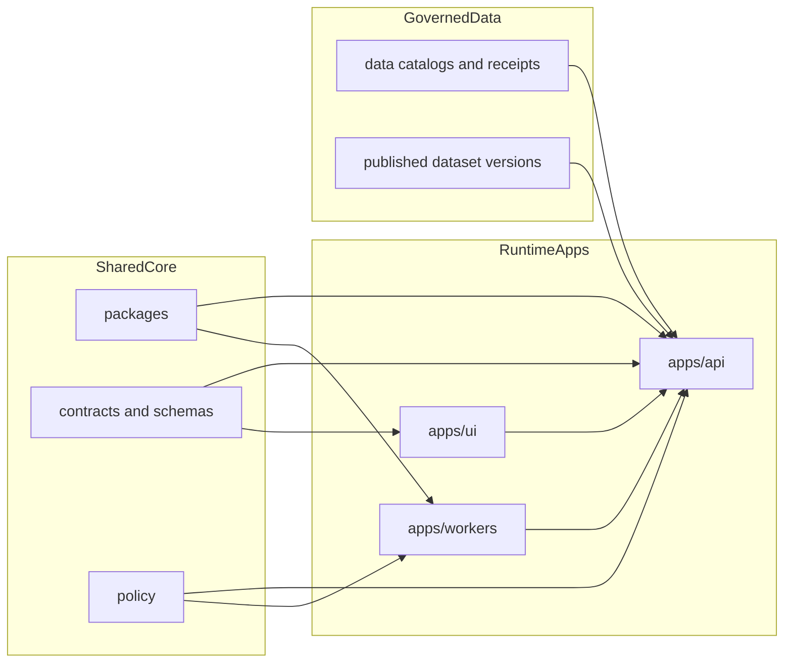

<!-- [KFM_META_BLOCK_V2]
doc_id: kfm://doc/3b4452c1-f6e0-4d21-86dc-3d2d5ea4c3c2
title: apps/ — Runtime apps and user-facing services
type: standard
version: v1
status: draft
owners: TBD
created: 2026-03-06
updated: 2026-03-06
policy_label: public
related: [../README.md, ./api/README.md, ./ui/README.md, ./workers/README.md, ../packages/, ../contracts/, ../policy/, ../data/, ../docs/]
tags: [kfm, apps, runtime, api, ui, workers]
notes: [Top-level runtime-app contract. Repo facts are marked CONFIRMED only where directly verified; unverified runtime details remain UNKNOWN.]
[/KFM_META_BLOCK_V2] -->

<a id="top"></a>

# apps/ — Runtime apps and user-facing services
Governed runtime surfaces for KFM: API, UI, and worker applications that expose or support user-visible behavior without bypassing evidence, policy, or promotion gates.

**Status:** `draft`  
**Owners:** `TBD (verify CODEOWNERS)`  


**Quick links:** [Purpose and scope](#purpose-and-scope) · [Repo fit](#repo-fit) · [Truth status legend](#truth-status-legend) · [Accepted inputs](#accepted-inputs) · [Exclusions](#exclusions) · [Directory tree](#directory-tree) · [Quickstart](#quickstart) · [Current app surfaces](#current-app-surfaces) · [Architecture](#architecture) · [Runtime invariants](#runtime-invariants) · [Definition of done](#definition-of-done) · [FAQ](#faq) · [Appendix](#appendix-open-verification-steps)

---

## Purpose and scope

`apps/` is the directory for **deployable runtime applications** in Kansas Frontier Matrix.

This README exists to define:

- what belongs in `apps/`
- what does **not** belong in `apps/`
- which runtime surfaces are currently **CONFIRMED**
- which implementation details remain **UNKNOWN**
- what every app under this directory must preserve as part of the KFM trust model

### CONFIRMED

- `apps/` is a top-level repo area.
- The repo root describes `apps/` as **runnable services and user-facing applications**.
- Child app documentation currently exists for:
  - [`./api/README.md`](./api/README.md)
  - [`./ui/README.md`](./ui/README.md)
  - [`./workers/README.md`](./workers/README.md)

### PROPOSED

- This top-level README should be the **directory contract** for all runtime apps, so child READMEs can go deeper without repeating the same repo-level rules.

### UNKNOWN

- Exact runtime stack per app on the current branch
- Exact local commands and ports for every app
- Full owner map from `CODEOWNERS`
- Exact CI jobs that block merges for each app surface

[Back to top](#top)

---

## Repo fit

**Path:** `/apps/`  
**Repo role:** runtime app boundary for KFM.

**Upstream dependencies:**

- [`../packages/`](../packages/) — shared libraries, domain logic, reusable adapters
- [`../contracts/`](../contracts/) — API and interface contracts
- [`../schemas/`](../schemas/) — validation schemas
- [`../policy/`](../policy/) — policy rules, fixtures, tests
- [`../data/`](../data/) — governed datasets, manifests, receipts, catalog artifacts
- [`../docs/`](../docs/) — architecture, runbooks, ADRs, standards

**Downstream runtime surfaces:**

- [`./api/README.md`](./api/README.md) — governed API boundary
- [`./ui/README.md`](./ui/README.md) — governed frontend client
- [`./workers/README.md`](./workers/README.md) — background jobs and batch runtime

### Boundary rule

`apps/` is where runtime composition happens. Shared business logic, reusable validators, schema definitions, and policy packs should not be re-implemented here if they belong in shared layers.

[Back to top](#top)

---

## Truth status legend

This README uses explicit truth labels.

| Label | Meaning in this file |
|---|---|
| **CONFIRMED** | Directly verified from the current public repo branch or existing app docs |
| **PROPOSED** | Recommended structure or rule that fits KFM’s documented architecture |
| **UNKNOWN** | Not yet verified on the current branch; do not treat as repo fact |

### Operating rule

Visible uncertainty is better than false certainty.  
If a runtime detail is not verified, leave it `UNKNOWN` and add the smallest verification step.

[Back to top](#top)

---

## Accepted inputs

The following belong in `apps/`:

- deployable runtime application code
- app entrypoints and routing
- app-local configuration templates and manifests
- app-local test suites
- app-local assets required for runtime behavior
- app-local README files and operational notes
- thin composition code that wires shared packages, contracts, and policy-aware behavior into a runnable surface

### Typical examples

- governed API applications
- frontend clients
- background workers
- scheduler/runner surfaces
- app metadata files such as `kfm.app.json`
- app-local `src/`, `tests/`, and app UI assets when they are part of that app’s runtime boundary

[Back to top](#top)

---

## Exclusions

The following do **not** belong in `apps/`:

| Exclusion | Why it stays out | Where it goes instead |
|---|---|---|
| Raw datasets, processed artifacts, receipts, catalog records | Runtime apps consume governed data; they are not the canonical data store | `../data/` |
| Shared domain logic and reusable service logic | Avoid copy-paste logic across apps | `../packages/` |
| Policy packs and policy fixtures | Policy must stay centralized and testable | `../policy/` |
| Interface contracts and schemas | Contracts should be machine-governed, not app-local drift | `../contracts/`, `../schemas/` |
| One-off helper scripts without tests or audit discipline | Not a durable runtime surface | `../scripts/` |
| Secrets, tokens, credentials | Must never live in repo app code | secret manager / environment configuration |
| Direct client-to-store access patterns | Breaks the trust membrane | route through governed APIs and approved adapters |
| Documentation that implies unverified live behavior | Breaks trust via overclaiming | mark `UNKNOWN`, verify, then update docs |

[Back to top](#top)

---

## Directory tree

Only directly verified paths are marked `CONFIRMED`.  
Anything not directly verified here should be treated as `UNKNOWN`.

```text
apps/
├── README.md                    # CONFIRMED
├── api/                         # CONFIRMED
│   ├── README.md                # CONFIRMED
│   ├── kfm.app.json             # CONFIRMED
│   ├── src/                     # CONFIRMED
│   ├── tests/                   # CONFIRMED
│   └── ui/                      # CONFIRMED
├── ui/                          # CONFIRMED
│   └── README.md                # CONFIRMED
└── workers/                     # CONFIRMED
    ├── README.md                # CONFIRMED
    ├── src/                     # CONFIRMED
    └── tests/                   # CONFIRMED
```

### Notes on tree confidence

- `apps/api/` and `apps/workers/` have directly visible tree entries.
- `apps/ui/README.md` is directly reachable and therefore confirms that `apps/ui/` exists.
- Deeper `apps/ui/` contents remain `UNKNOWN` in this file until a branch-local tree capture is attached.

[Back to top](#top)

---

## Quickstart

This directory uses a **verification-first** quickstart.  
Do not invent run commands that the branch has not proven.

```bash
# inspect runtime app surfaces
find apps -maxdepth 3 -mindepth 1 | sort

# read the current child app contracts
sed -n '1,200p' apps/api/README.md
sed -n '1,200p' apps/ui/README.md
sed -n '1,200p' apps/workers/README.md

# inspect manifests and likely app descriptors
find apps -maxdepth 4 \( \
  -name 'package.json' -o \
  -name 'pyproject.toml' -o \
  -name 'go.mod' -o \
  -name 'Cargo.toml' -o \
  -name 'kfm.app.json' \
\) | sort

# inspect tests
find apps -maxdepth 4 \( \
  -path '*/tests/*' -o \
  -name '*.spec.*' -o \
  -name '*.test.*' \
\) | sort

# inspect for direct-store anti-patterns
grep -RIn "postgres://\|s3://\|minio\|neo4j\|postgis\|object store" apps || true
```

### Local-development rule

Until verified on the active branch, this README treats:

- exact boot commands
- port numbers
- package-manager choice
- queue runtime choice
- container entrypoints

as `UNKNOWN`.

[Back to top](#top)

---

## Usage

### When a new runtime app belongs here

A new directory under `apps/` belongs here when it is a **deployable** or **runtime-serving** surface, such as:

1. a user-facing client
2. a governed API service
3. a worker or scheduler runtime
4. a review/admin runtime app
5. another bounded application surface that must be deployed and operated independently

### When it does **not** belong here

A new directory should **not** go under `apps/` when it is primarily:

- shared logic
- contract/schema definition
- dataset registry material
- policy-as-code
- docs-only content
- throwaway scripting
- a direct-storage shortcut that bypasses the governed runtime boundary

### How to add or change an app

1. Create or update the app directory and its `README.md`.
2. State the app’s purpose, repo fit, accepted inputs, and exclusions.
3. Keep shared logic in shared packages unless app-local composition is required.
4. Add app-local tests.
5. Verify policy, evidence, and publication-boundary behavior.
6. Update related docs and runbooks in the same change.

[Back to top](#top)

---

## Architecture


```mermaid
flowchart LR
  subgraph RuntimeApps
    UI[apps/ui]
    API[apps/api]
    W[apps/workers]
  end

  subgraph SharedCore
    PKG[packages]
    CTR[contracts and schemas]
    POL[policy]
  end

  subgraph GovernedData
    CAT[data catalogs and receipts]
    PUB[published dataset versions]
  end

  UI --> API
  W --> API

  PKG --> API
  PKG --> W

  CTR --> API
  CTR --> UI

  POL --> API
  POL --> W

  CAT --> API
  PUB --> API
```

### Interpretation

- `apps/ui` is a governed client surface.
- `apps/api` is the primary runtime trust boundary.
- `apps/workers` handle long-running or scheduled work, but must not create policy-bypass publication paths.
- Shared contracts, policy, and domain logic should feed the apps; the apps should not fork those rules into separate truths.

### Hard boundary

UI and external clients must not talk directly to canonical stores.  
Any user-visible runtime behavior must cross a governed boundary.

[Back to top](#top)

---

## Current app surfaces

| Path | Status | Purpose | Notes |
|---|---|---|---|
| [`./api/`](./api/) | **CONFIRMED** | Governed API boundary | Child README presents this as the policy-enforced, evidence-first API surface |
| [`./ui/`](./ui/) | **CONFIRMED** | Governed frontend client | Child README presents this as the governed frontend for map, story, focus, catalog, and admin/steward workflows |
| [`./workers/`](./workers/) | **CONFIRMED** | Background job runners | Child README presents this as long-running, scheduled, and batch runtime work |

### Current cross-app truth

| Topic | Status | Interpretation |
|---|---|---|
| `apps/` is a runtime area | **CONFIRMED** | Top-level runtime apps live here |
| Top-level `apps/README.md` is currently thin | **CONFIRMED** | This file replaces the minimal stub with a full directory contract |
| Exact run commands for child apps | **UNKNOWN** | Must be verified from branch manifests and boot docs |
| Exact runtime stack per app | **UNKNOWN** | Do not infer from design preference alone |
| Owners by team / handle | **UNKNOWN** | Verify from `CODEOWNERS` or app governance docs |

[Back to top](#top)

---

## Runtime invariants

The following rules apply to every app under `apps/`.

| Invariant | What it means inside `apps/` |
|---|---|
| **Trust membrane** | UI and external callers do not bypass the governed API or approved policy-aware service boundary |
| **Cite-or-abstain** | Claim-bearing surfaces must resolve evidence or abstain/narrow scope |
| **Promotion discipline** | Runtime should expose only governed, promoted dataset versions |
| **Policy-safe failure** | Denials and errors must not leak restricted existence or sensitive details |
| **Docs as production surface** | Behavior changes must update docs, tests, and operational notes together |
| **Separation of duty** | No app or automation path should both generate and self-approve a policy-significant public release |

### Anti-patterns

- direct browser-to-database access
- ad hoc “admin bypass” routes
- uncited AI success responses
- story publication without citation validation
- worker publication that skips receipts, policy, or catalog checks
- runtime behavior that changes while docs stay stale

[Back to top](#top)

---

## App registry matrix

| App class | Belongs here | Minimum contract |
|---|---|---|
| Governed API | Yes | policy enforcement, evidence resolution, audit-safe responses |
| Frontend client | Yes | governed data access only, evidence launch points, policy-safe UX |
| Worker / scheduler | Yes | receipts, retry safety, fail-closed publication behavior |
| Shared library | No | move to `../packages/` |
| Policy pack | No | move to `../policy/` |
| Contract/schema-only package | No | move to `../contracts/` or `../schemas/` |
| One-off script | Usually no | move to `../scripts/` unless promoted into a real app/runtime |

[Back to top](#top)

---

## Definition of done

For any non-trivial change under `apps/`, the change is not done until all relevant checks below are addressed.

- [ ] App purpose and boundary are documented
- [ ] App README states repo fit, accepted inputs, and exclusions
- [ ] Shared logic is not duplicated unnecessarily in app code
- [ ] No direct-store bypass exists for user-visible or publishable behavior
- [ ] Evidence and policy behavior are verified for representative flows
- [ ] App-local tests are updated
- [ ] Related docs/runbooks are updated when behavior changes
- [ ] Owners and rollback path are recorded for public or restricted release surfaces
- [ ] CI expectations are verified rather than assumed
- [ ] Any remaining uncertainty is explicitly labeled `UNKNOWN`

[Back to top](#top)

---

## FAQ

### Can a UI app connect directly to PostGIS, object storage, or raw catalogs?

No. That would violate the trust membrane.

### Can workers bypass the API?

Not for anything user-visible or publishable. Workers may use approved internal service interfaces, but they must not become a shadow publication path.

### Where should shared validation or domain logic live?

In shared repo areas such as `../packages/`, `../contracts/`, `../schemas/`, or `../policy/`, depending on the concern.

### Are the commands in this README authoritative runtime commands?

No. They are verification-first inspection commands. Exact boot commands remain `UNKNOWN` until the branch proves them.

### What should happen when an app change affects runtime behavior?

Update the app docs, tests, and any relevant runbooks in the same change.

[Back to top](#top)

---

## Appendix: Open verification steps

<details>
<summary>Open verification steps for turning UNKNOWN → CONFIRMED</summary>

### 1. Owners

Verify owners from `CODEOWNERS`, branch-local governance docs, or app-specific stewardship docs.

### 2. Child app boot commands

Capture real commands from:

- `package.json`
- `pyproject.toml`
- `go.mod`
- `Cargo.toml`
- container manifests
- dev scripts

### 3. `apps/ui/` tree depth

Attach a branch-local tree capture so this README can mark deeper `apps/ui/` paths as `CONFIRMED`.

### 4. CI gates

Verify which workflows and checks block merges for app changes.

### 5. Runtime manifests

Confirm whether each child app has:

- deployment manifests
- app descriptors
- health checks
- release ownership metadata
- rollback documentation

### 6. Cross-app operating model

Confirm whether all child apps already share:

- a common app metadata schema
- consistent health/readiness conventions
- common observability conventions
- common evidence/audit response envelopes

</details>

[Back to top](#top)
