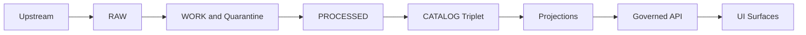
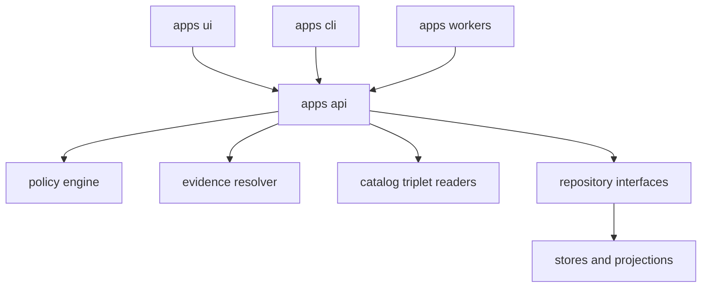
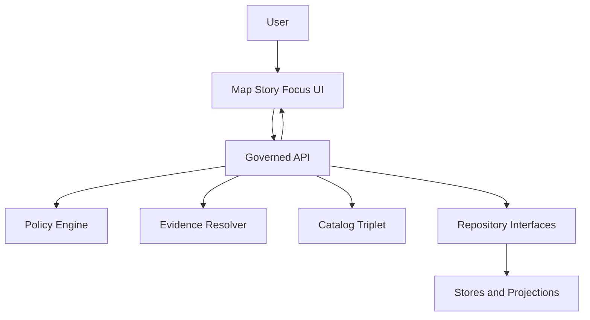

<!-- [KFM_META_BLOCK_V2]
doc_id: kfm://doc/0d15f4c3-7b4b-4e6d-9f57-2b7c0a3be5d3
title: apps/ — Runnable services
type: standard
version: v1
status: draft
owners: TODO
created: 2026-03-03
updated: 2026-03-04
policy_label: public
related:
  - kfm://doc/TODO
tags: [kfm]
notes:
  - [CONFIRMED] Directory contract for KFM runnable apps (API/UI/CLI/workers) aligned to the truth path and trust membrane.
  - [PROPOSED] CI gates to enforce “no storage bypass” and “cite-or-abstain” at the app boundary.
[/KFM_META_BLOCK_V2] -->

# apps/
Runnable services for Kansas Frontier Matrix (KFM): **governed API**, **Map/Story/Focus UI**, and supporting **workers/CLIs**.

> **Status:** experimental (docs draft) • **Owners:** `TODO` • **Policy label:** `public`  
> **Scope:** deployable/runnable apps only — shared logic belongs in `packages/`  
> **Boundary:** clients (including the UI) do **not** access storage/DB directly; all access crosses the governed API boundary.


**Quick links:** [Scope](#scope) · [Conventions](#conventions) · [Where it fits](#where-it-fits-in-the-repo) · [Directory tree](#directory-tree) · [Quickstart](#quickstart) · [App contract](#app-contract) · [Architecture invariants](#architecture-invariants) · [Verification gates](#verification-gates) · [FAQ](#faq) · [Appendix](#appendix)

---

## Scope

- **[CONFIRMED]** `apps/` contains **runnable services** (servers, UIs, CLIs, workers) — deployable binaries/servers, not shared libraries.
- **[CONFIRMED]** KFM’s enforcement boundary is the **trust membrane**: clients never access storage/DB directly; policy is evaluated at the governed API boundary.
- **[CONFIRMED]** KFM’s lifecycle is a **truth path** with zones and gates:  
  `Upstream → RAW → WORK/QUARANTINE → PROCESSED → CATALOG/TRIPLET → projections → governed API → UI`  
  Apps must not bypass promotion gates; runtime surfaces serve **promoted** dataset versions only.

### Truth path and trust membrane reference


```mermaid
flowchart LR
  Up[Upstream] --> Raw[RAW]
  Raw --> Work[WORK and Quarantine]
  Work --> Proc[PROCESSED]
  Proc --> Trip[CATALOG Triplet]
  Trip --> Proj[Projections]
  Proj --> API[Governed API]
  API --> UI[UI Surfaces]
```

> IMPORTANT: This README defines **contracts** and **gates**. It is not proof that every app exists or is implemented.

[Back to top](#apps)

---

## Conventions

### Evidence tags used in this README

- **[CONFIRMED]** Supported by KFM design/governance documents and treated as a requirement.
- **[PROPOSED]** Recommended repo convention or implementation detail.
- **[UNKNOWN]** Intentionally not asserted. Includes the smallest verification step(s).

### Normative language

- **MUST / MUST NOT** = merge-blocking requirement.
- **SHOULD** = recommended default; deviation requires rationale in PR.

[Back to top](#apps)

---

## Where it fits in the repo

- **[CONFIRMED]** `apps/` composes shared modules and contracts; it should stay thin.
- **[CONFIRMED]** Core rule: domain logic must not talk directly to infrastructure; it talks through interfaces (repositories/adapters).

### Related top-level directories

- `contracts/` — OpenAPI + JSON Schemas + controlled vocabularies
- `policy/` — OPA/Rego policies + fixtures + policy tests
- `packages/` — shared modules (catalog, evidence resolver, policy adapters, domain logic)
- `data/` — zone artifacts + registry entries + catalogs (DCAT/STAC/PROV + receipts)
- `infra/` — deploy and ops (Kubernetes/Terraform/GitOps, dashboards)
- `docs/` — architecture docs, runbooks, ADRs, templates
- `tools/` — validators, link checkers, developer utilities

### Reference wiring


```mermaid
flowchart TD
  UI[apps ui] --> API[apps api]
  CLI[apps cli] --> API
  W[apps workers] --> API

  API --> POL[policy engine]
  API --> EV[evidence resolver]
  API --> CAT[catalog triplet readers]

  API --> REP[repository interfaces]
  REP --> STO[stores and projections]
```

[Back to top](#apps)

---

## Acceptable inputs

- **[CONFIRMED]** App wiring and runtime concerns:
  - HTTP handlers, UI route shells, job runners, configuration loading
  - authentication/authorization entrypoints at the API boundary
  - observability wiring (logs/metrics/traces), health checks, and runbooks
- **[PROPOSED]** Per-app deploy artifacts (Dockerfile/Helm values) when repo conventions allow.
- **[PROPOSED]** App-specific integration tests (contract + policy + “no bypass” checks).

## Exclusions

- **[CONFIRMED]** Shared business logic → `packages/`
- **[CONFIRMED]** API contracts + schemas → `contracts/`
- **[CONFIRMED]** Policy packs + fixtures + policy tests → `policy/`
- **[CONFIRMED]** Data artifacts + catalogs + receipts → `data/` (and zoned storage)

[Back to top](#apps)

---

## Directory tree

- **[UNKNOWN]** The exact set of sub-apps under `apps/` depends on the repo branch/release.
  - **Verify:** `tree -L 2 apps` (or `ls -la apps`).

Target shape (documented intent; verify existence):

```text
apps/
├─ api/        # governed API boundary (Policy Enforcement Point)
├─ ui/         # Map/Story/Focus UI
├─ cli/        # operator/developer tooling
├─ workers/    # background jobs and async processors
└─ README.md   # this file
```

[Back to top](#apps)

---

## Quickstart

Because repo tooling can vary by release, treat these commands as **discovery-first**.

### 1) Discover how each app is run

```bash
find apps -maxdepth 2 -name README.md -print
```

### 2) Identify app entrypoints

```bash
# Node/TS apps
find apps -maxdepth 3 -name package.json -print

# Python apps
find apps -maxdepth 3 \( -name pyproject.toml -o -name requirements.txt \) -print
```

### 3) Typical local run

> NOTE: Replace these with the commands documented in each app’s README.

```bash
# PSEUDOCODE — verify in each app README

# API
cd apps/api && make dev   # or: uvicorn ... / pnpm dev / docker compose up api

# UI
cd apps/ui && pnpm dev    # or: npm run dev

# Workers
cd apps/workers && make run

# CLI
cd apps/cli && ./kfm --help
```

[Back to top](#apps)

---

## App contract

This is the directory contract: what every runnable app in `apps/` MUST do (or MUST NOT do).

### App types matrix

| App type | Primary responsibility | MUST do | MUST NOT do |
|---|---|---|---|
| **API** (`apps/api`) | Policy enforcement + governed endpoints | Policy-evaluate all access; resolve evidence; serve promoted dataset versions only; emit receipts for governed operations | Bypass policy; return unresolvable citations; leak restricted existence |
| **UI** (`apps/ui`) | Map/Story/Focus surfaces | Call governed API only; expose trust surfaces (version, license, policy label); show evidence drawer | Embed secrets; access DB/object store directly; fetch restricted artifacts from the browser |
| **Workers** (`apps/workers`) | Build/rebuild projections; async QA; automation | Produce deterministic outputs; write receipts; respect kill-switches; treat DB/search/tiles as rebuildable | Mutate canonical truth without receipts; publish directly to UI surfaces |
| **CLI** (`apps/cli`) | Operator/developer workflows | Enforce AuthZ for mutations; produce machine-readable receipts; support least-privilege tokens | Provide “god mode” bypass of policy or provenance |

### Required runtime surfaces

- **[CONFIRMED]** **Health** endpoints for services: `/healthz` and `/readyz` (or equivalent).
- **[CONFIRMED]** **Observability**: structured logs; metrics; traces where applicable.
- **[CONFIRMED]** **Receipts**: governed operations (publishing, promotions, Focus queries) emit run receipts / audit refs.

[Back to top](#apps)

---

## Architecture invariants

### Trust membrane is non-negotiable

> WARNING: Any direct client/UI → DB/object-store access is a policy bypass.

- **[CONFIRMED]** Clients and UI never access storage/DB directly.
- **[CONFIRMED]** Backend logic uses repository interfaces/adapters.
- **[CONFIRMED]** All reads/writes cross the governed API boundary where policy, redaction obligations, and audit are enforced.

### Fail closed

- **[CONFIRMED]** If policy, evidence resolution, or catalog lookups fail → deny, abstain, or narrow scope.
- **[CONFIRMED]** Story publish and Focus Mode require resolvable citations; otherwise they abstain or fail.

### Canonical truth vs projections

- **[CONFIRMED]** Canonical truth = object storage + catalogs + provenance/receipts.
- **[CONFIRMED]** PostGIS/search/graph/tiles are rebuildable projections and must not be treated as the source of truth.

### Runtime reference flow


```mermaid
flowchart TD
  U[User] --> UI[Map Story Focus UI]
  UI --> API[Governed API]
  API --> POL[Policy Engine]
  API --> EV[Evidence Resolver]
  API --> CAT[Catalog Triplet]
  API --> REP[Repository Interfaces]
  REP --> STO[Stores and Projections]
  API --> UI
```

[Back to top](#apps)

---

## Boundaries and responsibilities

### apps api

- **[CONFIRMED]** The API layer is the enforcement boundary: policy decisions, redactions, evidence resolution, consistent error semantics.
- **[PROPOSED]** Contract-first implementation:
  - OpenAPI + schemas live in `contracts/`
  - CI validates request/response shapes
  - Runtime validates schema + policy + evidence (fail closed)
- **[PROPOSED]** Illustrative endpoint set (not proof of implementation):
  - `GET /api/v1/datasets`
  - `GET /api/v1/stac/collections`
  - `GET /api/v1/stac/items`
  - `POST /api/v1/evidence/resolve`
  - `GET/PUT /api/v1/story/{id}`
  - `POST /api/v1/focus/ask`
  - `GET /api/v1/lineage/status`
  - `GET /api/v1/lineage/stream`
  - `GET /api/v1/tiles/{layer}/{z}/{x}/{y}.pbf` (optional)

### apps ui

- **[CONFIRMED]** UI trust surfaces are first-class:
  - dataset version + license + policy label per layer/story/answer
  - evidence drawer (shared surface)
  - abstention UX that explains “why” in policy-safe terms
- **[PROPOSED]** UI must not fetch remote attestations directly from arbitrary origins; proxy through the API that verifies signatures and strips secrets.

### apps workers

- **[CONFIRMED]** Workers rebuild projections (indexes/tiles/search) from canonical truth.
- **[PROPOSED]** Treat rebuild jobs as governed runs: emit receipts and write outputs deterministically.

### apps cli

- **[CONFIRMED]** Any CLI that mutates state is governance-sensitive:
  - AuthZ checks
  - policy evaluation
  - append-only audit trail (receipt)

[Back to top](#apps)

---

## Adding a new app

- **[CONFIRMED]** Prefer small, additive apps that compose `packages/*` rather than duplicating logic.
- **[PROPOSED]** Every new app should include:
  - [ ] `README.md` (purpose, run, config, health)
  - [ ] Clear dependency boundaries (trust membrane enforced)
  - [ ] AuthN/AuthZ tests and policy tests (fail closed)
  - [ ] Structured logs + basic metrics
  - [ ] SBOM + vulnerability scan hook
  - [ ] Rollback plan (if user-facing or ops-significant)

[Back to top](#apps)

---

## Verification gates

Use these checks to turn repo assumptions into verified facts and to prevent policy bypass.

### Minimal verification steps

1) **[UNKNOWN]** Confirm which apps exist.  
**Verify:**
```bash
ls -la apps
```

2) **[UNKNOWN]** Confirm each app’s entrypoint + run docs.  
**Verify:**
```bash
find apps -maxdepth 2 -name README.md -print
```

3) **[CONFIRMED]** Confirm UI does not call storage directly.  
**Verify:**
```bash
rg -n "(s3://|gs://|blob\\.core\\.windows\\.net|postgres(ql)?://|postgis)" apps/ui || true
```

4) **[CONFIRMED]** Confirm UI calls governed endpoints only.  
**Verify:**
```bash
rg -n "(/api/v1|evidence/resolve|focus/ask|tiles/|stac/|lineage/)" apps/ui || true
```

5) **[PROPOSED]** Confirm API does not reach storage directly outside repository layer.  
**Verify:**
```bash
rg -n "(boto3|aws-sdk|google-cloud-storage|azure-storage|psycopg|asyncpg|neo4j)" apps/api \
  | rg -v "packages/.*/repositories|packages/.*/adapters" || true
```

### Merge-blocking checklist

- [ ] Formatting/lint/typecheck pass
- [ ] Unit tests pass
- [ ] API contract tests pass (OpenAPI + schema)
- [ ] Policy tests pass (default-deny; fail-closed)
- [ ] No direct storage calls from UI (static analysis gate)
- [ ] Determinism/repro checks (build outputs stable where applicable)
- [ ] SBOM produced for release artifacts
- [ ] AuthN/AuthZ tests cover governed endpoints
- [ ] Runbook updated for ops-significant changes (with rollback path)

[Back to top](#apps)

---

## FAQ

### Why can’t the UI call PostGIS or object storage directly?
Because it bypasses policy, redaction, logging, and evidence resolution. The governed API is the enforcement boundary.

### Can apps read from RAW or WORK zones?
**[PROPOSED]** As a default: no. Apps should serve only promoted (PUBLISHED) surfaces and treat RAW/WORK as pipeline zones. If an operator workflow needs RAW/WORK, it should be a governed CLI/worker path with explicit receipts and policy.

### Where should shared code go?
In `packages/`. Apps should stay thin: I/O + composition.

[Back to top](#apps)

---

## Appendix

<details>
<summary><strong>Minimal per-app README template</strong></summary>

```markdown
# <app-name>

- **[CONFIRMED/PROPOSED/UNKNOWN]** Purpose:
- **[CONFIRMED/PROPOSED/UNKNOWN]** Owners:
- **[CONFIRMED/PROPOSED/UNKNOWN]** Policy label:

## Run (local)
## Config
## Health and Observability
## Security and Governance Notes
```

</details>

<details>
<summary><strong>Evidence basis for CONFIRMED invariants</strong></summary>

The following internal KFM design artifacts define the invariants referenced as **[CONFIRMED]** here:

- Truth path lifecycle with zones and gates
- Trust membrane (no direct client access; API is enforcement boundary)
- Catalog triplet (DCAT + STAC + PROV) as evidence surface
- Canonical truth vs rebuildable projections
- Cite-or-abstain behavior for Focus Mode and publishing flows

</details>

<details>
<summary><strong>Thin app rule</strong></summary>

- **[CONFIRMED]** App code is wiring + I/O. Reusable logic lives in `packages/*`.

</details>

[Back to top](#apps)
