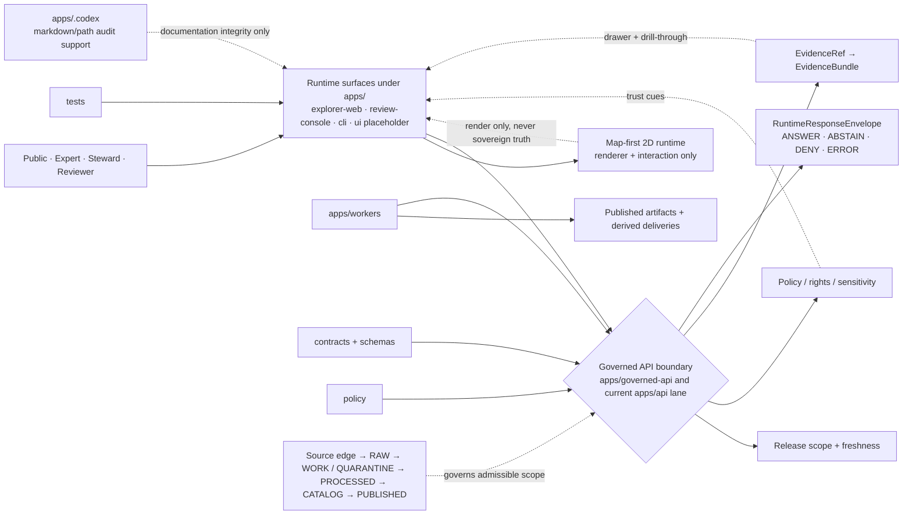

<!-- [KFM_META_BLOCK_V2]
doc_id: kfm://doc/<NEEDS-UUID>
title: Apps Runtime Surfaces
type: standard
version: v1
status: draft
owners: @bartytime4life
created: <NEEDS VERIFICATION>
updated: 2026-04-18
policy_label: <NEEDS VERIFICATION>
related: [../README.md, ../docs/README.md, ../infra/README.md, ../packages/README.md, ../contracts/README.md, ../schemas/README.md, ../policy/README.md, ../tests/README.md, ../.github/workflows/README.md, ./api/README.md, ./api/src/README.md, ./api/src/api/README.md, ./api/tests/README.md, ./cli/README.md, ./explorer-web/README.md, ./governed-api/README.md, ./review-console/README.md, ./ui/README.md, ./workers/README.md]
tags: [kfm, apps, runtime, shell, governance]
notes: [Revised against the March-April 2026 KFM doctrine corpus plus current public-main repo path evidence; current public-main confirms apps/.codex/, apps/ui/README.md, and apps/api/src/README.md in addition to the previously surfaced apps paths. Final local-branch topology, manifests, policy_label, doc UUID, created date, and the authoritative resolution of apps/api versus apps/governed-api versus the thin apps/ui lane still require direct branch verification.]
[/KFM_META_BLOCK_V2] -->

# Apps Runtime Surfaces

Boundary README for the runtime-facing KFM app layer where governed doctrine becomes visible product behavior.

**Status:** experimental  
**Owners:** [`@bartytime4life`](../.github/CODEOWNERS)  
**Badges:**        
**Quick jump:** [Scope](#scope) · [Repo fit](#repo-fit) · [Accepted inputs](#accepted-inputs) · [Exclusions](#exclusions) · [Directory tree](#directory-tree) · [Quickstart](#quickstart) · [Usage](#usage) · [Runtime diagram](#runtime-diagram) · [Reference tables](#reference-tables) · [Task list](#task-list) · [FAQ](#faq) · [Appendix](#appendix)

| Field | Value |
|---|---|
| Path | `apps/README.md` |
| Primary role | Boundary README for runtime-facing KFM application surfaces and their shared shell law |
| Current public-main app family | `api/`, `cli/`, `explorer-web/`, `governed-api/`, `review-console/`, `ui/`, `workers/`, plus this `README.md` |
| Visible non-runtime support path | `.codex/` is present under `apps/` and is listed here as a support/audit path, not as an app surface |
| Truth posture | **CONFIRMED** public-main path inventory · **INFERRED** surface-role mapping · **UNKNOWN** local-branch runtime depth |
| Strongest doctrine anchors | Map-first shell, timeline coequality, Evidence Drawer, Focus as bounded synthesis, review as shell variation, trust membrane, finite runtime outcomes, and 2D-first reasoning |
| Upstream fit | Shared doctrine, contracts, schemas, policy, tests, packages, infra, docs, and workflow scaffolding live outside this boundary |
| Downstream fit | Child app READMEs under `apps/` document surface-specific obligations and should inherit the same trust law without silently inventing implementation depth |

> [!IMPORTANT]
> This README is evidence-bounded. It reflects the March-April 2026 KFM doctrine corpus plus current public-main repository path evidence. It does **not** claim non-public branch contents, emitted proof packs, deployable runtime maturity, package-manager truth, or workflow enforcement details that were not directly visible.

---

## Scope

`apps/` is where KFM’s governing law becomes visible product behavior.

This boundary is not just “frontend code.” In KFM, runtime surfaces sit on the visible edge of the trust membrane. They are where place, time, evidence, policy, freshness, review state, and correction lineage become legible at the point of use.

### Stable laws carried into this boundary

- **CONFIRMED:** KFM is map-first and time-aware.
- **CONFIRMED:** place and time are coequal operating controls.
- **CONFIRMED:** the Evidence Drawer is mandatory for consequential claims.
- **CONFIRMED:** Focus is evidence-bounded and must not drift into a detached assistant pane.
- **CONFIRMED:** review is a shell variation, not a second truth regime.
- **CONFIRMED:** public and ordinary steward clients cross governed APIs instead of touching canonical stores or model runtimes directly.
- **CONFIRMED:** 2D is the default authoritative shell; 3D is conditional and burden-bearing.
- **CONFIRMED:** outward runtime behavior must support accountable negative states.

### Current public surface families

| Surface family | Current public path signal | What belongs here | Current label |
|---|---|---|---|
| Explorer-facing shell | [`./explorer-web/README.md`](./explorer-web/README.md) | public/expert map shell, timeline, dossier, story, compare, export, Focus, Evidence Drawer launch points | **CONFIRMED path / INFERRED role / UNKNOWN code depth** |
| Reviewer / steward shell | [`./review-console/README.md`](./review-console/README.md) | review queues, denial/approval, rollback visibility, correction workflows, role-gated stewardship | **CONFIRMED path / INFERRED role / UNKNOWN code depth** |
| Governed API lane | [`./governed-api/README.md`](./governed-api/README.md) and [`./api/README.md`](./api/README.md) | outward route families, evidence resolution, policy-aware payloads, bounded runtime access | **CONFIRMED paths / NEEDS VERIFICATION for final naming authority** |
| API source subtree | [`./api/src/README.md`](./api/src/README.md) | app-local source subtree boundary below `apps/api/`, currently thin in public-main evidence | **CONFIRMED path / CONFIRMED thin snapshot / UNKNOWN implementation depth** |
| Contract-first API internals | [`./api/src/api/README.md`](./api/src/api/README.md) | deeper API boundary and enforcement detail | **CONFIRMED path / UNKNOWN implementation depth** |
| App-local test surface | [`./api/tests/README.md`](./api/tests/README.md) | contract-facing API tests and related verification surfaces | **CONFIRMED path / CONFIRMED README-only placeholder / UNKNOWN full suite coverage** |
| CLI / operator lane | [`./cli/README.md`](./cli/README.md) | local/operator tooling, diagnostics, proof-pack helpers, narrow app-adjacent commands | **CONFIRMED path / INFERRED role** |
| UI placeholder lane | [`./ui/README.md`](./ui/README.md) | thin placeholder child README currently present under `apps/`; durable responsibility remains unresolved | **CONFIRMED path / CONFIRMED README-only placeholder / NEEDS VERIFICATION for lasting boundary intent** |
| Worker lane | [`./workers/README.md`](./workers/README.md) | projections, export jobs, correction propagation, and app-adjacent runtime jobs | **CONFIRMED path / INFERRED role / UNKNOWN runtime depth** |

### Visible support path

| Path | Why it is listed | Current label |
|---|---|---|
| `apps/.codex/` | public-main support/audit artifacts appear under `apps/`; this README records the path without treating it as a runtime surface | **CONFIRMED path / NOT an app family / NEEDS VERIFICATION for branch-local role** |

### What this README is not

This file is a **boundary document**, not proof that every child path is fully implemented, manifest-backed, or production-complete.

It does **not** prove:

- full deployable runtime depth under every child app directory
- the complete route tree, DTO inventory, or OpenAPI surface
- the exact local workspace toolchain in the target branch
- currently enforced workflow gates beyond what public docs expose
- emitted proof objects, release packs, or runtime telemetry that were not directly visible

[Back to top](#apps-runtime-surfaces)

---

## Repo fit

This file sits at `apps/README.md` and documents the runtime boundary where KFM’s shell law becomes product behavior.

### Boundary-first rule

1. app surfaces stay downstream of promoted release scope
2. consequential claims remain one hop from inspectable evidence
3. policy, review, freshness, and correction state stay visible in outward experience
4. runtime assistance remains subordinate to evidence, policy, and release state
5. exact local branch topology stays explicit when not directly verified

### Upstream and downstream links

| Direction | Path | Role |
|---|---|---|
| Upstream | [../README.md](../README.md) | repo root posture and system identity |
| Upstream | [../docs/README.md](../docs/README.md) | architecture, governance, domain, and runbook prose |
| Upstream | [../infra/README.md](../infra/README.md) | infra lane and deployment-facing documentation |
| Upstream | [../packages/README.md](../packages/README.md) | shared internal module boundary between top-level surfaces |
| Upstream | [../contracts/README.md](../contracts/README.md) | shared contract surface |
| Upstream | [../schemas/README.md](../schemas/README.md) | machine-checkable schema surface |
| Upstream | [../policy/README.md](../policy/README.md) | policy bundles, fixtures, runtime policy wiring |
| Upstream | [../tests/README.md](../tests/README.md) | governed verification surface |
| Upstream | [../.github/workflows/README.md](../.github/workflows/README.md) | current public workflow gatehouse |
| Downstream | [./explorer-web/README.md](./explorer-web/README.md) | explorer-facing shell boundary |
| Downstream | [./review-console/README.md](./review-console/README.md) | review/steward shell boundary |
| Downstream | [./cli/README.md](./cli/README.md) | operator-facing CLI boundary |
| Downstream | [./workers/README.md](./workers/README.md) | worker lane boundary |
| Downstream | [./governed-api/README.md](./governed-api/README.md) | governed API boundary doc |
| Downstream | [./api/README.md](./api/README.md) | public-main API lane root |
| Downstream | [./api/src/README.md](./api/src/README.md) | app-local source subtree boundary |
| Downstream | [./api/src/api/README.md](./api/src/api/README.md) | deeper API enforcement boundary |
| Downstream | [./api/tests/README.md](./api/tests/README.md) | app-local API test surface |
| Downstream | [./ui/README.md](./ui/README.md) | placeholder child README currently present under `apps/` |
| Support | `./.codex/` | public-main markdown/path audit support artifacts; not a runtime surface |

> [!WARNING]
> Current public main exposes **both** `apps/governed-api/README.md` and the `apps/api/` path family. It also exposes `apps/ui/README.md` as a checked-in placeholder child path. This README keeps those facts visible instead of guessing which path becomes singular or authoritative on the target branch.

### Why `apps/` matters in KFM

| `apps/` should do | Why it matters |
|---|---|
| House runtime-facing public, expert, reviewer, and operator surfaces | keeps visible product surfaces distinct from canonical storage and policy internals |
| Preserve one shell identity across modes | prevents app-to-app truth drift |
| Remain map-native and time-aware | keeps geography and chronology primary |
| Consume governed APIs and shared contracts | prevents the browser from becoming a truth authority |
| Keep shell continuity state distinct from trust-bearing state | preserves navigation continuity without moving authority into the client |
| Surface trust cues at point of use | makes release basis, evidence route, policy posture, and correction state legible |

[Back to top](#apps-runtime-surfaces)

---

## Accepted inputs

Accepted inputs in `apps/` are the ones that make KFM’s governed surfaces buildable **without moving authority into the wrong layer**.

| Accepted input | What belongs here | Current label |
|---|---|---|
| Shell composition | map shell, timeline choreography, dossier/story layout, compare, export, Focus, review, trust chips, and Evidence Drawer launch points | **CONFIRMED doctrine** |
| Shell continuity state | selected geography, active time scope, active layers, compare anchors, open panels, deep-link rehydration, saved-view hydration | **CONFIRMED doctrine / exact store UNKNOWN** |
| Trust-visible rendering | freshness cues, policy chips, review chips, AI badges, correction markers, calm failure states, generalization markers | **CONFIRMED doctrine** |
| App-facing contract consumers | shell-state contract, Evidence Drawer payload, dossier payload, Focus envelope, layer metadata contract, surface-state registry bindings | **CONFIRMED need / exact file inventory NEEDS VERIFICATION** |
| Governed route consumers | public read, review, export, evidence resolution, comparison, and bounded synthesis route families as consumed through governed APIs | **CONFIRMED doctrine / exact mounted names UNKNOWN** |
| Review overlays | reviewer queues, diff views, denial/approval actions, rollback visibility, correction workflows, role-gated controls | **CONFIRMED doctrine / mounted realization UNKNOWN** |
| App-local source subtree docs | thin source-lane README surfaces such as `apps/api/src/README.md` that exist to keep deeper ownership explicit without inflating scaffolds into implementation proof | **CONFIRMED path / CONFIRMED thin snapshot** |
| Placeholder child docs | placeholder README surfaces such as `apps/ui/README.md` that keep markdown-linked structure coherent while long-term boundary ownership is still unsettled | **CONFIRMED path / CONFIRMED placeholder snapshot / NEEDS VERIFICATION for durable role** |
| App-local docs, fixtures, and tests | E2E shell flows, keyboard continuity, reduced-motion behavior, Evidence Drawer drill-through, export-preview trust cues, Focus negative outcomes, and surface-state tests | **CONFIRMED need / current inventory partial** |
| CLI and worker inputs | operator commands, job specs, diagnostics, and app-adjacent batch/runtime obligations for child paths that actually exist | **CONFIRMED paths / deeper runtime depth UNKNOWN** |
| Support/audit artifacts | path audits and markdown-path reports that help maintain doc integrity without becoming runtime behavior | **CONFIRMED `.codex/` path / role NEEDS VERIFICATION** |

### Every serious surface should expect these inputs

| Input class | Why the surface needs it |
|---|---|
| Place and geometry scope | prevents detached dashboard or chat drift |
| Time basis | keeps claims tied to declared chronology |
| Release and freshness basis | makes current, stale, superseded, or historical scope visible |
| EvidenceRef / EvidenceBundle handles | keeps consequential claims inspectable |
| Policy and rights posture | keeps generalization, withholding, review-required, and restricted states visible |
| Runtime outcome state | keeps **ANSWER**, **ABSTAIN**, **DENY**, and **ERROR** explicit and testable |

[Back to top](#apps-runtime-surfaces)

---

## Exclusions

`apps/` must not become a shadow source of truth.

| Does **not** belong here | Put it under | Why |
|---|---|---|
| RAW / WORK / QUARANTINE / canonical truth ownership | governed data and lifecycle lanes | surfaces consume approved outputs; they do not own the truth path |
| Contract or schema source of truth | shared [`../contracts/`](../contracts/README.md) and [`../schemas/`](../schemas/README.md) roots | interfaces should stay centralized and reviewable |
| Policy bundles and decision sovereignty | [`../policy/`](../policy/README.md) | apps render policy consequences; they do not become the sovereign policy engine |
| Direct browser access to canonical stores or object storage | nowhere in normal public flow | explicit trust-membrane violation |
| Direct model-runtime exposure | protected runtime boundary behind governed APIs | keeps Focus subordinate to evidence and policy |
| Detached assistant product | nowhere in the normal app surface model | breaks map, time, and evidence continuity |
| Hidden second admin product | review shell variation and governed review routes | preserves visible accountability |
| Default spectacle-first 3D shell | controlled burden-bearing slice only after 2D trust model is proven | spectacle does not outrank inspectability |
| Business law hidden in scripts or deployment glue | shared packages, contracts, policy, or workers | keeps authority seams reviewable |
| Markdown path audits treated as runtime proof | docs/tooling or `.codex/` support surfaces | documentation evidence helps review, but it is not runtime maturity |

> [!WARNING]
> Stable anti-patterns remain stable even when implementation details move: direct browser-to-store access, detached AI panes, hidden time semantics, decorative evidence, policy-only-in-frontend behavior, and silent export stripping.

[Back to top](#apps-runtime-surfaces)

---

## Directory tree

The tree below reflects the **current public-main snapshot** that was directly inspectable during this revision. It is a path inventory, not a maturity guarantee.

```text
apps/
├── README.md
├── .codex/
│   ├── markdown-path-audit.json
│   ├── markdown-path-audit.md
│   └── markdown-path-report.md
├── api/
│   ├── README.md
│   ├── src/
│   │   ├── README.md
│   │   └── api/
│   │       └── README.md
│   └── tests/
│       └── README.md
├── cli/
│   └── README.md
├── explorer-web/
│   └── README.md
├── governed-api/
│   └── README.md
├── review-console/
│   └── README.md
├── ui/
│   └── README.md
└── workers/
    └── README.md
```

> [!NOTE]
> `apps/api/` and `apps/governed-api/` are both public-main realities right now. `apps/ui/README.md` is also a public-main reality, but presently as a placeholder child doc rather than a proved runtime subtree. `apps/.codex/` is visible as a support/audit path, not as a runtime-facing app. This README preserves those facts until direct branch inspection makes the runtime boundary singular and unambiguous.

### Expected local README coverage

| Path | Expected role | Current label |
|---|---|---|
| `apps/README.md` | boundary README for runtime-facing surfaces | **this file** |
| `apps/explorer-web/README.md` | explorer shell boundary and user-facing shell choreography | **CONFIRMED path / INFERRED role** |
| `apps/review-console/README.md` | review/steward shell variation | **CONFIRMED path / INFERRED role** |
| `apps/cli/README.md` | local/operator tooling boundary | **CONFIRMED path / INFERRED role** |
| `apps/workers/README.md` | app-adjacent worker/job boundary | **CONFIRMED path / INFERRED role** |
| `apps/governed-api/README.md` | governed API boundary doc | **CONFIRMED path** |
| `apps/api/README.md` | app-local API lane root | **CONFIRMED path** |
| `apps/api/src/README.md` | app-local source subtree README | **CONFIRMED path / CONFIRMED thin snapshot** |
| `apps/api/src/api/README.md` | deeper API enforcement boundary | **CONFIRMED path** |
| `apps/api/tests/README.md` | app-local API test surface | **CONFIRMED path / CONFIRMED README-only placeholder in public-main evidence** |
| `apps/ui/README.md` | placeholder child README currently present under `apps/` | **CONFIRMED path / CONFIRMED placeholder role / NEEDS VERIFICATION for durable ownership** |
| `apps/.codex/` | markdown/path audit support surface | **CONFIRMED path / NOT runtime family / NEEDS VERIFICATION for merge policy** |

[Back to top](#apps-runtime-surfaces)

---

## Quickstart

These commands are **verification-first** and intentionally read-only. Run them from the repo root on the target branch.

```bash
# 1) Confirm the current branch revision and inspect the apps subtree
git rev-parse HEAD
find apps -maxdepth 4 -type f | sort
```

```bash
# 2) Inspect shared boundary surfaces this README depends on
find . -maxdepth 2 \
  \( -path './contracts/README.md' -o -path './schemas/README.md' -o -path './policy/README.md' -o -path './tests/README.md' -o -path './docs/README.md' -o -path './infra/README.md' -o -path './packages/README.md' \) \
  -print | sort
```

```bash
# 3) Inspect app-facing API, shell, placeholder, worker, and support surfaces that still need reconciliation
find apps -maxdepth 4 \
  \( -path 'apps/.codex/*' -o -path 'apps/api/*' -o -path 'apps/governed-api/*' -o -path 'apps/explorer-web/*' -o -path 'apps/review-console/*' -o -path 'apps/cli/*' -o -path 'apps/ui/*' -o -path 'apps/workers/*' \) \
  -print | sort
```

```bash
# 4) Search for trust-critical vocabulary that should anchor runtime behavior
grep -RInE 'EvidenceBundle|EvidenceRef|Evidence Drawer|RuntimeResponseEnvelope|Focus|ABSTAIN|DENY|ERROR|review|compare|export|surface_state' \
  apps contracts schemas policy tests docs 2>/dev/null | head -n 200
```

```bash
# 5) Locate manifests, tests, and accessibility/reduced-motion signals before adding boot docs
find apps tests -maxdepth 6 \
  \( -name 'package.json' -o -name 'pyproject.toml' -o -name 'Dockerfile' -o -name '*spec*' -o -name '*e2e*' -o -name '*a11y*' -o -name '*fixture*' -o -name '*motion*' \) \
  2>/dev/null | sort
```

> [!NOTE]
> This README intentionally avoids install, dev-server, lint, and deploy commands. Public evidence confirmed path structure and README scaffolding, not enough manifest-backed runtime detail to publish operational boot steps without overclaiming.

[Back to top](#apps-runtime-surfaces)

---

## Usage

Treat `apps/` as the place where KFM’s governing law becomes visible product behavior.

### Operating law

1. app surfaces read through governed APIs only
2. consequential claims stay one hop from inspectable evidence
3. review and stewardship remain shell variations, not detached admin products
4. shell continuity state stays distinct from trust-bearing backend state
5. negative states are first-class and remain visible
6. the shell stays 2D-first unless a specific 3D burden is explicitly justified

### Current public app family snapshot

| Path | Boundary role | What must stay true | Current label |
|---|---|---|---|
| `apps/explorer-web/` | explorer-facing shell | map-first navigation, timeline continuity, Evidence Drawer reachability, Focus boundedness | **CONFIRMED path / UNKNOWN local runtime depth** |
| `apps/review-console/` | reviewer and steward shell variation | review remains inside the same geography, time, evidence, and correction model | **CONFIRMED path / UNKNOWN local runtime depth** |
| `apps/cli/` | operator-facing commands | no hidden business law, no bypass of governed policy or evidence contracts | **CONFIRMED path / UNKNOWN command inventory** |
| `apps/workers/` | app-adjacent batch/runtime jobs | projections, exports, and correction propagation remain downstream of release/policy | **CONFIRMED path / UNKNOWN runtime depth** |
| `apps/governed-api/` | outward governed API boundary | trust membrane, bounded synthesis, evidence resolution, policy visibility | **CONFIRMED path** |
| `apps/api/` | current public API lane root | contract-first API behavior remains reviewable and testable | **CONFIRMED path** |
| `apps/api/src/` | app-local source subtree | app-root and deeper API-lane detail stay explicitly separated even when the subtree is thin | **CONFIRMED path / UNKNOWN local runtime depth** |
| `apps/api/src/api/` | deeper API enforcement surface | route families and runtime envelopes stay governed | **CONFIRMED path** |
| `apps/api/tests/` | app-local API test surface | boundary behavior should stay contract-testable; current public evidence remains README-only | **CONFIRMED path / README-only public snapshot / UNKNOWN runner depth** |
| `apps/ui/` | currently thin placeholder child doc lane | placeholder role stays explicit unless the target branch gives it durable ownership and deeper subtree proof | **CONFIRMED path / NEEDS VERIFICATION for lasting runtime role** |
| `apps/.codex/` | support/audit surface | markdown/path reports may help document integrity but must not become runtime proof | **CONFIRMED path / NOT app runtime** |

### State ownership

| State class | Primary owner | Why |
|---|---|---|
| Shell continuity state | persistent shell store | preserves geography, time scope, active layers, selected subjects, compare anchors, and panel continuity |
| Ephemeral local interaction state | local component where harmless | hover previews, input drafts, transient menus, reversible affordances |
| Trust-bearing state | governed APIs and backend registries | evidence state, policy state, review state, freshness, release truth, and correction lineage must not become browser truth |
| Persisted user products | governed services | saved views, export manifests, review tasks, and compare snapshots should rehydrate through current policy and release mediation |
| Forbidden client truth | nowhere in the browser | canonical data, unpublished artifacts, policy decisions, promotion state, precise restricted geometry, and model-runtime internals |

### Shell regions worth preserving

| Region | Primary responsibility |
|---|---|
| Top command bar | search, mode switching, scope badges, saved views, role context, alerts |
| Left rail | layers, domains, filters, compare controls, story chapter lists, review entry points for authorized roles |
| Map canvas | primary geography surface, selection anchor, story playback, evidence launch point |
| Bottom timeline rail | valid-time framing, playback, compare anchors, as-of inspection, visible chronology |
| Right inspection stack | summary cards, dossier panels, story context, Focus, Evidence Drawer, and steward controls |
| Utility tray | legend, accessibility controls, reduced-motion toggles, export helpers, diagnostics, and other low-priority utilities |

[Back to top](#apps-runtime-surfaces)

---

## Runtime diagram


```mermaid
flowchart LR
    User[Public · Expert · Steward · Reviewer] --> Shell[Runtime surfaces under apps/<br/>explorer-web · review-console · cli · ui placeholder]

    Shell --> MapRuntime[Map-first 2D runtime<br/>renderer + interaction only]
    Shell --> APIBoundary{Governed API boundary<br/>apps/governed-api and current apps/api lane}

    APIBoundary --> Release[Release scope + freshness]
    APIBoundary --> Policy[Policy / rights / sensitivity]
    APIBoundary --> Evidence[EvidenceRef → EvidenceBundle]
    APIBoundary --> Runtime[RuntimeResponseEnvelope<br/>ANSWER · ABSTAIN · DENY · ERROR]

    Workers[apps/workers] --> Published[Published artifacts + derived deliveries]
    Workers --> APIBoundary

    Contracts[contracts + schemas] --> APIBoundary
    PolicySurface[policy] --> APIBoundary
    Tests[tests] --> Shell

    Support[apps/.codex<br/>markdown/path audit support] -. documentation integrity only .-> Shell
    Canonical[Source edge → RAW → WORK / QUARANTINE → PROCESSED → CATALOG → PUBLISHED] -. governs admissible scope .-> APIBoundary
    MapRuntime -. render only, never sovereign truth .-> Shell
    Evidence -. drawer + drill-through .-> Shell
    Policy -. trust cues .-> Shell
```

Above: app surfaces sit at the visible trust edge, but remain downstream of release scope, policy mediation, evidence resolution, and protected runtime boundaries. The diagram shows the **boundary role**, not a final claim that API-lane naming, the long-term `apps/ui/` role, or any `.codex/` support surface has already been reconciled.

[Back to top](#apps-runtime-surfaces)

---

## Reference tables

### Trust-visible cues apps must surface

| Cue | Meaning | Typical placement |
|---|---|---|
| Scope chip | active place, time, layer, or role boundary | top bar, Focus, compare, export preview |
| Freshness cue | release age, recency basis, or stale warning | summary cards, dossier, story, Focus, export |
| Policy chip | public-safe, restricted, generalized, redacted, or review-required posture | claim headers, layer panels, export preview |
| Review chip | draft, quarantined, reviewed, promoted, current, stale, withdrawn, or superseded state | dossier, story, review, export |
| Knowledge marker | observed, documentary, derived, modeled, generalized, or source-dependent character | summaries, compare, dossiers, Focus |
| AI badge | model-assisted synthesis present | Focus and any generated narrative surface |
| Correction marker | replacement, narrowing, correction, supersession, or withdrawal | dossier, story, exported artifacts |

### Contract starter set this boundary still expects

| Artifact | Why it matters first | Current label |
|---|---|---|
| Shell-state contract | stabilizes geography / time / mode / compare / selection continuity across surfaces | **CONFIRMED need / exact file inventory NEEDS VERIFICATION** |
| Evidence Drawer payload | keeps provenance, rights, review, freshness, and audit fields out of ad hoc view logic | **CONFIRMED need / exact file inventory NEEDS VERIFICATION** |
| Dossier payload | stabilizes the durable place- or feature-centered decision object | **CONFIRMED need / exact file inventory NEEDS VERIFICATION** |
| Focus envelope / RuntimeResponseEnvelope | normalizes finite outcomes and evidence linkage for governed synthesis | **CONFIRMED need / exact file inventory NEEDS VERIFICATION** |
| Layer metadata contract | keeps business meaning, policy, freshness, review, and time semantics outside style JSON | **CONFIRMED need / exact file inventory NEEDS VERIFICATION** |
| Surface-state registry | keeps user-visible trust states stable across shell, exports, and runtime | **CONFIRMED need / exact file inventory NEEDS VERIFICATION** |
| Route-family registry | prevents undocumented side routes and makes auth/policy review tractable | **CONFIRMED need / exact file inventory NEEDS VERIFICATION** |

### Runtime outcomes and user-visible trust states

| State / outcome | Meaning | App consequence |
|---|---|---|
| ANSWER | evidence-backed response emitted | show citations, scope echo, audit ref, and trust cues |
| ABSTAIN | support is insufficient for a governed answer | keep shell context, show reason, and offer safe next actions |
| DENY | policy or rights block the request | keep shell context, show reason or obligation code |
| ERROR | technical failure blocked governed handling | calm failure, preserve navigation continuity, expose audit ref where possible |
| GENERALIZED | surface intentionally reduced precision or detail | show explicit generalization cue |
| RESTRICTED | narrower role context required | show role/policy cue, not silent omission |
| STALE | artifact or response exceeds desired freshness basis | show visible stale marker, not silent continuation |
| SUPERSEDED / WITHDRAWN | previously visible item changed lineage or was removed | preserve lineage and reason visibly |

> [!TIP]
> The first strong runtime proof should still be a hydrology-first thin slice that demonstrates shell continuity, timeline behavior, Evidence Drawer reachability, dossier/story choreography, Focus finite outcomes, review variation, compare, and export trust cues before any default expansion into burden-bearing 3D surfaces.

[Back to top](#apps-runtime-surfaces)

---

## Task list

### Definition of done for this README

- [ ] verify the target branch `apps/` subtree against the current public-main snapshot
- [ ] confirm whether `apps/.codex/` is expected to remain under `apps/` and whether it should be linked from runtime docs at all
- [ ] resolve the authoritative relationship between `apps/api/` and `apps/governed-api/`
- [ ] confirm whether `apps/ui/README.md` remains a placeholder-only child doc or becomes a durable runtime lane on the target branch
- [ ] populate the final KFM meta block UUID, created date, and policy label from authoritative branch evidence
- [ ] link real contract/schema files for shell state, Evidence Drawer, dossier, Focus, and layer metadata
- [ ] confirm actual manifests and workspace wiring under child app surfaces before adding boot commands
- [ ] attach acceptance-suite references once E2E, accessibility, and negative-path tests are directly inspectable
- [ ] collapse any stale sibling links if the target branch renames or removes one of the API-lane or placeholder-child docs

### Review gates for app-surface changes

- [ ] no client-to-store or client-to-model bypass introduced
- [ ] map, timeline, evidence, and correction continuity preserved across surface transitions
- [ ] every consequential claim still reaches Evidence Drawer drill-through
- [ ] Focus still returns accountable negative outcomes when evidence or policy fails
- [ ] review remains a shell variation, not a detached product
- [ ] generalized, restricted, stale, superseded, withdrawn, denied, abstained, and errored states remain visible
- [ ] export preview still preserves trust cues and correction linkage
- [ ] thin placeholder docs under `apps/` are not silently upgraded into implementation proof without branch-local evidence
- [ ] support/audit artifacts are not mistaken for runtime behavior, CI enforcement, or release proof
- [ ] docs, contracts, fixtures, and accessibility checks change together when trust behavior changes

[Back to top](#apps-runtime-surfaces)

---

## FAQ

### Why do both `apps/governed-api/` and `apps/api/` appear?

Because both path families are currently visible on public main. This README keeps that fact visible instead of silently choosing one and overclaiming certainty.

### Why does `apps/ui/` now appear?

Because current public main exposes `apps/ui/README.md` as a real child path under `apps/`. Public evidence currently supports a placeholder README there, not a mature subtree or settled ownership model.

### Why does `apps/api/src/README.md` now appear?

Because current public main exposes `apps/api/src/README.md` alongside `apps/api/src/api/README.md`. Omitting it would underreport the inspected public tree.

### Why does `apps/.codex/` appear?

Because current public main exposes `.codex/` under `apps/` with markdown/path audit artifacts. This README records it as a support path only. It is not treated as a runtime surface, trust membrane, release proof, or product lane.

### Is review a separate product?

No. Review and stewardship are shell variations with stronger role and policy consequences, but they remain inside the same geography, time, evidence, and correction model.

### Can Focus become a general-purpose chatbot pane?

No. Focus inherits scope, depends on governed evidence resolution, and emits finite accountable outcomes instead of unconstrained assistant behavior.

### Can app surfaces read canonical stores directly for performance?

No. Performance layers may accelerate delivery, but public and ordinary steward clients still cross the governed API boundary.

### Why is 3D not the default path here?

Because KFM treats disciplined 2D as the default public reasoning surface and places 3D behind a burden rubric. Visual depth is not automatically better evidence.

### Why are there still placeholders in the meta block?

Because document UUID, original created date, and final policy label were not directly verified from authoritative branch-local evidence during this revision.

[Back to top](#apps-runtime-surfaces)

---

## Appendix

<details>
<summary><strong>Glossary, merge-time checklist, and maintenance note</strong></summary>

### Compact glossary

- **Trust membrane** — the operational boundary requiring public and ordinary client surfaces to cross governed APIs rather than touching canonical or unpublished internals directly.
- **Evidence Drawer** — the mandatory trust surface that turns visible claims into inspectable support.
- **EvidenceBundle** — the resolved support object behind outward claims, previews, exports, and bounded runtime answers.
- **Focus** — governed, evidence-bounded synthesis over admissible released scope.
- **RuntimeResponseEnvelope** — the outward runtime object that normalizes finite outcomes and keeps citations, policy, and audit linkage attached.
- **Shell continuity state** — persistent geography, time, layer, mode, selection, and compare context owned by the shell.
- **Trust-bearing state** — evidence, review, release, policy, freshness, and correction semantics owned by governed services rather than browser convenience.
- **Review shell variation** — steward behavior preserved inside the same shell law rather than split into a detached epistemic system.
- **Thin slice** — one real lane that proves source admission, validation, release, evidence resolution, surface behavior, and correction without trust gaps.
- **Support/audit path** — a documentation or tooling-support path that may help maintainers inspect structure, but does not itself prove runtime behavior.

### Merge-time checklist

1. Verify the target branch tree against the public-main snapshot in this README.
2. Decide whether `.codex/` belongs in this boundary README, a tooling README, or neither.
3. Choose the single API-lane naming that the branch actually intends to keep, if consolidation has happened.
4. Decide whether `apps/ui/README.md` remains a placeholder child doc, is removed, or becomes a real lane.
5. Replace any stale sibling links once the branch topology is settled.
6. Populate the meta block from authoritative branch evidence.
7. Add real workspace commands only after manifest verification.
8. Keep any remaining uncertainty explicit instead of smoothing it into false certainty.

### Maintenance rule

Update this README when any of the following change materially:

- the app family under `apps/`
- the support/audit paths under `apps/`
- the authoritative API-lane path
- the role of `apps/ui/README.md`
- shell-state ownership
- Evidence Drawer or Focus contract expectations
- 2D versus controlled-3D posture
- export trust-cue behavior
- app-local verification surfaces

When one of those changes lands, update this file and the affected child READMEs together.

</details>

[Back to top](#apps-runtime-surfaces)