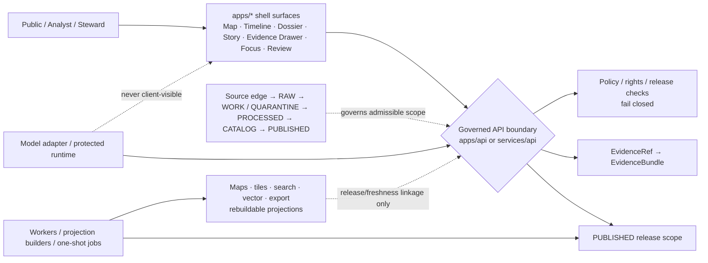

<!-- [KFM_META_BLOCK_V2]
doc_id: kfm://doc/<NEEDS-UUID>
title: Apps Runtime Surfaces
type: standard
version: v1
status: draft
owners: <NEEDS VERIFICATION>
created: <NEEDS VERIFICATION>
updated: <NEEDS VERIFICATION>
policy_label: <NEEDS VERIFICATION>
related: [../README.md, ../docs/, ../contracts/, ../policy/, ../infra/]
tags: [kfm, apps, runtime, governance]
notes: [Grounded in the attached March 2026 KFM corpus; current-session workspace inspection exposed PDFs only, so live repo topology, owners, exact commands, and local links still require review before commit.]
[/KFM_META_BLOCK_V2] -->

# Apps Runtime Surfaces

Governed application surfaces for KFM’s map-native shell, trust-visible UX, and any colocated runtime lanes under `apps/`.

**Status:** experimental **(NEEDS VERIFICATION)**  
**Owners:** `<NEEDS VERIFICATION>`  
**Badges:**       
**Quick jump:** [Scope](#scope) · [Repo fit](#repo-fit) · [Accepted inputs](#accepted-inputs) · [Exclusions](#exclusions) · [Directory tree](#directory-tree) · [Quickstart](#quickstart) · [Usage](#usage) · [Runtime diagram](#runtime-diagram) · [Reference tables](#reference-tables) · [Task list](#task-list) · [FAQ](#faq) · [Appendix](#appendix)  
**Repo fit:** `apps/README.md` for `apps/`  
**Upstream links (NEEDS VERIFICATION):** [../README.md](../README.md) · [../docs/](../docs/) · [../contracts/](../contracts/) · [../policy/](../policy/) · [../infra/](../infra/)  
**Candidate downstream lanes (NEEDS VERIFICATION):** [./web/](./web/) · [./review/](./review/) · [./api/](./api/) · [./workers/](./workers/)

> [!IMPORTANT]
> This README is grounded in the attached March 2026 KFM corpus, not in a mounted repo tree. The current session exposed PDF artifacts only. Treat every concrete subpath, owner, boot command, and link marked **INFERRED**, **PROPOSED**, **UNKNOWN**, or **NEEDS VERIFICATION** as a merge-time review item.

---

## Scope

`apps/` is the runtime-facing surface boundary for KFM.

Across the attached corpus, KFM’s application layer is not treated as decorative frontend code. It is the operational face of a governed spatial evidence system: map-first, time-aware, evidence-visible, fail-closed, and always downstream of governed APIs, policy mediation, review state, and release state.

### What this directory is for

| Surface family or lane | What belongs here | Status |
|---|---|---|
| Public shell | Map, timeline, dossier, story, Evidence Drawer, Focus, compare, export, and related shell choreography | **CONFIRMED doctrine** |
| Review / stewardship shell | Role-gated variations of the same shell, with stronger internal controls and visible review state | **CONFIRMED doctrine** |
| Colocated governed API | Only if the live repo keeps client-facing API surfaces under `apps/` rather than a sibling service root | **PROPOSED pathing / CONFIRMED boundary law** |
| App-adjacent workers or workflow apps | Only if the live repo colocates app-facing jobs here instead of a separate `workers/` or `services/` root | **PROPOSED pathing** |
| App-local docs, tests, fixtures | Surface smoke tests, accessibility checks, trust-visible state tests, local README files, and bring-up notes | **INFERRED** |

### Stable across the corpus

- **CONFIRMED:** the map is the operating center, and timeline is coequal with place
- **CONFIRMED:** the Evidence Drawer is a mandatory trust object
- **CONFIRMED:** Focus is evidence-bounded and must not become a detached chatbot
- **CONFIRMED:** review and stewardship remain shell variations, not a separate truth regime
- **CONFIRMED:** 2D is the default authoritative shell; 3D is conditional and burden-bearing
- **CONFIRMED:** public and normal client surfaces consume governed APIs rather than canonical stores or model runtimes directly

### What this README is not

`apps/README.md` is **not** permission to smuggle repo facts out of doctrine.

It does not prove:

- the current mounted repo tree
- the actual app package names
- the actual route tree or payload inventory
- the actual workflow, manifest, or runtime topology
- whether `apps/api`, `apps/web`, or `apps/review` exists in the live repository

[Back to top](#apps-runtime-surfaces)

---

## Repo fit

| Field | Value |
|---|---|
| Path | `apps/README.md` governing the `apps/` directory |
| Primary role | Boundary doc for deployable app surfaces and any colocated runtime lanes |
| Doctrinal baseline | Map-first shell, governed API trust membrane, Evidence Drawer, Focus bounded by evidence, review as shell variation, 2D-first reasoning |
| Stable downstream consumers | Public users, analysts, educators, reviewers/stewards, operators |
| Stable upstream dependencies | Contracts, policy, release scope, evidence resolution, shared tooling/packages, runtime boundary controls **(local paths NEED VERIFICATION)** |
| Non-negotiable boundary | No client-side bypass of governed APIs, canonical stores, or model runtimes |
| Current-session evidence | PDF corpus only; no mounted repo tree, schemas, workflows, manifests, or runtime logs were directly visible |

### Dependency rule

This README is **dependency-first**, not topology-first.

That means the stable thing is the **boundary law**:

1. app surfaces stay downstream of published scope
2. evidence remains drill-through capable
3. policy and review stay visible
4. runtime assistance stays subordinate to evidence and release state
5. folder names may vary more than those obligations do

### What KFM apps are

| KFM apps **are** | Why that matters |
|---|---|
| one governed system of shells, APIs, worker lanes, and support components | prevents “frontend vs platform” truth drift |
| map-native, time-aware surfaces | keeps geography and chronology primary |
| trust-visible products | surfaces policy, freshness, review, and correction state at point of use |
| release-scoped readers of governed truth | prevents public surfaces from outrunning publication discipline |

### What KFM apps are **not**

| KFM apps are **not** | Why it is blocked |
|---|---|
| a detached chatbot tab | severs map/time/evidence context |
| a second admin product that owns truth separately | breaks review-as-shell-variation doctrine |
| a direct browser path into canonical stores or model runtimes | violates the trust membrane |
| a license to let tiles, search, graph, or summaries become sovereign truth | breaks authoritative-versus-derived separation |

[Back to top](#apps-runtime-surfaces)

---

## Accepted inputs

Accepted inputs in `apps/` are the ones that make KFM’s governed surfaces runnable without moving authority into the wrong layer.

| Accepted input | Examples | Status |
|---|---|---|
| Surface composition | map shell, timeline choreography, dossier/story layout, compare/export views | **CONFIRMED doctrine** |
| Trust-visible interaction state | freshness chips, policy chips, correction markers, evidence entry points, negative states | **CONFIRMED doctrine** |
| App-facing payload use | released map layers, dossier/story payloads, EvidenceBundle summaries, surface state | **CONFIRMED doctrine** |
| Role-gated shell overlays | reviewer drawer, steward controls, review diff views | **CONFIRMED doctrine / PROPOSED mounted realization** |
| App-local test and accessibility artifacts | keyboard and reduced-motion checks, trust-visible state tests, Evidence Drawer drill-through tests | **PROPOSED artifact / CONFIRMED need** |
| App-local docs and runbooks | surface README files, acceptance criteria, bring-up notes | **PROPOSED artifact / CONFIRMED need** |
| Colocated service or worker code | only if the live repo actually places client-adjacent API or worker lanes under `apps/` | **NEEDS VERIFICATION** |

### Trust-critical inputs every surface should expect

| Input class | Why the surface needs it |
|---|---|
| place/time scope | prevents detached narrative or dashboard drift |
| release and freshness basis | keeps visible state honest |
| EvidenceBundle summaries or equivalent evidence handles | keeps consequential claims drill-through capable |
| policy labels and exposure posture | keeps rights/sensitivity visible |
| surface state | makes generalized, stale, withheld, superseded, or errored behavior explicit |

[Back to top](#apps-runtime-surfaces)

---

## Exclusions

`apps/` must not become a shadow source of truth.

| Does **not** belong here | Put it under | Why |
|---|---|---|
| RAW / WORK / QUARANTINE / canonical store ownership | governed data and processing lanes | surfaces consume approved outputs; they do not own the truth path |
| contract source of truth | `contracts/` or equivalent | public and runtime interfaces should not be redefined ad hoc in UI code |
| policy bundles and registries | `policy/` or equivalent | policy must stay machine-checkable and centrally reviewable |
| shared reusable domain/evidence/policy logic | `packages/` or equivalent | prevents app-to-app drift |
| model runtime exposure | protected runtime boundary behind governed APIs | keeps Focus and similar surfaces subordinate |
| direct object-store or database access from clients | nowhere in normal public flow | explicit trust-membrane violation |
| spectacle-first default 3D | conditional lane only, after 2D truth model is proven | the corpus treats 3D as burden-bearing, not default |

> [!WARNING]
> The strongest recurring anti-patterns are stable even when folder names are not: detached chatbot tabs, hidden time filters, invisible generalization, direct model exposure, undocumented side routes, and review products that sever evidence context.

[Back to top](#apps-runtime-surfaces)

---

## Directory tree

The live repo tree was **not** mounted in the current session. The safest repo-ready approach is to document the topology **signals** the corpus gives us, then require merge-time verification before collapsing to one local shape.

### Variant A — colocated app-first shape

```text
apps/
├─ README.md                  # this boundary document
├─ web/                       # PROPOSED: map/timeline/dossier/story/evidence/focus shell
├─ review/                    # PROPOSED: steward/reviewer shell variation
├─ api/                       # PROPOSED: governed API if colocated under apps/
└─ workers/                   # PROPOSED: app-adjacent workers only if colocated here
```

### Variant B — split surface/service shape

```text
apps/
├─ README.md                  # this boundary document
├─ web/                       # PROPOSED: public shell
└─ review/                    # PROPOSED: steward shell variation

services/
├─ api/                       # PROPOSED: governed API boundary
├─ evidence/                  # PROPOSED: evidence resolution / support services
└─ release/                   # PROPOSED: release or publication services

workers/
├─ connectors/                # PROPOSED: intake/watchers
├─ validation/                # PROPOSED: validation and policy checks
└─ projections/               # PROPOSED: derived delivery builders
```

### How to read these trees

- **CONFIRMED:** app families and trust obligations are stable
- **PROPOSED:** exact folder names and ownership splits
- **UNKNOWN:** which variant the mounted repo currently uses
- **NEEDS VERIFICATION:** any literal subpath before commit

### Expected local README coverage

| Candidate path | Expected role | Status |
|---|---|---|
| `apps/README.md` | boundary doc for app/runtime surfaces | **this file** |
| `apps/web/README.md` | public shell, shell state, trust-visible UX, accessibility posture | **PROPOSED** |
| `apps/review/README.md` | reviewer/steward overlays and decision surfaces | **PROPOSED** |
| `apps/api/README.md` or `services/api/README.md` | governed API boundary, route families, trust obligations | **PROPOSED** |
| `apps/workers/README.md` or `workers/README.md` | app-adjacent jobs if colocated; otherwise worker/service split | **PROPOSED** |

[Back to top](#apps-runtime-surfaces)

---

## Quickstart

These commands are **verification-first** and should be run from the repo root once the live tree is mounted.

```bash
# 1) Discover whether the repo uses an apps-only shape or a split apps/services/workers shape
find . -maxdepth 2 \
  \( -name apps -o -name services -o -name workers \) \
  -type d | sort
```

```bash
# 2) Find likely app-adjacent manifests, READMEs, and runtime boundaries
find apps services workers -maxdepth 3 \
  \( -name 'README.md' -o -name 'package.json' -o -name 'pyproject.toml' -o -name 'Dockerfile' -o -name 'go.mod' \) \
  2>/dev/null | sort
```

```bash
# 3) Locate trust-critical vocabulary near app surfaces
grep -RInE 'EvidenceBundle|EvidenceRef|Focus|Evidence Drawer|review|stale_visible|generalized|runtime_response_envelope|governed API' \
  apps services workers packages contracts policy docs 2>/dev/null | head -n 200
```

```bash
# 4) Find app-facing tests and accessibility checks
find apps services workers tests -maxdepth 4 \
  \( -path '*/test*' -o -path '*/tests/*' -o -name '*spec*' -o -name '*e2e*' \) \
  2>/dev/null | sort
```

> [!NOTE]
> This README intentionally avoids package-manager install commands and runtime boot steps. The current session did not verify the mounted repo tree, manifests, or toolchain, so real bring-up commands should be filled in only after local inspection.

[Back to top](#apps-runtime-surfaces)

---

## Usage

Treat `apps/` as the place where KFM’s governing law becomes visible product behavior.

### Operating contract

1. **CONFIRMED:** app surfaces read through governed APIs only.
2. **CONFIRMED:** consequential claims must expose an evidence path, not just a citation string.
3. **CONFIRMED:** review and stewardship remain a shell variation over the same truth model.
4. **CONFIRMED:** negative states are first-class and must remain visible.
5. **CONFIRMED:** 2D is the stable default shell; 3D must justify its added governance burden.
6. **PROPOSED:** every real app lane should publish a local README covering scope, exclusions, contracts, tests, and trust obligations.

### Trust-visible cues apps must surface

| Cue | Meaning | Typical placement |
|---|---|---|
| Scope chip | active place/time/layer/role scope | top bar, Focus, compare, export summary |
| Freshness cue | release age or recency basis | summary, dossier, story, Focus, export |
| Policy chip | visibility or sensitivity posture | any element whose exposure changes by policy |
| Review chip | draft/reviewed/promoted/withdrawn/superseded/stale | dossier, story, review, export |
| Knowledge-character marker | observed/documentary/derived/modeled/generalized/source-dependent | summaries, compare, dossier claims, Focus |
| AI badge | model-assisted synthesis present | Focus or generated narrative surfaces |
| Correction marker | lineage or supersession state | replacement, withdrawal, or superseded views |

### First-release bias

> [!TIP]
> The first governed app slice should prove the shell, not optimize the dashboard. Prioritize persistent shell continuity, map selection, timeline, Evidence Drawer, dossier/story flow, Focus outcomes, review variation, compare, and export/share. Defer default 3D until the 2D slice proves its trust model.

### What good looks like here

- geography remains primary
- time is always visible, not buried in filters
- Evidence Drawer opens without detouring into a second system
- Focus answers end as **ANSWER / ABSTAIN / DENY / ERROR**, not “best effort”
- review surfaces inherit the same evidence and release context
- stale, generalized, withheld, superseded, and errored states stay explicit
- accessibility is treated as correctness, not decoration

[Back to top](#apps-runtime-surfaces)

---

## Runtime diagram


```mermaid
flowchart LR
    User[Public / Analyst / Steward] --> Shell[apps/* shell surfaces<br/>Map · Timeline · Dossier · Story · Evidence Drawer · Focus · Review]

    Shell --> API{Governed API boundary<br/>apps/api or services/api}

    API --> Policy[Policy / rights / release checks<br/>fail closed]
    API --> Resolver[EvidenceRef → EvidenceBundle]
    API --> Published[PUBLISHED release scope]

    Workers[Workers / projection builders / one-shot jobs] --> Published
    Workers --> Derived[Maps · tiles · search · vector · export<br/>rebuildable projections]

    Canonical[Source edge → RAW → WORK / QUARANTINE → PROCESSED → CATALOG → PUBLISHED]
    Canonical -. governs admissible scope .-> API

    Model[Model adapter / protected runtime] --> API
    Model -. never client-visible .-> Shell

    Derived -. release/freshness linkage only .-> API
```

Above: app surfaces sit at the trust edge, but they still remain downstream of release scope, policy, evidence resolution, and protected runtime boundaries.

[Back to top](#apps-runtime-surfaces)

---

## Reference tables

### App family responsibilities

| Family | Primary job | Must never do | Status |
|---|---|---|---|
| Public shell | map-native public interaction across map, timeline, dossier, story, evidence, Focus, compare, export | bypass governed APIs or hide trust state | **CONFIRMED doctrine** |
| Review shell | role-gated steward/reviewer overlays on the same shell substrate | become a detached second truth product | **CONFIRMED doctrine** |
| Governed API | client-visible boundary for discovery, reads, evidence, Focus, review, export | expose canonical stores, raw artifacts, or model runtimes directly | **CONFIRMED doctrine / PROPOSED mounted path** |
| Worker / workflow app | build projections, refresh derived layers, support app-adjacent operations | promote canonical truth by side effect | **CONFIRMED family / PROPOSED mounted path** |
| Model/runtime support | bounded synthesis behind an adapter | accept direct client traffic or unpublished data access | **CONFIRMED doctrine** |

### Governed API route families apps depend on

| Route family | What it serves | App consequence |
|---|---|---|
| `catalog/discovery` | search and discovery over published scope | feeds browse and list surfaces |
| `evidence-resolution` | EvidenceRef → EvidenceBundle | powers Evidence Drawer and drill-through |
| `feature/subject read` | place, feature, or subject reads | powers detail and dossier views |
| `map/tile/portrayal` | map or portrayal responses | powers map shell without direct store access |
| `story/dossier` | narrative and dossier payloads | keeps story and dossier bound to release scope |
| `Focus ask` | bounded synthesis requests | normalizes answer / abstain / deny / error |
| `review/promotion` | reviewer/steward operations | keeps review inside governed boundaries |
| `export/correction` | export views and correction-aware outward artifacts | preserves release, policy, and correction context |

### App artifacts still needing mounted evidence

| Artifact family | Why it matters | Current status |
|---|---|---|
| Shell-state contract | stabilizes place/time/mode/compare context across shell regions | **PROPOSED artifact / CONFIRMED need** |
| Evidence Drawer payload schema | prevents trust-critical evidence fields from drifting into ad hoc UI logic | **PROPOSED artifact / CONFIRMED need** |
| Dossier payload schema | stabilizes durable place-centered analytical views | **PROPOSED artifact / CONFIRMED need** |
| Focus request + `runtime_response_envelope` | normalizes Answer / Abstain / Deny / Error with audit context | **PROPOSED artifact / CONFIRMED need** |
| Route-family contract inventory | prevents undocumented side routes and route drift | **PROPOSED artifact / CONFIRMED need** |

### Verification snapshot

| Item | Current label | What to verify next |
|---|---|---|
| App family doctrine | **CONFIRMED** | keep consistent with D1/D2 + app-surface overlays |
| Exact repo tree under `apps/` | **UNKNOWN** | inspect mounted repo and manifests |
| Route inventory and payloads | **UNKNOWN** | publish one governed API inventory |
| Evidence Drawer payload schema | **PROPOSED / CONFIRMED need** | surface schema + fixtures |
| `runtime_response_envelope` payloads | **PROPOSED / CONFIRMED need** | surface outcome schemas + examples |
| UI acceptance tests | **UNKNOWN** | publish trust-visible UI and accessibility test pack |
| Hydrology thin slice | **CONFIRMED priority / UNKNOWN implementation** | prove one governed lane end to end |

[Back to top](#apps-runtime-surfaces)

---

## Task list

### Definition of done for this README

- [ ] verify the live `apps/`, `services/`, and `workers/` subtree
- [ ] replace candidate downstream links with the real mounted paths
- [ ] confirm whether the governed API is colocated under `apps/` or split into a sibling service root
- [ ] confirm whether any worker or workflow lane truly belongs under `apps/`
- [ ] populate owners, dates, and policy label from authoritative repo evidence
- [ ] add the real boot, test, and lint commands for the mounted app stack
- [ ] link to the mounted schema/contract inventory for shell-state, Evidence Drawer, dossier, and runtime envelopes
- [ ] attach app-facing verification references once the real test pack is visible

### Review gates for app-surface changes

- [ ] no client-to-store or client-to-model bypass introduced
- [ ] map/time/evidence context remains continuous across shell states
- [ ] Evidence Drawer drill-through remains available for consequential claims
- [ ] Focus still returns accountable negative outcomes when evidence or policy fails
- [ ] review/stewardship remains a shell variation, not a detached product
- [ ] generalized, stale, withheld, withdrawn, and superseded states remain visible
- [ ] docs, contracts, and accessibility checks changed together when trust behavior changed

[Back to top](#apps-runtime-surfaces)

---

## FAQ

### Does `apps/` always include the governed API?

No. The corpus is stable on the **boundary**, not on one verified local path. Some overlays describe governed APIs as colocated app-adjacent surfaces; others leave exact package placement open pending mounted repo evidence.

### Is review a separate product?

No. Review and stewardship are shell variations with stronger role and policy consequences, but they stay inside the same evidence and release model.

### Can Focus Mode live as a general-purpose chatbot pane?

No. Focus is bounded by release scope, evidence resolution, policy checks, and accountable runtime outcomes.

### Can app surfaces read canonical stores directly for performance?

No. Performance layers may optimize reads, but public and normal client surfaces still cross the governed API boundary.

### Why is 3D not the default path here?

Because the corpus repeatedly treats 2D as the default authoritative shell and makes 3D conditional on real additional analytical value and governance readiness.

[Back to top](#apps-runtime-surfaces)

---

## Appendix

<details>
<summary><strong>Glossary, topology note, and follow-up checklist</strong></summary>

### Compact glossary

- **Trust membrane** — the rule that public and normal client surfaces cross governed APIs instead of reaching internal stores or runtimes directly.
- **Evidence Drawer** — the mandatory trust object that turns visible claims into inspectable support.
- **Focus Mode** — bounded synthesis over admissible published material with accountable outcomes.
- **RuntimeResponseEnvelope** — the outward runtime object that makes answer / abstain / deny / error auditable.
- **Surface state** — visible runtime state such as generalized, stale-visible, withheld, superseded, withdrawn, denied, or errored.
- **Review shell variation** — steward/reviewer behavior kept inside the same shell and evidence model rather than split into a detached product.
- **Thin slice** — one real governed lane that proves descriptor → release → evidence → surface → correction without trust gaps.

### Topology note

The strongest March 2026 materials are clearer about **app families**, **route families**, and **trust obligations** than they are about literal repo folders. This README therefore documents the boundary faithfully while leaving exact subpaths open until the mounted repo is inspected.

### Merge-time follow-up

1. Collapse the tree section to the single local shape actually in use.
2. Confirm candidate upstream and downstream links.
3. Replace placeholders in the KFM meta block.
4. Publish app-facing schema links once the mounted contract wave is visible.
5. Add real package-manager, dev-server, and test commands once manifests are directly verified.

</details>

[Back to top](#apps-runtime-surfaces)
