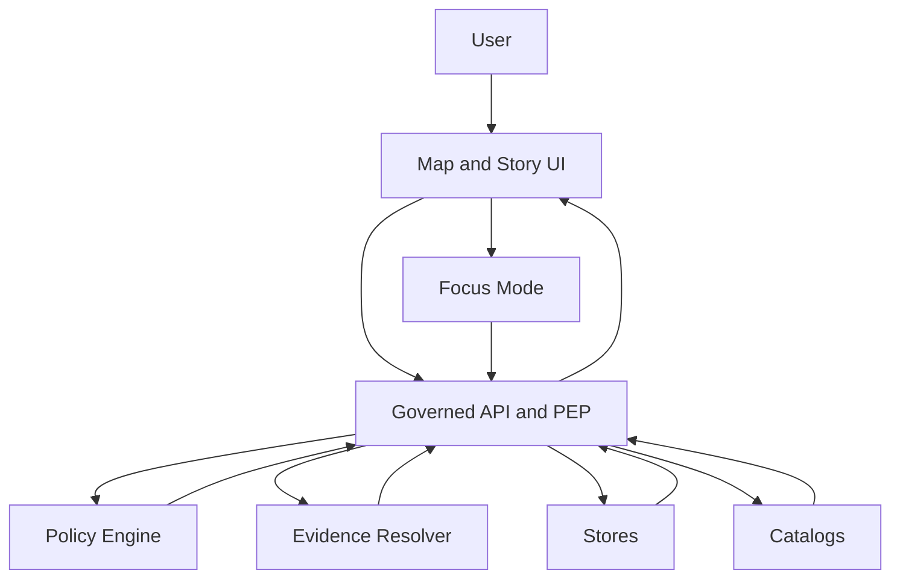

<!-- [KFM_META_BLOCK_V2]
doc_id: kfm://doc/0d15f4c3-7b4b-4e6d-9f57-2b7c0a3be5d3
title: apps/ — Runnable services
type: standard
version: v1
status: draft
owners: TODO
created: 2026-03-03
updated: 2026-03-03
policy_label: public
related:
  - kfm://doc/TODO
tags: [kfm]
notes:
  - [Proposed] Directory contract for KFM runnable apps (API/UI/CLI/workers).
[/KFM_META_BLOCK_V2] -->

# apps/

**Purpose:** **[Confirmed]** Runnable services for Kansas Frontier Matrix (KFM): **governed API**, **web UI**, and supporting **workers/CLIs**.

**Status:** draft • **Owners:** `TODO` • **Policy label:** `public`

   

- [Overview](#overview)
- [Directory contents](#directory-contents)
- [Architecture invariants](#architecture-invariants)
- [Boundaries and responsibilities](#boundaries-and-responsibilities)
- [Adding a new app](#adding-a-new-app)
- [Verification checklist](#verification-checklist)
- [Appendix: conventions](#appendix-conventions)

---

## Overview

- **[Confirmed]** `apps/` is the home for **runnable services** (API, UI, workers, CLI) — i.e., deployable binaries/servers, not shared libraries.
- **[Confirmed]** The key architectural concept is the **trust membrane**: clients (including the UI) must not access storage directly; all reads/writes go through governed interfaces (Policy Enforcement Point + Evidence Resolver).
- **[Proposed]** This README is a *directory contract* for `apps/`; app-specific run/config details belong in each app's own `README.md`.

### Evidence tags used in this README

- **[Proposed]** Statements are prefixed with one of: **[Confirmed]**, **[Proposed]**, **[Unknown]**.
- **[Proposed]** If a statement is **[Unknown]**, it must include the smallest “Verify” step to make it **[Confirmed]**.

[Back to top](#apps)

---

## Directory contents

- **[Proposed]** The exact set of apps may evolve by branch/release; treat the tree below as the **reference layout**, then verify what exists in your working tree.

```text
apps/
├─ api/        # [Confirmed] Governed API layer (Policy Enforcement Point, "PEP")
├─ ui/         # [Confirmed] Map / Story / Focus Mode web UI
├─ cli/        # [Confirmed] Operator + developer CLI (promotion, migration, etc.)
├─ workers/    # [Proposed] Background jobs (index rebuilds, async QA, notifications)
├─ catalog/    # [Proposed] Optional catalog portal or catalog-serving façade
└─ README.md   # [Proposed] This file
```

### What belongs in `apps/`

- **[Confirmed]** Deployable servers/services and their *app wiring*: HTTP handlers, UI route shells, job runners, configuration loaders.
- **[Proposed]** Per-app deployment artifacts co-located with the app (Dockerfile, Helm chart values) **if** your repo conventions allow it.
- **[Proposed]** Per-app observability wiring (structured logging, metrics, traces) and runbooks.

### What does **not** belong in `apps/`

- **[Confirmed]** Shared business logic (belongs in `packages/`).
- **[Confirmed]** API contracts and schemas (belongs in `contracts/` and schema registries).
- **[Confirmed]** Policy packs, fixtures, and policy tests (belongs in `policy/`).
- **[Confirmed]** Data artifacts, catalogs, and registry entries (belongs in `data/` and zoned storage).

[Back to top](#apps)

---

## Architecture invariants

### The trust membrane is non-negotiable

> WARNING: Any direct client/UI → database/object-store access is a policy bypass.

- **[Confirmed]** **Clients and the UI never access storage directly.**  
  **Implication:** UI data access is only through the governed API; server-side reads/writes are mediated by policy + evidence resolution.

- **[Confirmed]** **Fail closed.** If policy, evidence, or catalog lookups cannot be resolved, the API/UI must deny, abstain, or narrow scope.

### Reference flow


```mermaid
flowchart TD
  User[User] --> UI[Map and Story UI]
  UI --> API[Governed API and PEP]
  API --> Policy[Policy Engine]
  API --> Evidence[Evidence Resolver]
  API --> Stores[Stores]
  API --> Catalogs[Catalogs]
  Policy --> API
  Evidence --> API
  Stores --> API
  Catalogs --> API
  API --> UI
  UI --> Focus[Focus Mode]
  Focus --> API
```

### Lifecycle zones still apply to apps

- **[Confirmed]** Data lifecycle zones (Upstream → RAW → WORK/Quarantine → PROCESSED → CATALOG → PUBLISHED) define the “truth path”.  
  **Implication:** apps should only expose **PUBLISHED** (governed) surfaces to end users, and must never “backdoor” raw artifacts into a public UI.

[Back to top](#apps)

---

## Boundaries and responsibilities

### `apps/api/` — Governed API (“PEP”)

- **[Confirmed]** The API layer is the **Policy Enforcement Point (PEP)** for client queries.
- **[Confirmed]** Example endpoint set (illustrative):  
  `GET /api/v1/catalog/datasets`  
  `GET /api/v1/datasets/{dataset_version_id}/query`  
  `GET /api/v1/tiles/{layer_id}/{z}/{x}/{y}`  
  `POST /api/v1/evidence/resolve`  
  `GET /api/v1/lineage/{dataset_id}`  
  `POST /api/v1/focus/ask`
- **[Proposed]** Contract-first implementation:
  - [ ] OpenAPI lives in `contracts/openapi`
  - [ ] Request/response schemas validated in CI
  - [ ] Runtime enforcement at handlers (schema + policy + evidence)

### `apps/ui/` — Map / Story / Focus Mode UI

- **[Confirmed]** The UI must make trust visible (dataset version, freshness, license, policy badges) and provide one-click access to evidence and provenance.
- **[Confirmed]** The “evidence drawer” is a shared UI surface for Map/Story/Focus.
- **[Proposed]** The UI must not embed credentials or direct access URLs for restricted artifacts; it should request derived/allowed representations from the governed API.

### `apps/cli/` — Operator/Developer tools

- **[Confirmed]** CLIs support promotion, migration, and operational workflows.
- **[Proposed]** Any CLI that can mutate state must be governed:
  - [ ] AuthZ checks
  - [ ] Policy evaluation
  - [ ] Audit trail (run receipt / decision id where applicable)

[Back to top](#apps)

---

## Adding a new app

- **[Proposed]** Prefer *small, additive apps* that compose `packages/*` rather than duplicating logic.
- **[Proposed]** Every new app must have:
  - [ ] A local `README.md` (purpose, run instructions, config, health checks)
  - [ ] Clear dependency boundaries (no direct DB/storage calls from UIs)
  - [ ] AuthN/AuthZ and policy tests (fail closed)
  - [ ] Structured logs + basic metrics
  - [ ] A rollback plan if user-facing or operationally significant

[Back to top](#apps)

---

## Verification checklist

Use these steps to turn **[Unknown]** into **[Confirmed]** for your branch:

1) **[Unknown]** Confirm which apps exist.  
**Verify:** list `apps/`:
```bash
ls -la apps
```

2) **[Unknown]** Confirm each app’s entrypoint + run docs.  
**Verify:** find per-app READMEs:
```bash
find apps -maxdepth 2 -name README.md -print
```

3) **[Unknown]** Confirm UI does not call storage directly.  
**Verify:** grep for storage SDKs/URLs:
```bash
rg -n "(s3://|gs://|blob\\.core\\.windows\\.net|postgresql://|postgis)" apps/ui || true
```

4) **[Unknown]** Confirm the UI uses governed endpoints.  
**Verify:** locate UI calls to `/api/v1`:
```bash
rg -n "(/api/v1|evidence/resolve|focus/ask|tiles/)" apps/ui || true
```

[Back to top](#apps)

---

## Appendix: conventions

### Minimal per-app README template

```markdown
# <app-name>

- **[Confirmed/Proposed/Unknown]** Purpose:
- **[Confirmed/Proposed/Unknown]** Owners:
- **[Confirmed/Proposed/Unknown]** Policy label:

## Run (local)
## Config
## Health & Observability
## Security & Governance Notes
```

### “Thin app” rule

- **[Proposed]** App code is wiring + I/O; reusable logic lives in `packages/*`.
