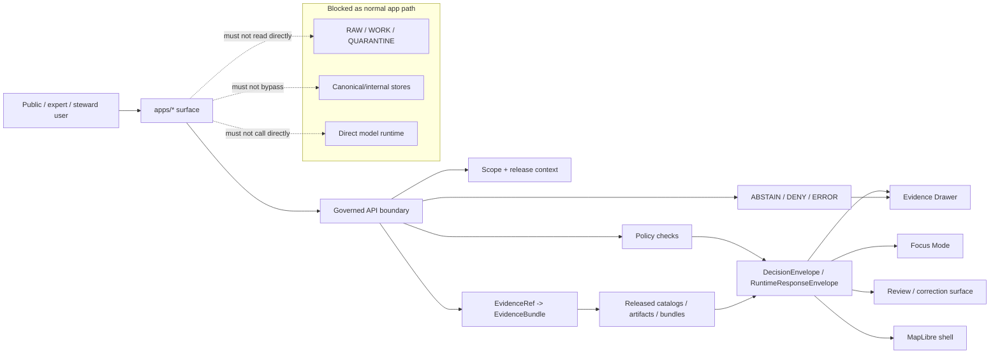

<!-- [KFM_META_BLOCK_V2]
doc_id: TODO-VERIFY-kfm-doc-uuid
title: Apps
type: standard
version: v1
status: draft
owners: TODO-VERIFY-apps-owners
created: 2026-04-22
updated: 2026-04-22
policy_label: TODO-VERIFY-public-or-restricted
related: [TODO-VERIFY-root-readme, TODO-VERIFY-docs-architecture, TODO-VERIFY-contracts, TODO-VERIFY-schemas, TODO-VERIFY-policy, TODO-VERIFY-tests]
tags: [kfm, apps, governed-api, map-first, evidence-first]
notes: [Draft generated from attached KFM corpus; mounted repo inventory, owners, related links, and implementation status need verification.]
[/KFM_META_BLOCK_V2] -->

<a id="top"></a>

# Apps

Application surfaces for KFM’s governed, evidence-first, map-first, time-aware product boundary.

<p>
  
  
  
  
  
</p>

> [!IMPORTANT]
> This README defines the admission contract for application code under `apps/`. It does **not** prove that any child app, route, package manager, workflow, deployment, or runtime behavior already exists. Upgrade any `UNKNOWN` or `NEEDS VERIFICATION` item only after direct repo inspection.

## Impact block

| Field | Value |
| --- | --- |
| Status | `experimental` |
| Owners | `TODO-VERIFY-apps-owners` |
| Path | `apps/README.md` |
| Primary role | Directory README for app-facing surfaces and trust-boundary rules |
| Evidence posture | `CONFIRMED` KFM doctrine / `PROPOSED` app-directory contract / `UNKNOWN` mounted implementation |
| Normal public path | Public and steward clients → governed API → released evidence/artifacts → trust-visible UI |
| Do not use this directory for | Raw data stores, canonical truth stores, policy definitions, machine schemas, release artifacts, secrets, or direct model endpoints |

### Quick jumps

[Scope](#scope) ·
[Repo fit](#repo-fit) ·
[Accepted inputs](#accepted-inputs) ·
[Exclusions](#exclusions) ·
[Directory contract](#directory-contract) ·
[Governed app boundary](#governed-app-boundary) ·
[Quickstart](#quickstart) ·
[Review gates](#review-gates) ·
[FAQ](#faq) ·
[Appendix](#appendix)

---

## Scope

`apps/` is the intended home for runnable application surfaces that expose, review, operate, or assist KFM through governed boundaries.

In KFM, an app is not merely a UI bundle, server process, worker, or command entry point. An app is a **trust-bearing surface**. It must preserve the project’s truth posture:

```text
RAW -> WORK/QUARANTINE -> PROCESSED -> CATALOG/TRIPLET -> PUBLISHED
```

Application code belongs here only when it respects that lifecycle and consumes governed interfaces rather than silently treating internal stores, derived layers, rendered maps, summaries, or model output as sovereign truth.

### Evidence posture used in this README

| Label | Meaning in this file |
| --- | --- |
| `CONFIRMED` | Supported by attached KFM doctrine or current-session workspace inspection. |
| `PROPOSED` | Recommended structure or rule not verified as present implementation. |
| `UNKNOWN` | Not verified because mounted repo contents, tests, workflows, routes, and runtime traces were not available when drafted. |
| `NEEDS VERIFICATION` | Must be checked in the real checkout before claiming current behavior. |

<p align="right"><a href="#top">Back to top ↑</a></p>

---

## Repo fit

### Path

```text
apps/README.md
```

### Upstream and downstream relationships

Relative link targets are intentionally left as path text until the real checkout confirms they exist.

| Direction | Target path | Relationship | Status |
| --- | --- | --- | --- |
| Upstream | `../README.md` | Root orientation and repository-wide entry point | `NEEDS VERIFICATION` |
| Upstream | `../docs/README.md` | Documentation control plane and source authority | `NEEDS VERIFICATION` |
| Upstream | `../docs/architecture/README.md` | Cross-cutting system architecture | `NEEDS VERIFICATION` |
| Upstream | `../contracts/README.md` | Human-readable object meaning and lifecycle semantics | `NEEDS VERIFICATION` |
| Upstream | `../schemas/README.md` | Executable validation shapes | `NEEDS VERIFICATION` |
| Upstream | `../policy/README.md` | Release, sensitivity, runtime, and denial logic | `NEEDS VERIFICATION` |
| Upstream | `../tests/README.md` | Validation, fixture, accessibility, and regression evidence | `NEEDS VERIFICATION` |
| Downstream | `./governed-api/README.md` | Governed API boundary surface | `PROPOSED / NEEDS VERIFICATION` |
| Downstream | `./explorer-web/README.md` | Map-first public or expert shell | `PROPOSED / NEEDS VERIFICATION` |
| Downstream | `./review-console/README.md` | Steward and review workflow surface | `PROPOSED / NEEDS VERIFICATION` |
| Downstream | `./workers/README.md` | Runnable app-owned workers or scheduled process entry points | `PROPOSED / NEEDS VERIFICATION` |
| Downstream | `./cli/README.md` | Operator-facing command entry points | `PROPOSED / NEEDS VERIFICATION` |

> [!NOTE]
> A retrieved README-like sketch surfaced candidate app families including `cli`, `explorer-web`, `governed-api`, `review-console`, and `workers`, plus a possible deeper `apps/api/src/api` surface. Treat those names as preservation signals until direct repo inspection confirms or corrects them.

<p align="right"><a href="#top">Back to top ↑</a></p>

---

## Accepted inputs

Application code under `apps/` may accept only inputs that have a clear trust posture and a declared boundary.

| Input class | Belongs here when… | Required guardrail |
| --- | --- | --- |
| Released evidence references | The app resolves or displays `EvidenceRef` objects through a governed API. | Evidence must resolve to an approved `EvidenceBundle` before consequential claims are shown. |
| Published layer manifests | The app renders released map layers or metadata-backed styles. | Layer meaning lives in metadata and contracts, not only in style expressions. |
| Runtime envelopes | The app displays `ANSWER`, `ABSTAIN`, `DENY`, or `ERROR` outcomes. | Negative states must be visible and reviewable, not hidden behind generic errors. |
| Review tasks | The app supports steward review, correction, or promotion workflows. | Review actions must emit receipts or traceable state transitions. |
| Public-safe tiles and assets | The app consumes published PMTiles, raster tiles, COG-derived surfaces, sprites, glyphs, or style assets. | Assets remain derived delivery artifacts, not canonical truth. |
| Operator commands | A CLI or console wraps governed operations. | Destructive or publication-affecting commands must require explicit review gates. |
| Model-assisted responses | The app displays bounded AI output returned by the governed API. | Clients must not call model runtimes directly. |

<p align="right"><a href="#top">Back to top ↑</a></p>

---

## Exclusions

The fastest way to weaken KFM is to let app convenience become an ungoverned shortcut. Keep these out of `apps/` unless a repo-native ADR explicitly defines a constrained exception.

| Do not place here | Goes instead | Reason |
| --- | --- | --- |
| RAW source files | `../data/raw/` or repo-native lifecycle home | Apps must not normalize or publish raw evidence ad hoc. |
| WORK or QUARANTINE artifacts | `../data/work/`, `../data/quarantine/`, or repo-native lifecycle home | Staged and unresolved material is not public app input. |
| Canonical/internal truth stores | Repo-native database, data, or service layer | Apps should use governed APIs, not bypass stores directly. |
| Machine schemas | `../schemas/` | Shape validation must remain distinct from app behavior. |
| Human semantic contracts | `../contracts/` | Object meaning should not be buried in UI or route code. |
| Policy rules | `../policy/` | Rights, sensitivity, release, and denial logic must be enforceable outside the UI. |
| Fixtures and regression data | `../tests/fixtures/` or repo-native fixture home | Fixtures are verification objects, not app assets. |
| Reusable domain libraries | `../packages/` or repo-native package home | Apps should compose libraries rather than become libraries. |
| Secrets, tokens, credentials | Secret manager, deployment config, or local ignored files | No secret belongs in committed app code. |
| Direct model endpoint clients | Governed API adapter layer | AI must remain downstream of evidence, policy, and citation validation. |
| Emitted receipts, proofs, and releases | `../data/receipts/`, `../data/proofs/`, `../data/published/`, or repo-native artifact home | Runtime products are evidence of process, not app source. |

<p align="right"><a href="#top">Back to top ↑</a></p>

---

## Directory contract

This tree is a **permitted and expected shape**, not a confirmed inventory.

```text
apps/
├── README.md                         # This directory contract
├── governed-api/                     # PROPOSED: API boundary for evidence, policy, release, and runtime envelopes
│   └── README.md
├── explorer-web/                     # PROPOSED: map-first public/expert shell
│   └── README.md
├── review-console/                   # PROPOSED: steward review, correction, promotion, and queue surfaces
│   └── README.md
├── workers/                          # PROPOSED: runnable app-owned worker entry points
│   └── README.md
└── cli/                              # PROPOSED: operator command surface
    └── README.md
```

### Child README minimums

Every child app README should include:

1. one-line purpose;
2. owner and status;
3. accepted inputs and exclusions;
4. upstream contract, schema, policy, and test references;
5. exposed commands or routes, marked `CONFIRMED`, `PROPOSED`, or `UNKNOWN`;
6. trust-boundary statement;
7. negative outcome behavior;
8. validation commands;
9. rollback or disable path;
10. open verification gaps.

> [!WARNING]
> Do not create multiple spellings for the same app surface, such as `governed-api` and `governed_api`, without an ADR and migration note.

<p align="right"><a href="#top">Back to top ↑</a></p>

---

## Governed app boundary

The app layer is allowed to make KFM pleasant, fast, inspectable, and useful. It is not allowed to become the root source of truth.


```mermaid
flowchart LR
  User["Public / expert / steward user"] --> App["apps/* surface"]
  App --> GAPI["Governed API boundary"]

  GAPI --> Scope["Scope + release context"]
  GAPI --> Policy["Policy checks"]
  GAPI --> Resolver["EvidenceRef -> EvidenceBundle"]
  Resolver --> Released["Released catalogs / artifacts / bundles"]

  Policy --> Envelope["DecisionEnvelope / RuntimeResponseEnvelope"]
  Released --> Envelope

  Envelope --> Drawer["Evidence Drawer"]
  Envelope --> Focus["Focus Mode"]
  Envelope --> Review["Review / correction surface"]
  Envelope --> Map["MapLibre shell"]

  Negative["ABSTAIN / DENY / ERROR"] --> Drawer
  GAPI --> Negative

  subgraph Blocked["Blocked as normal app path"]
    Raw["RAW / WORK / QUARANTINE"]
    Canon["Canonical/internal stores"]
    Model["Direct model runtime"]
  end

  App -. "must not read directly" .-> Raw
  App -. "must not bypass" .-> Canon
  App -. "must not call directly" .-> Model
```

### Boundary rules

| Rule | Required behavior |
| --- | --- |
| Governed API first | Public and ordinary steward surfaces call governed interfaces, not internal stores. |
| Evidence first | Consequential claims resolve to `EvidenceBundle` before display, export, or synthesis. |
| Policy visible | Sensitivity, rights, review state, freshness, and correction state remain user-visible where material. |
| Finite outcomes | Apps must represent `ANSWER`, `ABSTAIN`, `DENY`, and `ERROR` as first-class outcomes. |
| Renderer boundary | MapLibre draws and interacts; it does not own truth, policy, source authority, or review state. |
| AI subordinate | Focus Mode and AI-assisted features receive policy-safe evidence only and must cite or abstain. |
| Derived layers stay derived | Tiles, scenes, summaries, search indexes, and graph projections never replace canonical truth. |
| Fail closed | Missing rights, sensitivity, unresolved evidence, stale release state, or unavailable policy checks block publication-facing behavior. |

<p align="right"><a href="#top">Back to top ↑</a></p>

---

## Surface contract

| Surface | What belongs | What does not belong | Required output posture |
| --- | --- | --- | --- |
| Public map shell | Released layers, timeline controls, trust chips, Evidence Drawer entry points | Raw records, unreleased candidate data, hidden policy state | Evidence-visible and public-safe |
| Expert shell | Compare, filters, richer metadata, domain context | Authority shortcuts or unreviewed joins | More detail without weaker truth rules |
| Steward/review console | Queues, diffs, review actions, correction workflows, promotion preview | One-click publish without receipts or review state | Auditable and reversible |
| Governed API app | Scope resolution, policy checks, evidence resolution, finite envelopes | Direct public access to canonical stores | Cite-or-abstain / fail-closed |
| Worker app | Scheduled or queued process entry points with receipts | Silent background mutation of public state | Receipt-bearing and idempotent where practical |
| CLI | Inspection, dry-run, review, promotion support | Unlogged destructive operations | Explicit, reviewable, and rollback-aware |
| Focus Mode | Evidence-bounded synthesis and navigation | Free-form model answers detached from released evidence | `ANSWER`, `ABSTAIN`, `DENY`, or `ERROR` with reason codes |

<p align="right"><a href="#top">Back to top ↑</a></p>

---

## Quickstart

### 1. Read-only verification pass

Run these before upgrading any `UNKNOWN` claim in this README.

```bash
pwd
git status --short
git branch --show-current

find apps -maxdepth 3 -type f | sort
find apps -maxdepth 3 -name README.md -print | sort

find docs contracts schemas policy tests packages data -maxdepth 3 -type f 2>/dev/null | sort
find .github/workflows -maxdepth 2 -type f 2>/dev/null | sort
```

Expected review result for this draft:

```text
CONFIRMED: target path is apps/README.md.
NEEDS VERIFICATION: actual child app folders, route names, package manager, CI, tests, owners, CODEOWNERS, and runtime behavior.
```

### 2. Add or revise a child app

1. Create or update the child app README first.
2. Declare purpose, owners, status, accepted inputs, and exclusions.
3. Link or identify contracts, schemas, policies, and fixtures.
4. Confirm the app consumes governed APIs or released artifacts.
5. Add negative-state handling for `ABSTAIN`, `DENY`, and `ERROR`.
6. Add tests that prove no raw, quarantine, canonical-store, or direct-model bypass exists.
7. Update repo navigation only after the path is verified.

### 3. Review a public-facing change

```bash
# Read-only examples; adapt to the repo-native package manager after verification.
find apps -maxdepth 4 -type f | sort
find contracts schemas policy tests -maxdepth 4 -type f 2>/dev/null | sort
grep -RIn "RAW\|QUARANTINE\|Ollama\|localhost:11434\|api/generate\|api/chat" apps 2>/dev/null || true
```

> [!CAUTION]
> The `grep` probe is only a rough review aid. It does not prove policy compliance, absence of bypasses, or safe model integration.

<p align="right"><a href="#top">Back to top ↑</a></p>

---

## Review gates

A change under `apps/` is not ready merely because it runs.

### Definition of done

- [ ] Child app has a README with purpose, owner, status, accepted inputs, and exclusions.
- [ ] Claims about existing routes, components, tests, workflows, or packages are backed by repo evidence.
- [ ] Public or ordinary steward paths use governed APIs or released artifacts.
- [ ] App does not read `RAW`, `WORK`, or `QUARANTINE` as a normal public path.
- [ ] App does not make canonical/internal stores directly available to public clients.
- [ ] App does not call model runtimes directly from browser or ordinary client code.
- [ ] Consequential claims can open or resolve an Evidence Drawer payload.
- [ ] Focus-like behavior receives resolved, policy-safe evidence and emits finite outcomes.
- [ ] `ABSTAIN`, `DENY`, and `ERROR` are represented intentionally.
- [ ] Rights, sensitivity, freshness, review, release, and correction states are visible where material.
- [ ] Accessibility checks cover keyboard access, readable trust cues, focus order, and negative states.
- [ ] Policy and schema changes are reviewed in their proper homes.
- [ ] Tests or fixtures prove at least one success path and one denial/abstention path.
- [ ] Rollback, disable, or feature-flag path is documented for public-facing changes.
- [ ] Documentation was updated or the no-doc-change reason is recorded.

<p align="right"><a href="#top">Back to top ↑</a></p>

---

## FAQ

### Can a web app read from `data/raw` for convenience?

No. Public-facing and ordinary UI paths should use governed APIs, released artifacts, catalog records, tile services, or resolved evidence bundles. Raw and unresolved material must stay behind lifecycle and policy controls.

### Can MapLibre layer styling carry business meaning?

Only as presentation. Business meaning, knowledge character, source role, policy posture, review state, freshness, and evidence routes belong in contracts, layer metadata, and governed payloads. A style expression is not a policy engine.

### Can Focus Mode call a local model directly?

No. Focus Mode must sit behind a governed API boundary. Model runtime access is an adapter concern after scope, policy, and evidence resolution, not a browser-client concern.

### Can review tools live under `apps/`?

Yes, when they are runnable application surfaces and keep review actions auditable, policy-aware, and reversible. Review schemas, policies, fixtures, receipts, and proofs still belong in their own homes.

### Can this README be upgraded from `draft`?

Yes, after direct repo inspection confirms owners, child directories, adjacent README links, package manager, tests, workflows, and enforcement depth. Until then, implementation-heavy claims remain `UNKNOWN` or `NEEDS VERIFICATION`.

<p align="right"><a href="#top">Back to top ↑</a></p>

---

## Appendix

<details>
<summary>Source family basis used to draft this README</summary>

This README was shaped by the attached KFM corpus, especially:

- whole-corpus synthesis and artifactization guidance;
- documentation architecture and source-authority guidance;
- MapLibre UI doctrine for map-first shell, Evidence Drawer, Focus Mode, and renderer boundaries;
- governed AI / Ollama guidance for provider-neutral, evidence-subordinate model use;
- MapLibre ecosystem boundary notes distinguishing renderer, style spec, source/layer definitions, tools, and delivery infrastructure;
- prior README-like app-surface sketches, treated as lineage and `NEEDS VERIFICATION` rather than current implementation proof.

</details>

<details>
<summary>Suggested child README template</summary>

```markdown
# <App name>

One-line purpose.

## Impact block

| Field | Value |
| --- | --- |
| Status | experimental / active / stable / deprecated |
| Owners | TODO |
| Path | apps/<app-name>/README.md |
| Trust boundary | governed API / review surface / worker / CLI |
| Evidence posture | CONFIRMED / PROPOSED / UNKNOWN |

## Scope

## Repo fit

## Accepted inputs

## Exclusions

## Runtime behavior

## Evidence, policy, and release dependencies

## Validation

## Rollback

## Open verification gaps
```

</details>

<details>
<summary>Open verification backlog for this file</summary>

- [ ] Confirm whether `apps/` exists in the target checkout.
- [ ] Confirm whether root `README.md` and `docs/README.md` exist and should be linked.
- [ ] Confirm child app names and spelling.
- [ ] Confirm whether `apps/governed-api`, `apps/api/src/api`, both, or neither exist.
- [ ] Confirm package manager and test commands.
- [ ] Confirm owners and CODEOWNERS.
- [ ] Confirm policy tooling and CI workflow names.
- [ ] Confirm actual Evidence Drawer, Focus Mode, and MapLibre implementation paths.
- [ ] Confirm whether app READMEs use KFM Meta Block v2 repo-wide.
- [ ] Replace TODO placeholders with verified identifiers and links.

</details>
