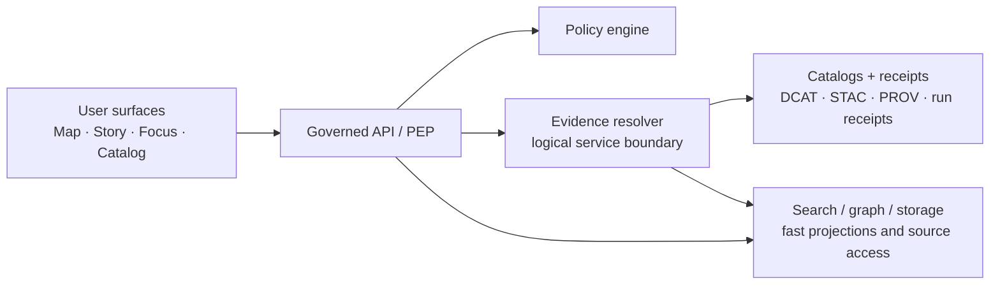
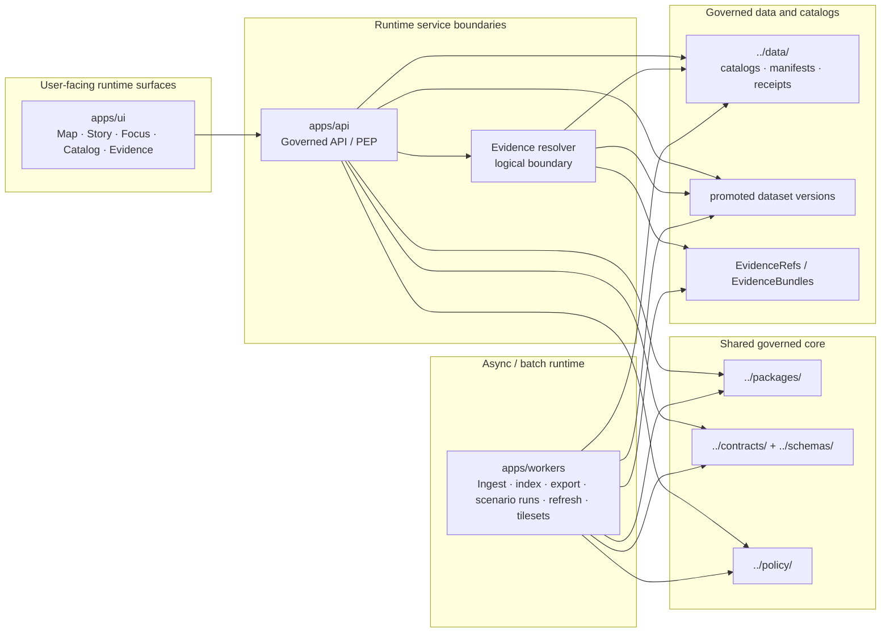
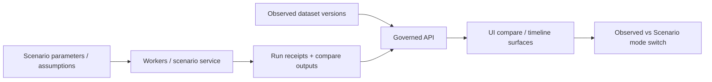
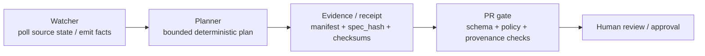

<!-- [KFM_META_BLOCK_V2]
doc_id: kfm://doc/3b4452c1-f6e0-4d21-86dc-3d2d5ea4c3c2
title: apps/ — Runtime apps and user-facing services
type: standard
version: v1
status: draft
owners: TBD (verify ../.github/CODEOWNERS)
created: 2026-03-06
updated: 2026-03-07
policy_label: public
related: [../README.md, ./api/README.md, ./ui/README.md, ./workers/README.md, ../packages/, ../contracts/, ../schemas/, ../policy/, ../data/, ../docs/]
tags: [kfm, apps, runtime, api, ui, workers, evidence, governance, timeline, scenario, education]
notes: [Top-level runtime-app contract aligned to the KFM manuals, the attached Extended Build Manual and Feature Architecture Dossier, retained system-spec and product-surface design inputs, and existing temporal-window planning material. Active-branch implementation claims remain UNKNOWN unless proven by supplied artifacts or branch-local verification.]
[/KFM_META_BLOCK_V2] -->

<a id="top"></a>

# apps/ — Runtime apps and user-facing services
Governed runtime surfaces for KFM: deployable API, UI, and worker apps that deliver map, story, focus, catalog, evidence, time-window, and domain workflows without bypassing policy, provenance, or promotion gates.

**Status:** `draft`  
**Owners:** `TBD (verify ../.github/CODEOWNERS)`  


**Quick links:** [Purpose and scope](#purpose-and-scope) · [Repo fit](#repo-fit) · [Truth status legend](#truth-status-legend) · [Runtime portfolio model](#runtime-portfolio-model) · [Documented target stack](#documented-target-stack-vs-active-branch-reality) · [Temporal windows](#temporal-windows-and-time-navigation) · [Evidence model](#runtime-evidence-model-and-trust-surfaces) · [Delivery artifacts](#delivery-artifacts-as-governed-runtime-objects) · [Accepted inputs](#accepted-inputs) · [Exclusions](#exclusions) · [Directory tree](#directory-tree) · [Quickstart](#quickstart) · [Usage](#usage) · [Current app surfaces](#current-app-surfaces) · [Cross-app operating model](#cross-app-operating-model) · [Runtime operating expectations](#runtime-operating-expectations) · [Automation](#automation-orchestration-and-pr-governed-runtime-change) · [Runtime invariants](#runtime-invariants) · [Suggested app metadata contract](#suggested-app-metadata-contract-proposed) · [Growth lanes](#runtime-growth-lanes-proposed) · [Build sequence](#build-sequence-and-release-posture) · [Definition of done](#definition-of-done) · [FAQ](#faq) · [Appendix](#appendix-open-verification-steps)

---

## Purpose and scope

`apps/` is the directory for **deployable runtime applications** in Kansas Frontier Matrix.

This README exists to define:

- what belongs in `apps/`
- what does **not** belong in `apps/`
- which runtime surfaces are grounded in the supplied KFM design corpus
- which directory paths are present in the supplied snapshot
- which implementation details remain `UNKNOWN`
- what every app under this directory must preserve as part of the KFM trust model

KFM’s runtime should feel like **one governed product**, not a pile of adjacent apps. `apps/` is where that composition happens.

### CONFIRMED

- `apps/` is a top-level repo area in the supplied artifact.
- The repo-root posture describes `apps/` as the home for **runnable services and user-facing applications**.
- Child app documentation is supplied for:
  - [`./api/README.md`](./api/README.md)
  - [`./ui/README.md`](./ui/README.md)
  - [`./workers/README.md`](./workers/README.md)
- The supplied KFM design corpus describes a public-facing runtime centered on:
  - a map + timeline experience
  - story / narrative authoring and retrieval
  - an Evidence Drawer / evidence-resolution surface
  - a governed Focus Mode assistant
- The attached build manual explicitly deepens runtime concerns that matter to `apps/`, including:
  - EvidenceRef / EvidenceBundle mechanics
  - policy-aware geometry and time handling
  - advanced UI trust surfaces
  - delivery-asset choices such as PMTiles, dynamic MVT, and IIIF-aware history delivery
  - PR-governed automation and receipt discipline
  - build sequencing, release gates, and operational hardening
- The existing educational/runtime planning language still extends the runtime vocabulary with:
  - Explore
  - Explain / Story Studio
  - Speculate / Scenario Lab
  - Teach / Assess / Classroom Hub
- The existing temporal-window planning language still adds two time-aware runtime patterns:
  - a **deep-history to 1854** “fixed window / changing layers” approach
  - a **1901–future** observed + scenario timeline with explicit uncertainty separation

### PROPOSED

- This top-level README should be the **directory contract** for all runtime apps, so child READMEs can go deeper without repeating repo-level rules.
- Domain verticals such as **Cities & Infrastructure**, educational surfaces, scenario/compare workflows, and catalog-driven discovery should be added as governed modules within existing runtime surfaces, not as side-door dashboards or parallel stacks.
- Worker runtimes should be explicit about export generation, provenance snapshots, refresh jobs, lesson-bundle packaging, tileset generation, scenario runs, and hybrid ingestion without becoming shadow publication paths.
- Advanced trust cues such as **Precision Meter**, **Timeline Scrub**, **confidence chips**, **attestation badges**, and **automation-status overlays** should be treated as runtime UX, not post-polish decoration.

### UNKNOWN

- Exact runtime stack per app on the active branch
- Exact local commands and ports for every app
- Queue / scheduler implementation details
- Full owner map from `CODEOWNERS`
- Exact CI jobs that block merges for each app surface
- Whether the supplied tree exactly matches the current checked-out branch
- Whether EvidenceBundle resolution exists as runnable code or only as contracts / design notes
- Whether delivery-artifact governance (tilesets, IIIF, export receipts) is implemented or still planned

[Back to top](#top)

---

## Repo fit

**Path:** `/apps/README.md`  
**Repo role:** runtime app boundary for KFM.

**Upstream dependencies**

- [`../packages/`](../packages/) — shared libraries, domain logic, adapters, reusable services
- [`../contracts/`](../contracts/) — API and interface contracts
- [`../schemas/`](../schemas/) — validation schemas
- [`../policy/`](../policy/) — policy rules, fixtures, and tests
- [`../data/`](../data/) — governed datasets, manifests, receipts, catalog artifacts
- [`../docs/`](../docs/) — architecture, ADRs, runbooks, standards

**Downstream runtime surfaces**

- [`./api/README.md`](./api/README.md) — governed API / PEP boundary
- [`./ui/README.md`](./ui/README.md) — governed frontend client
- [`./workers/README.md`](./workers/README.md) — background, batch, and async runtime

### Boundary rule

`apps/` is where runtime composition happens. Shared business logic, reusable validators, schema definitions, and policy packs should not be re-implemented here if they belong in shared layers.

Runtime convenience must never outrun:
- the trust membrane
- the evidence contract
- policy-safe failure behavior
- promotion discipline
- catalog-as-contract
- observed vs projected separation
- privacy and accessibility expectations when educational surfaces are involved

### Runtime layering rule

Within `apps/`, treat:
- canonical truth as **upstream**
- API / policy / evidence resolution as the **runtime boundary**
- search, graph, and vector indices as **fast projections**
- UI and exports as **governed delivery surfaces**

That means the runtime layer should never let “fast” stores or convenience payloads become sovereign over source truth.

[Back to top](#top)

---

## Truth status legend

This README uses explicit truth labels.

| Label | Meaning in this file |
|---|---|
| **CONFIRMED** | Supported by the supplied artifact or attached KFM/source documents. |
| **PROPOSED** | Recommended structure or rule that fits KFM’s documented architecture. |
| **UNKNOWN** | Not yet verified on the active branch; do not treat as branch fact. |

### Operating rule

Visible uncertainty is better than false certainty.

A detail can be:
- **CONFIRMED as documented design posture**
- while still remaining **UNKNOWN as active-branch implementation**

If a runtime detail is not verified on the active branch, leave it `UNKNOWN` and add the smallest verification step.

[Back to top](#top)

---

## Runtime portfolio model

KFM’s runtime portfolio should be understood as a **coordinated product surface**, not merely as three sibling folders.

### Baseline product surfaces from the supplied KFM design corpus

| Runtime surface | Design status | Likely host apps | Branch reality in this README |
|---|---|---|---|
| **Map Explorer / map + timeline** | **CONFIRMED** in supplied KFM docs | `ui` + `api` | Exact implementation remains `UNKNOWN` until verified locally. |
| **Story Editor / Story Nodes / Story Mode** | **CONFIRMED** in supplied KFM docs | `ui` + `api` | Exact implementation remains `UNKNOWN` until verified locally. |
| **Evidence Drawer / evidence inspection** | **CONFIRMED** in supplied KFM docs and attached build manual | `ui` + `api` | Exact implementation remains `UNKNOWN` until verified locally. |
| **Focus Mode** | **CONFIRMED** in supplied KFM docs and attached build manual | `ui` + `api` (+ async worker support if needed) | Exact implementation remains `UNKNOWN` until verified locally. |
| **Catalog Browser** | **CONFIRMED** in the attached build manual as a primary user-facing surface | `ui` + `api` | Exact implementation remains `UNKNOWN` until verified locally. |

### Runtime trust instrumentation that fits the same boundary

| Trust surface | Design status | Likely host apps | Why it belongs here |
|---|---|---|---|
| **Precision Meter** | **PROPOSED** | `ui` + `api` | Explains generalized geometry and time precision without bypassing policy. |
| **Timeline Scrub with policy-aware precision** | **PROPOSED** | `ui` + `api` | Time controls are runtime behavior and must honor sensitivity / redaction rules. |
| **Confidence chips / reason chips** | **PROPOSED** | `ui` + `api` | Makes evidence density, method, and model-derived status legible during use. |
| **Attestation badge / automation-status overlay** | **PROPOSED** | `ui` + `api` + `workers` | Exposes freshness, provenance, and release-trust signals at runtime. |

### Runtime extensions that fit the same governed boundary

| Runtime capability | Design status | Likely host apps | Why it belongs here |
|---|---|---|---|
| **Cities & Infrastructure** domain vertical | **PROPOSED** | `ui` + `api` + `workers` | It is a KFM domain vertical, not a separate bypass product. |
| **Educational Explore / Explain / Speculate / Teach** | **PROPOSED** runtime lane, grounded in existing design material | `ui` + `api` + `workers` | It extends existing map, story, evidence, and scenario patterns. |
| Exportable briefs, run receipts, and provenance snapshots | **PROPOSED** | `api` + `workers` | Shareable outputs still need audit refs and policy enforcement. |
| Policy-gated restricted layers | **PROPOSED** | `api` + `ui` + `workers` | Sensitive data handling belongs inside the same governed runtime. |
| Focus-domain assistants (for example, city or curriculum briefings) | **PROPOSED** | `api` + `ui` | Constrained retrieval and cite-or-abstain behavior stay inside the trust membrane. |
| Scenario / compare workflows | **PROPOSED** | `api` + `workers` + `ui` | Modeling should remain evidence-linked and policy-aware. |
| Deep-history and future temporal windows | **PROPOSED** runtime lanes | `ui` + `api` + `workers` | Time handling is a core runtime concern, not a side file-format concern. |

### Runtime composition rule

New workflow surfaces should normally be added as:
- modules in `ui`
- routes/endpoints in `api`
- jobs/pipelines/exports in `workers`

They should **not** normally appear as:
- direct-storage frontends
- one-off dashboards that ignore KFM contracts
- side-channel publication services
- separate “special” runtimes that bypass policy or evidence resolution

[Back to top](#top)

---

## Documented target stack vs active-branch reality

The supplied design corpus is specific about KFM’s intended runtime shape. That design posture is useful for this README, but it does **not** automatically prove the current branch implements every detail below.

| Surface | Documented target design | Active-branch reality in this README |
|---|---|---|
| **UI** | React + TypeScript, interactive map/timeline, Evidence Drawer, Focus chat, Catalog Browser, MapLibre for 2D maps, optional Cesium for 3D, and proposed trust cues such as Precision Meter / Timeline Scrub / attestation overlays | **UNKNOWN** until the branch proves framework, routes, and actual components. |
| **API / PEP** | Governed API with FastAPI / GraphQL posture, authentication, authorization, rate limiting, request validation, evidence resolution, story and Focus endpoints, and policy checks via OPA / Rego / Conftest | **UNKNOWN** until the branch proves framework, endpoint set, and deployment shape. |
| **Evidence resolution boundary** | Dedicated EvidenceBundle-building boundary fed by catalogs, receipts, graph/search, and policy outcomes; should not live as ad hoc UI glue | **UNKNOWN** whether separate executable service, internal module, or still only a design note. |
| **Workers / analytics** | ETL, NLP, export, indexing, refresh, tileset generation, receipt emission, scenario support, and other scheduled/on-demand services | **UNKNOWN** until the branch proves runtime and orchestration details. |
| **Delivery/runtime assets** | PMTiles, dynamic MVT, IIIF/Allmaps-aware historical map delivery, cataloged tileset metadata, and versioned runtime delivery assets | **UNKNOWN** until the branch proves generated artifacts and delivery paths. |
| **Local development profile** | Docker / Compose or equivalent, local policy engine, local PostGIS, optional Neo4j, search index, local model runtime, and other reviewable developer surfaces | **UNKNOWN** until local manifests and docs confirm it. |
| **Runtime data pattern** | Object storage + PostGIS + graph/search/catalog layers, with STAC/DCAT/PROV metadata and EvidenceRefs / EvidenceBundles | **UNKNOWN** as branch implementation detail unless verified locally. |

### Interpretation rule

Use the documented target stack to:
- align app responsibilities
- avoid contradictory README language
- guide verification

Do **not** use it to upgrade active-branch implementation facts from `UNKNOWN` to `CONFIRMED` without branch proof.

[Back to top](#top)

---

## Temporal windows and time navigation

The supplied design corpus makes time a runtime concern, not a decorative filter.

### Window design inputs vs runtime status

| Window | Design status | Runtime status in this README | What it implies for apps |
|---|---|---|---|
| **Earliest evidence → 1854** | **CONFIRMED** design input | **PROPOSED** runtime lane | Use a fixed Kansas analytical mask with changing cultural, political, legal, and ecological layers; encode confidence and alternative hypotheses. |
| **1854–1900 frontier era** | **CONFIRMED** design input | **PROPOSED** runtime baseline unless branch proves more | Treat this as the default historical frontier window in educational/historical experiences. |
| **1901–2100 observed + scenario frame** | **CONFIRMED** design input | **PROPOSED** runtime lane | Use a single timeline with explicit `Observed` vs `Scenario` mode separation, scenario selection, and uncertainty cues. |

### Time-navigation rules for runtime apps

1. **Do not mix observed and projected values in the same unlabeled channel.**
2. **Every time-aware layer should declare its temporal extent and grain.**
3. **Event nodes should be citation-bearing and provenance-addressable.**
4. **Deep-history layers should encode confidence, competing hypotheses, or uncertainty where boundaries are intrinsically fuzzy.**
5. **Scenario outputs should always remain visibly modeled rather than historical fact.**
6. **Timeline controls should honor sensitivity labels and redaction parameters so the client cannot reveal denied precision.**

### Suggested time-resolution posture

| Era / mode | Suggested grain | Why |
|---|---|---|
| Deep-history / pre-1854 layers | event boundaries + period slices | Legal regimes, sovereignty overlays, and archaeological periods do not behave like annual tables. |
| 1854–1900 frontier-era learning/research | year, decade, and event markers | Supports frontier-era exploration with story and evidence workflows. |
| 1901–1950 historical baseline | decade / quinquennial / event-based | Many authoritative series are lower-frequency but high-authority in this period. |
| Post-1950 observed layers | annual or finer where source cadence supports it | Modern climate, infrastructure, and socioeconomic feeds are often more frequent. |
| Scenario / projected layers | explicit scenario horizon (`2050`, `2100`, etc.) + uncertainty | Prevents category errors and preserves auditability. |

### Runtime implications by app class

| App class | Temporal responsibility |
|---|---|
| **UI** | Expose timeline controls, mode switches, compare views, and visible fact/speculation boundaries. |
| **API** | Return time-native layer metadata, scenario identifiers, evidence refs, precision tags, and policy-safe uncertainty labels. |
| **Workers** | Build time-binned materializations, scenario runs, compare outputs, and run receipts. |

[Back to top](#top)

---

## Runtime evidence model and trust surfaces

The attached build manual makes one upgrade especially important for `apps/`: treat runtime evidence objects as **first-class contracts**, not optional helper payloads.

### Evidence resolution loop


```mermaid
flowchart LR
  US["User surfaces<br/>Map · Story · Focus · Catalog"] --> API["Governed API / PEP"]
  API --> POL["Policy engine"]
  API --> ER["Evidence resolver<br/>logical service boundary"]
  API --> IDX["Search / graph / storage<br/>fast projections and source access"]
  ER --> CAT["Catalogs + receipts<br/>DCAT · STAC · PROV · run receipts"]
  ER --> IDX
```

### Core runtime evidence objects

| Object | What it is | Why it matters to `apps/` |
|---|---|---|
| **EvidenceRef** | Stable, short, deep-linkable pointer to a policy-governed object | Lets API, UI, stories, tiles, exports, and Focus answers cite the same runtime identifier. |
| **EvidenceBundle** | Resolved trust object for UI, API, and audit tooling | Prevents the UI from reconstructing provenance by making five unrelated calls. |
| **Occurrence / sidecar record** | Policy-aware record that binds exact geometry, generalized geometry, time precision, evidence, rights, sensitivity, redaction, and confidence | Gives map, story, and Focus one shared payload instead of three drifting interpretations. |

### EvidenceBundle lanes

| Lane | What it should carry |
|---|---|
| Identity | `evidence_ref`, subject type, stable IDs, `spec_hash` / digest |
| Metadata | title, description, provider, collection / dataset IDs, temporal extent |
| Rights | license, restrictions, attribution obligations, embargo markers |
| Freshness | source timestamp, fetch timestamp, last materialization, cadence notes |
| Provenance | inputs, transforms, tool versions, lineage links |
| Integrity | artifact digests, signatures / attestations, release-trust state |
| Policy outcome | allow / deny / generalize decisions, redaction params, sensitivity label |
| UI affordances | drawer title, copy citation, open evidence, precision note, confidence note |

### Suggested occurrence / sidecar contract

| Field family | Why it exists |
|---|---|
| `kfm_id`, `kind` | Stable runtime identity |
| `interval { start, end, precision }` | Time precision belongs in the same payload as place and evidence |
| `geometry`, `generalized_geometry` | Exact geometry stays governed; generalized geometry is what public runtime surfaces usually receive |
| `subject_refs[]`, `evidence_refs[]` | One object can anchor map features, story nodes, and Focus citations |
| `rights_spdx`, `sensitivity_label`, `redaction.params` | Rights and restriction behavior must be machine-available at runtime |
| `confidence { score, precision_tag }` | Uncertainty should be represented, not improvised in UI text |
| `meta { created_at, created_by }` | Operational provenance |

### Trust-cue pattern library

| Trust cue | Purpose | Status in this README |
|---|---|---|
| **Evidence Drawer** | Render the EvidenceBundle almost directly: provenance chain, citation block, receipt hash, rights, obligations, and deep links | Baseline runtime design input |
| **Precision Meter** | Explain geometry/time fuzzing or generalization | **PROPOSED** |
| **Timeline Scrub** | Keep time navigation inside the same sensitivity/redaction rules as the rest of the runtime | **PROPOSED** |
| **Confidence chips / reason chips** | Explain evidence density, method, model-derived status, oral/primary/secondary source type, and similar trust cues | **PROPOSED** |
| **Attestation badge** | Surface release or artifact-trust state on cards, layers, or features | **PROPOSED** |
| **Automation-status overlay** | Show freshness / pipeline state / lineage hints without pretending automation equals approval | **PROPOSED** |

### Shared runtime rule

If the same object appears in:
- a map feature popup
- a Story Node anchor
- a Focus citation
- a delivery artifact card

then `apps/` should strongly prefer **one policy-aware sidecar contract** over four ad hoc payloads.

[Back to top](#top)

---

## Delivery artifacts as governed runtime objects

The attached build manual argues for a simple rule: **delivery artifacts are runtime objects in their own right**, not throwaway frontend files.

### Delivery-asset posture

| Artifact / delivery type | Role | When to prefer it | Runtime rule |
|---|---|---|---|
| **COG** | Canonical raster artifact and preview source | Strong default for publishable rasters | Good fit for processed zone + catalog references. |
| **GeoParquet** | Canonical vector / tabular geospatial output | Strong default for analysis-ready structured data | Useful for graph ingest, analytics, and some API-backed surfaces. |
| **PMTiles** | Low-friction web delivery and offline-friendly single-file tiles | Very attractive for weekly/daily map surfaces | Still catalog, sign, and explain it like any other artifact. |
| **Dynamic MVT from PostGIS** | Per-request filtering and high-frequency edits | Use when rebuild churn makes pre-generation too expensive | Keep provenance and cache invalidation explicit. |
| **IIIF manifests + georeference annotations** | Historical map delivery and warped overlays | High-value for story/history surfaces | Treat manifests, rights, and warp annotations as first-class evidence assets. |
| **OCI artifact distribution** | Digest-addressed artifact distribution | Possible future release lane | Do not imply it exists until registry, clients, and policy are verified. |

### Decision matrix by cadence

| Update pattern | Preferred delivery posture |
|---|---|
| Monthly / weekly, stable schema | Pre-generated PMTiles |
| Daily, small deltas | Pre-generated delivery plus delta-aware tile regeneration |
| Hourly or finer edits | Dynamic PostGIS-backed tiles |
| 3D-first scene | 3D scene delivery with clear 2D/label integration where needed |
| Historical overlays | IIIF-aware delivery with preserved rights and manifest context |

### Runtime rules for delivery assets

- Publish **STAC items for tilesets**, not just source datasets.
- Treat **tileset metadata as evidence** when it shapes what the user actually sees.
- Link delivery artifacts back to datasets and receipts so Story Mode and Focus Mode can explain both:
  - the source dataset
  - and the delivery artifact the user interacted with
- Keep historical-map rights, manifest metadata, and warp annotations visible and linked.
- Do **not** treat tilesets, style JSON, IIIF warp annotations, or comparable runtime assets as “just frontend files.”

[Back to top](#top)

---

## Accepted inputs

The following belong in `apps/`:

| Input type | Examples | Why it belongs here |
|---|---|---|
| Deployable runtime application code | API services, UI clients, workers, schedulers | These are runnable boundaries. |
| App entrypoints and routing | HTTP routes, UI route shells, job registries | They define runtime behavior. |
| App-local manifests and metadata | `kfm.app.json`, `package.json`, `pyproject.toml`, container descriptors, env templates | They describe how the app is built or run. |
| App-local test suites | integration tests, route tests, UI tests, job tests | Runtime behavior must be verifiable. |
| App-local assets | UI assets, templates, static files, export templates, offline package shells | These are part of the runtime surface. |
| Health/readiness/observability wiring | health endpoints, logging setup, metrics hooks, traces | Runtime apps need operational signals. |
| Thin composition code | wiring shared packages, contracts, and policy-aware behavior into a runnable surface | Composition belongs here; shared logic does not. |
| App-local docs | child `README.md` files and app operation notes | Each app needs its own bounded contract. |
| Time-aware runtime assets | timeline config, time-window registries, compare-view templates | Runtime surfaces need explicit temporal behavior. |
| Scenario / export surfaces | run-render templates, brief exporters, receipt views, report shells | Shareable outputs are runtime concerns when they are user-facing. |
| Governed delivery assets | tileset configs, PMTiles-related delivery code, IIIF-aware runtime wrappers, map delivery adapters | Delivery assets shape user-visible behavior and belong under runtime governance. |
| Trust-surface assets | Evidence Drawer views, trust badges, precision UI components, lineage overlays | Provenance is part of usability in KFM, not an afterthought. |

### Typical examples

- governed API applications
- frontend clients
- background workers
- scheduler/runner surfaces
- export/render services
- app metadata files such as `kfm.app.json`
- app-local `src/`, `tests/`, and runtime assets

[Back to top](#top)

---

## Exclusions

The following do **not** belong in `apps/`:

| Exclusion | Why it stays out | Where it goes instead |
|---|---|---|
| Raw datasets, processed artifacts, receipts, catalog records | Runtime apps consume governed data; they are not the canonical data store. | `../data/` |
| Shared domain logic and reusable service logic | Avoid copy-paste logic across apps. | `../packages/` |
| Policy packs and policy fixtures | Policy must stay centralized and testable. | `../policy/` |
| Interface contracts and schemas | Contracts should be machine-governed, not app-local drift. | `../contracts/`, `../schemas/` |
| One-off scripts without durable runtime responsibility | Not a real runtime surface. | `../scripts/` |
| Secrets, tokens, credentials | Must never live in repo app code. | secret manager / environment configuration |
| Direct client-to-store access patterns | Breaks the trust membrane. | governed APIs and approved adapters |
| Parallel “special dashboards” that bypass KFM contracts | They fracture the runtime into separate truths. | compose through `ui`, `api`, and `workers` |
| Uncataloged tilesets / styles / warp annotations | Delivery artifacts are governed objects, not loose frontend assets. | governed delivery lanes with catalog + provenance |
| Client-side recomputation of exact or generalized geometry | Can bypass policy decisions and precision controls. | server-side governed generalization paths |
| Unlabeled projected outputs mixed into observed/history channels | Creates category errors and undermines provenance. | separate observed/scenario runtime paths |
| Offline bundles that lose evidence traceability | Creates “floating facts.” | evidence-linked offline packages or sync-backed flows |
| Documentation that implies unverified live behavior | Breaks trust through overclaiming. | mark `UNKNOWN`, verify, then update docs |

[Back to top](#top)

---

## Directory tree

Treat the tree below as the **working snapshot supplied for this draft**. It is input to this README, not automatic proof of the active branch.

```text
apps/
├── README.md
├── api/
│   ├── README.md
│   ├── kfm.app.json
│   ├── src/
│   ├── tests/
│   └── ui/
├── ui/
│   └── README.md
└── workers/
    ├── README.md
    ├── src/
    └── tests/
```

### Notes on tree confidence

- `apps/api/`, `apps/ui/`, and `apps/workers/` are present in the supplied snapshot.
- `apps/api/ui/` is present in the supplied snapshot, but this file does **not** infer its runtime purpose until child docs or branch-local tree capture verify it.
- Deeper `apps/ui/` contents remain `UNKNOWN` here until a branch-local tree capture is attached.
- Do not infer runtime stack, framework choice, or deployment model from path names alone.

[Back to top](#top)

---

## Quickstart

This directory uses a **verification-first** quickstart.  
Do not invent run commands that the branch has not proven.

```bash
# inspect runtime app surfaces
find apps -maxdepth 6 -mindepth 1 | sort

# read the current child app contracts
sed -n '1,260p' apps/api/README.md
sed -n '1,260p' apps/ui/README.md
sed -n '1,260p' apps/workers/README.md

# inspect manifests and likely app descriptors
find apps -maxdepth 6 \( \
  -name 'package.json' -o \
  -name 'pyproject.toml' -o \
  -name 'go.mod' -o \
  -name 'Cargo.toml' -o \
  -name 'Dockerfile' -o \
  -name 'docker-compose*.yml' -o \
  -name 'kfm.app.json' \
\) | sort

# inspect tests
find apps -maxdepth 6 \( \
  -path '*/tests/*' -o \
  -name '*.spec.*' -o \
  -name '*.test.*' \
\) | sort

# inspect likely runtime stack hints
grep -RIn "fastapi\|graphql\|openapi\|/docs\|/redoc\|maplibre\|cesium\|react\|vite\|ollama\|opa\|rego" apps || true

# inspect evidence / policy / audit touchpoints
grep -RIn "EvidenceRef\|EvidenceBundle\|audit_ref\|spec_hash\|run_receipt\|attestation\|policy_label\|quarantine\|generalized_geometry" apps || true

# inspect story, focus, catalog, and time-aware behavior
grep -RIn "focus\|story\|catalog\|timeline\|scenario\|observed\|projected\|speculative\|precision\|confidence" apps || true

# inspect delivery-asset clues
grep -RIn "pmtiles\|mvt\|iiif\|allmaps\|tileset\|tippecanoe\|tegola\|t_rex" apps || true

# inspect health / readiness / observability clues
grep -RIn "health\|ready\|readiness\|liveness\|metrics\|trace\|audit" apps || true

# inspect worker / queue / export / receipt clues
grep -RIn "queue\|worker\|celery\|rq\|dramatiq\|cron\|schedule\|job\|export\|render\|receipt" apps || true

# inspect for offline/PWA support if educational surfaces are claimed
find apps -maxdepth 6 \( \
  -name 'service-worker*' -o \
  -name 'manifest.webmanifest' -o \
  -name 'sw.*' \
\) | sort

# inspect for direct-store anti-patterns
grep -RIn "postgres://\|s3://\|minio\|neo4j\|postgis\|object store\|bucket" apps || true
```

### Local-development rule

Until verified on the active branch, this README treats the following as `UNKNOWN`:

- exact boot commands
- port numbers
- package-manager choice
- queue runtime choice
- container entrypoints
- health/readiness endpoint paths
- exact framework stack per app
- whether offline/PWA support exists
- whether scenario runners or compare views exist
- whether PMTiles / IIIF / delivery-asset paths exist
- whether any attestation or automation-status surfaces are implemented

[Back to top](#top)

---

## Usage

### When a new runtime app belongs here

A new directory under `apps/` belongs here when it is a **deployable** or **runtime-serving** surface, such as:

1. a user-facing client
2. a governed API service
3. a worker or scheduler runtime
4. an admin / steward runtime
5. another bounded application surface that must be deployed and operated independently

### When it does **not** belong here

A new directory should **not** go under `apps/` when it is primarily:

- shared logic
- contract/schema definition
- dataset registry material
- policy-as-code
- docs-only content
- throwaway scripting
- a direct-storage shortcut
- a special-purpose dashboard that bypasses KFM’s existing runtime boundaries

### How to add or change an app

1. Create or update the app directory and its `README.md`.
2. State the app’s purpose, repo fit, accepted inputs, and exclusions.
3. Keep shared logic in shared packages unless app-local composition is required.
4. Add or update app-local tests.
5. Verify policy, evidence, and promotion-boundary behavior for at least one representative flow.
6. If the surface is time-aware, state which time windows or modes it supports.
7. If the surface delivers tiles, historical overlays, or export artifacts, state how those assets stay cataloged and explainable.
8. Update related docs and runbooks in the same change.
9. Record rollback notes for any public-facing or policy-sensitive runtime behavior.

[Back to top](#top)

---

## Current app surfaces

| Path | Status in this README | Runtime role | What must remain true |
|---|---|---|---|
| [`./api/`](./api/) | **CONFIRMED path** / exact stack **UNKNOWN** | Governed API / PEP boundary | Policy-safe denials, contract-aligned responses, evidence-aware behavior, no bypass of governed stores. |
| [`./ui/`](./ui/) | **CONFIRMED path** / deeper tree and stack **UNKNOWN** | Governed frontend client | No direct-store access, evidence launch points, accessible navigation, visible quality/policy cues. |
| [`./workers/`](./workers/) | **CONFIRMED path** / exact runtime details **UNKNOWN** | Background, scheduled, and async work | No shadow publication path; same policy, evidence, and promotion discipline as synchronous paths. |

### Current cross-app truth

| Topic | Status | Interpretation |
|---|---|---|
| `apps/` is a runtime area | **CONFIRMED** | Top-level deployable app surfaces live here. |
| Baseline runtime product model includes map, story, focus, evidence, and catalog surfaces | **CONFIRMED** in supplied design docs | KFM is designed around these user-facing surfaces. |
| Advanced trust cues and delivery-asset governance are part of the attached build-manual design language | **CONFIRMED** as design input | Treat them as runtime contract upgrades, not branch fact. |
| Educational workspaces are part of the supplied product-surface design language | **CONFIRMED** as design input | Treat as runtime extension patterns, not branch fact. |
| Deep-history and 1901–future temporal windows are part of the supplied time-design language | **CONFIRMED** as design input | Treat as runtime design inputs, not branch fact. |
| Evidence resolver as a distinct runtime boundary | **PROPOSED** / implementation **UNKNOWN** | The build manual says it should be dedicated; the active branch still needs verification. |
| Exact run commands for child apps | **UNKNOWN** | Must be verified from manifests and app docs. |
| Exact framework stack per app | **UNKNOWN** as branch fact | Do not infer from design preference or build-manual target stack alone. |
| Cities & Infrastructure as a runtime domain vertical | **PROPOSED** | Fits `ui` + `api` + `workers`, but is not treated as shipped branch fact here. |
| Owners by team / handle | **UNKNOWN** | Verify from `CODEOWNERS` or app stewardship docs. |

[Back to top](#top)

---

## Cross-app operating model


```mermaid
flowchart LR
  subgraph UserFacing["User-facing runtime surfaces"]
    UI["apps/ui<br/>Map · Story · Focus · Catalog · Evidence"]
  end

  subgraph RuntimeServices["Runtime service boundaries"]
    API["apps/api<br/>Governed API / PEP"]
    ER["Evidence resolver<br/>logical boundary"]
  end

  subgraph AsyncBatch["Async / batch runtime"]
    W["apps/workers<br/>Ingest · index · export · scenario runs · refresh · tilesets"]
  end

  subgraph SharedCore["Shared governed core"]
    PKG["../packages/"]
    CTR["../contracts/ + ../schemas/"]
    POL["../policy/"]
  end

  subgraph GovernedData["Governed data and catalogs"]
    CAT["../data/<br/>catalogs · manifests · receipts"]
    PUB["promoted dataset versions"]
    EVD["EvidenceRefs / EvidenceBundles"]
  end

  UI --> API
  API --> ER

  API --> PKG
  API --> CTR
  API --> POL
  API --> CAT
  API --> PUB

  ER --> CAT
  ER --> EVD
  ER --> PUB

  W --> PKG
  W --> CTR
  W --> POL
  W --> CAT
  W --> PUB
  W --> EVD
```

### Interpretation

- `apps/ui` should behave like a governed client surface, not a parallel data plane.
- `apps/api` is the primary runtime trust boundary for user-visible behavior.
- The **evidence resolver** is a runtime boundary even if the active branch implements it as an internal module rather than a separate deployment.
- `apps/workers` may ingest, compute, refresh, export, package, and materialize artifacts, but must not become a shadow publication path.
- Shared contracts, schemas, policy, and reusable domain logic should feed the apps; the apps should not fork those rules into separate truths.
- Graph, search, and vector tiers are fast projections. They are important, but they are not sovereign over source truth.

### Temporal / scenario branch model


```mermaid
flowchart LR
  O["Observed dataset versions"] --> API["Governed API"]
  P["Scenario parameters / assumptions"] --> W["Workers / scenario service"]
  W --> R["Run receipts + compare outputs"]
  API --> UI["UI compare / timeline surfaces"]
  R --> API
  UI --> M["Observed vs Scenario mode switch"]
```

### Hard boundary

UI and external clients must not talk directly to canonical stores.  
Any user-visible runtime behavior must cross a governed boundary.

[Back to top](#top)

---

## Runtime operating expectations

### App-class responsibilities

| App class | Primary responsibility | Must never do | Typical evidence/policy responsibility |
|---|---|---|---|
| **UI** | Map-first user experience, story authoring, focus entry, catalog browsing, evidence launch points, compare views | Directly query canonical stores or hide evidence behind unreachable UX | Surface provenance, quality, time-state, precision, and rights cues clearly |
| **API** | Governed routes for discovery, evidence resolution, narrative publication, Focus Mode, time-aware layers, exports | Leak restricted existence through unsafe errors or bypass policy | Enforce policy, resolve evidence, validate citations, narrow or abstain when unsupported |
| **Workers** | Async jobs for refresh, indexing, export, compute, ingestion, snapshots, scenario runs, delivery artifacts | Create shadow release/publication paths | Carry policy and provenance discipline into batch outputs, receipts, and delivery assets |

### API expectations

Every governed API app under `apps/` should preserve the following posture:

- return policy-safe denials
- avoid leaking the existence of restricted assets through overly specific errors, counts, or malformed null behavior
- keep public read surfaces rate-aware
- treat Focus-like synthesized responses as higher-risk than ordinary reads
- make provenance inspectable rather than decorative
- keep contract and policy hooks explicit
- distinguish observed, projected, and speculative outputs where those modes exist
- keep story, focus, upload, catalog, and export flows inside the same governed boundary
- use EvidenceRefs as runtime citations instead of raw strings
- keep generalized geometry server-side when exact geometry is policy-sensitive

Where the app supports evidence resolution directly, a useful response envelope will usually need fields such as:

- original evidence reference
- resolver version
- bundle digest / stable identifier
- dataset version metadata
- rights / policy summary
- source artifact pointers where allowed
- lineage summary
- redaction / restriction notices
- precision / confidence note where relevant
- audit reference where synthesis or export is involved

A good evidence-resolution boundary should be able to answer at least:
1. **What is this thing?**
2. **Where did it come from?**
3. **What obligations apply if I show it?**

### UI expectations

Every user-facing client under `apps/` should preserve the following posture:

- feel like one governed product across map, story, focus, catalog, evidence, and future verticals
- keep evidence launch points obvious and reachable
- show layer/state cues such as public, restricted, derived, projected, speculative, or experimental where relevant
- expose freshness / data quality / uncertainty signals where they materially affect interpretation
- keep observed and scenario channels visibly distinct
- remain keyboard-operable and responsive
- never create a second uncontrolled interpretation surface that drifts away from the evidence flow
- render EvidenceBundle-backed trust views directly where possible rather than rebuilding trust state ad hoc

If educational or museum-style surfaces exist, the UI should also preserve:

- privacy-minimizing defaults
- offline bundles that remain evidence-linked
- clear fact/speculation boundaries
- accessibility as a release-relevant concern, not optional polish

### Worker expectations

Every worker surface under `apps/` should preserve the following posture:

- handle long-running, scheduled, or async work without bypassing promotion discipline
- support retries, idempotence, and safe re-entry where practical
- keep export generation, render jobs, tileset generation, snapshot creation, and scenario runs tied to audit references
- use the same contracts, schemas, and policy checks as synchronous surfaces
- make scheduled credentialed ingestion explicit and reviewable when gated sources are involved
- support quarantine and run-receipt behavior where applicable
- emit preflight evidence or validator outputs where a release lane depends on them
- never both generate and self-approve policy-significant public outputs

### Focus / AI runtime expectations

If the runtime includes Focus Mode or a comparable synthesis surface, it should preserve the following:

| Concern | Minimum expectation |
|---|---|
| Retrieval before generation | Answer synthesis is downstream of governed retrieval, not a direct source of truth |
| Citation behavior | Cite EvidenceRefs, not raw strings |
| Failure behavior | Abstain when evidence is insufficient |
| Policy behavior | Do not pass restricted coordinates, hidden schema detail, or personal user data unless policy explicitly allows it |
| Evaluation | Track citation precision, abstention correctness, evidence-coverage rate, latency, and prompt-injection resistance |
| Regression safety | Maintain a golden-question suite with expected EvidenceRefs and expected abstentions |
| Swappability | UI should not depend on one specific model-serving backend |

### Operational reliability expectations

`apps/` is not the whole ops plane, but runtime app work should still assume:

- graph restore rehearsals and representative query batteries matter
- graph invariants should be treated as deterministic smoke tests after restore or upgrade
- SLOs should be explicit before scale work begins
- monitoring should include logs, metrics, traces, pipeline health, repeated denials, and model latency
- when graph or index tiers are unhealthy, prefer **degraded but governed reads** over hidden hard failures

### Temporal and scenario operating expectations

If an app claims time-aware or scenario-aware behavior, it should preserve the following:

| Concern | Minimum expectation |
|---|---|
| Observed vs projected separation | Explicit mode switch or visibly separate channels |
| Temporal extent | Each layer or surface declares its supported time range |
| Deep-history uncertainty | Confidence, alternative hypotheses, or ambiguity cues where appropriate |
| Scenario outputs | Baseline vs scenario comparison, difference view, assumptions, uncertainty, and run receipt |
| Shareable outputs | Audit/provenance references in exports, briefs, Story Cards, or receipts |
| Offline learning bundles | Checksums, citations, or later-verifiable sync paths so facts do not float free of evidence |

[Back to top](#top)

---

## Automation, orchestration, and PR-governed runtime change

The attached build manual argues for a **watcher → planner → PR** loop rather than silent runtime mutation. That matters to `apps/` because workers, refresh jobs, export paths, and delivery-artifact builders often sit close to change automation.


```mermaid
flowchart LR
  A["Watcher<br/>poll source state / emit facts"] --> B["Planner<br/>bounded deterministic plan"]
  B --> C["Evidence / receipt<br/>manifest + spec_hash + checksums"]
  C --> D["PR gate<br/>schema + policy + provenance checks"]
  D --> E["Human review / approval"]
```

### Automation elements that touch runtime behavior

| Element | Role | Constraint |
|---|---|---|
| **Watcher** | Observe source changes; emit facts or snapshots | No direct mutation; append-only or snapshot-safe behavior |
| **Planner** | Build deterministic change plan or PR candidate | Allowed actions only; fixed seed or deterministic selector |
| **Run manifest / receipt** | Record digests, outputs, tool versions, checksums, canonical digest | Validate in CI with schema + policy |
| **GitHub App / orchestrator** | Trigger workflows and attach receipts | Powerful, but should stay review-first |
| **PR gates** | Run schema, OPA / Conftest, provenance, signature, SBOM, and materiality checks | Fail-closed on missing evidence or policy breach |
| **Human review / approval** | Approve or reject policy-significant work | Required for sensitive, novel, or high-impact promotions |
| **Kill-switch** | Stop planner, publish, or promotion lanes on operator/policy trigger | Mandatory for safe automation |

### Runtime automation rules

- Use orchestration frameworks pragmatically; choose based on ops model and team fit.
- Keep any AI-assisted planner bounded:
  - fixed seed
  - tiny action set
  - explicit idempotency key
  - no direct publish
  - hard kill-switch behavior
- Prefer PR-based mutation over direct writes to protected branches or production registries.
- Use conditional fetch patterns where appropriate to reduce watcher churn and preserve rate limits.
- Treat automation receipts as part of the runtime trust story when automation shapes user-visible freshness or availability.

[Back to top](#top)

---

## Runtime invariants

The following rules apply to every app under `apps/`.

| Invariant | What it means inside `apps/` |
|---|---|
| **One governed product** | Map, story, focus, catalog, evidence, and future verticals should feel cohesive across apps rather than like disconnected products. |
| **Trust membrane** | UI and external callers do not bypass the governed API or approved internal service boundary. |
| **Catalog-as-contract** | Runtime delivery depends on valid DCAT/STAC/PROV and receipt state, not on raw files alone. |
| **Evidence as interface** | Evidence, provenance, rights, and restrictions must stay operational and inspectable. |
| **Cite-or-abstain** | Claim-bearing surfaces either resolve evidence or narrow / abstain. |
| **Policy-aware geometry** | Exact and generalized geometry should not blur together; policy controls which one runtime surfaces may use. |
| **Observed vs projected separation** | Historical/observed outputs and modeled/projected outputs must not blur together. |
| **Temporal window discipline** | Time-aware surfaces must carry explicit temporal extent, mode, and provenance cues. |
| **Delivery artifacts are governed objects** | Tilesets, manifests, delivery metadata, and similar assets are cataloged, versioned, and explainable. |
| **Promotion discipline** | Runtime should expose only governed, promoted dataset versions and policy-safe exports. |
| **Policy-safe failure** | Denials and errors must not leak restricted existence or sensitive details. |
| **Offline evidence integrity** | Offline packages must remain traceable to evidence rather than becoming floating facts. |
| **Accessibility is release-relevant** | Core navigation, evidence surfaces, and user-facing controls must be reachable and interpretable. |
| **Privacy minimization for learning surfaces** | Educational experiences should default to minimal collection and local/export-first artifacts where possible. |
| **Review-first automation** | Scheduled or planner-driven changes must remain auditable, bounded, and approval-aware. |
| **Docs as production surface** | Behavior changes must update docs, tests, and operational notes together. |
| **Separation of duty** | No app or automation path should both generate and self-approve a policy-significant public release. |
| **Mandatory engineering** | Contract tests, data-quality checks, observability, receipts, and audit signals are part of the runtime surface, not optional polish. |

### Anti-patterns

- direct browser-to-database access
- ad hoc “admin bypass” routes
- uncited AI success responses
- story publication without citation validation
- worker publication that skips receipts, policy, or catalog checks
- export features that omit audit references where they are required
- projected layers blended into observed/history channels without clear mode separation
- offline packages that strip evidence or provenance
- client-side recomputation of restricted geometry or denied precision
- uncataloged tilesets, styles, or warp annotations treated as static frontend debris
- silent watcher/planner mutation of protected runtime state
- runtime behavior that changes while docs stay stale
- domain verticals that appear as one-off dashboards with their own truth rules
- shipping Focus Mode before EvidenceBundle resolution exists

[Back to top](#top)

---

## App registry matrix

| App class | Belongs here | Minimum contract |
|---|---|---|
| Governed API | Yes | policy enforcement, evidence resolution, audit-safe responses |
| Frontend client | Yes | governed data access only, evidence launch points, policy-safe UX |
| Worker / scheduler | Yes | receipts, retry safety, fail-closed publication behavior |
| Admin / steward runtime | Yes | explicit ownership, policy-safe controls, review visibility |
| Shared library | No | move to `../packages/` |
| Policy pack | No | move to `../policy/` |
| Contract/schema-only package | No | move to `../contracts/` or `../schemas/` |
| One-off script | Usually no | move to `../scripts/` unless promoted into a real app/runtime |

---

## Suggested app metadata contract (PROPOSED)

If `kfm.app.json` or a similar app descriptor is used, a stable minimal shape would help runtime discipline.

| Field | Why it matters |
|---|---|
| `app_id` | Stable identity across docs, CI, deploy, and observability |
| `surface_kind` | API, UI, worker, admin, or other bounded class |
| `owners` | Clear stewardship and review routing |
| `purpose` | Short, explicit boundary statement |
| `entrypoints` | Main routes, commands, or job runners |
| `healthcheck` / `readinesscheck` | Operational verification hooks |
| `contracts` | Which contract/schema sets this app depends on |
| `policy_refs` | Which policy packs or policy domains materially affect it |
| `data_touchpoints` | Which governed datasets, catalogs, or indexes it reads/writes through approved paths |
| `public_surface` | Whether the app is public-facing, steward-facing, or internal |
| `release_class` | What kind of approval/release posture it needs |
| `time_windows_supported` | Which temporal windows or modes the app can render or compute |
| `delivery_artifacts` | Which governed delivery assets it serves or generates |
| `trust_cues` | Which Evidence Drawer / badge / precision / confidence affordances it is expected to surface |
| `offline_support` | Whether the app supports offline bundles or local-first artifacts |
| `export_types` | Which briefs, receipts, story packages, or reports it can generate |
| `receipts_emitted` | Which run / export / promotion receipts it produces or references |
| `restricted_data_behavior` | How it handles generalization, redaction, or restricted tiers |
| `rollback_owner` | Who owns rollback when the runtime misbehaves |

This is **PROPOSED** structure, not confirmed current-branch schema.

[Back to top](#top)

---

## Runtime growth lanes (PROPOSED)

The attached build manual suggests several future runtime lanes that fit naturally inside `apps/` without creating side-door systems.

| Growth lane | Likely host apps | Why it fits the runtime boundary |
|---|---|---|
| Cities & Infrastructure catalog + dossier + explorer | `ui` + `api` + `workers` | It is a first-class KFM domain vertical built from catalog + API + UI contracts. |
| Educational Explore / Story Studio / Scenario Lab / Classroom Hub | `ui` + `api` + `workers` | It extends map, story, evidence, scenario, privacy, and accessibility patterns already in KFM design work. |
| Earliest-evidence → 1854 time window | `ui` + `api` + `workers` | It requires time-sliced layers, uncertainty cues, and evidence-bearing event nodes. |
| 1901–future observed/scenario temporal window | `ui` + `api` + `workers` | It requires explicit observed-vs-scenario runtime separation and time-native layer delivery. |
| Catalog Browser hardening + dataset trust badges | `ui` + `api` | Discovery is a runtime surface and should expose policy-safe metadata and trust cues. |
| Provenance panels, Precision Meter, Timeline Scrub, confidence chips | `ui` + `api` | Trust instrumentation belongs in the main product surface, not in a hidden admin screen. |
| LiDAR / historical maps / IIIF overlays | `ui` + `api` + `workers` | High-value story/history delivery still needs provenance, rights, and delivery-asset governance. |
| Exportable readiness / briefing outputs / Story Cards / run receipts | `api` + `workers` | Shareable outputs still need audit refs and policy-safe generation. |
| Offline lesson bundles / kiosk mode | `ui` + `api` + `workers` | Offline packaging is a runtime concern when it serves real users and must preserve evidence traceability. |
| Policy-gated restricted layers with redacted public views | `api` + `ui` + `workers` | Sensitive infrastructure and restricted evidence handling belong inside the governed runtime. |
| Focus-domain briefing assistants | `api` + `ui` | Retrieval-constrained, cite-or-abstain flows belong inside the same trust membrane. |

### Design rule for new verticals

A new vertical should normally extend:
- existing API contracts
- existing UI navigation and evidence flows
- existing worker jobs and export patterns

It should **not** normally create:
- a direct-storage “special app”
- a second unmanaged map stack
- a separate publication plane
- a narrative or AI surface that bypasses citation and policy gates

[Back to top](#top)

---

## Build sequence and release posture

Treat this as **PROPOSED sequencing guidance** for runtime work, not proof that the active branch already follows it.

| Phase | Recommended outcome | What should be true before moving on |
|---|---|---|
| **Months 1–3** | Governance foundation + anchor pipelines | Lock schemas, `spec_hash` rules, receipts, promotion gates, and minimal STAC/DCAT/PROV generation. |
| **Months 4–6** | Governed API + Map Explorer + Evidence Drawer | Dataset discovery, tile endpoints, evidence resolution, barebones map, basic time controls, visible trust cues. |
| **Months 5–7** | Retrieval-focused Focus Mode | Retriever, local model orchestration if used, cite-or-abstain wrapper, EvidenceRefs in answer payloads, early golden questions. |
| **Months 7–9** | Story system + catalog UX + priority domain expansion | Story CRUD/player, catalog browser, and a narrow domain expansion lane. |
| **Months 9–12** | Ops hardening + automation + scale prep | Review-first automation, better policy fixtures, signing / SBOM posture, monitoring, graph restore rehearsal, delivery tuning. |

### Guardrails for sequencing

- Do **not** ship Focus Mode before EvidenceBundle resolution exists and answer payloads are structurally tied to EvidenceRefs.
- Do **not** onboard sensitive heritage or sovereignty-heavy datasets before generalization, review logging, and restricted-tier policy tests exist.
- Do **not** optimize tile or graph scale before the truth path, receipts, and catalog triplet are deterministic and testable.
- Treat every new domain connector as a contract exercise first:
  - source registry
  - rights
  - expected formats
  - canonical IDs
  - QA policy
  - provenance outputs

[Back to top](#top)

---

## Definition of done

For any non-trivial change under `apps/`, the change is not done until all relevant checks below are addressed.

- [ ] App purpose and boundary are documented.
- [ ] App README states repo fit, accepted inputs, and exclusions.
- [ ] Shared logic is not duplicated unnecessarily in app code.
- [ ] No direct-store bypass exists for user-visible or publishable behavior.
- [ ] Documented design posture and active-branch reality are not conflated.
- [ ] Evidence and policy behavior are verified for at least one representative flow.
- [ ] New user-visible facts, map features, or story anchors can resolve to an EvidenceBundle or equivalent governed evidence path.
- [ ] Policy-safe denial behavior is checked where relevant.
- [ ] App-local tests are updated.
- [ ] User-facing accessibility impact is addressed for UI changes.
- [ ] Time-aware surfaces declare temporal extent and mode where relevant.
- [ ] Observed, projected, and speculative outputs are not blurred together.
- [ ] Scenario outputs, if present, include assumptions, uncertainty, and run receipts.
- [ ] Delivery artifacts, if changed, are cataloged, versioned, and explainable.
- [ ] Exports or shareable outputs include audit / provenance references where applicable.
- [ ] Offline bundles, if present, remain evidence-linked or later-verifiable.
- [ ] Focus / AI surfaces, if changed, update evaluation hooks or golden-question expectations where relevant.
- [ ] Worker jobs remain retry-safe and do not create a shadow publication path.
- [ ] Automation paths that touch runtime behavior remain review-first and kill-switchable.
- [ ] Related docs and runbooks are updated when behavior changes.
- [ ] Owners and rollback path are recorded for public or restricted release surfaces.
- [ ] CI expectations are verified rather than assumed.
- [ ] Any remaining uncertainty is explicitly labeled `UNKNOWN`.

[Back to top](#top)

---

## FAQ

### Can a UI app connect directly to PostGIS, object storage, raw catalogs, or other canonical stores?

No. That would violate the trust membrane.

### Can workers bypass the API?

Not for anything user-visible or publishable. Workers may use approved internal service interfaces, but they must not become a shadow publication path.

### Should a new domain vertical get its own special stack under `apps/`?

Usually no. Prefer adding routes/modules/jobs within `ui`, `api`, and `workers` so policy, contracts, evidence, and promotion rules stay unified.

### Is the Catalog Browser really part of runtime, or just metadata?

It is runtime. Discovery is a user-facing surface and should expose only policy-safe, explainable metadata.

### Are PMTiles, tilesets, IIIF manifests, or warp annotations just frontend assets?

No. They are delivery artifacts that shape what users actually see, so they should be cataloged, versioned, and explainable.

### Can exact restricted geometry be shipped to the client and generalized there?

No. Generalization should happen server-side under policy control.

### Are framework choices like FastAPI, GraphQL, React, MapLibre, Cesium, or specific queue tools authoritative branch facts here?

No. They are **documented design targets** in the supplied KFM corpus, not automatic proof of current-branch implementation.

### Can projected layers appear on the same timeline as observed historical layers?

Only if the UI keeps them explicitly separated with mode/state cues. Do not mix projected values into observed channels without clear labeling.

### Can offline mode omit evidence links for convenience?

No. Offline mode may cache policy-safe evidence snippets or deferred-sync artifacts, but it must not create floating facts.

### Can Focus Mode ship before EvidenceBundle resolution exists?

No. In KFM terms, cite-or-abstain without a real evidence-resolution path is not sufficient.

### What should happen when an app change affects runtime behavior?

Update the app docs, tests, and any relevant runbooks in the same change.

### What should `kfm.app.json` do?

At most, describe the app. It should not replace contracts, policy, approval gates, or runtime tests.

[Back to top](#top)

---

## Appendix: Open verification steps

<details>
<summary>Open verification steps for turning UNKNOWN → CONFIRMED</summary>

### 1. Owners

Verify owners from `CODEOWNERS`, app stewardship docs, or branch-local governance material.

### 2. Child app boot commands

Capture real commands from:

- `package.json`
- `pyproject.toml`
- `go.mod`
- `Cargo.toml`
- container manifests
- dev scripts

### 3. `apps/ui/` tree depth

Attach a branch-local tree capture so this README can mark deeper `apps/ui/` paths with confidence.

### 4. `apps/api/ui/` purpose

Verify whether `apps/api/ui/` is:
- docs
- admin assets
- embedded API docs UI
- a generated/static surface
- another bounded runtime concern

Do not infer more than the branch proves.

### 5. API surface verification

Confirm whether the active branch actually exposes any of the documented target patterns, such as:

- observations endpoints
- evidence resolution endpoints
- story submission/update routes
- Focus Mode routes
- upload/quarantine routes
- provenance or export routes
- catalog / discovery endpoints

### 6. Evidence model verification

Confirm whether the active branch actually implements any of the following:

- EvidenceRef identifiers in runtime payloads
- EvidenceBundle response envelopes
- occurrence / sidecar records
- generalized geometry served separately from exact geometry
- audit references on synthesis or export responses

### 7. Runtime manifests and health signals

Confirm whether each child app has:

- deployment manifests
- app descriptors
- health checks
- readiness checks
- release ownership metadata
- rollback documentation

### 8. Stack verification

Confirm whether current child apps actually use:
- FastAPI or another API framework
- React / MapLibre / Cesium or other UI stack choices
- a specific queue/runtime for workers
- containerized local development
- OPA / Rego or another policy runtime

### 9. Delivery-asset verification

Confirm whether current child apps actually support:
- PMTiles or other pre-generated tile delivery
- dynamic MVT
- IIIF / historical-map delivery
- cataloged tileset metadata
- delivery-artifact receipts or attestations

### 10. Temporal and scenario verification

Confirm whether current child apps actually support:
- a timeline control
- observed vs scenario mode separation
- scenario compare views
- run receipts
- uncertainty labels
- any deep-history or future-window surfaces

### 11. Educational / offline verification

Confirm whether any current app supports:
- PWA or service worker packaging
- offline evidence bundles
- classroom artifacts
- privacy-minimizing learning flows
- accessibility-specific map affordances

### 12. Focus / evaluation verification

Confirm whether current app code or CI includes:
- cite-or-abstain enforcement
- citation hard-checking
- golden-question fixtures
- prompt-injection tests
- answer-with-valid-citation metrics
- abstention correctness metrics

### 13. Automation / orchestration verification

Confirm whether current workers or automation paths use:
- watcher / planner patterns
- PR-governed mutation
- conditional fetch
- idempotency keys
- kill-switch behavior
- review-first runtime change control

### 14. Graph / operations verification

Confirm whether the current platform already includes:
- graph invariant checks
- restore drills
- explicit SLOs
- degraded-but-governed read behavior
- attested rollback workflows

### 15. Cross-app operating model

Confirm whether all child apps already share:

- a common app metadata schema
- consistent health/readiness conventions
- common observability conventions
- common evidence / audit response envelopes
- common denial / redaction behavior for policy-sensitive flows
- common export and receipt conventions

</details>

[Back to top](#top)
