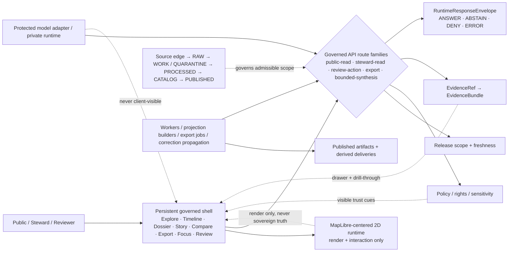

<!-- [KFM_META_BLOCK_V2]
doc_id: kfm://doc/<NEEDS-UUID>
title: Apps Runtime Surfaces
type: standard
version: v1
status: draft
owners: <NEEDS VERIFICATION>
created: <NEEDS VERIFICATION>
updated: 2026-03-19
policy_label: <NEEDS VERIFICATION>
related: [../README.md, ../docs/, ../contracts/, ../policy/, ../infra/]
tags: [kfm, apps, runtime, governance]
notes: [Baseline anchored to the March 2026 replacement-grade KFM master/app/UI/geospatial corpus; exact repo topology, owners, policy label, manifests, commands, and child paths still require direct repository verification before commit.]
[/KFM_META_BLOCK_V2] -->

# Apps Runtime Surfaces

Governed runtime boundary for KFM’s map-first shell, steward overlays, API mediation, and any app-adjacent lanes placed under `apps/`.

**Status:** experimental **(NEEDS VERIFICATION)**  
**Owners:** `<NEEDS VERIFICATION>`  
**Badges:**       
**Quick jump:** [Scope](#scope) · [Repo fit](#repo-fit) · [Accepted inputs](#accepted-inputs) · [Exclusions](#exclusions) · [Directory tree](#directory-tree) · [Quickstart](#quickstart) · [Usage](#usage) · [Runtime diagram](#runtime-diagram) · [Reference tables](#reference-tables) · [Task list](#task-list) · [FAQ](#faq) · [Appendix](#appendix)  
**Repo fit:** `apps/README.md` governs the runtime-facing `apps/` boundary.  
**Upstream links:** [repo root](../README.md) · [docs](../docs/) · [contracts](../contracts/) · [policy](../policy/) · [infra](../infra/) **(all NEEDS VERIFICATION)**  
**Candidate colocated lanes (PROPOSED):** `./explorer-web/` · `./governed-api/` · `./review-console/` · `./workers/` · `./cli/`

> [!IMPORTANT]
> This README is intentionally source-bounded. In the current session, the directly inspectable workspace was a mounted PDF corpus only. No live repo tree, manifests, workflow YAML, schema registry, dashboards, or runtime traces were directly visible. Treat every literal child path, package name, command, owner, and deployment-lane name marked **PROPOSED**, **UNKNOWN**, or **NEEDS VERIFICATION** as a merge-time check.

---

## Scope

`apps/` is where KFM’s trust-visible doctrine becomes runnable product behavior.

This boundary is not just “frontend code.” Across the replacement-grade KFM corpus, app surfaces are part of the evidence chain, part of the trust model, and part of governed publication. The stable thing is therefore not one folder shape; it is the architectural law that every outward surface remains downstream of governed APIs, release scope, evidence resolution, policy mediation, and correction state.

### Surface families this boundary must support

| Surface family | What belongs here | Status |
|---|---|---|
| Public / steward shell lane | Persistent map-first shell carrying Explore, Timeline, Dossier, Story, Compare, Export, and Focus within one trust-visible experience family | **CONFIRMED doctrine / PROPOSED lane** |
| Review / stewardship lane | Role-gated review, denial, approval, rollback, correction, and rights-sensitive operations kept inside the same shell law | **CONFIRMED doctrine / PROPOSED lane** |
| Governed API lane | Surface-facing routes grouped by trust obligation rather than by screen whim | **CONFIRMED need / PROPOSED placement** |
| Worker / workflow lane | Projection builders, export jobs, validation helpers, correction propagation, and app-adjacent orchestration | **CONFIRMED need / PROPOSED placement** |
| CLI / operator lane | Local verification, diagnostics, proof-pack assembly, or narrow operator tooling when it truly belongs beside the runtime lanes | **PROPOSED lane** |
| App-side docs, fixtures, and tests | Child READMEs, route-family docs, acceptance fixtures, accessibility checks, reduced-motion coverage, calm-failure tests, and story/export proofs | **CONFIRMED need / PROPOSED mounted inventory** |

### Stable across the corpus

- **CONFIRMED:** the map and the timeline are coequal operating controls
- **CONFIRMED:** the Evidence Drawer is a mandatory trust object for consequential claims
- **CONFIRMED:** Focus is evidence-bounded and must not drift into a sovereign chatbot pane
- **CONFIRMED:** review is a shell variation, not a detached second truth regime
- **CONFIRMED:** public and ordinary steward surfaces cross governed APIs instead of touching canonical stores or model runtimes directly
- **CONFIRMED:** 2D is the default operating surface; 3D carries an extra burden of justification

### What this README is not

This file is a **boundary document**, not proof that the mounted repo currently contains any specific child directory, router, package manager, workspace tool, DTO set, or deployment shape.

It does **not** prove:

- the literal subtree below `apps/`
- the existence of `explorer-web`, `governed-api`, `review-console`, `workers`, or `cli`
- the current React / routing / bundling stack
- the current contract registry or fixture inventory
- the current CI lanes, health probes, auth stack, or deployment profiles

[Back to top](#apps-runtime-surfaces)

---

## Repo fit

| Field | Value |
|---|---|
| Path | `apps/README.md` |
| Primary role | Boundary README for runtime-facing application surfaces and any colocated operator lanes |
| Doctrinal baseline | March 20, 2026 replacement-grade KFM master design/manual layer |
| Strong supporting sources | KFM MapLibre UI Architecture and Governed Interaction Design; KFM Unified Geospatial Architecture Manual; KFM Components Pass 5; KFM Expanded Working Manual; March 14 replacement-grade canonical reference |
| Current-session evidence limit | Mounted PDF corpus only; no directly visible repo tree, manifests, workflows, or runtime traces |
| Non-negotiable boundary | No client-side bypass of governed APIs, unpublished lifecycle zones, canonical stores, or model runtimes |
| Documentation stance | Boundary-first, topology-second; folder names may change more easily than trust obligations |

### Boundary-first rule

The durable obligation is the law:

1. app surfaces stay downstream of promoted release scope
2. evidence remains drill-through capable at point of use
3. policy and review state stay visible in the outward experience
4. runtime assistance remains subordinate to evidence, policy, and release state
5. exact mounted paths stay **PROPOSED** until the repo tree is directly inspected

### KFM app surfaces are

| KFM app surfaces **are** | Why it matters |
|---|---|
| one governed surface family | prevents “app vs platform” truth drift |
| map-native and time-aware | keeps geography and chronology primary |
| trust-visible | forces freshness, policy, review, and correction state into the user experience |
| release-scoped readers of governed truth | prevents outward screens from outrunning publication discipline |

### KFM app surfaces are **not**

| KFM app surfaces are **not** | Why it is blocked |
|---|---|
| a detached assistant tab | severs map, time, and evidence continuity |
| a second admin product with a different truth model | breaks review-as-shell-variation doctrine |
| direct browser access to canonical storage or model runtimes | violates the trust membrane |
| a shortcut that lets search, graph, tile, summary, or scene layers become sovereign truth | breaks authoritative-versus-derived separation |
| a default spectacle-first 3D shell | conflicts with the corpus’s 2D-first posture |

[Back to top](#apps-runtime-surfaces)

---

## Accepted inputs

Accepted inputs in `apps/` are the ones that make KFM’s governed surfaces buildable **without moving authority into the wrong layer**.

| Accepted input | What belongs here | Status |
|---|---|---|
| Shell composition | Map shell, timeline choreography, dossier/story layout, compare, export, Focus, review, trust chips, and drawer launch points | **CONFIRMED doctrine** |
| Shell continuity state | Selected geography, active time scope, active layers, compare anchors, open panels, deep-link rehydration, saved-view hydration | **CONFIRMED doctrine / PROPOSED mounted store** |
| Trust-visible rendering | Freshness cues, policy chips, review chips, knowledge-character markers, AI badge, correction markers, calm failure states | **CONFIRMED doctrine** |
| App-facing contract consumers | Shell-state contract, Evidence Drawer payload, dossier payload, Focus envelope, layer metadata contract, surface-state registry | **CONFIRMED need / PROPOSED exact files** |
| Route-family consumption | Public-read, steward-read, review-action, export, and bounded-synthesis routes resolved through governed APIs | **CONFIRMED doctrine / PROPOSED mounted mapping** |
| Review overlays | Reviewer queues, diff views, denial/approval actions, rollback visibility, correction workflows, role-gated controls | **CONFIRMED doctrine / PROPOSED mounted realization** |
| App-local tests and fixtures | E2E shell flows, keyboard navigation, reduced-motion behavior, Evidence Drawer drill-through, export-preview trust cues, Focus negative outcomes | **CONFIRMED need / PROPOSED mounted inventory** |
| Colocated API / workers / CLI | Only when the live repo actually places those lanes beneath `apps/` | **NEEDS VERIFICATION** |

### Every serious surface should expect these inputs

| Input class | Why the surface needs it |
|---|---|
| place and geometry scope | prevents detached narrative or dashboard drift |
| time basis | keeps claims tied to a declared chronology |
| release and freshness basis | makes visible whether the surface is current, stale, superseded, or scoped to a past release |
| EvidenceRef / EvidenceBundle handles | keeps consequential claims inspectable rather than citation-shaped |
| policy and rights posture | keeps generalization, withholding, and review requirements visible |
| runtime outcome state | keeps **ANSWER**, **ABSTAIN**, **DENY**, and **ERROR** explicit and testable |

[Back to top](#apps-runtime-surfaces)

---

## Exclusions

`apps/` must not become a shadow source of truth.

| Does **not** belong here | Put it under | Why |
|---|---|---|
| RAW / WORK / QUARANTINE / canonical truth ownership | governed data and lifecycle lanes | surfaces consume approved outputs; they do not own the truth path |
| Contract or schema source of truth | `../contracts/` or equivalent | machine-checkable interfaces should stay centralized and reviewable |
| Policy bundles and decision registries | `../policy/` or equivalent | policy must remain executable and independently governed |
| Shared domain/evidence/policy logic | `../packages/` or equivalent | prevents app-to-app drift and hidden business law in UI code |
| Direct model-runtime exposure | protected runtime boundary behind governed APIs | keeps Focus subordinate to evidence and policy |
| Direct client access to DB or object storage | nowhere in normal public flow | explicit trust-membrane violation |
| Hidden review state | review shell variation and governed review routes | preserves visible accountability and no-hidden-approvals doctrine |
| Default 3D showcase lanes | controlled, burden-bearing route only after 2D trust model is proven | spectacle does not outrank inspectability |
| Business law hidden in scripts or deployment manifests | packages, contracts, policy, or workers | keeps authority seams reviewable |

> [!WARNING]
> Stable anti-patterns remain stable even when folder names are unknown: direct browser-to-store access, detached AI panes, hidden time semantics, decorative evidence, policy-only-in-frontend behavior, silent export stripping, and “temporary” bypasses that become the default path.

[Back to top](#apps-runtime-surfaces)

---

## Directory tree

The live repo tree was **not** mounted in this session. The safest move is to document **topology signals** rather than pretend one verified local shape.

### Variant A — replacement-grade colocated lane shape

```text
apps/
├─ README.md
├─ explorer-web/              # PROPOSED: public + steward shell
├─ governed-api/              # PROPOSED: governed API if colocated here
├─ review-console/            # PROPOSED: reviewer / steward shell variation
├─ workers/                   # PROPOSED: app-adjacent jobs if colocated here
└─ cli/                       # PROPOSED: local/operator tooling if colocated here
```

### Variant B — split surface / service adjustment

```text
apps/
├─ README.md
├─ explorer-web/              # PROPOSED: public + steward shell
└─ review-console/            # PROPOSED: steward shell variation

services/
└─ governed-api/              # PROPOSED: governed API if kept as a sibling root

workers/
└─ ...                        # PROPOSED: projection, export, validation, correction jobs

cli/
└─ ...                        # PROPOSED: local verification / operator tooling
```

> [!NOTE]
> Some older support artifacts in the broader corpus mention a `web/` + `src/` shaped repo inventory. The March 20 replacement-grade manuals instead propose an `apps/` + `packages/` + `contracts/` target shape. Do not collapse that difference away. Verify the live tree before turning either variant into asserted repo fact.

### Expected local README coverage

| Candidate path | Expected role | Status |
|---|---|---|
| `apps/README.md` | boundary README for app/runtime surfaces | **this file** |
| `apps/explorer-web/README.md` | persistent shell, shell continuity, trust-visible UX, map/timeline behavior | **PROPOSED** |
| `apps/review-console/README.md` | reviewer/steward overlays, denial/approval, rollback, correction flows | **PROPOSED** |
| `apps/governed-api/README.md` or `services/governed-api/README.md` | route families, trust obligations, outward payload families | **PROPOSED** |
| `apps/workers/README.md` or `workers/README.md` | worker/job split, proof artifacts, correction propagation | **PROPOSED** |
| `apps/cli/README.md` or `cli/README.md` | operator/local tooling, verification commands, diagnostics | **PROPOSED** |

### How to collapse this section at merge time

1. Inspect the mounted repo tree.
2. Keep only the topology that actually exists.
3. Replace candidate paths with confirmed relative links.
4. Promote any remaining path uncertainty into explicit TODO markers.
5. Delete whichever variant is not real.

[Back to top](#apps-runtime-surfaces)

---

## Quickstart

These commands are **verification-first** and read-only. Run them from the repo root once the real repository is mounted.

```bash
# 1) Capture repo identity and discover likely runtime roots
git rev-parse HEAD 2>/dev/null || true
find . -maxdepth 3 \
  \( -type d \( -name apps -o -name services -o -name workers -o -name cli -o -name web -o -name src \) \) \
  2>/dev/null | sort
```

```bash
# 2) Find README files, manifests, and workspace wiring near runtime surfaces
find . -maxdepth 4 \
  \( -name 'README.md' -o -name 'package.json' -o -name 'pnpm-workspace.yaml' -o -name 'turbo.json' -o -name 'nx.json' -o -name 'pyproject.toml' -o -name 'Dockerfile' \) \
  2>/dev/null | sort
```

```bash
# 3) Search for trust-critical vocabulary that should anchor app/runtime behavior
grep -RInE 'EvidenceBundle|EvidenceRef|Evidence Drawer|RuntimeResponseEnvelope|runtime_response_envelope|Focus|ABSTAIN|DENY|review-action|bounded-synthesis|shell_state|evidence_drawer_payload|dossier_payload' \
  apps services workers cli packages contracts policy docs tests 2>/dev/null | head -n 200
```

```bash
# 4) Locate app-facing tests, fixtures, accessibility checks, and reduced-motion coverage
find apps services workers tests -maxdepth 5 \
  \( -path '*/test*' -o -path '*/tests/*' -o -name '*spec*' -o -name '*e2e*' -o -name '*a11y*' -o -name '*fixture*' \) \
  2>/dev/null | sort
```

> [!NOTE]
> This README intentionally avoids install, dev-server, and deploy commands. The visible workspace did not include the live repo tree or toolchain manifests, so real boot steps should only be added after direct repository inspection.

[Back to top](#apps-runtime-surfaces)

---

## Usage

Treat `apps/` as the place where KFM’s governing law becomes visible product behavior.

### Operating contract

1. App surfaces read through governed APIs only.
2. Consequential claims stay one hop from inspectable evidence.
3. Review and stewardship remain shell variations, not detached admin products.
4. Shell continuity state stays distinct from truth-bearing backend state.
5. Negative states are first-class and must remain visible.
6. The shell stays 2D-first unless a specific 3D burden is explicitly justified.

### State ownership

| State class | Primary owner | Why |
|---|---|---|
| Shell continuity state | Persistent shell store | Preserves geography, time scope, active layers, selected subjects, compare anchors, and panel continuity |
| Ephemeral local interaction state | Local component where harmless | Hover previews, text input drafts, temporary menu state, optimistic but reversible UI affordances |
| Trust-bearing state | Governed APIs and backend registries | Evidence state, policy state, review state, freshness, release truth, and correction lineage must not become browser truth |
| Persisted user products | Governed services | Saved views, export manifests, review tasks, and compare snapshots must rehydrate through current policy and release mediation |
| Forbidden client truth | No browser ownership allowed | Canonical data, unpublished artifacts, policy decisions, promotion state, precise restricted geometry, and model-runtime internals |

### Shell regions worth preserving

| Region | Primary responsibility |
|---|---|
| Top command bar | Search, mode switching, scope badges, saved views, role context, alerts |
| Left rail | Layers, domains, filters, compare controls, story chapter lists, review visibility for authorized roles |
| Map canvas | Primary geography surface, selection anchor, story playback, evidence launch point |
| Bottom timeline rail | Valid-time framing, playback, compare anchors, as-of inspection, visible chronology |
| Right stack | Summary cards, dossier panels, story chapters, Focus pane, review pane, export preview |
| Utility tray | Search results, toasts, diagnostics, help, low-priority utilities that should not displace trust cues |

### Trust-visible cues apps must surface

| Cue | Meaning | Typical placement |
|---|---|---|
| Scope chip | Active place, time, layer, or role boundary | top bar, Focus, compare, export preview |
| Freshness cue | Release age, recency basis, or stale warning | summary cards, dossier, story, Focus, export |
| Policy chip | public-safe, restricted, generalized, redacted, review-required posture | claim headers, layer panels, export preview |
| Review chip | draft, quarantined, reviewed, promoted, current, stale, withdrawn, superseded | dossier, story, review, export |
| Knowledge marker | observed, documentary, derived, modeled, generalized, source-dependent | summaries, compare, dossiers, Focus |
| AI badge | model-assisted synthesis present | Focus and any generated narrative surface |
| Correction marker | replacement, narrowing, correction, supersession, withdrawal | dossier, story, exported artifacts |

> [!TIP]
> The first strong release should not be a broad dashboard set. It should prove one real lane with shell continuity, timeline behavior, Evidence Drawer reachability, dossier/story choreography, Focus finite outcomes, review variation, compare, and export trust cues—while leaving 3D as a later burden-bearing decision.

[Back to top](#apps-runtime-surfaces)

---

## Runtime diagram


```mermaid
flowchart LR
    User[Public / Steward / Reviewer] --> Shell[Persistent governed shell<br/>Explore · Timeline · Dossier · Story · Compare · Export · Focus · Review]

    Shell --> MapRuntime[MapLibre-centered 2D runtime<br/>render + interaction only]
    Shell --> API{Governed API route families<br/>public-read · steward-read · review-action · export · bounded-synthesis}

    API --> Release[Release scope + freshness]
    API --> Policy[Policy / rights / sensitivity]
    API --> Evidence[EvidenceRef → EvidenceBundle]
    API --> Runtime[RuntimeResponseEnvelope<br/>ANSWER · ABSTAIN · DENY · ERROR]

    Canonical[Source edge → RAW → WORK / QUARANTINE → PROCESSED → CATALOG → PUBLISHED] -. governs admissible scope .-> API
    Workers[Workers / projection builders / export jobs / correction propagation] --> Published[Published artifacts + derived deliveries]
    Workers --> API

    Model[Protected model adapter / private runtime] --> API
    Model -. never client-visible .-> Shell

    MapRuntime -. render only, never sovereign truth .-> Shell
    Evidence -. drawer + drill-through .-> Shell
    Policy -. visible trust cues .-> Shell
```

Above: app surfaces sit at the visible trust edge, but remain downstream of release scope, policy mediation, evidence resolution, and protected runtime boundaries. Exact mounted topology remains **UNKNOWN** until the repo tree is directly inspected.

[Back to top](#apps-runtime-surfaces)

---

## Reference tables

### Governed route families and trust obligations

| Route family | What it serves | Boundary note |
|---|---|---|
| Catalog and discovery | release metadata, datasets, distributions, catalog closures, discovery lists | catalog closure and identifier consistency must resolve cleanly |
| Feature or subject read | released authoritative features, place dossiers, claims, detail views | stable subject ID, support/time semantics, rights posture, and release scope are mandatory |
| Map / tile / portrayal | released maps, tiles, legends, styles, and portrayals | must inherit release linkage, policy posture, freshness, and correction state |
| Evidence resolution | `EvidenceRef -> EvidenceBundle` and related trust objects | every bundle must resolve to admissible published scope with visible rights/sensitivity state and audit linkage |
| Story / dossier / compare | narrative and comparison inputs anchored in the same shell | must preserve spatial anchor, temporal anchor, and drill-through to evidence |
| Export and report | public-safe exports, previews, packaged outward artifacts | exports never outrun release state, policy posture, or correction linkage |
| Focus / governed assistance | bounded natural-language investigation over released scope | scope, citations, policy, and audit linkage stay visible in the same pane |
| Review / stewardship | moderation, quarantine inspection, approval, denial, rollback, rights handling | internal governed routes only; no hidden approvals |
| Ops / status | health, status, metrics, traces, audit joins | must not expose raw canonical data or become a second truth surface |

### Contract starter set this boundary still expects

| Artifact | Why it matters first | Status |
|---|---|---|
| Shell-state contract | stabilizes geography / time / mode / compare / selection continuity across surfaces | **CONFIRMED need / PROPOSED artifact** |
| Evidence Drawer payload | keeps provenance, rights, review, freshness, and audit fields out of ad hoc view logic | **CONFIRMED need / PROPOSED artifact** |
| Dossier payload | stabilizes the durable place- or feature-centered decision object | **CONFIRMED need / PROPOSED artifact** |
| Focus envelope | normalizes finite outcomes and evidence linkage for governed synthesis | **CONFIRMED need / PROPOSED artifact** |
| Layer metadata contract | keeps business meaning, policy, freshness, review, and time semantics outside style JSON | **CONFIRMED need / PROPOSED artifact** |
| Surface-state registry | keeps user-visible trust states stable across shell, exports, and runtime | **CONFIRMED need / PROPOSED artifact** |
| Route-family registry | prevents undocumented side routes and makes auth/policy review tractable | **CONFIRMED need / PROPOSED artifact** |

### Runtime outcomes and user-visible trust states

| State / outcome | Meaning | App consequence |
|---|---|---|
| ANSWER | evidence-backed response emitted | show citations, scope echo, audit ref, and trust cues |
| ABSTAIN | support is insufficient for a governed answer | keep shell context, show reason, and offer safe next actions |
| DENY | policy or rights block the request | keep shell context, show reason or obligation code |
| ERROR | technical failure blocked governed handling | calm failure, preserve navigation continuity, expose audit ref where possible |
| GENERALIZED | surface intentionally reduced precision or detail | show explicit generalization cue |
| RESTRICTED | narrower role context required | show role/policy cue, not silent omission |
| STALE | artifact or response exceeds desired freshness basis | show visible stale marker, not silent continuation |
| SUPERSEDED / WITHDRAWN | previously visible item changed lineage or was removed | preserve lineage and reason visibly |

### Verification snapshot

| Item | Current label | What to verify next |
|---|---|---|
| Map-first persistent shell law | **CONFIRMED** | keep aligned with March 2026 master/UI/geospatial corpus |
| Exact `apps/` subtree | **UNKNOWN** | inspect mounted repo tree and manifests |
| Exact child lane names | **PROPOSED** | confirm whether runtime lanes use `explorer-web` / `governed-api` / `review-console` or another shape |
| Contract file inventory | **UNKNOWN** | inspect `contracts/` and fixture directories for shell, drawer, dossier, Focus, and layer metadata artifacts |
| Route inventory and OpenAPI mapping | **UNKNOWN** | surface actual route-family registry or API specs |
| UI acceptance suite | **UNKNOWN** | locate E2E, a11y, reduced-motion, and negative-state tests |
| Hydrology-first thin slice | **CONFIRMED priority / UNKNOWN implementation** | verify one end-to-end release-backed lane through surface and correction |

[Back to top](#apps-runtime-surfaces)

---

## Task list

### Definition of done for this README

- [ ] verify the live `apps/`, `services/`, `workers/`, and `cli/` subtree
- [ ] replace candidate upstream and downstream paths with confirmed relative links
- [ ] confirm whether the governed API is colocated under `apps/` or split into a sibling service root
- [ ] confirm whether any worker or CLI lane truly belongs under `apps/`
- [ ] populate owners, created date, policy label, and final UUID from authoritative repo evidence
- [ ] link the mounted schema/contract inventory for shell state, Evidence Drawer, dossier, Focus, and layer metadata
- [ ] add real boot, lint, test, and verification commands once manifests are directly visible
- [ ] attach actual acceptance-suite references once they are directly inspectable

### Review gates for app-surface changes

- [ ] no client-to-store or client-to-model bypass introduced
- [ ] map / timeline / evidence continuity preserved across surface transitions
- [ ] every consequential claim still reaches Evidence Drawer drill-through
- [ ] Focus still returns accountable negative outcomes when evidence or policy fails
- [ ] review remains a shell variation, not a detached product
- [ ] generalized, restricted, stale, superseded, withdrawn, denied, abstained, and errored states remain visible
- [ ] export preview still preserves trust cues and correction linkage
- [ ] docs, contracts, fixtures, and accessibility checks change together when trust behavior changes

[Back to top](#apps-runtime-surfaces)

---

## FAQ

### Does `apps/` always include the governed API?

No. The corpus is stable on the **boundary behavior**, not on one verified local path. The replacement-grade docs propose a colocated `governed-api` lane, but the live repo may still split API and worker roots.

### Is review a separate product?

No. Review and stewardship are shell variations with stronger role and policy consequences, but they remain inside the same geography, time, evidence, and correction model.

### Can Focus become a general-purpose chatbot pane?

No. Focus inherits scope, depends on governed evidence resolution, and emits finite accountable outcomes instead of unconstrained assistant behavior.

### Can app surfaces read canonical stores directly for performance?

No. Performance layers may accelerate delivery, but public and ordinary steward clients still cross the governed API boundary.

### Why is 3D not the default path here?

Because the March 2026 corpus repeatedly treats 2D as the default public reasoning surface and places 3D behind a burden rubric. Visual depth is not automatically better evidence.

### Why are there still so many placeholders?

Because this README refuses to promote unverified repo facts into doctrine. Owners, UUID, created date, exact child paths, exact commands, and actual manifests require direct repository inspection.

[Back to top](#apps-runtime-surfaces)

---

## Appendix

<details>
<summary><strong>Glossary, merge-time checklist, and maintenance note</strong></summary>

### Compact glossary

- **Trust membrane** — the operational boundary requiring public and ordinary client surfaces to cross governed APIs rather than touching canonical or unpublished internals directly.
- **Evidence Drawer** — the mandatory trust surface that turns visible claims into inspectable support.
- **EvidenceBundle** — the resolved support object behind outward claims, previews, exports, and bounded runtime answers.
- **Focus** — governed, evidence-bounded synthesis over admissible released scope.
- **RuntimeResponseEnvelope / Focus envelope** — the outward runtime object that normalizes finite outcomes and keeps citations, policy, and audit linkage attached.
- **Shell continuity state** — persistent geography, time, layer, mode, selection, and compare context owned by the shell.
- **Trust-bearing state** — evidence, review, release, policy, freshness, and correction semantics owned by governed services rather than by browser convenience.
- **Review shell variation** — steward behavior preserved inside the same shell law rather than split into a detached epistemic system.
- **Thin slice** — one real lane that proves source → validation → release → evidence → surface → correction without trust gaps.

### Merge-time checklist

1. Collapse the directory section to the single local shape actually in use.
2. Replace candidate child paths with confirmed relative links.
3. Populate the KFM meta block from authoritative repo evidence.
4. Link real contract/schema files once directly visible.
5. Add actual workspace commands only after manifest verification.
6. Keep any remaining uncertainty explicit instead of smoothing it into confident prose.

### Maintenance rule

This README should change when any of the following change materially:

- route-family grammar
- shell-state ownership
- Evidence Drawer or Focus contract expectations
- 2D / controlled-3D posture
- export trust-cue behavior
- colocated lane placement under `apps/`

When one of those changes lands, update the README, adjacent child READMEs, and any route/contract registry docs together.

</details>

[Back to top](#apps-runtime-surfaces)
