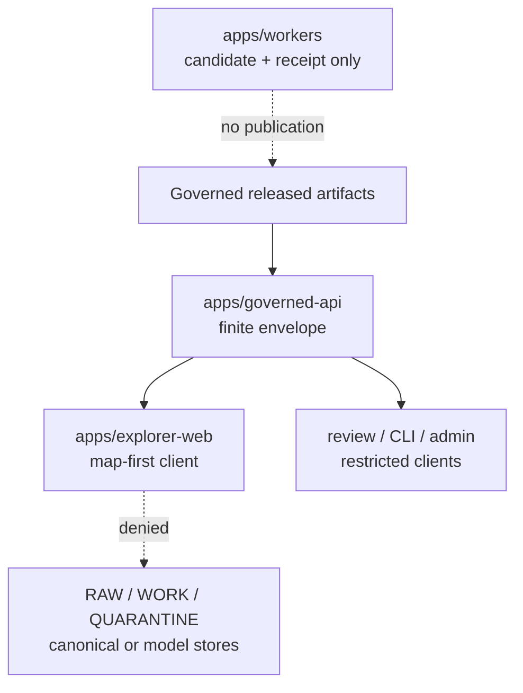

<!-- [KFM_META_BLOCK_V2]
doc_id: kfm://doc/apps-readme
title: apps/ - Deployable Applications
type: root-readme
version: v0.3
status: draft; repository-grounded; mixed-maturity
owners: @bartytime4life
created: 2026-05-10
updated: 2026-07-22
policy_label: public
evidence_snapshot:
  repository: bartytime4life/Kansas-Frontier-Matrix
  ref: main
  commit: 3a5667327e502bae39900646093de13a87f0cd6d
  tracked_app_files: 164
  workflow_model: issue-1531@sha256:289c214b9bbf801db13bfad85dac4e862ae1224bd38ba4fc14361451c839c661
related:
  - ../README.md
  - ../docs/architecture/directory-rules.md
  - ../docs/doctrine/directory-rules.md
  - ../docs/adr/ADR-0004-apps-governed-api-is-the-trust-membrane.md
  - ../docs/adr/ADR-0005-apps-explorer-web-is-the-canonical-map-first-shell.md
  - ../docs/adr/ADR-0006-maplibre-boundary--only-maplibreadapter-imports-maplibre.md
  - ../docs/adr/ADR-0025-public-client-never-reads-canonical-internal-stores.md
  - governed-api/README.md
  - explorer-web/README.md
  - review-console/README.md
  - cli/README.md
  - workers/README.md
  - admin/README.md
  - packages/README.md
  - ../packages/README.md
  - ../runtime/README.md
  - ../data/README.md
  - ../release/README.md
  - ../policy/README.md
  - ../schemas/README.md
  - ../contracts/README.md
  - ../tests/README.md
tags: [kfm, apps, deployables, trust-membrane, governed-api, explorer-web, finite-outcomes, mixed-maturity]
notes:
  - "v0.3 reconciles the apps root contract with the exact main tree at the pinned evidence snapshot."
  - "The Governed API has a bounded executable ABSTAIN slice; the other app lanes remain scaffolded, documentation-led, or unverified as described below."
  - "No application code, route, dependency, workflow, data, policy, release, deployment, or publication behavior changes in this documentation revision."
[/KFM_META_BLOCK_V2] -->

# Deployable Applications

`apps/`

**Canonical home for KFM deployables, with the Governed API as the public trust membrane and every client, worker, operator, and administrative surface constrained by evidence, policy, release, correction, and rollback.**

[Purpose](#purpose) · [Authority](#authority-level) · [Status](#status) · [Belongs](#what-belongs-here) · [Inputs](#inputs) · [Outputs](#outputs) · [Validation](#validation) · [App map](#current-app-map) · [Gaps](#verified-gaps-and-next-work)

> [!IMPORTANT]
> `apps/` is an implementation root, not a truth, schema, contract, policy, lifecycle-data, evidence, proof, receipt, or release authority. A running app, successful request, rendered map, passing test, or generated answer does not promote data or authorize publication.

---

> [!CAUTION]
> Public and semi-public clients use `apps/governed-api/`. They must not read RAW, WORK, QUARANTINE, PROCESSED, candidate, canonical, internal, or direct model-runtime stores. Missing evidence, policy support, or release closure resolves to `ABSTAIN`, `DENY`, or `ERROR`, not invented certainty.

## Purpose

`apps/` owns deployable application composition for Kansas Frontier Matrix. It is where app-local entry points, routes, user interfaces, operator commands, background runners, app-local tests, and deployable wiring belong.

The root has seven current lanes:

- `governed-api/` - bounded public trust membrane;
- `explorer-web/` - map-first public and semi-public client;
- `review-console/` - steward review surface;
- `cli/` - restricted operator command surface;
- `workers/` - non-publishing background runners;
- `admin/` - restricted administrative surface;
- `packages/` - documented drift guard, not a shared-package authority.

## Authority level

**Canonical deployable-application root / implementation-bearing / non-sovereign.**

Directory Rules classifies `apps/` as the home for deployable systems and names `apps/governed-api/` as the public trust path. The same rules reserve shared libraries for `packages/`, runtime adapters for `runtime/`, deployment posture for `infra/`, configuration defaults for `configs/`, and lifecycle/release objects for their own roots.

The root owns deployable composition. It does not own:

- the meaning of an object (`contracts/`);
- its machine-checkable shape (`schemas/`);
- allow, deny, restrict, or abstain decisions (`policy/`);
- canonical lifecycle state (`data/`);
- release, correction, withdrawal, or rollback decisions (`release/`);
- shared reusable implementation (`packages/`);
- model/provider integration exposed directly to clients (`runtime/`);
- source admission or acquisition (`connectors/`);
- pipeline transformation authority (`pipelines/`, `pipeline_specs/`);
- deployment, network, host, or secret authority (`infra/`, external secret stores).

## Status

**Draft / repository-grounded / mixed maturity.**

The current-state claims below are pinned to `main@3a5667327e502bae39900646093de13a87f0cd6d`. They describe tracked repository files, not a deployed system or current production health.

### Evidence boundary

| Claim | Truth | Evidence | Limitation |
|---|---|---|---|
| `apps/` contains 164 tracked files: this README plus 163 files across seven child lanes. | CONFIRMED | Recursive tracked-tree inventory at the pinned commit | Does not inspect ignored files or deployments. |
| Governed API exposes `/bootstrap`, `/layers`, and `/evidence` through a small WSGI application. | CONFIRMED | `governed-api/src/governed_api/main.py` and route registry | All three routes are fail-closed scaffolds, not domain data APIs. |
| Those three routes return schema-checked `ABSTAIN` envelopes with `NOT_IMPLEMENTED`. | CONFIRMED | `governed-api/src/governed_api/stub.py` and `test_abstain_routes.py` | Does not prove `ANSWER`, authorization, evidence resolution, deployment, or load behavior. |
| API boundary tests reject unknown routes, non-GET methods, forbidden runtime imports, and internal-store path literals. | CONFIRMED | `governed-api/tests/test_boundary_guards.py` | Static/bounded tests do not prove network, auth, observability, or production isolation. |
| Explorer Web has 48 TypeScript/TSX files across the app, but its implementation modules are placeholders and its package scripts echo `TODO`. | CONFIRMED | Recursive app inventory and `explorer-web/package.json` | A documented route or feature name is not implemented behavior. |
| Explorer Web build/test CI fails closed until real scripts, an exact pnpm pin, and `pnpm-lock.yaml` exist. | CONFIRMED | `.github/workflows/ui-build.yml` | This is a readiness gate, not proof that the future UI design is accepted. |
| Review Console, CLI, Workers, and Admin are scaffolded or documentation-led. | CONFIRMED | Child manifests, entrypoints, READMEs, and source inventory | No production readiness is claimed. |
| `@bartytime4life` is the current GitHub review route. | CONFIRMED | `.github/CODEOWNERS` default plus explicit Governed API and Explorer routes | CODEOWNERS routing is not proof that review occurred. |
| Deployment, dashboards, audit sinks, live authorization, service health, and public operation are established. | UNKNOWN | No admissible operational evidence in this snapshot | Verify separately from deployed infrastructure and logs. |

### Current app map

| Lane | Tracked files | Current implementation truth | Verified entrypoint or hold | Failure-safe posture |
|---|---:|---|---|---|
| `governed-api/` | 27 | Bounded executable WSGI + three fail-closed routes + two test modules | `make governed-api-dev`; `make governed-api-smoke`; `api-test` | `ABSTAIN`, 404, or 405; no renderer/model/internal-store imports |
| `explorer-web/` | 87 | Source and feature tree present; implementation remains placeholder-only | `ui-build` reports readiness failure until scripts/pin/lock exist | Do not render or claim a functional client |
| `review-console/` | 11 | README-led feature scaffolds plus a minimal package manifest | No accepted build/test command | No review, promotion, correction, or rollback mutation is proven |
| `cli/` | 16 | Python package skeleton; entrypoint and command modules are placeholders | Running the module prints a greenfield placeholder | No operator shortcut is release authority |
| `workers/` | 18 | Eight named worker entrypoints are comment-only placeholders | No accepted worker command, queue, schedule, or test | Watcher-as-non-publisher remains mandatory |
| `admin/` | 2 | README-only app boundary | No executable admin surface | Restricted by default; not a public path |
| `packages/` | 2 | README + `.gitkeep` drift guard | No package or workspace activation | Must not become a shadow of top-level `packages/` |

### Workflow position

```mermaid
flowchart TD
    release["Governed released artifacts"] --> api["apps/governed-api<br/>finite envelope"]
    api --> explorer["apps/explorer-web<br/>map-first client"]
    api --> internal["review / CLI / admin<br/>restricted clients"]
    workers["apps/workers<br/>candidate + receipt only"] -. "no publication" .-> release
    explorer -. "denied" .-> stores["RAW / WORK / QUARANTINE<br/>canonical or model stores"]
```

Only the Governed API's bounded fail-closed slice is currently executable within this diagram. Release assembly, client behavior, internal app mutation, worker execution, and deployment remain held, placeholder, or unverified.

## What belongs here

- App-local source and entry points for a deployable service, web client, console, CLI, worker process, or restricted admin surface.
- App-local route registration and handler composition that consume external contracts and schemas without redefining them.
- App-local UI composition that uses shared packages and governed APIs.
- App-local tests and fixtures whose scope is limited to one deployable.
- App-local non-secret examples and operator notes that do not replace `configs/`, `infra/`, or runbooks.
- Deployable packaging metadata when it does not create a second shared-package, policy, schema, or release authority.

## What does NOT belong here

| Prohibited content | Canonical home | Why |
|---|---|---|
| Reusable libraries | `packages/` | Shared behavior must not be hidden inside one deployable. |
| Runtime/model adapters | `runtime/` | Providers remain subordinate to the Governed API. |
| Contracts and JSON Schemas | `contracts/`, `schemas/` | Meaning and machine shape have separate authority roots. |
| Rego, access rules, or release policy | `policy/` | Apps apply policy; they do not define policy authority. |
| RAW, WORK, QUARANTINE, PROCESSED, catalog, graph, or published objects | `data/` | Lifecycle state never lives in app source. |
| EvidenceBundles, proofs, and receipts | `data/proofs/`, `data/receipts/` | Trust-supporting records require governed homes. |
| Release manifests, decisions, corrections, and rollback cards | `release/` | App actions do not become publication decisions. |
| Source fetchers and admitters | `connectors/` | Availability and acquisition are not app authority. |
| Pipeline logic and declarative specs | `pipelines/`, `pipeline_specs/` | Lifecycle transformations remain outside deployables. |
| Deployment, ingress, firewall, and host definitions | `infra/` | Exposure posture is reviewed separately. |
| Credentials, tokens, private endpoints, signing material, protected payloads | External secret/restricted stores | Git and app source are not quarantine or secret boundaries. |
| Generated build or QA output | `artifacts/` when applicable | Generated output must not accumulate in app source. |

## Inputs

| Input | Owning root | Required posture |
|---|---|---|
| Semantic contracts | `contracts/` | Consumed without redefining meaning in app code |
| Machine schemas and response envelopes | `schemas/` | Validate before trust-bearing render or response |
| Policy decisions and obligations | `policy/` | Unknown or unresolved state fails closed |
| Evidence and citation support | `data/proofs/`, evidence packages | `ANSWER` requires admissible support; otherwise abstain or deny |
| Released public-safe artifacts | `data/published/` through governed access | No direct client read of internal lifecycle stores |
| Release, correction, withdrawal, rollback state | `release/` | Preserve current disposition and invalidation state |
| Reusable implementation | `packages/` | Use stable shared boundaries rather than app-local forks |
| Runtime adapter results | `runtime/` behind the Governed API | Never expose provider or model output directly to a browser |
| Safe configuration defaults | `configs/` | No committed real secrets or private binding |

## Outputs

| Output | Owner/channel | Required guardrail |
|---|---|---|
| Finite runtime response | Governed API response | Exactly one of `ANSWER`, `ABSTAIN`, `DENY`, or `ERROR` |
| Map, drawer, story, compare, or diagnostic render | Explorer Web | Downstream carrier only; never root truth |
| Review or operator proposal | Review Console / CLI | Auditable candidate; no self-approval or publication shortcut |
| Worker candidate or receipt | Governed lifecycle/receipt lane | Non-publishing; no canonical or published-store rewrite |
| Safe logs and metrics | Approved observability channel | No secrets, prompts, protected geometry, raw evidence, or full sensitive payloads |

Apps do not directly emit approved release decisions, authoritative catalog state, or published truth.

## Validation

### Repository-native checks

| Command | Current role | What it proves | What it does not prove |
|---|---|---|---|
| `make governed-api-smoke` | Governed API route/envelope tests | Three registered routes fail closed and validate against the bounded schema subset | Production auth, evidence resolution, network policy, load, or deployment |
| `make governed-api-verify` | API tests plus import boundary | Governed API avoids renderer and direct model clients | Browser, network, or runtime process isolation |
| `make boundary-guards` | Cross-root public-boundary tests | No internal-store literals in Explorer/API and connectors/pipelines remain non-publishers | Complete data-flow or information-flow proof |
| `make validate` | Aggregate schema/contract baseline | Configured schema fixtures and schema/contract tests pass | App build, E2E, policy engine, release, or deployment readiness |
| `.github/workflows/api-test.yml` | CI wrapper around API tests | Repeats bounded API checks in GitHub Actions | Acceptance, deployment, or release approval |
| `.github/workflows/ui-build.yml` | Fail-closed UI readiness gate | Refuses placeholder scripts, missing exact pnpm pin, or missing lockfile | A usable or accepted Explorer implementation |

### Required negative cases for material app changes

- unknown route and unsupported method;
- missing evidence, unresolved policy, unavailable release, and stale/corrected support;
- internal-store path, direct browser-to-model, renderer-boundary, and worker-publication bypass;
- protected detail in `DENY` or `ERROR` output;
- secret, prompt, protected geometry, or raw evidence in logs and diagnostics;
- CLI/admin/review action that attempts to bypass independent review, correction, or rollback.

### Documentation checks

For README-only changes, also require:

- one H1, balanced KFM meta block, code fences, HTML tags, and details blocks;
- unique generated heading anchors and resolved repository-relative links;
- inventory counts reconciled to the pinned tree;
- no unsupported status, owner, workflow, route, CI, deployment, or release claim;
- generated-work receipt whose artifact hash matches the final README.

## Review burden

Current GitHub review routing is `@bartytime4life` through the default `CODEOWNERS` rule, with explicit routes for `apps/governed-api/` and `apps/explorer-web/`.

Material changes also require review appropriate to their effect:

| Change | Review concern |
|---|---|
| Governed API route or response | API boundary, schema/contract, policy, evidence, security |
| Explorer Web data path or renderer | UI, accessibility, adapter boundary, public trust membrane |
| Review Console, CLI, or Admin mutation | authorization, audit, separation of duties, rollback |
| Worker write target or schedule | non-publisher invariant, idempotency, receipts, failure recovery |
| Dependency, lockfile, build, or deploy change | supply chain, reproducibility, network/exposure posture |

Governance role names are not executable GitHub identities. CODEOWNERS routing is not proof of approval, and no app change may approve its own policy, promotion, release, or publication effect.

## Related folders

| Folder | Relationship |
|---|---|
| [`packages/`](../packages/README.md) | Shared reusable implementation consumed by deployables |
| [`runtime/`](../runtime/README.md) | Provider-neutral and provider-specific runtime adapters behind the API |
| [`contracts/`](../contracts/README.md) | Semantic meaning consumed by apps |
| [`schemas/`](../schemas/README.md) | Machine-checkable shapes and envelopes |
| [`policy/`](../policy/README.md) | Access, rights, sensitivity, and release decisions |
| [`data/`](../data/README.md) | Lifecycle data, registries, receipts, proofs, and published artifacts |
| [`release/`](../release/README.md) | Release, correction, withdrawal, and rollback decisions |
| [`tests/`](../tests/README.md) | Cross-app and trust-boundary proof |
| [`configs/`](../configs/README.md) | Safe non-secret defaults and templates |
| [`infra/`](../infra/README.md) | Deployment, host, network, and exposure posture |
| [`.github/workflows/`](../.github/workflows/README.md) | CI and readiness checks; never publication authority |

## ADRs

No app-related ADR inspected for this revision is accepted authority for changing root placement or public behavior. They remain proposed or draft and are useful as design lineage only:

| ADR | Repository status | Relationship |
|---|---|---|
| [`ADR-0004`](../docs/adr/ADR-0004-apps-governed-api-is-the-trust-membrane.md) | Proposed decision / draft document | Describes Governed API as the trust membrane |
| [`ADR-0005`](../docs/adr/ADR-0005-apps-explorer-web-is-the-canonical-map-first-shell.md) | Proposed | Describes Explorer Web as the canonical map-first shell |
| [`ADR-0006`](../docs/adr/ADR-0006-maplibre-boundary--only-maplibreadapter-imports-maplibre.md) | Proposed decision / draft document | Describes the renderer adapter boundary |
| [`ADR-0019`](../docs/adr/ADR-0019-ai-adapter-contract-and-finite-envelopes.md) | Proposed decision / draft document | Describes provider-neutral adapters and finite envelopes |
| [`ADR-0025`](../docs/adr/ADR-0025-public-client-never-reads-canonical-internal-stores.md) | Proposed decision / draft document | Describes the no-direct-store public-client invariant |

Directory Rules and current repository evidence control this README's placement and current-state claims. Proposed ADR language does not upgrade a scaffold to implemented behavior.

## Last reviewed

**2026-07-22**, against `main@3a5667327e502bae39900646093de13a87f0cd6d`.

Re-review after any app-lane creation/removal, public-route change, package-manager/lockfile change, runtime/provider integration, worker write-target change, deployment exposure change, or default-branch change that invalidates the evidence snapshot.

## Verified gaps and next work

| Gap | Truth | Work status | Disposition | Dependency-safe next step |
|---|---|---|---|---|
| Explorer Web has no real build/test/runtime slice | CONFIRMED | TRIAGED | DEFERRED | Implement one bounded shell slice with exact dependency pin, lockfile, unit/negative tests, and governed client boundary; do not green an empty build |
| Review Console has no executable review flow | CONFIRMED | TRIAGED | DEFERRED | Establish accepted review record/authorization/audit contract before mutating UI |
| CLI commands and Workers are placeholders | CONFIRMED | TRIAGED | DEFERRED | Select one no-network dry-run command or non-publishing worker with fixtures and receipts |
| Admin has no executable surface | CONFIRMED | TRIAGED | INTENTIONAL_ABSENCE for now | Keep restricted and absent until a verified need, auth model, audit path, and break-glass policy exist |
| Governed API supports only fail-closed stubs | CONFIRMED | TRIAGED | DEFERRED | Add an evidence-resolving route only after its contract, policy, fixtures, and released public-safe input are ready |
| App deployment and observability are unproved | UNKNOWN | DISCOVERED | DEFERRED | Verify from deployed infrastructure, logs, health checks, and audit sinks; repository prose is insufficient |

## Safe change pattern

1. Pin the base commit and inspect the target app, parent README, related contracts/schemas/policy/tests, and open work.
2. Identify the app's exact input, output, finite failure state, public/internal boundary, and rollback.
3. Keep shared code, runtime adapters, policy, schemas, contracts, lifecycle objects, receipts/proofs, releases, and infra in their owning roots.
4. Add targeted positive and negative tests before upgrading maturity claims.
5. Run the app-specific command, boundary guards, and safe broader validation.
6. Record exact evidence and limitations; a workflow hold is not a pass, and a passing test is not release approval.
7. Deliver through a scoped branch and draft PR. Do not merge, deploy, promote, release, or publish as part of routine app development.

## Root definition of done

The root is not "complete" while child lanes are placeholders. For a declared app scope, done means:

- the owner, entrypoint, inputs, outputs, dependencies, finite failure states, and rollback are explicit;
- public traffic crosses the Governed API and cannot access internal lifecycle or model stores;
- schema, contract, policy, evidence, rights, sensitivity, release, correction, and rollback obligations are enforced where applicable;
- positive, negative, boundary, accessibility, build, and integration checks appropriate to the slice pass;
- dependencies and build inputs are reproducibly pinned;
- logs, metrics, errors, and diagnostics are public-safe and secret-safe;
- documentation describes the verified implementation without promoting proposals or scaffolds;
- review remains independent from release, publication, and merge authority.

---

> **Current conclusion:** `apps/` is correctly placed but not uniformly implemented. The Governed API provides a small, testable fail-closed boundary. Explorer Web, Review Console, CLI, Workers, and Admin require separate dependency-ready implementation batches; `apps/packages/` remains a drift guard. Preserve those distinctions instead of flattening the root into a false green state.

<a href="#top">Back to top</a>

