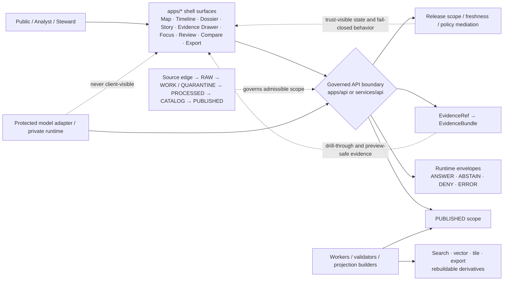

<!-- [KFM_META_BLOCK_V2]
doc_id: kfm://doc/<NEEDS-UUID>
title: Apps Runtime Surfaces
type: standard
version: v1
status: draft
owners: <NEEDS VERIFICATION>
created: <NEEDS VERIFICATION>
updated: 2026-03-19
policy_label: <NEEDS VERIFICATION>
related: [../README.md, ../docs/, ../contracts/, ../policy/, ../infra/]
tags: [kfm, apps, runtime, governance]
notes: [Primary doctrinal basis is the mounted March 17-19 KFM app/UI/testing/master corpus; live repo topology, owners, exact local links, manifests, commands, and deployable lane names still require direct repository verification before commit.]
[/KFM_META_BLOCK_V2] -->

# Apps Runtime Surfaces

Governed application surfaces for KFM’s map-native shell, trust-visible UX, and any colocated runtime lanes under `apps/`.

**Status:** experimental **(NEEDS VERIFICATION)**  
**Owners:** `<NEEDS VERIFICATION>`  
**Badges:**       
**Quick jump:** [Scope](#scope) · [Repo fit](#repo-fit) · [Accepted inputs](#accepted-inputs) · [Exclusions](#exclusions) · [Directory tree](#directory-tree) · [Quickstart](#quickstart) · [Usage](#usage) · [Runtime diagram](#runtime-diagram) · [Reference tables](#reference-tables) · [Task list](#task-list) · [FAQ](#faq) · [Appendix](#appendix)  
**Repo fit:** `apps/README.md` governing `apps/`  
**Upstream links (NEEDS VERIFICATION):** [../README.md](../README.md) · [../docs/](../docs/) · [../contracts/](../contracts/) · [../policy/](../policy/) · [../infra/](../infra/)  
**Likely downstream lanes (NEEDS VERIFICATION):** [./web/](./web/) · [./review/](./review/) · [./api/](./api/) · [./workers/](./workers/)

> [!IMPORTANT]
> This README is source-bounded. The current session exposed a mounted PDF corpus only. No repository checkout, schema registry, workflow inventory, manifests, tests, dashboards, or runtime logs were directly visible. Treat every literal subpath, owner, boot command, lane name, and child README link marked **PROPOSED**, **UNKNOWN**, or **NEEDS VERIFICATION** as a merge-time review item.

---

## Scope

`apps/` is the runtime-facing boundary where KFM’s governed product surfaces become deployable application lanes.

Across the mounted March 2026 corpus, the application layer is not treated as decorative frontend code. It is part of KFM’s evidence chain, part of the trust model, and part of governed publication. The stable architectural obligation is therefore stronger than any single folder layout: app surfaces stay downstream of governed APIs, policy mediation, evidence resolution, review state, and release state.

### Surface families this boundary must support

| Family | What belongs here | Status |
|---|---|---|
| Public shell app | Map-first shell for explore, dossier, story, evidence, compare, export, and public-safe Focus | **CONFIRMED doctrine / PROPOSED unit** |
| Expert shell variation | Richer compare, filtering, and inspection over the same shell substrate | **CONFIRMED doctrine / PROPOSED unit** |
| Steward / review variation | Role-gated overlays, diff/review state, rollback visibility, rights/sensitivity handling | **CONFIRMED doctrine / PROPOSED unit** |
| Governed API surface | Surface-facing mediation for release scope, evidence, policy, runtime envelopes, and trust-visible state | **CONFIRMED need / PROPOSED mounted topology** |
| Worker apps and workflow services | Source watchers, validators, promotion helpers, export workers, artifact assemblers, policy evaluators | **CONFIRMED need / PROPOSED mounted units** |
| Model/runtime support components | Provider-neutral model adapter, local/private runtime, retrieval accelerators, audit join points | **CONFIRMED doctrine / PROPOSED mounted runtime** |
| Shared packages | Contracts, registries, UI primitives, map/time components, policy vocabularies, proof-object definitions | **CONFIRMED need / PROPOSED exact inventory** |
| Documentation and proof surfaces | Surface doctrine, acceptance tests, proof packs, release notes, correction notices | **CONFIRMED need / PROPOSED exact artifacts** |

### Stable across the corpus

- **CONFIRMED:** the map is the operating center and timeline is coequal with place  
- **CONFIRMED:** the Evidence Drawer is a mandatory trust object for consequential claims  
- **CONFIRMED:** Focus is evidence-bounded and must not become a sovereign chatbot pane  
- **CONFIRMED:** review and stewardship remain shell variations, not a detached second truth regime  
- **CONFIRMED:** 2D is the default operating surface; 3D is conditional and burden-bearing  
- **CONFIRMED:** public and ordinary client surfaces cross governed APIs rather than canonical stores or model runtimes directly

### What this README is not

This file is a boundary document, not proof that the mounted repo currently contains any particular child directory, route tree, DTO set, package graph, or deployment layout.

It does **not** prove:

- the literal subtree beneath `apps/`
- the existence of `apps/web`, `apps/review`, `apps/api`, or `apps/workers`
- the current frontend stack, router, package manager, or workspace tool
- the current payload inventory, schema registry, or acceptance suite
- the current runtime topology, bind/auth posture, or deploy profile

[Back to top](#apps-runtime-surfaces)

---

## Repo fit

| Field | Value |
|---|---|
| Path | `apps/README.md` |
| Primary role | Boundary doc for deployable app surfaces and any colocated runtime lanes |
| Freshest direct authority | March 19, 2026 app-surface refined reference |
| Strong supporting overlays | March 18 master reissue; March 17 testing/verification; March 17 UI/UX reference; March 19 configuration/contract/tooling/policy refinements |
| Stable upstream dependencies | Contracts, schemas, policy, release scope, evidence resolution, shared packages, runtime boundary controls **(local paths NEED VERIFICATION)** |
| Stable downstream consumers | Public users, classroom/civic readers, analysts, reviewers/stewards, operators |
| Non-negotiable boundary | No client-side bypass of governed APIs, canonical stores, unpublished artifacts, or model runtimes |
| Current-session evidence | Mounted PDFs under `/mnt/data`; no directly visible repo tree or runtime artifacts |

### Dependency rule

This README is **boundary-first**, not topology-first.

That means the stable thing is the law:

1. app surfaces stay downstream of promoted release scope
2. evidence remains drill-through capable
3. policy and review stay visible at the point of use
4. runtime assistance stays subordinate to evidence and release state
5. exact folder names may move more easily than those obligations do

### KFM app surfaces are

| KFM app surfaces **are** | Why it matters |
|---|---|
| one governed system of shells, APIs, workers, packages, and proof-bearing artifacts | prevents “frontend vs platform” truth drift |
| map-native, time-aware surfaces | keeps geography and chronology primary |
| trust-visible products | makes freshness, policy, review, and correction state inspectable |
| release-scoped readers of governed truth | prevents public surfaces from outrunning publication discipline |

### KFM app surfaces are **not**

| KFM app surfaces are **not** | Why it is blocked |
|---|---|
| a detached chatbot tab | severs map/time/evidence context |
| a second admin product with a different truth model | breaks review-as-shell-variation doctrine |
| direct browser access to canonical stores or model runtimes | violates the trust membrane |
| a shortcut that lets graph/search/vector/tile/summary layers become sovereign truth | breaks authoritative-versus-derived separation |

[Back to top](#apps-runtime-surfaces)

---

## Accepted inputs

Accepted inputs in `apps/` are the ones that make KFM’s governed surfaces buildable without shifting authority into the wrong layer.

| Accepted input | What belongs here | Status |
|---|---|---|
| Shell composition | Map shell, timeline choreography, dossier/story layout, Evidence Drawer, Focus, compare, export | **CONFIRMED doctrine** |
| Shell continuity state | Place, time, mode, compare anchors, selected object, layer state | **CONFIRMED doctrine** |
| Trust-visible cues | Freshness, policy, review, modeled/observed/generalized state, correction visibility, AI participation markers | **CONFIRMED doctrine** |
| App-facing payload consumers | Summary payloads, Evidence Drawer payloads, dossier payloads, story payloads, Focus envelopes | **CONFIRMED need / PROPOSED mounted schemas** |
| Role-gated overlays | Reviewer/steward drawers, diffs, denial/approval actions, rollback visibility | **CONFIRMED doctrine / PROPOSED mounted realization** |
| App-local tests and fixtures | Evidence Drawer drill-through tests, accessibility checks, negative-state fixtures, export-safety checks | **CONFIRMED need / PROPOSED mounted artifacts** |
| App-local docs and runbooks | Child READMEs, acceptance notes, trust-behavior docs, bring-up notes | **CONFIRMED need / PROPOSED mounted artifacts** |
| Colocated API or worker lanes | Only if the live repo truly nests those lanes under `apps/` | **NEEDS VERIFICATION** |

### Every serious surface should expect these inputs

| Input class | Why the surface needs it |
|---|---|
| place/time scope | prevents detached narrative or dashboard drift |
| release and freshness basis | keeps visible state honest |
| EvidenceRef / EvidenceBundle-style support handles | keeps consequential claims drill-through capable |
| policy labels and exposure posture | keeps rights/sensitivity visible |
| runtime outcome and surface-state markers | makes generalized, stale, denied, withheld, superseded, or errored behavior explicit |

[Back to top](#apps-runtime-surfaces)

---

## Exclusions

`apps/` must not become a shadow source of truth.

| Does **not** belong here | Put it under | Why |
|---|---|---|
| RAW / WORK / QUARANTINE / canonical truth ownership | governed data and processing lanes | surfaces consume approved outputs; they do not own the truth path |
| Contract or schema source of truth | `../contracts/` or equivalent | keeps machine-checkable interfaces centralized |
| Policy bundles and decision registries | `../policy/` or equivalent | policy must remain centrally reviewable and executable |
| Shared reusable domain/evidence/policy logic | `../packages/` or equivalent | prevents app-to-app drift |
| Direct model-runtime exposure | protected runtime boundary behind governed APIs | keeps Focus subordinate to evidence and policy |
| Direct client access to DB or object storage | nowhere in normal public flow | explicit trust-membrane violation |
| Detached admin product | same shell substrate with role-gated overlays | review must preserve geography, time, and evidence continuity |
| Default 3D spectacle shell | conditional lane only after 2D trust model is proven | the corpus treats 3D as burden-bearing, not default |

> [!WARNING]
> Stable anti-patterns remain stable even when folder names are not: detached AI tabs, hidden time semantics, decorative evidence, policy-only-in-frontend behavior, silent export stripping, detached admin products, and default spectacle-first 3D.

[Back to top](#apps-runtime-surfaces)

---

## Directory tree

The live repo tree was **not** mounted in the current session. The safest approach is to document topology **signals** rather than pretend one verified local shape.

### Variant A — colocated app-first shape

```text
apps/
├─ README.md                  # this boundary document
├─ web/                       # PROPOSED: public shell
├─ review/                    # PROPOSED: steward / reviewer shell variation
├─ api/                       # PROPOSED: governed API if colocated here
└─ workers/                   # PROPOSED: app-adjacent workers if colocated here
```

### Variant B — split surface/service shape

```text
apps/
├─ README.md                  # this boundary document
├─ web/                       # PROPOSED: public shell
└─ review/                    # PROPOSED: steward shell variation

services/
├─ api/                       # PROPOSED: governed API boundary
├─ evidence/                  # PROPOSED: evidence-resolution support
└─ release/                   # PROPOSED: release / publication services

workers/
├─ connectors/                # PROPOSED: intake watchers
├─ validation/                # PROPOSED: validation / policy jobs
└─ projections/               # PROPOSED: derived delivery builders
```

### Expected local README coverage

| Candidate path | Expected role | Status |
|---|---|---|
| `apps/README.md` | boundary doc for app/runtime surfaces | **this file** |
| `apps/web/README.md` | public shell, shell-state, trust-visible UX, accessibility posture | **PROPOSED** |
| `apps/review/README.md` | reviewer/steward overlays and decision surfaces | **PROPOSED** |
| `apps/api/README.md` or `services/api/README.md` | governed API boundary, route families, trust obligations | **PROPOSED** |
| `apps/workers/README.md` or `workers/README.md` | worker/service split and app-adjacent jobs | **PROPOSED** |

### How to collapse this section at merge time

1. Inspect the mounted repo tree.
2. Keep only the topology actually in use.
3. Replace candidate links with confirmed relative paths.
4. Add child READMEs only where directories truly exist.
5. Delete whichever variant is not real.

[Back to top](#apps-runtime-surfaces)

---

## Quickstart

These commands are **verification-first** and read-only. Run them from the repo root after the real repository is mounted.

```bash
# 1) Discover whether the repo uses an apps-only shape or a split apps/services/workers shape
find . -maxdepth 2 \
  \( -name apps -o -name services -o -name workers \) \
  -type d | sort
```

```bash
# 2) Find likely app-adjacent manifests, READMEs, and workspace files
find . -maxdepth 3 \
  \( -name 'README.md' -o -name 'package.json' -o -name 'pnpm-workspace.yaml' -o -name 'turbo.json' -o -name 'nx.json' -o -name 'pyproject.toml' -o -name 'Cargo.toml' -o -name 'Dockerfile' \) \
  2>/dev/null | sort
```

```bash
# 3) Locate trust-critical vocabulary near app surfaces
grep -RInE 'EvidenceBundle|EvidenceRef|Evidence Drawer|Focus|runtime_response_envelope|review|stale-visible|generalized|governed API|ABSTAIN|DENY' \
  apps services workers packages contracts policy docs 2>/dev/null | head -n 200
```

```bash
# 4) Find app-facing tests, fixtures, and accessibility checks
find apps services workers tests -maxdepth 4 \
  \( -path '*/test*' -o -path '*/tests/*' -o -name '*spec*' -o -name '*e2e*' -o -name '*a11y*' \) \
  2>/dev/null | sort
```

> [!NOTE]
> This README intentionally avoids package-manager install commands and runtime boot steps. The current session did not verify the mounted repo tree, manifests, or toolchain, so real bring-up commands should only be added after direct repo inspection.

[Back to top](#apps-runtime-surfaces)

---

## Usage

Treat `apps/` as the place where KFM’s governing law becomes visible product behavior.

### Operating contract

1. **CONFIRMED:** app surfaces read through governed APIs only.  
2. **CONFIRMED:** consequential claims must expose an evidence path, not merely a citation string.  
3. **CONFIRMED:** review and stewardship remain shell variations over the same truth model.  
4. **CONFIRMED:** negative states are first-class and must stay visible.  
5. **CONFIRMED:** shell continuity state stays distinct from backend-owned trust state.  
6. **CONFIRMED:** 2D is the stable default shell; 3D must justify its extra governance burden.  

### State ownership

| State class | Primary owner | Why |
|---|---|---|
| Shell continuity state | Persistent shell | Preserves place, time, mode, compare, and selection continuity across surfaces |
| Ephemeral local interaction state | Local component where harmless | Hover previews, temporary edits, open/close flags, unsaved input |
| Evidence / policy / review / freshness state | Governed API payloads and backend services | These are trust-bearing states and must not become UI truth by convenience |
| Saved-view state | Persisted governed service with shell rehydration | Must re-filter against current policy and current release on load |
| Runtime answer outcome state | `runtime_response_envelope` from governed API | Keeps Answer / Abstain / Deny / Error stable and auditable |

### Trust-visible cues apps must surface

| Cue | Meaning | Typical placement |
|---|---|---|
| Scope chip | Active place/time/layer/role scope | top bar, Focus, compare, export summary |
| Freshness cue | Release age or recency basis | summary, dossier, story, Focus, export |
| Policy chip | Exposure or sensitivity posture | any element whose visibility changes by policy |
| Review chip | draft / reviewed / promoted / withdrawn / superseded / stale | dossier, story, review, export |
| Knowledge-character marker | observed / documentary / derived / modeled / generalized / source-dependent | summaries, compare, dossiers, story claims, Focus |
| AI badge | model-assisted synthesis present | Focus and generated narrative surfaces |
| Correction marker | lineage or correction state | replacements, superseded claims, withdrawals |

> [!TIP]
> The first governed release should not be a home dashboard. It should prove persistent shell continuity, map selection, timeline inspection, Evidence Drawer reachability, dossier, story choreography, Focus outcomes, review variation, compare, and export/share on one real lane—**with 3D deferred until the 2D slice proves itself**.

[Back to top](#apps-runtime-surfaces)

---

## Runtime diagram


```mermaid
flowchart LR
    User[Public / Analyst / Steward] --> Shell[apps/* shell surfaces<br/>Map · Timeline · Dossier · Story · Evidence Drawer · Focus · Review · Compare · Export]

    Shell --> API{Governed API boundary<br/>apps/api or services/api}

    API --> Release[Release scope / freshness / policy mediation]
    API --> Resolver[EvidenceRef → EvidenceBundle]
    API --> Runtime[Runtime envelopes<br/>ANSWER · ABSTAIN · DENY · ERROR]
    API --> Published[PUBLISHED scope]

    Workers[Workers / validators / projection builders] --> Published
    Workers --> Derived[Search · vector · tile · export<br/>rebuildable derivatives]

    Canonical[Source edge → RAW → WORK / QUARANTINE → PROCESSED → CATALOG → PUBLISHED]
    Canonical -. governs admissible scope .-> API

    Model[Protected model adapter / private runtime] --> API
    Model -. never client-visible .-> Shell

    Resolver -. drill-through and preview-safe evidence .-> Shell
    Release -. trust-visible state and fail-closed behavior .-> Shell
```

Above: app surfaces sit at the visible trust edge, but remain downstream of release scope, evidence resolution, policy mediation, and protected runtime boundaries. Exact mounted topology is still **UNKNOWN**.

[Back to top](#apps-runtime-surfaces)

---

## Reference tables

### Governed route families and likely outward profiles

| Route family | What it serves | Likely outward profile | Boundary note |
|---|---|---|---|
| Selection and summary | map/list selections resolving into summary cards and right-stack context | project DTOs | stable identity, safe preview, release-scope filtering |
| Timeline and compare | valid-time queries, as-of inspection, compare anchors, playback | project DTOs or governed query routes | time-channel clarity and compare-safe asymmetry handling |
| Evidence resolution | Evidence Drawer open, citation resolution, preview-safe provenance | EvidenceBundle-style project DTOs | rights/sensitivity, preview safety, audit linkage |
| Map / tile / portrayal | released maps, tiles, legends, style-linked portrayal objects | likely OGC API Maps / Tiles or governed static routes | exact mounted standards profile **UNKNOWN** |
| Story and dossier | durable analytical views and chapter-aware narrative state | project-native governed DTOs | evidence linkage, freshness, correction visibility |
| Focus ask | scoped question handling and runtime envelope | project-native `runtime_response_envelope` | never a raw model endpoint |
| Review / promotion / correction | role-gated review actions, diffs, rollback visibility | internal-only governed APIs | exact tree **UNKNOWN** |
| Export / share / saved views | outward artifacts and persisted views | project-native governed DTOs and manifests | must preserve trust cues on output |

### Components that must remain behind the trust membrane

| Component family | Why it stays behind the membrane |
|---|---|
| Canonical stores and unpublished lifecycle zones | public surfaces must not read RAW / WORK / QUARANTINE / unreleased processed artifacts directly |
| Evidence resolver internals, review-state machinery, promotion/correction services, policy evaluators | these enforce trust-bearing behavior and review law |
| Model runtime processes and provider adapters | Focus and similar surfaces must stay behind governed APIs |
| Internal review overlays, precise restricted geometry, internal-only trust metadata | these are role-restricted by policy and safety posture |
| Derived-layer rebuild services for unreleased or role-restricted outputs | rebuild systems are not public truth boundaries |

### First-wave artifacts this boundary still expects

| Artifact | Why it matters first | Status |
|---|---|---|
| Shell-state contract | stabilizes place/time/mode/compare/selection continuity across shell modes | **PROPOSED artifact / CONFIRMED need** |
| Evidence Drawer payload schema | prevents trust-critical provenance fields from devolving into ad hoc UI logic | **PROPOSED artifact / CONFIRMED need** |
| Dossier payload schema | stabilizes the durable decision object | **PROPOSED artifact / CONFIRMED need** |
| Focus request + `runtime_response_envelope` | normalizes Answer / Abstain / Deny / Error and audit context | **PROPOSED artifact / CONFIRMED need** |
| Route-family inventory | prevents undocumented side routes and route drift | **PROPOSED artifact / CONFIRMED need** |
| Layer metadata truth/policy chips | keeps observed / modeled / generalized / restricted / freshness cues stable | **PROPOSED artifact / CONFIRMED need** |
| Thin-slice acceptance test pack | proves shell continuity, evidence resolution, negative states, and export trust behavior | **PROPOSED artifact / CONFIRMED need** |
| Implementation evidence baseline | exposes repo tree, manifests, schemas, workflows, and sample proofs so docs can stop guessing | **PROPOSED artifact / CONFIRMED need** |

### Verification snapshot

| Item | Current label | What to verify next |
|---|---|---|
| App family doctrine | **CONFIRMED** | keep aligned with March 17-19 UI/app/testing corpus |
| Exact `apps/` subtree | **UNKNOWN** | inspect mounted repo and manifests |
| Route inventory and payloads | **UNKNOWN** | surface route-family inventory plus schemas/examples |
| Evidence Drawer resolver path | **PROPOSED / CONFIRMED need** | publish resolver routes or contract package |
| `runtime_response_envelope` implementation | **PROPOSED / CONFIRMED need** | publish example envelopes and API tests |
| UI acceptance suite | **UNKNOWN** | surface Evidence Drawer, accessibility, negative-state, and export-safety tests |
| Hydrology thin slice | **CONFIRMED priority / UNKNOWN implementation** | prove one end-to-end governed lane |

[Back to top](#apps-runtime-surfaces)

---

## Task list

### Definition of done for this README

- [ ] verify the live `apps/`, `services/`, and `workers/` subtree
- [ ] replace candidate upstream/downstream links with real mounted paths
- [ ] confirm whether governed API surfaces are colocated under `apps/` or split into sibling service roots
- [ ] confirm whether any worker or workflow lane truly belongs under `apps/`
- [ ] populate owners, created date, policy label, and final UUID from authoritative repo evidence
- [ ] add real boot, lint, test, and dev commands for the mounted app stack
- [ ] link the mounted schema/contract inventory for shell state, Evidence Drawer, dossier, and runtime envelopes
- [ ] attach route inventory and acceptance-suite references once directly visible

### Review gates for app-surface changes

- [ ] no client-to-store or client-to-model bypass introduced
- [ ] map/time/evidence continuity preserved across shell states
- [ ] every consequential claim still reaches Evidence Drawer drill-through
- [ ] Focus still returns accountable negative outcomes when evidence or policy fails
- [ ] review/stewardship remains a shell variation, not a detached product
- [ ] generalized, stale, withheld, withdrawn, superseded, and errored states remain visible
- [ ] docs, contracts, examples, and accessibility checks changed together when trust behavior changed

[Back to top](#apps-runtime-surfaces)

---

## FAQ

### Does `apps/` always include the governed API?

No. The corpus is stable on the **boundary**, not on one verified local path. Some overlays describe governed APIs as colocated app-adjacent surfaces; others leave exact placement open until the mounted repo is inspected.

### Is review a separate product?

No. Review and stewardship are shell variations with stronger role and policy consequences, but they stay inside the same geography/time/evidence model.

### Can Focus live as a general-purpose chatbot pane?

No. Focus stays inside the shell, inherits scope, depends on governed evidence resolution, and emits accountable outcomes rather than free-form assistant behavior.

### Can app surfaces read canonical stores directly for performance?

No. Performance layers may optimize delivery, but public and ordinary client surfaces still cross the governed API boundary.

### Why is 3D not the default path here?

Because the mounted corpus repeatedly treats 2D as the default public reasoning surface and makes 3D conditional on additional analytical value and additional governance readiness.

[Back to top](#apps-runtime-surfaces)

---

## Appendix

<details>
<summary><strong>Glossary, topology note, and merge-time checklist</strong></summary>

### Compact glossary

- **Trust membrane** — the rule that public and ordinary client surfaces cross governed APIs instead of reaching internal stores or runtimes directly.
- **Evidence Drawer** — the mandatory trust object that turns visible claims into inspectable support.
- **EvidenceBundle** — the resolved support object behind consequential claims, previews, and audit linkage.
- **Focus Mode** — bounded synthesis over admissible released evidence with accountable outcomes.
- **`runtime_response_envelope`** — the outward runtime object that normalizes Answer / Abstain / Deny / Error and carries audit context.
- **Shell continuity state** — persistent place/time/mode/compare/selection state owned by the shell.
- **Review shell variation** — steward/reviewer behavior kept inside the same shell and evidence model rather than split into a detached product.
- **Thin slice** — one real governed lane that proves descriptor → validation → release → evidence → surface → correction without trust gaps.

### Topology note

The mounted March 2026 materials are clearer about **app families**, **route families**, **state ownership**, and **trust obligations** than they are about literal repo folders. This README therefore documents the boundary faithfully while leaving exact subpaths open until the real repo is inspected.

### Merge-time follow-up

1. Collapse the tree section to the single local shape actually in use.
2. Confirm the real upstream and downstream links.
3. Replace placeholders in the KFM meta block.
4. Publish route-family and payload links once the mounted contract wave is visible.
5. Add real package-manager, dev-server, and test commands after manifest verification.
6. Keep any remaining topology uncertainty explicit rather than smoothing it into confident prose.

</details>

[Back to top](#apps-runtime-surfaces)