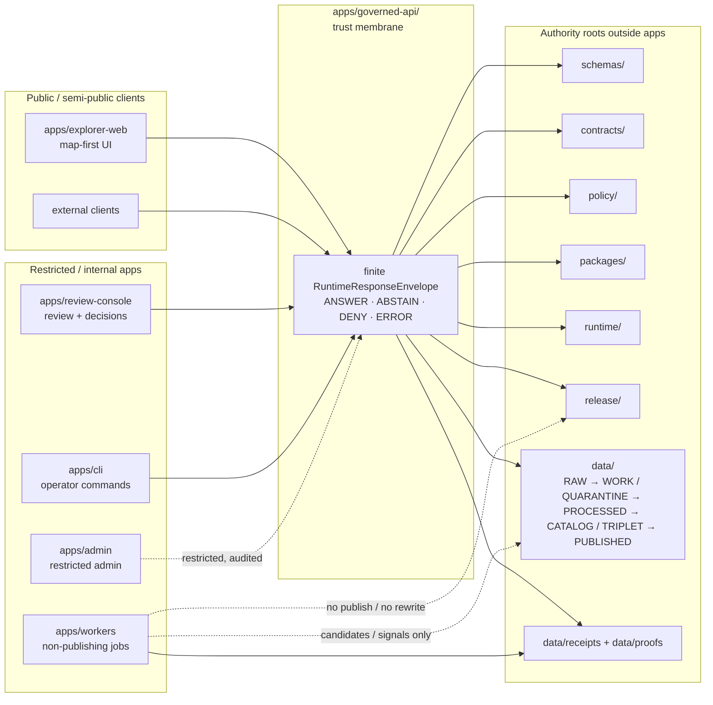

<!-- [KFM_META_BLOCK_V2]
doc_id: kfm://doc/apps-readme
title: apps/ — Deployable Applications
type: root-readme
version: v0.2
status: draft
owners: OWNER_TBD — Apps steward · API steward · UI steward · Review steward · CLI steward · Worker steward · Admin steward · Security steward · Release steward · Docs steward
created: 2026-05-10
updated: 2026-07-09
policy_label: public
related:
  - ../README.md
  - ../docs/doctrine/directory-rules.md
  - ../docs/doctrine/trust-membrane.md
  - ../docs/architecture/map-shell.md
  - ../docs/architecture/governed-api/README.md
  - governed-api/README.md
  - explorer-web/README.md
  - review-console/README.md
  - cli/README.md
  - workers/README.md
  - admin/README.md
  - packages/README.md
  - ../packages/README.md
  - ../data/README.md
  - ../release/README.md
  - ../runtime/README.md
  - ../policy/README.md
  - ../schemas/contracts/v1/
  - ../contracts/
  - ../infra/README.md
  - ../configs/README.md
tags: [kfm, apps, deployables, trust-membrane, governed-api, explorer-web, review-console, cli, workers, admin, fail-closed, finite-outcomes]
notes:
  - "Refreshes the apps root README into a current repo-aware deployables boundary contract."
  - "apps/ is the canonical deployable-application root. It is not a schema, contract, policy, lifecycle-data, release, proof, receipt, runtime-adapter, shared-package, source-admission, pipeline, config, infra, or artifact authority root."
  - "The normal public trust path is apps/governed-api/. Public and semi-public clients must not read RAW, WORK, QUARANTINE, PROCESSED, CATALOG, TRIPLET, PUBLISHED, canonical/internal stores, or model runtime output directly."
  - "Current app README surfaces verified in this revision include governed-api, explorer-web, review-console, cli, workers, admin, and the unusual apps/packages drift-guard README. Implementation files, routes, tests, deployments, logs, dashboards, workflow pass state, and runtime behavior remain NEEDS VERIFICATION unless separately cited."
  - "v0.2 adds a current evidence basis, Directory Rules placement basis, updated app-lane map, apps/packages drift signal, minimum safe apps-root slice, runtime anti-bypass matrix, safe change pattern, validation expectations, and bounded implementation truth posture."
[/KFM_META_BLOCK_V2] -->

<a id="top"></a>

<div align="center">

# Deployable Applications

`apps/`

**Canonical deployable-application root for Kansas Frontier Matrix: governed API, map-first Explorer Web, review console, operator CLI, background workers, and restricted admin surfaces — all constrained by the trust membrane, finite outcomes, policy/evidence/release gates, and reversible change discipline.**


[Evidence](#0-evidence-basis-for-this-revision) · [Purpose](#1-purpose) · [Repo fit](#2-repo-fit) · [Boundary](#3-authority-boundary) · [Belongs](#5-what-belongs-here) · [Exclusions](#6-what-does-not-belong-here) · [App map](#7-app-lane-map) · [Trust membrane](#10-trust-membrane-invariant) · [Definition of done](#18-definition-of-done)

</div>

---

> [!IMPORTANT]
> **Status:** draft / `NEEDS VERIFICATION`  
> **Owners:** `OWNER_TBD` — Apps steward · API steward · UI steward · Review steward · CLI steward · Worker steward · Admin steward · Security steward · Release steward · Docs steward  
> **Path:** `apps/README.md`  
> **Responsibility root:** `apps/` — deployable application surfaces  
> **Directory Rules basis:** `apps/` is the canonical implementation root for deployable applications. File location encodes ownership, governance, and lifecycle; deployable app code belongs here, while schemas, contracts, policy, lifecycle data, releases, receipts, proofs, shared packages, source connectors, pipelines, runtime adapters, infrastructure, configs, tests, and artifacts stay in their owning roots.  
> **Truth posture:** CONFIRMED current GitHub README path / CONFIRMED Directory Rules document exists and defines `apps/` as deployable root / CONFIRMED README paths for `apps/governed-api/`, `apps/explorer-web/`, `apps/review-console/`, `apps/cli/`, `apps/workers/`, `apps/admin/`, and `apps/packages/` / PROPOSED apps-root contract / UNKNOWN app source inventory, route wiring, UI files, command inventory, worker jobs, auth providers, test coverage, deployment, logs, dashboards, and CI pass state.

> [!CAUTION]
> `apps/` is not a place to hide authority. Apps may compose governed behavior, but they must not become schema authority, contract authority, policy authority, lifecycle storage, release authority, proof/receipt storage, shared-package root, runtime-adapter authority, source-admission root, deployment authority, or artifact store. Public and semi-public traffic must cross `apps/governed-api/` and receive finite governed envelopes or released public-safe artifacts only.

---

## Quick jump

- [0. Evidence basis for this revision](#0-evidence-basis-for-this-revision)
- [1. Purpose](#1-purpose)
- [2. Repo fit](#2-repo-fit)
- [3. Authority boundary](#3-authority-boundary)
- [4. Default posture](#4-default-posture)
- [5. What belongs here](#5-what-belongs-here)
- [6. What does not belong here](#6-what-does-not-belong-here)
- [7. App lane map](#7-app-lane-map)
- [8. Current app README evidence](#8-current-app-readme-evidence)
- [9. Minimum safe apps-root slice](#9-minimum-safe-apps-root-slice)
- [10. Trust membrane invariant](#10-trust-membrane-invariant)
- [11. Diagram](#11-diagram)
- [12. Inputs](#12-inputs)
- [13. Outputs](#13-outputs)
- [14. Runtime anti-bypass matrix](#14-runtime-anti-bypass-matrix)
- [15. Inspection path](#15-inspection-path)
- [16. Validation expectations](#16-validation-expectations)
- [17. Safe change pattern](#17-safe-change-pattern)
- [18. Definition of done](#18-definition-of-done)
- [19. Open verification items](#19-open-verification-items)

---

## 0. Evidence basis for this revision

This README is a documentation boundary, not runtime proof. The 2026-07-09 revision updates an existing apps-root README and keeps implementation maturity bounded while aligning the deployables root with verified app README surfaces and Directory Rules placement posture.

| Evidence item | Status | What it supports | What it does not prove |
|---|---|---|---|
| `apps/README.md` exists on `main`. | CONFIRMED | This is an existing root README update, not a new path proposal. | It does not prove all app source, routes, tests, workflows, deployments, or runtime behavior exist. |
| `docs/doctrine/directory-rules.md` exists and states that file location encodes ownership, governance, and lifecycle. It lists `apps/` as the deployables root and identifies `apps/governed-api/` as the public trust path. | CONFIRMED placement doctrine | `apps/` is the canonical deployable-application root and should not absorb other authority roots. | It does not prove app implementation maturity or current pass state. |
| `apps/governed-api/README.md` exists and describes Governed API as the executable trust membrane for finite `RuntimeResponseEnvelope` outcomes. | CONFIRMED README path and app posture | The normal public trust path is represented by a documented app lane. | It does not prove route handlers, DTOs, middleware, auth, deployment, or CI pass state. |
| `apps/explorer-web/README.md` exists and states Explorer Web must read through governed API only and must not directly read lifecycle or canonical/internal stores. | CONFIRMED README path and UI boundary posture | The map-first public/semi-public UI lane is documented. | It does not prove UI routes, shell wiring, tests, or deployment behavior. |
| `apps/review-console/README.md` exists and describes a role-gated steward review surface. | CONFIRMED README path and review posture | The internal review app lane is documented. | It does not prove mutating review workflows, schemas, fixtures, audits, or separation-of-duty enforcement. |
| `apps/cli/README.md` exists and describes a restricted operator CLI for validation, dry-runs, reports, diffs, and governed maintenance. | CONFIRMED README path and CLI posture | The operator CLI lane is documented. | It does not prove command inventory, package metadata, workflows, or pass state. |
| `apps/workers/README.md` exists and states workers are non-publishing background executors. | CONFIRMED README path and worker posture | The workers lane is documented as watcher-as-non-publisher. | It does not prove job definitions, queues, schedules, tests, or deployment state. |
| `apps/admin/README.md` exists and states Admin is restricted, fail-closed, and not the normal public path. | CONFIRMED README path and admin posture | The restricted admin lane is documented. | It does not prove auth providers, break-glass flows, audit sinks, or deployment posture. |
| `apps/packages/README.md` exists and treats `apps/packages/` as an unusual path / drift guard, not the shared package root. | CONFIRMED drift-guard README path | The apps root currently contains a documented anomaly that must not harden into a package root. | It does not prove contents beyond that README, migration intent, imports, or retention decision. |

[Back to top](#top)

---

## 1. Purpose

`apps/` is the deployable surface of KFM. It contains application units that can run as services, user interfaces, internal consoles, operator CLIs, background workers, or restricted admin surfaces.

An app may compose:

- schemas from `schemas/contracts/v1/`;
- semantic contracts from `contracts/`;
- policy and admissibility from `policy/`;
- reusable implementation from `packages/`;
- runtime adapters from `runtime/` behind the governed API;
- released public-safe artifacts through governed access paths;
- receipts, proofs, release records, and lifecycle data only through the responsibilities assigned to their owning roots.

This directory is not proof that any application is deployable, tested, configured, monitored, or production-ready. Runtime behavior, endpoint inventories, routes, worker schedules, command inventories, dashboards, deployment state, and CI pass state remain `NEEDS VERIFICATION` unless separately cited from current evidence.

[Back to top](#top)

---

## 2. Repo fit

| Concern | Owning root | Expected relationship |
|---|---|---|
| Deployable apps | `apps/` | This root. App-local source, app-local tests, app-local docs, entry points, and deployable composition. |
| Shared reusable implementation | `packages/` | Reusable libraries consumed by apps; not nested under `apps/` by default. |
| Runtime/model adapters | `runtime/` | Behind `apps/governed-api/`; never a direct public surface. |
| Machine shape | `schemas/contracts/v1/` | Apps consume schemas; apps do not author schema authority. |
| Object meaning | `contracts/` | Apps consume contracts; apps do not redefine object meaning. |
| Policy/admissibility | `policy/` | Apps call policy/evaluator support; apps do not become policy roots. |
| Lifecycle data | `data/` | Apps must not bypass lifecycle boundaries or treat data paths as public truth. |
| Receipts/proofs | `data/receipts/`, `data/proofs/` | Apps may emit or reference through governed lanes; not stored in app folders. |
| Release decisions | `release/` | Authorized apps may support release workflows; release authority stays in `release/`. |
| Source acquisition | `connectors/` | Connectors fetch/admit sources; they are not apps and do not publish. |
| Pipeline execution | `pipelines/`, `pipeline_specs/` | Pipelines run lifecycle transformations; apps may trigger or report, not absorb pipeline roots. |
| Repo-wide validators/builders | `tools/`, `scripts/` | Long-lived validators and generators live outside apps. |
| Deployment/exposure | `infra/`, `configs/` | Deny-by-default infra and non-secret config stay outside app source. |
| Tests/fixtures | `tests/`, `fixtures/`, app-local tests | Repo-wide proof belongs in test roots; app-local tests may live with the app when scoped to that deployable. |
| Build/QA/temp outputs | `artifacts/` | Compatibility output root; never trust-bearing authority. |

## 3. Authority boundary

`apps/` owns deployable application composition. It does not own sovereign truth.

```text
apps/                    = deployable application surfaces
apps/governed-api/       = normal public trust path
apps/explorer-web/       = public/semi-public map-first UI consumer
apps/review-console/     = role-gated steward review surface
apps/cli/                = operator/maintainer command surface
apps/workers/            = non-publishing background workers
apps/admin/              = restricted admin surface, not public path
apps/packages/           = drift guard / anomaly unless justified by ADR or migration note
```

Owning roots that must not be collapsed into `apps/`:

```text
schemas/     = machine shape
contracts/   = object meaning
policy/      = admissibility and release rules
data/        = lifecycle data, receipts, proofs, registry, published artifacts
release/     = publication decisions, rollback, correction
packages/    = shared libraries
runtime/     = local adapters behind governed API
connectors/  = source admitters
pipelines/   = executable lifecycle logic
infra/       = deployment and exposure posture
configs/     = non-secret configuration templates
```

## 4. Default posture

The default posture for every app is fail-closed.

A trust-bearing app response should not be public or semi-public unless it can preserve:

- finite outcome grammar: `ANSWER`, `ABSTAIN`, `DENY`, or `ERROR`;
- caller role, audience, and authorization posture;
- policy decision and reason code;
- EvidenceRef / EvidenceBundle support for claim-bearing answers;
- source role, rights, sensitivity, release, correction, rollback, stale/freshness, and review state where material;
- redaction, generalization, aggregation, delay, suppression, or transform receipts where material;
- safe error behavior with no internal route, stack trace, filesystem, prompt, secret, protected geometry, or source-system leakage;
- audit-safe request, decision, evidence, release, transform, and correction references.

## 5. What belongs here

A folder belongs under `apps/` when it is a deployable application or application-specific subtree for one deployable.

Accepted app-local content includes:

- app source code and entry points;
- app-local route registration and handler composition;
- app-local UI surface code;
- app-local command surfaces;
- app-local worker runners and job wiring;
- app-local tests and fixtures scoped to that deployable;
- app-local README and operator notes;
- app-local configuration examples that contain no secrets and do not replace `configs/`;
- app-local deployment metadata only when it is not the deployment authority and does not replace `infra/`.

## 6. What does not belong here

| Does not belong here | Correct home | Reason |
|---|---|---|
| Shared libraries | `packages/` | Reuse belongs in a shared package root, not hidden under an app. |
| Runtime/model adapters | `runtime/` | Adapters remain behind the governed API and are not public surfaces. |
| Schemas | `schemas/contracts/v1/` | Machine shape has a dedicated authority root. |
| Contracts | `contracts/` | Object meaning has a dedicated authority root. |
| Policy rules/bundles | `policy/` | Apps consume policy; they do not define policy authority. |
| RAW/WORK/QUARANTINE/PROCESSED/CATALOG/TRIPLET/PUBLISHED data | `data/` | Lifecycle data stays in lifecycle roots. |
| Receipts and proofs | `data/receipts/`, `data/proofs/` | Trust support records are not app files. |
| Release manifests, rollback cards, correction notices | `release/` | Release decisions are separate from deployable code. |
| Source fetchers/admitters | `connectors/` | Source admission is not app authority. |
| Pipeline logic/specs | `pipelines/`, `pipeline_specs/` | Lifecycle transformations stay in pipeline roots. |
| Repo-wide validators/builders | `tools/` | Validators and generators are not app-local unless scoped to one app. |
| One-off scripts | `scripts/` | Do not hide operational scripts inside app lanes. |
| Infrastructure/network/host posture | `infra/` | Exposure and deployment controls stay outside app source. |
| Secrets | Secret manager / environment references only | Never commit secrets in app source or examples. |
| Generated artifacts | `artifacts/` when appropriate | Apps are not output stores. |
| Domain as app root | Domain lanes under correct responsibility roots | Domain topic does not justify `apps/<domain>/`. |

## 7. App lane map

| App lane | Role | Exposure posture | Current README status | Critical boundary |
|---|---|---|---|---|
| `apps/governed-api/` | Executable trust membrane; finite governed envelopes and safe projections. | Public/semi-public trust path | CONFIRMED README path | Ordinary clients must not receive lifecycle paths, unpublished candidates, internal records, stack traces, or filesystem refs. |
| `apps/explorer-web/` | Map-first public/semi-public UI shell. | Public/semi-public client | CONFIRMED README path | Must use governed API envelopes, released artifacts, safe layer manifests, tiles, and evidence payloads; no direct lifecycle/canonical reads. |
| `apps/review-console/` | Role-gated steward review and decision surface. | Internal / audited | CONFIRMED README path | Review support must not become publication authority or public data editor. |
| `apps/cli/` | Operator/maintainer command surface for validation, dry-runs, reports, diffs, and maintenance. | Restricted / operator | CONFIRMED README path | Commands must not bypass policy, evidence, release, correction, or rollback controls. |
| `apps/workers/` | Background workers for ingest-adjacent jobs, validation, catalog/build support, receipts, candidates, stale signals. | Internal / background | CONFIRMED README path | Watcher-as-non-publisher: workers emit receipts/candidates, never publish or rewrite catalog/canonical truth. |
| `apps/admin/` | Restricted administrative surface. | Restricted / fail-closed | CONFIRMED README path | Admin is not the normal public path and must not bypass governed API, policy, evidence, release, correction, rollback, or audit controls. |
| `apps/packages/` | Unusual path / drift guard. | Not a deployable by default | CONFIRMED README path | Must not become a shadow `packages/` root or convenience package bucket. |

## 8. Current app README evidence

This table tracks README surfaces verified during this revision. It is not implementation maturity proof.

| Path | Status in this revision | Maturity boundary |
|---|---|---|
| `apps/governed-api/README.md` | CONFIRMED path and app contract | Unknown route handlers, DTOs, middleware, authorization, runtime behavior, deployment, dashboards, CI pass state. |
| `apps/explorer-web/README.md` | CONFIRMED path and UI trust-boundary contract | Unknown implementation files, routes, tests, build state, deployment. |
| `apps/review-console/README.md` | CONFIRMED path and review app boundary contract | Unknown app source, decision recorder, audit sinks, tests, fixtures, CI, deployment. |
| `apps/cli/README.md` | CONFIRMED path and operator CLI contract | Unknown command inventory, framework, packaging, tests, workflow integration. |
| `apps/workers/README.md` | CONFIRMED path and worker non-publisher contract | Unknown worker source, job definitions, queues, schedules, tests, deployment. |
| `apps/admin/README.md` | CONFIRMED path and restricted admin contract | Unknown auth providers, break-glass flow, audit sinks, tests, deployment. |
| `apps/packages/README.md` | CONFIRMED path and drift-guard contract | Unknown contents beyond README, imports, package metadata, migration/retention decision. |

## 9. Minimum safe apps-root slice

A smallest safe `apps/` root should provide:

| Slice item | Minimum requirement | Why it matters |
|---|---|---|
| Root README | States deployable-app boundary and trust membrane | Prevents apps from absorbing other authority roots |
| App README per lane | Every app has purpose, boundary, inputs, exclusions, validation, and open items | Keeps app responsibilities inspectable |
| Governed API boundary | Public trust path is explicit | Prevents public clients from bypassing governance |
| Explorer Web boundary | UI reads governed surfaces only | Prevents raw/canonical/internal reads from client surfaces |
| Worker boundary | Workers cannot publish or rewrite catalog/canonical truth | Preserves promotion as governed transition |
| Admin/CLI boundary | Restricted tools are not public paths or release shortcuts | Prevents operator convenience from becoming authority |
| Drift guards | Unusual app-root paths are classified | Prevents `apps/packages/`-style drift from hardening |
| Verification backlog | Unknown source/test/deploy/pass state remains visible | Prevents docs from pretending runtime maturity |

## 10. Trust membrane invariant

The operational trust membrane for normal public/semi-public traffic is `apps/governed-api/`.

The invariant means:

1. Public and semi-public clients use governed API envelopes and released public-safe artifacts, not lifecycle stores or internal canonical stores.
2. Claim-bearing `ANSWER` outputs require evidence support, policy allowance, release/correction/rollback context where material, and citation/limitation posture.
3. Missing support returns `ABSTAIN`, not generated filler.
4. Policy or exposure risk returns `DENY`, not partial leaked detail.
5. Runtime faults return safe `ERROR`, not stack traces or internal object handles.
6. Workers emit receipts and candidates only; they do not publish or rewrite canonical catalog records.
7. Admin and CLI actions are role-gated, audited, reversible where possible, and not the normal public path.
8. AI/model adapters are server-side and downstream of policy/evidence gates; model output is never root truth.

## 11. Diagram


```mermaid
flowchart LR
    subgraph Public["Public / semi-public clients"]
        EW["apps/explorer-web\nmap-first UI"]
        EXT["external clients"]
    end

    subgraph Trust["apps/governed-api/\ntrust membrane"]
        GAPI["finite RuntimeResponseEnvelope\nANSWER · ABSTAIN · DENY · ERROR"]
    end

    subgraph Restricted["Restricted / internal apps"]
        RC["apps/review-console\nreview + decisions"]
        CLI["apps/cli\noperator commands"]
        ADM["apps/admin\nrestricted admin"]
        WK["apps/workers\nnon-publishing jobs"]
    end

    subgraph Authority["Authority roots outside apps"]
        SCH["schemas/"]
        CON["contracts/"]
        POL["policy/"]
        PKG["packages/"]
        RT["runtime/"]
        REL["release/"]
        DATA["data/\nRAW → WORK / QUARANTINE → PROCESSED → CATALOG / TRIPLET → PUBLISHED"]
        REC["data/receipts + data/proofs"]
    end

    EW --> GAPI
    EXT --> GAPI
    RC --> GAPI
    CLI --> GAPI
    ADM -. "restricted, audited" .-> GAPI

    GAPI --> SCH
    GAPI --> CON
    GAPI --> POL
    GAPI --> PKG
    GAPI --> RT
    GAPI --> REL
    GAPI --> DATA
    GAPI --> REC

    WK --> REC
    WK -. "candidates / signals only" .-> DATA
    WK -. "no publish / no rewrite" .-> REL
```

> [!NOTE]
> The diagram is responsibility-oriented, not runtime proof. Specific call paths, services, routes, queues, workers, permissions, deployment topology, and logs remain `NEEDS VERIFICATION` until checked from implementation and operational evidence.

## 12. Inputs

Apps may consume these inputs through governed boundaries:

| Input | Owning root | Required posture |
|---|---|---|
| Runtime/request envelopes | `schemas/contracts/v1/runtime/`, `contracts/runtime/` | Validated finite outcome grammar |
| Evidence refs and bundles | `packages/evidence-resolver/`, `data/proofs/` | Claim-bearing answers require evidence closure |
| Policy decisions | `policy/`, `packages/policy-runtime/` | Policy gate before public trust-bearing output |
| Release/correction/rollback state | `release/` | Public outputs reference current release posture where material |
| Public-safe artifacts | `data/published/` | Released and accessed through governed paths only |
| Lifecycle candidates | `data/` phases | No direct public reads; worker/operator access is role-gated and audited |
| Source metadata | `data/registry/`, `docs/sources/`, source descriptors | Source role, rights, sensitivity, and provenance preserved |
| Runtime/model outputs | `runtime/` behind `governed-api/` | Server-side, bounded, policy/evidence checked, never sovereign truth |
| Non-secret configs | `configs/` or app-local examples | No secrets, no deployment authority substitution |

## 13. Outputs

Apps may produce or trigger only bounded outputs:

| Output | Correct home / channel | Guardrail |
|---|---|---|
| `RuntimeResponseEnvelope` | `apps/governed-api/` response | Exactly one finite outcome |
| UI rendering | `apps/explorer-web/` | Downstream carrier only; not truth source |
| Review decisions | Governed decision/audit/release paths | Role-gated, policy-bound, auditable, reversible where possible |
| CLI reports/dry-runs | Operator output / reports | No public publication shortcut |
| Worker receipts/candidates | `data/receipts/`, appropriate lifecycle candidate lanes | Non-publishing; no catalog rewrite |
| Release manifests/corrections/rollback cards | `release/` | Authorized release workflow only |
| Logs/metrics/telemetry | Observability systems | No raw evidence, prompts, secrets, restricted geometry, provider traces, or full protected payloads |

Apps do not emit canonical truth directly into `data/processed/`, `data/catalog/`, `data/triplets/`, or `data/published/` outside governed promotion and release paths.

## 14. Runtime anti-bypass matrix

| Bypass risk | Required behavior | Review signal |
|---|---|---|
| Public client reads `data/raw`, `data/work`, `data/quarantine`, `data/processed`, `data/catalog`, or canonical/internal stores directly | Deny; route through governed API and released public-safe projections | Client import/fetch scan blocks direct reads |
| App returns plain dict/string for trust-bearing response | Wrap/validate `RuntimeResponseEnvelope` or block | Envelope tests reject untyped success |
| Missing evidence produces generated answer | Return `ABSTAIN` | Missing-evidence fixture blocks answer |
| Policy denial leaks protected detail | Return safe `DENY` | Sensitive-denial fixture hides blocked payload |
| Worker publishes or rewrites catalog/published truth | Deny; emit receipt/candidate only | Worker write tests block catalog/published writes |
| Admin or CLI bypasses release/correction/rollback | Deny; require governed release path and audit refs | Operator tests require release refs |
| Runtime/model adapter exposed directly to browser | Deny; server-side governed API only | Network/import scan blocks client provider calls |
| `apps/packages/` accumulates reusable package code | Migrate or justify through ADR; prefer top-level `packages/` | Drift review flags app-root package growth |
| App embeds schemas, policy tables, release records, proofs, or receipts as authority | Move to owning roots | Directory review blocks parallel authority |
| Logs/telemetry/cache keys include raw evidence, prompts, secrets, restricted geometry, or full protected payloads | Redact/hash/bucket/omit | Safe-observability tests block leakage |
| App-local test/readme claims pass state without evidence | Mark `NEEDS VERIFICATION` | PR cites current local/CI run before pass claim |

## 15. Inspection path

Use these commands from the repository root when auditing `apps/`. They are inspection aids, not proof by themselves.

```bash
find apps -maxdepth 4 -type f | sort
find apps -maxdepth 2 -name README.md -type f | sort
find apps -maxdepth 5 -type f 2>/dev/null | grep -Ei 'RuntimeResponseEnvelope|EvidenceBundle|EvidenceRef|PolicyDecision|ReleaseManifest|CorrectionNotice|RollbackCard|AIReceipt|raw|quarantine|processed|catalog|published|model|provider|secret|telemetry|audit|receipt|proof|worker|route|handler|test|fixture' | sort
find .github/workflows tests fixtures apps -maxdepth 6 -type f 2>/dev/null | grep -Ei 'apps|governed.?api|explorer|review|cli|worker|admin|envelope|abstain|deny|error|no.?raw|no.?publish|safe.?log|telemetry' | sort
```

## 16. Validation expectations

Useful validation for `apps/` should cover:

- every trust-bearing public/semi-public response returns exactly one `ANSWER`, `ABSTAIN`, `DENY`, or `ERROR`;
- public and semi-public clients cannot directly read lifecycle/canonical/internal stores;
- Explorer Web uses governed API envelopes, released artifacts, safe layer manifests, tiles, and evidence payloads only;
- Governed API never leaks lifecycle paths, unpublished candidates, internal records, stack traces, filesystem references, secrets, provider traces, prompt text, or raw model output;
- Review Console mutation paths are role-gated, policy-bound, auditable, and separated from publication authority;
- CLI commands are dry-run-first where material, fail-closed, and unable to bypass release/correction/rollback requirements;
- workers cannot write directly to `data/catalog/` or `data/published/` as publication authority;
- Admin cannot become the normal public path or bypass governed API/policy/release/evidence controls;
- `apps/packages/` remains classified as a drift guard unless an accepted ADR/migration note gives it a narrow purpose;
- app-local tests do not replace repo-wide proof where repo-wide proof is required;
- CI/pass/deployment/logging claims cite current evidence before being marked confirmed.

## 17. Safe change pattern

For changes under `apps/`:

1. Confirm the target is a deployable app or app-local subtree.
2. If adding a new app lane, require an ADR or migration note when it changes public surface, trust membrane, admin scope, worker role, route authority, or deployment topology.
3. Add or update the app README before or with material behavior changes.
4. Keep schemas, contracts, policy, receipts, proofs, release records, lifecycle data, runtime adapters, shared packages, and infra in their owning roots.
5. Add negative tests for bypass risks: direct lifecycle reads, missing evidence, policy denial, unsafe errors, unsafe logs, worker publication, direct model/browser path, admin shortcut, and CLI release shortcut.
6. Preserve audit-safe request, decision, evidence, release, transform, correction, and rollback references.
7. Update `apps/README.md`, child app READMEs, affected docs, schemas/contracts, policy, tests, fixtures, release docs, and runbooks when behavior materially changes.
8. Cite current implementation/test/CI/operational evidence before claiming runtime maturity or pass state.

## 18. Definition of done

- [ ] Owners are confirmed and `OWNER_TBD` is replaced.
- [ ] Each app lane has a README with purpose, boundary, inputs, exclusions, validation, and open items.
- [ ] Current app source inventory is documented.
- [ ] Public trust path boundary is verified from route/config evidence.
- [ ] Explorer Web direct-read denial is tested.
- [ ] Governed API finite-envelope behavior is tested.
- [ ] Review Console role/audit/separation-of-duty behavior is tested where mutating.
- [ ] CLI command inventory, dry-run posture, and release-safety gates are documented and tested.
- [ ] Workers pass watcher-as-non-publisher tests.
- [ ] Admin access, audit, and break-glass posture are documented and tested.
- [ ] `apps/packages/` retention/migration decision is resolved or tracked as drift.
- [ ] App-local tests and repo-wide tests are reconciled.
- [ ] CI workflow names and latest pass state are cited before being claimed.
- [ ] Deployment, logs, dashboards, telemetry, and audit sinks are verified before operational claims.

## 19. Open verification items

| Item | Why it matters |
|---|---|
| Confirm app source inventory below each app lane | Prevents docs from overclaiming implementation maturity |
| Confirm public trust path routing | Required before public API behavior claims |
| Confirm Explorer Web has no direct lifecycle/canonical reads | Required for trust membrane safety |
| Confirm Governed API route/DTO/middleware/auth implementation | Required before API maturity claims |
| Confirm Review Console mutating decision workflow | Required before stewardship/release flow claims |
| Confirm CLI command inventory and packaging | Required before operator guidance claims |
| Confirm Workers job inventory, queues, schedules, and write targets | Required before worker safety claims |
| Confirm Admin auth, audit, and break-glass posture | Required before restricted admin claims |
| Confirm `apps/packages/` contents and migration/retention decision | Required to prevent package-root drift |
| Confirm `apps/api/` existence/absence and boundary if present | Required by two-API open question |
| Confirm CODEOWNERS/app owners | Required for review burden enforcement |
| Confirm app CI workflow names and current pass state | Required before CI claims |
| Confirm deployment, logs, dashboards, telemetry, and audit sinks | Required before operational claims |

<details>
<summary>Appendix A — no-loss preservation note</summary>

The previous README already established `apps/` as the deployable root, named the trust membrane, documented the role table, and warned against public direct reads and worker publication. This revision preserves those core invariants, refreshes metadata, adds current evidence basis, adds explicit Directory Rules placement posture, records verified child README surfaces, adds `apps/packages/` as a drift signal, strengthens minimum safe root slice, anti-bypass, validation, safe-change, and definition-of-done sections, and keeps implementation/test/deployment claims bounded.

</details>

## Status summary

`apps/` is the canonical deployable-application root. `apps/governed-api/` is the normal public trust path. `apps/explorer-web/` is the map-first client surface that must consume governed outputs only. `apps/review-console/`, `apps/cli/`, `apps/workers/`, and `apps/admin/` are bounded internal/restricted deployable lanes. `apps/packages/` is an unusual path and should remain a drift guard unless an accepted decision gives it a narrow purpose.

The root must preserve KFM’s trust membrane: apps may compose governed behavior, but they must not become schema authority, contract authority, policy authority, lifecycle storage, release authority, proof/receipt storage, shared-package root, direct source access, public model-output surface, unsafe observability channel, or unsupported generated-answer surface.

<p align="right"><a href="#top">Back to top</a></p>
