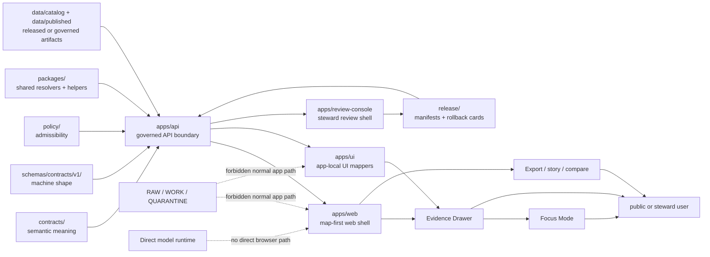

<!-- [KFM_META_BLOCK_V2]
doc_id: kfm://doc/TODO-VERIFY-apps-readme-uuid
title: apps
type: standard
version: v1
status: draft
owners: @bartytime4life
created: TODO-VERIFY-YYYY-MM-DD
updated: 2026-05-06
policy_label: TODO-VERIFY-public-or-restricted
related: [../README.md, ../.github/CODEOWNERS, ../docs/adr/ADR-0001-schema-home.md, ./api/README.md, ./web/README.md, ./ui/README.md, ./review-console/README.md]
tags: [kfm, apps, deployable-systems, governed-api, web-shell, review-console, ui, trust-membrane]
notes: [apps/README.md existed on main but was empty when revised from connector evidence; owner is grounded in CODEOWNERS fallback and should be narrowed when app-specific teams are verified; inventory is evidence-bounded to files fetched or surfaced during this review; apps/api versus apps/governed_api/governed-api naming remains NEEDS VERIFICATION.]
[/KFM_META_BLOCK_V2] -->

<a id="top"></a>

# apps

Deployable KFM application boundary for governed APIs, browser shells, reviewer tools, workers, CLI entrypoints, and app-local UI surfaces that consume governed evidence without becoming truth authority.

## Impact block


| Field | Value |
| --- | --- |
| **Status** | `active directory / draft README` |
| **Owners** | `@bartytime4life` fallback coverage; app-specific owners **NEED VERIFICATION** |
| **Path** | `apps/README.md` |
| **Authority class** | Operational app-boundary landing page |
| **Repo fit** | Parent directory for deployable application surfaces and app-local UI/runtime boundaries |
| **Truth posture** | **CONFIRMED** path and adjacent README-bearing app surfaces · **PROPOSED** normalized parent contract · **UNKNOWN** full app inventory, runtime behavior, deployments, and CI enforcement |
| **Quick jumps** | [Scope](#scope) · [Repo fit](#repo-fit) · [Accepted inputs](#accepted-inputs) · [Exclusions](#exclusions) · [Current app map](#current-app-map) · [Directory tree](#directory-tree) · [Quickstart](#quickstart) · [Operating model](#operating-model) · [Boundary rules](#app-boundary-rules) · [Definition of done](#task-list--definition-of-done) · [FAQ](#faq) · [Appendix](#appendix) |

> [!IMPORTANT]
> `apps/` is an application boundary, not the evidence system itself. Apps may render, route, review, inspect, and operate over governed outputs. They must not become canonical evidence stores, policy authorities, schema authorities, release authorities, direct model clients, or shortcuts around the KFM lifecycle.

---

## Scope

`apps/` contains deployable or near-deployable KFM application surfaces.

Use this directory for application code and app-local documentation that turns governed project objects into user-facing, operator-facing, or reviewer-facing behavior:

- governed API boundaries and route surfaces;
- OpenAPI or route-local contract documentation when owned by an app;
- browser shells and map-first public or semi-public interfaces;
- app-local UI mappers and interaction code;
- steward review consoles;
- app-local health, preview, or diagnostics surfaces;
- future CLI, worker, admin, or explorer applications after their ownership and trust boundaries are verified.

The directory exists because KFM needs executable surfaces. It does **not** weaken the core trust law:

```text
RAW -> WORK / QUARANTINE -> PROCESSED -> CATALOG / TRIPLET -> PUBLISHED
```

Public and ordinary app clients should consume governed APIs, released artifacts, public-safe layer manifests, and resolved evidence payloads. They should not read internal lifecycle stores directly.

<p align="right"><a href="#top">Back to top ↑</a></p>

---

## Repo fit

`apps/` sits between the governed project spine and the visible/runtime user surfaces.

| Relationship | Path | Status | Role |
| --- | --- | ---: | --- |
| Root orientation | [`../README.md`](../README.md) | **CONFIRMED** | Repo-wide KFM purpose, trust law, responsibility-root posture, and publication guardrails |
| Review routing | [`../.github/CODEOWNERS`](../.github/CODEOWNERS) | **CONFIRMED** | Fallback ownership and review routing for `apps/` and app subpaths |
| Schema-home ADR | [`../docs/adr/ADR-0001-schema-home.md`](../docs/adr/ADR-0001-schema-home.md) | **CONFIRMED draft** | Proposed split: `contracts/` means, `schemas/contracts/v1/` validates, `policy/` decides |
| Governed API app docs | [`./api/README.md`](./api/README.md) | **CONFIRMED** | App-local API boundary guidance; naming reconciliation **NEEDS VERIFICATION** |
| Governed API OpenAPI docs | [`./api/openapi/README.md`](./api/openapi/README.md) | **CONFIRMED** | Contract-file discipline for API specs |
| Governed API route docs | [`./api/routes/README.md`](./api/routes/README.md) | **CONFIRMED** | Route-level trust-membrane guardrails |
| Governed web shell | [`./web/README.md`](./web/README.md) | **CONFIRMED** | Browser shell for released KFM artifacts and trust-visible map interaction |
| Web package manifest | [`./web/package.json`](./web/package.json) | **CONFIRMED** | `@kfm/web` npm/Vite/MapLibre/PMTiles package metadata and scripts |
| UI overview | [`./ui/README.md`](./ui/README.md) | **CONFIRMED** | UI-facing code/tests overview |
| Ecology UI | [`./ui/ecology/README.md`](./ui/ecology/README.md) | **CONFIRMED** | Ecology UI mapper and trust-surface guidance |
| Reviewer console | [`./review-console/README.md`](./review-console/README.md) | **CONFIRMED** | Steward shell for promotion evidence, verifier results, policy outcomes, and signed review decisions |

### Upstream dependencies

Apps should consume or reference upstream KFM surfaces rather than redefining them:

| Upstream surface | App-facing expectation |
| --- | --- |
| `contracts/` | Semantic meaning for KFM objects and interfaces |
| `schemas/contracts/v1/` | Machine-checkable shapes for governed payloads, envelopes, and trust objects |
| `policy/` | Rights, sensitivity, release, runtime, review, and deny/abstain rules |
| `packages/` | Shared implementation libraries such as evidence resolvers, validators, and domain helpers |
| `data/published/`, `data/catalog/`, `release/` | Released and cataloged artifacts, not raw lifecycle material |
| `tests/`, `fixtures/` | Verification and no-network fixtures for app behavior |

### Downstream consumers

Apps provide surfaces for:

- map-first exploration;
- evidence inspection;
- bounded Focus Mode interaction;
- steward review and promotion handoff;
- export or story previews;
- internal diagnostics and operator workflows;
- future CLI or worker flows, if verified and governed.

<p align="right"><a href="#top">Back to top ↑</a></p>

---

## Accepted inputs

Use `apps/` for deployable or app-local materials with a clear runtime or UI boundary.

| Accepted input | Belongs here when… | Typical examples |
| --- | --- | --- |
| App README files | They define an application boundary, accepted inputs, exclusions, and verification posture. | `apps/web/README.md`, `apps/api/README.md`, `apps/review-console/README.md` |
| App source code | It implements a deployable or app-local runtime surface. | web shell code, route handlers, UI mappers, review-console components |
| App-local package manifests | The package is scoped to a deployable app. | `apps/web/package.json` |
| App-local route docs | They explain request/response behavior without replacing policy or schema authority. | `apps/api/routes/README.md` |
| OpenAPI app docs | They document governed route contracts and examples. | `apps/api/openapi/README.md` |
| UI mappers and renderers | They consume governed payloads and preserve trust-state visibility. | evidence drawer mappings, Focus outcome renderers, map layer panels |
| App-local tests and fixtures | They prove app behavior without becoming canonical fixture authority. | UI mapper tests, route smoke fixtures, no-direct-model-client tests |
| Health or status endpoints | They expose operational status without leaking source data, secrets, or unpublished artifacts. | `/healthz`, local status checks |
| Future CLI, workers, admin surfaces | Their role, owner, security posture, and public/private boundary are verified. | `apps/cli/`, `apps/workers/`, `apps/admin/` |

> [!TIP]
> A file belongs in `apps/` when the main question is: “Which deployable or app-local surface uses governed KFM objects to serve users, stewards, operators, or tests?”

<p align="right"><a href="#top">Back to top ↑</a></p>

---

## Exclusions

Keep app code thin around trust-critical authority.

| Do not put this in `apps/` as authority | Better home | Why |
| --- | --- | --- |
| RAW, WORK, or QUARANTINE data | `data/raw/`, `data/work/`, `data/quarantine/` | Apps must not bypass lifecycle gates. |
| Canonical evidence stores | governed backend/service layer, `data/`, `packages/evidence/` after verification | App rendering is not evidence custody. |
| Source connectors and harvesters | `connectors/`, `pipelines/`, `pipeline_specs/`, `packages/` | Source admission needs rights, cadence, receipts, and policy checks. |
| Contract meaning | `contracts/` | App docs may reference contracts but must not own object meaning. |
| Machine schema authority | `schemas/contracts/v1/` or the accepted schema home | App payload types must not fork schema truth. |
| Policy-as-code | `policy/` | Apps display policy outcomes; they do not author policy. |
| Release manifests, proof packs, receipts | `release/`, `data/receipts/`, `data/proofs/` | Apps may consume release/proof references but must not become proof storage. |
| Secrets, source credentials, model keys | external secret management / local env excluded from git | App directories must not become secret stores. |
| Direct browser model clients | governed model adapter behind the API | Focus Mode must stay evidence-subordinate and policy-checked. |
| Public admin shortcuts | restricted admin or review routes with explicit access controls | Admin convenience must not become the normal public path. |
| Domain root folders | responsibility roots such as `docs/domains/`, `schemas/contracts/v1/domains/`, `policy/domains/` | Domain names should not become app roots merely for convenience. |
| Generated clients as contract authority | generated-output path with documented derivative status | Generated code is downstream of contracts and schemas. |

> [!WARNING]
> Successful rendering is not publication. A working route, map, popup, or UI component does not prove source authority, evidence closure, policy approval, release state, or rollback readiness.

<p align="right"><a href="#top">Back to top ↑</a></p>

---

## Current app map

This map is intentionally evidence-bounded. It summarizes files that were fetched or surfaced during review; it is not a complete tree audit.

| Path | Current evidence | Role | Status |
| --- | --- | --- | --- |
| `apps/README.md` | File exists on `main`, but prior content was empty. | Parent directory contract and navigation surface. | **CONFIRMED path / draft content** |
| `apps/api/README.md` | README exists and documents the governed API boundary. | API trust membrane guidance. | **CONFIRMED file / NEEDS VERIFICATION naming** |
| `apps/api/openapi/README.md` | README exists. | OpenAPI contract surface for governed API docs. | **CONFIRMED file** |
| `apps/api/routes/README.md` | README exists. | Route-level guardrails and finite outcome posture. | **CONFIRMED file** |
| `apps/review-console/README.md` | README exists with reviewer-console role. | Steward review shell for promotion and decision artifacts. | **CONFIRMED file** |
| `apps/ui/README.md` | README exists and states `apps/ui/ecology/` has mapper logic and tests. | UI-facing code/tests overview. | **CONFIRMED file** |
| `apps/ui/ecology/README.md` | README exists. | Ecology UI mapping, geoprivacy, Evidence Drawer, Focus Mode notes. | **CONFIRMED file** |
| `apps/web/README.md` | README exists. | Governed web shell boundary. | **CONFIRMED file** |
| `apps/web/package.json` | Package manifest exists for `@kfm/web`. | npm/Vite/MapLibre/PMTiles web app package. | **CONFIRMED file** |
| `apps/web/src/map/README.md` | README exists. | MapLibre map runtime boundary. | **CONFIRMED file** |
| `apps/governed-api/` | Named in CODEOWNERS and Directory Rules role guidance. | Candidate governed API app home. | **NEEDS VERIFICATION** |
| `apps/governed_api/` | Referenced by multiple API READMEs as intended path. | Candidate governed API app home or compatibility alias. | **NEEDS VERIFICATION / CONFLICTED naming** |
| `apps/explorer-web/` | Named in CODEOWNERS and Directory Rules role guidance. | Candidate map-first explorer app. | **NEEDS VERIFICATION** |
| `apps/cli/` | Named in CODEOWNERS and Directory Rules role guidance. | Candidate maintainer CLI app. | **NEEDS VERIFICATION** |
| `apps/workers/` | Named in CODEOWNERS and Directory Rules role guidance. | Candidate background job app surface. | **NEEDS VERIFICATION** |
| `apps/admin/` | Named in Directory Rules as optional restricted admin surface. | Candidate restricted admin app. | **PROPOSED / NEEDS VERIFICATION** |

### Naming reconciliation note

The current evidence exposes a naming tension:

- checked app docs are under `apps/api/`;
- several app READMEs describe intended paths under `apps/governed_api/`;
- CODEOWNERS also names `apps/governed-api/` and `apps/governed_api/`.

Do not create or preserve parallel API homes by accident. Pick the durable app home through repo evidence and, if needed, an ADR or migration note.

<p align="right"><a href="#top">Back to top ↑</a></p>

---

## Directory tree

Current evidence-bounded snapshot:

```text
apps/
├── README.md
├── api/
│   ├── README.md
│   ├── openapi/
│   │   └── README.md
│   └── routes/
│       └── README.md
├── review-console/
│   └── README.md
├── ui/
│   ├── README.md
│   └── ecology/
│       └── README.md
└── web/
    ├── README.md
    ├── package.json
    └── src/
        └── map/
            └── README.md
```

Named by Directory Rules, CODEOWNERS, or app READMEs, but not confirmed as full app directories in this README pass:

```text
apps/governed-api/       # NEEDS VERIFICATION
apps/governed_api/       # NEEDS VERIFICATION / naming conflict
apps/explorer-web/       # NEEDS VERIFICATION
apps/cli/                # NEEDS VERIFICATION
apps/workers/            # NEEDS VERIFICATION
apps/admin/              # PROPOSED / NEEDS VERIFICATION
```

Replace this tree with a fresh mounted-checkout inventory before calling it complete:

```bash
find apps -maxdepth 3 -type f | sort
```

<p align="right"><a href="#top">Back to top ↑</a></p>

---

## Quickstart

Start with inspection before execution.

```bash
# From the repository root
git status --short
git branch --show-current || true

find apps -maxdepth 3 -type f | sort
find apps -maxdepth 2 \( -name README.md -o -name package.json -o -name pyproject.toml -o -name go.mod -o -name Cargo.toml \) -print | sort
```

Confirmed app-local web package commands from `apps/web/package.json`:

```bash
cd apps/web

npm install
npm run check
npm run test
npm run build
```

Documented UI ecology test command from `apps/ui/README.md`:

```bash
python3 -m pytest -q apps/ui/ecology/tests
```

> [!CAUTION]
> Do not report tests, builds, or CI as passing unless they ran on the current checkout. This README documents commands and boundaries; it does not assert current runtime health.

<p align="right"><a href="#top">Back to top ↑</a></p>

---

## Operating model

Apps sit downstream of governed evidence and upstream of users, stewards, operators, or test harnesses.


```mermaid
flowchart LR
  Contracts[contracts/<br/>semantic meaning]
  Schemas[schemas/contracts/v1/<br/>machine shape]
  Policy[policy/<br/>admissibility]
  Packages[packages/<br/>shared resolvers + helpers]
  Data[data/catalog + data/published<br/>released or governed artifacts]
  Release[release/<br/>manifests + rollback cards]

  API[apps/api<br/>governed API boundary]
  Web[apps/web<br/>map-first web shell]
  UI[apps/ui<br/>app-local UI mappers]
  Review[apps/review-console<br/>steward review shell]

  Drawer[Evidence Drawer]
  Focus[Focus Mode]
  Export[Export / story / compare]
  User[public or steward user]

  Contracts --> API
  Schemas --> API
  Policy --> API
  Packages --> API
  Data --> API
  Release --> API

  API --> Web
  API --> UI
  API --> Review
  Web --> Drawer
  UI --> Drawer
  Drawer --> Focus
  Web --> Export
  Review --> Release
  Drawer --> User
  Focus --> User
  Export --> User

  Raw[RAW / WORK / QUARANTINE]
  Model[Direct model runtime]

  Raw -. forbidden normal app path .-> Web
  Raw -. forbidden normal app path .-> UI
  Model -. no direct browser path .-> Web
```

The flow should preserve these distinctions:

| Object / layer | App role |
| --- | --- |
| `EvidenceBundle` | Apps render or route to it; they do not replace it. |
| `DecisionEnvelope` / `RuntimeResponseEnvelope` | Apps render finite outcomes; they do not smooth negative states into prose. |
| `PolicyDecision` | Apps display policy posture and obligations; policy remains upstream. |
| `ReleaseManifest` / `RollbackCard` | Apps consume release identity and rollback context; release remains governed. |
| `LayerManifest` / map artifacts | Apps render released layers and trust cues; map styling is not evidence authority. |
| `AIReceipt` / model adapter outputs | Apps may show bounded AI participation; direct model output is not proof. |

<p align="right"><a href="#top">Back to top ↑</a></p>

---

## App boundary rules

### 1. Public apps use governed paths

Browser and public-facing apps should call governed API surfaces or released artifact endpoints. They must not read `RAW`, `WORK`, `QUARANTINE`, source mirrors, unpublished candidates, restricted canonical stores, vector indexes, graph internals, or model runtimes directly.

### 2. Review apps do not publish directly

Reviewer or steward apps may help inspect candidates, policy results, verifier output, evidence diffs, and signed decisions. Publication still requires the project’s promotion and release path.

### 3. App code consumes shared meaning

Shared meaning belongs in `contracts/`, `schemas/`, `policy/`, `packages/`, tests, fixtures, and release objects. App-specific DTO adapters may live here only when they are thin and trace back to canonical homes.

### 4. App-local tests prove app behavior

App-local tests can live with app code when repo convention supports it. Cross-app trust guarantees should also be visible in `tests/` or CI-facing verification surfaces.

### 5. Admin and debug surfaces fail closed

Admin, local dev, preview, or debug affordances should be restricted, auditable, and kept out of the normal public path. A debug success state is not a release state.

### 6. Naming drift must be resolved, not normalized silently

`apps/api`, `apps/governed_api`, and `apps/governed-api` must not become three competing API authorities. Resolve the durable home through current repo evidence and migration notes.

### 7. App README claims must stay executable or bounded

Every app README should clearly separate:

- what the repo currently shows;
- what the app intends;
- what tests or commands verify;
- what remains unknown.

<p align="right"><a href="#top">Back to top ↑</a></p>

---

## Task list — definition of done

Before this README is treated as active directory canon:

- [ ] Replace `doc_id`, `created`, and `policy_label` placeholders with verified values.
- [ ] Confirm whether `@bartytime4life` remains the correct owner or whether app-specific teams should be added.
- [ ] Replace the evidence-bounded tree with a fresh mounted-checkout inventory.
- [ ] Resolve `apps/api` versus `apps/governed_api` versus `apps/governed-api` naming through repo evidence and, if necessary, an ADR or migration note.
- [ ] Confirm all app-local README links from `apps/README.md`.
- [ ] Confirm package managers and test commands for each code-bearing app.
- [ ] Confirm whether `apps/cli`, `apps/workers`, `apps/admin`, and `apps/explorer-web` exist and what each owns.
- [ ] Add or link route/API tests proving no public app path reads RAW, WORK, QUARANTINE, restricted canonical stores, or direct model endpoints.
- [ ] Link app surfaces to canonical contracts, schemas, policy, fixtures, tests, and release docs after those paths are verified.
- [ ] Confirm CI or local validation commands for API, UI, review-console, and web surfaces.
- [ ] Update this README whenever an app is added, renamed, deprecated, or moved.

<p align="right"><a href="#top">Back to top ↑</a></p>

---

## FAQ

### Is `apps/` the canonical truth system?

No. `apps/` contains deployable or app-local surfaces. Canonical evidence, contracts, schemas, policy, release objects, receipts, and proofs belong in their responsibility roots.

### Can browser apps call a model runtime directly?

No. Focus Mode and model-assisted behavior must route through a governed API or model-adapter boundary that resolves evidence, checks policy, validates citations, and emits finite outcomes.

### Can a review console approve publication by itself?

No. A review console may emit review or decision artifacts. Publication remains a governed state transition with validation, policy, review, release, correction, and rollback obligations.

### Should new domains get new app folders?

Not by default. Domain materials usually belong under responsibility roots such as `docs/domains/`, `schemas/contracts/v1/domains/`, `policy/domains/`, `tests/domains/`, and lifecycle data paths. Add app folders only when a deployable surface exists.

### Is `apps/api` the canonical governed API home?

**NEEDS VERIFICATION.** The checked README-bearing surface exists under `apps/api/`, while several app docs and ownership rules also mention `apps/governed_api` or `apps/governed-api`. Treat that as a naming reconciliation item, not as settled architecture.

### Can app-local examples include sensitive data?

No. App examples should be public-safe or explicitly restricted fixtures. Exact sensitive locations, living-person data, DNA/genomic data, restricted archaeology, rare species locations, and critical infrastructure details require fail-closed handling.

<p align="right"><a href="#top">Back to top ↑</a></p>

---

## Appendix

<details>
<summary>Status labels used in this README</summary>

| Label | Meaning |
| --- | --- |
| **CONFIRMED** | Directly verified from current repo connector evidence, current-session inspection, or governing KFM documentation. |
| **INFERRED** | Conservative interpretation from confirmed files and doctrine. |
| **PROPOSED** | Recommended placement or behavior that fits doctrine but is not verified as current implementation. |
| **UNKNOWN** | Not enough evidence to state as fact. |
| **NEEDS VERIFICATION** | Concrete check required before treating a claim as repo fact. |
| **CONFLICTED** | Multiple naming, placement, or authority signals exist and require explicit resolution. |

</details>

<details>
<summary>Open verification backlog</summary>

| Item | Why it matters |
| --- | --- |
| Full `apps/` inventory | Prevents this README from omitting active app surfaces or preserving stale names. |
| API home decision | Resolves `apps/api`, `apps/governed_api`, and `apps/governed-api` ambiguity. |
| App-specific owners | CODEOWNERS fallback is useful but not a mature app ownership model. |
| App-local test commands | Prevents stale quickstart guidance. |
| Runtime/deployment state | Prevents README docs from claiming behavior not proven by code or logs. |
| CI workflows and required checks | Determines which app checks are actually enforced. |
| Direct model-client and raw-store scans | Confirms public and browser surfaces preserve the trust membrane. |
| Schema and policy links | Keeps apps downstream of canonical contracts, schemas, and policy. |
| Admin/review exposure posture | Ensures restricted surfaces do not become normal public paths. |

</details>

<details>
<summary>Reviewer checklist for app changes</summary>

- Does the change add a deployable or app-local surface rather than a domain bucket?
- Does it consume governed evidence, policy, schemas, and release state instead of redefining them?
- Does it avoid direct RAW / WORK / QUARANTINE access?
- Does it avoid direct browser-to-model-runtime access?
- Are `ANSWER`, `ABSTAIN`, `DENY`, and `ERROR` states visible when relevant?
- Are review or admin affordances restricted and auditable?
- Are sensitive examples public-safe or clearly restricted?
- Did README, tests, OpenAPI, schemas, policy references, and rollback notes change when behavior changed?

</details>

<p align="right"><a href="#top">Back to top ↑</a></p>
