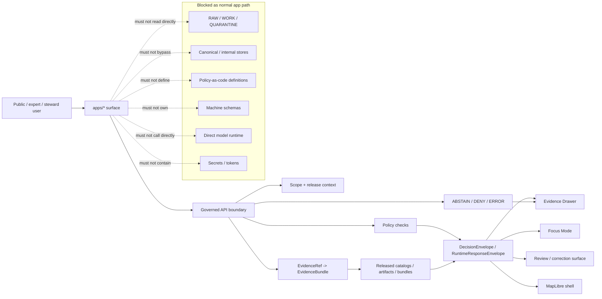
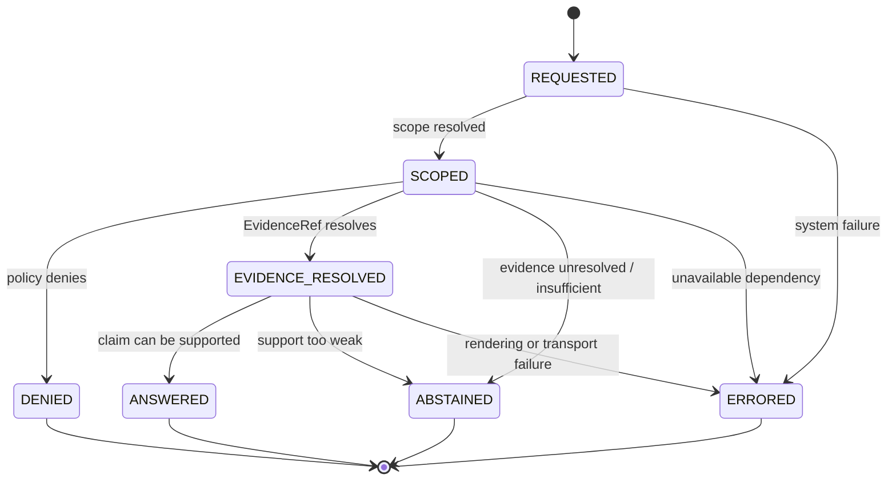

<!-- [KFM_META_BLOCK_V2]
doc_id: TODO-VERIFY-kfm-doc-uuid
title: Apps
type: standard
version: v1
status: draft
owners: TODO-VERIFY-apps-owners
created: 2026-04-22
updated: 2026-04-26
policy_label: TODO-VERIFY-public-or-restricted
related:
  - TODO-VERIFY-root-readme
  - TODO-VERIFY-docs-architecture
  - TODO-VERIFY-contracts
  - TODO-VERIFY-schemas
  - TODO-VERIFY-policy
  - TODO-VERIFY-tests
  - TODO-VERIFY-release
  - TODO-VERIFY-governed-api
tags:
  - kfm
  - apps
  - governed-api
  - map-first
  - evidence-first
  - time-aware
  - trust-boundary
notes:
  - Repository inventory, owners, related links, route names, package manager, test commands, and implementation status must be verified in the mounted checkout before any UNKNOWN claim is upgraded.
  - This file is an admission contract for application surfaces, not proof that child apps exist.
[/KFM_META_BLOCK_V2] -->

<a id="top"></a>

# Apps

Application surfaces for KFM’s governed, evidence-first, map-first, time-aware product boundary.

<p>
  
  
  
  
  
  
</p>

> [!IMPORTANT]
> `apps/` is where KFM can become usable without becoming less trustworthy. Every app surface must preserve the trust membrane: public and ordinary steward clients use governed APIs, released artifacts, catalog records, and EvidenceBundle-backed payloads — not RAW, WORK, QUARANTINE, canonical/internal stores, or direct model endpoints.

> [!CAUTION]
> This README is repo-ready doctrine and a proposed directory contract. It does **not** prove that any child app, route, package manager, workflow, deployment, runtime behavior, policy gate, Evidence Drawer, Focus Mode, or MapLibre component already exists. Upgrade `UNKNOWN` and `NEEDS VERIFICATION` items only after direct checkout inspection.

## At a glance

| Field | Value |
| --- | --- |
| Path | `apps/README.md` |
| Status | `draft` |
| Owners | `TODO-VERIFY-apps-owners` |
| Primary role | Admission contract for runnable app-facing surfaces |
| Evidence posture | `CONFIRMED` KFM doctrine / `PROPOSED` app-directory contract / `UNKNOWN` mounted implementation |
| Normal public path | User → app surface → governed API → released evidence/artifacts → trust-visible UI |
| Default failure posture | Cite-or-abstain, deny-by-default where rights/sensitivity/release state is unclear |
| This directory may contain | Runnable app shells, app entry points, app-specific route handlers, app README files, app-local UI/runtime code |
| This directory must not contain | Raw evidence, canonical truth stores, policy definitions, machine schemas, source registries, release artifacts, secrets, or direct model clients |

## Quick jumps

[Scope](#scope) ·
[Evidence posture](#evidence-posture) ·
[Repo fit](#repo-fit) ·
[Directory contract](#directory-contract) ·
[Trust membrane](#trust-membrane) ·
[Accepted inputs](#accepted-inputs) ·
[Exclusions](#exclusions) ·
[Surface families](#surface-families) ·
[Runtime contract](#runtime-contract) ·
[Quickstart](#quickstart) ·
[Review gates](#review-gates) ·
[Anti-patterns](#anti-patterns) ·
[Appendix](#appendix)

---

## Scope

`apps/` is the intended home for runnable application surfaces that expose, review, operate, or assist KFM through governed boundaries.

In KFM, an app is not merely a UI bundle, server process, worker, command entry point, or model panel. An app is a **trust-bearing surface**. It must preserve the project’s canonical lifecycle:

```text
RAW -> WORK/QUARANTINE -> PROCESSED -> CATALOG/TRIPLET -> PUBLISHED
```

Application code belongs here only when it respects that lifecycle and consumes governed interfaces rather than silently treating internal stores, derived layers, rendered maps, summaries, search indexes, vector stores, graph projections, or model output as sovereign truth.

### What `apps/` is for

| Use | Allowed when |
| --- | --- |
| Public map and explorer surfaces | They consume released layers, governed API payloads, and EvidenceBundle-backed claim context. |
| Expert or steward shells | They make review state, policy state, evidence state, and correction state more visible, not easier to bypass. |
| Governed API app entry points | They enforce scope, policy, evidence resolution, finite outcomes, receipts, and release state. |
| Review and correction consoles | They emit reviewable state transitions and preserve rollback/correction lineage. |
| Worker or CLI entry points | They are idempotent where practical, receipt-bearing, dry-run friendly, and policy-aware. |
| Bounded AI or Focus Mode shells | They display governed runtime envelopes only; model execution remains behind the governed API. |

### What `apps/` is not for

`apps/` is not the canonical home for truth, policy, source authority, source intake, machine schemas, source registries, release evidence, proof packs, receipts, raw data, model weights, model endpoints, credentials, or irreversible publication decisions.

<p align="right"><a href="#top">Back to top ↑</a></p>

---

## Evidence posture

This README uses KFM truth labels so future maintainers can separate doctrine from implementation evidence.

| Label | Meaning in this file |
| --- | --- |
| `CONFIRMED` | Supported by current KFM doctrine, supplied project corpus, or direct current-session workspace inspection. |
| `PROPOSED` | Recommended structure, rule, path, or workflow not verified as present implementation. |
| `UNKNOWN` | Not verified because the mounted repo, tests, workflows, routes, runtime traces, logs, dashboards, or generated proof objects were not inspected for this file. |
| `NEEDS VERIFICATION` | Must be checked in the real checkout or current source system before being used as current fact. |
| `LINEAGE` | Preserved prior wording, object names, or surface names that may be useful but are not current implementation proof. |

> [!TIP]
> For doctrine, use the KFM corpus and accepted project manuals. For current behavior, use checkout evidence: files, schemas, tests, workflows, manifests, logs, dashboards, receipts, proof packs, and runtime traces.

<p align="right"><a href="#top">Back to top ↑</a></p>

---

## Repo fit

### Path

```text
apps/README.md
```

### Evidence mode for this draft

| Item | Status | Consequence |
| --- | --- | --- |
| Target checkout inspection | `NEEDS VERIFICATION` | Do not claim child app files or runtime behavior from this README alone. |
| Child app inventory | `UNKNOWN` | Treat the proposed tree as a contract candidate, not confirmed file presence. |
| Package manager and test runner | `UNKNOWN` | Use repo-native commands once verified. |
| Owners and CODEOWNERS | `UNKNOWN` | Replace TODO placeholders after direct repo inspection. |
| CI, policy engine, and proof-object enforcement | `UNKNOWN` | Do not imply enforcement until workflows/tests are inspected. |

### Upstream and downstream relationships

Relative link targets are intentionally listed as path text until the real checkout confirms they exist.

| Direction | Target path | Relationship | Status |
| --- | --- | --- | --- |
| Upstream | `../README.md` | Root orientation and repository-wide entry point | `NEEDS VERIFICATION` |
| Upstream | `../docs/README.md` | Documentation control plane and source authority | `NEEDS VERIFICATION` |
| Upstream | `../docs/architecture/README.md` | Cross-cutting architecture | `NEEDS VERIFICATION` |
| Upstream | `../contracts/README.md` | Human-readable object meaning and lifecycle semantics | `NEEDS VERIFICATION` |
| Upstream | `../schemas/README.md` | Executable validation shapes | `NEEDS VERIFICATION` |
| Upstream | `../policy/README.md` | Rights, sensitivity, release, runtime, and denial logic | `NEEDS VERIFICATION` |
| Upstream | `../tests/README.md` | Fixture, accessibility, and regression evidence | `NEEDS VERIFICATION` |
| Upstream | `../release/README.md` | Release, proof, rollback, and correction controls | `NEEDS VERIFICATION` |
| Downstream | `./governed-api/README.md` | Governed API boundary surface | `PROPOSED / NEEDS VERIFICATION` |
| Downstream | `./explorer-web/README.md` | Map-first public or expert shell | `PROPOSED / NEEDS VERIFICATION` |
| Downstream | `./review-console/README.md` | Steward review, correction, and promotion surface | `PROPOSED / NEEDS VERIFICATION` |
| Downstream | `./workers/README.md` | Runnable app-owned worker entry points | `PROPOSED / NEEDS VERIFICATION` |
| Downstream | `./cli/README.md` | Operator-facing command entry points | `PROPOSED / NEEDS VERIFICATION` |

> [!NOTE]
> Candidate app family names such as `cli`, `explorer-web`, `governed-api`, `review-console`, and `workers` are preservation signals until direct repo inspection confirms or corrects them. If the real repo uses `apps/api/src/api`, `governed_api`, or another convention, preserve compatibility through an ADR and migration note.

<p align="right"><a href="#top">Back to top ↑</a></p>

---

## Directory contract

This tree is a **permitted and expected shape**, not a confirmed inventory.

```text
apps/
├── README.md                         # This directory contract
├── governed-api/                     # PROPOSED: API boundary for evidence, policy, release, and runtime envelopes
│   └── README.md
├── explorer-web/                     # PROPOSED: map-first public / expert shell
│   └── README.md
├── review-console/                   # PROPOSED: steward review, correction, promotion, and queue surfaces
│   └── README.md
├── workers/                          # PROPOSED: runnable app-owned worker entry points
│   └── README.md
└── cli/                              # PROPOSED: operator command surface
    └── README.md
```

### Child README minimums

Every child app README must include enough evidence-facing structure for maintainers to understand what the app can touch and what it must never bypass.

| Required section | Why it matters |
| --- | --- |
| Purpose | Prevents generic or duplicate app surfaces. |
| Owners and status | Supports review routing and maturity boundaries. |
| Accepted inputs | Defines the trust state of data entering the app. |
| Exclusions | Prevents raw/canonical/policy/model shortcuts. |
| Upstream dependencies | Ties the app to contracts, schemas, policy, fixtures, and release artifacts. |
| Runtime behavior | Shows commands, routes, jobs, or entry points with truth labels. |
| Negative outcomes | Makes `ABSTAIN`, `DENY`, and `ERROR` first-class. |
| Validation | Documents tests, probes, and accessibility checks. |
| Rollback or disable path | Keeps public-facing change reversible. |
| Open verification gaps | Prevents TODOs from becoming hidden assumptions. |

> [!WARNING]
> Do not create multiple spellings for the same app surface, such as `governed-api` and `governed_api`, without an ADR, migration note, and compatibility/redirect plan.

<p align="right"><a href="#top">Back to top ↑</a></p>

---

## Trust membrane

The app layer is allowed to make KFM pleasant, fast, inspectable, and useful. It is not allowed to become the root source of truth.


```mermaid
flowchart LR
  User["Public / expert / steward user"] --> App["apps/* surface"]
  App --> GAPI["Governed API boundary"]

  GAPI --> Scope["Scope + release context"]
  GAPI --> Policy["Policy checks"]
  GAPI --> Resolver["EvidenceRef -> EvidenceBundle"]
  Resolver --> Released["Released catalogs / artifacts / bundles"]

  Policy --> Envelope["DecisionEnvelope / RuntimeResponseEnvelope"]
  Released --> Envelope

  Envelope --> Drawer["Evidence Drawer"]
  Envelope --> Focus["Focus Mode"]
  Envelope --> Review["Review / correction surface"]
  Envelope --> Map["MapLibre shell"]

  GAPI --> Negative["ABSTAIN / DENY / ERROR"]
  Negative --> Drawer

  subgraph Blocked["Blocked as normal app path"]
    Raw["RAW / WORK / QUARANTINE"]
    Canon["Canonical / internal stores"]
    PolicyFiles["Policy-as-code definitions"]
    Schemas["Machine schemas"]
    Model["Direct model runtime"]
    Secrets["Secrets / tokens"]
  end

  App -. "must not read directly" .-> Raw
  App -. "must not bypass" .-> Canon
  App -. "must not define" .-> PolicyFiles
  App -. "must not own" .-> Schemas
  App -. "must not call directly" .-> Model
  App -. "must not contain" .-> Secrets
```

### Boundary rules

| Rule | Required behavior |
| --- | --- |
| Governed API first | Public and ordinary steward surfaces call governed interfaces, not internal stores. |
| Evidence first | Consequential claims resolve to `EvidenceBundle` before display, export, or synthesis. |
| Policy visible | Sensitivity, rights, review state, freshness, and correction state remain visible where material. |
| Finite outcomes | Apps represent `ANSWER`, `ABSTAIN`, `DENY`, and `ERROR` as intentional states. |
| Renderer boundary | MapLibre draws and interacts; it does not own truth, policy, source authority, or review state. |
| AI subordinate | Focus Mode and AI-assisted features receive policy-safe evidence only and must cite or abstain. |
| Derived stays derived | Tiles, scenes, summaries, vector indexes, search layers, and graph projections never replace canonical truth. |
| Fail closed | Missing rights, sensitivity, unresolved evidence, stale release state, or unavailable policy checks block publication-facing behavior. |
| Exposure hardening | Locally hosted or privately exposed apps use deny-by-default access, least privilege, and auditable boundaries. |

<p align="right"><a href="#top">Back to top ↑</a></p>

---

## Accepted inputs

Application code under `apps/` may accept only inputs that have a clear trust posture and declared boundary.

| Input class | Belongs here when… | Required guardrail |
| --- | --- | --- |
| Released evidence references | The app resolves or displays `EvidenceRef` objects through a governed API. | Evidence must resolve to an approved `EvidenceBundle` before consequential claims are shown. |
| Published layer manifests | The app renders released map layers or metadata-backed styles. | Layer meaning lives in metadata and contracts, not only in style expressions. |
| Runtime envelopes | The app displays `ANSWER`, `ABSTAIN`, `DENY`, or `ERROR` outcomes. | Negative states must be visible and reviewable, not hidden behind generic errors. |
| Review tasks | The app supports steward review, correction, or promotion workflows. | Review actions must emit receipts or traceable state transitions. |
| Public-safe tiles and assets | The app consumes published PMTiles, raster tiles, COG-derived surfaces, sprites, glyphs, or style assets. | Assets remain derived delivery artifacts, not canonical truth. |
| Operator commands | A CLI or console wraps governed operations. | Destructive or publication-affecting commands must require explicit review gates. |
| Model-assisted responses | The app displays bounded AI output returned by the governed API. | Clients must not call model runtimes directly. |
| Public-safe configuration | The app uses committed config that contains no secrets and no hidden policy. | Runtime secrets must stay in secret management or ignored local config. |

<p align="right"><a href="#top">Back to top ↑</a></p>

---

## Exclusions

The fastest way to weaken KFM is to let app convenience become an ungoverned shortcut. Keep these out of `apps/` unless a repo-native ADR explicitly defines a constrained exception.

| Do not place here | Goes instead | Reason |
| --- | --- | --- |
| RAW source files | `../data/raw/` or repo-native lifecycle home | Apps must not normalize or publish raw evidence ad hoc. |
| WORK or QUARANTINE artifacts | `../data/work/`, `../data/quarantine/`, or repo-native lifecycle home | Staged and unresolved material is not public app input. |
| Canonical/internal truth stores | Repo-native database, data, or service layer | Apps should use governed APIs, not bypass stores directly. |
| Machine schemas | `../schemas/` | Shape validation must remain distinct from app behavior. |
| Human semantic contracts | `../contracts/` | Object meaning should not be buried in UI or route code. |
| Policy rules | `../policy/` | Rights, sensitivity, release, and denial logic must be enforceable outside the UI. |
| Source registries | `../data/registry/`, `../sources/`, or repo-native registry home | Source authority belongs in a reviewable registry, not app code. |
| Fixtures and regression data | `../tests/fixtures/` or repo-native fixture home | Fixtures are verification objects, not app assets. |
| Reusable domain libraries | `../packages/` or repo-native package home | Apps should compose libraries rather than become libraries. |
| Secrets, tokens, credentials | Secret manager, deployment config, or local ignored files | No secret belongs in committed app code. |
| Direct model endpoint clients | Governed API adapter layer | AI must remain downstream of evidence, policy, and citation validation. |
| Emitted receipts, proofs, and releases | `../data/receipts/`, `../data/proofs/`, `../data/published/`, or repo-native artifact home | Runtime products are evidence of process, not app source. |

<p align="right"><a href="#top">Back to top ↑</a></p>

---

## Surface families

| Surface | What belongs | What does not belong | Required output posture |
| --- | --- | --- | --- |
| Public map shell | Released layers, timeline controls, trust chips, Evidence Drawer entry points | Raw records, unreleased candidate data, hidden policy state | Evidence-visible and public-safe |
| Expert shell | Compare, filters, richer metadata, domain context | Authority shortcuts or unreviewed joins | More detail without weaker truth rules |
| Steward/review console | Queues, diffs, review actions, correction workflows, promotion preview | One-click publish without receipts or review state | Auditable and reversible |
| Governed API app | Scope resolution, policy checks, evidence resolution, finite envelopes | Direct public access to canonical stores | Cite-or-abstain / fail-closed |
| Worker app | Scheduled or queued process entry points with receipts | Silent background mutation of public state | Receipt-bearing and idempotent where practical |
| CLI | Inspection, dry-run, review, promotion support | Unlogged destructive operations | Explicit, reviewable, rollback-aware |
| Focus Mode | Evidence-bounded synthesis and navigation | Free-form model answers detached from released evidence | `ANSWER`, `ABSTAIN`, `DENY`, or `ERROR` with reason codes |

### App-family notes

#### `governed-api/`

`PROPOSED`: The app boundary responsible for receiving app/client requests and returning policy-checked, evidence-resolving, finite response envelopes. This surface may coordinate with backend services, but public clients should not be given direct canonical-store access.

#### `explorer-web/`

`PROPOSED`: The map-first public or expert shell. It should keep geography, time, evidence, policy, and review cues visible at the point of use.

#### `review-console/`

`PROPOSED`: The steward workflow surface for review queues, promotion previews, corrections, withdrawals, and rollback-supporting decisions.

#### `workers/`

`PROPOSED`: Runnable worker entry points for scheduled, queued, or event-driven work that still emits receipts and respects source-role, policy, and release boundaries.

#### `cli/`

`PROPOSED`: Operator-facing commands for inspection, dry-run validation, promotion support, rollback support, and local maintenance. Publication-affecting commands must be explicit and reviewable.

<p align="right"><a href="#top">Back to top ↑</a></p>

---

## Runtime contract

Apps should exchange typed, finite, reviewable results with the governed boundary. The exact DTO/schema names must be verified in the repo before use, but the posture is fixed.


```mermaid
stateDiagram-v2
  [*] --> REQUESTED
  REQUESTED --> SCOPED: scope resolved
  SCOPED --> DENIED: policy denies
  SCOPED --> EVIDENCE_RESOLVED: EvidenceRef resolves
  SCOPED --> ABSTAINED: evidence unresolved / insufficient
  EVIDENCE_RESOLVED --> ANSWERED: claim can be supported
  EVIDENCE_RESOLVED --> ABSTAINED: support too weak
  ANSWERED --> [*]
  ABSTAINED --> [*]
  DENIED --> [*]
  REQUESTED --> ERRORED: system failure
  SCOPED --> ERRORED: unavailable dependency
  EVIDENCE_RESOLVED --> ERRORED: rendering or transport failure
  ERRORED --> [*]
```

### Minimum response fields

| Field | Requirement |
| --- | --- |
| `outcome` | One of `ANSWER`, `ABSTAIN`, `DENY`, `ERROR`. |
| `reason_codes` | Machine-readable explanation for negative or restricted outcomes. |
| `evidence_refs` | References that can resolve to `EvidenceBundle` where a claim is made. |
| `policy_state` | Rights/sensitivity/release/review posture relevant to the response. |
| `spatial_scope` | Area, geometry reference, tile/layer scope, or explicit no-spatial-scope marker. |
| `temporal_scope` | Valid time, observation time, release time, or explicit no-temporal-scope marker. |
| `release_state` | Published/released/candidate/withdrawn/corrected as applicable. |
| `correction_lineage` | Prior/superseding/correction reference when material. |
| `display_hints` | Trust chips, Evidence Drawer affordances, and safe rendering hints. |

> [!NOTE]
> `ERROR` is not the same as `ABSTAIN` or `DENY`. `ERROR` means the system failed or a dependency was unavailable. `ABSTAIN` means KFM does not have enough admissible evidence to answer. `DENY` means policy blocks release or display.

<p align="right"><a href="#top">Back to top ↑</a></p>

---

## UI and accessibility requirements

App UI is part of the trust model, not decorative chrome.

| Requirement | App implication |
| --- | --- |
| Map-first | Geography remains a primary operating surface when the task is spatial. |
| Time-aware | Temporal scope and release/freshness state are visible where material. |
| Evidence-visible | Consequential claims provide Evidence Drawer access or an abstention reason. |
| Policy-visible | Rights, sensitivity, review, and correction states are not hidden behind styling. |
| Keyboard usable | Critical flows work without pointer-only interaction. |
| Negative states visible | `ABSTAIN`, `DENY`, and `ERROR` are readable and actionable. |
| Color is not meaning alone | Trust, sensitivity, release, and policy cues must survive without color. |
| Map is not truth | Layer rendering cannot replace source role, evidence support, or review state. |

<p align="right"><a href="#top">Back to top ↑</a></p>

---

## AI and Focus Mode rules

Focus Mode and model-assisted features may help interpret, navigate, or summarize governed evidence. They must not become a direct public truth surface.

| Rule | Required posture |
| --- | --- |
| Provider-neutral | Runtime adapters are replaceable; app code should not depend on one model endpoint. |
| Evidence-bounded | Context must come from released, policy-safe evidence bundles or governed retrieval. |
| Citation checked | Consequential generated language must cite or abstain. |
| Negative outcomes | `ABSTAIN`, `DENY`, and `ERROR` must be first-class user-visible outcomes. |
| No direct client model calls | Browser/client code must not call Ollama, OpenAI-compatible endpoints, or local model runtimes directly. |
| No chain-of-thought truth object | Do not persist private reasoning as KFM evidence. Persist response envelopes, receipts, and validation reports instead. |

Rough review probe, to be replaced by repo-native tests:

```bash
grep -RIn \
  "localhost:11434\|/api/generate\|/api/chat\|openai\|chat/completions\|model" \
  apps 2>/dev/null || true
```

> [!CAUTION]
> A clean grep result does not prove compliance. It is only a low-cost smoke check. Enforce no-direct-model-client behavior with tests, dependency review, and architecture review.

<p align="right"><a href="#top">Back to top ↑</a></p>

---

## Quickstart

### 1. Read-only verification pass

Run these before upgrading any `UNKNOWN` claim in this README.

```bash
pwd
git status --short
git branch --show-current

find apps -maxdepth 3 -type f | sort
find apps -maxdepth 3 -name README.md -print | sort

find docs contracts schemas policy tests packages data release -maxdepth 3 -type f 2>/dev/null | sort
find .github/workflows -maxdepth 2 -type f 2>/dev/null | sort
```

Expected review result for this draft:

```text
CONFIRMED: target path is apps/README.md once the checkout contains this file.
NEEDS VERIFICATION: actual child app folders, route names, package manager, CI, tests, owners, CODEOWNERS, and runtime behavior.
```

### 2. Add or revise a child app

1. Create or update the child app README first.
2. Declare purpose, owners, status, accepted inputs, and exclusions.
3. Link or identify contracts, schemas, policies, fixtures, and release artifacts.
4. Confirm the app consumes governed APIs, released artifacts, or public-safe delivery assets.
5. Add negative-state handling for `ABSTAIN`, `DENY`, and `ERROR`.
6. Add tests that prove no raw, quarantine, canonical-store, or direct-model bypass exists.
7. Add accessibility checks for trust cues, Evidence Drawer paths, negative states, and keyboard flows.
8. Document rollback, disable, or feature-flag behavior.
9. Update repo navigation only after the path is verified.

### 3. Review a public-facing change

```bash
# Read-only examples; adapt to the repo-native package manager after verification.
find apps -maxdepth 4 -type f | sort
find contracts schemas policy tests release -maxdepth 4 -type f 2>/dev/null | sort

grep -RIn \
  "data/raw\|data/work\|data/quarantine\|RAW\|QUARANTINE\|localhost:11434\|/api/generate\|/api/chat" \
  apps 2>/dev/null || true
```

> [!CAUTION]
> The grep probes are review aids. They do not prove policy compliance, absence of bypasses, safe model integration, or source-rights readiness.

<p align="right"><a href="#top">Back to top ↑</a></p>

---

## Review gates

A change under `apps/` is not ready merely because it builds or looks polished.

### Definition of done

- [ ] Child app has a README with purpose, owner, status, accepted inputs, exclusions, validation, rollback, and open gaps.
- [ ] Claims about existing routes, components, tests, workflows, packages, logs, or runtime behavior are backed by repo evidence.
- [ ] Public or ordinary steward paths use governed APIs, released artifacts, catalog records, tile services, or resolved evidence bundles.
- [ ] App does not read `RAW`, `WORK`, or `QUARANTINE` as a normal public path.
- [ ] App does not make canonical/internal stores directly available to public clients.
- [ ] App does not call model runtimes directly from browser or ordinary client code.
- [ ] Consequential claims can open or resolve an Evidence Drawer payload.
- [ ] Focus-like behavior receives resolved, policy-safe evidence and emits finite outcomes.
- [ ] `ABSTAIN`, `DENY`, and `ERROR` are represented intentionally.
- [ ] Rights, sensitivity, freshness, review, release, and correction states are visible where material.
- [ ] Accessibility checks cover keyboard access, readable trust cues, focus order, and negative states.
- [ ] Policy and schema changes are reviewed in their proper homes.
- [ ] Tests or fixtures prove at least one success path and one denial/abstention path.
- [ ] Rollback, disable, or feature-flag path is documented for public-facing changes.
- [ ] Documentation was updated or the no-doc-change reason is recorded.

### Release-sensitive additions

Require extra review for app changes that affect:

| Change type | Extra review needed |
| --- | --- |
| Public map layers | Layer manifest, source role, rights, sensitivity, Evidence Drawer payload, release state. |
| Exact or sensitive locations | Redaction/generalization policy, transform receipt, steward review, public-safe geometry. |
| Focus Mode or AI output | Evidence resolution, citation validation, finite outcome tests, no-direct-model-client check. |
| Review/promotion UI | Receipts, separation of duty where required, rollback path, audit trail. |
| Local exposure / remote access | Auth, least privilege, reverse proxy/VPN posture, logging, secret handling, fail-closed defaults. |

<p align="right"><a href="#top">Back to top ↑</a></p>

---

## Anti-patterns

| Anti-pattern | Why it is dangerous | Preferred replacement |
| --- | --- | --- |
| Browser reads raw data directly | Bypasses lifecycle, policy, and review. | Governed API or released public-safe artifact. |
| Map layer becomes the claim | Confuses rendering with evidence. | Layer metadata + EvidenceBundle-backed claim path. |
| Style expression carries policy | Makes rights/sensitivity unreviewable. | Policy engine + governed payload + visible trust cues. |
| AI panel answers from arbitrary context | Turns generation into truth. | Evidence-bounded Focus Mode with citation validation. |
| Worker silently mutates published state | Removes audit and rollback. | Receipt-bearing worker with promotion gate. |
| CLI has destructive default | Makes operator mistakes irreversible. | Dry-run default, explicit confirmation, review state, rollback target. |
| App stores secrets in source | Exposes credentials and deployment risk. | Secret manager or ignored local config. |
| Duplicate app names drift | Splits maintenance and breaks links. | ADR, alias, migration note, and deprecation timeline. |

<p align="right"><a href="#top">Back to top ↑</a></p>

---

## Documentation impact

When app behavior changes materially, update documentation or record why docs did not change.

| If the app change touches… | Check or update… |
| --- | --- |
| Routes or payloads | `../contracts/`, `../schemas/`, API docs, fixtures, tests |
| Evidence display | Evidence Drawer docs, layer manifests, UI docs, accessibility tests |
| Policy behavior | `../policy/`, policy tests, denial reason codes, public-facing copy |
| Release or promotion behavior | Release docs, proof/receipt docs, rollback docs, review docs |
| AI/Focus Mode | Governed AI docs, runtime envelope contract, citation validation tests |
| Map rendering | Layer registry, style assets, source/layer metadata, MapLibre docs |
| CLI or worker commands | Runbooks, dry-run examples, receipt examples, rollback commands |

<p align="right"><a href="#top">Back to top ↑</a></p>

---

## FAQ

### Can a web app read from `data/raw` for convenience?

No. Public-facing and ordinary UI paths should use governed APIs, released artifacts, catalog records, tile services, or resolved evidence bundles. Raw and unresolved material must stay behind lifecycle and policy controls.

### Can MapLibre layer styling carry business meaning?

Only as presentation. Business meaning, knowledge character, source role, policy posture, review state, freshness, and evidence routes belong in contracts, layer metadata, and governed payloads. A style expression is not a policy engine.

### Can Focus Mode call a local model directly?

No. Focus Mode must sit behind a governed API boundary. Model runtime access is an adapter concern after scope, policy, and evidence resolution, not a browser-client concern.

### Can review tools live under `apps/`?

Yes, when they are runnable application surfaces and keep review actions auditable, policy-aware, and reversible. Review schemas, policies, fixtures, receipts, and proofs still belong in their own homes.

### Can app code contain policy hints?

Yes, if they are display hints returned by governed payloads or UI copy for explaining a policy decision. No, if they become the policy authority or bypass backend enforcement.

### Can this README be upgraded from `draft`?

Yes, after direct repo inspection confirms owners, child directories, adjacent README links, package manager, tests, workflows, enforcement depth, and relationship to any existing app READMEs. Until then, implementation-heavy claims remain `UNKNOWN` or `NEEDS VERIFICATION`.

<p align="right"><a href="#top">Back to top ↑</a></p>

---

## Appendix

<details>
<summary>Source family basis used to draft this README</summary>

This README was shaped by the attached KFM corpus and prior app-surface language, especially:

- whole-corpus synthesis and artifactization guidance;
- documentation architecture and source-authority guidance;
- MapLibre UI doctrine for map-first shell, Evidence Drawer, Focus Mode, and renderer boundaries;
- governed AI / Ollama guidance for provider-neutral, evidence-subordinate model use;
- MapLibre ecosystem boundary notes distinguishing renderer, style spec, source/layer definitions, tools, and delivery infrastructure;
- domain-lane reports that repeatedly preserve the lifecycle, proof objects, release state, rollback, and public-safe geometry posture;
- prior README-like app-surface sketches, treated as `LINEAGE` and `NEEDS VERIFICATION` rather than current implementation proof.

</details>

<details>
<summary>Suggested child README template</summary>

```markdown
<!-- [KFM_META_BLOCK_V2]
doc_id: TODO-VERIFY
title: <App name>
type: app-readme
version: v1
status: draft
owners: TODO-VERIFY
created: YYYY-MM-DD
updated: YYYY-MM-DD
policy_label: TODO-VERIFY
related: []
tags: [kfm, apps]
notes: [Replace TODO fields only after repo inspection.]
[/KFM_META_BLOCK_V2] -->

# <App name>

One-line purpose.

<p>
  
  
</p>

## Impact block

| Field | Value |
| --- | --- |
| Status | draft / experimental / active / stable / deprecated |
| Owners | TODO |
| Path | apps/<app-name>/README.md |
| Trust boundary | governed API / review surface / worker / CLI |
| Evidence posture | CONFIRMED / PROPOSED / UNKNOWN |
| Normal inputs | TODO |
| Normal outputs | TODO |
| Rollback / disable path | TODO |

## Scope

## Repo fit

## Accepted inputs

## Exclusions

## Runtime behavior

## Evidence, policy, and release dependencies

## Negative outcomes

## Validation

## Accessibility

## Rollback

## Open verification gaps
```

</details>

<details>
<summary>Open verification backlog for this file</summary>

- [ ] Confirm whether `apps/` exists in the target checkout.
- [ ] Confirm whether root `README.md` and `docs/README.md` exist and should be linked.
- [ ] Confirm child app names and spelling.
- [ ] Confirm whether `apps/governed-api`, `apps/api/src/api`, both, or neither exist.
- [ ] Confirm package manager and test commands.
- [ ] Confirm owners and CODEOWNERS.
- [ ] Confirm policy tooling and CI workflow names.
- [ ] Confirm actual Evidence Drawer, Focus Mode, and MapLibre implementation paths.
- [ ] Confirm whether app READMEs use KFM Meta Block v2 repo-wide.
- [ ] Confirm release/proof/receipt object homes.
- [ ] Confirm no-direct-model-client tests or add them.
- [ ] Replace TODO placeholders with verified identifiers and links.

</details>

<details>
<summary>Maintainer verification worksheet</summary>

| Check | Command or evidence | Result |
| --- | --- | --- |
| Repo root | `git rev-parse --show-toplevel` | TODO |
| Branch | `git branch --show-current` | TODO |
| Dirty state | `git status --short` | TODO |
| Apps inventory | `find apps -maxdepth 3 -type f \| sort` | TODO |
| Child READMEs | `find apps -maxdepth 3 -name README.md -print \| sort` | TODO |
| Workflows | `find .github/workflows -maxdepth 2 -type f \| sort` | TODO |
| Contracts/schemas | `find contracts schemas -maxdepth 3 -type f \| sort` | TODO |
| Policy | `find policy -maxdepth 3 -type f \| sort` | TODO |
| Tests | `find tests -maxdepth 3 -type f \| sort` | TODO |
| No raw public path | repo-native test or grep smoke check | TODO |
| No direct model client | repo-native test or dependency review | TODO |
| Accessibility | repo-native accessibility check | TODO |

</details>

<p align="right"><a href="#top">Back to top ↑</a></p>
