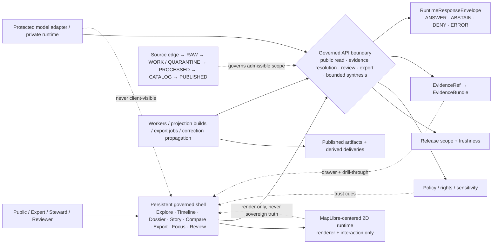

<!-- [KFM_META_BLOCK_V2]
doc_id: kfm://doc/<NEEDS-UUID>
title: Apps Runtime Surfaces
type: standard
version: v1
status: draft
owners: <NEEDS VERIFICATION>
created: <NEEDS VERIFICATION>
updated: 2026-04-01
policy_label: <NEEDS VERIFICATION>
related: [../README.md, ../docs/, ../contracts/, ../schemas/, ../policy/, ../tests/, ../.github/, ../infra/]
tags: [kfm, apps, runtime, governance]
notes: [Revised in the current session against the March 2026 KFM master/UI/geospatial corpus plus the attached repo-grounded summary; contracts/, schemas/, policy/, tests/, and .github are evidenced as repo surfaces in that summary, but a mounted apps/ tree, owners, UUID, policy label, exact child paths, and docs/infra adjacency still require direct repo verification before commit.]
[/KFM_META_BLOCK_V2] -->

# Apps Runtime Surfaces

Boundary README for KFM runtime-facing app surfaces, shell law, and any colocated app-adjacent lanes under the requested `apps/` root.

**Status:** experimental **(NEEDS VERIFICATION)**  
**Owners:** `<NEEDS VERIFICATION>`  
**Badges:**       
**Quick jump:** [Scope](#scope) · [Repo fit](#repo-fit) · [Accepted inputs](#accepted-inputs) · [Exclusions](#exclusions) · [Directory tree](#directory-tree) · [Quickstart](#quickstart) · [Usage](#usage) · [Runtime diagram](#runtime-diagram) · [Reference tables](#reference-tables) · [Task list](#task-list) · [FAQ](#faq) · [Appendix](#appendix)

| Field | Value |
|---|---|
| Requested path | `apps/README.md` |
| Primary role | Boundary README for runtime-facing application surfaces and any colocated operator lanes |
| Doctrinal source base | Collective March 2026 KFM master, UI, geospatial, verification, atlas, and replacement-grade manuals |
| Strongest runtime-facing anchors | Replacement-grade blueprint/manual; Advanced MapLibre UI Architecture; Unified Geospatial Architecture Manual; repo-grounded research sprint |
| Current repo signal in this session | Attached repo-grounded summary reports visible `contracts/`, `schemas/`, `policy/`, `tests/`, and `.github` documentation/governance surfaces; mounted `apps/` subtree remains **UNKNOWN** |
| Current direct inspection boundary | Filesystem inspection in this run exposed attached PDFs only; no mounted KFM checkout, app tree, manifests, workflow YAML inventory, or runtime logs were directly visible |
| Adjacent roots | `../contracts/`, `../schemas/`, `../policy/`, `../tests/`, and `../.github/` have source support as repo surfaces; `../docs/` and `../infra/` still **NEED VERIFICATION** in a mounted tree |

> [!IMPORTANT]
> This README is intentionally source-bounded. In the current session, the strongest directly inspectable evidence was the attached March 2026 KFM PDF corpus plus direct filesystem inspection, with one attached repo-grounded summary adding limited repository signals. Exact child paths, package names, manifests, commands, owners, and deployment lanes stay **UNKNOWN**, **PROPOSED**, or **NEEDS VERIFICATION** until a live repo tree is directly inspected.

---

## Scope

`apps/` is where KFM’s governing law becomes visible product behavior.

This boundary is not just “frontend code.” Across the March 2026 KFM corpus, runtime surfaces are part of the evidence chain, part of the trust membrane, and part of governed publication. The durable requirement is therefore not one folder shape. It is the architectural law that outward surfaces remain downstream of governed APIs, release scope, evidence resolution, policy mediation, and correction state.

### Surface families this boundary must support

| Surface family | What belongs here | Confidence |
|---|---|---|
| Persistent governed shell | Explore, Timeline, Dossier, Story, Compare, Export, Focus, and Review as one map-first/time-aware shell family | **CONFIRMED doctrine / UNKNOWN mounted realization** |
| Public-read lane | Public-safe released map, timeline, dossier, story, compare, export, and bounded Focus requests | **CONFIRMED doctrine / PROPOSED local placement** |
| Steward / reviewer lane | Review, denial, approval, rollback, correction, and role-gated stewardship over the same shell law | **CONFIRMED doctrine / PROPOSED local placement** |
| API mediation lane | Route families grouped by trust obligation rather than by screen whim | **CONFIRMED doctrine / UNKNOWN mounted topology** |
| Worker / workflow lane | Projection builds, export jobs, validation helpers, correction propagation, and app-adjacent orchestration if colocated | **CONFIRMED need / NEEDS VERIFICATION locally** |
| CLI / operator lane | Local verification, diagnostics, proof-pack assembly, or narrow runtime-adjacent tooling if colocated | **PROPOSED** |
| App-local docs, fixtures, and tests | Child READMEs, route docs, accessibility checks, reduced-motion coverage, deep-link tests, export trust-cue checks, Focus negative-path coverage, and surface-state tests | **CONFIRMED need / UNKNOWN mounted inventory** |

### Stable laws carried into this boundary

- **CONFIRMED:** KFM is map-first and time-aware.
- **CONFIRMED:** place and time are coequal operating controls.
- **CONFIRMED:** the Evidence Drawer is mandatory for consequential claims.
- **CONFIRMED:** Focus is evidence-bounded and must not drift into a detached assistant tab.
- **CONFIRMED:** review is a shell variation, not a second truth regime.
- **CONFIRMED:** public and ordinary steward clients cross governed APIs instead of touching canonical stores or model runtimes directly.
- **CONFIRMED:** 2D is the default authoritative shell; 3D is optional and burden-bearing.
- **CONFIRMED:** outward runtime behavior must support accountable negative states.

### What this README is not

This file is a **boundary document**, not proof that the mounted repo currently contains any specific child directory, router, package manager, framework, deployment overlay, DTO set, or service layout.

It does **not** prove:

- the literal subtree under `apps/`
- the existence of `web`, `review`, `api`, `workers`, or `cli` directories
- the current React, routing, bundling, or workspace toolchain
- the current OpenAPI inventory or contract registry
- the current CI lane names, auth stack, or deployment profiles
- the presence of any already-shipping UI implementation

[Back to top](#apps-runtime-surfaces)

---

## Repo fit

This file documents the runtime boundary law first and the mounted tree second.

### Boundary-first rule

1. app/runtime surfaces stay downstream of promoted release scope  
2. evidence remains drill-through capable at point of use  
3. policy and review state remain visible in outward experience  
4. runtime assistance stays subordinate to evidence, policy, and release state  
5. exact mounted paths stay provisional until the repo tree is directly inspected

### Requested path, upstream context, and downstream fit

| Relationship | Current best fit | Confidence |
|---|---|---|
| Requested directory README | `apps/README.md` | **Requested by task / local path NEEDS VERIFICATION** |
| Repo root context | `[../README.md](../README.md)` | **Plausible / NEEDS VERIFICATION** |
| Shared contract surfaces | `[../contracts/](../contracts/)` · `[../schemas/](../schemas/)` | **CONFIRMED as repo surfaces in attached repo-grounded summary** |
| Shared policy surface | `[../policy/](../policy/)` | **CONFIRMED as repo surface in attached repo-grounded summary** |
| Shared test / governance surface | `[../tests/](../tests/)` · `[../.github/](../.github/)` | **CONFIRMED as repo surface or governance scaffolding in attached repo-grounded summary** |
| Adjacent docs / infra | `../docs/` · `../infra/` | **NEEDS VERIFICATION** |
| Downstream child READMEs | `apps/*/README.md` or sibling `services/*/README.md` / `workers/*/README.md` | **UNKNOWN** |

### Current repo signals worth preserving

| Root or surface | What the current session supports | What `apps/` should assume |
|---|---|---|
| `contracts/` | Present as a repo documentation surface in the attached repo-grounded summary | app/runtime payloads should consume shared contracts rather than fork them locally |
| `schemas/` | Present as a repo documentation surface in the attached repo-grounded summary | machine-checkable schemas should stay centralized and reviewable |
| `policy/` | `policy/README.md` is reported present in the attached repo-grounded summary | app surfaces render policy consequences but are not the sovereign policy engine |
| `tests/` | A tests-intent README is reported present in the attached repo-grounded summary | surface-state, negative-path, accessibility, and export-trust tests should align with broader verification surfaces |
| `.github/` | Governance scaffolding is reported present; active workflow YAML merge gates remain unverified | app changes should fit the repo’s governance posture even when concrete workflow inventory is still unknown |
| `apps/` subtree | No mounted `apps/` tree was directly exposed in this run | keep child path claims provisional and reversible |

### What `apps/` should do

| `apps/` should do | Why it matters |
|---|---|
| House runtime-facing public, expert, and steward surfaces | Keeps visible product surfaces distinct from shared law and canonical storage |
| Preserve one shell identity across modes | Prevents app-to-app truth drift |
| Remain map-native and time-aware | Keeps geography and chronology primary |
| Consume governed APIs and shared contracts | Prevents the browser from becoming a truth authority |
| Keep shell continuity state distinct from trust-bearing state | Preserves navigation continuity without moving authority into the client |
| Surface trust cues at point of use | Makes release basis, evidence route, policy posture, and correction state legible |

### What `apps/` must not become

| `apps/` must **not** become | Why it is blocked |
|---|---|
| A detached assistant tab | Breaks map, time, and evidence continuity |
| A hidden second admin product with different truth rules | Violates review-as-shell-variation doctrine |
| A default browser path into canonical stores or model runtimes | Violates the trust membrane |
| A layer where tiles, summaries, scenes, or embeddings quietly become sovereign truth | Breaks authoritative-versus-derived separation |
| A spectacle-first 3D shell | Conflicts with KFM’s 2D-first posture |
| A place where business law hides in build glue or deployment scripts | Makes review and correction harder |

[Back to top](#apps-runtime-surfaces)

---

## Accepted inputs

Accepted inputs in `apps/` are the ones that make KFM’s governed surfaces buildable **without moving authority into the wrong layer**.

| Accepted input | What belongs here | Confidence |
|---|---|---|
| Shell composition | Map shell, timeline choreography, dossier/story layout, compare, export, Focus, review, trust chips, and Evidence Drawer launch points | **CONFIRMED doctrine** |
| Shell continuity state | Selected geography, active time scope, active layers, compare anchors, open panels, deep-link rehydration, saved-view hydration | **CONFIRMED doctrine / exact store UNKNOWN** |
| Trust-visible rendering | Freshness cues, policy chips, review chips, AI badge, correction markers, calm failure states, generalization markers | **CONFIRMED doctrine** |
| App-facing contract consumers | Shell-state contract, Evidence Drawer payload, dossier payload, Focus envelope, layer metadata contract, surface-state registry bindings | **CONFIRMED need / exact files PROPOSED** |
| Governed route consumers | Public read, review, export, comparison, evidence resolution, and bounded synthesis route families as consumed through governed APIs | **CONFIRMED doctrine / exact mounted names UNKNOWN** |
| Review overlays | Reviewer queues, diff views, denial/approval actions, rollback visibility, correction workflows, role-gated controls | **CONFIRMED doctrine / mounted realization UNKNOWN** |
| App-local tests and fixtures | E2E shell flows, keyboard continuity, reduced-motion behavior, Evidence Drawer drill-through, export-preview trust cues, Focus negative outcomes, and surface-state tests | **CONFIRMED need / mounted inventory UNKNOWN** |
| Colocated API / workers / CLI | Only if the live repo actually places those lanes beneath `apps/` | **NEEDS VERIFICATION** |

### Every serious surface should expect these inputs

| Input class | Why the surface needs it |
|---|---|
| Place and geometry scope | Prevents detached narrative or dashboard drift |
| Time basis | Keeps claims tied to declared chronology |
| Release and freshness basis | Makes current, stale, superseded, or historical scope visible |
| EvidenceRef / EvidenceBundle handles | Keeps consequential claims inspectable rather than citation-shaped |
| Policy and rights posture | Keeps generalization, withholding, review-required, and restricted states visible |
| Runtime outcome state | Keeps **ANSWER**, **ABSTAIN**, **DENY**, and **ERROR** explicit and testable |

[Back to top](#apps-runtime-surfaces)

---

## Exclusions

`apps/` must not become a shadow source of truth.

| Does **not** belong here | Put it under | Why |
|---|---|---|
| RAW / WORK / QUARANTINE / canonical truth ownership | governed data and lifecycle lanes | surfaces consume approved outputs; they do not own the truth path |
| Contract or schema source of truth | shared `contracts/` / `schemas/` roots | machine-checkable interfaces should stay centralized and reviewable |
| Policy bundles and decision registries | shared `policy/` root | policy must remain executable and independently governable |
| Shared domain / evidence / policy logic | shared packages or equivalent | prevents app-to-app drift and hidden business law in UI code |
| Direct model-runtime exposure | protected runtime boundary behind governed APIs | keeps Focus subordinate to evidence and policy |
| Direct client access to DB or object storage | nowhere in normal public flow | explicit trust-membrane violation |
| Hidden review state | review shell variation and governed review routes | preserves visible accountability |
| Default 3D showcase lanes | controlled burden-bearing route only after 2D trust model is proven | spectacle does not outrank inspectability |
| Business law hidden in scripts or deployment manifests | packages, contracts, policy, or workers | keeps authority seams reviewable |

> [!WARNING]
> Stable anti-patterns remain stable even when folder names are unknown: direct browser-to-store access, detached AI panes, hidden time semantics, decorative evidence, policy-only-in-frontend behavior, silent export stripping, and “temporary” bypasses that become the default path.

[Back to top](#apps-runtime-surfaces)

---

## Directory tree

Because the mounted repo tree was not available in this session, this section separates **visible repo signals** from **candidate runtime topologies**.

### What is actually evidenced right now

```text
<confirmed-by-attached-repo-grounded-summary>
.github/           # governance scaffolding exists; active workflow YAML inventory still unknown
contracts/         # documentation surface confirmed
policy/            # documentation surface confirmed
schemas/           # documentation surface confirmed
tests/             # intent/documentation surface confirmed

<not-directly-mounted-in-this-session>
apps/              # requested target root, but child inventory unknown
docs/              # plausible root; direct tree needs verification
infra/             # plausible root; direct tree needs verification
services/          # unknown
workers/           # unknown
packages/          # unknown
```

### Variant A — requested `apps/`-first runtime grouping

This matches the user-requested file placement and one plausible KFM runtime grouping, but it remains **PROPOSED** until the mounted tree is inspected.

```text
apps/
├─ README.md
├─ web/                         # PROPOSED: persistent public/expert shell
├─ review/                      # PROPOSED: role-gated steward shell variation
├─ api/                         # PROPOSED: governed API if colocated here
├─ workers/                     # PROPOSED: app-adjacent jobs if colocated here
└─ cli/                         # PROPOSED: local/operator tooling if colocated here
```

### Variant B — split surface / service / worker adjustment

This reflects the corpus-wide possibility that `apps/` holds only visible shells while API and worker lanes live in sibling roots.

```text
apps/
├─ README.md
├─ web/                         # PROPOSED: trust-visible public/expert shell
└─ review/                      # PROPOSED: steward/reviewer shell variation

services/
├─ api/                         # PROPOSED: governed outward/internal routes
├─ catalog/                     # PROPOSED
├─ evidence/                    # PROPOSED
└─ release/                     # PROPOSED

workers/
├─ connectors/                  # PROPOSED
├─ validation/                  # PROPOSED
└─ projections/                 # PROPOSED

tests/
├─ contract/                    # CONFIRMED root signal; exact children UNKNOWN
├─ policy/
├─ ui/
└─ fixtures/
```

> [!NOTE]
> The March 2026 corpus settles the **boundary law**, not one mounted subtree. If the live repo uses a different shape, keep the law, update the paths, and remove whichever variant is unreal.

### Expected local README coverage

| Candidate path | Expected role | Confidence |
|---|---|---|
| `apps/README.md` | boundary README for app/runtime surfaces | **this file / requested target** |
| `apps/web/README.md` | persistent shell, shell continuity, trust-visible UX, map/timeline behavior | **PROPOSED** |
| `apps/review/README.md` | reviewer/steward overlays, approval/denial, rollback, correction flows | **PROPOSED** |
| `apps/api/README.md` or `services/api/README.md` | route families, trust obligations, outward payload families | **PROPOSED** |
| `apps/workers/README.md` or `workers/README.md` | job split, proof artifacts, correction propagation, projection rebuilds | **PROPOSED** |
| `apps/cli/README.md` or `cli/README.md` | operator/local tooling, verification commands, diagnostics | **PROPOSED** |

### Merge-time collapse rule

1. inspect the mounted repo tree  
2. keep only the topology that actually exists  
3. replace candidate paths with confirmed relative links  
4. downgrade any path claim that stays unverified to explicit TODO text  
5. remove the unused variant instead of blending both into false certainty

[Back to top](#apps-runtime-surfaces)

---

## Quickstart

These commands are **verification-first** and read-only. Run them from the repo root once the live repository is mounted.

```bash
# 1) Identify the repo revision and surface likely runtime and governance roots
git rev-parse HEAD 2>/dev/null || true
find . -maxdepth 2 \
  \( -type d \( -name apps -o -name services -o -name workers -o -name contracts -o -name schemas -o -name policy -o -name tests -o -name .github \) \) \
  2>/dev/null | sort
```

```bash
# 2) Find nearby READMEs, manifests, and workspace wiring
find . -maxdepth 4 \
  \( -name 'README.md' -o -name 'package.json' -o -name 'pnpm-workspace.yaml' -o -name 'turbo.json' -o -name 'nx.json' -o -name 'pyproject.toml' -o -name 'Dockerfile' \) \
  2>/dev/null | sort
```

```bash
# 3) Inspect app-facing contracts, policy surfaces, and route/test signals
find . -maxdepth 5 \
  \( -path '*/contracts/*' -o -path '*/schemas/*' -o -path '*/policy/*' -o -path '*/apps/*' -o -path '*/services/*' -o -path '*/workers/*' -o -path '*/tests/*' \) \
  \( -name '*.json' -o -name '*.yaml' -o -name '*.yml' -o -name '*.rego' -o -name '*.md' -o -name '*.ts' -o -name '*.tsx' \) \
  2>/dev/null | sort | head -n 300
```

```bash
# 4) Search for trust-critical vocabulary that should anchor app/runtime behavior
grep -RInE 'EvidenceBundle|EvidenceRef|Evidence Drawer|RuntimeResponseEnvelope|Focus|ABSTAIN|DENY|shell_state|dossier|review|compare|export|surface_state' \
  apps services workers contracts schemas policy tests docs 2>/dev/null | head -n 300
```

```bash
# 5) Locate app-facing tests, fixtures, accessibility checks, and reduced-motion coverage
find apps services workers tests -maxdepth 5 \
  \( -path '*/test*' -o -path '*/tests/*' -o -name '*spec*' -o -name '*e2e*' -o -name '*a11y*' -o -name '*fixture*' -o -name '*motion*' -o -name '*focus*' -o -name '*drawer*' \) \
  2>/dev/null | sort
```

> [!NOTE]
> This README intentionally avoids install, dev-server, lint, and deploy commands. The live repo tree and manifests were not directly visible in this session, so real boot steps should only be added after direct repository inspection.

[Back to top](#apps-runtime-surfaces)

---

## Usage

Treat `apps/` as the place where KFM’s governing law becomes visible product behavior.

### Operating law

1. app surfaces read through governed APIs only  
2. consequential claims stay one hop from inspectable evidence  
3. review and stewardship remain shell variations, not detached admin products  
4. shell continuity state stays distinct from trust-bearing backend state  
5. negative states are first-class and remain visible  
6. the shell stays 2D-first unless a specific 3D burden is explicitly justified

### State ownership

| State class | Primary owner | Why |
|---|---|---|
| Shell continuity state | Persistent shell store | Preserves geography, time scope, active layers, selected subjects, compare anchors, and panel continuity |
| Ephemeral local interaction state | Local component where harmless | Hover previews, input drafts, transient menus, reversible affordances |
| Trust-bearing state | Governed APIs and backend registries | Evidence state, policy state, review state, freshness, release truth, and correction lineage must not become browser truth |
| Persisted user products | Governed services | Saved views, export manifests, review tasks, and compare snapshots should rehydrate through current policy and release mediation |
| Forbidden client truth | No browser ownership allowed | Canonical data, unpublished artifacts, policy decisions, promotion state, precise restricted geometry, and model-runtime internals |

### Shell regions worth preserving

| Region | Primary responsibility |
|---|---|
| Top command bar | Search, mode switching, scope badges, saved views, role context, alerts |
| Left rail | Layers, domains, filters, compare controls, story chapter lists, review entry points for authorized roles |
| Map canvas | Primary geography surface, selection anchor, story playback, evidence launch point |
| Bottom timeline rail | Valid-time framing, playback, compare anchors, as-of inspection, visible chronology |
| Right inspection stack | Summary cards, dossier panels, story context, Focus, Evidence Drawer, and steward controls |
| Utility tray | Legend, accessibility controls, reduced-motion toggles, export helpers, diagnostics, and other low-priority utilities |

### Trust-visible cues apps must surface

| Cue | Meaning | Typical placement |
|---|---|---|
| Scope chip | Active place, time, layer, or role boundary | top bar, Focus, compare, export preview |
| Freshness cue | Release age, recency basis, or stale warning | summary cards, dossier, story, Focus, export |
| Policy chip | public-safe, restricted, generalized, redacted, or review-required posture | claim headers, layer panels, export preview |
| Review chip | draft, quarantined, reviewed, promoted, current, stale, withdrawn, or superseded state | dossier, story, review, export |
| Knowledge marker | observed, documentary, derived, modeled, generalized, or source-dependent character | summaries, compare, dossiers, Focus |
| AI badge | model-assisted synthesis present | Focus and any generated narrative surface |
| Correction marker | replacement, narrowing, correction, supersession, or withdrawal | dossier, story, exported artifacts |

> [!TIP]
> The first strong release should not be a broad dashboard set. It should prove one real hydrology-first lane with shell continuity, timeline behavior, Evidence Drawer reachability, dossier/story choreography, Focus finite outcomes, review variation, compare, and export trust cues—while leaving 3D as a later burden-bearing decision.

[Back to top](#apps-runtime-surfaces)

---

## Runtime diagram


```mermaid
flowchart LR
    User[Public / Expert / Steward / Reviewer] --> Shell[Persistent governed shell<br/>Explore · Timeline · Dossier · Story · Compare · Export · Focus · Review]

    Shell --> MapRuntime[MapLibre-centered 2D runtime<br/>renderer + interaction only]
    Shell --> API{Governed API boundary<br/>public read · evidence resolution · review · export · bounded synthesis}

    API --> Release[Release scope + freshness]
    API --> Policy[Policy / rights / sensitivity]
    API --> Evidence[EvidenceRef → EvidenceBundle]
    API --> Runtime[RuntimeResponseEnvelope<br/>ANSWER · ABSTAIN · DENY · ERROR]

    Canonical[Source edge → RAW → WORK / QUARANTINE → PROCESSED → CATALOG → PUBLISHED] -. governs admissible scope .-> API
    Workers[Workers / projection builds / export jobs / correction propagation] --> Published[Published artifacts + derived deliveries]
    Workers --> API

    Model[Protected model adapter / private runtime] --> API
    Model -. never client-visible .-> Shell

    MapRuntime -. render only, never sovereign truth .-> Shell
    Evidence -. drawer + drill-through .-> Shell
    Policy -. trust cues .-> Shell
```

Above: app surfaces sit at the visible trust edge, but remain downstream of release scope, policy mediation, evidence resolution, and protected runtime boundaries. Exact mounted topology remains **UNKNOWN** until the repo tree is directly inspected.

[Back to top](#apps-runtime-surfaces)

---

## Reference tables

### Route-family obligations

| Route family | What it serves | Boundary note |
|---|---|---|
| Catalog and discovery | release metadata, dataset discovery, distribution lists, outward catalog closure | identifier and closure consistency must resolve cleanly |
| Feature / subject read | released authoritative features, place dossiers, detail views, contextual summaries | stable subject ID, support/time semantics, rights posture, and release scope are mandatory |
| Map / tile / portrayal | released maps, tiles, legends, styles, and portrayals | must inherit release linkage, policy posture, freshness, and correction state |
| Evidence resolution | `EvidenceRef -> EvidenceBundle` and related trust objects | every bundle must resolve to admissible published scope with visible rights/sensitivity state |
| Story / dossier / compare | narrative and comparison inputs anchored in the same shell | must preserve spatial anchor, temporal anchor, and evidence drill-through |
| Export and report | public-safe exports, previews, and packaged outward artifacts | exports never outrun release state, policy posture, or correction linkage |
| Focus / bounded synthesis | governed natural-language investigation over released scope | scope, citations, policy, and audit linkage remain visible in the same pane |
| Review action | moderation, quarantine inspection, approval, denial, rollback, rights handling | internal governed routes only; no hidden approvals |
| Release action | promotion, withdrawal, supersession, proof-pack completion, outward exposure control | only applies here if release/governed API behavior is colocated under or adjacent to app runtime lanes |
| Ops / status | health, status, metrics, traces, audit joins | must not become a second truth surface |

### Contract starter set this boundary still expects

| Artifact | Why it matters first | Confidence |
|---|---|---|
| Shell-state contract | stabilizes geography / time / mode / compare / selection continuity across surfaces | **CONFIRMED need / PROPOSED artifact** |
| Evidence Drawer payload | keeps provenance, rights, review, freshness, and audit fields out of ad hoc view logic | **CONFIRMED need / PROPOSED artifact** |
| Dossier payload | stabilizes the durable place- or feature-centered decision object | **CONFIRMED need / PROPOSED artifact** |
| Focus envelope / RuntimeResponseEnvelope | normalizes finite outcomes and evidence linkage for governed synthesis | **CONFIRMED need / PROPOSED artifact** |
| Layer metadata contract | keeps business meaning, policy, freshness, review, and time semantics outside style JSON | **CONFIRMED need / PROPOSED artifact** |
| Surface-state registry | keeps user-visible trust states stable across shell, exports, and runtime | **CONFIRMED need / PROPOSED artifact** |
| Route-family registry | prevents undocumented side routes and makes auth/policy review tractable | **CONFIRMED need / PROPOSED artifact** |

### Runtime outcomes and user-visible trust states

| State / outcome | Meaning | App consequence |
|---|---|---|
| ANSWER | evidence-backed response emitted | show citations, scope echo, audit ref, and trust cues |
| ABSTAIN | support is insufficient for a governed answer | keep shell context, show reason, and offer safe next actions |
| DENY | policy or rights block the request | keep shell context, show reason or obligation code |
| ERROR | technical failure blocked governed handling | calm failure, preserve navigation continuity, expose audit ref where possible |
| GENERALIZED | surface intentionally reduced precision or detail | show explicit generalization cue |
| RESTRICTED | narrower role context required | show role/policy cue, not silent omission |
| STALE | artifact or response exceeds desired freshness basis | show visible stale marker, not silent continuation |
| SUPERSEDED / WITHDRAWN | previously visible item changed lineage or was removed | preserve lineage and reason visibly |

### Verification snapshot

| Item | Current label | What to verify next |
|---|---|---|
| Map-first persistent shell law | **CONFIRMED** | keep aligned with March 2026 master/UI/geospatial corpus |
| Requested `apps/` subtree | **UNKNOWN** | inspect mounted repo tree and manifests |
| Exact child lane names | **UNKNOWN** | confirm whether runtime lanes use an `apps/`-first or split surface/service/worker model |
| Contract file inventory | **UNKNOWN** | inspect `contracts/` and `schemas/` for shell, drawer, dossier, Focus, and layer metadata artifacts |
| Route inventory and OpenAPI mapping | **UNKNOWN** | surface the actual route-family registry or OpenAPI specs |
| UI acceptance suite | **UNKNOWN** | locate E2E, accessibility, reduced-motion, and negative-state tests |
| Repo governance scaffolding | **CONFIRMED in attached repo-grounded summary** | verify live `.github/`, `tests/`, and policy gates directly in mounted repo |
| Hydrology-first thin slice | **CONFIRMED priority / UNKNOWN implementation depth** | verify one end-to-end release-backed lane through surface and correction |

[Back to top](#apps-runtime-surfaces)

---

## Task list

### Definition of done for this README

- [ ] verify the live `apps/`, `services/`, `workers/`, `contracts/`, `schemas/`, `policy/`, and `tests/` subtree
- [ ] replace candidate upstream and downstream paths with confirmed relative links
- [ ] confirm whether API mediation is colocated under `apps/` or split into a sibling service root
- [ ] confirm whether any worker or CLI lane truly belongs under `apps/`
- [ ] populate owners, created date, policy label, and final UUID from authoritative repo evidence
- [ ] link the mounted schema/contract inventory for shell state, Evidence Drawer, dossier, Focus, and layer metadata
- [ ] add real boot, lint, test, and verification commands once manifests are directly visible
- [ ] attach actual acceptance-suite references once they are directly inspectable

### Review gates for app-surface changes

- [ ] no client-to-store or client-to-model bypass introduced
- [ ] map / timeline / evidence continuity preserved across surface transitions
- [ ] every consequential claim still reaches Evidence Drawer drill-through
- [ ] Focus still returns accountable negative outcomes when evidence or policy fails
- [ ] review remains a shell variation, not a detached product
- [ ] generalized, restricted, stale, superseded, withdrawn, denied, abstained, and errored states remain visible
- [ ] export preview still preserves trust cues and correction linkage
- [ ] docs, contracts, fixtures, and accessibility checks change together when trust behavior changes

[Back to top](#apps-runtime-surfaces)

---

## FAQ

### Does `apps/` always include the governed API?

No. The March 2026 corpus is stable on the **boundary behavior**, not on one verified local path. A mounted repo could colocate API mediation under `apps/`, or it could keep it in a sibling service root.

### Is review a separate product?

No. Review and stewardship are shell variations with stronger role and policy consequences, but they remain inside the same geography, time, evidence, and correction model.

### Can Focus become a general-purpose chatbot pane?

No. Focus inherits scope, depends on governed evidence resolution, and emits finite accountable outcomes instead of unconstrained assistant behavior.

### Can app surfaces read canonical stores directly for performance?

No. Performance layers may accelerate delivery, but public and ordinary steward clients still cross the governed API boundary.

### Why is 3D not the default path here?

Because the corpus repeatedly treats disciplined 2D as the default public reasoning surface and places 3D behind a burden rubric. Visual depth is not automatically better evidence.

### Why are there still so many placeholders?

Because this README refuses to promote unverified repo facts into doctrine. Owners, UUID, policy label, exact child paths, exact commands, and actual manifests require direct repository inspection.

[Back to top](#apps-runtime-surfaces)

---

## Appendix

<details>
<summary><strong>Glossary, merge-time checklist, and maintenance note</strong></summary>

### Compact glossary

- **Trust membrane** — the operational boundary requiring public and ordinary client surfaces to cross governed APIs rather than touching canonical or unpublished internals directly.
- **Evidence Drawer** — the mandatory trust surface that turns visible claims into inspectable support.
- **EvidenceBundle** — the resolved support object behind outward claims, previews, exports, and bounded runtime answers.
- **Focus** — governed, evidence-bounded synthesis over admissible released scope.
- **RuntimeResponseEnvelope** — the outward runtime object that normalizes finite outcomes and keeps citations, policy, and audit linkage attached.
- **Shell continuity state** — persistent geography, time, layer, mode, selection, and compare context owned by the shell.
- **Trust-bearing state** — evidence, review, release, policy, freshness, and correction semantics owned by governed services rather than by browser convenience.
- **Review shell variation** — steward behavior preserved inside the same shell law rather than split into a detached epistemic system.
- **Thin slice** — one real lane that proves source admission, validation, release, evidence resolution, surface behavior, and correction without trust gaps.

### Merge-time checklist

1. Collapse the directory section to the single local shape actually in use.
2. Replace candidate child paths with confirmed relative links.
3. Populate the KFM meta block from authoritative repo evidence.
4. Link real contract/schema files once directly visible.
5. Add actual workspace commands only after manifest verification.
6. Keep any remaining uncertainty explicit instead of smoothing it into confident prose.

### Maintenance rule

This README should change when any of the following change materially:

- route-family grammar
- shell-state ownership
- Evidence Drawer or Focus contract expectations
- 2D / controlled-3D posture
- export trust-cue behavior
- colocated lane placement under `apps/`

When one of those changes lands, update this README, adjacent child READMEs, and any route/contract registry docs together.

</details>

[Back to top](#apps-runtime-surfaces)
