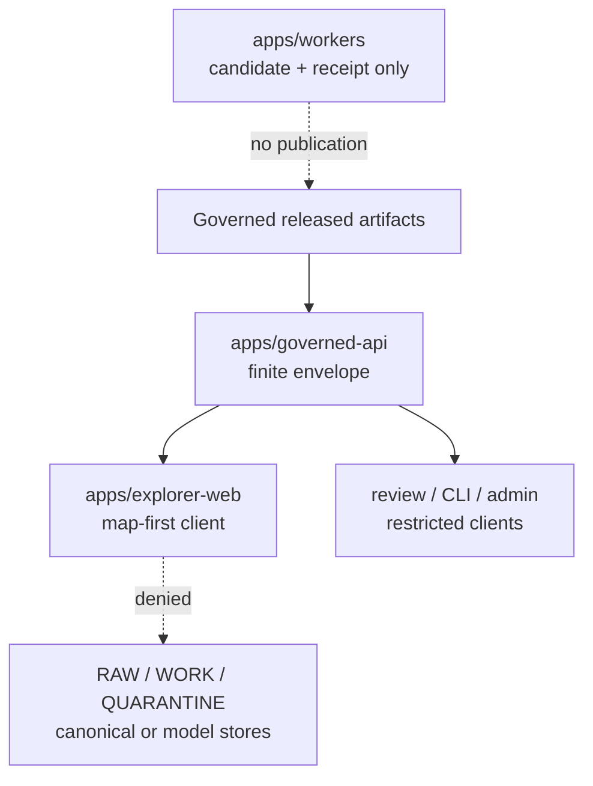

<!-- [KFM_META_BLOCK_V2]
doc_id: kfm://doc/apps-readme
title: apps/ - Deployable Applications
type: root-readme
subtype: canonical-root-landing-page
version: v0.4
prior_version: v0.3
status: draft; repository-grounded; mixed-maturity
owner: "NEEDS VERIFICATION — CODEOWNERS routes all repository paths to @bartytime4life and explicitly routes apps/governed-api/ and apps/explorer-web/; no accepted application-steward assignment, required-review rule, or independent approval control was verified"
created: 2026-05-10
updated: 2026-07-23
policy_label: public
current_path: apps/README.md
owning_root: apps/
responsibility: orient contributors to deployable application boundaries, current app-lane maturity, governed public access, validation, and safe next work
truth_posture: cite-or-abstain
truth_labels: [CONFIRMED, PROPOSED, UNKNOWN, NEEDS VERIFICATION, CONFLICTED]
authority_class: canonical root landing page
authority_rank: implementation orientation subordinate to doctrine, accepted ADRs, contracts, schemas, policy, evidence, lifecycle records, and release records
canonical_relationship: same-path update; no sibling authority created
evidence_snapshot:
  repository: bartytime4life/Kansas-Frontier-Matrix
  base_ref: main
  base_commit: 41ef68b1f8d006419f65bc3092d9d62316b67f2c
  target_prior_blob: 1a84325b87e12d6480eec96bf594867123488948
  prior_convergence_commit: 1433a00bcd67f6c4cf5f2310ed5db3c358eb7d6c
  continuity_compare: 1433a00bcd67f6c4cf5f2310ed5db3c358eb7d6c...41ef68b1f8d006419f65bc3092d9d62316b67f2c
  apps_path_changes_after_prior_convergence: 0
  tracked_app_files: 164
  directory_rules_doctrine_blob: 2affb080e6f0043867c64c7f06c1ca52030fbd55
  directory_rules_architecture_blob: 18653c00ba193a4afaa3e07a0924452807fb98ef
  codeowners_blob: dd2a84aa514d8ecd9208bc347f90f9a2ed37dd61
  adr_index_blob: cf08fae322ac53426f7394d97897fdb942253049
  governed_api_main_blob: bcc8d3a0ddba4b225e962b594d548819df0cbb71
  governed_api_routes_blob: 3418168d0b267160d6ad6dd87f289e880ef4a024
  governed_api_stub_blob: 5d7c137d2e78ddfca35a1356a96333ac2e84952b
  explorer_package_blob: ce981192e725483c747affb45ca3de36a22ce9ce
  api_workflow_blob: 5ec0ff53cc874935ed8ef5de791b70a52635ef33
  ui_workflow_blob: a4fec64dc445b060d334c2ae56886cc814cb0e61
  workflow_model: issue-1531@sha256:289c214b9bbf801db13bfad85dac4e862ae1224bd38ba4fc14361451c839c661
related:
  - ../README.md
  - ../docs/doctrine/directory-rules.md
  - ../docs/architecture/directory-rules.md
  - ../docs/adr/INDEX.md
  - ../docs/adr/ADR-0004-apps-governed-api-is-the-trust-membrane.md
  - ../docs/adr/ADR-0005-apps-explorer-web-is-the-canonical-map-first-shell.md
  - ../docs/adr/ADR-0006-maplibre-boundary--only-maplibreadapter-imports-maplibre.md
  - ../docs/adr/ADR-0019-ai-adapter-contract-and-finite-envelopes.md
  - ../docs/adr/ADR-0025-public-client-never-reads-canonical-internal-stores.md
  - governed-api/README.md
  - explorer-web/README.md
  - review-console/README.md
  - cli/README.md
  - workers/README.md
  - admin/README.md
  - packages/README.md
  - ../packages/README.md
  - ../runtime/README.md
  - ../data/README.md
  - ../release/README.md
  - ../policy/README.md
  - ../schemas/README.md
  - ../contracts/README.md
  - ../tests/README.md
  - ../data/receipts/generated/genrec-apps-readme-modernization-20260723-001.json
tags: [kfm, apps, deployables, trust-membrane, governed-api, explorer-web, finite-outcomes, mixed-maturity]
notes:
  - "v0.4 is a same-path evidence refresh of v0.3. It preserves the seven app lanes, exact maturity distinctions, trust-membrane rules, validation surface, gaps, and safe-change guidance."
  - "The 164-file inventory is carried forward from the v0.3 recursive scan and revalidated by a zero-app-path compare from the prior convergence commit through the current base commit."
  - "Two distinct Directory Rules files remain in the repository at different blob SHAs. This README records that documentation conflict and does not treat either duplicate path as an accepted placement decision."
  - "No application code, route, dependency, lockfile, workflow, data, policy, release, deployment, promotion, or publication behavior changes in this documentation revision."
[/KFM_META_BLOCK_V2] -->

# Deployable Applications

`apps/`

**Canonical home for KFM deployables, with the Governed API as the public trust membrane and every client, worker, operator, and administrative surface constrained by evidence, policy, release, correction, and rollback.**

**Quick navigation:** [Purpose](#purpose) · [Authority](#authority-level) · [Status](#status) · [Belongs](#what-belongs-here) · [Exclusions](#what-does-not-belong-here) · [Inputs](#inputs) · [Outputs](#outputs) · [Validation](#validation) · [Review](#review-burden) · [Related](#related-folders) · [ADRs](#adrs) · [Last reviewed](#last-reviewed) · [Evidence](#evidence-ledger) · [App map](#current-app-map) · [Gaps](#verified-gaps-and-next-work)

> [!IMPORTANT]
> `apps/` is an implementation root, not a truth, schema, contract, policy, lifecycle-data, evidence, proof, receipt, or release authority. A running app, successful request, rendered map, passing test, badge, or generated answer does not promote data or authorize publication.

> [!CAUTION]
> Public and semi-public clients use `apps/governed-api/`. They must not read RAW, WORK, QUARANTINE, PROCESSED, candidate, canonical, internal, or direct model-runtime stores. Missing evidence, policy support, or release closure resolves to `ABSTAIN`, `DENY`, or `ERROR`, not invented certainty.

> [!WARNING]
> **Directory Rules identity is unresolved.** [`docs/doctrine/directory-rules.md`](../docs/doctrine/directory-rules.md) and [`docs/architecture/directory-rules.md`](../docs/architecture/directory-rules.md) are distinct live files at different blob SHAs. Both describe `apps/` as the deployable root and require the folder-README contract, but no accepted ADR resolving the duplicate placement was verified. Treat the pair as `CONFLICTED` documentation, not two independent authorities.

---

## Purpose

`apps/` owns deployable application composition for Kansas Frontier Matrix. It is where app-local entry points, routes, user interfaces, operator commands, background runners, app-local tests, and deployable wiring belong.

The root has seven current lanes:

- `governed-api/` — bounded public trust membrane;
- `explorer-web/` — map-first public and semi-public client;
- `review-console/` — steward review surface;
- `cli/` — restricted operator command surface;
- `workers/` — non-publishing background runners;
- `admin/` — restricted administrative surface;
- `packages/` — documented drift guard, not a shared-package authority.

## Authority level

**Canonical deployable-application root / implementation-bearing / non-sovereign.**

Directory Rules classifies `apps/` as the home for deployable systems and names `apps/governed-api/` as the public trust path. The same rules reserve shared libraries for `packages/`, runtime adapters for `runtime/`, deployment posture for `infra/`, configuration defaults for `configs/`, and lifecycle/release objects for their own roots.

The root owns deployable composition. It does not own:

- the meaning of an object (`contracts/`);
- its machine-checkable shape (`schemas/`);
- allow, deny, restrict, or abstain decisions (`policy/`);
- canonical lifecycle state (`data/`);
- release, correction, withdrawal, or rollback decisions (`release/`);
- shared reusable implementation (`packages/`);
- model/provider integration exposed directly to clients (`runtime/`);
- source admission or acquisition (`connectors/`);
- pipeline transformation authority (`pipelines/`, `pipeline_specs/`);
- deployment, network, host, or secret authority (`infra/`, external secret stores).

> [!NOTE]
> `CODEOWNERS` is review routing only. It is not a stewardship assignment, approval record, policy decision, release authority, or proof that review occurred.

## Status

**Draft / repository-grounded / mixed maturity.**

The current-state claims below are pinned to `main@41ef68b1f8d006419f65bc3092d9d62316b67f2c`. The prior v0.3 convergence commit was `1433a00bcd67f6c4cf5f2310ed5db3c358eb7d6c`; the compare from that commit through the current base contains no changed path under `apps/`. Current claims therefore combine the prior recursive app inventory with direct current-file verification. They do not describe a deployed system or current production health.

### Evidence boundary

| Claim | Truth | Evidence | Limitation |
|---|---|---|---|
| `apps/` contains 164 tracked files: this README plus 163 files across seven child lanes. | CONFIRMED | v0.3 recursive inventory plus zero-app-path compare through the current base | Does not inspect ignored files or deployments. |
| Governed API exposes `/bootstrap`, `/layers`, and `/evidence` through a small WSGI application. | CONFIRMED | Current `governed-api/src/governed_api/main.py` and route registry | All three routes are fail-closed scaffolds, not domain data APIs. |
| Those three routes return schema-checked `ABSTAIN` envelopes with `NOT_IMPLEMENTED`. | CONFIRMED | Current `governed-api/src/governed_api/stub.py` and prior verified route tests | Does not prove `ANSWER`, authorization, evidence resolution, deployment, or load behavior. |
| API boundary tests reject unknown routes, non-GET methods, forbidden runtime imports, and internal-store path literals. | CONFIRMED | Prior verified test inventory, unchanged app tree, and current API workflow wiring | Static/bounded tests do not prove network, auth, observability, or production isolation. |
| Explorer Web has 48 TypeScript/TSX files across the app, but its implementation modules are placeholders and its package scripts echo `TODO`. | CONFIRMED | v0.3 recursive inventory, zero-app-path compare, and current `explorer-web/package.json` | A documented route or feature name is not implemented behavior. |
| Explorer Web build/test CI fails closed until real scripts, an exact pnpm pin, and `pnpm-lock.yaml` exist. | CONFIRMED | Current `.github/workflows/ui-build.yml` and package manifest | This is a readiness gate, not proof that the future UI design is accepted. |
| Review Console, CLI, Workers, and Admin are scaffolded or documentation-led. | CONFIRMED | Prior child-manifest/source inventory plus zero-app-path compare | No production readiness is claimed. |
| `@bartytime4life` is the current GitHub review route. | CONFIRMED | Current `.github/CODEOWNERS` default plus explicit Governed API and Explorer routes | CODEOWNERS routing is not proof of stewardship, required review, or completed review. |
| All 28 numbered ADRs, including app-related ADRs, remain effectively `proposed`. | CONFIRMED | Current `docs/adr/INDEX.md` | Proposed design language does not upgrade scaffolds to implemented behavior. |
| Directory Rules has one resolved canonical path. | CONFLICTED | Two distinct live files at different blob SHAs | Requires governed identity/placement resolution. |
| Deployment, dashboards, audit sinks, live authorization, service health, and public operation are established. | UNKNOWN | No admissible operational evidence in this snapshot | Verify separately from deployed infrastructure and logs. |

### Current app map

| Lane | Tracked files | Current implementation truth | Verified entrypoint or hold | Failure-safe posture |
|---|---:|---|---|---|
| `governed-api/` | 27 | Bounded executable WSGI + three fail-closed routes + two test modules | `make governed-api-dev`; `make governed-api-smoke`; `api-test` | `ABSTAIN`, 404, or 405; no renderer/model/internal-store imports |
| `explorer-web/` | 87 | Source and feature tree present; implementation remains placeholder-only | `ui-build` reports readiness failure until scripts/pin/lock exist | Do not render or claim a functional client |
| `review-console/` | 11 | README-led feature scaffolds plus a minimal package manifest | No accepted build/test command | No review, promotion, correction, or rollback mutation is proven |
| `cli/` | 16 | Python package skeleton; entrypoint and command modules are placeholders | Running the module prints a greenfield placeholder | No operator shortcut is release authority |
| `workers/` | 18 | Eight named worker entrypoints are comment-only placeholders | No accepted worker command, queue, schedule, or test | Watcher-as-non-publisher remains mandatory |
| `admin/` | 2 | README-only app boundary | No executable admin surface | Restricted by default; not a public path |
| `packages/` | 2 | README + `.gitkeep` drift guard | No package or workspace activation | Must not become a shadow of top-level `packages/` |

### Workflow position

```mermaid
flowchart TD
    release["Governed released artifacts"] --> api["apps/governed-api<br/>finite envelope"]
    api --> explorer["apps/explorer-web<br/>map-first client"]
    api --> internal["review / CLI / admin<br/>restricted clients"]
    workers["apps/workers<br/>candidate + receipt only"] -. "no publication" .-> release
    explorer -. "denied" .-> stores["RAW / WORK / QUARANTINE<br/>canonical or model stores"]
```

Only the Governed API's bounded fail-closed slice is currently executable within this diagram. Release assembly, client behavior, internal app mutation, worker execution, and deployment remain held, placeholder, or unverified.

## What belongs here

- App-local source and entry points for a deployable service, web client, console, CLI, worker process, or restricted admin surface.
- App-local route registration and handler composition that consume external contracts and schemas without redefining them.
- App-local UI composition that uses shared packages and governed APIs.
- App-local tests and fixtures whose scope is limited to one deployable.
- App-local non-secret examples and operator notes that do not replace `configs/`, `infra/`, or runbooks.
- Deployable packaging metadata when it does not create a second shared-package, policy, schema, or release authority.

## What does NOT belong here

| Prohibited content | Canonical home | Why |
|---|---|---|
| Reusable libraries | `packages/` | Shared behavior must not be hidden inside one deployable. |
| Runtime/model adapters | `runtime/` | Providers remain subordinate to the Governed API. |
| Contracts and JSON Schemas | `contracts/`, `schemas/` | Meaning and machine shape have separate authority roots. |
| Rego, access rules, or release policy | `policy/` | Apps apply policy; they do not define policy authority. |
| RAW, WORK, QUARANTINE, PROCESSED, catalog, graph, or published objects | `data/` | Lifecycle state never lives in app source. |
| EvidenceBundles, proofs, and receipts | `data/proofs/`, `data/receipts/` | Trust-supporting records require governed homes. |
| Release manifests, decisions, corrections, and rollback cards | `release/` | App actions do not become publication decisions. |
| Source fetchers and admitters | `connectors/` | Availability and acquisition are not app authority. |
| Pipeline logic and declarative specs | `pipelines/`, `pipeline_specs/` | Lifecycle transformations remain outside deployables. |
| Deployment, ingress, firewall, and host definitions | `infra/` | Exposure posture is reviewed separately. |
| Credentials, tokens, private endpoints, signing material, protected payloads | External secret/restricted stores | Git and app source are not quarantine or secret boundaries. |
| Generated build or QA output | `artifacts/` when applicable | Generated output must not accumulate in app source. |

## Inputs

| Input | Owning root | Required posture |
|---|---|---|
| Semantic contracts | `contracts/` | Consumed without redefining meaning in app code |
| Machine schemas and response envelopes | `schemas/` | Validate before trust-bearing render or response |
| Policy decisions and obligations | `policy/` | Unknown or unresolved state fails closed |
| Evidence and citation support | `data/proofs/`, evidence packages | `ANSWER` requires admissible support; otherwise abstain or deny |
| Released public-safe artifacts | `data/published/` through governed access | No direct client read of internal lifecycle stores |
| Release, correction, withdrawal, rollback state | `release/` | Preserve current disposition and invalidation state |
| Reusable implementation | `packages/` | Use stable shared boundaries rather than app-local forks |
| Runtime adapter results | `runtime/` behind the Governed API | Never expose provider or model output directly to a browser |
| Safe configuration defaults | `configs/` | No committed real secrets or private binding |

## Outputs

| Output | Owner/channel | Required guardrail |
|---|---|---|
| Finite runtime response | Governed API response | Exactly one of `ANSWER`, `ABSTAIN`, `DENY`, or `ERROR` |
| Map, drawer, story, compare, or diagnostic render | Explorer Web | Downstream carrier only; never root truth |
| Review or operator proposal | Review Console / CLI | Auditable candidate; no self-approval or publication shortcut |
| Worker candidate or receipt | Governed lifecycle/receipt lane | Non-publishing; no canonical or published-store rewrite |
| Safe logs and metrics | Approved observability channel | No secrets, prompts, protected geometry, raw evidence, or full sensitive payloads |

Apps do not directly emit approved release decisions, authoritative catalog state, or published truth.

## Validation

### Repository-native checks

| Command or workflow | Current role | What it proves | What it does not prove |
|---|---|---|---|
| `make governed-api-smoke` | Governed API route/envelope tests | Three registered routes fail closed and validate against the bounded schema subset | Production auth, evidence resolution, network policy, load, or deployment |
| `make governed-api-verify` | API tests plus import boundary | Governed API avoids renderer and direct model clients | Browser, network, or runtime process isolation |
| `make boundary-guards` | Cross-root public-boundary tests | No internal-store literals in Explorer/API and connectors/pipelines remain non-publishers | Complete data-flow or information-flow proof |
| `make validate` | Aggregate schema/contract baseline | Configured schema fixtures and schema/contract tests pass when executed | App build, E2E, policy engine, release, or deployment readiness |
| `.github/workflows/api-test.yml` | CI wrapper around API tests | Repeats bounded API checks in GitHub Actions | Acceptance, deployment, or release approval |
| `.github/workflows/ui-build.yml` | Fail-closed UI readiness gate | Refuses placeholder scripts, missing exact pnpm pin, or missing lockfile | A usable or accepted Explorer implementation |

This documentation update verifies current source and workflow definitions. It does not claim a new local or hosted execution of the commands above until the pull-request checks report their own conclusions.

### Required negative cases for material app changes

- unknown route and unsupported method;
- missing evidence, unresolved policy, unavailable release, and stale/corrected support;
- internal-store path, direct browser-to-model, renderer-boundary, and worker-publication bypass;
- protected detail in `DENY` or `ERROR` output;
- secret, prompt, protected geometry, or raw evidence in logs and diagnostics;
- CLI/admin/review action that attempts to bypass independent review, correction, or rollback.

### Documentation checks

For README-only changes, also require:

- one H1, balanced KFM meta block, code fences, HTML tags, and details blocks;
- the first twelve H2 sections in the Directory Rules §15 order;
- unique generated heading anchors and resolved repository-relative links;
- inventory counts reconciled to the pinned evidence chain;
- static badges that project evidence rather than claim unverified CI, maturity, release, or security;
- no unsupported status, owner, workflow, route, CI, deployment, or release claim;
- a generated-work receipt whose artifact hash matches the final README.

## Review burden

Current GitHub review routing is `@bartytime4life` through the default `CODEOWNERS` rule, with explicit routes for `apps/governed-api/` and `apps/explorer-web/`.

Material changes also require review appropriate to their effect:

| Change | Review concern |
|---|---|
| Governed API route or response | API boundary, schema/contract, policy, evidence, security |
| Explorer Web data path or renderer | UI, accessibility, adapter boundary, public trust membrane |
| Review Console, CLI, or Admin mutation | authorization, audit, separation of duties, rollback |
| Worker write target or schedule | non-publisher invariant, idempotency, receipts, failure recovery |
| Dependency, lockfile, build, or deploy change | supply chain, reproducibility, network/exposure posture |

Governance role names are not executable GitHub identities. CODEOWNERS routing is not proof of approval, and no app change may approve its own policy, promotion, release, or publication effect.

## Related folders

| Folder | Relationship |
|---|---|
| [`packages/`](../packages/README.md) | Shared reusable implementation consumed by deployables |
| [`runtime/`](../runtime/README.md) | Provider-neutral and provider-specific runtime adapters behind the API |
| [`contracts/`](../contracts/README.md) | Semantic meaning consumed by apps |
| [`schemas/`](../schemas/README.md) | Machine-checkable shapes and envelopes |
| [`policy/`](../policy/README.md) | Access, rights, sensitivity, and release decisions |
| [`data/`](../data/README.md) | Lifecycle data, registries, receipts, proofs, and published artifacts |
| [`release/`](../release/README.md) | Release, correction, withdrawal, and rollback decisions |
| [`tests/`](../tests/README.md) | Cross-app and trust-boundary proof |
| [`configs/`](../configs/README.md) | Safe non-secret defaults and templates |
| [`infra/`](../infra/README.md) | Deployment, host, network, and exposure posture |
| [`.github/workflows/`](../.github/workflows/README.md) | CI and readiness checks; never publication authority |
| [`docs/doctrine/directory-rules.md`](../docs/doctrine/directory-rules.md) | Current doctrine-side Directory Rules copy; duplicate placement remains conflicted |
| [`docs/architecture/directory-rules.md`](../docs/architecture/directory-rules.md) | Architecture-side Directory Rules copy; duplicate placement remains conflicted |

## ADRs

The current ADR index classifies all 28 numbered records as effectively `proposed`. The app-related records below are design lineage, not accepted authority for changing root placement or public behavior:

| ADR | Effective status | Relationship |
|---|---|---|
| [`ADR-0004`](../docs/adr/ADR-0004-apps-governed-api-is-the-trust-membrane.md) | `proposed` | Describes Governed API as the trust membrane |
| [`ADR-0005`](../docs/adr/ADR-0005-apps-explorer-web-is-the-canonical-map-first-shell.md) | `proposed` | Describes Explorer Web as the canonical map-first shell |
| [`ADR-0006`](../docs/adr/ADR-0006-maplibre-boundary--only-maplibreadapter-imports-maplibre.md) | `proposed` | Describes the renderer adapter boundary |
| [`ADR-0019`](../docs/adr/ADR-0019-ai-adapter-contract-and-finite-envelopes.md) | `proposed` | Describes provider-neutral adapters and finite envelopes |
| [`ADR-0025`](../docs/adr/ADR-0025-public-client-never-reads-canonical-internal-stores.md) | `proposed` | Describes the no-direct-store public-client invariant |

Directory Rules and current repository evidence control this README's placement and current-state claims. Proposed ADR language does not upgrade a scaffold to implemented behavior.

## Last reviewed

**2026-07-23**, against `main@41ef68b1f8d006419f65bc3092d9d62316b67f2c`.

Re-review after any app-lane creation/removal, public-route change, package-manager/lockfile change, runtime/provider integration, worker write-target change, deployment exposure change, default-branch change, or Directory Rules identity resolution that invalidates this evidence snapshot.

## Evidence ledger

| Evidence | Current identifier | Supports | Does not support |
|---|---|---|---|
| Target baseline | `apps/README.md` blob `1a84325…` | Same-path baseline and no-loss review | Runtime behavior |
| Current base | `main@41ef68b…` | Repository state used for this revision | Untracked files or deployment |
| Continuity compare | `1433a00…41ef68b` | No app path changed after the prior convergence commit | Hidden or external state |
| Doctrine-side Directory Rules | blob `2affb080…` | Root placement and README-contract language | Resolution of duplicate placement |
| Architecture-side Directory Rules | blob `18653c00…` | Corroborating root and README-contract language | Independent canonical authority |
| CODEOWNERS | blob `dd2a84aa…` | GitHub review routing | Stewardship, approval, or separation of duties |
| ADR index | blob `cf08fae3…` | All numbered ADRs remain effectively proposed | ADR implementation |
| Governed API WSGI | blob `bcc8d3a0…` | Route/method dispatch and 404/405 behavior | Network or production isolation |
| Governed API route registry | blob `3418168d…` | `/bootstrap`, `/layers`, `/evidence` registration | Domain implementation |
| Governed API stub | blob `5d7c137d…` | `ABSTAIN` + `NOT_IMPLEMENTED` envelope source | Complete schema/policy/evidence coverage |
| Explorer package manifest | blob `ce981192…` | Placeholder `TODO` scripts | Future UI architecture |
| API workflow | blob `5ec0ff53…` | Bounded CI commands and non-publication posture | Current run result |
| UI workflow | blob `a4fec64d…` | Fail-closed readiness checks | Functional Explorer build |
| Generated receipt | [`genrec-apps-readme-modernization-20260723-001.json`](../data/receipts/generated/genrec-apps-readme-modernization-20260723-001.json) | Authorship and validation provenance for this update | Human approval, release, or publication |

## Verified gaps and next work

| Gap | Truth | Work status | Disposition | Dependency-safe next step |
|---|---|---|---|---|
| Explorer Web has no real build/test/runtime slice | CONFIRMED | TRIAGED | DEFERRED | Implement one bounded shell slice with exact dependency pin, lockfile, unit/negative tests, and governed client boundary; do not green an empty build |
| Review Console has no executable review flow | CONFIRMED | TRIAGED | DEFERRED | Establish accepted review record/authorization/audit contract before mutating UI |
| CLI commands and Workers are placeholders | CONFIRMED | TRIAGED | DEFERRED | Select one no-network dry-run command or non-publishing worker with fixtures and receipts |
| Admin has no executable surface | CONFIRMED | TRIAGED | INTENTIONAL_ABSENCE for now | Keep restricted and absent until a verified need, auth model, audit path, and break-glass policy exist |
| Governed API supports only fail-closed stubs | CONFIRMED | TRIAGED | DEFERRED | Add an evidence-resolving route only after its contract, policy, fixtures, and released public-safe input are ready |
| App deployment and observability are unproved | UNKNOWN | DISCOVERED | DEFERRED | Verify from deployed infrastructure, logs, health checks, and audit sinks; repository prose is insufficient |
| Directory Rules duplicate placement is unresolved | CONFLICTED | DISCOVERED | DEFERRED | Resolve through the governed documentation identity/ADR path; do not silently delete or anoint either copy |

## Safe change pattern

1. Pin the base commit and inspect the target app, parent README, related contracts/schemas/policy/tests, and open work.
2. Identify the app's exact input, output, finite failure state, public/internal boundary, and rollback.
3. Keep shared code, runtime adapters, policy, schemas, contracts, lifecycle objects, receipts/proofs, releases, and infra in their owning roots.
4. Add targeted positive and negative tests before upgrading maturity claims.
5. Run the app-specific command, boundary guards, and safe broader validation.
6. Record exact evidence and limitations; a workflow hold is not a pass, and a passing test is not release approval.
7. Deliver through a scoped branch and draft PR. Do not merge, deploy, promote, release, or publish as part of routine app development.

## Root definition of done

The root is not "complete" while child lanes are placeholders. For a declared app scope, done means:

- the responsible reviewer route, entrypoint, inputs, outputs, dependencies, finite failure states, and rollback are explicit;
- public traffic crosses the Governed API and cannot access internal lifecycle or model stores;
- schema, contract, policy, evidence, rights, sensitivity, release, correction, and rollback obligations are enforced where applicable;
- positive, negative, boundary, accessibility, build, and integration checks appropriate to the slice pass;
- dependencies and build inputs are reproducibly pinned;
- logs, metrics, errors, and diagnostics are public-safe and secret-safe;
- documentation describes the verified implementation without promoting proposals or scaffolds;
- review remains independent from release, publication, and merge authority.

## Documentation change history

| Version | Date | Change | Runtime effect |
|---|---|---|---|
| v0.3 | 2026-07-22 | Reconciled the root contract with the seven-lane, 164-file app inventory and mixed implementation maturity. | None; documentation and receipt only. |
| v0.4 | 2026-07-23 | Repinned the evidence snapshot, clarified review routing versus stewardship, recorded the Directory Rules duplicate, refreshed ADR status, and added an evidence ledger. | None; documentation and receipt only. |

## Correction and rollback

This update is reversible by restoring prior blob `1a84325b87e12d6480eec96bf594867123488948` and withdrawing the companion generated receipt from the candidate branch. A documentation rollback does not roll back app code, runtime state, deployment, policy, release, or publication because this change alters none of them. Preserve the superseded README and receipt in Git history; do not erase correction lineage.

---

> **Current conclusion:** `apps/` is correctly placed but not uniformly implemented. The Governed API provides a small, testable fail-closed boundary. Explorer Web, Review Console, CLI, Workers, and Admin require separate dependency-ready implementation batches; `apps/packages/` remains a drift guard. Preserve those distinctions instead of flattening the root into a false green state.

<a href="#top">Back to top</a>

