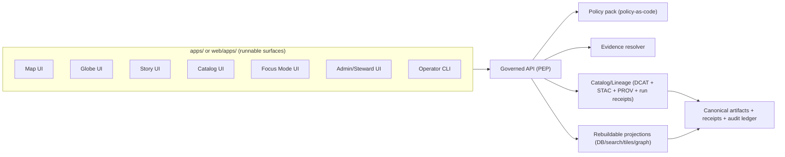
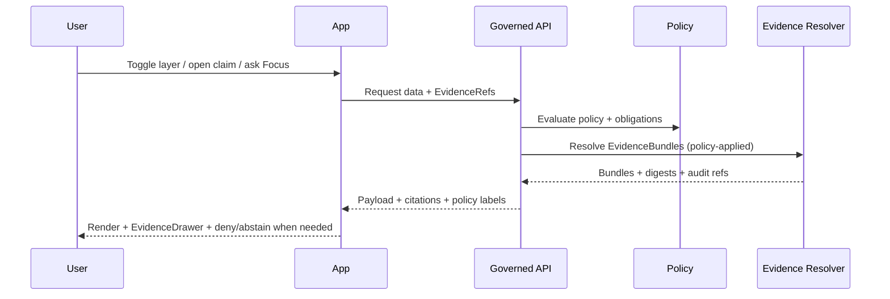

<!-- [KFM_META_BLOCK_V2]
doc_id: kfm://doc/8a4a8e59-7a6f-4d60-9c56-9f6d5f8b1f3d
title: apps/ — Runnable application surfaces
type: standard
version: v3.5
status: draft
owners: TBD (resolve via CODEOWNERS / repo maintainers)
created: 2026-02-22
updated: 2026-03-02
policy_label: public
related:
  - kfm://doc/kfm-definitive-design-governance-guide-vnext
  - kfm://doc/UNKNOWN_SYSTEM_OVERVIEW
  - ../README.md
  - ../CONTRIBUTING.md
  - ../SECURITY.md
  - ../CHANGELOG.md
  - ../.github/README.md
  - ../docs/
tags: [kfm, apps, ui, trust-membrane, contracts, evidence-first, receiptviewer, trust-badges, promotion-contract, threat-model, app-registry, view-state, policy-as-code, controlled-vocab]
notes:
  - v3.5: aligned tagging + normative language with KFM vNext; every UNKNOWN carries a default + minimum verification step.
  - v3.5: mapped Promotion Contract gates (A–G) to app responsibilities and CI gates; clarified “published surfaces serve only promoted versions.”
  - v3.5: tightened Evidence Resolver contract (EvidenceRef schemes, EvidenceBundle shape, deny/abstain UX, ≤2-call expectation).
  - v3.5: added controlled vocabulary section (policy_label, artifact.zone, citation.kind) and tied it to UI expectations.
  - This README remains intentionally fail-closed about repo-specific facts (actual app list, layout, tooling) until verified in-repo.
[/KFM_META_BLOCK_V2] -->

<a id="top"></a>

# apps/ — Runnable application surfaces

**Purpose:** Home for user-facing and operator-facing application surfaces (Map / Globe / Story / Catalog / Focus / Admin / CLI) that consume **governed APIs** and expose **evidence-first** UX with **cite-or-abstain** guarantees.

**Owners:** TBD (resolve via CODEOWNERS / repo maintainers)  
**Status:** draft — **fail-closed** (repo-specific facts remain **UNKNOWN** until verified)  
**Policy label:** public (documentation only; individual apps may be `restricted|internal|secret`)

<!-- TODO(kfm): replace placeholder badges with real workflow badges once repo wiring is confirmed. -->


> [!WARNING]
> **Fail-closed guarantee:** Anything repo-specific (actual app list, owners, toolchain, contract paths, whether apps live in `apps/` or `web/apps/`) is **UNKNOWN** until verified in-repo.
> Do not “fill in the blanks” from memory.

---

## Navigation

- [Truth status legend](#truth-status-legend)
- [Directory contract](#directory-contract)
- [First follow-up checklist](#first-follow-up-checklist)
- [Where this fits in the repo](#where-this-fits-in-the-repo)
- [Repo layout crosswalk](#repo-layout-crosswalk)
- [Non-negotiable invariants](#non-negotiable-invariants)
- [Controlled vocabularies](#controlled-vocabularies)
- [Promotion Contract awareness](#promotion-contract-awareness)
- [Catalogs and provenance as contract surfaces](#catalogs-and-provenance-as-contract-surfaces)
- [Trust surfaces required](#trust-surfaces-required)
- [Evidence resolver and citation contract](#evidence-resolver-and-citation-contract)
- [Story Nodes and publish gates](#story-nodes-and-publish-gates)
- [Focus Mode UX contract](#focus-mode-ux-contract)
- [Threat model checklist](#threat-model-checklist)
- [Architecture sketch](#architecture-sketch)
- [App registry](#app-registry)
- [Directory layout](#directory-layout)
- [App manifest contract](#app-manifest-contract)
- [Per-app README minimum](#per-app-readme-minimum)
- [Local development](#local-development)
- [Testing and gates](#testing-and-gates)
- [Security, privacy, and sensitivity](#security-privacy-and-sensitivity)
- [Add a new app](#add-a-new-app)
- [Glossary](#glossary)

---

## Truth status legend

This README uses explicit claim labels so it stays **evidence-first** and **fail-closed**:

- **CONFIRMED:** Verified requirement or behavior. If **CONFIRMED**, it should be testable and link to evidence (doc ID, repo path+commit, or run receipt).
- **PROPOSED:** Implementable recommendation / default path (requires adoption).
- **UNKNOWN / DECISION NEEDED:** Not verified yet (in this repo and/or in governing docs). Must include:
  1) a recommended default, and  
  2) the **minimum verification step** to convert UNKNOWN → CONFIRMED.

> [!NOTE]
> This legend is intentionally strict: “CONFIRMED” is not “sounds right.”
> If we can’t point to evidence, we label it UNKNOWN and provide the smallest verification step.

---

## Directory contract

This section is the directory-level “README contract” for `apps/`.

### Where it fits

`apps/` is a **surface-layer** directory. It sits at the end of the KFM layering model:

- **Domain** → concepts and invariants (no UI)
- **Use cases** → workflows (map/story/focus/admin)
- **Interfaces** → contracts + policy boundary (governed API, schemas)
- **Infrastructure** → storage/index, pipelines, CI
- **Apps** → UX that consumes governed APIs and makes trust + evidence visible

### Acceptable inputs

This folder is for **runnable applications**—anything a human launches (browser UI, operator console, desktop wrapper, CLI) whose job is **presenting governed KFM knowledge**.

Typical app categories (examples; verify actual apps in this repo):
- Map Explorer UI (2D map + timeline + evidence drawer + policy badges)
- Globe UI (optional 3D; same evidence constraints)
- Story UI (narrative + claim citations + view-state replay)
- Catalog UI (dataset discovery + version browsing)
- Focus Mode UI (governed Q&A with cite-or-abstain + audit receipts)
- Admin/Steward UI (intake review, promotion dashboards, policy fixture review; usually restricted)
- CLI (operator workflows via governed APIs)

### Exclusions

The following do **not** belong in `apps/`:

- shared domain libraries used by multiple apps (move to shared packages workspace)
- shared UI components used by multiple apps (move to shared UI component space)
- data pipelines or long-running jobs (move to pipeline/workflow area)
- any direct storage/index access adapters
  - no DB drivers in browser code
  - no object-store clients in browser code
  - no “search index client in the UI” patterns
- policy engines or redaction logic
  - policy enforcement belongs in governed APIs and CI, not clients
- receipt/attestation verification logic
  - clients may *display* verification results; verification occurs behind the trust membrane
- long-lived secrets or embedded credentials

> [!IMPORTANT]
> Shared libraries should **not** live here. Put shared code in the repo’s shared workspace (e.g., `packages/`, `web/packages/`, etc.) to prevent copy/paste drift.

---

## First follow-up checklist

These steps convert this README from **UNKNOWN-heavy** to **repo-confirmed** without guessing.

### Repo facts to confirm (minimum)

- [ ] Capture evidence for this README revision:
  - `git rev-parse HEAD`
  - `tree -L 3` (repo root)
- [ ] Confirm where runnable UI surfaces live:
  - `ls -la apps/` **and** `ls -la web/apps/` (one may not exist)
- [ ] Capture at-a-glance trees:
  - `tree -L 3 apps/` (or `find apps -maxdepth 3 -type d`)
  - `tree -L 3 web/apps/` (or `find web/apps -maxdepth 3 -type d`)
- [ ] Identify the workspace/tooling boundary:
  - look for `package.json`, `pnpm-workspace.yaml`, `yarn.lock`, `turbo.json`, `nx.json`, `Cargo.toml`, `go.work`, etc.
- [ ] Resolve ownership:
  - inspect `CODEOWNERS` and any owners registry (if present)
- [ ] Locate contract surfaces consumed by apps:
  - search for `openapi`, `graphql`, `schema`, `contracts`, `sdk`, `client`, `generated`, `proto`
- [ ] Locate trust UX components and their contract sources:
  - search for `EvidenceDrawer`, `ReceiptViewer`, `EvidenceRef`, `EvidenceBundle`, `run_receipt`, `promotion_manifest`
- [ ] Confirm policy-safe error posture:
  - search for `hide_restricted`, `not_found_forbidden`, `indistinguishable`, `policy_safe_error`
- [ ] Confirm catalog link-check posture exists in CI/tooling:
  - search for `linkcheck`, `cross-link`, `stac link`, `dcat link`, `prov link`
- [ ] Confirm “apps cannot bypass PEP” enforcement exists (static + runtime):
  - CI guardrails + network egress restrictions in dev/stage

> [!TIP]
> Once verified, update only two sections first:
> 1) [App registry](#app-registry)  2) [Directory layout](#directory-layout)

---

## Where this fits in the repo

Some KFM repo layouts place runnable apps under `web/apps/` (with `web/` as the frontend workspace). If that’s true in your repo:

- **DEFAULT (recommended):** treat this README as describing the **effective apps root** (either `apps/` or `web/apps/`) and keep a single source of truth.
- **Minimum verification step:** run the directory checks in [First follow-up checklist](#first-follow-up-checklist).

> [!PROPOSED]
> If you adopt “single source of truth,” store canonical markdown in `docs/standards/apps.README.md`
> and generate `apps/README.md` and/or `web/apps/README.md` in CI.

---

## Repo layout crosswalk

This prevents “directory drift” when the repo uses `web/` as the frontend root.

> [!IMPORTANT]
> These are *layout patterns* (PROPOSED), not confirmations of your current repo state.

| Concept | Common location (root apps layout) | Common location (web layout) | Notes |
|---|---|---|---|
| Runnable UI surfaces | `apps/<app>/` | `web/apps/<app>/` | Pick the one that exists; don’t maintain two divergent truths. |
| Shared UI packages | `packages/` | `web/packages/` | Keep shared code out of app folders. |
| Contract schemas | `contracts/` or `schemas/` | `contracts/` or `schemas/` | Apps are **contract consumers**. |
| Governed API (PEP + Evidence) | `apps/api/` or `services/api/` | `apps/api/` or `services/api/` | Apps must not implement policy enforcement. |
| Governance policy pack | `policy/` | `policy/` | Same semantics in CI and runtime. |
| CI gates | `.github/workflows/` | `.github/workflows/` | App trust flows should be required checks. |

---

## Non-negotiable invariants

Apps are the most visible trust surface; breaking invariants breaks credibility. These invariants are **system-level** and apply to every app.

### 1) Truth path lifecycle (KFM north star) — CONFIRMED (design)

- Apps sit at the end of the truth path:
  - upstream → RAW → WORK / QUARANTINE → PROCESSED → CATALOG / LINEAGE (DCAT + STAC + PROV + run receipts) → projections → governed API → apps
- Apps **MUST** assume only *promoted* DatasetVersions are admissible for public surfaces.
- Apps **MUST NOT** use “floating latest” as a substitute for versioned IDs in share links, exports, or Story Nodes.

### 2) Trust membrane (KFM north star) — CONFIRMED (design)

- Apps **MUST NOT** access object storage, databases, or internal indexes directly.
- Apps **MUST** consume data only through **governed APIs** that enforce policy, obligations/redactions, and logging.
- Apps **MUST NOT** embed credentials that could bypass governance.

### 3) Evidence-first UX (KFM north star) — CONFIRMED (design)

Every layer, story claim, chart, or AI output **MUST** open into an **evidence view** that includes (policy-safe):

- DatasetVersion ID and human name
- License and rights holder attribution (copyable)
- Policy label and obligations/redactions applied
- Provenance chain and run receipt reference
- Validation and freshness indicators
- Evidence bundle digest/checksum (when policy allows)

### 4) Cite-or-abstain Focus Mode (KFM north star) — CONFIRMED (design)

If Focus Mode exists, it **MUST** implement cite-or-abstain:

- If citations can’t be verified, the UI **MUST** abstain or reduce scope and show why (policy-safe).
- If policy denies, the UI **MUST** deny and explain in policy-safe terms.
- Every Focus response **MUST** link to an `audit_ref` (run id) for review.

### 5) Canonical vs rebuildable stores (KFM north star) — CONFIRMED (design)

- Canonical truth lives in: artifacts + catalogs + run receipts + audit ledger.
- Apps **MUST** treat DB/search/tiles/graph as rebuildable projections, not source-of-truth.
- Apps **MUST** display DatasetVersion identity and evidence links that tie projections back to canonical artifacts.

### 6) Deterministic identity and hashing (KFM north star) — CONFIRMED (design)

- DatasetVersion identity is stable and derived deterministically (spec-hash posture).
- Apps **MUST** use stable IDs in URLs/share links/view_state and avoid “version drift.”
- Apps **SHOULD** surface spec-hash/digest identifiers where policy allows.

---

## Controlled vocabularies

Controlled vocabularies are a governance tool, not a naming preference. Apps must treat them as **contract inputs**.

### policy_label (access + sensitivity)

**DEFAULT (recommended):** use the starter vocabulary below unless your repo defines a different registry.  
**Minimum verification step:** locate the repo’s policy pack / vocabulary registry; confirm labels and obligations.

Starter vocabulary (CONFIRMED in vNext docs):
- `public`
- `public_generalized` (public-safe derivative of restricted/sensitive source)
- `restricted`
- `internal`
- `secret`

### artifact.zone (data lifecycle)

Apps will *see* these zones via catalogs/receipts and must not “promote by UI.”

Starter vocabulary:
- `raw`
- `work`
- `quarantine`
- `processed`
- `published`

### citation.kind (evidence types)

Apps should render these consistently (icons/badges) and route clicks to the Evidence Resolver.

Starter vocabulary:
- `dataset_version`
- `stac_item`
- `stac_collection`
- `prov_activity`
- `prov_entity`
- `document_section`
- `code_symbol`
- `tile`
- `graph_node`

> [!IMPORTANT]
> If your repo uses different terms, **do not** invent a new vocabulary in the UI.
> Map to the canonical list at the contract boundary (API/policy pack), not in each app.

---

## Promotion Contract awareness

Promotion gates are enforced in pipelines/CI and the governed API — but apps must not become a bypass.

### Published surface rule — CONFIRMED (design)

- Apps **MUST** show only promoted DatasetVersions on public surfaces.
- Public UIs **MUST** assume “PUBLISHED surfaces serve only promoted dataset versions.”

### UI implications (fail-closed behavior)

- Apps **MUST** render “untrusted / not promotable” states safely:
  - missing receipt
  - missing catalogs
  - unresolvable evidence
  - policy engine degraded
- Apps **MUST** treat missing/invalid evidence as a reason to **degrade**, not as permission to render anyway.
- Any export/download UX **MUST** be checked against policy label + license/rights, and must be policy-safe (no restricted existence inference).

### Promotion gates ↔ app responsibilities matrix (spec-aligned)

> [!NOTE]
> Gates A–G are a pipeline/CI concept, but apps must respect the consequences at runtime.

| Gate | What it protects | Apps must do (runtime) | Apps must test (E2E / contract) |
|---|---|---|---|
| A — Identity & versioning | Stable dataset & dataset-version IDs | Show dataset_version_id; pin share links/view_state to version | Share link replay produces same dataset_version_id |
| B — Licensing & rights | Legal reuse + attribution | Display license + rights holder; exports auto-include attribution; publish blocks if unclear | Export includes attribution/license; publish blocked when rights missing |
| C — Sensitivity & redaction plan | Prevent sensitive leakage | Display policy_label + obligations; generalized derivatives for public | Restricted layers denied / generalized; no coordinate leaks |
| D — Catalog triplet validation | Deterministic metadata + cross-links | Navigate DCAT↔STAC↔PROV without client inference; degrade if broken | Link-check failures degrade to “untrusted” |
| E — Run receipt & checksums | Reproducibility + integrity | ReceiptViewer available; show digests when allowed | Receipt renders schema-valid; “untrusted” fallback safe |
| F — Policy tests & contract tests | Same semantics CI/runtime; evidence resolvable | Treat policy as authoritative; require resolvable citations | CI-like fixtures: allow + deny/no-leak evidence resolution |
| G — Optional production posture | Supply-chain + perf + a11y | Display trust badges (policy-safe); keep UX accessible | a11y smoke tests for EvidenceDrawer; perf smoke for resolve |

---

## Catalogs and provenance as contract surfaces

Catalogs are not “nice metadata.” They are the canonical interface between pipeline outputs and runtime surfaces.

### What this means for apps — CONFIRMED (design)

- Apps should treat the **catalog triplet** (DCAT + STAC + PROV) as the authoritative source for:
  - dataset identity + DatasetVersion identity
  - license/rights attribution + allowed distributions
  - spatiotemporal extents and asset inventories (policy-safe geometry where required)
  - lineage navigation (what produced this, from what inputs, with what tooling)
- Apps **MUST** avoid “best effort” provenance assembly in the client.
  - If a link is missing/broken, show **untrusted** and route to steward review.
- Apps should expect **deterministic navigation**:
  - DCAT ↔ STAC ↔ PROV cross-links are stable and link-checkable
  - EvidenceRefs resolve into these objects without guessing

> [!NOTE]
> When catalogs and evidence are validated in CI (schema + cross-link check), runtime UX becomes reproducible and “silent drift” is prevented.

---

## Trust surfaces required

These are not optional polish. They are the user-visible governance contract.

### Trust-surface requirements by app type (design target)

| App type | Evidence Drawer | DatasetVersion + Policy badges | ReceiptViewer | Provenance panel | What-changed (versions) | Exports gated by policy/rights |
|---|---:|---:|---:|---:|---:|---:|
| Map Explorer | ✅ MUST | ✅ MUST | ✅ SHOULD | ✅ SHOULD | ✅ SHOULD | ✅ MUST |
| Story | ✅ MUST (claim-level) | ✅ MUST | ✅ SHOULD | ✅ SHOULD | ✅ SHOULD | ✅ MUST |
| Catalog | ✅ SHOULD | ✅ MUST | ✅ SHOULD | ✅ SHOULD | ✅ MAY | ✅ MUST (if exports exist) |
| Focus | ✅ MUST (citations) | ✅ MUST | ✅ SHOULD | ✅ MUST (audit_ref/receipt) | ✅ MAY | ✅ MUST (if exports exist) |
| Admin/Steward | ✅ MUST | ✅ MUST | ✅ MUST | ✅ MUST | ✅ SHOULD | ✅ MUST |
| CLI | N/A | N/A | ✅ SHOULD (read) | ✅ SHOULD | ✅ MAY | ✅ MUST (server-side) |

### Evidence drawer minimum fields (spec-aligned)

At minimum (policy-safe):

- Evidence bundle ID + digest
- DatasetVersion ID + dataset name
- License + rights holder (with attribution text)
- Freshness (last run timestamp) + validation status
- Provenance chain (run receipt link)
- Artifact links (only if policy allows)
- Redactions applied (obligations), with user-facing explanation

> [!WARNING]
> Evidence UX must never become a data exfiltration path. “Evidence exists” must not leak restricted existence unless policy allows acknowledging existence.

---

## Evidence resolver and citation contract

Evidence resolution is a **contract surface** (not a best-effort UI feature). Apps must treat it as authoritative.

### EvidenceRef schemes (minimum set)

**CONFIRMED (design expectation):** EvidenceRefs are scheme-based identifiers that resolve deterministically.  
**DEFAULT (recommended):** support the starter schemes below unless your repo defines otherwise.  
**Minimum verification step:** find the repo’s EvidenceRef scheme registry (or evidence resolver docs) and update.

Starter schemes:
- `dcat://…`
- `stac://…`
- `prov://…`
- `doc://…`
- `graph://…`
- `tile://…`

### EvidenceBundle shape (minimum expectations)

Apps should assume Evidence Resolver returns an **EvidenceBundle** that is:

- policy-evaluated (allow/deny + obligations)
- version-pinned (dataset_version_id present)
- inspectable (human summary + machine metadata)
- reproducible (digests/checksums and/or stable artifact identifiers)
- auditable (audit reference / run id)

> [!PROPOSED] Example (shape only; values illustrative)
```json
{
  "bundle_id": "kfm://evidence/…",
  "dataset_version_id": "kfm://dataset/@…",
  "policy": { "decision": "allow", "label": "public", "obligations": [] },
  "citations": [{ "kind": "stac_item", "ref": "stac://…" }],
  "digests": [{ "alg": "sha256", "value": "…" }],
  "provenance": { "run_receipt_ref": "kfm://run/…" },
  "human": { "title": "…", "summary": "…", "attribution": "…" },
  "links": [{ "rel": "artifact", "href": "…", "policy_allowed": true }]
}
```

### Fail-closed UI behavior (required)

- If evidence is unresolvable → show “untrusted” / abstain.
- If policy denies → show deny UX (policy-safe; no restricted inference).
- Do not assemble DIY citations in clients; EvidenceRefs must resolve to EvidenceBundles.

### Performance and UX expectation

- Apps **SHOULD** fetch/render an EvidenceBundle in **≤ 2 calls**, otherwise degrade safely.
  - click feature → resolve evidence → view bundle
  - click citation → resolve evidence → view bundle

---

## Story Nodes and publish gates

If Story Mode exists, publishing is a governed event — not just “saving markdown.”

**Required posture (design):**
- A Story Node includes narrative + a sidecar capturing:
  - view_state (map bbox, time window, layers)
  - dataset_version pins
  - citations (EvidenceRefs)
- Publishing is blocked unless:
  - review state is recorded, and
  - every citation resolves (and is policy-allowed) through the Evidence Resolver.

> [!NOTE]
> Publishing gates belong server-side (governed API). Apps display publish readiness and failures in policy-safe terms.

---

## Focus Mode UX contract

If Focus Mode exists, it must behave like a governed run, not chat.

**Inputs**
- user query
- optional view_state (map bbox, time window, active layers)
- user role + policy context

**Outputs**
- answer text
- citations (EvidenceRefs) resolvable to EvidenceBundles
- audit_ref (run id) for review

### Control loop (required posture)

1) Policy pre-check  
2) Retrieval plan (based on view_state + intent)  
3) Retrieve admissible evidence (catalog/search/graph/projections)  
4) Build EvidenceBundles via evidence resolver (apply obligations)  
5) Synthesize answer referencing bundles  
6) **Citation verification (HARD GATE)** — if any citation fails or is denied, revise or abstain  
7) Emit run receipt (query + bundle digests + decisions + output hash)

### Evaluation harness (release posture)

For broad release, Focus Mode **SHOULD** be gated by an evaluation harness:

- citation coverage (claims supported)
- citation resolvability (100% for allowed users)
- refusal correctness (restricted prompts denied safely)
- sensitivity leakage tests (no restricted coordinates/metadata)
- golden queries across DatasetVersions (regression gate)

---

## Threat model checklist

Use this checklist when reviewing new app features (especially exports, sharing, search, and AI).

- TM-001 **Trust membrane:** Does the frontend ever fetch directly from storage/DB? **Expected: NO**
- TM-002 **Backend layering:** Does the backend bypass repository interfaces? **Expected: NO**
- TM-003 **Restricted inference:** Can a public user infer restricted dataset existence via errors/timing/caching? **Expected: mitigated (policy-safe errors)**
- TM-004 **Exports:** Do downloads/exports include license + attribution automatically? **Expected: YES**
- TM-005 **Publishing:** Does Story publishing block if rights/citations are unclear? **Expected: YES**
- TM-006 **Focus injection:** Is prompt-injection / tool-bypass mitigated (tool allowlist, citation gate, policy filters)? **Expected: YES**
- TM-007 **Audit safety:** Are audit logs redacted + access-controlled? **Expected: YES**
- TM-008 **Determinism:** Is deterministic hashing recomputable in CI? **Expected: YES**
- TM-009 **UI trust flows tested:** Are evidence/deny/abstain flows covered by E2E tests? **Expected: YES**

---

## Architecture sketch


```mermaid
flowchart LR
  subgraph Apps["apps/ or web/apps/ (runnable surfaces)"]
    Map["Map UI"]
    Globe["Globe UI"]
    Story["Story UI"]
    Catalog["Catalog UI"]
    Focus["Focus Mode UI"]
    Admin["Admin/Steward UI"]
    CLI["Operator CLI"]
  end

  Apps --> API["Governed API (PEP)"]
  API --> Policy["Policy pack (policy-as-code)"]
  API --> Evidence["Evidence resolver"]
  API --> CatalogLineage["Catalog/Lineage (DCAT + STAC + PROV + run receipts)"]
  API --> Projections["Rebuildable projections (DB/search/tiles/graph)"]

  CatalogLineage --> Canonical["Canonical artifacts + receipts + audit ledger"]
  Projections --> Canonical
```

### Evidence-first interaction sketch


```mermaid
sequenceDiagram
  participant U as User
  participant A as App
  participant G as Governed API
  participant P as Policy
  participant E as Evidence Resolver

  U->>A: Toggle layer / open claim / ask Focus
  A->>G: Request data + EvidenceRefs
  G->>P: Evaluate policy + obligations
  G->>E: Resolve EvidenceBundles (policy-applied)
  E-->>G: Bundles + digests + audit refs
  G-->>A: Payload + citations + policy labels
  A-->>U: Render + EvidenceDrawer + deny/abstain when needed
```

---

## App registry

> [!IMPORTANT]
> Populate this from the **actual** apps tree:
> - either `apps/*` **or** `web/apps/*`
> - do not assume both exist

### App registry table (human)

| App path | Type | Primary surface | policy_label | Contract references | Owner | Status |
|---|---|---|---|---|---|---|
| `TBD` | web / desktop / cli / other | map / globe / story / catalog / focus / admin / ops | public / public_generalized / restricted / internal / secret | `TBD` | `TBD` | draft |
| `TBD` |  |  |  |  |  |  |

### Machine-readable App Registry (PROPOSED)

Keep the canonical registry in a small JSON file that CI can validate:

- `apps/registry/apps.v1.json` **or** `web/apps/registry/apps.v1.json` (choose one based on repo convention)

Template:

```json
{
  "kfm_app_registry_version": "v1",
  "updated": "2026-03-02",
  "apps": [
    {
      "app_id": "kfm.app.map",
      "path": "apps/map",
      "surface": "map",
      "policy_label": "public",
      "owners": ["@kfm-engineering"],
      "contracts": [
        "openapi://contracts/openapi/api.yaml#tag=tiles",
        "openapi://contracts/openapi/api.yaml#tag=evidence"
      ],
      "trust_surfaces": ["evidence_drawer", "receipt_viewer", "provenance_panel"],
      "capabilities": { "view_state": true, "exports": ["png"], "focus_mode": false }
    }
  ]
}
```

### Registry definition of done

- [ ] Every app has a one-line purpose (README).
- [ ] Every app declares `policy_label` (and any restrictions).
- [ ] Every app lists governed API contract references (OpenAPI/GraphQL/schema URIs/paths).
- [ ] Every public surface declares its trust surfaces (EvidenceDrawer/ReceiptViewer/provenance/what-changed).
- [ ] Every map/story/focus surface declares whether it supports reproducible `view_state`.
- [ ] Owners resolved via `CODEOWNERS` and/or registry.
- [ ] CI validates registry format + controlled vocab usage; failures block merges.

---

## Directory layout

### Current layout (UNKNOWN until verified)

Replace the block below with the real tree output (choose the directory that exists).

```text
apps/ or web/apps/
├─ README.md
└─ TBD
```

### Recommended layout template (apps-at-root)

Use only if the repo does not already enforce a different convention.

```text
apps/                                                            | # App surfaces + registry (human + machine)
├─ README.md                                                     | # This doc: directory contract + App Registry index
│
├─ registry/                                                     | # Machine-readable app inventory + CI validation fixtures
│  ├─ README.md                                                  | # Registry purpose + DoD + CI validation rules
│  ├─ apps.v1.json                                               | # Canonical App Registry
│  ├─ fixtures/                                                  | # CI fixtures (no secrets; policy-safe)
│  │  ├─ apps.v1.minimal.json
│  │  └─ apps.v1.invalid.examples.json
│  └─ _generated/                                                | # ⚠️ Generated snapshots (gitignored or policy-committed)
│     └─ manifests.index.json
│
├─ map/                                                          | # Map Explorer UI
├─ story/                                                        | # Story UI
├─ catalog/                                                      | # Catalog UI
├─ focus/                                                        | # Focus Mode UI
├─ admin/                                                        | # Admin/Steward UI
└─ cli/                                                          | # Operator CLI surface
```

### Recommended layout template (web/apps)

If your repo uses a `web/` workspace root:

```text
web/
├─ apps/
│  ├─ README.md
│  ├─ registry/
│  │  └─ apps.v1.json
│  ├─ map/
│  ├─ story/
│  ├─ catalog/
│  ├─ focus/
│  └─ admin/
└─ packages/                                   # Shared UI packages (do not duplicate per-app)
```

---

## App manifest contract

Each app directory **SHOULD** include an app manifest file (example: `kfm.app.json`) so governance intent is machine-readable.

> [!NOTE]
> If the repo already has a standard manifest, use that instead. This is a PROPOSED contract.

### Example kfm.app.json

```json
{
  "app_id": "kfm.app.map",
  "name": "KFM Map Explorer",
  "surface": "map",
  "policy_label": "public",
  "capabilities": {
    "view_state": true,
    "exports": ["png"],
    "focus_mode": false
  },
  "governed_api": {
    "base_url_env": "KFM_API_BASE_URL",
    "contracts": [
      "openapi://contracts/openapi/api.yaml#tag=catalog",
      "openapi://contracts/openapi/api.yaml#tag=tiles",
      "openapi://contracts/openapi/api.yaml#tag=evidence"
    ]
  },
  "trust_surfaces": ["evidence_drawer", "receipt_viewer", "provenance_panel", "what_changed"],
  "telemetry": {
    "otel": true,
    "pii": "none"
  }
}
```

### Minimal manifest rules (PROPOSED)

- `policy_label` is mandatory and must be from the controlled vocabulary.
- `governed_api.contracts` is mandatory for any app that makes API calls.
- `trust_surfaces` is mandatory for any public-facing surface that renders layers or claims.
- `capabilities.view_state = true` SHOULD be set for Map/Story/Focus surfaces that emit share links.

---

## Per-app README minimum

Each app under `apps/<app>/` or `web/apps/<app>/` SHOULD include a README that answers:

- title and one-line purpose
- where it fits in the system
- acceptable inputs
- exclusions
- governed API contracts used
- trust surfaces (EvidenceDrawer, ReceiptViewer, provenance, what-changed)
- view_state expectations (if applicable)
- how to run locally
- tests and CI gates
- threat model notes for exports/share/search/AI features

### Template header snippet

```md
<!-- [KFM_META_BLOCK_V2]
doc_id: kfm://doc/<uuid>
title: apps/<app>/ — <purpose>
type: standard
version: v1
status: draft|review|published
owners: <team or names>
created: YYYY-MM-DD
updated: YYYY-MM-DD
policy_label: public|public_generalized|restricted|internal|secret
related:
  - ../README.md
tags: [kfm, apps]
notes:
  - Keep repo-unknowns explicit until verified.
[/KFM_META_BLOCK_V2] -->
```

---

## Local development

> [!IMPORTANT]
> This section is intentionally generic until the repo’s tooling is verified.

### Quick start pattern (fail-closed)

1. Identify the workspace toolchain from repo root (and whether frontend is rooted at `web/`).
2. Install dependencies using the repo’s chosen package manager.
3. Run the app’s dev target from its directory.
4. Confirm it points to a **governed API** instance (not direct storage/DB).
5. Exercise trust flows:
   - open EvidenceDrawer
   - simulate deny/abstain
   - verify no direct store access occurs

### Proposed environment variables (PROPOSED)

- `KFM_API_BASE_URL` — base URL for the governed API gateway
- `KFM_ENV` — `local|dev|stage|prod`

> [!WARNING]
> Apps must be safe under policy deny. Even if UI misconfigures itself, restricted content must not render because enforcement occurs in the API.

---

## Testing and gates

Apps are safety-critical surfaces. Treat app changes like production changes.

### Minimum CI gates (recommended baseline)

**App-level (always relevant)**
- [ ] unit tests for UI + adapters
- [ ] accessibility checks (EvidenceDrawer keyboard navigation at minimum)
- [ ] dependency and supply chain checks
- [ ] static guardrail: **no direct storage/DB access** from apps
- [ ] policy-safe errors guardrail (no restricted existence inference)
- [ ] ReceiptViewer safe-render tests (schema validate + “untrusted” fallback) if receipts/manifests render in the client
- [ ] E2E tests for critical trust flows (below)

**Contract-level (ties apps to governance)**
- [ ] contract checks for governed API compatibility (OpenAPI/GraphQL/schema)
- [ ] catalog profile validation (DCAT/STAC/PROV) against KFM profiles/constraints (where stored in-repo)
- [ ] link check: cross-links exist and resolve in repo context (where stored in-repo)
- [ ] evidence resolver contract tests:
  - [ ] “public” evidence resolves to bundle with allowed artifacts
  - [ ] “restricted” evidence returns deny/403 with **no sensitive metadata leakage**
- [ ] spec_hash stability tests (no identity drift)
- [ ] golden tests for deterministic outputs (reproducibility)

### Anti-skip requirement (merge posture)

> [!WARNING]
> A required app gate must not be skippable via `paths:` filters, `if:` conditions, or job fanout.
> Prefer a single always-runs **gate-summary** job as the required check.

### Recommended E2E trust flows

- load app → toggle a layer → open EvidenceDrawer → verify policy label + DatasetVersion shown
- change time window → verify results change → evidence remains version-pinned
- open a story claim → open citations → resolver success or policy-safe deny
- open receipt viewer → verified/untrusted renders safely
- ask a Focus question → citations present or abstain with reasons + audit_ref
- attempt export → policy + rights enforced; policy-safe errors; no restricted inference

---

## Security, privacy, and sensitivity

### Policy-as-code posture

Apps **display** policy decisions; they do not invent them.

- Do not implement “shadow policy” logic in clients.
- If policy decisions are missing or ambiguous, degrade to deny/abstain (policy-safe).

### Sensitive locations and culturally restricted material

- do not render exact coordinates in public UIs for vulnerable/restricted sites
- prefer generalization and show a governance note explaining why
- never allow share links to “accidentally” encode restricted geometry

### Rights and licensing

- Export functions should include attribution and license text automatically (when exports exist).
- Story publishing flows should block if rights are unclear for included media.
- If rights/terms are unclear, degrade to **metadata-only** and route to steward review.

### Evidence UI guardrails

- validate evidence bundle shape before rendering derived UI
- ReceiptViewer must be safe by construction:
  - validate schema before derived views
  - never render untrusted HTML
  - treat external links as hostile by default
- if evidence cannot be verified or resolved, render as **untrusted** and block publish flows

### Abstention and restriction UX

Abstention is a feature. The UI must:
- show policy-safe reasons
- suggest safe alternatives
- provide `audit_ref` for steward review
- avoid leaking restricted existence

---

## Add a new app

### Checklist (fail-closed)

1. Create app directory (choose the repo convention):
   - `apps/<new-app>/README.md` **or** `web/apps/<new-app>/README.md`
   - add `kfm.app.json` (or repo-standard manifest)
2. Define or extend contracts first:
   - update OpenAPI/GraphQL/JSON Schema
   - add fixtures and contract tests
3. Implement UI against governed APIs only:
   - no direct storage or DB access
   - evidence UX for every public layer/claim
4. Add tests:
   - unit, contract, E2E, accessibility
   - evidence resolver contract tests (allow + deny/no-leak)
   - deterministic identity tests (no “latest drift”)
5. Threat-model the change:
   - run [Threat model checklist](#threat-model-checklist)
6. Register the app:
   - add to [App registry](#app-registry) (human + machine registry if used)
7. Update this README:
   - regenerate “Current layout”
   - ensure UNKNOWNs have defaults + minimum verification steps

---

## Glossary

- **Truth path lifecycle:** upstream → RAW → WORK/QUARANTINE → PROCESSED → CATALOG/TRIPLET (DCAT + STAC + PROV + run receipts) → projections → governed API → apps
- **Trust membrane:** enforced boundary where policy and provenance are applied; clients never access storage directly
- **Promotion Contract:** fail-closed gates blocking any dataset version from being served until identity, rights, sensitivity, catalogs, receipts, and policy/contract tests validate
- **Evidence-first UX:** every visible claim opens into provenance, rights, and validation details
- **EvidenceRef:** resolvable reference used as a citation pointer (scheme-based)
- **EvidenceBundle:** resolved evidence payload (human + machine fields, digests, policy decision, audit refs)
- **ReceiptViewer:** safe read-only viewer for run receipts / promotion manifests; schema-validates and surfaces verification status
- **Trust badges:** compact UI indicators summarizing provenance/quality without leaking restricted details
- **Cite-or-abstain:** answer only when citations can be verified; otherwise abstain or reduce scope
- **Canonical vs rebuildable:** catalogs/provenance/artifacts are canonical; DB/search/graph/tiles are rebuildable projections
- **Catalogs as contract surfaces:** catalogs/provenance are validated, cross-linked interfaces between pipelines and runtime; apps must not re-derive them in clients

---

<details>
<summary><strong>Appendix: Updating this README without guessing</strong></summary>

- Determine whether runnable apps live under `apps/` or `web/apps/`.
- Regenerate the Current layout block from the actual repo tree.
- Populate the App Registry table from real app directories/manifests.
- If adopting the machine registry, ensure CI validates it (schema + owner paths) and CODEOWNERS covers it.
- For each app, link to:
  - contract references
  - trust surface entry points
  - CI gates and test commands
- Resolve owners via CODEOWNERS and replace `TBD`.

</details>

<p align="right"><a href="#top">Back to top ↑</a></p>
