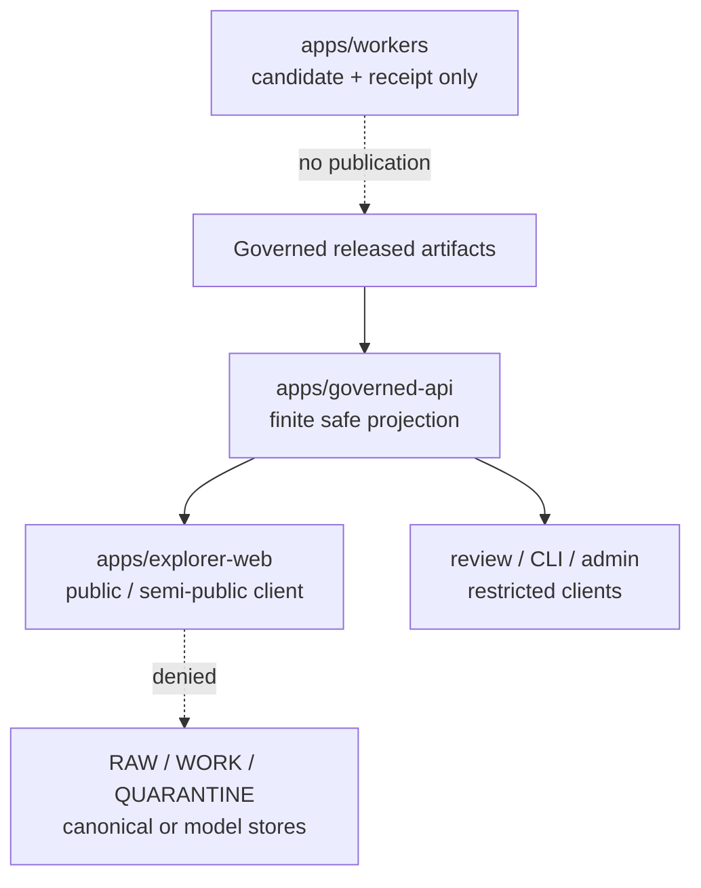

<!-- [KFM_META_BLOCK_V2]
doc_id: kfm://doc/apps-readme
title: apps/ - Deployable Applications
type: root-readme
subtype: canonical-root-landing-page
version: v0.9
prior_version: v0.8
status: draft; repository-grounded; mixed-maturity
owner: "NEEDS VERIFICATION — CODEOWNERS routes repository review to @bartytime4life and explicitly covers apps/governed-api/ and apps/explorer-web/; no accepted application-steward assignment, required independent-review rule, or release authority was verified"
created: 2026-05-10
updated: 2026-08-29
policy_label: public
current_path: apps/README.md
owning_root: apps/
responsibility: orient contributors to deployable application boundaries, current app-lane maturity, governed public access, validation, and reversible next work
truth_posture: cite-or-abstain
truth_labels: [CONFIRMED, PROPOSED, UNKNOWN, NEEDS VERIFICATION]
authority_class: canonical root landing page
authority_rank: implementation orientation subordinate to adopted doctrine, accepted ADRs, contracts, schemas, policy, evidence, lifecycle records, and release records
canonical_relationship: same-path update; no sibling authority created
evidence_snapshot:
  repository: bartytime4life/Kansas-Frontier-Matrix
  base_ref: main
  base_commit: 2a205c8df31ff95a61f72a52489336b924a791ac
  root_tree: 9108caa78993edd313d23a5860d6e54a2deedf53
  apps_tree: 0500d246c4153d631753888cc683652835ad867f
  target_prior_blob: 53498c5f5790344b5f7f5c66bad292e1e996ae9e
  directory_rules_blob: fd49a0b83e55cef52c1124281f093e263526898d
  directory_rules_adoption: ADR-0029; accepted
  codeowners_blob: dd2a84aa514d8ecd9208bc347f90f9a2ed37dd61
  governed_api_main_blob: 4eb335c7c0b27f62c7419c478542e8fe40e1ff38
  governed_api_routes_blob: 3418168d0b267160d6ad6dd87f289e880ef4a024
  governed_api_stub_blob: 371e60d9f96c78e31c8a1e6109d19dee5da4213b
  explorer_manifest_blob: d9ada6539e07a4a5cd9b65ec9792105bd4856807
  explorer_entrypoint_blob: f056c897fbe063762c5594b819c44536d8ddf9e1
  explorer_site_blob: 5049930e8b9fb0b6e5724a83b4ea018f65395bd3
  explorer_focus_workspace_blob: 094f546512a9b999ad33031faa81e4b7a149dde4
  explorer_trust_surface_blob: b92b486d3ea29ffe365f82b627e5fd9d47d4daba
  explorer_maplibre_adapter_blob: 663ba0f7a05498948f67d644387c73ab19d5c16c
  explorer_governed_client_blob: 21f6e4d1225ab0427ecb689d6782f4b56fc25ea2
  api_workflow_blob: 84ba16a3c36a1d58b2f6f1059a31ed6354063357
  ui_workflow_blob: 52382d796a8dd5ecafc39a801515aff0a8b013f8
related:
  - ../README.md
  - ../docs/doctrine/directory-rules.md
  - ../docs/adr/ADR-0029-adopt-directory-governance-standard-v2.md
  - ../docs/adr/INDEX.md
  - ../docs/adr/ADR-0004-apps-governed-api-is-the-trust-membrane.md
  - ../docs/adr/ADR-0005-apps-explorer-web-is-the-canonical-map-first-shell.md
  - ../docs/adr/ADR-0006-maplibre-boundary--only-maplibreadapter-imports-maplibre.md
  - ../docs/adr/ADR-0019-ai-adapter-contract-and-finite-envelopes.md
  - ../docs/adr/ADR-0025-public-client-never-reads-canonical-internal-stores.md
  - governed-api/README.md
  - explorer-web/README.md
  - kansas-frontier-matrix-explorer/README.md
  - explorer-web/src/README.md
  - explorer-web/src/features/README.md
  - review-console/README.md
  - cli/README.md
  - workers/README.md
  - admin/README.md
  - packages/README.md
  - ../packages/README.md
  - ../runtime/README.md
  - ../data/README.md
  - ../release/README.md
  - ../policy/README.md
  - ../schemas/README.md
  - ../contracts/README.md
  - ../tests/README.md
tags: [kfm, apps, deployables, trust-membrane, governed-api, explorer-web, finite-outcomes, mixed-maturity]
notes:
  - "v0.9 records the dependency-closed Sites repair: both Explorer compositions use NullMapRuntime through the accepted package seam, while full Sites renderer capabilities remain held."
  - "The attached KFM manuals, Drive Atlas, and Notion reconciliation are read-only design and coordination inputs; they do not establish repository behavior, source admission, review, release, deployment, promotion, or publication."
  - "Exact maplibre-gl 6.6.0, the package-owned adapter, and Vite worker seam are implemented; full consumer capabilities, broader runtime proof, and public release remain held or separately governed."
  - "The Sites code and dependency edge change only to fail closed; no source, deployment, policy, release, promotion, or publication authority is created."
[/KFM_META_BLOCK_V2] -->

# Deployable Applications

`apps/`

**Canonical home for KFM deployables, with the Governed API as the normal public trust membrane and every client, worker, operator, review, and administrative surface constrained by evidence, policy, release, correction, and rollback.**

**Quick navigation:** [Purpose](#purpose) · [Authority](#authority-level) · [Status](#status) · [Belongs](#what-belongs-here) · [Exclusions](#what-does-not-belong-here) · [Inputs](#inputs) · [Outputs](#outputs) · [Validation](#validation) · [Review](#review-burden) · [Related](#related-folders) · [ADRs](#adrs) · [Last reviewed](#last-reviewed) · [Evidence](#evidence-ledger) · [Sources](#source-informed-architecture-pressure) · [App map](#current-app-map) · [Gaps](#verified-gaps-and-next-work)

> [!IMPORTANT]
> `apps/` is an implementation root, not a truth, schema, contract, policy, lifecycle-data, evidence, proof, receipt, or release authority. A running app, successful request, rendered map, passing test, badge, pull request, or generated answer does not promote data or authorize publication.

> [!CAUTION]
> Public and semi-public clients use `apps/governed-api/` or a separately reviewed released-artifact path. They must not read RAW, WORK, QUARANTINE, PROCESSED, candidate, canonical, internal, or direct model-runtime stores. Missing evidence, policy support, or release closure resolves to `ABSTAIN`, `DENY`, or `ERROR`, not invented certainty.

> [!NOTE]
> ADR-0029 is accepted and makes [`docs/doctrine/directory-rules.md`](../docs/doctrine/directory-rules.md) the sole writable human Directory Rules authority. The architecture-path copy is a read-only compatibility dependency pending its governed migration; it is not a second editable authority.

---

## Purpose

`apps/` owns independently deployable processes and user-facing service boundaries for Kansas Frontier Matrix. It is where app-local entry points, routes, user interfaces, operator commands, background runners, app-local tests, and deployable composition belong.

The current root contains eight direct lanes:

- [`governed-api/`](governed-api/README.md) — bounded executable public trust membrane;
- [`explorer-web/`](explorer-web/README.md) — map-first public and semi-public browser client;
- [`kansas-frontier-matrix-explorer/`](kansas-frontier-matrix-explorer/README.md) — Sites-derived Explorer application retained as a separately tracked deployable and reconciliation surface;
- [`review-console/`](review-console/README.md) — role-gated steward review surface;
- [`cli/`](cli/README.md) — restricted operator command surface;
- [`workers/`](workers/README.md) — non-publishing background runner lane;
- [`admin/`](admin/README.md) — restricted administrative surface;
- [`packages/`](packages/README.md) — documented drift guard, not a shared-package authority.

The root README describes current evidence and boundaries. It does not upgrade lane-local proposals, scaffolds, documentation, or tests into deployed product claims.

## Authority level

**Canonical deployable-application root / implementation-bearing / non-sovereign.**

Accepted Directory Rules classifies `apps/` as the home for deployable processes and user-facing service boundaries. Reusable logic belongs in `packages/`; provider composition belongs in `runtime/`; source acquisition belongs in `connectors/`; lifecycle transformation belongs in `pipelines/`; deployment and exposure belong in `infra/`; and release decisions belong in `release/`.

The root owns deployable composition. It does not own:

- the meaning of an object (`contracts/`);
- its machine-checkable shape (`schemas/`);
- allow, deny, hold, restrict, or abstain rules (`policy/`);
- canonical lifecycle state (`data/`);
- release, correction, withdrawal, or rollback decisions (`release/`);
- shared reusable implementation (`packages/`);
- provider/model integration exposed directly to clients (`runtime/`);
- source admission or acquisition (`connectors/`);
- lifecycle transformation authority (`pipelines/`, `pipeline_specs/`);
- deployment, network, host, or secret authority (`infra/`, external secret stores).

`CODEOWNERS` is review routing only. It is not a stewardship assignment, ReviewRecord, policy decision, release authority, separation-of-duty proof, or evidence that review occurred.

## Status

**Draft / repository-grounded / mixed maturity.**

This edition is pinned to `main@2a205c8df31ff95a61f72a52489336b924a791ac` and apps tree `0500d246c4153d631753888cc683652835ad867f`. It describes repository bytes and bounded local or CI-facing test definitions. The Sites-derived app records a deployment lineage in its own README, but this root page does not independently verify current production health or grant deployment, release, or publication authority.

### Evidence boundary

| Claim | Truth | Repository evidence | Limitation |
|---|---|---|---|
| `apps/` has eight direct child lanes plus this README. | CONFIRMED | Pinned apps tree | Direct-lane presence does not establish implementation maturity. |
| Governed API registers `/bootstrap`, `/layers`, and `/evidence` through a small WSGI application. | CONFIRMED | `governed-api/src/governed_api/main.py` and route registry | The routes are fail-closed scaffolds, not domain APIs. |
| Governed API route stubs return bounded `ABSTAIN / NOT_IMPLEMENTED` envelopes. | CONFIRMED | Current stub and bounded API tests | Does not prove authorization, EvidenceBundle resolution, deployment, or load behavior. |
| Explorer Web mounts a repository-grounded local site with Map, Knowledge, Features, and Trust regions, public anchor navigation, a synthetic Focus workspace, and a shared public trust surface. | CONFIRMED | `explorer-web/src/main.ts`, `src/site/`, unit tests, and browser tests | The composition is deterministic and fixture-first; it is not a production route tree, live service, or release. |
| The normal `explorer-web` composition uses `NullMapRuntime`, while `@kfm/maplibre` owns exact `maplibre-gl@6.6.0`, a bounded concrete adapter, a Vite worker seam, package tests, and an isolated real-browser fixture. | CONFIRMED | Package manifest/lockfile, package adapters/tests, Explorer aliases, and `maplibre-vite-adapter` browser fixture | The isolated fixture does not activate the renderer in the normal Explorer composition, admit sources/layers, or establish release or deployment. |
| The separately tracked `kansas-frontier-matrix-explorer` app depends on `@kfm/maplibre` and boots `NullMapRuntime` as Sites-derived implementation lineage. | CONFIRMED | Child package manifest, entrypoint, focused tests, and child README | Styles, sources, layers, workers, hit testing, measurement, and runtime probes remain held; this is not renderer activation or repository-wide readiness. |
| `explorer-web` currently contains 38 named feature lanes, 24 TypeScript adapter modules, 45 top-level unit tests, and 36 browser specs. | CONFIRMED | Pinned apps tree | File and test inventory demonstrates bounded implementation breadth, not integrated product or operational maturity. |
| Explorer package scripts run TypeScript/Vite build, Vitest unit tests, and Playwright browser tests. | CONFIRMED | Current `package.json`, lockfile, Playwright config, and `ui-build` workflow | Workflow wiring is not a hosted-run conclusion or deployment proof. |
| Review Console and Admin remain documentation-led; CLI and Worker Python entrypoints remain explicit greenfield placeholders. | CONFIRMED | Pinned child trees, CLI `__main__.py`, and worker `main.py` files | No review mutation, operator workflow, queue, schedule, or product readiness is established. |
| `@bartytime4life` is the executable GitHub review route. | CONFIRMED | Current CODEOWNERS | Routing is not stewardship, independent approval, or release authority. |
| ADR-0029 and ADR-0006 are accepted; ADR-0004, ADR-0005, ADR-0019, and ADR-0025 remain draft or proposed. | CONFIRMED | Current ADR sources and index | Acceptance of a boundary does not admit a dependency, establish runtime behavior, or approve release. |
| Deployment, dashboards, audit sinks, live authorization, service health, and public operation are established. | UNKNOWN | No admissible operational evidence inspected | Verify through infrastructure, runtime, logs, and deployed observations. |

### Trust flow

```mermaid
flowchart TD
    released["Governed released artifacts"] --> api["apps/governed-api<br/>finite safe projection"]
    api --> explorer["apps/explorer-web<br/>public / semi-public client"]
    api --> restricted["review / CLI / admin<br/>restricted clients"]
    workers["apps/workers<br/>candidate + receipt only"] -. "no publication" .-> released
    explorer -. "denied" .-> internal["RAW / WORK / QUARANTINE<br/>canonical or model stores"]
```

The Governed API and both Explorer lanes provide bounded executable slices with different maturity postures. `explorer-web` composes a meaningful local shell, synthetic map/runtime status, Focus request, and trust/evidence interaction surface, but its normal entrypoint still does not call the API, activate the concrete MapLibre adapter, resolve live evidence, or expose a production claim surface. The Sites-derived app now boots the package-owned `NullMapRuntime`, retains its catalog/evidence shell, and holds all renderer-specific capabilities. Internal-app mutation, worker execution, release assembly, and repository-wide operational observability remain placeholder, held, or unverified.

## What belongs here

- App-local source and entry points for a deployable service, browser client, console, CLI, worker process, or restricted admin surface.
- App-local route registration and handler composition that consume external contracts and schemas without redefining them.
- App-local UI composition that consumes governed API envelopes and shared packages.
- App-local positive, negative, boundary, accessibility, unit, browser, and smoke tests.
- App-local non-secret examples and operator notes that do not replace `configs/`, `infra/`, or runbooks.
- Deployable packaging metadata when it does not create a second shared-package, policy, schema, source, receipt, proof, or release authority.
- Narrow adapters that exist only to translate an app's external boundary into shared package calls and contain no reusable hidden domain authority.

## What does not belong here

| Prohibited content | Canonical home | Why |
|---|---|---|
| Reusable libraries | `packages/` | Shared behavior must not be hidden inside one deployable. |
| Provider/model runtime composition | `runtime/` | Providers remain subordinate to governed app boundaries. |
| Contracts and JSON Schemas | `contracts/`, `schemas/` | Meaning and machine shape have separate authority roots. |
| Rego, access rules, or release policy | `policy/` | Apps apply policy; they do not define normative policy. |
| RAW, WORK, QUARANTINE, PROCESSED, catalog, triplet, or published objects | `data/` | Lifecycle state never lives in app source. |
| EvidenceBundles, proofs, and receipts | governed `data/` lanes | Trust-supporting records require governed homes. |
| Release manifests, decisions, corrections, withdrawals, and rollback cards | `release/` | App actions do not become publication decisions. |
| Source fetchers and source admission | `connectors/` | Acquisition is not deployable application authority. |
| Pipeline logic and declarative run specs | `pipelines/`, `pipeline_specs/` | Lifecycle transformations remain outside deployables. |
| Deployment, ingress, firewall, environment, and host definitions | `infra/` | Exposure posture is reviewed separately. |
| Credentials, tokens, private endpoints, signing material, protected payloads | External secret or restricted stores | Git and app source are not secret or quarantine boundaries. |
| Generated build or QA output | `artifacts/` only where its compatibility contract permits | Generated output must not accumulate in app source. |
| A shared-package implementation under `apps/packages/` | top-level `packages/` | The nested lane is a drift guard, not an authority. |

## Inputs

| Input | Owning root | Required posture |
|---|---|---|
| Semantic contracts | `contracts/` | Consumed without redefining meaning in app code |
| Machine schemas and response envelopes | `schemas/` | Runtime-validate before trust-bearing render or response |
| Policy decisions and obligations | `policy/` plus governed decision instances | Unknown or unresolved state fails closed |
| Evidence and citation support | governed evidence/proof lanes | `ANSWER` requires admissible support; otherwise abstain or deny |
| Released public-safe artifacts | governed released carriers through approved access | No direct public read of internal lifecycle stores |
| Release, correction, withdrawal, rollback state | `release/` | Preserve current disposition and invalidation state |
| Reusable implementation | `packages/` | Use stable shared boundaries rather than app-local forks |
| Provider/runtime results | `runtime/` behind Governed API or another reviewed membrane | Never expose provider/model output directly to public clients |
| Safe configuration defaults | `configs/` | No committed real secrets or private bindings |
| Deployment bindings | `infra/` and environment controls | Least privilege, explicit exposure, and auditable rollback |

## Outputs

| Output | Owner or channel | Required guardrail |
|---|---|---|
| Finite runtime response | Governed API response | Exactly one public outcome: `ANSWER`, `ABSTAIN`, `DENY`, or `ERROR` |
| Map, drawer, story, compare, citation, trust, time, or diagnostic render | Explorer Web | Downstream carrier only; never root truth |
| Review or operator proposal | Review Console / CLI | Auditable candidate; no self-approval or publication shortcut |
| Worker candidate or receipt | Governed lifecycle or receipt lane | Non-publishing; no canonical or published-store rewrite |
| Safe logs and metrics | Approved observability channel | No secrets, prompts, protected geometry, raw evidence, or full sensitive payloads |
| App-local build artifact | Build/CI channel | Rebuildable output; not a release decision or published carrier by location alone |

Apps do not directly emit approved release decisions, authoritative catalog state, proof closure, or published truth.

## Validation

### Repository-native checks

| Command or workflow | Current role | What it proves | What it does not prove |
|---|---|---|---|
| `make governed-api-smoke` | Governed API route/envelope tests | Registered routes fail closed and validate against the bounded envelope profile | Production auth, evidence resolution, network policy, load, or deployment |
| `make governed-api-verify` | API tests plus import boundary | Governed API avoids renderer and direct model-client imports | Runtime process isolation or public readiness |
| `make boundary-guards` | Cross-root public-boundary tests | Selected public-path and non-publisher invariants hold | Complete data-flow or information-flow proof |
| `make ui-build` | Explorer type-check and production build | Current source compiles and Vite emits a static bundle | Functional map, live API, accessibility completeness, or deployment |
| `pnpm --filter explorer-web test` | Explorer unit plus browser suite | Fixture-first finite-state, no-leak, keyboard, and component behavior | Live transport, canonical schema adoption, source access, or production UX |
| `make validate` | Aggregate repository validation | Configured schema/contract/validator baseline when executed | App deployment, release, or publication readiness |
| `.github/workflows/api-test.yml` | Hosted API wrapper | Bounded API checks at an exact revision | Human approval or deployment |
| `.github/workflows/ui-build.yml` | Hosted locked Explorer build/test wrapper | Real package scripts, frozen dependencies, build, unit, and browser tests | A usable map, live governed answer surface, release, or deployment |

A README update does not establish a fresh execution result. Local or hosted conclusions must be reported from the exact proposed head.

### Required negative cases for material app changes

- unknown route and unsupported method;
- malformed or unknown envelope fields;
- missing evidence, unresolved policy, unavailable release, stale support, and corrected or superseded support;
- internal-store, browser-to-model, renderer-boundary, and worker-publication bypass;
- protected detail in `DENY` or `ERROR` output;
- secret, prompt, protected geometry, raw evidence, or internal paths in logs and diagnostics;
- CLI, admin, or review action that attempts to bypass independent review, correction, or rollback;
- browser component that renders unsupported, unreleased, unreviewed, stale, or superseded detail;
- keyboard, focus-return, landmark, non-color status, and reduced-information failure paths where UI is involved.

### Documentation checks

For README-only changes:

- preserve exactly one H1 and one balanced `KFM_META_BLOCK_V2`;
- preserve balanced code fences, HTML tags, tables, alerts, and details blocks;
- keep the first twelve H2 sections in the Directory Rules README profile order;
- resolve generated heading anchors and repository-relative links;
- pin current-state claims to a commit/tree/blob evidence chain;
- use static badges only as evidence projections, never as unverified CI, security, maturity, release, or publication claims;
- avoid unsupported owner, workflow, route, test, deployment, policy, release, or runtime claims;
- validate an authoring receipt against final bytes when a receipt is part of the admitted change.

## Review burden

Current GitHub review routing is `@bartytime4life` through the default CODEOWNERS rule, with explicit routes for Governed API and Explorer Web.

Material changes require review proportional to their effect:

| Change | Review concern |
|---|---|
| Governed API route or response | API boundary, schema/contract, policy, evidence, access, security |
| Explorer data path, evidence projection, export, or renderer | UI, accessibility, adapter boundary, public trust membrane |
| Review Console, CLI, or Admin mutation | authorization, audit, separation of duties, rollback |
| Worker write target, queue, or schedule | non-publisher invariant, idempotency, receipts, failure recovery |
| Dependency, lockfile, build, or deploy change | supply chain, reproducibility, network/exposure posture |
| Public-safe transform or precision change | rights, sensitivity, source role, review, release, correction |

Governance role names are not executable GitHub identities. CODEOWNERS routing is not approval proof, and no app change may approve its own policy, promotion, release, publication, or rollback effect.

## Related folders

| Folder | Relationship |
|---|---|
| [`packages/`](../packages/README.md) | Shared reusable implementation consumed by deployables |
| [`runtime/`](../runtime/README.md) | Provider-neutral and provider-specific runtime composition behind governed apps |
| [`contracts/`](../contracts/README.md) | Semantic meaning consumed by apps |
| [`schemas/`](../schemas/README.md) | Machine-checkable shapes and envelopes |
| [`policy/`](../policy/README.md) | Access, rights, sensitivity, and release rules |
| [`data/`](../data/README.md) | Lifecycle instances, registries, receipts, proofs, catalogs, and released carriers |
| [`release/`](../release/README.md) | Release, correction, withdrawal, and rollback decisions |
| [`tests/`](../tests/README.md) | Cross-app and trust-boundary conformance evidence |
| [`configs/`](../configs/README.md) | Safe non-secret defaults and templates |
| [`infra/`](../infra/README.md) | Deployment, host, network, and exposure posture |
| [`.github/workflows/`](../.github/workflows/README.md) | CI orchestration and review signals; never publication authority |
| [`docs/doctrine/directory-rules.md`](../docs/doctrine/directory-rules.md) | Accepted sole writable Directory Rules authority |
| [`docs/architecture/directory-rules.md`](../docs/architecture/directory-rules.md) | Read-only compatibility dependency pending governed migration |

## ADRs

ADR-0029 is the accepted placement authority for this root. ADR-0006 and ADR-0007 accept the package-owned renderer seam and sole normal browser-renderer family. Current implementation now adds exact `maplibre-gl@6.6.0`, a bounded package-owned adapter, and a Vite worker/browser fixture without establishing production activation, broader runtime readiness, a released layer, deployment authority, or publication authority. The remaining app-related records are draft or proposed design lineage unless a later accepted decision or current implementation evidence establishes more.

| ADR | Effective status | Relationship |
|---|---|---|
| [`ADR-0029`](../docs/adr/ADR-0029-adopt-directory-governance-standard-v2.md) | `accepted` | Adopts Directory Rules v2 and makes `docs/doctrine/directory-rules.md` the sole writable authority |
| [`ADR-0004`](../docs/adr/ADR-0004-apps-governed-api-is-the-trust-membrane.md) | document `draft`; index decision `proposed` | Describes Governed API as the trust membrane |
| [`ADR-0005`](../docs/adr/ADR-0005-apps-explorer-web-is-the-canonical-map-first-shell.md) | `proposed` | Describes Explorer Web as the map-first shell |
| [`ADR-0006`](../docs/adr/ADR-0006-maplibre-boundary--only-maplibreadapter-imports-maplibre.md) | `accepted` | Accepts the renderer adapter boundary; dependency and concrete runtime remain separate gates |
| [`ADR-0007`](<../docs/adr/ADR-0007 — MapLibre GL JS Is the Sole Browser-Side Renderer.md>) | `accepted` | Accepts MapLibre GL JS as the sole normal production browser-renderer family; runtime and release remain separate gates |
| [`ADR-0019`](../docs/adr/ADR-0019-ai-adapter-contract-and-finite-envelopes.md) | document `draft`; index decision `proposed` | Describes provider-neutral adapters and finite envelopes |
| [`ADR-0025`](../docs/adr/ADR-0025-public-client-never-reads-canonical-internal-stores.md) | document `draft`; index decision `proposed` | Describes the no-direct-store public-client invariant |

Accepted Directory Rules and current repository evidence control placement and current-state claims. Proposed ADR language does not upgrade scaffolds to implementation.

## Last reviewed

**2026-08-28**, against `main@2a205c8df31ff95a61f72a52489336b924a791ac`, root tree `9108caa78993edd313d23a5860d6e54a2deedf53`, and apps tree `0500d246c4153d631753888cc683652835ad867f`.

Re-review after any app-lane creation or removal, public-route change, package-manager or lockfile change, renderer/runtime integration, worker write-target change, deployment exposure change, accepted app-architecture ADR, or child README update that materially changes the maturity map.

## Evidence ledger

| Evidence | Identifier | Supports | Does not support |
|---|---|---|---|
| Prior README | blob `53498c5f…` | Same-path baseline and no-loss review | Runtime behavior |
| Current base | `main@2a205c8d…` | Repository state used for this edition | Untracked files or current deployed state |
| Apps tree | `0500d246…` | Direct lanes, file inventory, and tracked current app surfaces | Runtime reachability |
| Accepted Directory Rules | blob `fd49a0b8…`; ADR-0029 | Root placement, responsibility split, and compatibility posture | App implementation maturity |
| CODEOWNERS | blob `dd2a84aa…` | GitHub review routing | Stewardship, approval, or separation of duties |
| Governed API WSGI | blob `4eb335c7…` | Route and method dispatch | Production isolation |
| Governed API route registry | blob `3418168d…` | `/bootstrap`, `/layers`, `/evidence` registration | Domain implementation |
| Governed API stub | blob `371e60d9…` | Bounded `ABSTAIN / NOT_IMPLEMENTED` and safe `ERROR` source | Complete policy/evidence coverage |
| Explorer manifest | blob `d9ada653…` | Exact Node range and Vite/Vitest/Playwright/TypeScript scripts | Hosted result or product architecture |
| Explorer entrypoint | blob `f056c897…` | Mounted site, public navigation, synthetic Focus workspace, and public trust surface | Live API, renderer, or production route tree |
| Explorer site composition | blob `5049930e…` | Map/Knowledge/Features/Trust regions, `NullMapRuntime`, synthetic selection bridge, and finite runtime status | Normal-entrypoint MapLibre activation or released layer |
| Explorer synthetic Focus workspace | blob `094f5465…` | Bounded request identity, active evidence scope, correction visibility, and no-leak fixture flow | Live provider, production EvidenceRef resolution, or released answer |
| Explorer public trust surface | blob `b92b486d…` | Shared finite trust states and mounted header, drawer, time, citation, and denial components | Backend policy evaluation or operational authorization |
| App-local MapLibre marker | blob `663ba0f7…` | Comment-only `explorer-web` compatibility/boundary marker | Package-owned adapter implementation |
| MapLibre package manifest and adapters | blobs `f6d450af…`, `f198c5b5…`, `e9cf6606…` | Exact `maplibre-gl@6.6.0`, bounded lifecycle/camera adapter, and Vite worker seam | Normal Explorer activation, source/layer admission, or public release |
| Sites-derived Explorer | Child README, manifest, entrypoint, and focused tests | Separately tracked app identity, package-root dependency, NullMapRuntime fallback, and implementation lineage | Full renderer capability, repository-wide readiness, or current production health |
| Explorer governed projection adapter | blob `21f6e4d1…` | Strict fixture-only payload parsing, trust state, and correction/history validation | Canonical payload schema adoption or transport |
| API workflow | blob `84ba16a3…` | Bounded API hosted orchestration definition | Human review, hosted pass at this README head, or deployment |
| UI workflow | blob `52382d79…` | Locked build plus unit/browser test orchestration | A functional map, release, or publication |

## Source-informed architecture pressure

The supplied corpus was used as read-only design input and then reconciled against the pinned repository. It can explain why an app boundary matters or identify a candidate slice; it cannot prove that the repository implements a proposal, admit a source or dependency, accept an ADR, or establish review, release, deployment, promotion, or publication.

| Source input | Retained application pressure | Current repository reconciliation | Status carried here |
|---|---|---|---|
| *KFM MapLibre Operating Architecture, Governed UI, and AI Interaction Manual* | Keep renderer state downstream of evidence and policy; make Evidence Drawer, Focus Mode, correction, and finite negative outcomes visible at the point of use. | The local Explorer now composes synthetic map/evidence, Focus, and trust surfaces; Governed API remains a separate fail-closed stub and no live transaction joins them. | `PROPOSED` architecture / `PARTIAL` bounded implementation |
| *Kansas Frontier Matrix Pipeline Living Implementation Manual v0.3* | Preserve lifecycle, no-autopublish, receipts, review, correction, withdrawal, and rollback across outward app flows. | Root boundaries and failure-safe wording preserve these obligations; no app is evidence of promotion or publication. | `CONFIRMED` source doctrine / runtime closure `UNKNOWN` |
| *Kansas Frontier Matrix Implementation Reference* and the Drive-backed *KFM Full Atlas Seed Cards* | Treat the inspectable claim, evidence closure, temporal scope, source role, policy, release state, and correction lineage as the durable outward unit. | Current app fixtures project several of these fields, but the Atlas remains proposal lineage and its cards are not automatically implementation requirements. | `PROPOSED`; source admission not inferred |
| *Master MapLibre Components-Functions-Features* and `maplibre3d.md` | Retain renderer, tile, terrain, 3D, performance, accessibility, and fallback ideas as testable capability pressure. | ADR-0006/0007 are accepted and the exact package dependency plus bounded adapter/browser fixture exist; production composition, source/layer admission, authenticated broader probes, performance, accessibility, 3D delivery, release, and publication remain held or unverified. | Research pressure only |
| Notion Atlas and modernization reconciliation pages | Preserve source/repository deltas, current limitations, and dependency-closed next slices. | Notion is coordination evidence and included older GitHub checkpoints; this README uses current `main` for repository claims. | Coordination only; repository evidence wins |
| General GIS, PostGIS, geostatistics, urban-planning, archaeology, API, database-lifecycle, GUI, and DDD references | Supply background vocabulary and possible future validation concerns. | No dependency, route, schema, storage profile, benchmark, source role, or app feature is adopted from those references in this change. | Out of scope for current-state claims |

Source-derived ideas advance only through the normal sequence: classify the claim, identify the owning root, bind contracts/schemas/policy/evidence, implement a bounded app slice, run negative-path tests, and preserve release and rollback as separate governed transitions.

## Current app map

| Lane | Current implementation truth | Verified entrypoint or check | Failure-safe posture |
|---|---|---|---|
| [`governed-api/`](governed-api/README.md) | Bounded executable WSGI, three fail-closed routes, route/envelope tests | `make governed-api-smoke`; `make governed-api-verify`; `api-test` | `ABSTAIN`, 404, or 405; no renderer/model/internal-store shortcut |
| [`explorer-web/`](explorer-web/README.md) | Mounted local site, public workspace navigation, renderer-neutral synthetic map/status and map/evidence fixtures, bounded synthetic Focus workspace, shared trust surface, and many independently tested projections | `make ui-build`; `pnpm --filter explorer-web test`; `ui-build` | Missing or unsafe support resolves to bounded `ABSTAIN`, `DENY`, or `ERROR`; the normal entrypoint does not activate the package-owned renderer or a released layer and establishes no deployment or publication path |
| [`kansas-frontier-matrix-explorer/`](kansas-frontier-matrix-explorer/README.md) | Sites-derived Vinext/Vite app with package-root `NullMapRuntime`, deterministic repository-backed demonstration data, and restricted-export negatives | child `npm run build`, `npm test`, acquisition profile v14, and child README lineage | Full renderer capability and the parallel-shell relationship remain HOLD; child evidence does not release repository data or establish repo-wide readiness |
| [`review-console/`](review-console/README.md) | README-led feature boundaries and a minimal package manifest | No accepted executable review flow | No review, promotion, correction, or rollback mutation is proven |
| [`cli/`](cli/README.md) | Python package skeleton with an explicit greenfield placeholder entrypoint and placeholder command modules | `apps/cli/src/kfm_cli/__main__.py` | No operator shortcut is review, release, or publication authority |
| [`workers/`](workers/README.md) | Named worker directories with explicit greenfield placeholder entrypoints | No accepted queue, schedule, worker behavior, or worker test suite | Watcher and worker outputs remain candidates or receipts, never publication |
| [`admin/`](admin/README.md) | README-only restricted boundary | No executable admin surface | Restricted and absent by default |
| [`packages/`](packages/README.md) | README and `.gitkeep` drift guard | No local manifest or package activation | Must not shadow top-level `packages/` |

### Explorer maturity split

**CONFIRMED integrated default shell:**

- Vite entrypoint mounting the local Explorer site and the Map, Knowledge, Features, and Trust regions;
- public workspace navigation with bounded URL/hash context and no privileged review or admin route;
- renderer-neutral `NullMapRuntime` status controls and synthetic feature-selection-to-Evidence-Drawer cases;
- bounded synthetic Focus requests with active evidence scope, policy outcome, withheld context, and correction visibility;
- a shared public trust surface composing Trust Header, Evidence Drawer, time, citation, denial, and finite negative states.

**CONFIRMED broader independently implemented and tested surface:**

- 38 named feature lanes and 24 adapter modules in the pinned `explorer-web` tree;
- 45 top-level unit tests and 36 Playwright browser specs discovered in that tree;
- strict fixture-only projection parsers, finite Evidence Drawer behavior, text-first trust state, governed time, citation, denial, correction, and no-leak checks;
- domain, source-health, provenance, PMTiles, STAC, attestation, redaction, reveal, promotion-status, lineage, and diagnostic projections that remain fixture-first unless explicitly mounted above.

**UNKNOWN, held, or not implemented as a current integrated product flow:**

- activation of the implemented package-owned `MapLibreAdapter` in the normal `explorer-web` entrypoint;
- full Sites renderer capability migration through ADR-0006's accepted package seam and reconciliation of the parallel-shell relationship with proposed ADR-0005;
- admitted, released source/layer/style catalogs for either Explorer lane;
- live Governed API transport;
- canonical Evidence Drawer schema binding;
- live map-click-to-EvidenceBundle resolution;
- provider-backed or deployed Focus Mode runtime;
- Story Player route composition;
- production compare/export;
- complete accessibility audit;
- authentication/authorization;
- deployment, telemetry, service-level objectives, or public operation.

## Verified gaps and next work

| Gap | Truth | Disposition | Dependency-safe next step |
|---|---|---|---|
| The package-owned exact dependency and concrete adapter exist, while both Explorer compositions remain on `NullMapRuntime` and the Sites renderer-specific capabilities are held. | CONFIRMED | STRUCTURAL CONFORMANCE / CAPABILITY HOLD | Expand `MapRuntimePort` and the Sites consumer only through dependency-closed slices after focused browser, CSP, source/layer, accessibility, performance, and rollback evidence. |
| Explorer has no live Governed API transport or production EvidenceBundle resolution flow. | CONFIRMED | DEFERRED | Add one contract/schema/policy-closed transport slice with public-safe fixtures, negative cases, and no direct internal-store path. |
| The mounted Focus and map/evidence flows are synthetic even though their visible trust continuity is real local implementation. | CONFIRMED | PARTIAL | Prove one bounded end-to-end governed transaction before describing live integration; keep release and publication separate. |
| Root and child README checkpoints do not all share the same repository base or maturity vocabulary. | CONFIRMED | FOLLOW-UP | Refresh lane-local documentation only when its current bytes can be repinned without broad cross-root rewrite. |
| Review Console has no executable review flow. | CONFIRMED | DEFERRED | Establish accepted review-record, authorization, audit, and separation-of-duty contracts before mutation UI. |
| CLI commands and Workers remain placeholders. | CONFIRMED | DEFERRED | Select one no-network dry-run command or non-publishing worker with fixtures, receipts, and fail-safe outputs. |
| Admin has no executable surface. | CONFIRMED | INTENTIONAL ABSENCE | Keep absent until a verified need, authorization model, audit path, and break-glass policy exist. |
| Governed API supports only fail-closed stubs. | CONFIRMED | DEFERRED | Add one evidence-resolving route only after contract, schema, policy, fixtures, and released public-safe input are ready. |
| App deployment and observability are unproved. | UNKNOWN | DEFERRED | Verify from deployed infrastructure, logs, health checks, and audit sinks; repository prose is insufficient. |
| App-specific ADR status is mixed: ADR-0006 is accepted while ADR-0004, ADR-0005, ADR-0019, and ADR-0025 remain draft or proposed. | CONFIRMED | MIXED | Apply ADR-0006's accepted seam without treating the remaining proposals as adopted behavior or release authority. |

## Safe change pattern

1. Pin the base commit and inspect the target app, parent README, related contracts, schemas, policy, tests, workflows, and open work.
2. Identify the app's exact input, output, finite failure state, public/internal boundary, side effects, and rollback.
3. Keep shared code, runtime composition, policy, schemas, contracts, lifecycle objects, receipts/proofs, releases, and infrastructure in their owning roots.
4. Add targeted positive and negative tests before upgrading maturity claims.
5. Run the app-specific command, boundary guards, and the smallest safe broader validation.
6. Record exact evidence and limitations; a workflow hold is not a pass, and a passing test is not release approval.
7. Deliver through a scoped branch and draft pull request. Do not merge, deploy, promote, release, or publish as part of routine app development.

## Root definition of done

The root is not complete while child lanes are placeholders. For a declared app slice, done means:

- reviewer routing, entrypoint, inputs, outputs, dependencies, finite failure states, side effects, and rollback are explicit;
- public traffic crosses the Governed API or another reviewed released-artifact path and cannot access internal lifecycle or model stores;
- schema, contract, policy, evidence, rights, sensitivity, release, correction, and rollback obligations are enforced where applicable;
- positive, negative, boundary, accessibility, build, integration, and no-leak checks appropriate to the slice pass;
- dependencies and build inputs are reproducibly pinned;
- logs, metrics, errors, and diagnostics are public-safe and secret-safe;
- documentation describes verified implementation without promoting proposals, scaffolds, checks, or generated output into authority;
- review remains distinct from merge, policy approval, release, deployment, and publication.

## Documentation change history

| Version | Date | Change | Runtime effect |
|---|---|---|---|
| v0.9 | 2026-08-29 | Recorded package-root NullMapRuntime conformance for the Sites-derived app and the held full renderer capability migration. | Fail-closed shell only; no source, release, deployment, promotion, or publication authority. |
| v0.3 | 2026-07-22 | Reconciled the root contract with the seven app lanes and mixed implementation maturity. | None; documentation and receipt only. |
| v0.4 | 2026-07-23 | Repinned the evidence snapshot, clarified review routing versus stewardship, recorded the then-unresolved Directory Rules duplicate, and added an evidence ledger. | None; documentation and receipt only. |
| v0.5 | 2026-07-29 | Recorded the locked, buildable, tested, fail-closed Explorer Web shell baseline. | Static shell only; no API, renderer, claim, release, or deployment behavior. |
| v0.6 | 2026-08-08 | Reconciled accepted ADR-0029 and the current Explorer trust/evidence/time/citation modules while preserving the static-shell integration boundary. | None; documentation only. |
| v0.7 | 2026-08-26 | Repinned current `main`, reconciled the mounted Explorer site/Focus/trust composition and ADR-0006 acceptance, and separated source-derived design pressure from repository evidence. | None; documentation only. |
| v0.8 | 2026-08-28 | Repinned current `main`, added the eighth Sites-derived app lane, and reconciled exact MapLibre dependency/adapter evidence with the normal NullMapRuntime and direct-acquisition holds. | None; documentation only. |

## Correction and rollback

Before merge, close the review branch or revert its README commit. After an authorized merge, use a transparent revert or forward correction restoring prior blob `53498c5f5790344b5f7f5c66bad292e1e996ae9e`, then rerun the same documentation checks.

A README rollback changes no application code, dependency, route, test, workflow, deployment, policy, release, promotion, or publication state. Never rewrite shared history to correct documentation.

---

> **Current conclusion:** `apps/` is correctly placed but not uniformly implemented. Governed API provides a small fail-closed route slice. `explorer-web` provides a substantial mounted local composition with synthetic map/runtime, Focus, evidence, correction, and public trust interactions; the package-owned exact MapLibre dependency, adapter, worker seam, and bounded browser fixture now exist, but its normal entrypoint remains on `NullMapRuntime`. The separately tracked Sites-derived Explorer also boots `NullMapRuntime`; full renderer capability and parallel-shell reconciliation remain held. Neither lane establishes live Governed API transport, production EvidenceBundle resolution, released sources/layers, repository-wide deployment authority, or publication authority. Review Console and Admin remain documentation-led, CLI and Workers remain explicit placeholders, and `apps/packages/` remains a drift guard.

<a href="#top">Back to top</a>

