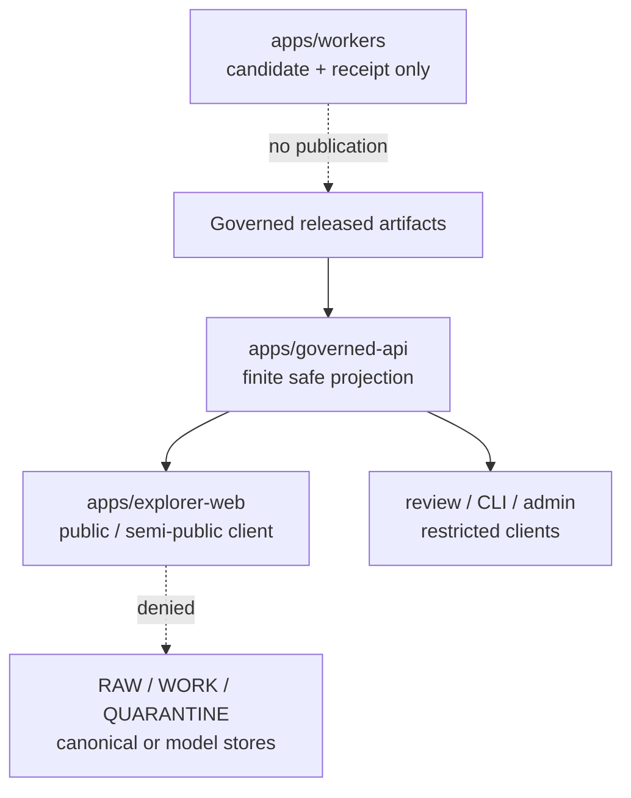

<!-- [KFM_META_BLOCK_V2]
doc_id: kfm://doc/apps-readme
title: apps/ - Deployable Applications
type: root-readme
subtype: canonical-root-landing-page
version: v0.6
prior_version: v0.5
status: draft; repository-grounded; mixed-maturity
owner: "NEEDS VERIFICATION — CODEOWNERS routes repository review to @bartytime4life and explicitly covers apps/governed-api/ and apps/explorer-web/; no accepted application-steward assignment, required independent-review rule, or release authority was verified"
created: 2026-05-10
updated: 2026-08-08
policy_label: public
current_path: apps/README.md
owning_root: apps/
responsibility: orient contributors to deployable application boundaries, current app-lane maturity, governed public access, validation, and reversible next work
truth_posture: cite-or-abstain
truth_labels: [CONFIRMED, PROPOSED, UNKNOWN, NEEDS VERIFICATION]
authority_class: canonical root landing page
authority_rank: implementation orientation subordinate to adopted doctrine, accepted ADRs, contracts, schemas, policy, evidence, lifecycle records, and release records
canonical_relationship: same-path update; no sibling authority created
evidence_snapshot:
  repository: bartytime4life/Kansas-Frontier-Matrix
  base_ref: main
  base_commit: 0f4cccc367e1beb18a31bb3459a579d6ab6e3fba
  root_tree: 03885136400d1b33975459c1f00a0139920d39e2
  apps_tree: 37af16928f3dcdef8ccf22509d149642045ebc26
  target_prior_blob: 4b7d11b3f5e62ea4458c2895bf907eade8975918
  directory_rules_blob: fd49a0b83e55cef52c1124281f093e263526898d
  directory_rules_adoption: ADR-0029; accepted
  codeowners_blob: dd2a84aa514d8ecd9208bc347f90f9a2ed37dd61
  governed_api_main_blob: bcc8d3a0ddba4b225e962b594d548819df0cbb71
  governed_api_routes_blob: 3418168d0b267160d6ad6dd87f289e880ef4a024
  governed_api_stub_blob: 5d7c137d2e78ddfca35a1356a96333ac2e84952b
  explorer_manifest_blob: e68ea6566580489a2c0a272e7ee387e9de249eb0
  explorer_entrypoint_blob: 9c95ae67333b7cbf6bc88051fa5c76e4cd97efa4
  explorer_shell_blob: 64c78c78820af33fb7a622094e4c0944ad9412f8
  explorer_governed_client_blob: 21f6e4d1225ab0427ecb689d6782f4b56fc25ea2
  explorer_drawer_blob: 7746843c259594568fe75e975155a67eb8372e8f
  explorer_trust_header_blob: 91197ecec1c1dce3ca5969c7bb5d1708967efc13
  explorer_time_scrubber_blob: e54aafb36c54f97863ce95bebda15c8a163640c3
  explorer_citation_pill_blob: 87d3036c175f626beca7e478690f61e05346c1da
  explorer_evidence_tooltip_blob: d732b39a7ae88f2f3f15b680f10d3c60bd743ad6
  api_workflow_blob: e1a6242d02cf7220f680c489d53162bec3433258
  ui_workflow_blob: 52382d796a8dd5ecafc39a801515aff0a8b013f8
related:
  - ../README.md
  - ../docs/doctrine/directory-rules.md
  - ../docs/adr/ADR-0029-adopt-directory-governance-standard-v2.md
  - ../docs/adr/INDEX.md
  - ../docs/adr/ADR-0004-apps-governed-api-is-the-trust-membrane.md
  - ../docs/adr/ADR-0005-apps-explorer-web-is-the-canonical-map-first-shell.md
  - ../docs/adr/ADR-0006-maplibre-boundary--only-maplibreadapter-imports-maplibre.md
  - ../docs/adr/ADR-0019-ai-adapter-contract-and-finite-envelopes.md
  - ../docs/adr/ADR-0025-public-client-never-reads-canonical-internal-stores.md
  - governed-api/README.md
  - explorer-web/README.md
  - explorer-web/src/README.md
  - explorer-web/src/features/README.md
  - review-console/README.md
  - cli/README.md
  - workers/README.md
  - admin/README.md
  - packages/README.md
  - ../packages/README.md
  - ../runtime/README.md
  - ../data/README.md
  - ../release/README.md
  - ../policy/README.md
  - ../schemas/README.md
  - ../contracts/README.md
  - ../tests/README.md
tags: [kfm, apps, deployables, trust-membrane, governed-api, explorer-web, finite-outcomes, mixed-maturity]
notes:
  - "v0.6 replaces the superseded Directory Rules conflict warning with accepted ADR-0029 and the pinned v2 authority."
  - "v0.6 records the current Explorer fixture-first trust projections: Evidence Drawer, Trust Header, accessible time scrubber, citation pill, evidence tooltip, correction/history visibility, and deterministic unit/browser coverage."
  - "Explorer remains a static fail-closed shell: only the no-input Evidence Drawer is mounted by the browser entrypoint; the newer trust components are independently tested modules, not a live governed API or map flow."
  - "No application code, route, workflow, dependency, deployment, policy, release, promotion, or publication behavior is changed by this README update."
[/KFM_META_BLOCK_V2] -->

# Deployable Applications

`apps/`

**Canonical home for KFM deployables, with the Governed API as the normal public trust membrane and every client, worker, operator, review, and administrative surface constrained by evidence, policy, release, correction, and rollback.**

**Quick navigation:** [Purpose](#purpose) · [Authority](#authority-level) · [Status](#status) · [Belongs](#what-belongs-here) · [Exclusions](#what-does-not-belong-here) · [Inputs](#inputs) · [Outputs](#outputs) · [Validation](#validation) · [Review](#review-burden) · [Related](#related-folders) · [ADRs](#adrs) · [Last reviewed](#last-reviewed) · [Evidence](#evidence-ledger) · [App map](#current-app-map) · [Gaps](#verified-gaps-and-next-work)

> [!IMPORTANT]
> `apps/` is an implementation root, not a truth, schema, contract, policy, lifecycle-data, evidence, proof, receipt, or release authority. A running app, successful request, rendered map, passing test, badge, pull request, or generated answer does not promote data or authorize publication.

> [!CAUTION]
> Public and semi-public clients use `apps/governed-api/` or a separately reviewed released-artifact path. They must not read RAW, WORK, QUARANTINE, PROCESSED, candidate, canonical, internal, or direct model-runtime stores. Missing evidence, policy support, or release closure resolves to `ABSTAIN`, `DENY`, or `ERROR`, not invented certainty.

> [!NOTE]
> ADR-0029 is accepted and makes [`docs/doctrine/directory-rules.md`](../docs/doctrine/directory-rules.md) the sole writable human Directory Rules authority. The architecture-path copy is a read-only compatibility dependency pending its governed migration; it is not a second editable authority.

---

## Purpose

`apps/` owns independently deployable processes and user-facing service boundaries for Kansas Frontier Matrix. It is where app-local entry points, routes, user interfaces, operator commands, background runners, app-local tests, and deployable composition belong.

The current root contains seven direct lanes:

- [`governed-api/`](governed-api/README.md) — bounded executable public trust membrane;
- [`explorer-web/`](explorer-web/README.md) — map-first public and semi-public browser client;
- [`review-console/`](review-console/README.md) — role-gated steward review surface;
- [`cli/`](cli/README.md) — restricted operator command surface;
- [`workers/`](workers/README.md) — non-publishing background runner lane;
- [`admin/`](admin/README.md) — restricted administrative surface;
- [`packages/`](packages/README.md) — documented drift guard, not a shared-package authority.

The root README describes current evidence and boundaries. It does not upgrade lane-local proposals, scaffolds, documentation, or tests into deployed product claims.

## Authority level

**Canonical deployable-application root / implementation-bearing / non-sovereign.**

Accepted Directory Rules classifies `apps/` as the home for deployable processes and user-facing service boundaries. Reusable logic belongs in `packages/`; provider composition belongs in `runtime/`; source acquisition belongs in `connectors/`; lifecycle transformation belongs in `pipelines/`; deployment and exposure belong in `infra/`; and release decisions belong in `release/`.

The root owns deployable composition. It does not own:

- the meaning of an object (`contracts/`);
- its machine-checkable shape (`schemas/`);
- allow, deny, hold, restrict, or abstain rules (`policy/`);
- canonical lifecycle state (`data/`);
- release, correction, withdrawal, or rollback decisions (`release/`);
- shared reusable implementation (`packages/`);
- provider/model integration exposed directly to clients (`runtime/`);
- source admission or acquisition (`connectors/`);
- lifecycle transformation authority (`pipelines/`, `pipeline_specs/`);
- deployment, network, host, or secret authority (`infra/`, external secret stores).

`CODEOWNERS` is review routing only. It is not a stewardship assignment, ReviewRecord, policy decision, release authority, separation-of-duty proof, or evidence that review occurred.

## Status

**Draft / repository-grounded / mixed maturity.**

This edition is pinned to `main@0f4cccc367e1beb18a31bb3459a579d6ab6e3fba` and apps tree `37af16928f3dcdef8ccf22509d149642045ebc26`. It describes repository bytes and bounded tests; it does not describe a deployed system or current production health.

### Evidence boundary

| Claim | Truth | Repository evidence | Limitation |
|---|---|---|---|
| `apps/` has seven direct child lanes plus this README. | CONFIRMED | Pinned apps tree | Direct-lane presence does not establish implementation maturity. |
| Governed API registers `/bootstrap`, `/layers`, and `/evidence` through a small WSGI application. | CONFIRMED | `governed-api/src/governed_api/main.py` and route registry | The routes are fail-closed scaffolds, not domain APIs. |
| Governed API route stubs return bounded `ABSTAIN / NOT_IMPLEMENTED` envelopes. | CONFIRMED | Current stub and bounded API tests | Does not prove authorization, EvidenceBundle resolution, deployment, or load behavior. |
| Explorer Web builds a static browser entrypoint and mounts a no-input Evidence Drawer over a fixed fail-closed shell state. | CONFIRMED | `explorer-web/src/main.ts`, shell resolver, manifest, and tests | No map, route tree, governed API transport, live evidence resolution, or deployment is present. |
| Explorer contains independently testable fixture-first Trust Header, accessible time scrubber, citation pill, evidence tooltip, Evidence Drawer, trust-overlay, and correction/history behavior. | CONFIRMED | Current feature modules plus unit and browser tests | Most components are not composed into the default shell and do not establish a live user flow. |
| Explorer package scripts run TypeScript/Vite build, Vitest unit tests, and Playwright browser tests. | CONFIRMED | Current `package.json`, lockfile, Playwright config, and `ui-build` workflow | Workflow wiring is not a hosted-run conclusion or deployment proof. |
| Review Console, CLI, Workers, and Admin remain scaffolded or documentation-led. | CONFIRMED | Pinned child trees and no current non-Explorer implementation delta | No product readiness is claimed. |
| `@bartytime4life` is the executable GitHub review route. | CONFIRMED | Current CODEOWNERS | Routing is not stewardship, independent approval, or release authority. |
| ADR-0029 is accepted; the app-related ADRs listed below remain proposed. | CONFIRMED | Current ADR source and index | Proposed ADRs remain design lineage rather than current behavior proof. |
| Deployment, dashboards, audit sinks, live authorization, service health, and public operation are established. | UNKNOWN | No admissible operational evidence inspected | Verify through infrastructure, runtime, logs, and deployed observations. |

### Trust flow

```mermaid
flowchart TD
    released["Governed released artifacts"] --> api["apps/governed-api<br/>finite safe projection"]
    api --> explorer["apps/explorer-web<br/>public / semi-public client"]
    api --> restricted["review / CLI / admin<br/>restricted clients"]
    workers["apps/workers<br/>candidate + receipt only"] -. "no publication" .-> released
    explorer -. "denied" .-> internal["RAW / WORK / QUARANTINE<br/>canonical or model stores"]
```

The Governed API and Explorer each provide bounded fail-closed executable slices. Explorer does not yet call the API, render a map, resolve live evidence, or expose a production claim surface. Internal-app mutation, worker execution, release assembly, deployment, and operational observability remain placeholder, held, or unverified.

## What belongs here

- App-local source and entry points for a deployable service, browser client, console, CLI, worker process, or restricted admin surface.
- App-local route registration and handler composition that consume external contracts and schemas without redefining them.
- App-local UI composition that consumes governed API envelopes and shared packages.
- App-local positive, negative, boundary, accessibility, unit, browser, and smoke tests.
- App-local non-secret examples and operator notes that do not replace `configs/`, `infra/`, or runbooks.
- Deployable packaging metadata when it does not create a second shared-package, policy, schema, source, receipt, proof, or release authority.
- Narrow adapters that exist only to translate an app's external boundary into shared package calls and contain no reusable hidden domain authority.

## What does not belong here

| Prohibited content | Canonical home | Why |
|---|---|---|
| Reusable libraries | `packages/` | Shared behavior must not be hidden inside one deployable. |
| Provider/model runtime composition | `runtime/` | Providers remain subordinate to governed app boundaries. |
| Contracts and JSON Schemas | `contracts/`, `schemas/` | Meaning and machine shape have separate authority roots. |
| Rego, access rules, or release policy | `policy/` | Apps apply policy; they do not define normative policy. |
| RAW, WORK, QUARANTINE, PROCESSED, catalog, triplet, or published objects | `data/` | Lifecycle state never lives in app source. |
| EvidenceBundles, proofs, and receipts | governed `data/` lanes | Trust-supporting records require governed homes. |
| Release manifests, decisions, corrections, withdrawals, and rollback cards | `release/` | App actions do not become publication decisions. |
| Source fetchers and source admission | `connectors/` | Acquisition is not deployable application authority. |
| Pipeline logic and declarative run specs | `pipelines/`, `pipeline_specs/` | Lifecycle transformations remain outside deployables. |
| Deployment, ingress, firewall, environment, and host definitions | `infra/` | Exposure posture is reviewed separately. |
| Credentials, tokens, private endpoints, signing material, protected payloads | External secret or restricted stores | Git and app source are not secret or quarantine boundaries. |
| Generated build or QA output | `artifacts/` only where its compatibility contract permits | Generated output must not accumulate in app source. |
| A shared-package implementation under `apps/packages/` | top-level `packages/` | The nested lane is a drift guard, not an authority. |

## Inputs

| Input | Owning root | Required posture |
|---|---|---|
| Semantic contracts | `contracts/` | Consumed without redefining meaning in app code |
| Machine schemas and response envelopes | `schemas/` | Runtime-validate before trust-bearing render or response |
| Policy decisions and obligations | `policy/` plus governed decision instances | Unknown or unresolved state fails closed |
| Evidence and citation support | governed evidence/proof lanes | `ANSWER` requires admissible support; otherwise abstain or deny |
| Released public-safe artifacts | governed released carriers through approved access | No direct public read of internal lifecycle stores |
| Release, correction, withdrawal, rollback state | `release/` | Preserve current disposition and invalidation state |
| Reusable implementation | `packages/` | Use stable shared boundaries rather than app-local forks |
| Provider/runtime results | `runtime/` behind Governed API or another reviewed membrane | Never expose provider/model output directly to public clients |
| Safe configuration defaults | `configs/` | No committed real secrets or private bindings |
| Deployment bindings | `infra/` and environment controls | Least privilege, explicit exposure, and auditable rollback |

## Outputs

| Output | Owner or channel | Required guardrail |
|---|---|---|
| Finite runtime response | Governed API response | Exactly one public outcome: `ANSWER`, `ABSTAIN`, `DENY`, or `ERROR` |
| Map, drawer, story, compare, citation, trust, time, or diagnostic render | Explorer Web | Downstream carrier only; never root truth |
| Review or operator proposal | Review Console / CLI | Auditable candidate; no self-approval or publication shortcut |
| Worker candidate or receipt | Governed lifecycle or receipt lane | Non-publishing; no canonical or published-store rewrite |
| Safe logs and metrics | Approved observability channel | No secrets, prompts, protected geometry, raw evidence, or full sensitive payloads |
| App-local build artifact | Build/CI channel | Rebuildable output; not a release decision or published carrier by location alone |

Apps do not directly emit approved release decisions, authoritative catalog state, proof closure, or published truth.

## Validation

### Repository-native checks

| Command or workflow | Current role | What it proves | What it does not prove |
|---|---|---|---|
| `make governed-api-smoke` | Governed API route/envelope tests | Registered routes fail closed and validate against the bounded envelope profile | Production auth, evidence resolution, network policy, load, or deployment |
| `make governed-api-verify` | API tests plus import boundary | Governed API avoids renderer and direct model-client imports | Runtime process isolation or public readiness |
| `make boundary-guards` | Cross-root public-boundary tests | Selected public-path and non-publisher invariants hold | Complete data-flow or information-flow proof |
| `make ui-build` | Explorer type-check and production build | Current source compiles and Vite emits a static bundle | Functional map, live API, accessibility completeness, or deployment |
| `pnpm --filter explorer-web test` | Explorer unit plus browser suite | Fixture-first finite-state, no-leak, keyboard, and component behavior | Live transport, canonical schema adoption, source access, or production UX |
| `make validate` | Aggregate repository validation | Configured schema/contract/validator baseline when executed | App deployment, release, or publication readiness |
| `.github/workflows/api-test.yml` | Hosted API wrapper | Bounded API checks at an exact revision | Human approval or deployment |
| `.github/workflows/ui-build.yml` | Hosted locked Explorer build/test wrapper | Real package scripts, frozen dependencies, build, unit, and browser tests | A usable map, live governed answer surface, release, or deployment |

A README update does not establish a fresh execution result. Local or hosted conclusions must be reported from the exact proposed head.

### Required negative cases for material app changes

- unknown route and unsupported method;
- malformed or unknown envelope fields;
- missing evidence, unresolved policy, unavailable release, stale support, and corrected or superseded support;
- internal-store, browser-to-model, renderer-boundary, and worker-publication bypass;
- protected detail in `DENY` or `ERROR` output;
- secret, prompt, protected geometry, raw evidence, or internal paths in logs and diagnostics;
- CLI, admin, or review action that attempts to bypass independent review, correction, or rollback;
- browser component that renders unsupported, unreleased, unreviewed, stale, or superseded detail;
- keyboard, focus-return, landmark, non-color status, and reduced-information failure paths where UI is involved.

### Documentation checks

For README-only changes:

- preserve exactly one H1 and one balanced `KFM_META_BLOCK_V2`;
- preserve balanced code fences, HTML tags, tables, alerts, and details blocks;
- keep the first twelve H2 sections in the Directory Rules README profile order;
- resolve generated heading anchors and repository-relative links;
- pin current-state claims to a commit/tree/blob evidence chain;
- use static badges only as evidence projections, never as unverified CI, security, maturity, release, or publication claims;
- avoid unsupported owner, workflow, route, test, deployment, policy, release, or runtime claims;
- validate an authoring receipt against final bytes when a receipt is part of the admitted change.

## Review burden

Current GitHub review routing is `@bartytime4life` through the default CODEOWNERS rule, with explicit routes for Governed API and Explorer Web.

Material changes require review proportional to their effect:

| Change | Review concern |
|---|---|
| Governed API route or response | API boundary, schema/contract, policy, evidence, access, security |
| Explorer data path, evidence projection, export, or renderer | UI, accessibility, adapter boundary, public trust membrane |
| Review Console, CLI, or Admin mutation | authorization, audit, separation of duties, rollback |
| Worker write target, queue, or schedule | non-publisher invariant, idempotency, receipts, failure recovery |
| Dependency, lockfile, build, or deploy change | supply chain, reproducibility, network/exposure posture |
| Public-safe transform or precision change | rights, sensitivity, source role, review, release, correction |

Governance role names are not executable GitHub identities. CODEOWNERS routing is not approval proof, and no app change may approve its own policy, promotion, release, publication, or rollback effect.

## Related folders

| Folder | Relationship |
|---|---|
| [`packages/`](../packages/README.md) | Shared reusable implementation consumed by deployables |
| [`runtime/`](../runtime/README.md) | Provider-neutral and provider-specific runtime composition behind governed apps |
| [`contracts/`](../contracts/README.md) | Semantic meaning consumed by apps |
| [`schemas/`](../schemas/README.md) | Machine-checkable shapes and envelopes |
| [`policy/`](../policy/README.md) | Access, rights, sensitivity, and release rules |
| [`data/`](../data/README.md) | Lifecycle instances, registries, receipts, proofs, catalogs, and released carriers |
| [`release/`](../release/README.md) | Release, correction, withdrawal, and rollback decisions |
| [`tests/`](../tests/README.md) | Cross-app and trust-boundary conformance evidence |
| [`configs/`](../configs/README.md) | Safe non-secret defaults and templates |
| [`infra/`](../infra/README.md) | Deployment, host, network, and exposure posture |
| [`.github/workflows/`](../.github/workflows/README.md) | CI orchestration and review signals; never publication authority |
| [`docs/doctrine/directory-rules.md`](../docs/doctrine/directory-rules.md) | Accepted sole writable Directory Rules authority |
| [`docs/architecture/directory-rules.md`](../docs/architecture/directory-rules.md) | Read-only compatibility dependency pending governed migration |

## ADRs

ADR-0029 is the accepted placement authority relevant to this root. The app-related records remain proposed design lineage unless a later accepted ADR or current implementation evidence establishes more.

| ADR | Effective status | Relationship |
|---|---|---|
| [`ADR-0029`](../docs/adr/ADR-0029-adopt-directory-governance-standard-v2.md) | `accepted` | Adopts Directory Rules v2 and makes `docs/doctrine/directory-rules.md` the sole writable authority |
| [`ADR-0004`](../docs/adr/ADR-0004-apps-governed-api-is-the-trust-membrane.md) | `proposed` | Describes Governed API as the trust membrane |
| [`ADR-0005`](../docs/adr/ADR-0005-apps-explorer-web-is-the-canonical-map-first-shell.md) | `proposed` | Describes Explorer Web as the map-first shell |
| [`ADR-0006`](../docs/adr/ADR-0006-maplibre-boundary--only-maplibreadapter-imports-maplibre.md) | `proposed` | Describes the renderer adapter boundary |
| [`ADR-0019`](../docs/adr/ADR-0019-ai-adapter-contract-and-finite-envelopes.md) | `proposed` | Describes provider-neutral adapters and finite envelopes |
| [`ADR-0025`](../docs/adr/ADR-0025-public-client-never-reads-canonical-internal-stores.md) | `proposed` | Describes the no-direct-store public-client invariant |

Accepted Directory Rules and current repository evidence control placement and current-state claims. Proposed ADR language does not upgrade scaffolds to implementation.

## Last reviewed

**2026-08-08**, against `main@0f4cccc367e1beb18a31bb3459a579d6ab6e3fba`, root tree `03885136400d1b33975459c1f00a0139920d39e2`, and apps tree `37af16928f3dcdef8ccf22509d149642045ebc26`.

Re-review after any app-lane creation or removal, public-route change, package-manager or lockfile change, renderer/runtime integration, worker write-target change, deployment exposure change, accepted app-architecture ADR, or child README update that materially changes the maturity map.

## Evidence ledger

| Evidence | Identifier | Supports | Does not support |
|---|---|---|---|
| Prior README | blob `4b7d11b3…` | Same-path baseline and no-loss review | Runtime behavior |
| Current base | `main@0f4cccc…` | Repository state used for this edition | Untracked files or deployed state |
| Apps tree | `37af1692…` | Direct lanes and tracked current app surfaces | Runtime reachability |
| Accepted Directory Rules | blob `fd49a0b8…`; ADR-0029 | Root placement, responsibility split, and compatibility posture | App implementation maturity |
| CODEOWNERS | blob `dd2a84aa…` | GitHub review routing | Stewardship, approval, or separation of duties |
| Governed API WSGI | blob `bcc8d3a0…` | Route and method dispatch | Production isolation |
| Governed API route registry | blob `3418168d…` | `/bootstrap`, `/layers`, `/evidence` registration | Domain implementation |
| Governed API stub | blob `5d7c137d…` | Bounded `ABSTAIN / NOT_IMPLEMENTED` source | Complete policy/evidence coverage |
| Explorer manifest | blob `e68ea656…` | Exact Node range, scripts, Vite/Vitest/Playwright/TypeScript dependencies | Hosted result or product architecture |
| Explorer entrypoint | blob `9c95ae67…` | Static shell and mounted no-input Evidence Drawer | Map, live API, or production route tree |
| Explorer shell resolver | blob `64c78c78…` | Fixed `ABSTAIN`/`ERROR` baseline states | Governed answer flow |
| Explorer governed projection adapter | current pinned blob | Strict fixture-only payload parsing, trust state, correction/history validation | Canonical payload schema adoption or transport |
| Evidence Drawer | blob `7746843c…` | Finite no-leak render, history/correction display, keyboard focus behavior | Live evidence service |
| Trust Header | blob `91197ece…` | Text-first finite trust projection and drawer delegation | Policy evaluation or shell integration |
| Time scrubber | blob `e54aafb3…` | Strict UTC-second governed temporal projection and accessible interaction | Historical truth or live timeline integration |
| Citation pill | blob `87d3036c…` | Reviewed/released/current evidence gating and copy-only link projection | Canonical navigation route |
| Evidence tooltip | blob `d732b39a…` | Supported-only tooltip and Drawer delegation | Map interaction integration |
| API workflow | current pinned file | Bounded API hosted orchestration | Human review or deployment |
| UI workflow | blob `52382d79…` | Locked build plus unit/browser test orchestration | A functional map, release, or publication |

## Current app map

| Lane | Current implementation truth | Verified entrypoint or check | Failure-safe posture |
|---|---|---|---|
| [`governed-api/`](governed-api/README.md) | Bounded executable WSGI, three fail-closed routes, route/envelope tests | `make governed-api-smoke`; `make governed-api-verify`; `api-test` | `ABSTAIN`, 404, or 405; no renderer/model/internal-store shortcut |
| [`explorer-web/`](explorer-web/README.md) | Static fail-closed shell plus fixture-first trust/evidence/time/citation components and deterministic unit/browser tests | `make ui-build`; `pnpm --filter explorer-web test`; `ui-build` | Missing or unsafe support hides detail or returns fixed `ABSTAIN`, `DENY`, or `ERROR`; no live API/map/publication path |
| [`review-console/`](review-console/README.md) | README-led feature scaffolds and minimal package surface | No accepted executable review flow | No review, promotion, correction, or rollback mutation is proven |
| [`cli/`](cli/README.md) | Python package skeleton with placeholder command modules | Placeholder module behavior only | No operator shortcut is release authority |
| [`workers/`](workers/README.md) | Named worker entrypoints remain placeholder-oriented | No accepted queue, schedule, or worker test suite | Watcher and worker outputs remain candidates/receipts, never publication |
| [`admin/`](admin/README.md) | README-only restricted boundary | No executable admin surface | Restricted and absent by default |
| [`packages/`](packages/README.md) | README plus drift guard | No workspace/package activation | Must not shadow top-level `packages/` |

### Explorer maturity split

**CONFIRMED integrated default shell:**

- static Vite entrypoint;
- fixed no-input `ABSTAIN / NO_GOVERNED_RESPONSE`;
- fixed error for unsupported shell input without reflection;
- a mounted no-input Evidence Drawer with keyboard close and focus return.

**CONFIRMED independently implemented and tested modules:**

- strict fixture-only governed evidence projection parser;
- finite Evidence Drawer with correction and negative-history visibility;
- text-first Trust Header;
- accessible governed time scrubber;
- supported-only evidence tooltip;
- reviewed/released/current citation pill;
- bounded roads/rail/trade trust overlay;
- soil Evidence Drawer delegation;
- drift and artifact-integrity fixture coverage.

**UNKNOWN or not implemented as a current integrated product flow:**

- MapLibre map and released layer catalog;
- live Governed API transport;
- canonical Evidence Drawer schema binding;
- map-click-to-evidence resolution;
- Focus Mode runtime;
- Story Player route composition;
- production compare/export;
- complete accessibility audit;
- authentication/authorization;
- deployment, telemetry, service-level objectives, or public operation.

## Verified gaps and next work

| Gap | Truth | Disposition | Dependency-safe next step |
|---|---|---|---|
| Explorer's default shell does not compose the newer trust, citation, tooltip, time, or domain-overlay modules. | CONFIRMED | DEFERRED | Choose one governed integration slice with a closed input contract, no-leak fixtures, browser tests, and rollback. |
| Explorer has no live Governed API transport or map renderer flow. | CONFIRMED | DEFERRED | Add transport only after canonical payload/schema and policy boundaries are accepted and tested. |
| Explorer child READMEs predate several August feature additions. | CONFIRMED | FOLLOW-UP | Refresh lane-local docs in a separate bounded documentation PR or dependency-closed Explorer integration slice. |
| Review Console has no executable review flow. | CONFIRMED | DEFERRED | Establish accepted review-record, authorization, audit, and separation-of-duty contracts before mutation UI. |
| CLI commands and Workers remain placeholders. | CONFIRMED | DEFERRED | Select one no-network dry-run command or non-publishing worker with fixtures, receipts, and fail-safe outputs. |
| Admin has no executable surface. | CONFIRMED | INTENTIONAL ABSENCE | Keep absent until a verified need, authorization model, audit path, and break-glass policy exist. |
| Governed API supports only fail-closed stubs. | CONFIRMED | DEFERRED | Add one evidence-resolving route only after contract, schema, policy, fixtures, and released public-safe input are ready. |
| App deployment and observability are unproved. | UNKNOWN | DEFERRED | Verify from deployed infrastructure, logs, health checks, and audit sinks; repository prose is insufficient. |
| App-specific ADRs remain proposed. | CONFIRMED | HOLD AS DESIGN LINEAGE | Do not treat their language as implementation or placement authority beyond accepted Directory Rules. |

## Safe change pattern

1. Pin the base commit and inspect the target app, parent README, related contracts, schemas, policy, tests, workflows, and open work.
2. Identify the app's exact input, output, finite failure state, public/internal boundary, side effects, and rollback.
3. Keep shared code, runtime composition, policy, schemas, contracts, lifecycle objects, receipts/proofs, releases, and infrastructure in their owning roots.
4. Add targeted positive and negative tests before upgrading maturity claims.
5. Run the app-specific command, boundary guards, and the smallest safe broader validation.
6. Record exact evidence and limitations; a workflow hold is not a pass, and a passing test is not release approval.
7. Deliver through a scoped branch and draft pull request. Do not merge, deploy, promote, release, or publish as part of routine app development.

## Root definition of done

The root is not complete while child lanes are placeholders. For a declared app slice, done means:

- reviewer routing, entrypoint, inputs, outputs, dependencies, finite failure states, side effects, and rollback are explicit;
- public traffic crosses the Governed API or another reviewed released-artifact path and cannot access internal lifecycle or model stores;
- schema, contract, policy, evidence, rights, sensitivity, release, correction, and rollback obligations are enforced where applicable;
- positive, negative, boundary, accessibility, build, integration, and no-leak checks appropriate to the slice pass;
- dependencies and build inputs are reproducibly pinned;
- logs, metrics, errors, and diagnostics are public-safe and secret-safe;
- documentation describes verified implementation without promoting proposals, scaffolds, checks, or generated output into authority;
- review remains distinct from merge, policy approval, release, deployment, and publication.

## Documentation change history

| Version | Date | Change | Runtime effect |
|---|---|---|---|
| v0.3 | 2026-07-22 | Reconciled the root contract with the seven app lanes and mixed implementation maturity. | None; documentation and receipt only. |
| v0.4 | 2026-07-23 | Repinned the evidence snapshot, clarified review routing versus stewardship, recorded the then-unresolved Directory Rules duplicate, and added an evidence ledger. | None; documentation and receipt only. |
| v0.5 | 2026-07-29 | Recorded the locked, buildable, tested, fail-closed Explorer Web shell baseline. | Static shell only; no API, renderer, claim, release, or deployment behavior. |
| v0.6 | 2026-08-08 | Reconciled accepted ADR-0029 and the current Explorer trust/evidence/time/citation modules while preserving the static-shell integration boundary. | None; documentation only. |

## Correction and rollback

Before merge, close the review branch or revert its README commit. After an authorized merge, use a transparent revert or forward correction restoring prior blob `4b7d11b3f5e62ea4458c2895bf907eade8975918`, then rerun the same documentation checks.

A README rollback changes no application code, dependency, route, test, workflow, deployment, policy, release, promotion, or publication state. Never rewrite shared history to correct documentation.

---

> **Current conclusion:** `apps/` is correctly placed but not uniformly implemented. Governed API provides a small fail-closed route slice. Explorer Web provides a buildable static shell plus a growing set of fixture-first trust, evidence, time, and citation components, but it is still not a functional map or live governed answer client. Review Console, CLI, Workers, and Admin remain separate future implementation slices, and `apps/packages/` remains a drift guard.

<a href="#top">Back to top</a>

