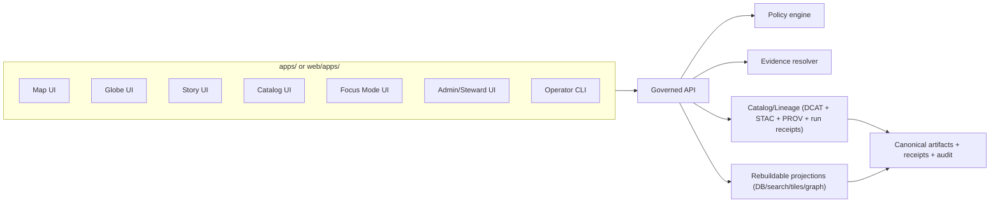

<!-- [KFM_META_BLOCK_V2]
doc_id: kfm://doc/8a4a8e59-7a6f-4d60-9c56-9f6d5f8b1f3d
title: apps/ — Runnable application surfaces
type: standard
version: v3.4
status: draft
owners: TBD (resolve via CODEOWNERS / repo maintainers)
created: 2026-02-22
updated: 2026-03-01
policy_label: public
related:
  - kfm://doc/kfm-definitive-design-governance-guide-vnext
  - kfm://doc/UNKNOWN_SYSTEM_OVERVIEW
  - ../README.md
  - ../CONTRIBUTING.md
  - ../SECURITY.md
  - ../CHANGELOG.md
  - ../.github/README.md
  - ../docs/
tags: [kfm, apps, ui, trust-membrane, contracts, evidence-first, receiptviewer, trust-badges, promotion-contract, threat-model, app-registry, view-state]
notes:
  - This README is intentionally fail-closed: it does not assume a specific tech stack or app list until confirmed in-repo.
  - First follow-up: populate the App Registry + Current layout blocks from the actual apps tree (either `apps/` or `web/apps/`, depending on repo convention).
  - v3.4 upgrade: align tag definitions (CONFIRMED/PROPOSED/UNKNOWN/DECISION NEEDED) with the KFM vNext guide; require “UNKNOWN → default + minimum verification step.”
  - v3.4 upgrade: align “Testing and gates” baseline with KFM catalog/evidence contract CI checks (schema + linkcheck + resolver contract tests + spec_hash stability + golden determinism).
  - v3.4 upgrade: refine Evidence Resolver expectations to match contract posture (allow/deny + obligations, EvidenceBundle contents, <=2-call UX).
  - v3.4 upgrade: add explicit “catalogs are contract surfaces” implications for apps (DCAT/STAC/PROV cross-links; provenance navigation must be deterministic).
[/KFM_META_BLOCK_V2] -->

<a id="top"></a>

# apps/ — Runnable application surfaces

**Purpose:** Home for user-facing and operator-facing application surfaces (Map / Globe / Story / Catalog / Focus / Admin / CLI) that consume **governed APIs** and expose **evidence-first** UX with **cite-or-abstain** guarantees.

**Owners:** TBD (resolve via CODEOWNERS / repo maintainers)  
**Status:** draft — **fail-closed** (repo-specific facts remain **UNKNOWN** until verified)  
**Policy label:** public (documentation only; individual apps may be `restricted|internal|secret`)

<!-- TODO(kfm): replace placeholder badges with real workflow badges once repo wiring is confirmed. -->


> [!WARNING]
> This document is **fail-closed**. Anything repo-specific (actual app list, tooling, owners, contract paths, whether apps live in `apps/` or `web/apps/`) is **UNKNOWN** until verified in-repo.
> Do not “fill in the blanks” from memory.

---

## Navigation

- [Directory contract](#directory-contract)
- [Truth status legend](#truth-status-legend)
- [First follow-up checklist](#first-follow-up-checklist)
- [Where this fits in the repo](#where-this-fits-in-the-repo)
- [Repo layout crosswalk](#repo-layout-crosswalk)
- [Non-negotiable invariants](#non-negotiable-invariants)
- [Promotion Contract awareness](#promotion-contract-awareness)
- [Catalogs and provenance as contract surfaces](#catalogs-and-provenance-as-contract-surfaces)
- [Trust surfaces required](#trust-surfaces-required)
- [Evidence resolver expectations](#evidence-resolver-expectations)
- [Focus Mode UX contract](#focus-mode-ux-contract)
- [Threat model checklist](#threat-model-checklist)
- [Architecture sketch](#architecture-sketch)
- [App registry](#app-registry)
- [Directory layout](#directory-layout)
- [App manifest contract](#app-manifest-contract)
- [Per-app README minimum](#per-app-readme-minimum)
- [Local development](#local-development)
- [Testing and gates](#testing-and-gates)
- [Security, privacy, and sensitivity](#security-privacy-and-sensitivity)
- [Add a new app](#add-a-new-app)
- [Glossary](#glossary)

---

## Directory contract

This section is the directory-level “README contract” for `apps/`.

### Where it fits

`apps/` is a **surface-layer** directory. It sits at the end of the KFM layering model:

- **Domain** → concepts and invariants (no UI)
- **Use cases** → workflows (map/story/focus/admin)
- **Interfaces** → contracts + policy boundary (governed API, schemas)
- **Infrastructure** → storage/index, pipelines, CI
- **Apps** → UX that consumes governed APIs and makes trust + evidence visible

### Acceptable inputs

This folder is for **runnable applications**—anything a human launches (browser UI, operator console, desktop wrapper, CLI) whose job is **presenting governed KFM knowledge**.

Typical app categories (examples; verify actual apps in this repo):
- Map Explorer UI (2D map + timeline + evidence drawer + policy badges)
- Globe UI (optional 3D; same evidence constraints)
- Story UI (narrative + claim citations + view-state replay)
- Catalog UI (dataset discovery + version browsing)
- Focus Mode UI (governed Q&A with cite-or-abstain)
- Admin/Steward UI (intake review, promotion dashboards, policy fixtures review; usually restricted)
- CLI (operator workflows via governed APIs)

### Exclusions

The following do **not** belong in `apps/`:

- shared domain libraries used by multiple apps (move to the workspace’s shared packages area)
- shared UI components used by multiple apps (move to shared UI component space)
- data pipelines or long-running jobs (move to pipeline/workflow area)
- any direct storage/index access adapters
  - no DB drivers in browser code
  - no object-store clients in browser code
  - no “search index client in the UI” patterns
- policy engines or redaction logic
  - policy enforcement belongs in governed APIs and CI, not in clients
- receipt/attestation verification logic
  - clients may *display* verification results; verification occurs behind the trust membrane
- long-lived secrets or embedded credentials

> [!IMPORTANT]
> Shared libraries should **not** live here. Put shared code in the repo’s shared workspace (e.g., `packages/`, `web/packages/`, etc.) to prevent copy/paste drift.

---

## Truth status legend

This README uses explicit claim labels so it stays **evidence-first** and **fail-closed**:

- **CONFIRMED (design):** required system posture / invariant (safe to state as a requirement)
- **PROPOSED:** implementable recommendation (requires adoption)
- **UNKNOWN / DECISION NEEDED (repo):** not verified in this repository yet

> [!NOTE]
> Every **UNKNOWN** in this README is expected to ship with:
> 1) a recommended default path, and  
> 2) the **minimum verification step** needed to convert UNKNOWN → CONFIRMED (repo).

---

## First follow-up checklist

These steps convert this README from **UNKNOWN-heavy** to **repo-confirmed** without guessing.

### Repo facts to confirm

- [ ] Confirm where runnable UI surfaces live:
  - `ls -la apps/` **and** `ls -la web/apps/` (one may not exist)
- [ ] Capture at-a-glance trees:
  - `tree -L 3 apps/` (or `find apps -maxdepth 3 -type d`)
  - `tree -L 3 web/apps/` (or `find web/apps -maxdepth 3 -type d`)
- [ ] Identify the workspace/tooling boundary:
  - look for `package.json`, `pnpm-workspace.yaml`, `yarn.lock`, `turbo.json`, `nx.json`, `Cargo.toml`, `go.work`, etc.
- [ ] Resolve ownership:
  - inspect `CODEOWNERS` and any governance owners registry (if present)
- [ ] Locate contract surfaces consumed by apps:
  - search for `openapi`, `graphql`, `schema`, `contracts`, `sdk`, `client`, `generated`, `proto`
  - search for DCAT/STAC/PROV profile artifacts if stored in-repo (`dcat`, `stac`, `prov`)
- [ ] Locate trust UX components and their contract sources:
  - search for `EvidenceDrawer`, `ReceiptViewer`, `EvidenceRef`, `EvidenceBundle`, `run_receipt`, `promotion_manifest`
- [ ] Confirm policy labels and deny/abstain patterns in UI:
  - search for `policy_label`, `obligations`, `classification`, `redaction`, `abstain`, `deny`, `policy_safe`
- [ ] Confirm “policy-safe errors” posture:
  - search for `hide_restricted`, `not_found_forbidden`, `indistinguishable`, `policy_safe_error`
- [ ] Confirm catalog link-check posture exists somewhere in CI/tooling:
  - search for `linkcheck`, `cross-link`, `stac link`, `dcat link`, `prov link`

> [!TIP]
> Once verified, update only two sections first:
> 1) [App registry](#app-registry)  2) [Directory layout](#directory-layout)

---

## Where this fits in the repo

Some KFM repo layouts place runnable apps under `web/apps/` (with `web/` as the frontend workspace). If that’s true in your repo, treat this README as describing that subtree and consider either:

- moving this README to `web/apps/README.md` and leaving a short stub here, or
- keeping both copies with a single source-of-truth generator (preferred).

> [!PROPOSED]
> If you adopt “single source of truth,” store the canonical markdown in `docs/standards/apps.README.md` and generate `apps/README.md` and/or `web/apps/README.md` in CI.

---

## Repo layout crosswalk

This prevents “directory drift” when the repo uses `web/` as the frontend root.

> [!IMPORTANT]
> These are *layout patterns* (PROPOSED), not confirmations of your current repo state.

| Concept | Common location (root apps layout) | Common location (web layout) | What this means for this README |
|---|---|---|---|
| Runnable UI surfaces | `apps/<app>/` | `web/apps/<app>/` | Update “Current layout” + App Registry from whichever exists. |
| Shared UI packages | `packages/` | `web/packages/` | Keep shared code out of app folders. |
| Shared UI components | `packages/ui*/` | `web/src/components/` | Trust components should not be duplicated per app. |
| Contract schemas | `contracts/` or `schemas/` | `contracts/` or `schemas/` | Apps are contract consumers. |
| Governed API | `apps/api/` or `services/api/` | `apps/api/` or `services/api/` | Apps must not implement policy enforcement. |
| Governance policy | `policy/` | `policy/` | Policy is enforced by API + CI; apps display results. |
| CI gates | `.github/workflows/` | `.github/workflows/` | Apps are safety-critical: trust flows should be required checks. |

---

## Non-negotiable invariants

Apps are the most visible trust surface; breaking invariants breaks credibility. These invariants are **system-level** and apply to every app.

### 1) Truth path lifecycle (KFM north star)

- Apps sit at the end of the truth path:
  - upstream → RAW → WORK / QUARANTINE → PROCESSED → CATALOG / LINEAGE (DCAT + STAC + PROV + run receipts) → projections → governed API → apps
- Apps **MUST** assume only *promoted* DatasetVersions are admissible for public surfaces.
- Apps **MUST NOT** use “floating latest” as a substitute for versioned IDs in share links, exports, or Story Nodes.

### 2) Trust membrane (KFM north star)

- Apps **MUST NOT** access object storage, databases, or internal indexes directly.
- Apps **MUST** consume data only through **governed APIs** that enforce policy, obligations/redactions, and logging.
- Apps **MUST NOT** embed credentials that could bypass governance.

### 3) Evidence-first UX (KFM north star)

Every layer, story claim, chart, or AI output **MUST** open into an **evidence view**:

- DatasetVersion ID and human name
- License and rights holder attribution (copyable)
- Policy label and obligations/redactions applied
- Provenance chain and run receipt reference
- Validation and freshness indicators (policy-safe)
- Evidence bundle digest/checksum (when policy allows)

### 4) Cite-or-abstain Focus Mode (KFM north star)

If Focus Mode exists, it **MUST** implement cite-or-abstain:

- If citations can’t be verified, the UI **MUST** abstain or reduce scope and show why (policy-safe).
- If policy denies, the UI **MUST** deny and explain in policy-safe terms.
- Every Focus response **MUST** link to an `audit_ref` (run id) for review.

### 5) Canonical vs rebuildable stores (KFM north star)

- Canonical truth lives in: artifacts + catalogs + run receipts + audit ledger.
- Apps **MUST** treat DB/search/tiles/graph as rebuildable projections, not source-of-truth.
- Apps **MUST** display DatasetVersion identity and evidence links that tie projections back to canonical artifacts.

### 6) Deterministic identity and hashing (KFM north star)

- DatasetVersion identity is stable and derived deterministically (spec-hash posture).
- Apps **MUST** use stable IDs in URLs/share links/view_state and avoid “version drift.”
- Apps **SHOULD** surface spec-hash/digest identifiers where policy allows.

---

## Promotion Contract awareness

> [!IMPORTANT]
> Promotion gates are enforced in pipelines/CI and the governed API — but apps must not become a bypass.

UI implications:

- Apps **MUST** show only promoted DatasetVersions on public surfaces.
- Apps **MUST** assume “PUBLISHED surfaces serve only promoted dataset versions” (i.e., versions with processed artifacts + validated catalogs + run receipts + policy label assignment).
- Apps **MUST** render “untrusted / not promotable” states safely:
  - missing receipt
  - missing catalogs
  - unresolvable evidence
  - policy engine degraded
- Apps **MUST** treat missing/invalid evidence as a reason to **degrade**, not as permission to render anyway.
- Any export/download UX **MUST** be checked against policy label + license/rights, and must be policy-safe (no restricted existence inference).

---

## Catalogs and provenance as contract surfaces

Catalogs are not “nice metadata.” They are the canonical interface between pipeline outputs and runtime surfaces.

### What this means for apps

- Apps should treat the **catalog triplet** (DCAT + STAC + PROV) as the authoritative source for:
  - dataset identity + DatasetVersion identity
  - license/rights attribution + allowed distributions
  - spatiotemporal extents and asset inventories (policy-safe geometry where required)
  - lineage navigation (what produced this, from what inputs, with what tooling)
- Apps **MUST** avoid “best effort” provenance assembly in the client.
  - If a link is missing/broken, show **untrusted** and route to steward review.
- Apps should expect **deterministic navigation**:
  - DCAT ↔ STAC ↔ PROV cross-links are stable and link-checkable
  - EvidenceRefs resolve into these objects without guessing

> [!NOTE]
> When catalogs and evidence are validated in CI (schema + cross-link check), runtime UX becomes reproducible and “silent drift” is prevented.

---

## Trust surfaces required

These are not optional polish. They are the user-visible governance contract.

### Trust-surface requirements by app type

> [!NOTE]
> This is **CONFIRMED (design)** as a target posture. Confirm exact implementations in-repo.

| App type | Evidence Drawer | DatasetVersion + Policy badges | ReceiptViewer | Provenance panel | What-changed (versions) | Exports gated by policy/rights |
|---|---:|---:|---:|---:|---:|---:|
| Map Explorer | ✅ MUST | ✅ MUST | ✅ SHOULD | ✅ SHOULD | ✅ SHOULD | ✅ MUST |
| Story | ✅ MUST (claim-level) | ✅ MUST | ✅ SHOULD | ✅ SHOULD | ✅ SHOULD | ✅ MUST |
| Catalog | ✅ SHOULD | ✅ MUST | ✅ SHOULD | ✅ SHOULD | ✅ MAY | ✅ MUST (if exports exist) |
| Focus | ✅ MUST (citations) | ✅ MUST | ✅ SHOULD | ✅ MUST (audit_ref/receipt) | ✅ MAY | ✅ MUST (if exports exist) |
| Admin/Steward | ✅ MUST | ✅ MUST | ✅ MUST | ✅ MUST | ✅ SHOULD | ✅ MUST |
| CLI | N/A | N/A | ✅ SHOULD (read) | ✅ SHOULD | ✅ MAY | ✅ MUST (server-side) |

### Evidence drawer minimum fields

- Evidence bundle ID and digest
- DatasetVersion ID and dataset name
- License and rights holder attribution
- Validation status + QA summary (policy-safe)
- Provenance chain link to run receipt
- Obligations/redactions applied
- Policy-safe access messaging (deny/abstain states)

> [!WARNING]
> Evidence UX must never become a data exfiltration path. “Evidence exists” must not leak restricted existence unless policy allows acknowledging existence.

---

## Evidence resolver expectations

Evidence resolution is a **contract surface** (not a best-effort UI feature).

### Required posture

- Apps **MUST** treat the evidence resolver as authoritative for citations/evidence bundles.
- Evidence resolver **MUST**:
  - accept EvidenceRef (`scheme://...`) *or* a structured reference (e.g., dataset_version + record id + span)
  - apply policy and return allow/deny + obligations
  - return an EvidenceBundle with:
    - human view (renderable card)
    - machine metadata (JSON)
    - artifact links (**only if allowed**)
    - digests + dataset_version ids
    - audit references
- Apps **SHOULD** be able to fetch/render an EvidenceBundle in **≤ 2 calls** (e.g., resolve → fetch bundle), otherwise degrade safely.
  - click feature → resolve evidence → view bundle
  - click citation → resolve evidence → view same bundle

### Fail-closed UI behavior

- if evidence is unresolvable → show “untrusted” / abstain
- if policy denies → show deny UX (policy-safe)

> [!NOTE]
> Do not build DIY citations in clients. EvidenceRefs must resolve to EvidenceBundles.

---

## Focus Mode UX contract

If Focus Mode exists, it must behave like a governed run, not chat.

**Inputs**
- user query
- optional view_state (map bbox, time window, active layers)
- user role + policy context

**Outputs**
- answer text
- citations (EvidenceRefs) resolvable to EvidenceBundles
- audit_ref (run id) for review

### Control loop (required posture)

1) Policy pre-check  
2) Retrieval plan (based on view_state + intent)  
3) Retrieve admissible evidence (catalog/search/graph/projections)  
4) Build EvidenceBundles via evidence resolver (apply obligations)  
5) Synthesize answer referencing bundles  
6) **Citation verification (HARD GATE)** — if any citation fails or is denied, revise or abstain  
7) Emit run receipt (query + bundle digests + decisions + output hash)

### Evaluation harness (release posture)

For broad release, Focus Mode **SHOULD** be gated by an evaluation harness:

- citation coverage (claims supported)
- citation resolvability (100% for allowed users)
- refusal correctness (restricted prompts denied safely)
- sensitivity leakage tests (no restricted coordinates/metadata)
- golden queries across DatasetVersions (regression gate)

---

## Threat model checklist

Use this checklist when reviewing new app features (especially exports, sharing, search, and AI).

- TM-001 **Trust membrane:** Does the frontend ever fetch directly from object storage or databases? **Expected: NO**
- TM-002 **Restricted inference:** Can a public user infer restricted dataset existence via errors, timing, caching, or empty states? **Expected: NO**
- TM-003 **Exports:** Are downloads/exports checked against policy labels and rights, and do exports include required attribution/license text when applicable? **Expected: YES**
- TM-004 **Caching:** Can tiles/search results leak across roles due to shared caches? **Expected: NO**
- TM-005 **Focus injection:** Can retrieved content prompt-inject the system into policy bypass? **Expected: mitigated**
- TM-006 **Audit data safety:** Are audit logs redacted and access-controlled (PII safety)? **Expected: YES**
- TM-007 **Credential scope:** Are tokens short-lived and least-privilege? **Expected: YES**
- TM-008 **Artifact immutability:** Are rendered artifacts immutable-by-digest where applicable? **Expected: YES**
- TM-009 **UI trust flows tested:** Are evidence/deny/abstain flows covered by E2E tests? **Expected: YES**

---

## Architecture sketch



### Evidence-first interaction sketch


---

## App registry

> [!IMPORTANT]
> Populate this from the **actual** apps tree:
> - either `apps/*` **or** `web/apps/*`
> - do not assume both exist

### App registry table (human)

| App path | Type | Primary surface | Policy label | Primary contract references | Owner | Status |
|---|---|---|---|---|---|---|
| `TBD` | web / desktop / cli / other | map / globe / story / catalog / focus / admin / ops | public / restricted / internal | `TBD` | `TBD` | draft |
| `TBD` |  |  |  |  |  |  |

### Machine-readable App Registry (PROPOSED)

Keep the canonical registry in a small JSON file that CI can validate:

- `apps/registry/apps.v1.json` **or** `web/apps/registry/apps.v1.json` (choose one based on repo convention)

Template:

```json
{
  "kfm_app_registry_version": "v1",
  "updated": "2026-03-01",
  "apps": [
    {
      "app_id": "kfm.app.map",
      "path": "apps/map",
      "surface": "map",
      "policy_label": "public",
      "owners": ["@kfm-engineering"],
      "contracts": ["contracts/openapi/api.yaml#tag=tiles", "contracts/openapi/api.yaml#tag=evidence"],
      "trust_surfaces": ["evidence_drawer", "receipt_viewer", "provenance_panel"],
      "capabilities": { "view_state": true, "exports": ["png"], "focus_mode": false }
    }
  ]
}
```

### Registry definition of done

- [ ] Every app has a one-line purpose (README).
- [ ] Every app declares `policy_label` (and any restrictions).
- [ ] Every app lists governed API contract references (OpenAPI/GraphQL/schema URIs/paths).
- [ ] Every public surface declares its trust surfaces (EvidenceDrawer/ReceiptViewer/provenance/what-changed).
- [ ] Every map/story/focus surface declares whether it supports reproducible `view_state`.
- [ ] Owners resolved via `CODEOWNERS` and/or registry.

---

## Directory layout

### Current layout (UNKNOWN until verified)

Replace the block below with the real tree output (choose the directory that exists).

```text
apps/ or web/apps/
├─ README.md
└─ TBD
```

### Recommended layout template (apps-at-root)

Use only if the repo does not already enforce a different convention.

```text
apps/                                                            | # App surfaces (UI + services) + governed registry
├─ README.md                                                     | # Directory contract + App Registry index (human-readable)
│
├─ registry/                                                     | # Machine-readable app inventory + CI validation fixtures
│  ├─ README.md                                                  | # Registry purpose + DoD + CI validation rules
│  ├─ apps.v1.json                                               | # Canonical App Registry (names, owners, policy labels, capabilities)
│  ├─ fixtures/                                                  | # CI fixtures (no secrets; policy-safe)
│  │  ├─ apps.v1.minimal.json                                    | # Smallest valid registry example
│  │  └─ apps.v1.invalid.examples.json                           | # Intentionally invalid cases for fail-closed validation
│  └─ _generated/                                                | # ⚠️ Generated snapshots (gitignored or policy-committed)
│     └─ manifests.index.json                                    | # Optional flattened index from per-app manifests
│
├─ api/                                                          | # ✅ Governed API (runtime trust membrane / PEP)
│  ├─ README.md                                                  | # Service overview, run/dev, contracts, policy, observability
│  ├─ kfm.app.json                                               | # ✅ App manifest (policy_label, contracts, capabilities)
│  ├─ Dockerfile                                                 | # ⚠️ If deploying as a container
│  └─ ...                                                        | # (see API directory docs; do not assume tech stack)
│
├─ map/                                                          | # Map Explorer UI (map-first browse + inspect + export)
├─ story/                                                        | # Story Mode UI (publish/read narratives with citations)
├─ catalog/                                                      | # Catalog UI (browse datasets, versions, lineage; evidence-backed)
├─ focus/                                                        | # Focus Mode UI (ask → cite-or-abstain answers + audit)
├─ admin/                                                        | # Admin/Steward UI (review, promote, audit, policy fixtures)
└─ cli/                                                          | # CLI surface (operator tooling; policy-aware)
```

### Recommended layout template (web/apps)

If your repo uses a `web/` workspace root:

```text
web/
├─ apps/
│  ├─ README.md
│  ├─ registry/
│  │  └─ apps.v1.json
│  ├─ map/
│  ├─ story/
│  ├─ catalog/
│  ├─ focus/
│  └─ admin/
└─ packages/                                   # Shared UI packages (do not duplicate per-app)
```

---

## App manifest contract

Each app directory **SHOULD** include an app manifest file (example: `kfm.app.json`) so governance intent is machine-readable.

> [!NOTE]
> If the repo already has a standard manifest, use that instead. This is a PROPOSED contract.

### Example kfm.app.json

```json
{
  "app_id": "kfm.app.map",
  "name": "KFM Map Explorer",
  "surface": "map",
  "policy_label": "public",
  "capabilities": {
    "view_state": true,
    "exports": ["png"],
    "focus_mode": false
  },
  "governed_api": {
    "base_url_env": "KFM_API_BASE_URL",
    "contracts": [
      "openapi://contracts/openapi/api.yaml#tag=catalog",
      "openapi://contracts/openapi/api.yaml#tag=tiles",
      "openapi://contracts/openapi/api.yaml#tag=evidence"
    ]
  },
  "trust_surfaces": ["evidence_drawer", "receipt_viewer", "provenance_panel", "what_changed"],
  "telemetry": {
    "otel": true,
    "pii": "none"
  }
}
```

### Minimal manifest rules (PROPOSED)

- `policy_label` is mandatory.
- `governed_api.contracts` is mandatory for any app that makes API calls.
- `trust_surfaces` is mandatory for any public-facing surface that renders layers or claims.
- `capabilities.view_state = true` SHOULD be set for Map/Story/Focus surfaces that emit share links.

---

## Per-app README minimum

Each app under `apps/<app>/` or `web/apps/<app>/` SHOULD include a README that answers:

- title and one-line purpose
- where it fits in the system
- acceptable inputs
- exclusions
- governed API contracts used
- trust surfaces (EvidenceDrawer, ReceiptViewer, provenance, what-changed)
- view_state expectations (if applicable)
- how to run locally
- tests and CI gates
- threat model notes for exports/share/search/AI features

### Template header snippet

```md
<!-- [KFM_META_BLOCK_V2]
doc_id: kfm://doc/<uuid>
title: apps/<app>/ — <purpose>
type: standard
version: v1
status: draft|review|published
owners: <team or names>
created: YYYY-MM-DD
updated: YYYY-MM-DD
policy_label: public|restricted|...
related:
  - ../README.md
tags: [kfm, apps]
notes:
  - Keep repo-unknowns explicit until verified.
[/KFM_META_BLOCK_V2] -->
```

---

## Local development

> [!IMPORTANT]
> This section is intentionally generic until the repo’s tooling is verified.

### Quick start pattern

1. Identify the workspace toolchain from repo root (and whether frontend is rooted at `web/`).
2. Install dependencies using the repo’s chosen package manager.
3. Run the app’s dev target from its directory.
4. Confirm it points to a **governed API** instance (not direct storage/DB).

### Proposed environment variables

- `KFM_API_BASE_URL` — base URL for the governed API gateway
- `KFM_ENV` — `local|dev|stage|prod`

> [!WARNING]
> Apps must be safe under policy deny. Even if UI misconfigures itself, restricted content must not render because enforcement occurs in the API.

---

## Testing and gates

Apps are safety-critical surfaces. Treat app changes like production changes.

### Minimum CI gates (recommended baseline)

**App-level (always relevant)**
- [ ] unit tests for UI + adapters
- [ ] accessibility checks (EvidenceDrawer keyboard navigation at minimum)
- [ ] dependency and supply chain checks
- [ ] static guardrail: **no direct storage/DB access** from apps
- [ ] policy-safe errors guardrail (no restricted existence inference)
- [ ] ReceiptViewer safe-render tests (schema validate + “untrusted” fallback) if receipts/manifests render in the client
- [ ] E2E tests for critical trust flows (below)

**Contract-level (ties apps to governance)**
- [ ] contract checks for governed API compatibility (OpenAPI/GraphQL/schema)
- [ ] catalog profile validation (DCAT/STAC/PROV) against KFM profiles/constraints (where stored in-repo)
- [ ] link check: cross-links exist and resolve in repo context (where stored in-repo)
- [ ] evidence resolver contract tests:
  - [ ] “public” evidence resolves to bundle with allowed artifacts
  - [ ] “restricted” evidence returns deny/403 with **no sensitive metadata leakage**
- [ ] spec_hash stability tests (no identity drift)
- [ ] golden tests for canonicalization and deterministic outputs (reproducibility)

### Anti-skip requirement (merge posture)

> [!WARNING]
> A required app gate must not be skippable via `paths:` filters, `if:` conditions, or job fanout.
> Prefer a single always-runs **gate-summary** job as the required check (see `../.github/README.md` if present).

### Recommended E2E trust flows

- load app → toggle a layer → open EvidenceDrawer → verify policy label + DatasetVersion shown
- change time window → verify results change → evidence remains version-pinned
- open a story claim → open citations → resolver success or policy-safe deny
- open receipt viewer → verified/untrusted renders safely
- ask a Focus question → citations present or abstain with reasons + audit_ref
- attempt export → policy + rights enforced; policy-safe errors; no restricted inference

### Static guardrail examples (PROPOSED)

Because tech stacks vary, the implementation varies. The invariant does not: **apps cannot bypass governed APIs**.

Possible approaches:
- dependency allow/deny list in CI (fail if an app depends on DB/object-store/index client SDKs)
- linter rules blocking direct calls to non-governed origins (where applicable)
- egress policy in dev/stage to prevent direct access to internal stores from UI origins
- targeted grep checks for known bypass libraries (tune to avoid false positives)

---

## Security, privacy, and sensitivity

### Secrets and credentials
- Never ship secrets in clients.
- Prefer short-lived tokens scoped to least privilege.
- Do not log tokens or sensitive request payloads.

### Rights and licensing (policy input)
- Export functions should include attribution and license text automatically (when exports exist).
- Story publishing flows should block if rights are unclear for included media.
- If rights/terms are unclear, degrade to **metadata-only** and route to steward review.

### Evidence UI guardrails

- validate evidence bundle shape before rendering derived UI
- ReceiptViewer must be safe by construction:
  - validate schema before derived views
  - never render untrusted HTML
  - treat external links as hostile by default
- if evidence cannot be verified or resolved, render as **untrusted** and block publish flows

### Sensitive locations and culturally restricted material

- do not render exact coordinates in public UIs for vulnerable/restricted sites
- prefer generalization and show a governance note explaining why
- never allow share links to “accidentally” encode restricted geometry

### Abstention and restriction UX

Abstention is a feature. The UI must:
- show policy-safe reasons
- suggest safe alternatives
- provide `audit_ref` for steward review
- avoid leaking restricted existence

---

## Add a new app

### Checklist

1. Create app directory (choose the repo convention):
   - `apps/<new-app>/README.md` **or** `web/apps/<new-app>/README.md`
   - add `kfm.app.json` (or repo-standard manifest)
2. Define or extend contracts first:
   - update OpenAPI/GraphQL/JSON Schema
   - add fixtures and contract tests
3. Implement UI against governed APIs only:
   - no direct storage or DB access
   - evidence UX for every public layer/claim
4. Add tests:
   - unit, contract, E2E, accessibility
   - evidence resolver contract tests (allow + deny/no-leak)
   - spec_hash stability + golden determinism tests where applicable
5. Threat-model the change:
   - run [Threat model checklist](#threat-model-checklist)
6. Register the app:
   - add to [App registry](#app-registry) (human + machine registry if used)
7. Update this README:
   - regenerate “Current layout”
   - ensure the crosswalk reflects the chosen convention

---

## Glossary

- **Truth path lifecycle:** upstream → RAW → WORK/QUARANTINE → PROCESSED → CATALOG/LINEAGE (DCAT/STAC/PROV + run receipts) → projections → governed API → apps
- **Trust membrane:** enforced boundary where policy and provenance are applied; clients never access storage directly
- **Promotion Contract:** fail-closed gates that block serving any dataset version until identity, rights, sensitivity, catalogs, receipts, and policy tests validate
- **Evidence-first UX:** every visible claim opens into provenance, rights, and validation details
- **EvidenceRef:** resolvable reference used as a citation pointer
- **EvidenceBundle:** resolved evidence card (human + machine fields, digests, policy decision, audit refs)
- **ReceiptViewer:** safe read-only viewer for run receipts / promotion manifests; schema-validates and surfaces verification status
- **Trust badges:** compact UI indicators summarizing provenance/quality without leaking restricted details
- **Cite-or-abstain:** answer only when citations can be verified; otherwise abstain or reduce scope
- **Canonical vs rebuildable:** catalogs/provenance/artifacts are canonical; DB/search/graph/tiles are rebuildable projections
- **Catalogs as contract surfaces:** catalogs/provenance are validated, cross-linked interfaces between pipelines and runtime; apps must not re-derive them in clients

---

<details>
<summary><strong>Appendix: Updating this README without guessing</strong></summary>

- Determine whether runnable apps live under `apps/` or `web/apps/`.
- Regenerate the Current layout block from the actual repo tree.
- Populate the App Registry table from real app directories/manifests.
- If adopting the machine registry, ensure CI validates it (schema + owner paths) and CODEOWNERS covers it.
- For each app, link to:
  - contract references
  - trust surface entry points
  - CI gates and test commands
- Resolve owners via CODEOWNERS and replace `TBD`.

</details>

<p align="right"><a href="#top">Back to top ↑</a></p>
