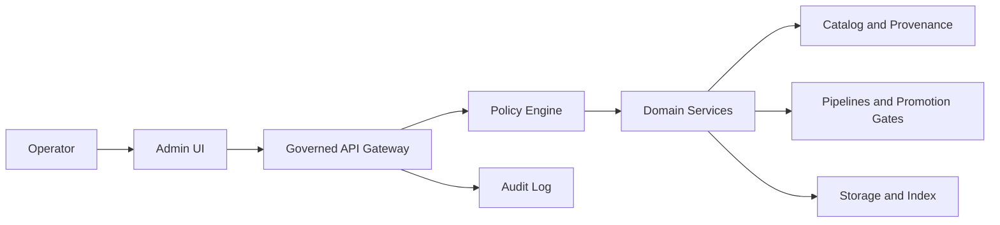

<!-- [KFM_META_BLOCK_V2]
doc_id: kfm://doc/4c6a6e3a-0a42-4b54-9f49-4f94e1b2a8b7
title: Admin App (apps/admin)
type: standard
version: v1
status: draft
owners: TBD
created: 2026-02-23
updated: 2026-02-23
policy_label: restricted
related:
  - TBD (root README / system architecture doc)
  - TBD (API contract for governed endpoints used by admin)
tags: [kfm, admin, ui]
notes:
  - Template README generated without repo introspection; replace TBDs with repo-confirmed values.
[/KFM_META_BLOCK_V2] -->

# KFM Admin App
Administrative UI for operating the KFM system **through governed APIs** (no direct data-store access).


> [!WARNING]
> This README is a **template** because the repository structure, scripts, and configuration for `apps/admin` were not provided in the available artifacts. Replace all `TBD` values with **repo-confirmed** details.

---

## Quick navigation
- [Purpose](#purpose)
- [Trust membrane rules](#trust-membrane-rules)
- [Architecture](#architecture)
- [Directory layout](#directory-layout)
- [Getting started](#getting-started)
- [Configuration](#configuration)
- [Runbooks](#runbooks)
- [Development standards](#development-standards)
- [Troubleshooting](#troubleshooting)
- [Contributing](#contributing)

---

## Purpose
`apps/admin` is the administrative application for the KFM system. Its job is to provide a controlled, auditable interface for operational actions such as:

- managing users/roles (RBAC) and policies,
- reviewing data promotion gates (Raw → Work/Quarantine → Processed → Published),
- triggering or observing pipelines,
- managing catalogs/provenance and publish workflows,
- operating Story/Map publishing and Focus Mode controls.

> [!NOTE]
> The exact feature set is deployment-specific. **Only document features that are actually implemented in this repo.**

[Back to top](#kfm-admin-app)

---

## Trust membrane rules
Non-negotiable invariants this app must follow:

1. **No direct database or storage access from the UI.**  
   All reads/writes go through **governed APIs** with policy enforcement.
2. **Every user-facing claim must be traceable** to evidence + policy decisions (via API responses, audit records, and provenance links).
3. **Fail closed** on permissions, missing policy, or ambiguous sensitivity.
4. **No secrets in the client bundle.**  
   Anything sensitive must remain server-side (or in the API boundary), never in browser code.

[Back to top](#kfm-admin-app)

---

## Architecture

### System context


### What this app is
- A **client** of governed APIs (and optionally an auth provider).
- A **policy-aware** interface that surfaces: policy decisions, provenance, and gate outcomes.
- A **controlled operations tool**: actions are explicit, logged, and reversible when feasible.

### What this app is not
- Not a backdoor for data access.
- Not a replacement for pipeline validation, QA checks, or governance review.
- Not an “admin SDK” that bypasses policy via privileged credentials embedded in the UI.

[Back to top](#kfm-admin-app)

---

## Directory layout
> [!TIP]
> Replace the tree below with the real output from `tree -L 3 apps/admin` once you have the repo locally.

```text
apps/admin/
├── README.md                 # You are here
├── package.json              # TBD: scripts, dependencies
├── src/                      # TBD: UI source
├── public/                   # TBD: static assets
├── tests/                    # TBD: unit/integration tests
├── e2e/                      # TBD: end-to-end tests (if any)
├── .env.example              # TBD: example env vars (if any)
└── Dockerfile                # TBD: container build (if any)
```

### Acceptable inputs
- UI components and pages for admin workflows
- API client adapters (typed clients, generated SDKs) that call governed endpoints
- Policy/role-driven route guards and permission checks (client-side UX + server-side enforcement via API)
- Observability hooks (client telemetry **without** sensitive payloads)

### Exclusions
- ❌ hardcoded credentials, API keys, or tokens
- ❌ direct DB connections, S3/GCS direct writes, or “temporary” bypass endpoints
- ❌ storing sensitive data in `localStorage`/`sessionStorage` unless explicitly approved and encrypted (prefer avoiding entirely)
- ❌ embedding protected datasets into static bundles

[Back to top](#kfm-admin-app)

---

## Getting started

### Prerequisites
- Node.js: **TBD** (confirm from `.nvmrc`, `package.json -> engines`, or repo toolchain)
- Package manager: **TBD** (`npm`, `pnpm`, or `yarn`)
- Access to the governed API in a dev/staging environment
- Auth access (OIDC/SAML/etc.): **TBD**

### Install
```sh
cd apps/admin

# Choose the repo’s package manager:
npm install
# or: pnpm install
# or: yarn install
```

### Run (development)
```sh
cd apps/admin

# Common patterns (verify in package.json scripts)
npm run dev
# or: pnpm dev
# or: yarn dev
```

### Build (production)
```sh
cd apps/admin

# Common patterns (verify in package.json scripts)
npm run build
npm run start
```

### Test
```sh
cd apps/admin

# Common patterns (verify in package.json scripts)
npm test
npm run lint
npm run typecheck
```

> [!NOTE]
> The canonical commands must match `apps/admin/package.json`. Update this README once confirmed.

[Back to top](#kfm-admin-app)

---

## Configuration
> [!WARNING]
> Do not guess env var names. Prefer documenting from `.env.example` (if present) and from the deployment manifests.

### Environment variables (template)
| Variable | Required | Purpose | Example |
|---|---:|---|---|
| `ADMIN_API_BASE_URL` | TBD | Base URL for governed API gateway | `https://api.dev.example.com` |
| `ADMIN_AUTH_ISSUER` | TBD | OIDC issuer / auth authority | `https://auth.dev.example.com` |
| `ADMIN_AUTH_CLIENT_ID` | TBD | Public client id (non-secret) | `admin-ui-dev` |
| `ADMIN_LOG_LEVEL` | No | Client logging verbosity | `info` |
| `ADMIN_TELEMETRY_ENABLED` | No | Enable anonymized telemetry | `false` |

### Secrets policy
- **Never** store secrets in the browser bundle.
- If the app has a server/runtime layer (SSR / server routes), secrets must be handled there and injected via runtime-only config.

[Back to top](#kfm-admin-app)

---

## Runbooks

### Common admin workflows (fill in with actual routes)
- **Policy review**: `TBD route`  
- **Promotion gate review**: `TBD route`  
- **Catalog/provenance inspection**: `TBD route`  
- **Publish Story/Map**: `TBD route`  
- **Audit lookup**: `TBD route`  

### Operational safety checklist
- [ ] Confirm you are in the correct environment (dev/stage/prod)
- [ ] Confirm the target dataset/pipeline id and classification label
- [ ] Confirm you have the correct role for the action
- [ ] Confirm the action produces/links an audit record
- [ ] Prefer reversible actions; if irreversible, require explicit confirmation UX

[Back to top](#kfm-admin-app)

---

## Development standards

### Governance & evidence discipline
- UI must display (or link to) provenance/audit evidence for:
  - promotions,
  - policy decisions,
  - publication events,
  - access denials (without leaking sensitive info).
- Avoid “magic” admin actions. Prefer explicit steps and explain consequences.

### Accessibility
- Target: WCAG 2.1 AA (TBD confirm project standard).
- Keyboard navigation, visible focus, accessible forms, readable contrasts.

### Logging & telemetry
- Do not log sensitive payloads.
- Add correlation IDs from API responses/headers where supported.

### Promotion gates for changes (recommended)
- [ ] Lint passes
- [ ] Typecheck passes
- [ ] Unit tests pass
- [ ] E2E smoke (critical admin flows)
- [ ] Security scan (dependencies)
- [ ] UI does not introduce policy bypass or direct-store access

[Back to top](#kfm-admin-app)

---

## Troubleshooting

### “I can’t log in”
- Confirm issuer/redirect URLs match environment (`ADMIN_AUTH_ISSUER`, redirect URI config)
- Confirm time sync (OIDC failures can be clock related)
- Confirm role mapping exists for your user

### “API calls fail”
- Confirm `ADMIN_API_BASE_URL`
- Confirm CORS policies (dev)
- Confirm your token audience/scopes match the API gateway expectations

### “UI shows data I shouldn’t see”
- Treat as a **security incident** until proven otherwise
- Capture:
  - timestamp,
  - user id/role,
  - request id/correlation id,
  - endpoint + parameters,
  - screenshot (if policy allows)
- Escalate to governance/security owner

[Back to top](#kfm-admin-app)

---

## Contributing
1. Keep changes small and reversible.
2. Add/adjust tests for any admin action or policy guard changes.
3. Update this README when:
   - new env vars are introduced,
   - new admin workflows/routes are added,
   - permission models change.

---

## Appendix: TODOs for maintainers
- [ ] Replace `owners: TBD` in the meta block
- [ ] Replace directory tree with actual `tree -L 3 apps/admin` output
- [ ] Replace “Getting started” commands with exact `package.json` scripts
- [ ] Replace env var table with repo-confirmed config
- [ ] Link to the governed API contract(s) used by this app
