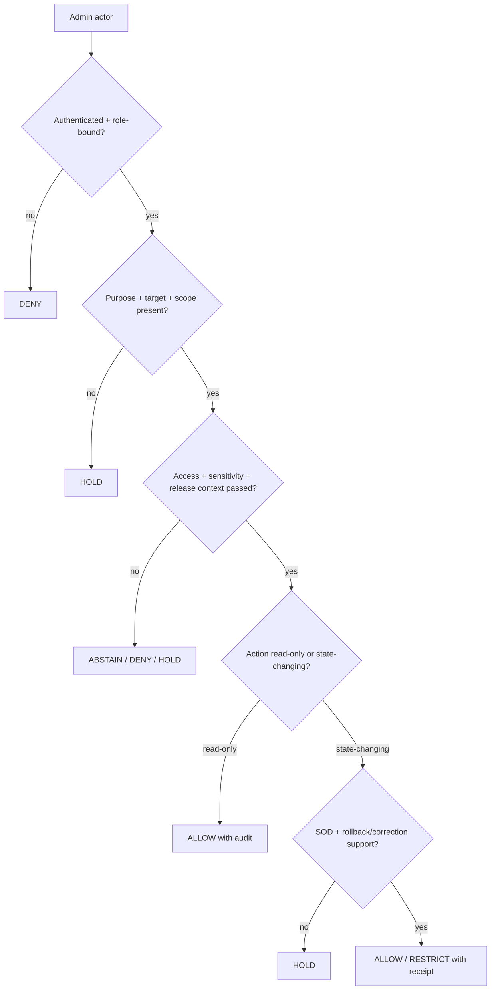

<!-- [KFM_META_BLOCK_V2]
doc_id: kfm://app/admin/readme
title: Admin App README
type: app-readme
version: v0.1
status: draft
owners: OWNER_TBD — Apps steward · Security steward · Access steward · Release steward · Audit steward · Docs steward
created: 2026-06-15
updated: 2026-06-15
policy_label: restricted
related:
  - ../README.md
  - ../governed-api/README.md
  - ../review-console/README.md
  - ../../docs/doctrine/directory-rules.md
  - ../../docs/doctrine/trust-membrane.md
  - ../../docs/security/AUDIT_INVARIANTS.md
  - ../../docs/security/THREAT_MODEL.md
  - ../../docs/security/INCIDENT_RESPONSE.md
  - ../../docs/security/SECRETS.md
  - ../../policy/access/README.md
  - ../../policy/decision/README.md
  - ../../policy/data/README.md
  - ../../release/README.md
  - ../../data/README.md
tags: [kfm, apps, admin, restricted, least-privilege, audit, break-glass, trust-membrane, deny-by-default]
notes:
  - "Replaces the short apps/admin stub with a governed app README."
  - "Admin is a restricted deployable surface and must not become the normal public path or a bypass around governed-api, release, data lifecycle, policy, evidence, or audit controls."
  - "Implementation files, routes, auth providers, deployment posture, tests, CI, audit sinks, and break-glass workflow remain NEEDS VERIFICATION."
[/KFM_META_BLOCK_V2] -->

<a id="top"></a>

<div align="center">

# Admin App

`apps/admin/`

**Restricted administrative surface for tightly scoped, audited, least-privilege KFM operations that must not become the normal public path.**


[Purpose](#1-purpose) · [Repo fit](#2-repo-fit) · [Boundary](#3-authority-boundary) · [Inputs](#5-inputs) · [Exclusions](#6-exclusions) · [Admin capabilities](#7-admin-capabilities) · [Definition of done](#14-definition-of-done)

</div>

---

> [!IMPORTANT]
> **Status:** draft / `NEEDS VERIFICATION`  
> **Owners:** `OWNER_TBD` — Apps steward · Security steward · Access steward · Release steward · Audit steward · Docs steward  
> **Path:** `apps/admin/README.md`  
> **Responsibility root:** `apps/` — deployable application surfaces  
> **Truth posture:** CONFIRMED file path / CONFIRMED restricted-admin role from `apps/README.md` / UNKNOWN implementation routes, auth, tests, and deployment state

> [!CAUTION]
> `apps/admin/` is not a public client, not the public trust membrane, and not a shortcut around `apps/governed-api/`, `policy/`, `release/`, `data/`, or EvidenceBundle closure. Admin actions must be justified, constrained, role-gated, logged, reviewable, and reversible where they affect trust-bearing state.

---

## Quick jump

- [1. Purpose](#1-purpose)
- [2. Repo fit](#2-repo-fit)
- [3. Authority boundary](#3-authority-boundary)
- [4. Default posture](#4-default-posture)
- [5. Inputs](#5-inputs)
- [6. Exclusions](#6-exclusions)
- [7. Admin capabilities](#7-admin-capabilities)
- [8. Diagram](#8-diagram)
- [9. Decision vocabulary](#9-decision-vocabulary)
- [10. Admin obligations](#10-admin-obligations)
- [11. Break-glass posture](#11-break-glass-posture)
- [12. Inspection path](#12-inspection-path)
- [13. Validation expectations](#13-validation-expectations)
- [14. Definition of done](#14-definition-of-done)
- [15. Open verification items](#15-open-verification-items)

---

## 1. Purpose

`apps/admin/` is the restricted administrative app lane for KFM.

It may eventually host a deployable admin surface for bounded operations such as operational health checks, configuration review, audit-log inspection, role-bound maintenance actions, incident-support workflows, release-support diagnostics, and carefully constrained emergency administration.

It must not become:

- the normal public path;
- the map/explorer UI;
- a direct lifecycle-data browser;
- a release approval shortcut;
- a policy bypass;
- a secret store;
- an evidence or source-authority substitute;
- an unreviewed manual mutation console.

[Back to top](#top)

---

## 2. Repo fit

| Concern | Owning root | Expected relationship |
|---|---|---|
| Admin deployable surface | `apps/admin/` | This README and future restricted admin app code, if accepted |
| App-root boundary | `apps/README.md` | Defines `apps/` as deployable surface and marks `admin/` restricted, not public |
| Public trust membrane | `apps/governed-api/` | Sole normal public trust path; admin must not replace it |
| Steward review surface | `apps/review-console/` | Normal role-gated review and promotion workspace |
| Access policy | `policy/access/` | Who may use bounded admin capabilities |
| Decision policy | `policy/decision/` | Finite outcomes and safe reason-code posture |
| Release authority | `release/` | Publication, correction, rollback control |
| Lifecycle artifacts | `data/` | Data, receipts, proofs, catalog, triplets, published artifacts |
| Security doctrine | `docs/security/` | Audit, threat model, incident response, secrets, exposure posture |

## 3. Authority boundary

The admin app may provide a restricted operational interface. It must not own the governance authorities it touches.

```text
apps/admin/        = restricted admin deployable surface
apps/governed-api/ = normal public trust membrane
apps/review-console/ = role-gated steward review surface
policy/access/     = access and capability decisions
policy/decision/   = finite outcome / reason-code posture
release/           = publication, correction, rollback authority
data/              = lifecycle artifacts, receipts, proofs, registries
infra/             = deployment, network, host, and deny-by-default exposure posture
configs/           = non-secret config templates only
```

## 4. Default posture

Admin access should fail closed.

An admin route, command, panel, or action should return `DENY`, `HOLD`, `ABSTAIN`, or `ERROR` when any of these are unresolved:

- authenticated subject;
- admin role or capability binding;
- purpose and ticket/reference;
- target object or service;
- environment and deployment scope;
- policy context;
- sensitivity and rights context where relevant;
- audit sink;
- rollback or correction target;
- separation-of-duties requirement;
- break-glass approval and expiry where applicable.

## 5. Inputs

| Input family | Examples | Required posture |
|---|---|---|
| Subject | user id, service id, role claim, steward assignment | Authenticated and authorized |
| Capability | view audit, inspect config, rotate operational state, trigger dry-run, lock release candidate | Explicit finite action |
| Purpose | incident id, review ticket, maintenance window, release-support task | Required for consequential action |
| Target | service, release candidate, receipt, policy bundle, config template, audit query | Governed object reference |
| Context | environment, tenant/project, sensitivity tier, release state, time window | Scoped and auditable |
| Policy state | access decision, sensitivity result, rights result, release/review state | Resolved before action |
| Audit metadata | request id, actor, outcome, reason code, before/after hash where safe | Required for consequential action |

## 6. Exclusions

| Does not belong here | Correct home |
|---|---|
| Public API routes | `apps/governed-api/` |
| Public/semi-public map UI | `apps/explorer-web/` |
| Steward review workflow UI | `apps/review-console/` |
| Shared reusable code | `packages/` |
| Policy bundles | `policy/` |
| Schemas and contracts | `schemas/contracts/v1/`, `contracts/` |
| Lifecycle artifacts, receipts, proofs, catalog, triplets | `data/` |
| Release manifests, rollback cards, correction notices | `release/` |
| Deployment/network/firewall posture | `infra/` |
| Secrets, tokens, credentials, private keys | Secret manager / environment-specific secure store |
| One-off maintenance scripts | `scripts/` until promoted with review |

## 7. Admin capabilities

Capability names below are proposed examples, not implementation proof.

| Capability | Purpose | Default posture |
|---|---|---|
| `view_health` | Inspect service health and dependency status | Read-only, audited |
| `view_audit` | Inspect audit events and receipt presence | Restricted, purpose-bound |
| `view_config` | Inspect non-secret active configuration and template diffs | Redact sensitive values |
| `run_dry_run` | Trigger validation or release dry-run without publishing | No side effects beyond receipt |
| `hold_candidate` | Apply or recommend hold on a candidate | Requires policy reason and audit record |
| `request_rollback` | Initiate rollback workflow request | Release authority still owns decision |
| `break_glass` | Emergency bounded maintenance action | Time-limited, dual-reviewed, fully audited |

## 8. Diagram


```mermaid
flowchart TD
    user["Admin actor"] --> auth{"Authenticated + role-bound?"}
    auth -->|no| deny["DENY"]
    auth -->|yes| purpose{"Purpose + target + scope present?"}
    purpose -->|no| hold["HOLD"]
    purpose -->|yes| policy{"Access + sensitivity + release context passed?"}
    policy -->|no| abstain["ABSTAIN / DENY / HOLD"]
    policy -->|yes| action{"Action read-only or state-changing?"}
    action -->|read-only| audit1["ALLOW with audit"]
    action -->|state-changing| review{"SOD + rollback/correction support?"}
    review -->|no| hold2["HOLD"]
    review -->|yes| audit2["ALLOW / RESTRICT with receipt"]
```

## 9. Decision vocabulary

| Decision | Meaning | Required behavior |
|---|---|---|
| `ALLOW` | Scoped admin action may proceed | Record actor, purpose, target, scope, time, and reason |
| `DENY` | Access or action is blocked | Return safe reason code; do not leak protected detail |
| `RESTRICT` | Action may proceed with reduced scope, read-only mode, redaction, or time limit | Preserve obligations |
| `HOLD` | Review, approval, rollback, audit sink, or context is missing | Do not perform consequential action |
| `ABSTAIN` | System cannot decide because support is unresolved | Preserve unresolved handles where safe |
| `ERROR` | Auth, policy, audit, dependency, or runtime machinery failed | Fail closed and record diagnostic safely |

## 10. Admin obligations

| Obligation | Example effect |
|---|---|
| `least_privilege_required` | Grant only the named capability for the named scope |
| `purpose_required` | Require ticket, incident, or maintenance-window reference |
| `audit_required` | Emit action record for every admin request |
| `redaction_required` | Hide secrets, protected source details, sensitive geometry, or private fields |
| `dual_review_required` | Require separation of duties for material state changes |
| `rollback_required` | Require rollback target before public-impacting or release-adjacent action |
| `time_limit_required` | Expire elevated access automatically |
| `no_public_path` | Admin must not serve as normal public or semi-public surface |

## 11. Break-glass posture

Break-glass is a constrained exception, not a normal operating path.

A break-glass action should require:

- incident or emergency reference;
- named actor and approver;
- explicit capability and time limit;
- narrow target scope;
- pre-action and post-action audit records;
- rollback or recovery target where applicable;
- follow-up review and correction notice when trust-bearing state changes.

## 12. Inspection path

Implementation files, routes, auth providers, audit sinks, tests, deployment posture, and CI remain `NEEDS VERIFICATION`.

```bash
find apps/admin -maxdepth 5 -type f | sort
find apps/governed-api apps/review-console policy/access docs/security infra configs tests -maxdepth 5 -type f 2>/dev/null | grep -Ei 'admin|access|audit|auth|role|incident|secret|break|rollback' | sort
find release data/receipts data/proofs -maxdepth 5 -type f 2>/dev/null | grep -Ei 'admin|audit|rollback|correction|release|receipt' | sort
```

## 13. Validation expectations

Useful validation for this app should cover:

- unauthenticated request returns `DENY`;
- missing capability binding returns `DENY`;
- missing purpose or target returns `HOLD`;
- missing audit sink returns `ERROR` or `HOLD`;
- state-changing action without rollback/correction support returns `HOLD`;
- sensitive fields and secrets are never rendered;
- admin cannot become the normal public path;
- admin cannot bypass `apps/governed-api/`, policy gates, release decisions, or lifecycle boundaries.

## 14. Definition of done

- [ ] Owners are confirmed and `OWNER_TBD` is replaced.
- [ ] Implementation files, routes, and deployment surface are inventoried.
- [ ] Authentication and authorization provider is documented.
- [ ] Admin capabilities are finite and policy-bound.
- [ ] Audit sink and receipt strategy are linked and tested.
- [ ] Break-glass workflow is documented, time-limited, and tested.
- [ ] State-changing actions require separation of duties and rollback/correction support.
- [ ] Secret redaction and sensitive-field redaction are tested.
- [ ] Public-path bypass checks are covered by tests or route inventory.

## 15. Open verification items

| Item | Why it matters |
|---|---|
| Confirm whether app implementation exists beyond README | Prevents overclaiming admin maturity |
| Confirm auth provider and role model | Required for least-privilege access |
| Confirm route inventory | Required to prove no public-path bypass |
| Confirm audit event schema and sink | Required for accountability |
| Confirm deployment exposure posture | Required for deny-by-default operations |
| Confirm break-glass process | Required before emergency admin claims |
| Confirm tests and fixtures | Required before enforcement claims |
| Confirm secrets scanning and redaction | Required before admin deployment |

<details>
<summary>Appendix A — no-loss preservation note</summary>

The previous README was a short stub: `Restricted admin surface. Not on the normal public path. Justified, constrained, audited.` This replacement preserves that intent while adding governance boundaries, access posture, audit expectations, capability constraints, break-glass discipline, and open verification items.

It does not claim that admin routes, auth, deployment, audit sinks, tests, CI, or break-glass workflow are implemented.

</details>

## Status summary

`apps/admin/` should remain a restricted, audited, least-privilege administrative surface.

It must not become the normal public path, release authority, lifecycle store, policy authority, secret store, or shortcut around governed APIs, EvidenceBundle closure, release controls, correction, rollback, or audit.

<p align="right"><a href="#top">Back to top</a></p>
