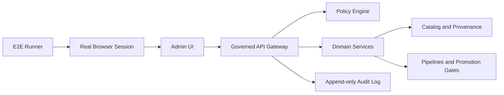

<a id="top"></a>

# `apps/admin/e2e/` — End-to-end tests for the KFM Admin UI
**Purpose:** Prove the Admin UI stays inside the **trust membrane** (governed APIs only), remains **policy-safe** (default-deny, fail-closed), and keeps **evidence-first** UX intact (Evidence Drawer + resolvable citations).


> [!WARNING]
> This README is **fail-closed** and intentionally avoids guessing repo-specific tooling.
> Replace all `TBD` with **repo-confirmed** details (scripts, runner, env vars, CI job names).
> If something is unclear, treat it as **UNKNOWN** and block merges until verified.

---

## Quick navigation
- [Truth status legend](#truth-status-legend)
- [Where this fits](#where-this-fits)
- [Directory contract](#directory-contract)
- [Architecture](#architecture)
- [Runner and tooling](#runner-and-tooling)
- [Running E2E locally](#running-e2e-locally)
- [Test data and accounts](#test-data-and-accounts)
- [Coverage matrix](#coverage-matrix)
- [Flake resistance rules](#flake-resistance-rules)
- [CI integration](#ci-integration)
- [Directory layout](#directory-layout)
- [Definition of Done](#definition-of-done)
- [Troubleshooting](#troubleshooting)
- [Appendix](#appendix)

---

## Truth status legend
This README uses explicit claim labels so we don’t “ship fantasy”:

- **CONFIRMED (KFM posture)**: governance invariants that must hold system-wide.
- **UNKNOWN (repo)**: not verified in this repo/branch yet; treat as TODO / merge-blocking for gating.
- **PROPOSED**: a recommended default pattern you can adopt after verification.

[Back to top](#top)

---

## Where this fits
- This directory is the **Admin app’s E2E suite** (browser-driven flows), scoped to `apps/admin`.  
- It should align with the repo-wide testing strategy under `tests/` and CI gates under `.github/`.  
  - See: `../README.md` (Admin app purpose + invariants)  
  - See: `../../../tests/README.md` (test strategy + governance mapping)  
  - See: `../../../.github/README.md` (CI gates + fail-closed posture)

[Back to top](#top)

---

## Directory contract

### ✅ Acceptable inputs
- E2E specs (critical admin workflows), organized by feature area.
- Test helpers (auth, navigation, stable selectors, API stubs/mocks if used).
- Runner configuration (Playwright/Cypress/etc.) and CI scripts to run E2E deterministically.
- **Sanitized** fixtures (small, licensed, synthetic or explicitly de-identified).

### ❌ Exclusions
- Secrets, tokens, private keys, or “shared admin credentials”.
- Real restricted/sensitive-location geometries or any fixture that re-enables targeting.
- Direct DB/object-store/index access from tests that bypasses the governed API boundary.
- Non-deterministic tests dependent on internet services or unstable upstream data.

> [!IMPORTANT]
> E2E tests are part of the **trust membrane**: if they are flaky or bypassable, they create a governance risk.

[Back to top](#top)

---

## Architecture

### System under test (SUT)
E2E tests validate the end-user/admin experience *and* the governance invariants that must remain true.



### What E2E must prove (CONFIRMED posture)
- **Trust membrane:** the browser talks only to the governed API (no direct datastore access).
- **Policy-safe behaviors:** unauthorized users are denied **without leaking** restricted existence.
- **Evidence-first UX:** governance surfaces are visible (policy labels, evidence drawer, receipts/audit refs).

[Back to top](#top)

---

## Runner and tooling

### Current status
- **UNKNOWN (repo):** which E2E runner is used (Playwright vs Cypress vs other).
- **UNKNOWN (repo):** where scripts live (repo root vs `apps/admin/package.json`).
- **UNKNOWN (repo):** how environments are provisioned (local docker, dev cluster, mock server).

### Minimum verification steps (convert UNKNOWN → CONFIRMED)
Run these once, then update this README with concrete paths and commands:

```bash
# From repo root
# 1) Identify the runner
rg -n "playwright|@playwright|cypress|webdriverio|selenium" -S . || true

# 2) Identify how E2E is invoked
rg -n "e2e|test:e2e|playwright test|cypress run" -S package.json apps packages .github || true

# 3) Inventory existing admin test scaffolding (if any)
find apps/admin -maxdepth 3 -type f | sort
```

### Recommended default (PROPOSED)
If you have no runner yet, default to **Playwright** for:
- multi-browser coverage,
- trace artifacts for debugging,
- strong CI ergonomics.

**Assumptions:** you can run headless browsers in CI; your UI has stable selectors.  
**Tradeoffs:** slightly more setup vs Cypress; you’ll need conventions for fixtures/auth.  
**Risks:** flakiness if test data/env aren’t deterministic.  
**Minimum verification:** confirm runner choice in `package.json` deps + add a first smoke spec.

[Back to top](#top)

---

## Running E2E locally

> [!WARNING]
> Do **not** run Admin E2E against production. Use local/dev/staging only.

### Prerequisites (UNKNOWN until verified)
- Node + package manager used by this repo: **TBD**
- Admin UI dev server command: **TBD**
- Governed API endpoint (local or dev env): **TBD**
- Test users/roles provisioned: **TBD** (operator/steward roles)

### Suggested workflow (PROPOSED template)
```bash
# 1) Start backend dependencies (API gateway + policy + services)
#   - See docs/runbooks or infra tooling (TBD)

# 2) Start Admin UI
#   - cd apps/admin
#   - <run-dev-command>   # TBD: replace with repo-confirmed command

# 3) Run E2E
#   - <run-e2e-command>   # TBD: replace with repo-confirmed command
```

### Environment variables (template — DO NOT GUESS NAMES)
Document the *actual* variables from `.env.example`, runner config, or deployment manifests.

| Variable | Required | Purpose | Example |
|---|---:|---|---|
| `TBD_ADMIN_BASE_URL` | TBD | Admin UI base URL under test | `http://localhost:3000` |
| `TBD_API_BASE_URL` | TBD | Governed API base URL | `http://localhost:8080` |
| `TBD_E2E_USER` | TBD | Test user identifier | `e2e-operator@example.test` |
| `TBD_E2E_ROLE` | TBD | Role to exercise | `operator` |
| `TBD_TRACE_DIR` | No | Where to write traces/videos | `./artifacts` |

[Back to top](#top)

---

## Test data and accounts

### Principles (CONFIRMED posture)
- Use **least privilege** test accounts.
- Prefer **seeded, deterministic** datasets and stable IDs (pin dataset versions).
- All fixtures must be policy-safe and clearly attributable.

### Provisioning options (PROPOSED)
Pick one and document it:

1) **Seeded dev environment** (recommended)  
   - E2E runs against a dev stack with known seed data.
2) **Ephemeral environment per PR** (best, more work)  
   - Spin up API + Admin UI + seed data; tear down after.
3) **Mock server** (fast, limited)  
   - Validates UI behavior but can miss real policy/evidence integration.

[Back to top](#top)

---

## Coverage matrix

> [!NOTE]
> This is a **PROPOSED** starting matrix. Replace/trim to match implemented features.

| Area | Scenario | Priority | What it proves |
|---|---|---:|---|
| Auth | Login succeeds for authorized user | P0 | Admin UI usable; session established |
| Auth | Unauthorized user denied | P0 | **Fail-closed** access control |
| Policy | Restricted route returns policy-safe deny UX | P0 | No metadata leakage |
| Evidence UX | Open Evidence Drawer from an admin-visible record | P0 | Evidence-first UI is present |
| Evidence UX | Evidence Drawer shows dataset version + license + policy label | P0 | Trust surface minimum fields |
| Audit | Any privileged action yields an audit reference | P0 | Operations are reviewable |
| Promotion | Review a promotion gate result (read-only) | P1 | Gate visibility + provenance |
| Safety | “Missing evidence” causes degrade/deny, not render | P1 | No unverified claims |
| Regression | Snapshot or visual smoke for key screens | P2 | UI drift detection |

[Back to top](#top)

---

## Flake resistance rules
E2E flakiness is a governance risk. Enforce these rules:

- Prefer **stable selectors** (`data-testid`) over CSS text selectors.
- Never rely on wall-clock time; freeze time or use deterministic windows.
- Avoid `sleep`; wait for specific conditions (UI state, network idle, expected response).
- Keep test steps reversible; avoid destructive operations unless a sandbox env exists.
- Capture artifacts on failure (screenshots, traces, HAR, console logs) and upload in CI.

[Back to top](#top)

---

## CI integration

### Goals (CONFIRMED posture)
- E2E tests must be runnable in CI and act as a **merge gate** for governance-critical changes.

### When to run (PROPOSED)
Run Admin E2E on PRs that touch:
- `apps/admin/**`
- shared UI components used by admin
- API contracts that admin depends on (OpenAPI/SDK)
- policy/authorization surfaces affecting admin behavior

### Artifacts (PROPOSED)
Store as CI artifacts:
- screenshots on failure
- trace/video (runner dependent)
- a minimal run receipt/log excerpt if your harness emits one

> [!IMPORTANT]
> Don’t “green the build” by disabling E2E gates.
> Fix the determinism, selectors, seed data, or environment wiring.

[Back to top](#top)

---

## Directory layout

> [!TIP]
> Replace this tree with real `tree -L 3 apps/admin/e2e` output once files exist.

```text
apps/admin/e2e/
├── README.md                 # You are here
├── runner/                   # TBD (e.g., playwright/ or cypress/)
│   ├── config.*              # runner config
│   └── global-setup.*        # auth/session bootstrap (if used)
├── specs/                    # E2E specs grouped by feature area
│   ├── auth.*                # login/deny flows
│   ├── policy.*              # deny UX and leakage tests
│   ├── evidence_drawer.*     # evidence-first UX
│   └── audit.*               # audit ref existence checks
├── fixtures/                 # sanitized fixtures only
│   └── FIXTURE_NOTES.md      # required provenance + safety notes
└── utils/                    # selectors, helpers, stable navigation utilities
```

[Back to top](#top)

---

## Definition of Done
Use this checklist for “E2E is real” (not just a folder):

- [ ] Runner/tooling is **CONFIRMED** and documented (not `TBD`)
- [ ] `P0` scenarios exist and pass locally and in CI
- [ ] E2E is a merge-blocking CI check for Admin-related changes
- [ ] Test data is deterministic and documented (seed strategy)
- [ ] No secrets in config; no privileged bypass tokens in the browser
- [ ] Failure artifacts are captured and uploaded in CI
- [ ] Flake rate is measured and actively reduced (no chronic re-runs)

[Back to top](#top)

---

## Troubleshooting

### “E2E can’t log in”
- Confirm test account exists and has correct role mapping in the target environment.
- Confirm redirect URLs and origin match the environment’s auth config.
- Confirm clock drift (OIDC can fail on skew).

### “API calls fail / CORS issues”
- Confirm Admin UI points at the correct API base URL.
- Confirm your dev stack allows the browser origin in CORS.
- Confirm you are not accidentally hitting prod.

### “Tests are flaky”
- Replace timing sleeps with explicit waits.
- Use deterministic seeds and pin dataset versions.
- Stabilize selectors (`data-testid`) and avoid brittle text matching.

[Back to top](#top)

---

## Appendix

<details>
<summary>Fixture governance template (copy/paste)</summary>

Create `apps/admin/e2e/fixtures/FIXTURE_NOTES.md` with:

- **Source:** (synthetic / generated / derived)
- **License:** (or “synthetic; no upstream license required”)
- **Sensitivity classification:** (public / sanitized / restricted — avoid restricted here)
- **Redaction/generalization applied:** (what, why)
- **Intended tests:** (which specs use it)
- **Why it is safe:** (no PII, no sensitive locations, no secrets)

</details>

<details>
<summary>P0 smoke spec idea list (PROPOSED)</summary>

- Auth: login → land on dashboard
- Auth: unauthorized user → denied route → policy-safe message
- Evidence: open Evidence Drawer → shows dataset version + license + policy label
- Audit: trigger a safe read-only admin action → verify audit ref is present in UI or response metadata

</details>

---

**Back to top:** [↑](#top)
