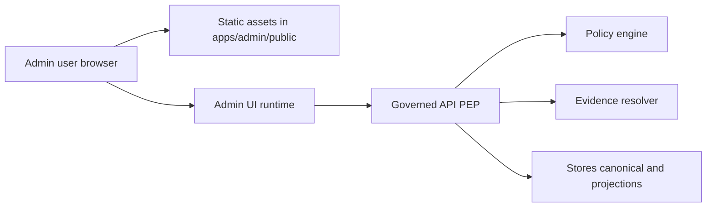

<!-- [KFM_META_BLOCK_V2]
doc_id: kfm://doc/7c0b1a0d-1fd1-45c9-a33a-8f64db75e8bb
title: apps/admin/public — Static public assets for KFM Admin UI
type: standard
version: v1
status: draft
owners: TODO: set via CODEOWNERS (apps/admin)
created: 2026-02-28
updated: 2026-02-28
policy_label: restricted
related:
  - ../../../README.md
  - ../README.md
  - ../../../docs/
tags: [kfm, ui, admin, public-assets]
notes:
  - Treat everything in this folder as internet-public even if the Admin UI is behind auth.
  - Never store secrets, credentials, dataset artifacts, or governed content here.
[/KFM_META_BLOCK_V2] -->

# KFM Admin UI — `public/` assets

Static, cacheable files served by the **Admin/Steward** web app (icons, HTML shell, and other *non-secret* assets).

   

---

## Quick navigation

- [What this directory is](#what-this-directory-is)
- [How it fits into KFM](#how-it-fits-into-kfm)
- [Directory standard](#directory-standard)
  - [Acceptable inputs](#acceptable-inputs)
  - [Hard exclusions](#hard-exclusions)
- [Add or change an asset](#add-or-change-an-asset)
- [Security and governance rules](#security-and-governance-rules)
- [Review checklist](#review-checklist)

---

## What this directory is

This folder holds **static assets** that the Admin UI can serve directly (typically at `/` or a similar web root), without calling the backend.

✅ Good examples:
- UI icons/logos
- Static HTML shell and metadata files used by the bundler/framework
- Web manifests, robots rules, etc. (if your app needs them)
- Non-sensitive configuration stubs (ONLY if they do not contain secrets)

> **WARNING**
> Static assets can be cached, mirrored, and scraped.
> Assume **anything in `public/` is public** — even if your Admin UI requires login.

---

## How it fits into KFM

The Admin UI is a **governed client**. It must not bypass the KFM trust membrane.

- Static assets load in the browser.
- The Admin UI runtime calls the **Governed API (PEP)**.
- Policy decisions, evidence resolution, and logging happen server-side.

**Implication for this folder:** do not embed privileged credentials, API keys, dataset extracts, or anything that would let a browser skip policy checks.

---

## Directory standard

### Acceptable inputs

Only add files that are all of the following:

1. **Static**
   - Served as-is (no runtime secret injection required).
2. **Non-sensitive**
   - No secrets, no personal data, no restricted location details.
3. **License-clean**
   - Third-party assets must have clear rights to redistribute.
4. **Small and cache-friendly**
   - Prefer compressed formats; avoid huge binaries.

| Asset type | Allowed? | Notes |
|---|---:|---|
| SVG/PNG/JPG icons | ✅ | Prefer vector for UI icons where possible |
| Fonts | ⚠️ | Only if license permits redistribution; prefer system fonts |
| JSON config | ⚠️ | Must be non-secret; treat as public |
| Raw datasets / samples | ❌ | Belongs in governed data zones, not web assets |
| API keys / tokens | ❌ | Never in repo, never in `public/` |
| “Hidden” admin endpoints list | ❌ | Security through obscurity is not allowed |

### Hard exclusions

Do **not** put these in `apps/admin/public/`:

- Secrets (tokens, passwords, private keys, client secrets)
- Any dataset artifacts or evidence bundles (even “just a sample”)
- Anything that requires policy enforcement to view
- Large binaries that bloat deploys (videos, huge rasters, etc.)
- Files that contain sensitive coordinates or vulnerable-site locations

---

## Add or change an asset

1. **Add the file** to `apps/admin/public/…`
2. **Reference it** from the Admin UI using your framework’s standard “public asset” mechanism
3. **Validate**
   - No secrets
   - License/attribution is satisfied
   - Reasonable file size
4. **Document**
   - If the asset is third-party, record the license/attribution in the repo’s standard notices location  
     (TODO: link to the canonical place once confirmed in-repo)

---

## Security and governance rules

### 1) Trust membrane stays intact

- The browser must never receive credentials that would allow it to read from storage directly.
- All privileged actions must go through governed APIs with policy checks.

### 2) Treat all content as public

Even “restricted UI” deployments can leak static assets through caching/CDNs, misconfigurations, or shared URLs.

### 3) License and attribution are not optional

If you add images/icons/fonts from third parties, you must ensure redistribution rights and attribution requirements are met.

---

## Review checklist

Use this checklist when a PR touches `apps/admin/public/`.

- [ ] No secrets (tokens, keys, passwords) added
- [ ] No governed data artifacts or “example datasets” added
- [ ] Third-party assets have clear license/attribution
- [ ] Files are reasonably sized and compressible
- [ ] Asset names are stable and do not imply hidden security boundaries
- [ ] Any new asset usage is accessible (alt text, ARIA labels as needed)

Optional: suggested CI gates for this folder (PROPOSED)

- Secret scanning (block merges on credential patterns)
- License scanning for third-party media
- Max file size lint (e.g., fail if any new asset > N MB)
- Link checker for manifest/icon references

---

**Back to top:** [Quick navigation](#quick-navigation)
