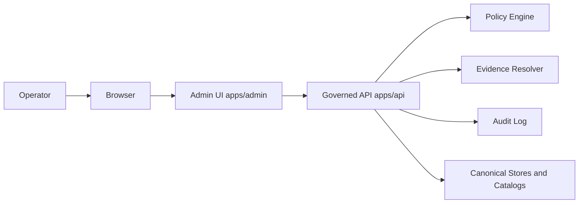
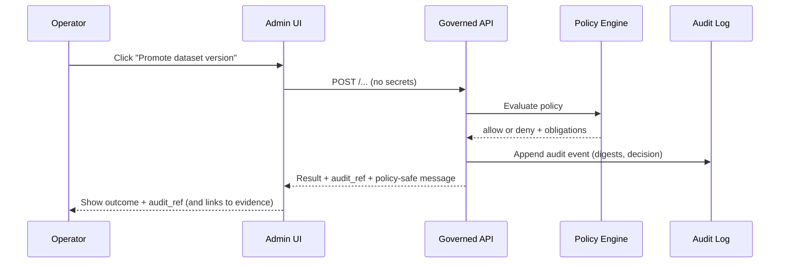

<!-- [KFM_META_BLOCK_V2]
doc_id: kfm://doc/5b44a0a6-4d72-4e2a-a8f6-9eb4c3b5632b
title: KFM Admin UI Source — apps/admin/src
type: standard
version: v1
status: draft
owners: TBD
created: 2026-02-28
updated: 2026-02-28
policy_label: public
related:
  - ../../../README.md
  - ../../../.github/README.md
  - ../README.md
  - ../../api/src/api/README.md
tags: [kfm, admin, ui, src]
notes:
  - Directory contract for Admin UI source tree. Default-deny; evidence-first; cite-or-abstain.
[/KFM_META_BLOCK_V2] -->

# KFM Admin UI Source (`apps/admin/src`)
> **One-line purpose:** Source code for the KFM Admin App — operator workflows delivered **only through governed APIs** (no direct data-store access).


> [!WARNING]
> This is a **directory contract** for `apps/admin/src`. If the actual codebase differs, **update this README to match reality**.
> Do not “paper over” missing pieces with assumptions—KFM is **fail-closed** by design.

---

## Quick navigation
- [Purpose](#purpose)
- [Where it fits](#where-it-fits)
- [Directory contract](#directory-contract)
- [Trust membrane rules](#trust-membrane-rules)
- [Architecture](#architecture)
- [Recommended `src/` layout](#recommended-src-layout)
- [Implementation patterns](#implementation-patterns)
- [Definition of Done](#definition-of-done)
- [Security and sensitivity](#security-and-sensitivity)
- [References](#references)

---

## Purpose
`apps/admin/src` contains the **Admin UI implementation** (pages/routes, components, state, auth glue, API client adapters) for operating KFM safely.

The Admin UI exists to:
- expose operational capabilities (promotion review, policy review, story publishing, audits) **without bypassing policy**
- make **evidence and provenance visible** for every action and claim
- ensure every admin action is **auditable**, minimally-privileged, and reversible when feasible

> [!NOTE]
> High-level product intent and operator workflows belong in `apps/admin/README.md`.
> This file is specifically: **what belongs in `src/` and what must never be put here**.

[↑ Back to top](#kfm-admin-ui-source-appsadminsrc)

---

## Where it fits
`apps/admin/src` is a **client-side codebase** (and optionally SSR/server-routes, depending on framework) that must sit behind the KFM “trust membrane”:

- **UI code** calls the **Governed API** (`apps/api`) for reads/writes.
- Policy is enforced at the API boundary; the UI must behave as if **everything is denied by default** unless explicitly allowed.

Suggested related entrypoints:
- Repo operating model: `../../../README.md`
- Admin app overview: `../README.md`
- Governed API boundary contract: `../../api/src/api/README.md`
- CI/policy gates: `../../../.github/README.md`

[↑ Back to top](#kfm-admin-ui-source-appsadminsrc)

---

## Directory contract

### Acceptable inputs
✅ Things that **belong** in `apps/admin/src/`:

- **Routes/pages** implementing admin workflows (promotion review, policy review, catalog inspection, audit lookup, story publish)
- **UI components** (tables, forms, evidence drawers, diff viewers, policy decision cards)
- **Feature modules** grouping routes + components + hooks for one workflow
- **API client adapters** that call *governed* endpoints (typed clients, generated SDKs, fetch wrappers)
- **Auth integration glue** (OIDC client, session handling, route guards) **without embedding secrets**
- **State management** (client cache, view state, workflow state) for admin operations
- **Telemetry hooks** *only if* they are policy-safe (no sensitive payloads, no restricted coordinates)

### Exclusions
❌ Things that must **never** be in `apps/admin/src/`:

- **Secrets** (API keys, private tokens, client secrets, service creds)
- Direct database/storage connections or direct access to object storage buckets (no “temporary bypass”)
- Embedded protected datasets, restricted coordinates, or raw artifacts in the client bundle
- “Admin backdoors” (hardcoded elevated roles, magic headers, hidden endpoints)
- Policy logic duplication that can diverge from the runtime policy engine (UI may *display* policy decisions; it should not *be* the policy engine)

> [!IMPORTANT]
> If you need privileged operations, they must happen in the **API boundary** (or other server-side PEP) with:
> - policy checks
> - audit logs
> - obligations (redaction/generalization)
> - contract-stable responses

[↑ Back to top](#kfm-admin-ui-source-appsadminsrc)

---

## Trust membrane rules
Non-negotiable invariants for this directory:

1. **No direct data-store access.** All reads/writes go through governed APIs.
2. **Default-deny UX.** If permission, classification, or policy result is unknown → behave as denied.
3. **Evidence-first UX.** Every claim/action should surface:
   - `dataset_version_id` (when relevant)
   - license/rights and policy label (public-safe)
   - resolvable EvidenceRefs / EvidenceBundles (when claims are shown)
   - `audit_ref` for governed operations
4. **Fail-closed errors.** Do not “helpfully” reveal restricted existence (avoid over-specific error messages).
5. **No secrets in bundles.** Nothing in `src/` should require secret material at build-time.

[↑ Back to top](#kfm-admin-ui-source-appsadminsrc)

---

## Architecture

### System context


### A “governed admin action” must look like this


[↑ Back to top](#kfm-admin-ui-source-appsadminsrc)

---

## Recommended `src/` layout
> [!TIP]
> **PROPOSED** layout below. Replace with actual `tree -L 4 apps/admin/src` output once the code is present.

```text
apps/admin/src/
├── README.md                # you are here (directory contract)
├── app/                     # app composition: router + providers + layout shell
├── routes/                  # route/page modules (if your framework uses them)
├── features/                # workflow modules (promotion, policy, audit, story publish)
│   ├── promotion/
│   ├── policy/
│   ├── audit/
│   └── story/
├── components/              # shared UI components (tables, forms, modals)
├── lib/                     # pure helpers (date, formatting, parsing, safe logging)
├── api/                     # HTTP client wrappers + typed DTO mapping (NO secrets)
├── auth/                    # auth/session glue + route guards (NO client secrets)
├── state/                   # state mgmt (query cache, stores)
├── styles/                  # styling system
├── assets/                  # icons/images (public-safe only)
└── test/                    # test helpers (mocks, fixtures, MSW handlers)
```

**Import hygiene (recommended):**
- `features/*` may import `components/*`, `api/*`, `auth/*`, `lib/*`
- `components/*` should not import feature-specific modules
- `api/*` must be framework-agnostic and policy-safe (no UI concerns)

[↑ Back to top](#kfm-admin-ui-source-appsadminsrc)

---

## Implementation patterns

### Pattern: policy-safe API client wrapper
**PROPOSED**: a single place that:
- attaches auth context (cookie or access token)
- captures correlation IDs and returns `audit_ref`
- maps failures into **policy-safe** UI errors

```ts
// src/api/kfmClient.ts
// NOTE: This is intentionally framework-agnostic pseudocode.
// Adapt how runtime config is loaded (process.env, import.meta.env, server-injected config, etc.)

type KfmError = {
  error_code: string;
  message: string;        // must be policy-safe
  audit_ref?: string;     // important for operators
};

function getRuntimeConfig() {
  return {
    apiBaseUrl: "TBD", // non-secret runtime config
  };
}

export async function kfmFetch<T>(path: string, init: RequestInit = {}): Promise<T> {
  const { apiBaseUrl } = getRuntimeConfig();

  const res = await fetch(`${apiBaseUrl}${path}`, {
    ...init,
    headers: {
      "content-type": "application/json",
      ...(init.headers ?? {}),
    },
    credentials: "include", // if using cookie-based sessions
  });

  // Fail closed: never attempt to infer restricted existence.
  if (!res.ok) {
    let err: KfmError = { error_code: "UNKNOWN", message: "Request failed." };
    try {
      err = (await res.json()) as KfmError;
    } catch {
      // keep the generic policy-safe fallback
    }
    throw err;
  }

  return (await res.json()) as T;
}
```

### Pattern: evidence-first UI surfaces
When showing a “fact” or “result”, prefer to show the **EvidenceRef/EvidenceBundle link**, not just text.

**PROPOSED UI rule-of-thumb:**
- If a field is user-visible and could influence a decision, it should be backed by a resolvable evidence link or a dataset version reference.

```ts
// src/features/audit/openEvidence.ts
export function openEvidenceDrawer(evidenceRef: string) {
  // UI opens an evidence drawer that calls the evidence resolver endpoint,
  // then displays license, policy label, provenance links, and digests.
}
```

### Pattern: route guards that default-deny
```ts
// src/auth/requireRole.ts
export function canAccess(required: string[], userRoles: string[] | undefined): boolean {
  if (!userRoles) return false; // default deny
  return required.some((r) => userRoles.includes(r));
}
```

> [!IMPORTANT]
> Client-side guards are UX only. The API must enforce authorization and policy.

[↑ Back to top](#kfm-admin-ui-source-appsadminsrc)

---

## Definition of Done
Use this checklist for new admin workflows added under `src/features/*`.

### DoD: new admin workflow
- [ ] Route/page exists and is discoverable in navigation
- [ ] API calls go through the governed API client (no direct store access)
- [ ] Permissions are enforced server-side; UI defaults to deny when unknown
- [ ] UI displays `audit_ref` for governed operations (or links to audit lookup)
- [ ] UI links to EvidenceBundles / DatasetVersions where claims are shown
- [ ] Error messages are policy-safe (no restricted existence leaks)
- [ ] Tests exist:
  - [ ] unit tests for parsing/formatting and guard logic
  - [ ] interaction tests for critical flows (happy + deny)
  - [ ] e2e smoke for the workflow (if e2e harness exists)
- [ ] Documentation updated:
  - [ ] `apps/admin/README.md` for workflow/runbook updates
  - [ ] this `src/README.md` if new subdirectories or conventions were added

[↑ Back to top](#kfm-admin-ui-source-appsadminsrc)

---

## Security and sensitivity
### Data and location handling
- Do not display exact coordinates for vulnerable/private/culturally restricted sites unless policy explicitly allows it.
- Prefer coarse geography and policy-safe generalization when sensitivity is unclear.

### Browser storage rules
- Avoid storing sensitive content in `localStorage` or `sessionStorage`.
- Prefer ephemeral in-memory state for sensitive workflows.

### Logging and telemetry
- Never log raw payloads that may include sensitive data.
- Prefer logging only:
  - `audit_ref`
  - request/correlation IDs
  - policy-safe error codes

> [!WARNING]
> If the UI ever shows data a user should not see, treat it as a security incident until proven otherwise.
> Capture `audit_ref` + timestamp + role + endpoint and escalate to the owners.

[↑ Back to top](#kfm-admin-ui-source-appsadminsrc)

---

## References
- Admin app overview and ops posture: [`../README.md`](../README.md)
- Repo operating model (trust primitives, promotion contract): [`../../../README.md`](../../../README.md)
- Governed API enforcement boundary: [`../../api/src/api/README.md`](../../api/src/api/README.md)
- GitHub trust membrane and CI gates (if present): [`../../../.github/README.md`](../../../.github/README.md)

---
**Back to top:** [Quick navigation](#quick-navigation)
