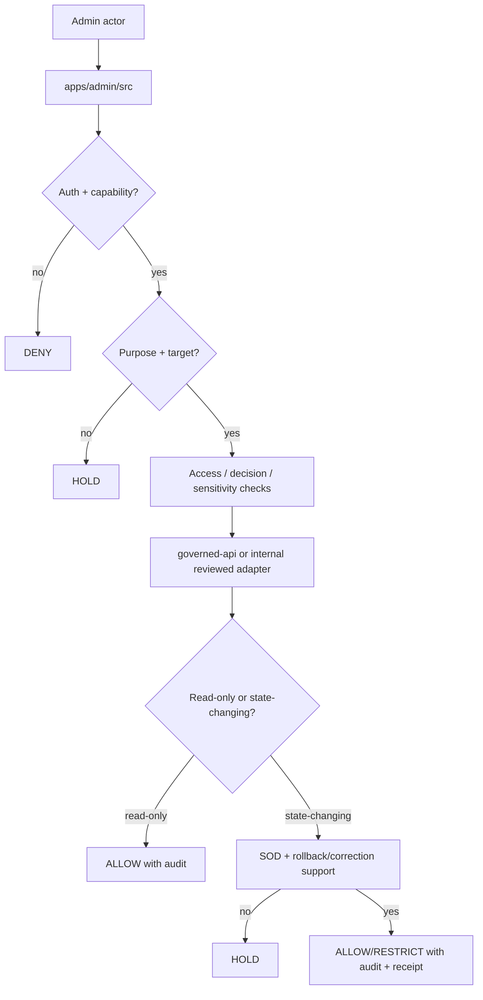

<!-- [KFM_META_BLOCK_V2]
doc_id: kfm://app/admin/src/readme
title: Admin App Source Tree README
type: app-readme
version: v0.2
status: draft
owners: OWNER_TBD — Apps steward · Security steward · Access steward · Audit steward · Docs steward
created: 2026-06-15
updated: 2026-07-09
policy_label: restricted
related:
  - ../README.md
  - ../../README.md
  - ../../governed-api/README.md
  - ../../review-console/README.md
  - ../../../README.md
  - ../../../SECURITY.md
  - ../../../policy/access/README.md
  - ../../../policy/decision/README.md
  - ../../../docs/security/AUDIT_INVARIANTS.md
  - ../../../docs/security/THREAT_MODEL.md
  - ../../../docs/security/INCIDENT_RESPONSE.md
  - ../../../packages/README.md
  - ../../../release/README.md
  - ../../../data/README.md
  - ../../../tools/validators/README.md
  - ../../../tools/watchers/README.md
tags: [kfm, apps, admin, src, restricted, least-privilege, audit, deployable-source, trust-membrane, fail-closed, no-public-path]
notes:
  - "v0.2 updates the uploaded admin/src README into a current repo-aware source-tree contract."
  - "apps/admin/src/README.md, apps/admin/README.md, and apps/README.md were verified through the GitHub app in this update. Implementation files, route inventory, auth wiring, audit sinks, tests, CI, and deployment posture remain NEEDS VERIFICATION."
  - "This source tree is for admin app implementation only; it must not become the normal public path, release authority, lifecycle store, policy root, shared package root, security doctrine home, evidence authority, or break-glass bypass."
  - "Admin actions must be least-privilege, purpose-bound, policy-bound, audited, reviewable, reversible where consequential, and unable to bypass governed-api, release, lifecycle, policy, or EvidenceBundle closure."
[/KFM_META_BLOCK_V2] -->

<a id="top"></a>

<div align="center">

# Admin App Source Tree

`apps/admin/src/`

**Source-tree boundary for the restricted Admin app: implementation code may live here, but admin behavior must stay least-privilege, audited, policy-bound, fail-closed, and outside the normal public path.**


[Purpose](#1-purpose) · [Current evidence](#2-current-repo-evidence) · [Repo fit](#3-repo-fit) · [Boundary](#4-authority-boundary) · [Inputs](#6-inputs) · [Exclusions](#7-exclusions) · [Candidate modules](#8-candidate-source-map) · [Definition of done](#15-definition-of-done)

</div>

---

> [!IMPORTANT]
> **Status:** draft / current README surface confirmed / implementation behavior `NEEDS VERIFICATION`  
> **Owners:** `OWNER_TBD` — Apps steward · Security steward · Access steward · Audit steward · Docs steward  
> **Path:** `apps/admin/src/README.md`  
> **Responsibility root:** `apps/` — deployable application surfaces  
> **Truth posture:** CONFIRMED README path and parent app docs / PROPOSED source-tree contract / UNKNOWN implementation files, route inventory, auth, tests, audit sinks, CI, and deployment state

> [!CAUTION]
> Code under `apps/admin/src/` must not normalize admin shortcuts. Any route, command, panel, handler, or workflow here should be role-gated, purpose-bound, policy-checked, audited, safe-by-default, and unable to bypass `apps/governed-api/`, access policy, release authority, lifecycle boundaries, or EvidenceBundle closure.

---

## Quick jump

- [1. Purpose](#1-purpose)
- [2. Current repo evidence](#2-current-repo-evidence)
- [3. Repo fit](#3-repo-fit)
- [4. Authority boundary](#4-authority-boundary)
- [5. Default posture](#5-default-posture)
- [6. Inputs](#6-inputs)
- [7. Exclusions](#7-exclusions)
- [8. Candidate source map](#8-candidate-source-map)
- [9. Diagram](#9-diagram)
- [10. Source-tree obligations](#10-source-tree-obligations)
- [11. Handler expectations](#11-handler-expectations)
- [12. Inspection path](#12-inspection-path)
- [13. Validation expectations](#13-validation-expectations)
- [14. Safe change pattern](#14-safe-change-pattern)
- [15. Definition of done](#15-definition-of-done)
- [16. Open verification items](#16-open-verification-items)

---

## 1. Purpose

`apps/admin/src/` is the proposed implementation source tree for the restricted Admin app.

It may eventually hold route handlers, UI components, service adapters, policy-client calls, audit emitters, and bounded operational workflows for admin-only use. This README does not prove those files exist; it defines the source-tree boundary they must follow if implemented.

This tree should support only bounded, reviewable, audited admin workflows such as:

- read-only health and status inspection;
- audit-event inspection;
- non-secret configuration inspection;
- validation or release dry-runs that cannot publish;
- hold, correction, or rollback request workflows that still defer to release authority;
- tightly bounded break-glass maintenance flows with expiry, reason, review, and audit support.

[Back to top](#top)

---

## 2. Current repo evidence

| Surface | Status | What it proves | What it does **not** prove |
|---|---|---|---|
| `apps/admin/src/README.md` | **CONFIRMED README** | This README exists and has been updated to v0.2. | Source files, route handlers, auth integration, audit sinks, tests, CI, deployment posture, or runtime behavior. |
| `apps/admin/README.md` | **CONFIRMED parent README** | The parent Admin app README describes `apps/admin/` as a restricted administrative app lane and warns it must not become the normal public path or a bypass. | That the app is implemented, deployed, secured, or tested. |
| `apps/README.md` | **CONFIRMED apps-root README** | `apps/` is the deployable applications root, and `apps/governed-api/` is the public trust path in doctrine. | That every named app or route currently exists or is wired. |
| Uploaded admin/src Markdown | **CONFIRMED source text for this update** | Provided the base content and source-tree contract updated here. | Does not prove live implementation. |
| Implementation files beyond README | **NEEDS VERIFICATION** | Checkable by repo scan and tests. | Not claimed by this README. |

[Back to top](#top)

---

## 3. Repo fit

| Concern | Owning root | Expected relationship |
|---|---|---|
| Admin source tree | `apps/admin/src/` | Implementation source for the restricted Admin app. |
| Admin app contract | `apps/admin/README.md` | Parent app boundary and capability posture. |
| Apps root | `apps/README.md` | Deployable app root and trust-membrane doctrine. |
| Public trust path | `apps/governed-api/` | Normal public path; admin must not replace it. |
| Review console | `apps/review-console/` | Normal role-gated steward review surface. |
| Access policy | `policy/access/` | Capability and role decisions. |
| Decision policy | `policy/decision/` | Finite outcome and safe reason-code posture. |
| Shared code | `packages/` | Reusable libraries should be extracted here, not duplicated in admin source. |
| Validators | `tools/validators/` | Validation logic admin may call or display; admin does not own validator truth. |
| Release control | `release/` | Publication, correction, rollback authority. |
| Lifecycle artifacts | `data/` | Receipts, proofs, registries, catalog, triplets, and published artifacts. |
| Deployment/exposure | `infra/` | Network, auth, hosting, secret, and exposure posture. |

[Back to top](#top)

---

## 4. Authority boundary

This source tree may implement admin workflows. It must not own the authorities those workflows inspect or request.

```text
apps/admin/src/     = restricted admin app implementation source
apps/admin/         = admin deployable boundary
apps/governed-api/  = normal public trust membrane
policy/access/      = access and capability decisions
policy/decision/    = finite outcome and reason-code decisions
packages/           = shared reusable libraries
tools/validators/   = validator/checker logic
release/            = publication, correction, rollback control
data/               = lifecycle artifacts, receipts, proofs, registries
infra/              = deployment and exposure posture
configs/            = non-secret config templates only
```

Safe interpretation:

- **CONFIRMED:** the README surface exists.
- **PROPOSED:** source modules may live here when they implement restricted, audited admin workflows that preserve the trust membrane.
- **NEEDS VERIFICATION:** route inventory, framework/runtime, authentication, authorization, audit sinks, tests, CI, deployment, secrets posture, and break-glass workflow.
- **DENY:** using this tree as the public path, release authority, policy root, lifecycle store, evidence authority, source registry, secret store, or unreviewed mutation console.

[Back to top](#top)

---

## 5. Default posture

Admin source code should fail closed.

A handler or component should not perform a consequential action when any of these are unresolved:

- authenticated subject;
- admin role and capability;
- purpose or ticket reference;
- target object or service;
- environment scope;
- access-policy result;
- decision envelope or reason code;
- sensitivity, rights, release, or review state where relevant;
- audit sink and correlation id;
- rollback or correction support for state-changing actions;
- break-glass approval, expiry, and post-action review where applicable.

[Back to top](#top)

---

## 6. Inputs

| Input family | Examples | Required posture |
|---|---|---|
| Actor context | user id, service id, session, role claim, steward assignment | Authenticated and policy-bound. |
| Capability context | view audit, inspect config, run dry-run, request rollback, break-glass maintenance | Explicit finite action. |
| Purpose context | incident id, review ticket, maintenance window, release-support note | Required for consequential action. |
| Target context | service, receipt, release candidate, config template, audit query, policy bundle ref | Governed object reference. |
| Policy context | access result, decision envelope, rights, sensitivity, release/review state | Resolved before action. |
| Audit context | request id, actor, target, outcome, reason code, timestamp | Required for every admin request. |
| Rollback/correction context | rollback card, correction notice, release ref, receipt ref, steward approval | Required for consequential mutation. |

[Back to top](#top)

---

## 7. Exclusions

| Does not belong here | Correct home |
|---|---|
| Public API implementation | `apps/governed-api/` |
| Public map or explorer UI | `apps/explorer-web/` |
| Steward review workflow UI | `apps/review-console/` |
| Shared reusable libraries | `packages/` |
| Policy bundles | `policy/` |
| Schemas and contracts | `schemas/contracts/v1/`, `contracts/` |
| Lifecycle artifacts, receipts, proofs, registries | `data/` |
| Release manifests, rollback cards, correction notices | `release/` |
| Deployment/network/firewall configuration | `infra/` |
| Real credentials, private keys, tokens, or signing material | secure deployment secret store, not repo source |
| One-off scripts | `scripts/` until promoted with review |
| Public-sensitive exports, exact sensitive locations, living-person/DNA details, or source-restricted records | denied unless separately governed and public-safe |

[Back to top](#top)

---

## 8. Candidate source map

Exact files and exports remain `NEEDS VERIFICATION`.

| Candidate area | Responsibility | Status |
|---|---|---|
| `routes/` | Admin route handlers or page entry points | PROPOSED |
| `components/` | Restricted admin UI components | PROPOSED |
| `auth/` | Admin auth adapter and capability checks | PROPOSED |
| `audit/` | Audit-event emission and correlation helpers | PROPOSED |
| `clients/` | Governed API, policy, release, and data-summary clients | PROPOSED |
| `workflows/` | Dry-run, hold-request, correction-request, rollback-request, and break-glass workflows | PROPOSED |
| `redaction/` | Display filtering for sensitive fields | PROPOSED |
| `route-inventory/` | Generated or maintained route inventory for admin-only surfaces | PROPOSED |

> [!WARNING]
> Candidate names are not implementation proof. Create them only with tests, route inventory, and parent README updates when behavior changes.

[Back to top](#top)

---

## 9. Diagram


```mermaid
flowchart TD
    actor["Admin actor"] --> ui["apps/admin/src"]
    ui --> auth{"Auth + capability?"}
    auth -->|no| deny["DENY"]
    auth -->|yes| purpose{"Purpose + target?"}
    purpose -->|no| hold["HOLD"]
    purpose -->|yes| policy["Access / decision / sensitivity checks"]
    policy --> api["governed-api or internal reviewed adapter"]
    api --> action{"Read-only or state-changing?"}
    action -->|read-only| audit1["ALLOW with audit"]
    action -->|state-changing| review["SOD + rollback/correction support"]
    review -->|no| hold2["HOLD"]
    review -->|yes| audit2["ALLOW/RESTRICT with audit + receipt"]
```

[Back to top](#top)

---

## 10. Source-tree obligations

| Obligation | Example effect |
|---|---|
| `least_privilege_required` | Every handler checks explicit capability and scope. |
| `purpose_required` | Consequential actions require ticket, incident, or maintenance reference. |
| `audit_required` | Every request emits an audit event or fails closed. |
| `redaction_required` | Sensitive fields and protected details are filtered before display. |
| `no_public_route` | Admin routes are never the normal public or semi-public surface. |
| `no_release_shortcut` | Release decisions remain under `release/` authority. |
| `rollback_required` | State-changing actions require rollback or correction path. |
| `small_surface_required` | Shared logic graduates to `packages/` when reusable. |
| `route_inventory_required` | Admin routes are enumerated and classified before deployment claims. |
| `break_glass_expiry_required` | Emergency access is time-bounded, purpose-bound, audited, and reviewed. |

[Back to top](#top)

---

## 11. Handler expectations

Every route, command, panel, or handler should document or encode:

- required capability;
- allowed roles;
- purpose requirement;
- target object family;
- environment or tenant scope if applicable;
- read-only or state-changing classification;
- policy checks invoked;
- audit event emitted;
- rollback/correction requirement;
- safe failure outcome;
- display redaction posture;
- public-path bypass test coverage.

[Back to top](#top)

---

## 12. Inspection path

Implementation files, routes, auth, audit sinks, tests, CI, and deployment posture remain `NEEDS VERIFICATION`.

```bash
find apps/admin/src -maxdepth 5 -type f | sort
find apps/admin apps/governed-api apps/review-console policy/access docs/security tests -maxdepth 5 -type f 2>/dev/null | grep -Ei 'admin|auth|access|audit|role|capability|incident|rollback|redaction' | sort
find release data/receipts data/proofs -maxdepth 5 -type f 2>/dev/null | grep -Ei 'audit|rollback|correction|release|receipt' | sort
```

[Back to top](#top)

---

## 13. Validation expectations

Useful validation for this source tree should cover:

- unauthenticated request returns `DENY`;
- missing capability returns `DENY`;
- missing purpose or target returns `HOLD`;
- missing audit sink returns `ERROR` or `HOLD`;
- state-changing workflow without rollback/correction support returns `HOLD`;
- break-glass request without approval, expiry, or post-review returns `DENY` or `HOLD`;
- sensitive display values are redacted;
- route inventory proves admin is not the public path;
- handlers cannot bypass policy, release, lifecycle, or evidence gates;
- reusable logic is not duplicated in app-private code when it belongs in `packages/`.

[Back to top](#top)

---

## 14. Safe change pattern

For source changes under `apps/admin/src/`:

1. Add or update route inventory.
2. Add tests for deny, hold, allow, restrict, abstain, and error paths.
3. Confirm audit output before enabling consequential actions.
4. Keep reusable logic in `packages/` instead of app-private duplication.
5. Validate no public-path bypass is introduced.
6. Update this README and parent `apps/admin/README.md` when behavior changes.
7. Link release, correction, rollback, or incident runbooks when a state-changing admin workflow is introduced.

[Back to top](#top)

---

## 15. Definition of done

- [ ] Owners are confirmed and `OWNER_TBD` is replaced.
- [ ] Source files and route inventory are documented.
- [ ] Auth and capability checks are implemented and tested.
- [ ] Audit events are emitted for all admin requests.
- [ ] Sensitive display redaction is tested.
- [ ] State-changing actions require review and rollback/correction support.
- [ ] Break-glass code, if present, is time-limited, purpose-bound, audited, and dual-reviewed.
- [ ] Public-path bypass checks are tested.
- [ ] Deployment exposure posture is linked from `infra/`.
- [ ] Parent `apps/admin/README.md` and relevant runbooks are updated when behavior changes.

[Back to top](#top)

---

## 16. Open verification items

| Item | Why it matters |
|---|---|
| Confirm implementation files beyond README | Prevents overclaiming source-tree maturity. |
| Confirm framework/runtime | Required for route and handler expectations. |
| Confirm auth and access policy integration | Required for least-privilege enforcement. |
| Confirm audit event schema and sink | Required for accountability. |
| Confirm route inventory | Required to prove admin is not public path. |
| Confirm tests and fixtures | Required before enforcement claims. |
| Confirm CI/workflow gates | Required before claiming automated enforcement. |
| Confirm deployment exposure posture | Required before use in any environment. |
| Confirm break-glass governance, if any | Required before emergency access exists. |
| Confirm no direct lifecycle/release mutation | Required to preserve publication governance. |

<details>
<summary>Appendix A — no-loss preservation note</summary>

The uploaded README was already a governed source-tree contract. This v0.2 update preserves its purpose, repo-fit, authority-boundary, input, exclusion, candidate-module, diagram, validation, and definition-of-done structure while updating date, evidence posture, related docs, current repo evidence, no-shortcut language, break-glass obligations, and verification items.

</details>

## Status summary

`apps/admin/src/` should hold implementation source for a restricted, audited Admin app only after routes, auth, audit, tests, CI, and deployment posture are verified.

It must remain least-privilege, purpose-bound, audit-first, fail-closed, and subordinate to governed APIs, policy decisions, release controls, lifecycle boundaries, EvidenceBundle closure, correction, and rollback.

<p align="right"><a href="#top">Back to top</a></p>
