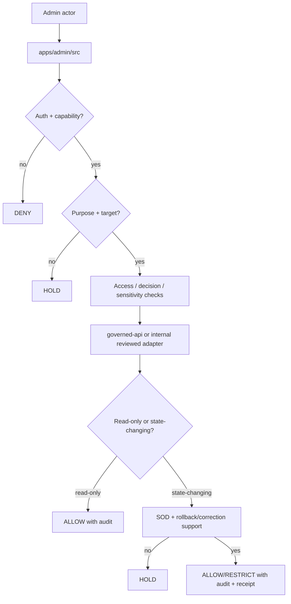

<!-- [KFM_META_BLOCK_V2]
doc_id: kfm://app/admin/src/readme
title: Admin App Source Tree README
type: app-readme
version: v0.1
status: draft
owners: OWNER_TBD — Apps steward · Security steward · Access steward · Audit steward · Docs steward
created: 2026-06-15
updated: 2026-06-15
policy_label: restricted
related:
  - ../README.md
  - ../../README.md
  - ../../governed-api/README.md
  - ../../review-console/README.md
  - ../../../policy/access/README.md
  - ../../../policy/decision/README.md
  - ../../../docs/security/AUDIT_INVARIANTS.md
  - ../../../docs/security/THREAT_MODEL.md
  - ../../../docs/security/INCIDENT_RESPONSE.md
  - ../../../packages/README.md
  - ../../../release/README.md
  - ../../../data/README.md
tags: [kfm, apps, admin, src, restricted, least-privilege, audit, deployable-source, trust-membrane]
notes:
  - "Replaces the greenfield admin/src stub with a governed source-tree README."
  - "This source tree is for admin app implementation only; it must not become the normal public path, release authority, lifecycle store, policy root, shared package root, or security doctrine home."
  - "Implementation files, route inventory, auth wiring, audit sinks, tests, CI, and deployment posture remain NEEDS VERIFICATION."
[/KFM_META_BLOCK_V2] -->

<a id="top"></a>

<div align="center">

# Admin App Source Tree

`apps/admin/src/`

**Source-tree boundary for the restricted Admin app: implementation code may live here, but admin behavior must stay least-privilege, audited, policy-bound, and outside the normal public path.**


[Purpose](#1-purpose) · [Repo fit](#2-repo-fit) · [Boundary](#3-authority-boundary) · [Inputs](#5-inputs) · [Exclusions](#6-exclusions) · [Candidate modules](#7-candidate-source-map) · [Definition of done](#14-definition-of-done)

</div>

---

> [!IMPORTANT]
> **Status:** draft / `NEEDS VERIFICATION`  
> **Owners:** `OWNER_TBD` — Apps steward · Security steward · Access steward · Audit steward · Docs steward  
> **Path:** `apps/admin/src/README.md`  
> **Responsibility root:** `apps/` — deployable application surfaces  
> **Truth posture:** CONFIRMED file path / PROPOSED source-tree contract / UNKNOWN implementation files, routes, auth, tests, and deployment state

> [!CAUTION]
> Code under `apps/admin/src/` must not normalize admin shortcuts. Any route, command, panel, or handler here should be role-gated, purpose-bound, audited, safe-by-default, and unable to bypass `apps/governed-api/`, access policy, release authority, lifecycle boundaries, or evidence closure.

---

## Quick jump

- [1. Purpose](#1-purpose)
- [2. Repo fit](#2-repo-fit)
- [3. Authority boundary](#3-authority-boundary)
- [4. Default posture](#4-default-posture)
- [5. Inputs](#5-inputs)
- [6. Exclusions](#6-exclusions)
- [7. Candidate source map](#7-candidate-source-map)
- [8. Diagram](#8-diagram)
- [9. Source-tree obligations](#9-source-tree-obligations)
- [10. Handler expectations](#10-handler-expectations)
- [11. Inspection path](#11-inspection-path)
- [12. Validation expectations](#12-validation-expectations)
- [13. Safe change pattern](#13-safe-change-pattern)
- [14. Definition of done](#14-definition-of-done)
- [15. Open verification items](#15-open-verification-items)

---

## 1. Purpose

`apps/admin/src/` is the proposed implementation source tree for the restricted Admin app.

It may eventually hold route handlers, UI components, service adapters, policy-client calls, audit emitters, and bounded operational workflows for admin-only use. This README does not prove those files exist; it defines the source-tree boundary they must follow if implemented.

This tree should support:

- read-only health and status inspection;
- audit-event inspection;
- non-secret configuration inspection;
- validation or release dry-runs that cannot publish;
- hold or rollback request workflows that still defer to release authority;
- tightly bounded break-glass maintenance flows.

[Back to top](#top)

---

## 2. Repo fit

| Concern | Owning root | Expected relationship |
|---|---|---|
| Admin source tree | `apps/admin/src/` | Implementation source for the restricted Admin app |
| Admin app contract | `apps/admin/README.md` | Parent app boundary and capability posture |
| Apps root | `apps/README.md` | Deployable app root and trust-membrane doctrine |
| Public trust path | `apps/governed-api/` | Normal public path; admin must not replace it |
| Review console | `apps/review-console/` | Normal role-gated steward review surface |
| Access policy | `policy/access/` | Capability and role decisions |
| Decision policy | `policy/decision/` | Finite outcome and safe reason-code posture |
| Shared code | `packages/` | Reusable libraries should be extracted here, not duplicated in admin source |
| Release control | `release/` | Publication, correction, rollback authority |
| Lifecycle artifacts | `data/` | Receipts, proofs, registries, catalog, triplets, and published artifacts |

## 3. Authority boundary

This source tree may implement admin workflows. It must not own the authorities those workflows inspect or request.

```text
apps/admin/src/     = restricted admin app implementation source
apps/admin/         = admin deployable boundary
apps/governed-api/  = normal public trust membrane
policy/access/      = access and capability decisions
policy/decision/    = finite outcome and reason-code decisions
packages/           = shared reusable libraries
release/            = publication, correction, rollback control
data/               = lifecycle artifacts, receipts, proofs, registries
infra/              = deployment and exposure posture
configs/            = non-secret config templates only
```

## 4. Default posture

Admin source code should fail closed.

A handler or component should not perform a consequential action when any of these are unresolved:

- authenticated subject;
- admin role and capability;
- purpose or ticket reference;
- target object or service;
- environment scope;
- access-policy result;
- sensitivity, rights, release, or review state where relevant;
- audit sink and correlation id;
- rollback or correction support for state-changing actions;
- break-glass approval and expiry where applicable.

## 5. Inputs

| Input family | Examples | Required posture |
|---|---|---|
| Actor context | user id, service id, session, role claim, steward assignment | Authenticated and policy-bound |
| Capability context | view audit, inspect config, run dry-run, request rollback, break-glass maintenance | Explicit finite action |
| Purpose context | incident id, review ticket, maintenance window, release-support note | Required for consequential action |
| Target context | service, receipt, release candidate, config template, audit query, policy bundle ref | Governed object reference |
| Policy context | access result, decision envelope, rights, sensitivity, release/review state | Resolved before action |
| Audit context | request id, actor, target, outcome, reason code, timestamp | Required for every admin request |

## 6. Exclusions

| Does not belong here | Correct home |
|---|---|
| Public API implementation | `apps/governed-api/` |
| Public map or explorer UI | `apps/explorer-web/` |
| Steward review workflow UI | `apps/review-console/` |
| Shared reusable libraries | `packages/` |
| Policy bundles | `policy/` |
| Schemas and contracts | `schemas/contracts/v1/`, `contracts/` |
| Lifecycle artifacts, receipts, proofs, registries | `data/` |
| Release manifests, rollback cards, correction notices | `release/` |
| Deployment/network/firewall configuration | `infra/` |
| Real credentials or private keys | secure deployment secret store, not repo source |
| One-off scripts | `scripts/` until promoted with review |

## 7. Candidate source map

Exact files and exports remain `NEEDS VERIFICATION`.

| Candidate area | Responsibility | Status |
|---|---|---|
| `routes/` | Admin route handlers or page entry points | PROPOSED |
| `components/` | Restricted admin UI components | PROPOSED |
| `auth/` | Admin auth adapter and capability checks | PROPOSED |
| `audit/` | Audit-event emission and correlation helpers | PROPOSED |
| `clients/` | Governed API, policy, release, and data-summary clients | PROPOSED |
| `workflows/` | Dry-run, hold-request, rollback-request, and break-glass workflows | PROPOSED |
| `redaction/` | Display filtering for sensitive fields | PROPOSED |

> [!WARNING]
> Candidate names are not implementation proof. Create them only with tests, route inventory, and parent README updates when behavior changes.

## 8. Diagram


```mermaid
flowchart TD
    actor["Admin actor"] --> ui["apps/admin/src"]
    ui --> auth{"Auth + capability?"}
    auth -->|no| deny["DENY"]
    auth -->|yes| purpose{"Purpose + target?"}
    purpose -->|no| hold["HOLD"]
    purpose -->|yes| policy["Access / decision / sensitivity checks"]
    policy --> api["governed-api or internal reviewed adapter"]
    api --> action{"Read-only or state-changing?"}
    action -->|read-only| audit1["ALLOW with audit"]
    action -->|state-changing| review["SOD + rollback/correction support"]
    review -->|no| hold2["HOLD"]
    review -->|yes| audit2["ALLOW/RESTRICT with audit + receipt"]
```

## 9. Source-tree obligations

| Obligation | Example effect |
|---|---|
| `least_privilege_required` | Every handler checks explicit capability and scope |
| `purpose_required` | Consequential actions require ticket, incident, or maintenance reference |
| `audit_required` | Every request emits an audit event or fails closed |
| `redaction_required` | Sensitive fields and protected details are filtered before display |
| `no_public_route` | Admin routes are never the normal public or semi-public surface |
| `no_release_shortcut` | Release decisions remain under `release/` authority |
| `rollback_required` | State-changing actions require rollback or correction path |
| `small_surface_required` | Shared logic graduates to `packages/` when reusable |

## 10. Handler expectations

Every route, command, or handler should document or encode:

- required capability;
- allowed roles;
- purpose requirement;
- target object family;
- read-only or state-changing classification;
- policy checks invoked;
- audit event emitted;
- rollback/correction requirement;
- safe failure outcome.

## 11. Inspection path

Implementation files, routes, auth, audit sinks, tests, CI, and deployment posture remain `NEEDS VERIFICATION`.

```bash
find apps/admin/src -maxdepth 5 -type f | sort
find apps/admin apps/governed-api apps/review-console policy/access docs/security tests -maxdepth 5 -type f 2>/dev/null | grep -Ei 'admin|auth|access|audit|role|capability|incident|rollback|redaction' | sort
find release data/receipts data/proofs -maxdepth 5 -type f 2>/dev/null | grep -Ei 'audit|rollback|correction|release|receipt' | sort
```

## 12. Validation expectations

Useful validation for this source tree should cover:

- unauthenticated request returns `DENY`;
- missing capability returns `DENY`;
- missing purpose or target returns `HOLD`;
- missing audit sink returns `ERROR` or `HOLD`;
- state-changing workflow without rollback/correction support returns `HOLD`;
- sensitive display values are redacted;
- route inventory proves admin is not public path;
- handlers cannot bypass policy, release, lifecycle, or evidence gates.

## 13. Safe change pattern

For source changes under `apps/admin/src/`:

1. Add or update route inventory.
2. Add tests for deny, hold, allow, restrict, abstain, and error paths.
3. Confirm audit output before enabling consequential actions.
4. Keep reusable logic in `packages/` instead of app-private duplication.
5. Update this README and parent `apps/admin/README.md` when behavior changes.

## 14. Definition of done

- [ ] Owners are confirmed and `OWNER_TBD` is replaced.
- [ ] Source files and route inventory are documented.
- [ ] Auth and capability checks are implemented and tested.
- [ ] Audit events are emitted for all admin requests.
- [ ] Sensitive display redaction is tested.
- [ ] State-changing actions require review and rollback/correction support.
- [ ] Break-glass code, if present, is time-limited and dual-reviewed.
- [ ] Public-path bypass checks are tested.
- [ ] Deployment exposure posture is linked from `infra/`.

## 15. Open verification items

| Item | Why it matters |
|---|---|
| Confirm implementation files beyond README | Prevents overclaiming source-tree maturity |
| Confirm framework/runtime | Required for route and handler expectations |
| Confirm auth and access policy integration | Required for least-privilege enforcement |
| Confirm audit event schema and sink | Required for accountability |
| Confirm route inventory | Required to prove admin is not public path |
| Confirm tests and fixtures | Required before enforcement claims |
| Confirm deployment exposure posture | Required before use in any environment |

<details>
<summary>Appendix A — no-loss preservation note</summary>

The previous README was a greenfield stub. This replacement adds a bounded source-tree contract for restricted admin implementation without claiming routes, auth, audit sinks, tests, CI, deployment posture, or break-glass workflow are implemented.

</details>

## Status summary

`apps/admin/src/` should hold implementation source for a restricted, audited Admin app only after routes, auth, audit, tests, and deployment posture are verified.

It must remain least-privilege, purpose-bound, audit-first, and subordinate to governed APIs, policy decisions, release controls, lifecycle boundaries, EvidenceBundle closure, correction, and rollback.

<p align="right"><a href="#top">Back to top</a></p>
