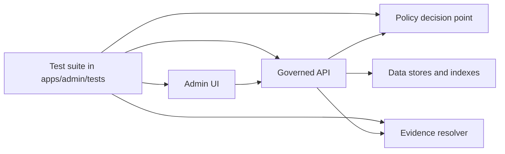

<!-- [KFM_META_BLOCK_V2]
doc_id: kfm://doc/f2e86a04-4540-4ad4-b120-643a05ca595d
title: apps/admin/tests — Test Suite
type: standard
version: v1
status: draft
owners: TBD
created: 2026-02-26
updated: 2026-02-28
policy_label: public
related:
  - apps/admin/README.md
  - docs/governance/REVIEW_GATES.md
  - policy/README.md
tags: [kfm, admin, tests]
notes:
  - This README is intentionally conservative: update commands/paths once the admin test runner is confirmed in-repo.
  - Keep this doc aligned to KFM invariants: truth path, trust membrane, evidence-first UX, cite-or-abstain.
[/KFM_META_BLOCK_V2] -->

# `apps/admin/tests` — Admin surface test suite

Test suite for the **Admin/Steward** surface of KFM: permissions, policy enforcement UX, review workflows, and contract-level behavior that protects the **trust membrane**.


---

## Quick links

- [What belongs here](#what-belongs-here)
- [How this fits in the repo](#how-this-fits-in-the-repo)
- [Test types and minimum coverage](#test-types-and-minimum-coverage)
- [Gates alignment matrix](#gates-alignment-matrix)
- [Run tests](#run-tests)
- [Writing new tests](#writing-new-tests)
- [Fixtures and test data policy](#fixtures-and-test-data-policy)
- [CI gates](#ci-gates)
- [Troubleshooting](#troubleshooting)
- [Directory tree](#directory-tree)

---

## What belongs here

✅ **Include tests that validate the Admin app’s responsibilities**, especially around governance and safety:

- **AuthZ / role gating** (Admin UI): public / contributor / reviewer-steward / operator boundaries.
- **Policy surface UX**: policy labels, obligations/notices, redaction/generalization cues, “why denied” handling.
- **Contract checks** for admin workflows and admin-only endpoints:
  - promotion queue, story review queue
  - approval / rejection / publish operations
  - evidence/receipt display behaviors
- **“No-leak” tests**: verify restricted metadata is not exposed in:
  - HTTP errors (403/404), UI error boundaries, toast messages
  - logs/telemetry emitted by the UI bundle
  - client-side state stores and cached responses

❌ **Do not** put these here:

- Backend unit tests (put them next to backend modules or in the backend test tree).
- Policy pack unit tests (OPA/Rego) — those live with the policy bundle repository.
- Shared end-to-end harnesses (e.g., Focus Mode golden query harness) — those typically live at repo-root `tests/`.

---

## How this fits in the repo

KFM governance is enforceable behavior, not documentation.

### Non-negotiable posture (Admin UI must prove it)

- **Policy semantics must match in CI and runtime** (or CI guarantees are meaningless).
- The **UI never makes policy decisions**; it only renders outcomes (labels, notices, restricted states).
- The Admin surface is a **governance cockpit**:
  - it must clearly show *what happened* (decisions, obligations, receipts)
  - it must never enable bypass (no direct storage/DB access; no client-side “role escalation”)

### Test boundary diagram



> NOTE: This README intentionally includes **runner/config placeholders**. Replace TODOs once you confirm the actual admin stack (Jest/Vitest/Playwright/Cypress/pytest/etc.) and the repo’s CI entrypoints.

---

## Test types and minimum coverage

| Test type | Goal | Examples | Runs in CI | Must block merge? |
|---|---|---|---:|---:|
| **AuthZ UI tests** | Route + component gating by role | public can’t see steward panels; steward can approve | ✅ | ✅ |
| **API contract tests** | Requests/responses match contract + policy posture | 403/404 never leak restricted metadata; DTO schema stable | ✅ | ✅ |
| **Policy outcome UX tests** | UI renders labels + obligations correctly | `public_generalized` shows “geometry generalized” notice | ✅ | ✅ |
| **Review workflow tests** | Admin review flows are governed and auditable | “approve promotion” requires auth; UI shows decision id | ✅ | ✅ |
| **Receipt/audit display tests** | UI renders run receipts safely | receipt link opens details; restricted fields redacted | ✅ | ✅ |
| **Smoke tests** | “App boots” sanity | admin app loads, key routes respond | ✅ | ⚠️ recommended |

### Coverage matrix (minimum)

These scenarios should be represented at least once:

- **Default deny**: unprivileged roles are denied access to admin workflows.
- **Role escalation is impossible client-side**: changing local state cannot unlock admin functions without server authorization.
- **No restricted leakage**: responses and UI error surfaces do not reveal restricted dataset names, coordinates, or sensitive metadata.
- **Obligations render**: when policy returns obligations, the UI renders required notices (not optional).
- **Evidence-first UX**: from any governed object (dataset/story/run), the UI can open an evidence panel showing version + rights + provenance pointers.

---

## Gates alignment matrix

Admin tests should explicitly “touch” the gates KFM relies on.

> These are **intent-level gates**. Bind them to your actual implementation once verified in-repo.

| KFM gate / invariant | What Admin must surface or enforce | Example test assertion |
|---|---|---|
| **Default deny + no-leak** | Denials are safe, boring, and consistent | 403/404 UI shows generic denial; does not display restricted ids |
| **Sensitivity + obligations** | Obligations are rendered and acknowledged | redaction notice appears; export button disabled when obligated |
| **Licensing/rights visibility** | Users can see license/rights where required | evidence drawer shows license/rights text for a dataset version |
| **Catalog triplet as contract** | UI navigates via stable ids, not guesses | dataset/version links use ids; broken evidence resolution fails closed |
| **Run receipt + audit record** | Governed actions produce receipts and are viewable | approval action yields a receipt reference; UI can open and display it |
| **Cite-or-abstain posture (admin-facing)** | Admin can see when citations are missing/invalid | story publish UI blocks if citations don’t resolve |

---

## Run tests

### 1) Discover the actual runner (one-time setup)

From repo root:

- Inspect `apps/admin/package.json` (or equivalent) for scripts like `test`, `test:ci`, `test:e2e`.
- Look for configs: `jest.config.*`, `vitest.config.*`, `playwright.config.*`, `cypress.config.*`, `pytest.ini`, etc.
- Confirm whether tests require backend services (API, DB) or can run against mocks.
- Identify any contract inputs (OpenAPI/JSON schemas) used by tests—prefer contract-first checks over brittle UI assertions.

### 2) Common command patterns (replace with real ones)

> WARNING: These are templates. Update once confirmed in-repo.

```sh
# Option A: workspace-aware package manager (common in monorepos)
pnpm -C apps/admin test
pnpm -C apps/admin test:ci

# Option B: run inside the admin app
cd apps/admin
npm test
npm run test:ci
```

### 3) Integration / e2e mode (if applicable)

If Admin UI tests require a running API:

```sh
# Pseudo-flow — update to match your compose/dev scripts
# 1) start backend (governed API + policy engine)
# 2) start admin app
# 3) run e2e suite
```

---

## Writing new tests

### Design principles (KFM-aligned)

1. **Test the boundary, not the internals**
   - Prove the UI can’t bypass policy; it can’t fetch or reveal restricted info without authorization.

2. **Prefer contract-first assertions**
   - If an endpoint has an OpenAPI/JSON schema, write a contract test that fails on breaking changes.

3. **Fail closed**
   - If a scenario is unsafe to model, assert denial/redaction and confirm the UI does not reveal details.

4. **Golden tests for governance workflows**
   - For promotion/review/publish flows, keep “golden” fixtures that represent canonical outcomes and run them in CI.

### Suggested test naming

- `*.authz.spec.*` — role gating and forbidden transitions
- `*.contract.spec.*` — DTO and HTTP contract assertions
- `*.obligations.spec.*` — notices/badges/redaction UX
- `*.review.spec.*` — promotion + story review workflows
- `*.receipt.spec.*` — receipts / audit trail UI expectations

### PR checklist for adding/updating tests

- [ ] Test asserts behavior at the **policy boundary** (UI + governed API), not by reaching into internals.
- [ ] Fixtures are **synthetic** and contain **no PII** or restricted coordinates.
- [ ] At least one assertion covers **default deny** or **no-leak** behavior.
- [ ] Test is deterministic (no real network calls; no time-dependent assertions without a fixed clock).
- [ ] Added/updated tests run in CI and would **block merge** on regression.

---

## Fixtures and test data policy

Tests in this directory may model sensitive cases; **fixtures must remain safe**.

### Rules

- Use **synthetic** fixtures by default.
- Never store real PII in fixtures.
- Never store exact coordinates for restricted locations — use generalized geometry (or fake data).
- Treat **policy label** as part of the fixture contract (`public`, `restricted`, `public_generalized`, etc.).
- When policy includes **obligations**, fixtures should include the obligation payload and the UI test must assert it is rendered.

### Example fixture shape (illustrative)

```json
{
  "user": { "role": "steward" },
  "resource": { "policy_label": "public_generalized" },
  "obligations": [
    { "type": "show_notice", "message": "Geometry generalized due to policy." }
  ]
}
```

---

## CI gates

This directory is expected to contribute to **hard merge gates**.

### Minimum gate posture

Admin tests should run on PR and **block merge** when:

- policy outcomes change unexpectedly,
- contracts break,
- restricted leakage is detected,
- audit/receipt requirements regress.

### Recommended CI outputs

- JUnit / test report artifact
- Coverage report (if applicable)
- “No-leak” scan output (optional but strongly recommended)

---

## Troubleshooting

- **Flaky auth tests**: ensure user identity/role is injected via a single mechanism (fixture → API), not set ad-hoc in UI state.
- **E2E failures**: confirm backend is up, seeded with safe fixtures, and policy bundle loaded.
- **Contract drift**: regenerate clients/schemas only via the approved pipeline; update tests in the same PR.
- **Leak regressions**: search rendered HTML, client logs, and network traces for restricted ids/fields.

---

## Directory tree

> PROPOSED: update this tree to match the real folder layout.

```text
apps/admin/tests/                                      # Admin app tests (authz, contracts, obligations, receipts)
├── README.md                                          # This file (scope, commands, fixtures policy, CI mapping)
├── fixtures/                                          # Synthetic users/resources/obligations (safe + deterministic)
├── authz/                                             # Route gating + role-based UI visibility tests
├── contracts/                                         # Admin API schema/contract tests (DTOs, OpenAPI, compat checks)
├── obligations/                                       # Badges/notices/redaction UX tests (policy-driven UI behavior)
├── review/                                            # Promotion + story review queue flows (approve/deny/publish)
├── receipts/                                          # Receipt viewer + audit link rendering (safe display)
└── e2e/                                               # Optional end-to-end flows (UI + API) for critical admin journeys
```

---

### Back to top

↑ [Quick links](#quick-links)
