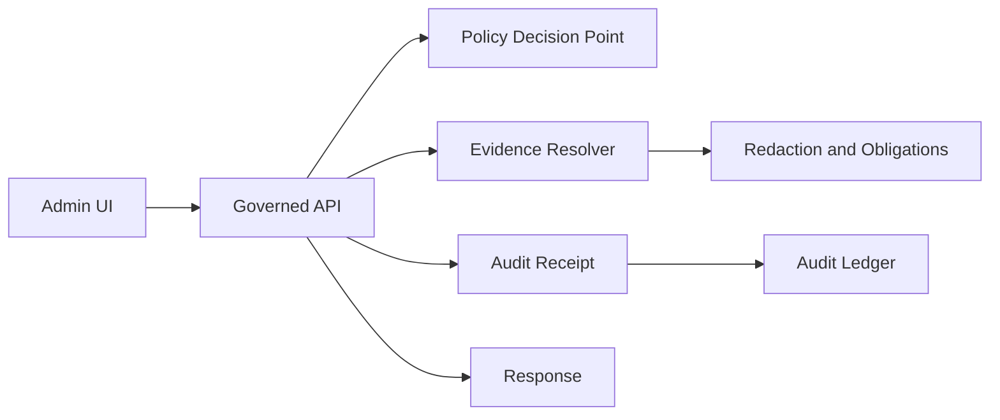

<!-- [KFM_META_BLOCK_V2]
doc_id: kfm://doc/9c423469-44ac-4979-afa0-657cab8b0da3
title: Admin Audit Tests
type: standard
version: v1
status: draft
owners: TODO
created: 2026-02-26
updated: 2026-02-26
policy_label: internal
related:
  - apps/admin/tests/audit
tags: [kfm, admin, tests, audit]
notes:
  - Documents the audit test suite for the Admin app.
  - Treat this as CI-enforced governance (fail closed).
[/KFM_META_BLOCK_V2] -->

# Admin Audit Tests

> CI-enforced tests that protect the KFM trust membrane by verifying **audit receipts**, **policy decisions**, and **redaction behavior** for Admin workflows.


**Quick links**
- [Purpose](#purpose)
- [Where this fits](#where-this-fits)
- [What belongs here](#what-belongs-here)
- [Audit invariants this suite enforces](#audit-invariants-this-suite-enforces)
- [How to run](#how-to-run)
- [Adding a new audit test](#adding-a-new-audit-test)
- [CI expectations](#ci-expectations)
- [Troubleshooting](#troubleshooting)
- [Appendix: templates](#appendix-templates)

---

## Purpose

This directory contains **audit-focused tests** for the Admin application.

These tests exist to ensure that:

1. **Every governed action produces an auditable receipt** (with stable IDs/digests where applicable).
2. **Policy decisions are enforced and recorded** (allow/deny + obligations) and do not diverge between CI and runtime.
3. **Redaction/generalization obligations are honored** and **sensitive metadata does not leak** in responses, logs, or error messages.

> **WARNING**
> If an action cannot be audited, it should be treated as **unsafe** and the system should **fail closed** (deny / abstain / block promotion).

[Back to top](#admin-audit-tests)

---

## Where this fits

Directory: `apps/admin/tests/audit/`

This suite is part of the Admin app’s defense-in-depth for KFM governance:

- The **Admin UI** should never bypass the policy boundary.
- The **Governed API + Evidence Resolver** are the only place where data is served and redactions are applied.
- The **Audit Ledger** (append-only) is how we prove “what happened, why, and under which policy.”



[Back to top](#admin-audit-tests)

---

## What belongs here

✅ Put tests here when they assert **auditability and governance** outcomes, including:

- **Receipt generation**: `audit_ref` exists and resolves to a stored receipt.
- **Receipt completeness**: required fields are present (actor, action, timestamps, policy decision, output digest).
- **Policy parity**: the same policy fixtures used in CI yield the same allow/deny outcomes as runtime checks.
- **Redaction safety**: restricted fields (e.g., precise coordinates, restricted dataset metadata) do not appear in:
  - API responses
  - UI state snapshots
  - error payloads
  - logs / receipts (beyond allowed digests)
- **Contract tests** for audit-related API surfaces (e.g., errors must include `audit_ref`).
- **Regression tests** for known edge cases (historical bugs, “golden” scenarios).

### Exclusions

❌ Do **not** put these here:

- Full end-to-end UI journeys unrelated to governance (keep those in the general E2E suite).
- Performance/load benchmarks (separate perf harness).
- Tests containing real restricted datasets, real user PII, or production secrets.

[Back to top](#admin-audit-tests)

---

## Directory layout

> **NOTE**
> This is a **recommended** layout. The repo’s actual tooling may differ, but keep this folder focused on audit/governance behavior.

```text
apps/admin/tests/audit/
  README.md                # this file
  fixtures/                # synthetic inputs and expected receipts (no real PII/restricted data)
  helpers/                 # shared test helpers (receipt fetch, policy eval, redaction asserts)
  snapshots/               # optional: UI/API snapshots for regression coverage
  audit.*.spec.*           # the tests (runner-specific extension)
```

[Back to top](#admin-audit-tests)

---

## Audit invariants this suite enforces

The Admin audit suite should cover the following invariants. Treat this as a living checklist.

| Invariant | What “pass” looks like | Suggested test style |
|---|---|---|
| Audit receipt exists | Every governed action returns / records an `audit_ref` and a persisted receipt | Integration (API) + UI smoke |
| Citation/claim gating (where applicable) | If citations cannot be verified or evidence cannot be resolved, the system abstains/denies and still emits a receipt | Contract + negative tests |
| Policy decision recorded | Receipt includes allow/deny + obligations (and the applied `policy_label`) | Unit + integration |
| No sensitive leakage | Restricted metadata (including coordinates) does not appear in outputs/logs/errors | Snapshot + string-search + property tests |
| Deterministic digests | The same canonical inputs produce stable IDs/digests | Unit (pure) |
| CI/runtime parity | Policy fixtures and contract tests run in CI and block merges on failure | CI gate |

> **TIP**
> When you add a new audit test, explicitly name the invariant in the test title so failures are self-explanatory.

[Back to top](#admin-audit-tests)

---

## How to run

Because repository tooling differs across environments, treat the commands below as **examples**.

1. Find the Admin app’s test runner entry point (examples: `package.json` scripts, `jest.config.*`, `vitest.config.*`, `pytest.ini`, etc.).
2. Run only this suite while iterating.
3. Run the full test matrix before merging.

### Examples (verify against your repo)

```bash
# Node monorepo (example patterns):
pnpm -C apps/admin test -- tests/audit
# or
npm test --workspace apps/admin -- tests/audit

# Python (if apps/admin is a Python service; example):
pytest -q apps/admin/tests/audit
```

[Back to top](#admin-audit-tests)

---

## Adding a new audit test

### Minimal steps

- [ ] Identify the governed action (API endpoint / command / workflow).
- [ ] Add (or update) a fixture representing the input (synthetic, non-sensitive).
- [ ] Assert the policy outcome (allow/deny + obligations) is correct.
- [ ] Assert an `audit_ref` is returned/emitted and resolves to a receipt.
- [ ] Assert the receipt contains required fields (see [Appendix](#appendix-templates)).
- [ ] Assert no restricted fields appear in output/logs/errors (string scan + structural checks).
- [ ] Add a regression test for any bug fix (name it after the bug / issue).

### Test naming convention (recommended)

Use a naming scheme that makes “what broke” obvious:

- `audit.<domain>.<behavior>.spec.*`
- `audit.<endpoint>.<policy_case>.spec.*`
- `audit.<workflow>.redaction.spec.*`

Examples:
- `audit.promote_dataset.denies_without_rights.spec.ts`
- `audit.focus_mode.abstains_on_unverifiable_citations.spec.ts`
- `audit.evidence_resolve.strips_restricted_coordinates.spec.ts`

[Back to top](#admin-audit-tests)

---

## CI expectations

These tests are expected to act like **gates**, not “nice-to-haves”.

- Audit-related tests should run in CI for any change that touches:
  - policy bundle / fixtures
  - evidence resolver
  - API contracts
  - promotion workflows
  - Focus Mode control loop
- Failures should **block merges** until resolved.

> **NOTE**
> If you see audit tests failing only in CI (but not locally), suspect an environment mismatch:
> policy bundle version, fixture loading, time-zone/time mocking, or non-deterministic hashing.

[Back to top](#admin-audit-tests)

---

## Troubleshooting

### “audit_ref missing”
- The call path may be bypassing the governed API (trust membrane violation).
- The test fixture may be using a mock that skips the audit wrapper.

### “policy mismatch (CI vs runtime)”
- Ensure the *same* policy fixtures and evaluation semantics are used in both places.
- Avoid “shadow policies” implemented only in UI code.

### “redacted field leaked”
- Check both:
  - direct response payload
  - error payloads (`403/404`) and log lines
- Add a string-scan assertion for the leaked token (dataset id, coordinate pattern, etc.).

[Back to top](#admin-audit-tests)

---

## Appendix: templates

<details>
<summary><strong>Run receipt (minimal shape; adapt to the repo contract)</strong></summary>

The KFM model treats governed actions (including Focus Mode requests) as **runs** with receipts.

```json
{
  "run_id": "uuid-or-ulid",
  "timestamp": "2026-02-26T00:00:00Z",
  "actor": {
    "user_id": "redacted-or-internal-id",
    "role": "public|contributor|steward|operator|..."
  },
  "action": "string",
  "inputs": {
    "query": "optional",
    "view_state_digest": "optional"
  },
  "policy": {
    "decision": "allow|deny",
    "policy_label": "public|restricted|...",
    "obligations": []
  },
  "evidence": {
    "bundle_digests": []
  },
  "output": {
    "digest": "sha256:...",
    "latency_ms": 0
  },
  "system": {
    "model_version": "optional",
    "build_id": "optional"
  }
}
```

</details>

<details>
<summary><strong>Audit test skeleton (pseudo)</strong></summary>

```ts
// PSEUDO-CODE ONLY — adapt to Jest/Vitest/Playwright/etc.
test("audit.promote_dataset.denies_without_rights emits receipt", async () => {
  const res = await callGovernedApi({
    action: "promote_dataset",
    actor: { role: "contributor" },
    inputs: { /* fixture */ },
  });

  expect(res.status).toBe(403);
  expect(res.body.audit_ref).toBeDefined();

  const receipt = await fetchReceipt(res.body.audit_ref);
  expect(receipt.policy.decision).toBe("deny");

  // No sensitive leakage:
  expect(JSON.stringify(res.body)).not.toMatch(/restricted_dataset_id|\b-?\d+\.\d+\b/);
});
```

</details>

[Back to top](#admin-audit-tests)
