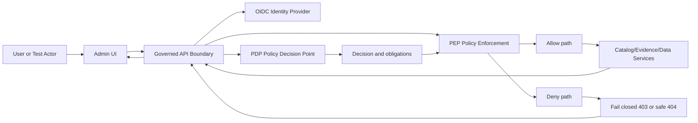

<!-- [KFM_META_BLOCK_V2]
doc_id: kfm://doc/02177d5a-b2a5-4bda-a0a4-c18be328398f
title: Admin AuthZ Test Suite
type: standard
version: v1
status: draft
owners: TBD (not confirmed in repo)
created: 2026-02-26
updated: 2026-02-28
policy_label: internal
related:
  - TODO: link to policy bundle repo path (not confirmed in repo)
  - TODO: link to governed API auth docs (not confirmed in repo)
  - TODO: link to Admin app auth docs (not confirmed in repo)
tags: [kfm, authz, tests, admin]
notes:
  - This README documents the authorization test harness for the Admin app.
  - Defaults follow KFM posture: policy-as-code, shared CI/runtime semantics, and fail-closed behavior.
[/KFM_META_BLOCK_V2] -->

# Admin AuthZ Test Suite
**Purpose:** Guard the **trust membrane** by continuously validating authorization behavior (**allow/deny + obligations**) for the Admin app.

 <!-- TODO: replace with real badge -->
 <!-- TODO: replace with real badge -->
 <!-- TODO: replace with real badge -->
 <!-- TODO: replace with real badge -->
 <!-- TODO: replace with real badge -->

---

## Quick navigation
- [Purpose](#purpose)
- [Scope and non-goals](#scope-and-non-goals)
- [Definitions](#definitions)
- [Architecture mental model](#architecture-mental-model)
- [Test stack](#test-stack)
- [Directory layout](#directory-layout)
- [How to run](#how-to-run)
- [Test actors](#test-actors)
- [Adding a new AuthZ test](#adding-a-new-authz-test)
- [Test catalog](#test-catalog)
- [Definition of Done](#definition-of-done)
- [Common failure modes](#common-failure-modes)
- [Appendix](#appendix)

---

## Purpose
This directory exists to make one thing true **every time**:

> If policy would deny (or require redaction/generalization), the Admin UI and Admin API must behave accordingly — and CI must catch regressions before merge.

These tests are meant to be **more than UI checks**: they validate the **same decision semantics** used at runtime (or at minimum the **same fixtures and expected outcomes**).

---

## Scope and non-goals

### In scope
- **Authentication boundaries** (unauthenticated/expired/invalid tokens fail closed)
- **Role/permission enforcement** (RBAC; ABAC only if/when introduced)
- **Policy obligations** (redaction/generalization, licensing/attribution on export/download)
- **Non-leakage** (deny responses must not leak restricted existence or metadata)
- **Sensitive location protection** (restricted precise geometry never exposed to unauthorized contexts)

### Non-goals (keep this buildable)
- ❌ Proving “security” solely via UI state (hidden buttons ≠ enforcement)
- ❌ Exhaustive performance/security benchmarking (belongs in dedicated perf/security suites)
- ❌ Verifying upstream ingestion/promotion gates (belongs in pipeline promotion contract tests)

---

## Definitions
- **AuthN**: Who you are (identity / token validity).
- **AuthZ**: What you can do (policy decision: allow/deny + obligations).
- **PDP** (*Policy Decision Point*): Evaluates policy and returns decision + obligations.
- **PEP** (*Policy Enforcement Point*): Enforces the decision (API gateway/routes, evidence resolver, etc).
- **Obligations**: Required transforms/constraints (e.g., redact fields, generalize geometry, include attribution, block export).
- **Fail-closed**: On uncertainty, error, or policy mismatch: deny safely.

---

## Architecture mental model
Authorization in KFM is intentionally multi-layered:

- The **UI may display badges/notices**, but it must **not** be the policy decision maker.
- The **governed API is the enforcement boundary** (policy checks, redaction, evidence resolution, stable error model).



**Invariant:** CI and runtime must share policy semantics (or at minimum the same fixtures and expected outcomes), or CI guarantees are meaningless.

---

## Test stack
Treat AuthZ as a **contract** with three complementary test layers:

```mermaid
flowchart TB
  F[Policy decision fixtures] --> U[PDP unit tests]
  F --> I[API integration tests (PEP enforcement)]
  F --> E[UI e2e tests (consumer behavior)]
  U --> Gate[Merge gate: fail closed]
  I --> Gate
  E --> Gate
```

### 1) PDP unit tests (fast, deterministic)
- Evaluate policy decisions directly against fixtures.
- Assert **decision + obligations**.
- Detect semantic drift early.

### 2) API integration tests (enforcement boundary)
- Call the governed API as a client.
- Assert:
  - allow/deny responses
  - obligations are enforced server-side (redaction/generalization, export blocking, attribution requirements)
  - stable error model and **no ghost metadata**

### 3) UI e2e tests (consumer correctness)
- UI uses the governed API like any other client.
- Assert UI renders:
  - policy-safe error states
  - badges/notices
  - disabled affordances (but *never* as the only enforcement)

---

## Directory layout
> **NOTE:** Exact names/paths may differ in your repo. Treat this as a *documentation skeleton* and update to match reality.

```text
apps/admin/tests/authz/
  README.md                     # you are here
  fixtures/                     # decision fixtures: allow/deny + obligations
    cases.*                     # json/yaml/ts
  pdp/                          # optional: direct PDP evaluation tests
  api/                          # optional: API integration tests (PEP boundary)
  ui/                           # optional: UI e2e tests
  helpers/                      # token helpers, API clients, login helpers
  snapshots/                    # optional: UI snapshots (badges / safe errors)
```

### Acceptable inputs
- Deterministic **policy decision fixtures** (allow/deny + obligations).
- Minimal **test actors** (public, contributor, steward, operator) with *non-secret* identifiers.
- Test utilities that **do not embed long-lived credentials**.

### Exclusions
- ❌ Real production tokens, passwords, API keys, or secrets.
- ❌ Tests that “verify” AuthZ only by checking hidden buttons (UI-only gating).
- ❌ Fixtures with precise coordinates for restricted sites unless explicitly approved and access-controlled.

---

## How to run
Because repo layout and tooling can vary, prefer “discoverable commands”:

1) **Find the workspace scripts**
- Look for `package.json` scripts in `apps/admin/` and/or repo root.

2) **Common commands (pick what your repo uses)**
```bash
# from repo root (examples)
pnpm -C apps/admin test
yarn --cwd apps/admin test
npm --prefix apps/admin test

# run only authz-related tests (examples)
pnpm -C apps/admin test -- authz
yarn --cwd apps/admin test authz
npm --prefix apps/admin test -- authz
```

3) **Environment configuration**
Create a local `.env` file **outside** of git-tracked paths if possible.

Suggested variables (names are illustrative):
```bash
ADMIN_BASE_URL=http://localhost:3000
API_BASE_URL=http://localhost:8080

# Use short-lived tokens or a test IdP; do not commit secrets.
TEST_USER_PUBLIC_SUB=...
TEST_USER_CONTRIBUTOR_SUB=...
TEST_USER_STEWARD_SUB=...
TEST_USER_OPERATOR_SUB=...
```

---

## Test actors
Keep the actor set small and governance-aligned. Suggested baseline roles:

| Actor | Typical intent | Must be able to do | Must NOT be able to do |
|---|---|---|---|
| public | read-only public exploration | access public content | see restricted existence/metadata |
| contributor | propose/draft | create drafts (where allowed) | publish or export restricted |
| steward (reviewer) | governance approval | approve/publish; manage labels/obligations | bypass gates silently |
| operator | run pipelines / ops | operate systems | override policy decisions |

> **TIP:** If you can’t name the actor and the “must not”, you probably don’t have a crisp policy boundary yet — treat it as a governance gap.

---

## Adding a new AuthZ test
1. **Start from policy**
   - Add/update a fixture that describes:
     - actor context
     - action
     - resource
     - expected allow/deny
     - expected obligations (if any)

2. **Add enforcement coverage**
   - API-level test: verifies allow/deny and obligation enforcement.
   - UI-level test: verifies UI renders correct state (badge, disabled affordance, safe error).

3. **Add regression locks (negative assertions)**
   - If the bug was a leak, add explicit “must not contain” checks on:
     - fields
     - IDs
     - names/titles
     - hints that reveal restricted existence (“ghost metadata”)

4. **Keep it reproducible**
   - Deterministic inputs
   - Avoid machine-time dependence (unless explicitly testing expiry windows)
   - No network calls beyond governed surfaces under test

---

## Test catalog
Use this table to keep coverage visible and prevent missing cases.

| Scenario | Actor | Action | Expected | What it protects |
|---|---|---|---|---|
| Admin route requires auth | public | open admin page | deny | blocks unauthenticated access |
| Privileged tool requires steward role | contributor | run restricted tool | deny | least privilege |
| Restricted dataset metadata does not leak | unauthorized | fetch restricted dataset | safe deny | prevents sensitive leakage |
| Obligations are enforced | authorized | export/download | allow + obligations | rights/licensing enforcement |
| Sensitive geometry not exposed | public | view sensitive layer | deny or generalized | sensitive location protection |

---

## Definition of Done
- [ ] A policy fixture exists (allow/deny + obligations) for the scenario.
- [ ] A PDP-level test asserts the decision + obligations (fast semantic check).
- [ ] At least one enforcement test exists at the API layer (PEP boundary).
- [ ] UI behavior is tested *only as a consumer* of the governed API (no “UI makes the decision”).
- [ ] Denies are **fail-closed** and do **not leak** restricted metadata or restricted existence.
- [ ] If obligations exist, they are asserted explicitly (redaction/generalization/attribution/export rules).
- [ ] The test is deterministic in CI (no flaky timing, no external dependencies).

---

## Common failure modes

### “The button is hidden, so we’re safe”
Not safe. UI hiding is not enforcement. Always test the **API** denies too.

### “CI passes, but runtime differs”
This usually means CI and runtime are using **different policy semantics or different fixtures/outcomes**.
Fix by sharing fixtures and ensuring tests evaluate the same PDP logic (or the same outcomes).

### “403 leaks details”
A deny response can still leak restricted names/IDs/metadata (including “ghost metadata” like “resource exists but you can’t see it”).
Tests must assert **absence** of restricted fields and policy-safe error messaging.

### “Generalized layer still leaks precision”
If a public derivative exists, ensure it is **non-reversible** (no hidden points, no unredacted fields). Treat generalization as a first-class transform.

---

## Appendix

### Fixture contract
A fixture must be reviewable by humans *and* executable by CI.

**Recommended schema (adapt to your harness):**
```yaml
case_id: AUTHZ-0001
description: Public user cannot export restricted dataset
actor:
  sub: "user_public"
  roles: ["public"]
  attributes: {}
resource:
  type: "dataset_version"
  id: "kfm://dataset_version/..."
  policy_label: "restricted"
action: "export"
expected:
  allow: false
  status: 403
  obligations: []
assertions:
  response_must_not_contain:
    - "dataset_title"
    - "restricted_reason"
notes:
  - "If public_generalized exists, public may access that instead."
```

<details>
<summary><strong>Appendix: Suggested obligation vocabulary (illustrative)</strong></summary>

Use whatever your policy engine produces, but keep it explicit and testable:

- `redact_fields: ["fieldA", "fieldB"]`
- `generalize_geometry: { method: "grid_snap", precision: "coarse" }`
- `require_attribution: true`
- `block_export: true`
- `force_metadata_only: true`
- `deny_reason_code: "POLICY_RESTRICTED"`

</details>

---

<p align="right"><a href="#admin-authz-test-suite">Back to top</a></p>
