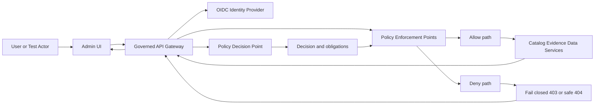

<!-- [KFM_META_BLOCK_V2]
doc_id: kfm://doc/02177d5a-b2a5-4bda-a0a4-c18be328398f
title: Admin AuthZ Test Suite
type: standard
version: v1
status: draft
owners: TBD (not confirmed in repo)
created: 2026-02-26
updated: 2026-02-26
policy_label: internal
related:
  - TBD: link to policy bundle repo path (not confirmed in repo)
  - TBD: link to admin app auth docs (not confirmed in repo)
tags: [kfm, authz, tests, admin]
notes:
  - This README documents the authorization test harness for the Admin app.
  - Defaults follow KFM posture: policy-as-code, shared CI/runtime semantics, and fail-closed behavior.
[/KFM_META_BLOCK_V2] -->

# Admin AuthZ Test Suite
**Purpose:** Guard the *trust membrane* by continuously validating authorization behavior (allow/deny + obligations) for the Admin app.

 <!-- TODO: replace with real badge -->
 <!-- TODO: replace with real badge -->
 <!-- TODO: replace with real badge -->

---

## Quick navigation
- [Purpose](#purpose)
- [What “AuthZ” covers here](#what-authz-covers-here)
- [Architecture mental model](#architecture-mental-model)
- [Directory layout](#directory-layout)
- [How to run](#how-to-run)
- [Adding a new AuthZ test](#adding-a-new-authz-test)
- [Test catalog](#test-catalog)
- [Definition of Done](#definition-of-done)
- [Common failure modes](#common-failure-modes)
- [Appendix: Fixture contract](#appendix-fixture-contract)

---

## Purpose
This directory exists to make one thing true **every time**:

> If policy would deny (or require redaction/generalization), the Admin UI and Admin API must behave accordingly — and CI must catch regressions before merge.

These tests are meant to be *more than UI checks*: they validate the **same decision semantics** used at runtime (or at minimum the same fixtures and outcomes).

---

## What AuthZ covers here
AuthZ tests in this directory should cover:

1. **Authentication boundaries**
   - Unauthenticated users cannot access Admin surfaces.
   - Expired/invalid tokens fail closed.

2. **Role/permission enforcement**
   - Role-based access (RBAC) for Admin capabilities.
   - Optional attribute-based constraints (ABAC) *only if/when introduced*.

3. **Policy obligations**
   - Redaction/generalization requirements are enforced (not merely “hidden” in the UI).
   - Rights/licensing obligations are respected for export/download surfaces.

4. **Non-leakage**
   - Denies must not leak restricted metadata (including via error message text, response size, timing side-channels, or UI hints).

5. **Sensitive location protection**
   - Restricted geometries/coordinates never appear in public/unauthorized contexts.
   - Public representations use generalized derivatives when allowed.

---

## Architecture mental model
Authorization in KFM is intentionally multi-layered: **UI may display policy badges/notices, but it must not be the policy decision maker.** The policy decision is made behind the governed boundary.



**Key invariant:** CI and runtime must share policy semantics (or at minimum the same fixtures and expected outcomes), or CI guarantees are meaningless.

---

## Directory layout
> **NOTE:** The exact file names may differ in your repo. Treat the tree below as a *documentation skeleton* and update it to match reality.

```text
apps/admin/tests/authz/
  README.md                  # you are here
  fixtures/                  # allow/deny + obligation fixtures (source-of-truth for cases)
    cases.*                  # json/yaml/ts — format depends on your harness
  helpers/                   # token helpers, API clients, UI login helpers, etc.
  specs/                     # test specs (UI e2e and/or API integration)
  snapshots/                 # optional: UI snapshots for policy badges / error states
```

### Acceptable inputs
- Deterministic **policy decision fixtures** (allow/deny + obligations).
- Minimal **test actors** (public, contributor, steward/reviewer, operator, etc.) with *non-secret* identifiers.
- Test utilities that do **not** embed long-lived credentials.

### Exclusions
- ❌ Real production tokens, passwords, API keys, or secrets.
- ❌ Tests that “verify” AuthZ only by checking hidden buttons (UI-only gating).
- ❌ Fixtures that include precise coordinates for restricted sites unless explicitly approved and access-controlled.

---

## How to run
Because this repo layout and tooling can vary, prefer “discoverable commands”:

1) **Find the workspace scripts**
- Look for `package.json` scripts in `apps/admin/` and/or repo root.

2) **Common commands (pick the one your repo uses)**
```bash
# from repo root (examples)
pnpm -C apps/admin test
yarn --cwd apps/admin test
npm --prefix apps/admin test

# run only authz-related tests (examples)
pnpm -C apps/admin test -- authz
yarn --cwd apps/admin test authz
npm --prefix apps/admin test -- authz
```

3) **Environment configuration**
Create a local `.env` file **outside** of git-tracked paths if possible.

Suggested variables (names are illustrative):
```bash
# where to run tests
ADMIN_BASE_URL=http://localhost:3000
API_BASE_URL=http://localhost:8080

# use short-lived tokens or a test IdP
TEST_USER_PUBLIC_SUB=...
TEST_USER_CONTRIBUTOR_SUB=...
TEST_USER_STEWARD_SUB=...
```

---

## Adding a new AuthZ test
1. **Start from policy**
   - Add (or update) a fixture describing:
     - actor context
     - action
     - resource
     - expected allow/deny
     - expected obligations (if any)

2. **Add enforcement coverage**
   - API-level test: verifies allow/deny and obligation enforcement.
   - UI-level test: verifies UI renders the correct state (badge, disabled affordance, safe error, etc).

3. **Add a regression lock**
   - If the bug was a leak, add a *negative assertion* (e.g., “response must not include field X”).

4. **Keep it reproducible**
   - Deterministic inputs
   - No dependence on local machine time (unless explicitly testing expiry windows)
   - No network calls beyond the governed surfaces under test

---

## Test catalog
Use this table to keep coverage visible and to prevent duplicate or missing cases.

| Scenario | Actor | Action | Expected | What it protects |
|---|---|---|---|---|
| Admin route requires auth | public | open admin page | deny | blocks unauthenticated access |
| Privileged tool requires steward role | contributor | run restricted tool | deny | least privilege |
| Restricted dataset metadata does not leak | unauthorized | fetch restricted dataset | safe deny | prevents sensitive leakage |
| Obligations are enforced | authorized | export/download | allow + obligations | rights/licensing enforcement |
| Sensitive geometry not exposed | public | view sensitive layer | deny or generalized | sensitive location protection |

> **TIP:** If you can’t write a row for the scenario, it’s usually not a clear policy decision yet — treat it as a governance gap.

---

## Definition of Done
- [ ] A policy fixture exists (allow/deny + obligations) for the scenario.
- [ ] At least one enforcement test exists at the API layer.
- [ ] UI behavior is tested *only as a consumer* of the governed API (no “UI makes the decision”).
- [ ] Denies are **fail-closed** and do **not leak** restricted metadata.
- [ ] If obligations exist, they are asserted explicitly (redaction/generalization/attribution).
- [ ] The test is deterministic in CI (no flaky timing, no external dependencies).

---

## Common failure modes
### “The button is hidden, so we’re safe”
Not safe. UI hiding is not enforcement. Always test the **API** denies too.

### “CI passes, but runtime behavior differs”
This usually means CI and runtime are using **different policy semantics or different fixtures/outcomes**. Fix by sharing fixtures and running the same PDP logic in tests.

### “403 leaks details”
A deny response can still leak restricted names/IDs/metadata. Tests must assert **absence** of restricted fields.

---

## Appendix: Fixture contract
A fixture must be reviewable by humans *and* executable by CI.

Example schema (adapt to your repo):

```yaml
case_id: AUTHZ-0001
description: Public user cannot access admin dataset export for restricted dataset
actor:
  sub: "user_public"
  roles: ["public"]
  attributes: {}
resource:
  type: "dataset_version"
  id: "kfm://dataset_version/..."
  policy_label: "restricted"
action: "export"
expected:
  allow: false
  status: 403
  obligations: []
assertions:
  response_must_not_contain:
    - "dataset_title"
    - "restricted_reason"
notes:
  - "If public_generalized exists, public may access that instead."
```

---

<p align="right"><a href="#admin-authz-test-suite">Back to top</a></p>
