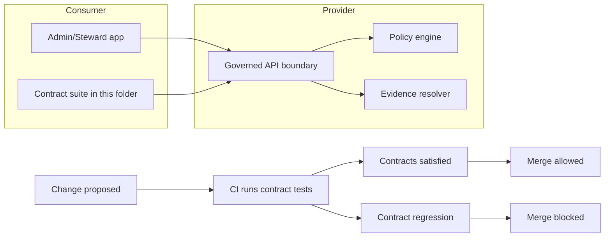

<!-- [KFM_META_BLOCK_V2]
doc_id: kfm://doc/8f3cb3a1-92f6-4b9b-86d6-2ccddf6a9df7
title: apps/admin/tests/contracts — Contract tests
type: standard
version: v1
status: draft
owners: <TODO: team or CODEOWNERS>
created: 2026-02-26
updated: 2026-02-28
policy_label: restricted
related:
  - <TODO: link to governed API OpenAPI/GraphQL/JSON Schema contracts>
  - <TODO: link to policy fixtures and Promotion Contract gates>
  - <TODO: link to evidence resolver contract and EvidenceBundle schema>
tags: [kfm, tests, contracts, admin, governance]
notes:
  - This README is intentionally fail-closed: places that depend on repo wiring are marked TODO.
  - Contract tests here are consumer-side by default (Admin/Steward expectations).
[/KFM_META_BLOCK_V2] -->

# apps/admin/tests/contracts

**Purpose:** Consumer-side contract tests for the **Admin/Steward** app to ensure it stays compatible with **governed APIs** and does not regress **policy**, **evidence**, **audit/receipt**, or **error-model** guarantees.

> Status: **draft** • Owners: **<TODO>** • Policy label: **restricted** (adjust only if fixtures in this folder are safe to be public)


---

## Navigation

- [Why this exists](#why-this-exists)
- [Scope and non-goals](#scope-and-non-goals)
- [Contract test flow](#contract-test-flow)
- [What contract means in KFM](#what-contract-means-in-kfm)
- [Contract surfaces](#contract-surfaces)
- [Directory guide](#directory-guide)
- [Run locally](#run-locally)
- [Add or update a contract test](#add-or-update-a-contract-test)
- [Contract assertions checklist](#contract-assertions-checklist)
- [CI and promotion gates](#ci-and-promotion-gates)
- [Governance and safety rules](#governance-and-safety-rules)
- [Minimum verification steps](#minimum-verification-steps)
- [Troubleshooting](#troubleshooting)

---

## Why this exists

The Admin/Steward app is part of the system’s **trust membrane**: it helps stewards review, label, and promote dataset versions. That means it must never “silently succeed” against drifted API behavior and must never encourage policy bypass.

This folder exists to:

- Detect **breaking API changes** (schema drift, renamed fields, changed error shapes) before merge.
- Enforce **policy-safe behavior** (default-deny, no restricted leakage through payloads or errors).
- Ensure “governed” operations include the **audit/receipt fields** the Admin UI needs.
- Ensure **evidence-first UX** remains possible (e.g., EvidenceRefs resolve to EvidenceBundles).

---

## Scope and non-goals

### In scope

- Consumer contract tests for Admin ↔ Governed API boundaries.
- Schema + DTO validation for responses the Admin UI renders.
- Policy posture checks (deny-by-default, obligation notices).
- Error-model invariants (stable shape, no sensitive leakage).
- Evidence resolution invariants (EvidenceRef → EvidenceBundle flow).

### Out of scope

- Unit tests (belong in the Admin unit test suite).
- Full browser E2E flows (belong in the E2E suite).
- Performance/load testing (separate harness).
- Provider-side contract verification unless explicitly wired (see [CI and promotion gates](#ci-and-promotion-gates)).

---

## Contract test flow



---

## What contract means in KFM

A *contract* is an executable assertion about an interface boundary. In KFM, contracts are not only “shape of JSON”—they include governance semantics:

- **Schema contracts**
  - OpenAPI / JSON Schema / GraphQL request + response shapes
- **Stable error model**
  - Errors are policy-safe and structurally stable (e.g., `error_code`, `message`, `audit_ref`)
- **Policy posture**
  - Default-deny; consistent 403/404 strategy; no “ghost metadata” existence leaks
- **Evidence linkage**
  - EvidenceRefs resolve (when allowed) into EvidenceBundles with digests, rights, provenance, and obligations
- **Auditability**
  - Governed operations emit/return an `audit_ref` or equivalent handle

> NOTE  
> This folder is **consumer-side** by default: tests are written from the Admin app’s expectations.  
> If you also do provider-side verification, document it in [CI and promotion gates](#ci-and-promotion-gates).

---

## Contract surfaces

This README cannot assume repo wiring (runner, scripts, contract file locations). Treat the table below as a registry you fill as you wire real paths.

| Surface | Provider API surface | Contract artifact source of truth | Key invariants this suite must assert | Notes |
|---|---|---|---|---|
| Dataset discovery | `<TODO: endpoint>` | `<TODO: OpenAPI/schema path>` | Policy-filtered results; includes dataset version identity and policy label | Admin UI uses these for Promotion Queue and Catalog surfaces |
| STAC browse/query | `<TODO: endpoint>` | `<TODO: STAC/OpenAPI path>` | No restricted assets leak; digests where required; error model stable | If tiles/PMTiles are used, test policy-safe tile behavior |
| Evidence resolve | `<TODO: endpoint>` | `<TODO: schema path>` | EvidenceRef resolves to EvidenceBundle or fails closed with policy-safe error | Must not reveal restricted existence |
| Steward actions | `<TODO: endpoint>` | `<TODO: OpenAPI/schema path>` | Role-scoped allow/deny; audit_ref present; obligations enforced | Promotion and review actions must be auditable |
| Story review/publish gates | `<TODO: endpoint>` | `<TODO: schema path>` | Publish blocked when citations cannot resolve; audit_ref included | Matches “cite-or-abstain” posture |

---

## Directory guide

### Expected layout

```text
apps/admin/tests/contracts/
├─ README.md
├─ cases/                      # contract test files (consumer-side)
│  ├─ *.test.(ts|tsx|js|py)
│  └─ ...
├─ fixtures/                   # minimal synthetic payloads, safe to commit
│  ├─ public/
│  └─ restricted_synthetic/
├─ schemas/                    # pinned schema snapshots or extracted DTO schemas (if used)
├─ helpers/                    # request clients / schema validators / auth stubs
└─ reports/                    # junit, html, diffs (gitignored)
```

### What belongs here

- Contract test code that verifies Admin ↔ Governed API boundaries.
- Synthetic fixtures that are **safe to commit**.
- Schema snapshots *only if* you have an explicit snapshot policy.

### What must not go here

- Unit tests (use the Admin unit test folder).
- Browser E2E tests (use the E2E suite).
- Real secrets, tokens, API keys, or production identifiers.
- Real restricted datasets, precise sensitive coordinates, or anything that would violate policy if leaked.

---

## Run locally

Because wiring differs by stack, treat the commands below as templates.

### 1) Find the correct test script

From repo root, inspect Admin app scripts:

```bash
cat apps/admin/package.json | sed -n '1,200p'
# Look for: test:contracts, contracts, openapi:verify, pact, schema:diff, etc.
```

### 2) Example run commands

```bash
# Option A: pnpm
pnpm -C apps/admin run test:contracts

# Option B: npm
npm --prefix apps/admin run test:contracts

# Option C: yarn
yarn --cwd apps/admin test:contracts
```

### 3) Point tests at a target API

Contract tests should run against one of:

- local dev server
- CI ephemeral environment
- a mocked server generated from the contract (preferred for consumer-side)

Use environment variables instead of hardcoding:

```bash
export ADMIN_CONTRACTS_API_BASE_URL="http://localhost:3000"  # TODO: correct port
export ADMIN_CONTRACTS_AUTH_MODE="stub"                      # TODO: stub|oidc|...
```

> WARNING  
> Never commit `.env` files containing secrets. Use `.env.example` and CI secret stores.

---

## Add or update a contract test

### Step-by-step

1) **Pick the contract source of truth**
   - OpenAPI spec, GraphQL schema, or JSON Schemas.
   - Record the path in [Related docs](#related-docs).

2) **Choose the contract level**
   - **Schema-level:** response validates against canonical schema.
   - **Semantic-level:** policy posture + evidence + error model invariants.
   - Prefer adding at least one semantic test per surface.

3) **Write a minimal fixture**
   - Smallest payload that proves the behavior.
   - Use synthetic IDs and synthetic geometry.
   - If spatial data is required, prefer generalized/synthetic geometry.

4) **Write the assertions**
   - Validate **schema**.
   - Validate **policy posture** (deny-by-default; obligations surfaced).
   - Validate **error model** shape and policy-safe messaging.
   - Validate **governance fields** needed by Admin (policy label, audit_ref, evidence).

5) **Update snapshots only with intent**
   - If you snapshot schemas/responses, the PR must explain:
     - “backwards-compatible addition”
     - or “breaking change with version bump”

6) **Make CI block on regressions**
   - Ensure this suite runs in CI and is required for merge.

### Example schema-first assertion

```ts
// PSEUDOCODE — replace with your repo's actual test framework.

import { fetchJson } from './helpers/fetchJson'
import { assertSchema } from './helpers/assertSchema'

it('GET datasets returns policy-safe discovery payload', async () => {
  const res = await fetchJson('/api/v1/datasets')

  assertSchema('contracts/schemas/datasets_list.v1.json', res)

  expect(res).toHaveProperty('items')
  expect(res.items[0]).toHaveProperty('dataset_version_id')
  expect(res.items[0]).toHaveProperty('policy_label')
})
```

### Example policy and error-model assertion

```ts
// PSEUDOCODE — replace with your repo's actual test framework.

it('denies by default and returns stable policy-safe error shape', async () => {
  const res = await fetchJson('/api/v1/restricted/surface', {
    headers: { Authorization: 'Bearer STUB_PUBLIC' }
  })

  expect(res.status).toBeOneOf([403, 404]) // must match policy strategy
  expect(res.body).toMatchObject({
    error_code: expect.any(String),
    message: expect.any(String),
    audit_ref: expect.any(String)
  })
})
```

---

## Contract assertions checklist

Use this list when adding a new test case.

### Response shape and metadata

- [ ] Response validates against the canonical schema (OpenAPI/JSON Schema/GraphQL).
- [ ] Includes **dataset_version_id** when applicable.
- [ ] Includes **artifact digests** when applicable.
- [ ] Includes a **policy label** that is safe to show.
- [ ] Includes **audit_ref** for governed operations (admin actions, publish workflows, evidence resolve failures).

### Error model and policy posture

- [ ] Errors include: **error_code**, **policy-safe message**, and **audit_ref**.
- [ ] No “ghost metadata” leaks restricted existence through different error shapes.
- [ ] 403/404 behavior is aligned to policy (deny-by-default).

### Evidence and citations

- [ ] EvidenceRefs resolve to EvidenceBundles for allowed roles.
- [ ] EvidenceBundles include digests/rights/provenance fields required for inspection.
- [ ] Publishing flows fail closed if citations cannot resolve.

### Security hygiene

- [ ] No secrets in fixtures.
- [ ] Any sensitive geometry is generalized or replaced with synthetic data.
- [ ] Tests do not depend on production identifiers.

---

## CI and promotion gates

Contract tests are part of the **fail-closed** promotion posture.

### Required CI behavior

- Run this suite on every PR that changes:
  - Admin API clients
  - Governed API schemas/routes
  - policy fixtures or evidence resolver
- Block merge if any contract test fails.

### Recommended artifacts

- JUnit (or similar) report for CI UI
- Machine-readable schema drift diff
- Short summary in PR comments (optional)

---

## Governance and safety rules

### Default-deny mindset

If a test cannot prove the contract is satisfied, it should fail.

### Synthetic data only

- Do not commit restricted datasets.
- Do not commit precise coordinates for vulnerable locations.
- Prefer generated fixtures.

### When a contract breaks

1) Decide whether it’s:
   - backwards-compatible addition (update schema + add tests)
   - breaking change (version bump + migration plan)
2) Update the Admin UI to handle the change explicitly.
3) Update [Contract surfaces](#contract-surfaces) if the source-of-truth path changed.

---

## Minimum verification steps

This README is intentionally fail-closed. To remove TODOs, capture these repo facts and update the placeholders:

- [ ] **Which spec is canonical?** Path to OpenAPI/GraphQL/JSON Schemas used by the governed API.
- [ ] **Which runner is canonical?** The exact command that runs contract tests locally and in CI.
- [ ] **Which auth modes exist?** How to run tests as `public` vs `steward` (stub tokens, OIDC, etc.).
- [ ] **Which error model is canonical?** Confirm required fields and status code strategy (403 vs 404).
- [ ] **Which EvidenceRef syntax is canonical?** Confirm the resolver accepts the same syntax used by Admin UI.
- [ ] **Which CI checks block merges?** Identify required status checks and name them in this doc.

---

## Troubleshooting

### Test passes locally, fails in CI

- Confirm CI points at the same API base URL and auth mode.
- Confirm fixtures do not depend on local-only state.

### Schema drift detected

- If intended: update versioning and snapshots and add a regression test.
- If unintended: revert or gate behind a feature flag.

### 403 vs 404 mismatch

- Treat as a security issue until proven otherwise.
- Ensure errors do not reveal restricted existence through response differences.

---

## Related docs

- Governed API contracts: `<TODO: path>`
- Policy fixtures/tests: `<TODO: path>`
- Evidence resolver contract: `<TODO: path>`

---

<a id="back-to-top"></a>
**Back to top:** [apps/admin/tests/contracts](#appsadmintestscontracts)
